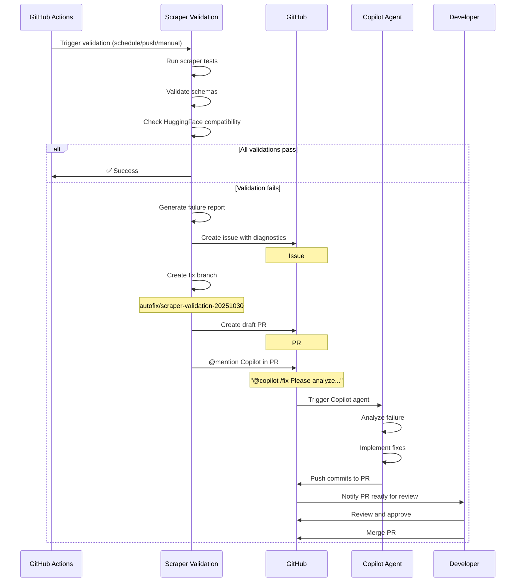
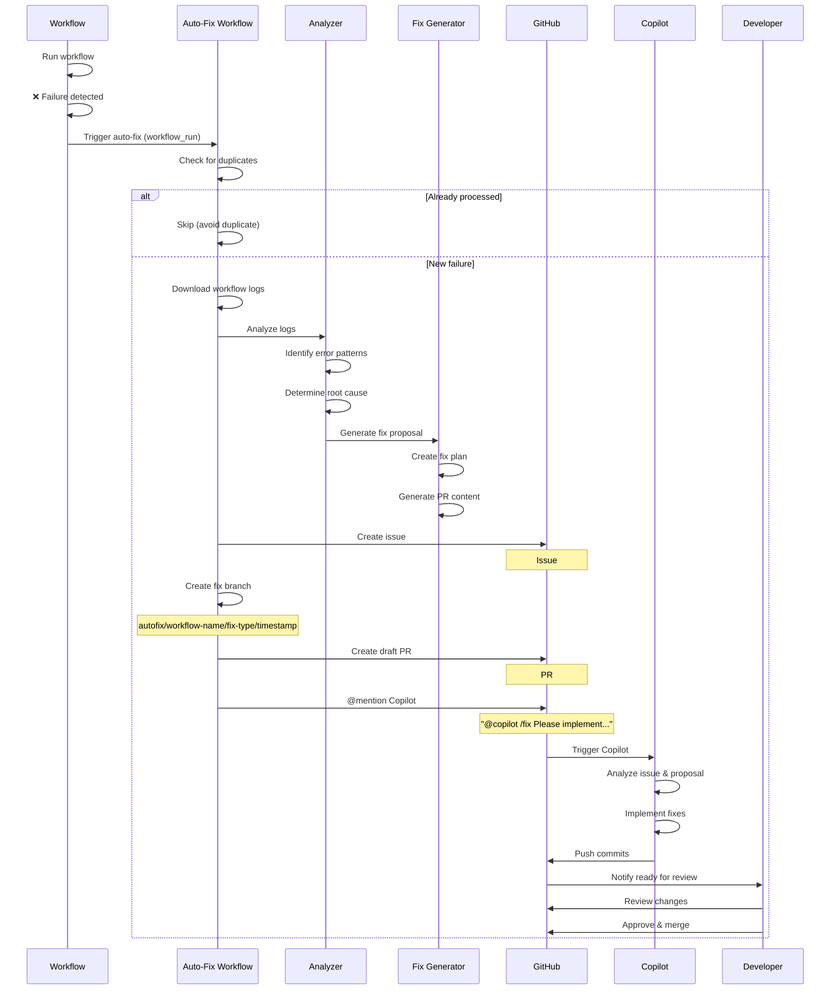
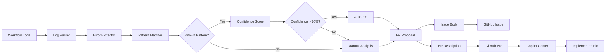
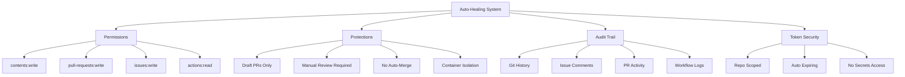
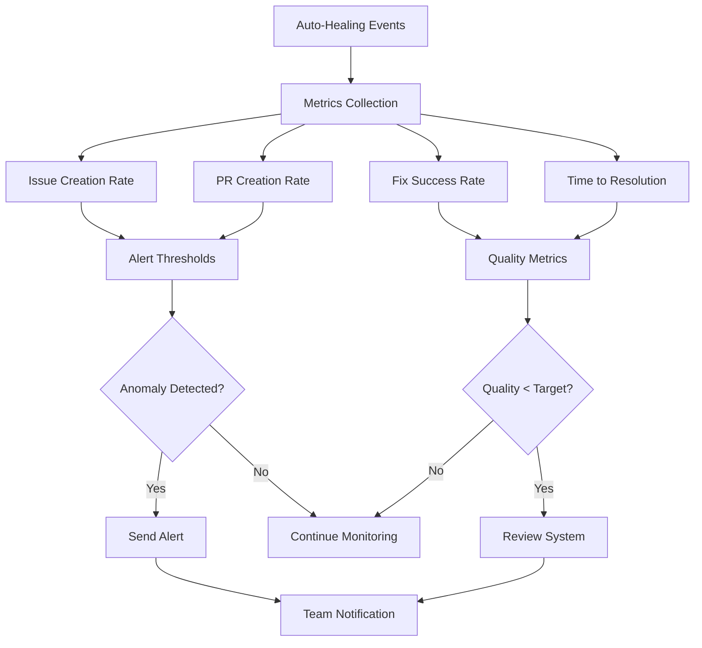

# Auto-Healing System Flow Diagrams

## Overview

These diagrams illustrate how the enhanced auto-healing system works.

## 1. Scraper Validation Auto-Healing Flow



## 2. General Workflow Auto-Healing Flow



## 3. Component Architecture

```mermaid
graph TD
    A[Workflow Failure] --> B{Auto-Healing Trigger}
    B --> C[Download Logs]
    C --> D[Analyze Failure]
    D --> E{Error Pattern Match?}
    E -->|Yes| F[Generate Fix Proposal]
    E -->|No| G[Manual Review Required]
    F --> H[Create Issue]
    H --> I[Create Branch]
    I --> J[Create Draft PR]
    J --> K[@mention Copilot]
    K --> L{Copilot Available?}
    L -->|Yes| M[Copilot Implements Fix]
    L -->|No| N[Wait for Manual Fix]
    M --> O[Automated Tests]
    O --> P{Tests Pass?}
    P -->|Yes| Q[Ready for Review]
    P -->|No| M
    N --> Q
    G --> Q
    Q --> R[Developer Review]
    R --> S{Approved?}
    S -->|Yes| T[Merge PR]
    S -->|No| U[Request Changes]
    U --> M
    T --> V[Close Issue]
```

## 4. Data Flow



## 5. Security Model



## 6. Monitoring & Metrics



## Key Concepts

### Draft PR Approach
The system creates draft PRs to:
- ✅ Provide immediate context for Copilot
- ✅ Enable @mention triggering
- ✅ Prevent accidental merges
- ✅ Allow iterative improvements
- ✅ Maintain clear audit trail

### Copilot Integration
Copilot is triggered via:
- ✅ @mention in PR comments
- ✅ `/fix` slash command
- ✅ Structured context in PR description
- ✅ Linked issue with detailed diagnostics

### Security Boundaries
- 🔒 Draft status = manual review gate
- 🔒 Repository-scoped tokens
- 🔒 No organization access
- 🔒 Container isolation
- 🔒 Full audit logging

## Usage Patterns

### Automatic Triggering
```
Workflow Fails → Auto-Healing Triggered → Issue + PR Created → Copilot Implements → Review → Merge
```

### Manual Triggering
```
Developer Runs → Validation Fails → Issue + PR Created → Copilot Implements → Review → Merge
```

### Monitoring
```
Metrics Collected → Anomalies Detected → Alerts Sent → Team Responds
```

## Success Indicators

1. **Issue Creation**: Should be 100% on failures
2. **PR Creation**: Should be 100% when fixes are available
3. **Copilot Response**: Target 80%+ response rate
4. **Merge Rate**: Target 60%+ successful auto-generated fixes
5. **Resolution Time**: Target <24 hours from failure to merge

## Legend

- 🤖 Automated process
- 👤 Manual intervention required
- ✅ Success path
- ❌ Failure path
- 🔒 Security control
- 📊 Monitoring point
