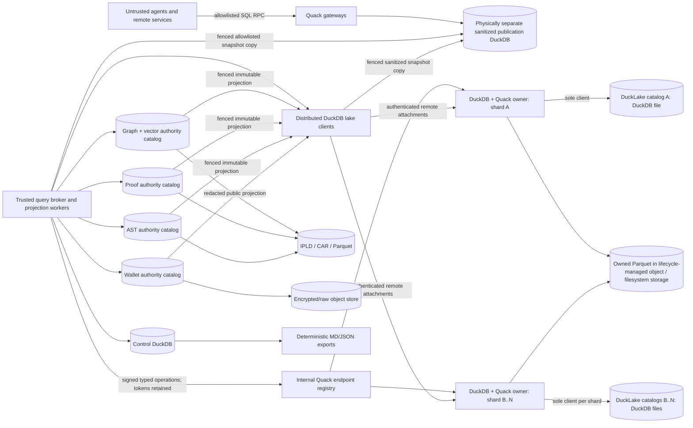

# IPFS Datasets DuckDB + Quack + DuckLake Data-Platform Improvement Plan

> Generated projection only. The DuckDB task source is authoritative; do not edit this file to steer work.

- Program: `ipfs-datasets-duckdb-quack-v1`
- Plan root: `baguqeera2obnugpa5ealv2ognm3u3iruqxlu5bmrp6zg4ic7gv4csqd7csnq`
- Repository tree: `repository:git-commit:88c7389e0c32a7d24689a076f887d59b81a3b079:tree:cfd0e7a134a234236562b0c80ed831ff683c9943`
- Database revision: `2`
- Projection CID: `baguqeerarn5pgemlqidvkkqr5die3uaokmc62ehsvblkdkxeu7zk6iit25kq`
- Export payload digest: `sha256:3dd7bfe04c504872a113a7ba5bdd6c35c79f613a8c3f00ad776ad696c163ecdb`
- Goals: 16; tasks: 97; statuses: blocked=4, completed=1, pending=92

## Decision

DuckDB tables become the authority for mutable orchestration, planning, analysis, lifecycle events, and normalized query projections. DuckLake is the governed lakehouse layer for snapshot-consistent aggregation of many Parquet datasets. Quack is a replaceable DuckDB-to-DuckDB SQL transport; neither DuckLake nor Quack is the scheduler.

Quack is deliberately only the remote SQL transport. Agent scheduling, atomic claims, leases, heartbeats, retries, idempotency, dependency resolution, dead letters, and watchdog recovery remain explicit supervisor responsibilities.

## Target topology

The small control writer is isolated from analytical scans. Only the trusted in-process broker attaches identified, mostly read-only authority catalogs. The distributed DuckLake catalog plane is built from independently fenced DuckDB + Quack owners: one owner process is the sole client of each DuckDB-backed DuckLake catalog file, while remote DuckDB workers connect through Quack and never open catalog files directly. The broker retains every Quack token and short-lived object-storage capability, and each endpoint accepts only signed typed operations. Horizontal scale comes from multiple catalog shards; bounded federation combines explicit per-shard snapshot receipts rather than pretending one DuckDB file is a replicated multi-writer database. Workers copy-publish allowlisted results into the separate public Quack database, whose process can never open DuckLake metadata or authority catalogs. Cross-file and cross-catalog changes use outboxes, immutable receipts, and idempotent reconciliation instead of assuming atomicity.

## Design principles

- No mutable operational truth in Markdown, JSON, JSONL, YAML, or ad-hoc text files.
- Keep versioned executable migrations and seed migrations in Git with checksums.
- Make Markdown/JSON deterministic one-way exports bound to a schema, revision, query, and digest.
- Keep large immutable bytes in IPLD/CAR/Parquet/object storage and address them by CID from DuckDB.
- Use DuckLake for Parquet lakehouse metadata, snapshot history, and analytical aggregation; never use it as task, lease, proof, wallet, or idempotency authority.
- Base the distributed DuckLake catalog plane on DuckDB + Quack: exactly one fenced DuckDB/Quack owner process opens each DuckDB-backed catalog file, while every distributed caller uses the authenticated remote protocol rather than opening that file directly.
- Quack lets many remote client processes use one DuckDB-backed catalog through its sole owner, but those clients never open the file and Quack supplies no replication, consensus, or high availability.
- Scale through independently fenced catalog shards and snapshot-vector federation rather than multiple owners of one catalog file.
- Manage DuckLake remotely through a dedicated trusted DuckDB + Quack catalog gateway whose token and storage credentials remain inside an allowlisted owner broker; agents submit typed operations rather than raw SQL.
- Separate the small control writer from graph/vector/proof/wallet analytical catalogs.
- Use short transactions, compare-and-swap revisions, fenced leases, idempotency keys, and append-only events.
- Treat every Quack endpoint as a full-SQL trust boundary and expose allowlisted views or query templates.
- Publish sanitized, physically separate read models to remote Quack clients; never attach authority catalogs to an untrusted session.
- Preserve existing proof authority, graph revision, vector generation, AST provenance, and wallet reorg semantics.
- Use shadow reads/writes and parity receipts before changing authority for any domain.
- Never put wallet secrets, signing material, unrestricted raw payloads, or private keys on the Quack surface.

## Catalog and table families

| Catalog | Principal tables |
|---|---|
| `asts` | `source_revisions`, `source_files`, `ast_blobs`, `ast_nodes`, `scopes`, `symbols`, `imports`, `references`, `calls`, `effects`, `interfaces`, `diagnostics`, `invalidations` |
| `control` | `programs`, `goals`, `goal_edges`, `tasks`, `task_dependencies`, `task_attempts`, `task_claims`, `leases`, `heartbeats`, `idempotency_keys`, `blockers`, `validations`, `acceptance_evidence`, `merge_receipts`, `events` |
| `ducklake_registry` | `lake_catalogs`, `lake_catalog_shards`, `lake_dataset_home_shards`, `lake_catalog_owner_generations`, `lake_datasets`, `lake_sources`, `lake_schema_contracts`, `lake_snapshot_vectors`, `lake_snapshot_vector_roots`, `lake_shard_migrations`, `lake_ingest_receipts`, `lake_file_identities`, `lake_maintenance_jobs`, `lake_backup_receipts`, `lake_publication_receipts`, `lake_release_receipts` |
| `graphs` | `graphs`, `branches`, `revisions`, `vertices`, `edges`, `properties`, `adjacency`, `pins`, `tombstones`, `parquet_segments`, `lineage` |
| `meta` | `schema_registry`, `schema_migrations`, `migration_batches`, `extension_locks`, `capability_probes`, `source_artifacts`, `export_jobs`, `snapshot_receipts` |
| `observability` | `lifecycle_events`, `traces`, `spans`, `health_samples`, `query_profiles`, `dead_letters`, `audit_events` |
| `proofs` | `proof_keys`, `proof_entries`, `proof_key_dimensions`, `premises`, `solver_runs`, `proof_evidence`, `attestations`, `invalidations`, `revocations`, `singleflight_claims`, `access_statistics` |
| `vectors` | `vector_collections`, `embedding_models`, `vector_documents`, `vector_chunks`, `vector_values_by_dimension`, `vector_shards`, `vector_index_builds`, `vector_tombstones`, `vector_compactions` |
| `wallet` | `chains`, `ingestion_sources`, `accounts`, `assets`, `blocks`, `transactions`, `transfers`, `utxos`, `token_accounts`, `contract_events`, `cursors`, `checkpoints`, `finality_transitions`, `reorgs`, `encrypted_object_refs` |

## Quack deployment constraints

- Pin DuckDB and Quack to 1.5.5 initially and repeat compatibility tests before every update.
- Quack is experimental/beta and not production-ready until DuckDB 2.0; keep a local transport implementation and feature gate, and require an explicit compatibility/risk receipt before any production promotion.
- Prefer stateless single-statement server-side SQL for mutations; avoid remote ALTER and direct attached UPDATE/DELETE dependencies.
- Retry optimistic transaction conflicts with bounded jitter and make every mutation idempotent.
- Quack has no server push, task queue, lease manager, replication, failover, or watchdog; the supervisor supplies task/lease/watchdog/fencing/restart orchestration, DQK-098 supplies cold recovery, and no component claims active replication or high availability.
- Use loopback, per-operation credentials, restricted OS identities, and a TLS reverse proxy for remote use. Publication gateways disable external access; catalog owners deny by default but allow only pinned local paths/extensions and exact object-storage/TLS-proxy egress required by their shard.
- DuckDB has no GRANT-style catalog ACL boundary: never serve or ATTACH control, proof, or wallet authority catalogs to an untrusted Quack session.
- A dedicated internal Quack endpoint may drive DuckDB DuckLake catalog operations only when its reusable token remains inside the trusted broker, one-use worker authentication is enforced by a non-default fresh-connection authentication callback or authenticating proxy, object credentials are short-lived, and every statement comes from an independently verified allowlisted typed operation.

## DuckLake deployment constraints

- Pin every explicitly loaded DuckLake catalog-owner artifact (ducklake, quack, and required httpfs/cloud adapters) to the admitted DuckDB platform; explicitly load them before locking configuration and disabling automatic installation, loading, and catalog migration.
- A DuckDB-backed DuckLake catalog is single-client: exactly one fenced DuckDB + Quack owner process may open each catalog file, and all distributed readers/writers must use that owner's remote typed interface.
- Keep live read/write catalog and companion-registry files on local or attached block storage; reject NFS, SMB, object URLs, and shared filesystem mounts for authority files, while Parquet data may use governed object storage.
- A successor owner may open a catalog only after the predecessor stopped admission, its endpoint/token was revoked, storage capabilities expired, every file handle closed, and the successor acquired both the durable generation lease and DuckDB's native file lock.
- Partition scale across independent DuckDB catalog shards and federate them with an explicit snapshot vector; never load-balance mutating requests across two active owners of the same catalog file.
- Treat every DuckLake mutation as a new catalog-global snapshot and bind multi-catalog queries to one explicit snapshot-version member per catalog because independent catalogs do not share one atomic transaction.
- DuckLake does not enforce indexes, primary keys, unique keys, foreign keys, or CHECK constraints; validate domain contracts before commit and persist reject evidence.
- Register only files in an owned lake namespace: adding an existing Parquet file transfers lifecycle ownership and later compaction or cleanup may delete it.
- Keep automatic migration off; an owner-gated migration must verify catalog version, backup both catalog metadata and Parquet storage, and emit a rollback receipt.
- Expire snapshots only under a catalog-global retention class before cleaning files, honor authoritative reader leases, dry-run destructive maintenance, and separately reconcile scheduled and orphan files.
- Enforce access through the owner broker, Quack authorization callback, catalog-owner OS identity, and object-store IAM; DuckLake itself is not the security boundary and its encrypted-file keys make the catalog sensitive.
- Never expose the authority DuckLake catalog, raw SQL surface, Quack token, or catalog credentials to agents: the dedicated trusted DuckDB + Quack catalog manager is broker-only, while agent queries use typed APIs or fenced sanitized snapshot copies in the physically separate publication database.

## Rollout and authority transition

1. Inventory and classify authored documents, mutable state, immutable evidence, and derived exports.
2. Install schema registry, checksummed migrations, capability gates, and connection policy.
3. Import legacy state in bounded idempotent batches while retaining original byte digests and reject rows.
4. Run DuckDB as a shadow projection and emit differential/parity receipts.
5. Admit owned Parquet copies into DuckLake under content-bound source, schema, ownership-transfer, and snapshot receipts.
6. Enable dual writes with a crash-recoverable outbox or journal and quarantine disagreements.
7. Canary one namespace per domain; prove restore, rollback, and fail-closed behavior.
8. Promote DuckDB authority only after acceptance gates and make legacy files export-only.
9. Scan the repository and runtime roots for residual file-authoritative producers before final cutover.

## Risks and mitigations

| Risk | Mitigation |
|---|---|
| `cid_drift` | Preserve canonical source bytes and normalization rules; never reconstruct identity-bearing proof or graph bytes from lossy columns. |
| `cross_database_atomicity` | Use transactional outboxes, immutable receipts, CIDs, and idempotent reconciliation rather than assuming cross-file atomicity. |
| `ducklake_catalog` | Use one fenced DuckDB + Quack owner per catalog shard, serialize same-shard mutations through typed idempotent operations, federate shards by snapshot vector, and never mistake lake snapshots or Quack transport for control-plane CAS authority. |
| `ducklake_file_lifecycle` | Copy sources into a lifecycle-managed owned namespace before registration; retain source CIDs as provenance and gate snapshot expiry, compaction, and orphan cleanup with dry-run evidence, authoritative reader leases, catalog-global retention, and restore tests. |
| `large_migration` | Stream and checkpoint batches; retain source hashes, rejects, resumable cursors, and bounded memory. |
| `quack_beta` | Keep transport replaceable, pin 1.5.5, contract-test known gaps, and requalify at DuckDB 2.0. |
| `sql_surface` | Deny arbitrary remote SQL for untrusted agents and forbid read_* functions, extension changes, secrets, filesystem, and network access. |
| `vector_index` | Treat DuckDB VSS/HNSW as rebuildable derived state; exact FLOAT[N] vectors and content digests remain authoritative. |
| `wallet_exposure` | Project public ledger facts only; keep secrets and unrestricted raw payloads encrypted and out of Quack-visible catalogs. |
| `writer_contention` | Use one short-transaction writer per database, leases/fencing, outboxes, and workload-separated catalogs. |

## Success metrics

- Zero mutable orchestration/planning/analysis/logging authorities remain in Markdown or JSON after cutover.
- Every schema and extension change is checksummed, replayable, and covered by compatibility tests.
- No duplicate task execution or stale publication after lease expiry, crash, or lost response.
- Graph, vector, proof, AST, and wallet predicates can execute in parallel without starving control-plane heartbeats.
- Multiple admitted Parquet datasets can be queried through a reproducible DuckLake snapshot vector while concurrent writers, retries, compaction, and cold failover converge to one logical outcome per operation ID.
- Every remote DuckLake catalog mutation is executed by DuckDB over the internal Quack manager from a signed typed operation; a crash may leave a bounded in-doubt snapshot, but restart reconciliation must map its persisted operation ID to one terminal receipt or quarantine without a second logical transition.
- Every export is reproducible from an identified database snapshot and verifies its digest.
- The 970 MB production-hardening fixture migrates by streaming within declared memory and time budgets.
- Backup/restore, parity, tamper, secret-scanning, concurrency, and chaos gates are green before authority promotion.

## Goals and subgoals

### DQK-G200: DuckDB-native agent supervisor control plane (parent `baguqeerah4zfumyxzwakq52odtax2d4375lkuvemc2p36gmhskut6cya4saq`)

- Goals/tasks/events are database authoritative
- Expired or stalled work is recovered without duplicate publication
- Plan and runtime generations activate only through an external journaled lifecycle owner

### DQK-G1100: Canary cutover and database-native self-improvement loop (parent `baguqeerah4zfumyxzwakq52odtax2d4375lkuvemc2p36gmhskut6cya4saq`)

- Canary promotion and rollback are proven
- Residual analysis creates bounded database-native subgoals/tasks

### DQK-G1210: DuckLake catalog, storage, source admission, and ingestion (parent `baguqeeran32gjonbozz46r4ndgalcw63amksmznx4k3behbiqffyjgiyotdq`)

- The catalog/storage profile is versioned, reproducible, and fail closed
- Every admitted Parquet file has schema, content, provenance, ownership, and snapshot evidence

### DQK-G000: Make DuckDB the typed authority and Quack the guarded SQL access plane

DuckDB tables become the authority for mutable orchestration, planning, analysis, lifecycle events, and normalized query projections. DuckLake is the governed lakehouse layer for snapshot-consistent aggregation of many Parquet datasets. Quack is a replaceable DuckDB-to-DuckDB SQL transport; neither DuckLake nor Quack is the scheduler.

- Zero mutable orchestration/planning/analysis/logging authorities remain in Markdown or JSON after cutover.
- Every schema and extension change is checksummed, replayable, and covered by compatibility tests.
- No duplicate task execution or stale publication after lease expiry, crash, or lost response.
- Graph, vector, proof, AST, and wallet predicates can execute in parallel without starving control-plane heartbeats.
- Multiple admitted Parquet datasets can be queried through a reproducible DuckLake snapshot vector while concurrent writers, retries, compaction, and cold failover converge to one logical outcome per operation ID.
- Every remote DuckLake catalog mutation is executed by DuckDB over the internal Quack manager from a signed typed operation; a crash may leave a bounded in-doubt snapshot, but restart reconciliation must map its persisted operation ID to one terminal receipt or quarantine without a second logical transition.
- Every export is reproducible from an identified database snapshot and verifies its digest.
- The 970 MB production-hardening fixture migrates by streaming within declared memory and time budgets.
- Backup/restore, parity, tamper, secret-scanning, concurrency, and chaos gates are green before authority promotion.

### DQK-G500: Unified proof cache, evidence, and corpus projection (parent `baguqeerah4zfumyxzwakq52odtax2d4375lkuvemc2p36gmhskut6cya4saq`)

- All authority dimensions are retained
- Revoked or stale proofs fail closed

### DQK-G1200: DuckLake distributed Parquet lakehouse and aggregation layer (parent `baguqeerah4zfumyxzwakq52odtax2d4375lkuvemc2p36gmhskut6cya4saq`)

- Many Parquet datasets are admitted and queried through reproducible snapshot vectors
- The distributed catalog plane consists of independently fenced DuckDB + Quack catalog owners; no second client opens an owned catalog file
- Remote writers, maintenance, restore, and publication preserve authority and security boundaries

### DQK-G700: Privacy-safe multi-chain wallet transaction plane (parent `baguqeerah4zfumyxzwakq52odtax2d4375lkuvemc2p36gmhskut6cya4saq`)

- Reorg/finality/checkpoint semantics pass
- No secret reaches a Quack-visible column

### DQK-G400: Typed vector lifecycle and hybrid retrieval (parent `baguqeerah4zfumyxzwakq52odtax2d4375lkuvemc2p36gmhskut6cya4saq`)

- No pickle metadata authority
- Exact and derived indexes have differential parity

### DQK-G900: Streaming imports, deterministic exports, and authority rollout (parent `baguqeerah4zfumyxzwakq52odtax2d4375lkuvemc2p36gmhskut6cya4saq`)

- Imports are resumable and idempotent
- Exports never become implicit write authorities

### DQK-G800: Parallel federated query and secure Quack gateway (parent `baguqeerah4zfumyxzwakq52odtax2d4375lkuvemc2p36gmhskut6cya4saq`)

- Queries span domains under budgets
- Control heartbeats remain within SLO during analytical load

### DQK-G1230: DuckLake security, lifecycle maintenance, recovery, and cutover (parent `baguqeeran32gjonbozz46r4ndgalcw63amksmznx4k3behbiqffyjgiyotdq`)

- Catalog and object-store permissions, encryption, backup, retention, and cleanup gates pass
- Broker-authenticated typed operations reach the private catalog-owner Quack endpoints, while untrusted agents reach only sanitized snapshot-bound projections through the separate publication gateway and legacy manifest authority is removed

### DQK-G1000: Security, observability, recovery, and compatibility (parent `baguqeerah4zfumyxzwakq52odtax2d4375lkuvemc2p36gmhskut6cya4saq`)

- Threat, chaos, restore, and compatibility gates pass
- Every blocker is typed and queryable

### DQK-G600: AST and code-evidence relational projection (parent `baguqeerah4zfumyxzwakq52odtax2d4375lkuvemc2p36gmhskut6cya4saq`)

- Incremental source revisions preserve spans and CIDs
- Impact queries join AST, proof, and graph state

### DQK-G300: Knowledge graph catalog, revisions, and query plane (parent `baguqeerah4zfumyxzwakq52odtax2d4375lkuvemc2p36gmhskut6cya4saq`)

- SQLite/JSON catalog semantics survive migration
- Parquet/IPLD identities and branch CAS remain intact

### DQK-G1220: DuckDB + Quack catalog management, snapshot-consistent federation, and parallel query (parent `baguqeeran32gjonbozz46r4ndgalcw63amksmznx4k3behbiqffyjgiyotdq`)

- A trusted broker manages every DuckDB-backed DuckLake catalog through its single fenced DuckDB + Quack owner without exposing raw SQL or credentials to agents
- Cross-dataset queries bind an explicit snapshot vector and schema contract
- Same-shard requests are serialized and idempotent while independent catalog shards execute concurrently and remain observable

### DQK-G100: Authority, schema, identity, and connection kernel (parent `baguqeerah4zfumyxzwakq52odtax2d4375lkuvemc2p36gmhskut6cya4saq`)

- Migrations replay deterministically
- Capabilities and extension versions fail closed

## Execution task graph

### DQK-001: Inventory and classify every file-authoritative producer

- Status/revision: `pending` / `1`
- Goal: `DQK-G100`; priority: `P1`; track: `foundation`
- Depends on: none
- Outputs: `ipfs_datasets_py/duckdb_control/inventory.py`, `tests/unit/duckdb_control/test_inventory.py`

Build a bounded scanner and registry that distinguishes authored documentation, mutable state, immutable evidence, derived exports, and unsafe serialization across datasets and supervisor trees.

Acceptance:

- The scanner is streaming and deterministic
- The 970 MB production-hardening corpus can be inventoried without loading it into memory
- Every record includes path, kind, size, digest, producer, consumer, and proposed authority

Validation:

- `python -m pytest -q tests/unit/duckdb_control/test_inventory.py`

### DQK-002: Pin DuckDB/Quack and implement capability gates

- Status/revision: `pending` / `1`
- Goal: `DQK-G100`; priority: `P1`; track: `foundation`
- Depends on: none
- Outputs: `ipfs_datasets_py/duckdb_control/capabilities.py`, `tests/unit/duckdb_control/test_capabilities.py`

Create a single dependency/version policy and runtime probe for DuckDB 1.5.5, the exact Quack extension build, VSS availability, protocol compatibility, and safe fallback behavior.

Acceptance:

- Mismatched server/client/extension versions fail closed
- Quack beta status is explicit
- VSS and Quack are optional feature-gated capabilities rather than import-time requirements

Validation:

- `python -m pytest -q tests/unit/duckdb_control/test_capabilities.py`

### DQK-003: Implement schema registry and checksummed migrations

- Status/revision: `pending` / `1`
- Goal: `DQK-G100`; priority: `P1`; track: `foundation`
- Depends on: `DQK-001`
- Outputs: `ipfs_datasets_py/duckdb_control/migrations.py`, `tests/unit/duckdb_control/test_migrations.py`

Add namespaced, ordered, replayable migrations with compatibility windows, checksums, lock ownership, dry-run, resume, rollback metadata, and immutable receipts.

Acceptance:

- A fresh database and an upgraded database converge to the same schema digest
- Interrupted migrations resume or fail closed
- Unknown or modified migration checksums are rejected

Validation:

- `python -m pytest -q tests/unit/duckdb_control/test_migrations.py`

### DQK-004: Define canonical identity, provenance, and blob-reference contracts

- Status/revision: `pending` / `1`
- Goal: `DQK-G100`; priority: `P1`; track: `foundation`
- Depends on: `DQK-001`
- Outputs: `ipfs_datasets_py/duckdb_control/contracts.py`, `tests/unit/duckdb_control/test_contracts.py`

Create strict shared contracts for schema IDs, database snapshots, CIDs, source byte digests, normalized timestamps, idempotency keys, export receipts, and immutable IPLD/CAR/Parquet references.

Acceptance:

- Identity-bearing source bytes round-trip without normalization drift
- JSON/floating/timestamp edge cases are covered
- Content references are storage-neutral and tamper evident

Validation:

- `python -m pytest -q tests/unit/duckdb_control/test_contracts.py`

### DQK-005: Build local and Quack catalog connection policy

- Status/revision: `pending` / `1`
- Goal: `DQK-G100`; priority: `P1`; track: `foundation`
- Depends on: `DQK-002`, `DQK-003`
- Outputs: `ipfs_datasets_py/duckdb_control/connections.py`, `tests/unit/duckdb_control/test_connections.py`

Implement short-lived local writer/read connections, attached read-only analytical catalogs, Quack URI/secrets handling, statement budgets, external-access denial, and workload isolation.

Acceptance:

- Control and analytical workloads use separate connection pools/catalogs
- Writers use bounded short transactions
- Untrusted connections cannot autoload extensions or access filesystem/network surfaces

Validation:

- `python -m pytest -q tests/unit/duckdb_control/test_connections.py`

### DQK-006: Expose schema, migration, integrity, and snapshot CLI

- Status/revision: `pending` / `1`
- Goal: `DQK-G100`; priority: `P1`; track: `foundation`
- Depends on: `DQK-003`, `DQK-004`, `DQK-005`
- Outputs: `ipfs_datasets_py/duckdb_control/cli.py`, `tests/cli/test_duckdb_control_cli.py`

Add a fail-closed operational CLI for create, migrate, inspect, check, snapshot, and capability status without accepting arbitrary SQL.

Acceptance:

- Every mutating command is idempotent and receipted
- Dry-run produces no database change
- CLI output has bounded text and structured modes

Validation:

- `python -m pytest -q tests/cli/test_duckdb_control_cli.py`

### DQK-007: Bridge and harden canonical DuckDB task-source lifecycle through the supervisor

- Status/revision: `completed` / `2`
- Goal: `DQK-G200`; priority: `P0`; track: `supervisor`
- Depends on: none
- Outputs: `ipfs_accelerate_py/ipfs_accelerate_py/agent_supervisor/merge_train.py`, `ipfs_accelerate_py/ipfs_accelerate_py/agent_supervisor/todo_daemon/implementation_supervisor.py`, `ipfs_accelerate_py/ipfs_accelerate_py/agent_supervisor/todo_daemon/implementation_daemon.py`, `ipfs_accelerate_py/ipfs_accelerate_py/agent_supervisor/duckdb_task_source.py`, `ipfs_accelerate_py/ipfs_accelerate_py/agent_supervisor/duckdb_retry_reset.py`, `ipfs_accelerate_py/test/api/test_agent_supervisor_implementation_daemon_runner.py`, `ipfs_accelerate_py/test/api/test_agent_supervisor_task_source_e2e.py`, `ipfs_accelerate_py/test/api/test_agent_supervisor_duckdb_task_source.py`, `ipfs_accelerate_py/test/api/test_agent_supervisor_duckdb_completion_evidence.py`, `ipfs_accelerate_py/test/api/test_agent_supervisor_duckdb_retry_reset.py`, `ipfs_accelerate_py/test/api/test_agent_supervisor_duckdb_merge_evidence_e2e.py`

Propagate task-source kind, sealed Python, and exact plan/repository roots through every supervisor layer; fence Markdown-only mutation; serialize local readers/writers; provide atomic consistent projections, durable post-merge evidence, authoritative completion evidence, and a governed quiescent retry/reset operation before launching this plan.

Acceptance:

- The managed child command binds DuckDB source kind, both roots, and the sealed interpreter
- Invalid UTF-8 DuckDB bytes cannot be read, renamed, or replaced as Markdown
- All local file opens share one bounded process lock and exports read one transaction
- An exact two-parent merge publishes a fsynced content-addressed receipt before task CAS and fresh-daemon replay never moves the target twice
- Completion CAS carries exact validation/merge/lease/fence evidence
- Retry/reset is operation-authorized, idempotent, quiescent, all-lane, exact-source bound and durably receipted
- Bundles and compound submodule integrations fail closed until typed member receipts exist
- Legacy Markdown behavior remains compatible

Validation:

- `cd ipfs_accelerate_py && python -m pytest -q test/api/test_agent_supervisor_implementation_daemon_runner.py test/api/test_agent_supervisor_task_source_e2e.py test/api/test_agent_supervisor_duckdb_task_source.py test/api/test_agent_supervisor_duckdb_completion_evidence.py test/api/test_agent_supervisor_duckdb_retry_reset.py test/api/test_agent_supervisor_duckdb_merge_evidence_e2e.py`

### DQK-015: Port the knowledge graph catalog from SQLite to DuckDB

- Status/revision: `pending` / `1`
- Goal: `DQK-G300`; priority: `P1`; track: `knowledge-graph`
- Depends on: `DQK-003`, `DQK-004`, `DQK-005`
- Outputs: `ipfs_datasets_py/knowledge_graphs/catalog/duckdb_store.py`, `tests/unit/knowledge_graphs/test_duckdb_catalog_store.py`

Reimplement graph/branch/revision/lease/idempotency/pin/tombstone metadata with the existing branch-head CAS and lease semantics, migrations, and differential tests.

Acceptance:

- SQLite and DuckDB traces have equivalent results
- Branch CAS conflicts fail without partial mutation
- Pins, leases, tombstones, and idempotency survive restart

Validation:

- `python -m pytest -q tests/unit/knowledge_graphs/test_duckdb_catalog_store.py`

### DQK-016: Project graph revisions and Parquet/IPLD segments into typed views

- Status/revision: `pending` / `1`
- Goal: `DQK-G300`; priority: `P1`; track: `knowledge-graph`
- Depends on: `DQK-004`, `DQK-015`
- Outputs: `ipfs_datasets_py/knowledge_graphs/storage/duckdb_projection.py`, `tests/unit/knowledge_graphs/test_duckdb_projection.py`

Define normalized vertex, edge, property, adjacency, provenance, segment, and lineage tables while preserving immutable Parquet/IPLD bytes, checksums, CIDs, staging, and success markers.

Acceptance:

- Large graph data is scanned from immutable segments rather than duplicated blindly
- Predicate pushdown works
- Projection rows bind exact graph revision and source CID

Validation:

- `python -m pytest -q tests/unit/knowledge_graphs/test_duckdb_projection.py`

### DQK-017: Persist graph transaction, MVCC, and WAL control state

- Status/revision: `pending` / `1`
- Goal: `DQK-G300`; priority: `P1`; track: `knowledge-graph`
- Depends on: `DQK-015`, `DQK-016`
- Outputs: `ipfs_datasets_py/knowledge_graphs/transactions/duckdb_state.py`, `tests/unit/knowledge_graphs/test_duckdb_transaction_state.py`

Move process-local active transaction and MVCC metadata into fenced DuckDB state while retaining the immutable IPLD WAL chain and idempotent recovery.

Acceptance:

- Crash recovery neither loses nor duplicates committed revisions
- Stale transaction owners are fenced
- WAL CIDs remain unchanged

Validation:

- `python -m pytest -q tests/unit/knowledge_graphs/test_duckdb_transaction_state.py`

### DQK-018: Integrate Cypher IR and recursive SQL query execution

- Status/revision: `pending` / `1`
- Goal: `DQK-G300`; priority: `P1`; track: `knowledge-graph`
- Depends on: `DQK-016`, `DQK-017`
- Outputs: `ipfs_datasets_py/knowledge_graphs/core/duckdb_query_executor.py`, `tests/unit/knowledge_graphs/test_duckdb_query_executor.py`

Compile supported Cypher/IR patterns to bounded parameterized DuckDB SQL and recursive CTEs, with fallback to the existing graph engine and result parity tests.

Acceptance:

- Supported queries are injection safe
- Traversal depth/rows/time are bounded
- Fallback and SQL results agree on conformance fixtures

Validation:

- `python -m pytest -q tests/unit/knowledge_graphs/test_duckdb_query_executor.py`

### DQK-019: Implement durable crypto-flow graph snapshots

- Status/revision: `pending` / `1`
- Goal: `DQK-G300`; priority: `P1`; track: `knowledge-graph`
- Depends on: `DQK-016`, `DQK-017`
- Outputs: `ipfs_datasets_py/knowledge_graphs/crypto_flows/duckdb_store.py`, `tests/unit/knowledge_graphs/test_crypto_flow_duckdb_store.py`

Add a DuckDB snapshot store for observed/asserted planes, ambiguity, retractions, reorgs, and immutable snapshot identities, replacing the in-memory-only store.

Acceptance:

- Snapshot identity is deterministic
- Reorg and retraction history is retained
- Concurrent readers never observe partial snapshots

Validation:

- `python -m pytest -q tests/unit/knowledge_graphs/test_crypto_flow_duckdb_store.py`

### DQK-020: Implement typed vector collection and lifecycle schema

- Status/revision: `pending` / `1`
- Goal: `DQK-G400`; priority: `P1`; track: `vectors`
- Depends on: `DQK-003`, `DQK-004`, `DQK-005`
- Outputs: `ipfs_datasets_py/vector_stores/duckdb_store.py`, `tests/unit/vector_stores/test_duckdb_store.py`

Add a DuckDB vector store with collection/model/chunk/generation/shard/tombstone/compaction metadata, exact dimension and dtype contracts, normalized source identities, and no pickle authority.

Acceptance:

- Update/delete cannot leave query-visible stale vectors
- Model/chunking/normalization identity is mandatory
- Generations publish atomically

Validation:

- `python -m pytest -q tests/unit/vector_stores/test_duckdb_store.py`

### DQK-021: Add exact SQL vector search and dimension-specific physical tables

- Status/revision: `pending` / `1`
- Goal: `DQK-G400`; priority: `P1`; track: `vectors`
- Depends on: `DQK-020`
- Outputs: `ipfs_datasets_py/vector_stores/duckdb_exact.py`, `tests/unit/vector_stores/test_duckdb_exact.py`

Store authoritative FLOAT[N] vectors in dimension-specific tables, implement exact distance/ranking/filtering, and bind results to collection generation and content digest.

Acceptance:

- Exact results agree with NumPy fixtures
- Mixed dimensions cannot enter one physical table
- Metadata filters and deterministic tie-breaking are covered

Validation:

- `python -m pytest -q tests/unit/vector_stores/test_duckdb_exact.py`

### DQK-022: Add capability-gated rebuildable VSS indexes

- Status/revision: `pending` / `1`
- Goal: `DQK-G400`; priority: `P1`; track: `vectors`
- Depends on: `DQK-002`, `DQK-021`
- Outputs: `ipfs_datasets_py/vector_stores/duckdb_vss.py`, `tests/unit/vector_stores/test_duckdb_vss.py`

Integrate pinned DuckDB VSS/HNSW as a derived acceleration layer with build receipts, health checks, tombstone/compaction policy, exact-search fallback, and corruption-safe rebuild.

Acceptance:

- VSS is never the identity authority
- Missing/failed extension falls back safely
- Recall and tombstone parity thresholds are explicit

Validation:

- `python -m pytest -q tests/unit/vector_stores/test_duckdb_vss.py`

### DQK-023: Migrate FAISS metadata and retain external vector adapters

- Status/revision: `pending` / `1`
- Goal: `DQK-G400`; priority: `P1`; track: `vectors`
- Depends on: `DQK-020`, `DQK-021`
- Outputs: `ipfs_datasets_py/vector_stores/duckdb_migration.py`, `tests/unit/vector_stores/test_duckdb_migration.py`

Import unsafe pickle metadata in an isolated one-time path, validate vectors/mappings, quarantine stale duplicates, and dual-read/write FAISS, Qdrant, and Elasticsearch during shadow mode.

Acceptance:

- Normal runtime never unpickles
- Every imported generation has a source digest and reject report
- External backend parity is measured before promotion

Validation:

- `python -m pytest -q tests/unit/vector_stores/test_duckdb_migration.py`

### DQK-024: Unify hybrid graph, vector, and full-text retrieval

- Status/revision: `pending` / `1`
- Goal: `DQK-G400`; priority: `P1`; track: `vectors`
- Depends on: `DQK-018`, `DQK-021`, `DQK-022`, `DQK-023`
- Outputs: `ipfs_datasets_py/knowledge_graphs/query/duckdb_hybrid_search.py`, `tests/unit/knowledge_graphs/test_duckdb_hybrid_search.py`

Create a bounded query API that combines graph predicates, exact/approximate vectors, text ranking, provenance, and revision filters without intermediate JSON serialization.

Acceptance:

- Results bind graph and vector generations
- Query budgets prevent control-plane starvation
- Legacy hybrid results meet declared differential thresholds

Validation:

- `python -m pytest -q tests/unit/knowledge_graphs/test_duckdb_hybrid_search.py`

### DQK-025: Define the unified proof cache schema and protocol

- Status/revision: `pending` / `1`
- Goal: `DQK-G500`; priority: `P1`; track: `proofs`
- Depends on: `DQK-003`, `DQK-004`, `DQK-005`
- Outputs: `ipfs_datasets_py/logic/common/duckdb_proof_store.py`, `tests/unit/logic/test_duckdb_proof_store.py`

Normalize proof keys, premises, translator/solver/toolchain/theorem-registry/policy/resource dimensions, outcomes, trust levels, evidence, access statistics, and immutable envelope references behind the existing verification cache protocol.

Acceptance:

- No existing authority dimension is dropped
- Proof/counterexample/unknown/error outcomes remain distinct
- Exact key and integrity checks fail closed

Validation:

- `python -m pytest -q tests/unit/logic/test_duckdb_proof_store.py`

### DQK-026: Import fragmented JSON proof caches with parity receipts

- Status/revision: `pending` / `1`
- Goal: `DQK-G500`; priority: `P1`; track: `proofs`
- Depends on: `DQK-001`, `DQK-025`
- Outputs: `ipfs_datasets_py/logic/common/duckdb_proof_migration.py`, `tests/unit/logic/test_duckdb_proof_migration.py`

Build streaming adapters for common, TDFOL, CEC, integration, hammers, legal IR, and external prover caches with original-byte digests, rejects, TTL/trust translation, and differential reads.

Acceptance:

- Imports are idempotent and bounded
- Ambiguous key/TTL/trust mappings quarantine rather than guess
- Whole-file JSON rewrites cease after promotion

Validation:

- `python -m pytest -q tests/unit/logic/test_duckdb_proof_migration.py`

### DQK-027: Unify proof single-flight, leases, expiry, and invalidation

- Status/revision: `pending` / `1`
- Goal: `DQK-G500`; priority: `P1`; track: `proofs`
- Depends on: `DQK-025`, `DQK-056`
- Outputs: `ipfs_datasets_py/logic/common/duckdb_proof_coordination.py`, `tests/unit/logic/test_duckdb_proof_coordination.py`

Adapt existing formal verification/evidence stores into a common fenced single-flight coordinator with dual TTL, negative caching policy, invalidation, attempt records, and stale-publication rejection.

Acceptance:

- At most one valid producer publishes per proof key
- Expired fence publication is rejected
- Waiters recover after producer crash without duplicate authority

Validation:

- `python -m pytest -q tests/unit/logic/test_duckdb_proof_coordination.py`

### DQK-028: Project proof corpus envelopes, attestations, and revocations

- Status/revision: `pending` / `1`
- Goal: `DQK-G500`; priority: `P1`; track: `proofs`
- Depends on: `DQK-025`, `DQK-026`
- Outputs: `ipfs_datasets_py/logic/proof_corpus/duckdb_repository.py`, `tests/unit/logic/test_proof_corpus_duckdb_repository.py`

Index immutable proof-corpus manifests/envelopes/revocations/attestations by verified CID while leaving identity-bearing canonical bytes in content-addressed storage.

Acceptance:

- Envelope bytes and CIDs remain unchanged
- Revoked or contradicted evidence is excluded from authoritative hits
- Tampered objects fail closed

Validation:

- `python -m pytest -q tests/unit/logic/test_proof_corpus_duckdb_repository.py`

### DQK-029: Integrate proof schedulers and formal verification caches

- Status/revision: `pending` / `1`
- Goal: `DQK-G500`; priority: `P1`; track: `proofs`
- Depends on: `DQK-027`, `DQK-028`
- Outputs: `ipfs_datasets_py/logic/common/duckdb_proof_service.py`, `tests/integration/logic/test_duckdb_proof_service.py`

Make proof plans, nodes, attempts, leases, evidence receipts, draft/attested entries, and policy gates share the unified protocol without collapsing logic-specific semantics.

Acceptance:

- Existing proof scheduler traces replay
- Authority upgrades require evidence
- Logic-family adapters preserve their reviewed keys and fallback policies

Validation:

- `python -m pytest -q tests/integration/logic/test_duckdb_proof_service.py`

### DQK-030: Expose bounded proof, graph, and applicability joins

- Status/revision: `pending` / `1`
- Goal: `DQK-G500`; priority: `P1`; track: `proofs`
- Depends on: `DQK-018`, `DQK-029`
- Outputs: `ipfs_datasets_py/logic/common/duckdb_proof_queries.py`, `tests/unit/logic/test_duckdb_proof_queries.py`

Add query templates for proof hits/misses, premises, dependency closure, graph entities, source revisions, applicability, revocation, and counterexamples with explicit authority and freshness columns.

Acceptance:

- Queries cannot promote an untrusted cache hit
- Freshness/applicability/revocation are always visible
- Recursive premise traversal is bounded

Validation:

- `python -m pytest -q tests/unit/logic/test_duckdb_proof_queries.py`

### DQK-031: Define normalized AST and code-evidence schema

- Status/revision: `pending` / `1`
- Goal: `DQK-G600`; priority: `P1`; track: `ast`
- Depends on: `DQK-003`, `DQK-004`, `DQK-005`
- Outputs: `ipfs_datasets_py/logic/software_contracts/duckdb_ast_store.py`, `tests/unit/logic/software_contracts/test_duckdb_ast_store.py`

Reuse the supervisor code-evidence projection and map canonical software-contract AST IR into source revisions, files, blobs, nodes, spans, scopes, symbols, imports, references, calls, effects, interfaces, diagnostics, and invalidations.

Acceptance:

- Canonical AST IR identity and source spans survive projection
- Datasets and supervisor do not invent incompatible AST schemas
- Parse failures are durable queryable facts

Validation:

- `python -m pytest -q tests/unit/logic/software_contracts/test_duckdb_ast_store.py`

### DQK-032: Implement incremental Python/TypeScript AST ingestion

- Status/revision: `pending` / `1`
- Goal: `DQK-G600`; priority: `P1`; track: `ast`
- Depends on: `DQK-031`
- Outputs: `ipfs_datasets_py/logic/software_contracts/duckdb_ingest.py`, `tests/unit/logic/software_contracts/test_duckdb_ingest.py`

Ingest tracked Git source revisions, reuse unchanged shards by CID, invalidate changed files/symbols/edges, and publish a complete revision atomically.

Acceptance:

- Unchanged source is not reparsed
- Deleted/renamed symbols cannot leak from older revisions
- Dirty-tree policy and Git object identity are explicit

Validation:

- `python -m pytest -q tests/unit/logic/software_contracts/test_duckdb_ingest.py`

### DQK-033: Add AST impact, conflict, and dependency queries

- Status/revision: `pending` / `1`
- Goal: `DQK-G600`; priority: `P1`; track: `ast`
- Depends on: `DQK-032`
- Outputs: `ipfs_datasets_py/logic/software_contracts/duckdb_impact.py`, `tests/unit/logic/software_contracts/test_duckdb_impact.py`

Implement bounded reverse-reference, call, import, effect, interface, semantic-dependency, and conflict closure queries used for task scopes, validation selection, and proof invalidation.

Acceptance:

- Closures bind an exact source revision
- Depth/row/time budgets are enforced
- Known impact fixtures agree with existing analyzers

Validation:

- `python -m pytest -q tests/unit/logic/software_contracts/test_duckdb_impact.py`

### DQK-034: Consume the supervisor AST and code-evidence release plane

- Status/revision: `pending` / `1`
- Goal: `DQK-G600`; priority: `P1`; track: `ast`
- Depends on: `DQK-031`, `DQK-033`, `DQK-056`
- Outputs: `ipfs_datasets_py/knowledge_graphs/adapters/duckdb_code_evidence.py`, `tests/unit/knowledge_graphs/test_duckdb_code_evidence.py`

Adapt datasets code-evidence consumers to the DQP-039 revision-bound AST, dependency, conflict, and evidence interfaces without reimplementing the supervisor stores.

Acceptance:

- The adapter verifies the exact DQP release/tree/schema identity
- No whole-artifact JSON load is required
- Datasets and supervisor projections remain schema compatible

Validation:

- `python -m pytest -q tests/unit/knowledge_graphs/test_duckdb_code_evidence.py`

### DQK-035: Define privacy-safe normalized wallet ledger schema

- Status/revision: `pending` / `1`
- Goal: `DQK-G700`; priority: `P1`; track: `wallet`
- Depends on: `DQK-003`, `DQK-004`, `DQK-005`
- Outputs: `ipfs_datasets_py/processors/wallets/duckdb_schema.py`, `tests/unit/processors/wallets/test_duckdb_schema.py`

Map chain/account/asset/block/transaction/transfer/UTXO/token-account/contract-event/cursor/checkpoint/finality/reorg models to strict typed tables with exact amount strings and public-data classification.

Acceptance:

- No float coercion of monetary amounts
- Every row binds chain/source/finality
- Secret-bearing fields and raw payloads are absent from query-visible tables

Validation:

- `python -m pytest -q tests/unit/processors/wallets/test_duckdb_schema.py`

### DQK-036: Implement transactional wallet store and durable checkpoints

- Status/revision: `pending` / `1`
- Goal: `DQK-G700`; priority: `P1`; track: `wallet`
- Depends on: `DQK-035`
- Outputs: `ipfs_datasets_py/processors/wallets/duckdb_storage.py`, `tests/unit/processors/wallets/test_duckdb_storage.py`

Replace in-memory staging/checkpoint authority with idempotent batches, CAS checkpoints, finality transitions, reorg rollback/replay, and CID references to encrypted/raw objects.

Acceptance:

- Crash recovery cannot skip or duplicate ledger records
- Checkpoint CAS rejects stale ingesters
- Reorg history is retained instead of overwritten

Validation:

- `python -m pytest -q tests/unit/processors/wallets/test_duckdb_storage.py`

### DQK-037: Import JSONL wallet records and produce typed Parquet exports

- Status/revision: `pending` / `1`
- Goal: `DQK-G700`; priority: `P1`; track: `wallet`
- Depends on: `DQK-001`, `DQK-035`, `DQK-036`
- Outputs: `ipfs_datasets_py/processors/wallets/duckdb_migration.py`, `tests/unit/processors/wallets/test_duckdb_migration.py`

Stream legacy records.jsonl, metadata sidecars, and opaque payload_json Parquet into validated rows and export typed partitions plus bounded extension fields and deterministic manifests.

Acceptance:

- Imports retain original digests and rejects
- Typed exports support predicate pushdown
- JSON manifests are generated outputs, never authority

Validation:

- `python -m pytest -q tests/unit/processors/wallets/test_duckdb_migration.py`

### DQK-038: Project wallet records into crypto-flow graph revisions

- Status/revision: `pending` / `1`
- Goal: `DQK-G700`; priority: `P1`; track: `wallet`
- Depends on: `DQK-019`, `DQK-036`
- Outputs: `ipfs_datasets_py/processors/wallets/duckdb_graph_projection.py`, `tests/unit/processors/wallets/test_duckdb_graph_projection.py`

Incrementally derive observed/asserted crypto-flow nodes and edges from normalized transactions while preserving ambiguity, retractions, finality, and reorg lineage.

Acceptance:

- Projection is idempotent by ledger and graph revision
- Reorgs retract rather than silently mutate history
- Asserted and observed planes cannot be confused

Validation:

- `python -m pytest -q tests/unit/processors/wallets/test_duckdb_graph_projection.py`

### DQK-039: Add wallet/proof/AST joins and secret-surface gates

- Status/revision: `pending` / `1`
- Goal: `DQK-G700`; priority: `P1`; track: `wallet`
- Depends on: `DQK-029`, `DQK-033`, `DQK-038`
- Outputs: `ipfs_datasets_py/processors/wallets/duckdb_queries.py`, `tests/unit/processors/wallets/test_duckdb_queries.py`

Provide allowlisted queries connecting transactions, contracts, source symbols, graph flows, and verification evidence, with secret scanning, column classification, and row/tenant policy enforcement.

Acceptance:

- Private keys/seeds/signing payloads are rejected
- Queries expose authority and finality
- Cross-domain joins obey tenant and resource budgets

Validation:

- `python -m pytest -q tests/unit/processors/wallets/test_duckdb_queries.py`

### DQK-040: Implement workload-separated catalog federation

- Status/revision: `pending` / `1`
- Goal: `DQK-G800`; priority: `P1`; track: `query`
- Depends on: `DQK-005`, `DQK-016`, `DQK-020`, `DQK-025`, `DQK-031`, `DQK-035`, `DQK-056`, `DQK-082`, `DQK-103`
- Outputs: `ipfs_datasets_py/duckdb_control/federation.py`, `tests/integration/test_duckdb_catalog_federation.py`

Federate authority catalogs only inside a trusted in-process query broker, using explicit workload routes and sanitized copy-out publications so expensive scans cannot hold the control writer or expose sensitive catalogs to Quack clients.

Acceptance:

- No GRANT-style catalog ACL is assumed
- Untrusted sessions never ATTACH authority catalogs
- Cross-catalog snapshots expose revision bindings
- Analytical cancellation leaves control-plane transactions healthy

Validation:

- `python -m pytest -q tests/integration/test_duckdb_catalog_federation.py`

### DQK-041: Build allowlisted query-template registry and budgets

- Status/revision: `pending` / `1`
- Goal: `DQK-G800`; priority: `P1`; track: `query`
- Depends on: `DQK-004`, `DQK-005`, `DQK-040`
- Outputs: `ipfs_datasets_py/duckdb_control/query_registry.py`, `tests/unit/duckdb_control/test_query_registry.py`

Replace arbitrary SQL exposure with versioned parameter schemas, prepared templates, tenant/column policy, row/byte/time/depth limits, cancellation, audit, and deterministic query receipts.

Acceptance:

- Untrusted callers cannot submit arbitrary SQL
- read_* functions and extension/filesystem/network surfaces are denied
- Receipts identify template, parameters digest, snapshot, policy, and resource usage

Validation:

- `python -m pytest -q tests/unit/duckdb_control/test_query_registry.py`

### DQK-042: Execute cross-domain queries in parallel with backpressure

- Status/revision: `pending` / `1`
- Goal: `DQK-G800`; priority: `P1`; track: `query`
- Depends on: `DQK-024`, `DQK-030`, `DQK-034`, `DQK-039`, `DQK-041`
- Outputs: `ipfs_datasets_py/duckdb_control/parallel_query.py`, `tests/integration/test_duckdb_parallel_query.py`

Add a scheduler that runs independent graph/vector/proof/AST/wallet subqueries concurrently, propagates deadlines/cancellation, joins bounded results, and reserves control-plane capacity.

Acceptance:

- Independent subqueries actually overlap
- Partial timeout/failure is typed
- Lease heartbeat p99 stays within SLO under benchmark load

Validation:

- `python -m pytest -q tests/integration/test_duckdb_parallel_query.py`

### DQK-043: Expose safe CLI and MCP query/export endpoints

- Status/revision: `pending` / `1`
- Goal: `DQK-G800`; priority: `P1`; track: `query`
- Depends on: `DQK-006`, `DQK-041`, `DQK-042`, `DQK-058`
- Outputs: `ipfs_datasets_py/mcp_server/tools/duckdb_query_tools.py`, `tests/mcp/test_duckdb_query_tools.py`

Integrate the allowlisted registry with datasets CLI/MCP tools for query, explain, export, status, and cancellation, binding callers to capabilities and snapshots.

Acceptance:

- Endpoints cannot bypass the query registry
- Cancellation and bounded pagination work
- Errors do not leak secrets, raw SQL, or tokens

Validation:

- `python -m pytest -q tests/mcp/test_duckdb_query_tools.py`

### DQK-044: Build the streaming legacy artifact importer

- Status/revision: `pending` / `1`
- Goal: `DQK-G900`; priority: `P1`; track: `migration`
- Depends on: `DQK-001`, `DQK-003`, `DQK-004`
- Outputs: `ipfs_datasets_py/duckdb_control/importer.py`, `tests/unit/duckdb_control/test_importer.py`

Import JSON/JSONL/Markdown taskboards/SQLite/Parquet/vector metadata and manifests through type-specific bounded batches, source digests, resumable cursors, reject tables, and idempotency keys.

Acceptance:

- Interrupted imports resume exactly
- Original byte digests and line/record provenance are retained
- Exports are never silently re-imported

Validation:

- `python -m pytest -q tests/unit/duckdb_control/test_importer.py`

### DQK-045: Implement deterministic Markdown, JSON, Parquet, Arrow, and CAR exports

- Status/revision: `pending` / `1`
- Goal: `DQK-G900`; priority: `P1`; track: `migration`
- Depends on: `DQK-004`, `DQK-006`, `DQK-041`
- Outputs: `ipfs_datasets_py/duckdb_control/exporter.py`, `tests/unit/duckdb_control/test_exporter.py`

Make exports explicit read-only jobs with query/template ID, parameters digest, schema version, snapshot/revision, root CID, content digest, destination policy, and replay verification.

Acceptance:

- Repeated export of one snapshot is byte-identical
- An export cannot mutate or become implicit authority
- Sensitive columns are excluded by policy

Validation:

- `python -m pytest -q tests/unit/duckdb_control/test_exporter.py`

### DQK-046: Implement shadow reads, dual writes, parity, and quarantine

- Status/revision: `pending` / `1`
- Goal: `DQK-G900`; priority: `P1`; track: `migration`
- Depends on: `DQK-002`, `DQK-003`, `DQK-004`, `DQK-044`, `DQK-045`, `DQK-081`
- Outputs: `ipfs_datasets_py/duckdb_control/authority_transition.py`, `ipfs_datasets_py/database_utils.py`, `requirements.txt`, `pyproject.toml`, `__pyproject.toml`, `setup.py`, `tests/integration/test_duckdb_authority_transition.py`

Install one domain-neutral authority-transition port in the existing datasets database factories, with legacy/shadow/dual/db-primary/export-only modes, transactional outbox recovery, parity receipts, disagreement quarantine, and explicit promotion/rollback decisions.

Acceptance:

- Crash before or after each DB/outbox boundary recovers idempotently
- Mismatch never silently promotes
- Promotion and rollback are CAS-protected, fenced, and receipted
- No implementation claims cross-filesystem atomicity
- All package metadata agrees on the pinned DuckDB compatibility window

Validation:

- `python -m pytest -q tests/integration/test_duckdb_authority_transition.py`

### DQK-047: Add checkpoint, backup, restore, compaction, and retention operations

- Status/revision: `pending` / `1`
- Goal: `DQK-G900`; priority: `P1`; track: `migration`
- Depends on: `DQK-003`, `DQK-005`, `DQK-046`
- Outputs: `ipfs_datasets_py/duckdb_control/recovery.py`, `tests/integration/test_duckdb_recovery.py`

Provide workload-aware checkpoint/backup/restore/verify/compact/retention workflows for DuckDB files and referenced immutable objects, with quiescence/fencing and disaster receipts.

Acceptance:

- Restore proves schema and snapshot digests
- Retention cannot delete referenced evidence
- Recovery does not rely on cross-database atomicity

Validation:

- `python -m pytest -q tests/integration/test_duckdb_recovery.py`

### DQK-048: Benchmark and soak the 970 MB production-hardening corpus

- Status/revision: `pending` / `1`
- Goal: `DQK-G900`; priority: `P2`; track: `migration`
- Depends on: `DQK-044`, `DQK-047`, `DQK-056`, `DQK-082`, `DQK-103`
- Outputs: `benchmarks/duckdb_quack_migration_benchmark.py`, `tests/benchmarks/test_duckdb_quack_migration_benchmark.py`

Run bounded streaming migration, event/receipt query, backup/restore, and concurrency benchmarks against the real production-hardening fixture with memory, disk, time, lock, and parity metrics.

Acceptance:

- Benchmark is resumable and does not mutate the fixture
- Peak memory and transaction latency stay within declared budgets
- Every migrated population has count and digest parity receipts

Validation:

- `python -m pytest -q tests/benchmarks/test_duckdb_quack_migration_benchmark.py`

### DQK-049: Harden Quack authentication, authorization, TLS, and process isolation

- Status/revision: `pending` / `1`
- Goal: `DQK-G1000`; priority: `P1`; track: `security`
- Depends on: `DQK-002`, `DQK-005`, `DQK-041`, `DQK-056`, `DQK-082`, `DQK-103`
- Outputs: `ipfs_datasets_py/duckdb_control/quack_security.py`, `tests/security/test_quack_security.py`

Create a Quack threat model and guarded server launcher with two explicit profiles. Sanitized publication gateways use loopback defaults, per-operation credentials, restricted OS identity, disabled external access, query authorization, audit, and a supported TLS reverse proxy. Internal DuckLake catalog owners deny by default but pre-load only pinned DuckLake/Quack/object extensions, restrict local paths/filesystems, permit egress only to the shard's exact object endpoint or TLS proxy, and install non-default fresh-connection authentication plus exact full-SQL authorization callbacks. Neither profile inherits ambient filesystem, extension, secret, or network reachability.

Acceptance:

- Default authentication and authorization are never permissive for agent traffic
- Fresh catalog-owner connections require a one-use operation capability through a non-default authentication callback or authenticating proxy
- Publication and catalog-owner profiles have distinct external-access, extension, local-path, filesystem, and egress policies
- A catalog owner can reach only its exact local catalog path and selected object endpoint/TLS proxy; a publication gateway reaches neither
- Remote plaintext exposure is rejected
- Tokens and full SQL text are handled as sensitive

Validation:

- `python -m pytest -q tests/security/test_quack_security.py`

### DQK-050: Create Quack protocol and upgrade compatibility suite

- Status/revision: `pending` / `1`
- Goal: `DQK-G1000`; priority: `P1`; track: `security`
- Depends on: `DQK-002`, `DQK-049`, `DQK-056`, `DQK-058`, `DQK-084`
- Outputs: `tests/compatibility/test_duckdb_quack_contract.py`, `scripts/validation/validate_duckdb_quack_compatibility.py`

Test local/stateless/attached sessions, transactions, large fetches, known attached UPDATE/DELETE and ALTER gaps, rollback behavior, crashed-client resource cleanup, fresh-connection authentication hooks, exact full-SQL authorization, extension pinning, and upgrade refusal against the exact DQK-084 DuckLake capability profile. Add a DuckLake-over-Quack contract slice proving one server-owned DuckDB catalog can serve concurrent remote snapshot readers without shared-session drift, one authorized remote mutation reports the expected last committed snapshot, cancellation/lost fetch releases server state, prepared parameters remain separate from the exact authorization template, and internal DuckLake metadata/file-key functions plus SHOW/duckdb_*, SET/RESET/PRAGMA/COPY/read_*/network surfaces remain unreachable.

Acceptance:

- Known gaps have tested workarounds or hard gates
- DuckLake-over-Quack snapshot reads, mutations, cancellation, authentication, parameterization, and internal-surface denial pass before DQK-104
- Two remote readers selecting distinct snapshot versions cannot change each other's server session state
- Server/client/extension mismatch fails before mutation
- Quack beta use and DuckDB 2.0 adoption each require an explicit compatibility and risk/requalification receipt

Validation:

- `python -m pytest -q tests/compatibility/test_duckdb_quack_contract.py`

### DQK-051: Add concurrency, crash, corruption, and stall chaos tests

- Status/revision: `pending` / `1`
- Goal: `DQK-G1000`; priority: `P1`; track: `security`
- Depends on: `DQK-027`, `DQK-042`, `DQK-046`, `DQK-047`, `DQK-050`, `DQK-056`
- Outputs: `tests/chaos/test_duckdb_quack_control_plane.py`, `scripts/validation/validate_duckdb_quack_chaos.py`

Inject failures at claim, heartbeat, proof publication, graph/vector/wallet batch, checkpoint, export, merge, backup, Quack response, and process death boundaries; prove bounded recovery and no duplicate authority.

Acceptance:

- Stale fences cannot publish
- No-progress and deadlock diagnoses are typed
- Recovery preserves dirty work and immutable evidence

Validation:

- `python -m pytest -q tests/chaos/test_duckdb_quack_control_plane.py`

### DQK-052: Unify observability, audit, traces, and query profiles

- Status/revision: `pending` / `1`
- Goal: `DQK-G1000`; priority: `P1`; track: `security`
- Depends on: `DQK-041`, `DQK-056`
- Outputs: `ipfs_datasets_py/duckdb_control/observability.py`, `tests/unit/duckdb_control/test_observability.py`

Store lifecycle events, trace/span correlation, health samples, query profiles, blocker transitions, dead letters, and audit records in a typed append-only observability catalog with bounded retention/export.

Acceptance:

- File mtimes are not progress authority
- Sensitive query text is redacted/classified
- Control, query, proof, graph, vector, AST, and wallet traces correlate by IDs

Validation:

- `python -m pytest -q tests/unit/duckdb_control/test_observability.py`

### DQK-053: Run domain canaries and prove cutover/rollback gates

- Status/revision: `pending` / `1`
- Goal: `DQK-G1100`; priority: `P1`; track: `rollout`
- Depends on: `DQK-024`, `DQK-030`, `DQK-034`, `DQK-039`, `DQK-046`, `DQK-047`, `DQK-051`, `DQK-052`, `DQK-056`, `DQK-058`, `DQK-060`, `DQK-063`, `DQK-066`, `DQK-069`, `DQK-072`, `DQK-075`, `DQK-078`, `DQK-081`, `DQK-099`
- Outputs: `scripts/ops/duckdb_quack_canary.py`, `tests/e2e/test_duckdb_quack_canary.py`

Canary the supervisor, proof, graph/vector, AST, wallet, observability, and DuckLake namespaces in dependency order using shadow/dual authority, SLO/parity/security/restore evidence, and an explicit rollback window.

Acceptance:

- Each authority promotion has evidence and a tested rollback
- Canary failures quarantine only their namespace
- Legacy producers become export-only after promotion

Validation:

- `python -m pytest -q tests/e2e/test_duckdb_quack_canary.py`

### DQK-054: Implement database-native residual analysis and self-improvement

- Status/revision: `pending` / `1`
- Goal: `DQK-G1100`; priority: `P1`; track: `rollout`
- Depends on: `DQK-042`, `DQK-048`, `DQK-052`, `DQK-053`, `DQK-056`
- Outputs: `ipfs_datasets_py/duckdb_control/self_improvement.py`, `tests/integration/test_duckdb_self_improvement.py`

Run bounded datasets inventory, schema, parity, performance, blocker, and coverage analyzers against identified snapshots, then submit deduplicated findings through the DQP-039 database-native planning interface.

Acceptance:

- Findings cannot bypass DQP planning/acceptance policy
- Duplicate or stale findings do not create task storms
- The loop uses DuckDB authority rather than Markdown objective refill
- Cross-repository proposals bind separate immutable Git trees and receipt identities

Validation:

- `python -m pytest -q tests/integration/test_duckdb_self_improvement.py`

### DQK-055: Complete cutover and scan for residual file authorities

- Status/revision: `pending` / `1`
- Goal: `DQK-G1100`; priority: `P0`; track: `rollout`
- Depends on: `DQK-043`, `DQK-045`, `DQK-048`, `DQK-050`, `DQK-051`, `DQK-053`, `DQK-054`, `DQK-058`, `DQK-061`, `DQK-064`, `DQK-067`, `DQK-070`, `DQK-073`, `DQK-076`, `DQK-079`, `DQK-081`, `DQK-101`
- Outputs: `scripts/validation/validate_duckdb_quack_cutover.py`, `tests/e2e/test_duckdb_quack_cutover.py`

Execute the final producer/consumer scan, prove every mutable file artifact is removed or a declared projection, freeze migration receipts, verify restore/security/performance gates, and publish deterministic release exports.

Acceptance:

- Zero undeclared mutable Markdown/JSON/JSONL or Parquet-sidecar authorities remain
- All domain and DuckLake snapshots and receipts verify
- Quack and DuckLake remain replaceable and upgrade-gated
- Final Markdown/JSON artifacts are reproducible exports only

Validation:

- `python -m pytest -q tests/e2e/test_duckdb_quack_cutover.py`

### DQK-056: Pin the completed DQP supervisor control-plane release

- Status/revision: `blocked` / `1`
- Goal: `DQK-G200`; priority: `P0`; track: `supervisor`
- Depends on: `DQK-057`
- Outputs: `ipfs_accelerate_py`

After DQP-039 completes, verify its canonical release/cutover receipt and update the datasets submodule gitlink to that exact accepted accelerator commit before admitting any supervisor-dependent cutover.

Acceptance:

- DQP-039 transitively covers DQP-001 through DQP-038
- The receipt binds exact Git tree, store generation, schema checksum, Quack profile, expiry, and accepted decision
- The parent gitlink and receipt identify the same commit
- An auditable revision-CAS changes this task directly from blocked to completed

Validation:

- `python scripts/validation/validate_accelerate_duckdb_quack_release.py --check`

### DQK-057: Implement the external DQP release verifier

- Status/revision: `pending` / `1`
- Goal: `DQK-G200`; priority: `P0`; track: `supervisor`
- Depends on: `DQK-007`
- Outputs: `scripts/validation/validate_accelerate_duckdb_quack_release.py`, `tests/integration/test_accelerate_duckdb_quack_release.py`

Implement the fail-closed JSON verifier invoked by `ack-release --receipt ...`: verify terminal DQP-039 DuckDBControlPlaneReleaseReceipt@1 joined to DQP-038 DatabaseCutoverReceipt@1, exact accelerator Git commit/tree, store generation, schema checksum, Quack compatibility profile, expiry, signature, and accepted decision, then emit the strict typed verification object consumed by the gate CAS.

Acceptance:

- CLI accepts --receipt, --accelerate-root and --json and emits ipfs_accelerate_py/agent-supervisor/duckdb-quack-release-verification@1
- Markdown and process status cannot satisfy the gate
- Missing canonical receipt query or machine-readable identity fails closed
- A stale, mismatched, expired, unsigned, or unaccepted cutover receipt is rejected

Validation:

- `python -m pytest -q tests/integration/test_accelerate_duckdb_quack_release.py`

### DQK-058: Build a physically separate sanitized Quack publication plane

- Status/revision: `pending` / `1`
- Goal: `DQK-G800`; priority: `P0`; track: `query`
- Depends on: `DQK-040`, `DQK-041`, `DQK-045`, `DQK-049`
- Outputs: `ipfs_datasets_py/duckdb_control/publication.py`, `tests/security/test_quack_publication_plane.py`

Materialize fenced, revision-bound allowlisted read models into a separate DuckDB served read-only by Quack; the Quack process must never open or ATTACH control, proof, graph-writer, AST-writer, or wallet authority databases.

Acceptance:

- Sensitive/internal tables and wallet raw columns are physically absent
- The broker retains authority tokens and clients receive no writer credential
- ATTACH, COPY, INSTALL, LOAD, CREATE SECRET, read_* and HTTP/S3 access fail
- Killing or overloading Quack cannot block authority writers

Validation:

- `python -m pytest -q tests/security/test_quack_publication_plane.py`

### DQK-059: Integrate graph producers and run DuckDB shadow authority

- Status/revision: `pending` / `1`
- Goal: `DQK-G300`; priority: `P1`; track: `knowledge-graph`
- Depends on: `DQK-015`, `DQK-016`, `DQK-017`, `DQK-018`, `DQK-019`, `DQK-046`
- Outputs: `ipfs_datasets_py/knowledge_graphs/catalog/store.py`, `ipfs_datasets_py/knowledge_graphs/service.py`, `ipfs_datasets_py/knowledge_graphs/core/graph_engine.py`, `ipfs_datasets_py/knowledge_graphs/transactions/manager.py`, `ipfs_datasets_py/knowledge_graphs/storage/hybrid.py`, `ipfs_datasets_py/knowledge_graphs/crypto_flows/store.py`, `tests/integration/knowledge_graphs/test_duckdb_shadow_authority.py`

Route the existing graph catalog service, engine, transactions, storage, and crypto-flow snapshot producers through the authority port while SQLite/JSON remains authoritative and DuckDB emits parity receipts.

Acceptance:

- Branch CAS, leases, pins, tombstones, WAL/MVCC, restart and crypto-flow histories have SQLite/DuckDB parity
- Every producer operation has an idempotent DB operation ID
- Parquet/IPLD bytes, checksums, and CIDs remain unchanged

Validation:

- `python -m pytest -q tests/integration/knowledge_graphs/test_duckdb_shadow_authority.py`

### DQK-060: Promote graph control metadata to DuckDB authority

- Status/revision: `pending` / `1`
- Goal: `DQK-G300`; priority: `P1`; track: `knowledge-graph`
- Depends on: `DQK-024`, `DQK-059`
- Outputs: `ipfs_datasets_py/knowledge_graphs/catalog/store.py`, `ipfs_datasets_py/knowledge_graphs/client.py`, `ipfs_datasets_py/knowledge_graphs/transactions/manager.py`, `ipfs_datasets_py/knowledge_graphs/storage/hybrid.py`, `tests/integration/knowledge_graphs/test_duckdb_authority_cutover.py`

Run fenced dual writes and promote DuckDB as authority for graph catalog and transaction-control metadata while immutable Parquet/IPLD revisions remain the content authority.

Acceptance:

- No branch-head split brain or lost transaction under crash/restart
- Readers bind one revision during promotion
- Legacy writes are outbox projections and rollback is receipted

Validation:

- `python -m pytest -q tests/integration/knowledge_graphs/test_duckdb_authority_cutover.py`

### DQK-061: Remove SQLite and JSON graph-control authority

- Status/revision: `pending` / `1`
- Goal: `DQK-G300`; priority: `P0`; track: `knowledge-graph`
- Depends on: `DQK-053`, `DQK-058`, `DQK-060`
- Outputs: `ipfs_datasets_py/knowledge_graphs/catalog/store.py`, `ipfs_datasets_py/knowledge_graphs/service.py`, `ipfs_datasets_py/knowledge_graphs/storage/hybrid.py`, `tests/e2e/knowledge_graphs/test_duckdb_only_graph_control.py`

Remove implicit SQLite fallback and mutable JSON control reads/writes from graph producers, retaining only explicit import/export compatibility and immutable identity-bearing manifests.

Acceptance:

- Graph service starts from DuckDB plus immutable Parquet/IPLD with legacy catalog files absent
- Static and dynamic guards find no mutable graph-control file writer
- Only sanitized graph views reach the publication database

Validation:

- `python -m pytest -q tests/e2e/knowledge_graphs/test_duckdb_only_graph_control.py`

### DQK-062: Integrate vector producers and run DuckDB metadata shadowing

- Status/revision: `pending` / `1`
- Goal: `DQK-G400`; priority: `P1`; track: `vectors`
- Depends on: `DQK-020`, `DQK-021`, `DQK-022`, `DQK-023`, `DQK-046`
- Outputs: `ipfs_datasets_py/vector_stores/manager.py`, `ipfs_datasets_py/vector_stores/management_engine.py`, `ipfs_datasets_py/vector_stores/api.py`, `ipfs_datasets_py/vector_stores/faiss_store.py`, `ipfs_datasets_py/vector_stores/ipld_vector_store.py`, `ipfs_datasets_py/vector_stores/ipld.py`, `ipfs_datasets_py/vector_stores/qdrant_store.py`, `ipfs_datasets_py/vector_stores/elasticsearch_store.py`, `ipfs_datasets_py/embeddings/shard_embeddings_engine.py`, `ipfs_datasets_py/ml/embeddings/ipfs_knn_index.py`, `ipfs_datasets_py/processors/storage/ipld/vector_store.py`, `ipfs_datasets_py/mcp_server/tools/vector_tools/vector_store_management.py`, `ipfs_datasets_py/mcp_server/tools/vector_tools/shared_state.py`, `tests/integration/vector_stores/test_duckdb_shadow_catalog.py`

Route collection, model, chunk, mapping, generation, shard, tombstone, and build producers in the manager/API and FAISS/IPLD/Qdrant/Elasticsearch adapters through the DuckDB vector catalog.

Acceptance:

- All adapters and MCP create/list/delete entrypoints have mapping/count/query parity across restart
- Dimension, dtype, model, chunking, normalization and source revision are exact
- metadata.json, shard manifests, IPFS KNN mappings and duplicate IPLD stores are covered
- Shadow failures quarantine without changing legacy authority

Validation:

- `python -m pytest -q tests/integration/vector_stores/test_duckdb_shadow_catalog.py`

### DQK-063: Promote vector lifecycle metadata to DuckDB authority

- Status/revision: `pending` / `1`
- Goal: `DQK-G400`; priority: `P1`; track: `vectors`
- Depends on: `DQK-024`, `DQK-062`
- Outputs: `ipfs_datasets_py/vector_stores/manager.py`, `ipfs_datasets_py/vector_stores/management_engine.py`, `ipfs_datasets_py/vector_stores/api.py`, `ipfs_datasets_py/vector_stores/faiss_store.py`, `ipfs_datasets_py/vector_stores/ipld_vector_store.py`, `ipfs_datasets_py/vector_stores/ipld.py`, `ipfs_datasets_py/vector_stores/qdrant_store.py`, `ipfs_datasets_py/vector_stores/elasticsearch_store.py`, `ipfs_datasets_py/embeddings/shard_embeddings_engine.py`, `ipfs_datasets_py/ml/embeddings/ipfs_knn_index.py`, `ipfs_datasets_py/processors/storage/ipld/vector_store.py`, `ipfs_datasets_py/mcp_server/tools/vector_tools/vector_store_management.py`, `ipfs_datasets_py/mcp_server/tools/vector_tools/shared_state.py`, `tests/integration/vector_stores/test_duckdb_authority_cutover.py`

Run dual mode and promote DuckDB collection/generation/tombstone/compaction metadata while vector bytes remain in the selected engine or immutable segment.

Acceptance:

- Update/delete cannot resurrect stale or duplicate live vectors
- External backend failures retry idempotently
- VSS remains derived and exact-search fallback stays available

Validation:

- `python -m pytest -q tests/integration/vector_stores/test_duckdb_authority_cutover.py`

### DQK-064: Remove pickle and ad-hoc vector metadata authority

- Status/revision: `pending` / `1`
- Goal: `DQK-G400`; priority: `P0`; track: `vectors`
- Depends on: `DQK-053`, `DQK-058`, `DQK-063`
- Outputs: `ipfs_datasets_py/vector_stores/manager.py`, `ipfs_datasets_py/vector_stores/management_engine.py`, `ipfs_datasets_py/vector_stores/api.py`, `ipfs_datasets_py/vector_stores/faiss_store.py`, `ipfs_datasets_py/vector_stores/ipld_vector_store.py`, `ipfs_datasets_py/vector_stores/ipld.py`, `ipfs_datasets_py/embeddings/shard_embeddings_engine.py`, `ipfs_datasets_py/ml/embeddings/ipfs_knn_index.py`, `ipfs_datasets_py/processors/storage/ipld/vector_store.py`, `ipfs_datasets_py/mcp_server/tools/vector_tools/vector_store_management.py`, `ipfs_datasets_py/mcp_server/tools/vector_tools/shared_state.py`, `tests/e2e/vector_stores/test_duckdb_only_vector_metadata.py`

Make FAISS pickle and process-local mappings one-time import compatibility only, with no silent fallback after DuckDB promotion.

Acceptance:

- Normal runtime never reads or writes *_metadata.pkl, vector_indexes/*/metadata.json, shard JSON, or mutable manifest JSON
- MCP and manager restart from DuckDB plus vector segments without process-local mapping loss
- Publication exposes approved collection/build statistics rather than unrestricted embeddings

Validation:

- `python -m pytest -q tests/e2e/vector_stores/test_duckdb_only_vector_metadata.py`

### DQK-065: Integrate all proof producers and run DuckDB shadowing

- Status/revision: `pending` / `1`
- Goal: `DQK-G500`; priority: `P1`; track: `proof`
- Depends on: `DQK-025`, `DQK-026`, `DQK-027`, `DQK-028`, `DQK-029`, `DQK-046`
- Outputs: `ipfs_datasets_py/logic/common/proof_cache.py`, `ipfs_datasets_py/logic/hammers/proof_cache.py`, `ipfs_datasets_py/logic/legal_ir/proof_cache.py`, `ipfs_datasets_py/logic/integration/proof_cache.py`, `ipfs_datasets_py/logic/integration/caching/proof_cache.py`, `ipfs_datasets_py/logic/integration/caching/ipfs_proof_cache.py`, `ipfs_datasets_py/logic/external_provers/proof_cache.py`, `ipfs_datasets_py/logic/TDFOL/tdfol_proof_cache.py`, `ipfs_datasets_py/logic/CEC/native/cec_proof_cache.py`, `ipfs_datasets_py/logic/CEC/optimization/formula_cache.py`, `ipfs_datasets_py/logic/flogic/flogic_proof_cache.py`, `ipfs_datasets_py/logic/security_ir/constraint_cache.py`, `ipfs_datasets_py/optimizers/logic_theorem_optimizer/formula_cache.py`, `tests/integration/logic/test_duckdb_proof_shadow.py`

Place every proof-cache lookup/write, single-flight claim, attempt, attestation, invalidation, and corpus-index mutation behind the unified repository while retaining each logic family's authority dimensions and immutable envelope bytes.

Acceptance:

- No hit crosses incompatible solver/toolchain/premise/policy identities
- Trust mismatches fail closed
- Every legacy backend has differential receipts
- Proof envelope bytes and CIDs remain unchanged

Validation:

- `python -m pytest -q tests/integration/logic/test_duckdb_proof_shadow.py`

### DQK-066: Promote proof cache and query state to DuckDB authority

- Status/revision: `pending` / `1`
- Goal: `DQK-G500`; priority: `P1`; track: `proof`
- Depends on: `DQK-030`, `DQK-065`
- Outputs: `ipfs_datasets_py/logic/common/proof_cache.py`, `ipfs_datasets_py/logic/hammers/proof_cache.py`, `ipfs_datasets_py/logic/legal_ir/proof_cache.py`, `ipfs_datasets_py/logic/integration/proof_cache.py`, `ipfs_datasets_py/logic/integration/caching/proof_cache.py`, `ipfs_datasets_py/logic/integration/caching/ipfs_proof_cache.py`, `ipfs_datasets_py/logic/external_provers/proof_cache.py`, `ipfs_datasets_py/logic/TDFOL/tdfol_proof_cache.py`, `ipfs_datasets_py/logic/CEC/native/cec_proof_cache.py`, `ipfs_datasets_py/logic/CEC/optimization/formula_cache.py`, `ipfs_datasets_py/logic/flogic/flogic_proof_cache.py`, `ipfs_datasets_py/logic/security_ir/constraint_cache.py`, `ipfs_datasets_py/logic/proof_corpus/store.py`, `ipfs_datasets_py/optimizers/logic_theorem_optimizer/formula_cache.py`, `tests/integration/logic/test_duckdb_proof_authority.py`

Run dual mode and promote mutable proof cache, index, single-flight, expiry, invalidation, revocation, access, and scheduler state to DuckDB.

Acceptance:

- Concurrent single-flight, stale fence, expiry, revocation, tamper and restart tests pass
- The corpus index rebuilds from immutable envelopes
- No promoted operation rewrites a whole JSON cache

Validation:

- `python -m pytest -q tests/integration/logic/test_duckdb_proof_authority.py`

### DQK-067: Remove JSON proof cache and index authority

- Status/revision: `pending` / `1`
- Goal: `DQK-G500`; priority: `P0`; track: `proof`
- Depends on: `DQK-053`, `DQK-058`, `DQK-066`
- Outputs: `ipfs_datasets_py/logic/common/proof_cache.py`, `ipfs_datasets_py/logic/hammers/proof_cache.py`, `ipfs_datasets_py/logic/legal_ir/proof_cache.py`, `ipfs_datasets_py/logic/integration/proof_cache.py`, `ipfs_datasets_py/logic/integration/caching/proof_cache.py`, `ipfs_datasets_py/logic/integration/caching/ipfs_proof_cache.py`, `ipfs_datasets_py/logic/external_provers/proof_cache.py`, `ipfs_datasets_py/logic/TDFOL/tdfol_proof_cache.py`, `ipfs_datasets_py/logic/CEC/native/cec_proof_cache.py`, `ipfs_datasets_py/logic/CEC/optimization/formula_cache.py`, `ipfs_datasets_py/logic/flogic/flogic_proof_cache.py`, `ipfs_datasets_py/logic/security_ir/constraint_cache.py`, `ipfs_datasets_py/logic/proof_corpus/store.py`, `ipfs_datasets_py/optimizers/logic_theorem_optimizer/formula_cache.py`, `tests/e2e/logic/test_duckdb_only_proof_state.py`

Convert mutable JSON cache files and index.json into explicit import/export compatibility while immutable per-CID proof envelopes remain canonical evidence.

Acceptance:

- Mutable proof, constraint, formula and IPFS-pin operations work with every legacy cache/index file absent
- Compatibility shims import the unified repository and static guards reject direct JSON persistence
- Profile, declaration, solver, premise, policy, trust and revocation dimensions retain parity
- Only policy-approved proof summaries enter the publication plane

Validation:

- `python -m pytest -q tests/e2e/logic/test_duckdb_only_proof_state.py`

### DQK-068: Integrate AST and code-evidence producers in shadow mode

- Status/revision: `pending` / `1`
- Goal: `DQK-G600`; priority: `P1`; track: `ast`
- Depends on: `DQK-031`, `DQK-032`, `DQK-033`, `DQK-034`, `DQK-046`
- Outputs: `ipfs_datasets_py/logic/software_contracts/repository.py`, `ipfs_datasets_py/logic/software_contracts/cache.py`, `ipfs_datasets_py/logic/software_contracts/registry.py`, `ipfs_datasets_py/knowledge_graphs/adapters/code_evidence.py`, `tests/integration/logic/software_contracts/test_duckdb_ast_shadow.py`

Make repository extraction, software-contract caches, and code-evidence consumers write normalized AST blobs, symbols, imports, calls, effects, diagnostics, and evidence edges through the authority port.

Acceptance:

- JSON bundle and DB projections have differential parity
- Source/hash/span/CID identity is exact
- Python and TypeScript parse failures remain durable without blocking unrelated files

Validation:

- `python -m pytest -q tests/integration/logic/software_contracts/test_duckdb_ast_shadow.py`

### DQK-069: Promote AST and evidence consumers to DuckDB authority

- Status/revision: `pending` / `1`
- Goal: `DQK-G600`; priority: `P1`; track: `ast`
- Depends on: `DQK-068`
- Outputs: `ipfs_datasets_py/logic/software_contracts/repository.py`, `ipfs_datasets_py/logic/software_contracts/cache.py`, `ipfs_datasets_py/knowledge_graphs/adapters/code_evidence.py`, `tests/integration/logic/software_contracts/test_duckdb_ast_authority.py`

Run dual writes and make the DuckDB repository the default source for conflict, dependency, impact, validation-selection, and code-evidence consumers.

Acceptance:

- Restart and source invalidation leave no stale symbol or edge
- Scheduling/impact decisions agree during parity soak
- JSON bundles are deterministic outbox exports

Validation:

- `python -m pytest -q tests/integration/logic/software_contracts/test_duckdb_ast_authority.py`

### DQK-070: Remove analysis-bundle file authority

- Status/revision: `pending` / `1`
- Goal: `DQK-G600`; priority: `P0`; track: `ast`
- Depends on: `DQK-053`, `DQK-058`, `DQK-069`
- Outputs: `ipfs_datasets_py/logic/software_contracts/repository.py`, `ipfs_datasets_py/knowledge_graphs/adapters/code_evidence.py`, `tests/e2e/logic/software_contracts/test_duckdb_only_ast_evidence.py`

Stop polling/loading analysis_ast_index, objective, dependency, conflict, and code-evidence JSON as operational state; retain explicit compatibility exports only.

Acceptance:

- AST/evidence consumers operate with legacy bundles absent
- Direct bundle writes occur only through named export commands
- Publication views apply repository and tenant filtering

Validation:

- `python -m pytest -q tests/e2e/logic/software_contracts/test_duckdb_only_ast_evidence.py`

### DQK-071: Integrate processor wallet ledger and checkpoint producers in shadow mode

- Status/revision: `pending` / `1`
- Goal: `DQK-G700`; priority: `P1`; track: `wallet`
- Depends on: `DQK-035`, `DQK-036`, `DQK-037`, `DQK-038`, `DQK-039`, `DQK-046`
- Outputs: `ipfs_datasets_py/processors/wallets/storage.py`, `ipfs_datasets_py/processors/wallets/checkpoints.py`, `ipfs_datasets_py/processors/wallets/pipeline.py`, `ipfs_datasets_py/processors/wallets/api.py`, `ipfs_datasets_py/processors/wallets/registry.py`, `tests/integration/processors/wallets/test_duckdb_shadow_ledger.py`

Inject the DuckDB ledger/checkpoint store into multi-chain storage, checkpoints, pipeline, API, and registry paths so blocks, transactions, transfers, UTXOs, events, cursors, finality, and reorgs shadow at ingestion time.

Acceptance:

- All chain fixtures match JSONL and DB projections
- Checkpoint/reorg/deterministic-ID parity passes
- Secrets, signing payloads and unrestricted raw bytes never enter DuckDB

Validation:

- `python -m pytest -q tests/integration/processors/wallets/test_duckdb_shadow_ledger.py`

### DQK-072: Promote processor wallet ledger state to DuckDB authority

- Status/revision: `pending` / `1`
- Goal: `DQK-G700`; priority: `P1`; track: `wallet`
- Depends on: `DQK-071`
- Outputs: `ipfs_datasets_py/processors/wallets/storage.py`, `ipfs_datasets_py/processors/wallets/checkpoints.py`, `ipfs_datasets_py/processors/wallets/pipeline.py`, `ipfs_datasets_py/processors/wallets/export.py`, `tests/integration/processors/wallets/test_duckdb_authority_cutover.py`

Run dual mode and make DuckDB authoritative for normalized ledger state and checkpoints; JSONL, Parquet, Arrow and CAR become outbox-driven exports.

Acceptance:

- Kill/restart at page, block, reorg and export boundaries loses or duplicates no record
- Stale cursor CAS fails
- Typed Parquet supports predicate pushdown without opaque-only payload authority

Validation:

- `python -m pytest -q tests/integration/processors/wallets/test_duckdb_authority_cutover.py`

### DQK-073: Remove processor wallet records and checkpoint file authority

- Status/revision: `pending` / `1`
- Goal: `DQK-G700`; priority: `P0`; track: `wallet`
- Depends on: `DQK-053`, `DQK-058`, `DQK-072`
- Outputs: `ipfs_datasets_py/processors/wallets/storage.py`, `ipfs_datasets_py/processors/wallets/checkpoints.py`, `ipfs_datasets_py/processors/wallets/export.py`, `tests/e2e/processors/wallets/test_duckdb_only_wallet_ledger.py`

Remove implicit records.jsonl, .meta.json, JSON manifest, and in-memory checkpoint authority, keeping explicit imports/exports and encrypted/CID raw-object references.

Acceptance:

- Ingestion resumes from DuckDB with legacy files absent
- No raw secret-bearing data reaches the publication database
- Quack exposes redacted public ledger analytics only

Validation:

- `python -m pytest -q tests/e2e/processors/wallets/test_duckdb_only_wallet_ledger.py`

### DQK-074: Integrate legacy data-wallet producers in shadow mode

- Status/revision: `pending` / `1`
- Goal: `DQK-G700`; priority: `P1`; track: `wallet`
- Depends on: `DQK-035`, `DQK-046`
- Outputs: `ipfs_datasets_py/wallet/repository.py`, `ipfs_datasets_py/wallet/service.py`, `ipfs_datasets_py/wallet/api.py`, `ipfs_datasets_py/wallet/cli.py`, `ipfs_datasets_py/wallet/duckdb_repository.py`, `tests/integration/wallet/test_duckdb_shadow_repository.py`

Introduce a DuckDB repository/event port used by wallet repository, service, API, CLI, analytics, audit, and manifest mutations while encrypted blobs remain outside DuckDB and Quack.

Acceptance:

- Every service mutation has an idempotent operation ID and parity receipt
- wallet JSON and analytics-ledger round-trip exactly
- Plaintext, keys, wraps and encrypted bytes are excluded from query publications

Validation:

- `python -m pytest -q tests/integration/wallet/test_duckdb_shadow_repository.py`

### DQK-075: Promote legacy data-wallet metadata to DuckDB authority

- Status/revision: `pending` / `1`
- Goal: `DQK-G700`; priority: `P1`; track: `wallet`
- Depends on: `DQK-074`
- Outputs: `ipfs_datasets_py/wallet/repository.py`, `ipfs_datasets_py/wallet/service.py`, `ipfs_datasets_py/wallet/api.py`, `ipfs_datasets_py/wallet/cli.py`, `tests/integration/wallet/test_duckdb_authority_cutover.py`

Run dual mode and make DuckDB authoritative for mutable wallet manifests, analytics, audit chain, grants, approvals, and public metadata while encrypted content stays in its content-addressed blob backend.

Acceptance:

- Concurrent API/CLI mutation, audit verification, grant lifecycle, restart and blob outage tests pass
- Snapshot and analytics hashes remain stable
- Stale service instances cannot overwrite a newer revision

Validation:

- `python -m pytest -q tests/integration/wallet/test_duckdb_authority_cutover.py`

### DQK-076: Remove legacy data-wallet JSON repository authority

- Status/revision: `pending` / `1`
- Goal: `DQK-G700`; priority: `P0`; track: `wallet`
- Depends on: `DQK-053`, `DQK-058`, `DQK-075`
- Outputs: `ipfs_datasets_py/wallet/repository.py`, `ipfs_datasets_py/wallet/service.py`, `ipfs_datasets_py/wallet/api.py`, `ipfs_datasets_py/wallet/cli.py`, `tests/e2e/wallet/test_duckdb_only_wallet_repository.py`

Replace direct reads/writes and glob discovery of wallet-*.json and analytics-ledger.json with DuckDB repository calls; LocalWalletRepository remains explicit import/export compatibility only.

Acceptance:

- Service/API/CLI work with wallet JSON files absent
- A filesystem guard catches implicit snapshot or analytics-ledger writes
- Only separately approved aggregate analytics reach Quack

Validation:

- `python -m pytest -q tests/e2e/wallet/test_duckdb_only_wallet_repository.py`

### DQK-077: Integrate audit, metric, alert, and structured-log producers in shadow mode

- Status/revision: `pending` / `1`
- Goal: `DQK-G1000`; priority: `P1`; track: `security`
- Depends on: `DQK-046`, `DQK-052`
- Outputs: `ipfs_datasets_py/duckdb_control/observability_adapters.py`, `ipfs_datasets_py/audit/audit_logger.py`, `ipfs_datasets_py/logic/security/audit_log.py`, `ipfs_datasets_py/logic/observability/structured_logging.py`, `ipfs_datasets_py/optimizers/graphrag/audit_logger.py`, `ipfs_datasets_py/optimizers/graphrag/pipeline_json_logger.py`, `ipfs_datasets_py/optimizers/common/logging_audit.py`, `ipfs_datasets_py/alerts/alert_manager.py`, `ipfs_datasets_py/mcp_server/logger.py`, `tests/integration/test_duckdb_observability_shadow.py`

Route existing audit, security, GraphRAG, observability, MCP, alert, and provenance event producers through the typed observability repository while their legacy file sinks remain an explicitly selected shadow authority.

Acceptance:

- Every mutable log/audit/alert record has a typed schema, stable event ID, classification, source revision and parity receipt
- Retries and restarts do not duplicate events
- Secrets and unrestricted SQL are redacted before persistence or publication
- Immutable evidence blobs remain content-addressed outside DuckDB

Validation:

- `python -m pytest -q tests/integration/test_duckdb_observability_shadow.py`

### DQK-078: Promote typed observability state to DuckDB authority

- Status/revision: `pending` / `1`
- Goal: `DQK-G1000`; priority: `P1`; track: `security`
- Depends on: `DQK-077`
- Outputs: `ipfs_datasets_py/duckdb_control/observability_cutover.py`, `ipfs_datasets_py/audit/audit_logger.py`, `ipfs_datasets_py/logic/security/audit_log.py`, `ipfs_datasets_py/logic/observability/structured_logging.py`, `ipfs_datasets_py/optimizers/graphrag/audit_logger.py`, `ipfs_datasets_py/optimizers/graphrag/pipeline_json_logger.py`, `ipfs_datasets_py/optimizers/common/logging_audit.py`, `ipfs_datasets_py/alerts/alert_manager.py`, `ipfs_datasets_py/mcp_server/logger.py`, `tests/integration/test_duckdb_observability_cutover.py`

Run fenced dual writes and promote lifecycle, audit, metric, alert, trace, query-profile, blocker, and provenance-event state to DuckDB, leaving standard stderr/console output as a disposable operational projection.

Acceptance:

- One identified snapshot answers cross-domain audit and progress queries without scanning JSONL
- Retention and compaction preserve hash-chain and acceptance evidence
- Backpressure cannot starve supervisor heartbeats
- Rollback to shadow mode is fenced and receipted

Validation:

- `python -m pytest -q tests/integration/test_duckdb_observability_cutover.py`

### DQK-079: Remove mutable file authority from audit and observability producers

- Status/revision: `pending` / `1`
- Goal: `DQK-G1000`; priority: `P0`; track: `security`
- Depends on: `DQK-053`, `DQK-058`, `DQK-078`
- Outputs: `ipfs_datasets_py/audit/audit_logger.py`, `ipfs_datasets_py/logic/security/audit_log.py`, `ipfs_datasets_py/logic/observability/structured_logging.py`, `ipfs_datasets_py/optimizers/graphrag/audit_logger.py`, `ipfs_datasets_py/optimizers/graphrag/pipeline_json_logger.py`, `ipfs_datasets_py/optimizers/common/logging_audit.py`, `ipfs_datasets_py/alerts/alert_manager.py`, `ipfs_datasets_py/mcp_server/logger.py`, `scripts/validation/validate_duckdb_observability_cutover.py`, `tests/e2e/test_duckdb_only_observability.py`

Disable implicit JSON, JSONL, ad-hoc file-handler, metric-snapshot, and alert-state authorities after canary acceptance; retain only explicit deterministic exports and ephemeral human-readable console logs.

Acceptance:

- Runtime succeeds with legacy audit/log/metric JSON files absent
- Static and dynamic writer guards reject undeclared mutable file sinks
- Console logs cannot satisfy progress or completion authority
- Sanitized publication views exclude secrets and high-cardinality private payloads

Validation:

- `python -m pytest -q tests/e2e/test_duckdb_only_observability.py`

### DQK-080: Refine inventory findings into reviewed database-native tasks before promotion

- Status/revision: `pending` / `1`
- Goal: `DQK-G1100`; priority: `P0`; track: `rollout`
- Depends on: `DQK-001`, `DQK-003`, `DQK-004`, `DQK-056`
- Outputs: `ipfs_datasets_py/duckdb_control/inventory_refinement.py`, `tests/integration/test_duckdb_inventory_refinement.py`

Compare the initial producer inventory with the declared task/effect graph and implement the DQP-039 plan-revision adapter that emits bounded, deduplicated, exact-tree gap proposals plus a cryptographically verified approval-receipt command.

Acceptance:

- The adapter uses DQP's canonical plan-revision API rather than raw status mutation
- Proposals bind the exact repository tree and inventory snapshot and remain non-active until DQK-083 rollover
- Budgets cap generated goals, tasks, depth, retries, and model calls
- No analyzer can self-approve or directly mutate another repository plan
- A verifier rejects unsigned, stale, mismatched, incomplete, or self-approved refinement receipts

Validation:

- `python -m pytest -q tests/integration/test_duckdb_inventory_refinement.py`

### DQK-081: Approve the inventory refinement revision before authority transition

- Status/revision: `blocked` / `1`
- Goal: `DQK-G1100`; priority: `P0`; track: `rollout`
- Depends on: `DQK-080`, `DQK-083`, `DQK-103`
- Outputs: none

Run the inventory-to-plan comparison against the admitted repository snapshot, review and authorize every gap task or evidence-backed waiver, then CAS this gate from blocked to completed with the signed refinement receipt.

Acceptance:

- The receipt binds the inventory snapshot, base and accepted plan roots, exact repository tree, reviewer authorization and decision CID
- All discovered mutable producers and consumers are dependency-ordered task effects or explicit accepted waivers
- If the accepted revision changes the graph, its governed generation rollover completed and old writers are fenced
- Only the dedicated revision-CAS acknowledgement command can complete this gate

Validation:

- `python -m ipfs_datasets_py.duckdb_control.inventory_refinement verify --check`

### DQK-082: Provision and attest the pinned DuckDB, Quack, and DuckLake execution environment

- Status/revision: `pending` / `1`
- Goal: `DQK-G100`; priority: `P0`; track: `foundation`
- Depends on: `DQK-002`, `DQK-005`
- Outputs: `requirements/duckdb-quack.lock`, `scripts/ops/create_duckdb_quack_env.py`, `tests/compatibility/test_duckdb_quack_environment.py`

Build, without changing the running supervisor generation, a hash-locked isolated Python environment plus explicit Quack and DuckLake extension profiles for DuckDB 1.5.5, verify client/server/extension compatibility and provider tooling, disable automatic installation/loading after provisioning, and emit a content-bound candidate-environment receipt consumed by the DQK-103 lifecycle owner before live transport and lakehouse tasks. Before task dispatch, preflight Docker socket access, pull every digest-pinned service image, run a disposable probe container, and prove sufficient workspace, image, and volume disk capacity.

Acceptance:

- The candidate environment is isolated from unrelated supervisors and reproducible from hashes
- Completing DQK-082 does not change the current master, lane, daemon, or writer generation
- DuckDB is exactly 1.5.5 and the Quack and DuckLake extension/profile checksums are pinned
- Automatic extension install/load and DuckLake catalog migration are disabled after explicit provisioning
- Offline or incompatible extension installation fails before task dispatch
- Preflight proves Docker socket access, digest-pinned image pull, disposable container run, and sufficient workspace, image, and volume disk before task dispatch
- The receipt binds Python, platform, lockfile, DuckDB, Quack, DuckLake, provider binaries, repository tree and creation command

Validation:

- `python -m pytest -q tests/compatibility/test_duckdb_quack_environment.py`

### DQK-083: Implement governed plan/runtime-generation rollover and writer fencing

- Status/revision: `pending` / `1`
- Goal: `DQK-G200`; priority: `P0`; track: `supervisor`
- Depends on: `DQK-007`, `DQK-056`, `DQK-080`, `DQK-082`
- Outputs: `ipfs_datasets_py/duckdb_control/generation_rollover.py`, `scripts/ops/ipfs_datasets_duckdb_quack_lifecycle.py`, `tests/integration/test_duckdb_plan_generation_rollover.py`

Implement the only supported path for accepting a revised goal/task graph or attested runtime environment: drain and identify the current generation, verify signed and CID-bound DuckDB plan-revision/proposal and candidate-environment rows, materialize a new immutable DuckDB generation when requested, carry forward accepted terminal receipts, rotate plan/root/execution-slice/environment bindings and writer fences, then launch and verify the new master before retiring the old generation. Files may transport a revision or environment receipt but never become its authority. Completing this implementation task does not itself activate either generation.

Acceptance:

- A changed plan is never materialized over the active database
- Completing DQK-083 only installs the lifecycle owner; it cannot stand in for DQK-103 runtime activation or DQK-081 plan approval
- The lifecycle command consumes accepted signed/CID-bound DuckDB plan-revision and environment-generation rows independently of this seed TASKS tuple and refuses unapproved aliases or artifacts
- JSON/Markdown/formal-source/environment files are transport projections only and cannot authorize rollover
- Old-generation writers and daemons are fenced before new tasks become ready
- Static execution slices, exact source roots, sealed interpreter, extension profile, and environment digest are regenerated from the accepted revision and the new master is identity-bound
- Crash injection at every drain/materialize/launch/retire boundary is idempotently recoverable
- Restart after prior task merges verifies completion and merge receipts rather than requiring seed HEAD
- The rollover receipt binds old/new roots, database and environment identities, task population, writer epochs, process birth identities and signed authorization

Validation:

- `python -m pytest -q tests/integration/test_duckdb_plan_generation_rollover.py`

### DQK-084: Pin and probe the DuckLake v1.0 capability profile

- Status/revision: `pending` / `1`
- Goal: `DQK-G1210`; priority: `P0`; track: `ducklake-foundation`
- Depends on: `DQK-002`, `DQK-082`, `DQK-103`
- Outputs: `ipfs_datasets_py/ducklake/__init__.py`, `ipfs_datasets_py/ducklake/capabilities.py`, `tests/unit/ducklake/test_capabilities.py`

Add a fail-closed DuckLake capability contract that binds the DuckDB version, platform-specific ducklake and quack artifacts, required httpfs/cloud-adapter extension artifacts and digests, DuckLake specification/catalog version, supported maintenance functions, explicit LOAD order, and disabled automatic install, load, and migration behavior to the DQK-082 environment receipt.

Acceptance:

- DuckLake v1.0, Quack, and every enabled catalog-owner extension digest are attested
- ducklake, quack, and the selected object-store adapter are explicitly loaded before the configuration lock
- A DuckDB/platform/catalog mismatch fails before ATTACH
- Automatic extension installation/loading and automatic catalog migration remain off
- DuckLake can be disabled without affecting the authoritative control plane

Validation:

- `python -m pytest -q tests/unit/ducklake/test_capabilities.py`

### DQK-085: Implement DuckDB + Quack catalog-shard, storage, and secret profiles

- Status/revision: `pending` / `1`
- Goal: `DQK-G1210`; priority: `P0`; track: `ducklake-foundation`
- Depends on: `DQK-003`, `DQK-004`, `DQK-005`, `DQK-084`
- Outputs: `ipfs_datasets_py/ducklake/config.py`, `ipfs_datasets_py/ducklake/catalog.py`, `tests/unit/ducklake/test_catalog_profiles.py`

Implement typed DuckDB + Quack catalog-shard profiles. Bind each logical catalog to one DuckDB metadata file on local or attached block storage, one canonical Quack endpoint, one active owner lease/process birth/fencing epoch, and one lifecycle-managed Parquet namespace in local or versioned object storage while source IPLD/IPFS CIDs remain provenance and secrets remain external references. Reject NFS, SMB, object URLs, and shared filesystem mounts for live catalog or companion-registry database files. Because a DuckDB-backed DuckLake catalog permits one client, distributed workers must submit typed remote requests to the single owner and must never open, copy into place, or network-mount the live catalog file. Scale by assigning datasets to independent catalog shards; active/passive recovery may transfer ownership only after the old owner stopped admission, its endpoint/token was revoked, object capabilities expired, all handles closed, and the successor verifies the catalog generation and acquires DuckDB's native file lock. DuckLake has no role or authorization layer, so a trusted broker independently authorizes every privileged operation and injects a one-use Quack capability only into an identity-bound trusted worker; untrusted agents never receive it. Provision separate object-delete IAM, least-privilege OS/network/storage identities, and encryption defaults before first ingest.

Acceptance:

- Every distributed catalog shard uses one DuckDB metadata file opened by exactly one identity-bound DuckDB + Quack owner process
- Remote clients cannot directly open, mount, or mutate the catalog file; same-shard requests are serialized through the fenced owner while independent shards may run concurrently
- Live catalog and companion-registry files use local or attached block storage; NFS, SMB, object URLs, and shared filesystem authority paths fail closed
- Active/passive takeover requires a durable owner-generation receipt, proof the prior process stopped admission and is dead/fenced, endpoint/token revocation, expired storage capabilities, closed handles, the exact catalog digest/generation, and successful native DuckDB file-lock acquisition before open
- Catalog and Parquet data paths are normalized, allowlisted, repository-independent, and lifecycle-managed by DuckLake
- DuckLake supplies no role or authorization layer; the trusted broker independently authorizes every privileged call and injects a one-use Quack capability only into an identity-bound trusted worker
- Reader, writer, maintainer, and owner-broker identities have least-privilege endpoint/OS/object capabilities, while object deletion requires a separate short-lived IAM capability unavailable to ordinary readers and writers
- Passwords, tokens, signing material, and encryption keys never enter configuration projections or reach untrusted agents
- Tests prove every non-bootstrap or non-migration ATTACH sets CREATE_IF_NOT_EXISTS=false, OVERRIDE_DATA_PATH=false, and AUTOMATIC_MIGRATION=false; only a separately authorized bootstrap or migration operation can use other values

Validation:

- `python -m pytest -q tests/unit/ducklake/test_catalog_profiles.py`

### DQK-086: Define the lake registry, identities, and schema migrations

- Status/revision: `pending` / `1`
- Goal: `DQK-G1210`; priority: `P0`; track: `ducklake-foundation`
- Depends on: `DQK-003`, `DQK-004`, `DQK-085`
- Outputs: `ipfs_datasets_py/ducklake/schema.py`, `ipfs_datasets_py/ducklake/registry.py`, `tests/unit/ducklake/test_registry.py`

Create checksummed application migrations and typed repositories at two scopes without modifying DuckLake's internal v1.0 tables. The existing small authoritative control DuckDB is the sole writer for catalog-shard identities, dataset-to-home-shard routing, owner-generation leases, canonical snapshot-vector roots, shard-migration receipts, promotion/release decisions, and signed shard projections. Each shard has a separate private companion owner-control DuckDB for only shard-local sources, schemas, file identities, ingest receipts, reader leases, logical-key reservations, outbox entries, ownership state, maintenance authorizations, retention, and publication lineage. A shard's companion registry runs in a private DuckDB DatabaseInstance that is never ATTACHed to or otherwise visible from the Quack-serving DatabaseInstance; owner-side code exchanges only typed content-bound records. A home-shard move drains the source and destination owners and completes one control-DB CAS receipt before either side resumes.

Acceptance:

- Logical dataset aliases are distinct from content and snapshot identities
- The small control DuckDB exclusively owns lake_catalog, dataset_home_shard, catalog_owner_generation, snapshot_vector_root, shard_migration, promotion_decision, promotion_execution, and lake_release_receipts authority
- Per-shard companions own reader_lease, logical_key_reservation, ingest_outbox, maintenance_authorization, and other shard-local state but cannot redefine the global shard ring, home assignment, owner generation, or vector root
- Every logical uniqueness/reference scope resolves to exactly one authoritative home shard; unsupported cross-shard uniqueness fails before ingest
- A home-shard move requires drained source/destination owners and one fenced control-DB CAS receipt before either resumes
- Each companion registry uses a separate private DuckDB DatabaseInstance and is never attached to or visible from the Quack-serving DatabaseInstance
- Signed shard projections are content-bound caches only and stale projections fail owner startup
- Migrations are ordered, checksummed, replayable, and owner gated
- Registry CAS, idempotency, ownership fencing, and provenance survive restart
- No mutable JSON or Parquet manifest is authoritative

Validation:

- `python -m pytest -q tests/unit/ducklake/test_registry.py`

### DQK-087: Inventory and admit existing Parquet datasets safely

- Status/revision: `pending` / `1`
- Goal: `DQK-G1210`; priority: `P1`; track: `ducklake-foundation`
- Depends on: `DQK-001`, `DQK-086`
- Outputs: `ipfs_datasets_py/ducklake/admission.py`, `tests/integration/ducklake/test_parquet_admission.py`

Build a streaming Parquet discovery and admission service that captures canonical URI, streaming whole-file digest/CID, immutable object generation/version/ETag, footer and schema identity, row/file statistics, partition hints, producer and tenant provenance, policy classification, and an immutable decision receipt before any file reaches DuckLake; revalidate all identity evidence immediately before copy and registration.

Acceptance:

- Discovery streams a whole-file digest plus bounded footer metadata without loading datasets
- Symlink, path traversal, replacement, object-generation/ETag drift, footer drift, duplicate, and schema-conflict cases fail closed
- The source identity is rechecked immediately before copy/register
- Sensitive sources require an explicit policy decision
- Admission records source ownership and whether a copy is required before registration

Validation:

- `python -m pytest -q tests/integration/ducklake/test_parquet_admission.py`

### DQK-088: Implement transactional Parquet ingestion and ownership transfer

- Status/revision: `pending` / `1`
- Goal: `DQK-G1210`; priority: `P0`; track: `ducklake-foundation`
- Depends on: `DQK-044`, `DQK-087`, `DQK-094`, `DQK-104`
- Outputs: `ipfs_datasets_py/ducklake/ingest.py`, `tests/integration/ducklake/test_transactional_ingest.py`

Implement idempotent create/copy/register ingestion using lifecycle-managed, versioned owned lake namespaces, content-bound staging outside DATA_PATH, DuckLake transactions, registry reservations, outbox reconciliation, and `ducklake_add_data_files` only after an explicit lifecycle-ownership transfer authorization and receipt issued by the trusted owner broker rather than the ingest worker. Bind the authorization to the operation, caller identity and process birth, generation fence, exact catalog and DATA_PATH, source identity, owned destination object version and digest, lifecycle policy, allowed replace/delete semantics, nonce, and expiry, then revalidate it immediately before registration; never register an external or immutable CID source that DuckLake maintenance is not allowed to replace and delete.

Acceptance:

- Lost responses and retries create one logical snapshot
- Source files and source CIDs remain untouched; DuckLake receives a lifecycle-managed owned copy
- The ownership-transfer authorization is non-self-issued and binds the exact caller/process birth, generation fence, catalog, DATA_PATH, source identity, destination object version/digest, lifecycle policy, operation, nonce, and expiry
- Each privileged copy, registration, and ownership-transfer call is independently authorized and revalidated at use; one receipt cannot confer ambient future delete authority
- Staging files cannot be mistaken for orphans under DATA_PATH
- Partial object upload, catalog commit, or receipt publication is reconciled or quarantined
- Missing/extra columns and type promotion follow the validated DQK-094 schema policy rather than permissive defaults

Validation:

- `python -m pytest -q tests/integration/ducklake/test_transactional_ingest.py`

### DQK-089: Integrate Parquet producers through DuckLake shadow authority

- Status/revision: `pending` / `1`
- Goal: `DQK-G1210`; priority: `P1`; track: `ducklake-foundation`
- Depends on: `DQK-016`, `DQK-046`, `DQK-081`, `DQK-088`
- Outputs: `ipfs_datasets_py/ducklake/adapters.py`, `ipfs_datasets_py/core_operations/dataset_loader.py`, `ipfs_datasets_py/core_operations/dataset_saver.py`, `ipfs_datasets_py/core_operations/dataset_converter.py`, `ipfs_datasets_py/knowledge_graphs/storage/parquet.py`, `ipfs_datasets_py/processors/serialization/jsonl_to_parquet.py`, `ipfs_datasets_py/processors/serialization/ipfs_parquet_to_car.py`, `tests/integration/ducklake/test_parquet_producer_shadow.py`

Route the dataset loader/saver/converter, knowledge-graph Parquet storage, and serialization entrypoints through the admitted lake port in shadow mode while preserving IPLD/CAR identities and retaining legacy outputs only as compared projections during the canary window. Producer selection must consume the current accepted DQK-081 inventory-refinement receipt and bind its exact inventory snapshot, repository tree, accepted plan root, and active materialized plan generation; seed declarations and stale inventories cannot authorize integration.

Acceptance:

- Every registered producer emits source, schema, snapshot, ownership, and parity receipts
- Existing Parquet/IPLD/CAR source byte identities do not drift
- Shadow integration consumes the current accepted DQK-081 inventory and exact active plan generation; stale inventory-snapshot, repository-tree, plan-root, or generation bindings fail closed
- A signed exact-tree inventory proves zero unowned public Parquet producers; waivers are reviewer-signed, path-scoped, justified, and expiring
- Shadow disagreement quarantines only the affected dataset

Validation:

- `python -m pytest -q tests/integration/ducklake/test_parquet_producer_shadow.py`

### DQK-090: Implement reproducible explicit multi-shard snapshot vectors

- Status/revision: `pending` / `1`
- Goal: `DQK-G1220`; priority: `P0`; track: `ducklake-query`
- Depends on: `DQK-085`, `DQK-086`, `DQK-104`
- Outputs: `ipfs_datasets_py/ducklake/snapshots.py`, `tests/unit/ducklake/test_snapshot_vectors.py`

Capture and validate an immutable ordered vector with exactly one member per DuckDB + Quack DuckLake catalog shard: catalog identity, catalog-owner generation, Quack endpoint identity, catalog-global snapshot ID, schema version, storage root, included logical datasets, source revisions, and policy decision. Implement authoritative database-backed reader-lease acquire, renew, and release operations bound to the vector, worker process birth identity, task/run identity, lease token, deadline, and generation fence. The catalog owner—not a remote worker—must ATTACH its one DuckDB metadata file, set the member's SNAPSHOT_VERSION with CREATE_IF_NOT_EXISTS=false, OVERRIDE_DATA_PATH=false, and AUTOMATIC_MIGRATION=false, and return signed snapshot evidence through the typed Quack operation. Remote workers attach only the authenticated Quack endpoint, verify its owner generation and snapshot receipt before reading, renew while active, and release only their exact fenced lease; retry catalog races and never imply atomicity across independent shards.

Acceptance:

- Snapshot-vector identity is deterministic and order independent with one member per DuckDB + Quack catalog shard
- Every member binds the exact Quack endpoint, catalog-owner generation, DuckDB catalog identity, and catalog-global snapshot
- Every worker acquires an authoritative lease before reading, renews it while active, and releases only its exact token after all reads finish
- Lease acquire, renew, and release bind process birth identity plus task/run and generation fences; PID reuse, a stale fence, or a foreign token fails closed
- Only the fenced owner opens the catalog file and proves its DuckLake ATTACH SNAPSHOT_VERSION equals the receipted catalog-global snapshot; remote workers open only the authenticated Quack endpoint
- Every owner-side non-bootstrap or non-migration DuckLake ATTACH sets CREATE_IF_NOT_EXISTS=false, OVERRIDE_DATA_PATH=false, and AUTOMATIC_MIGRATION=false
- The database exposes the exact live reader-lease set consumed by DQK-096 maintenance; crashed readers lose protection only through bounded lease expiry
- Stale, expired, mixed-tenant, duplicate-catalog, owner-generation, or schema-incompatible members fail closed
- Time-travel replay returns the same logical result or a typed retention error
- No snapshot vector or reader lease is represented only by a file

Validation:

- `python -m pytest -q tests/unit/ducklake/test_snapshot_vectors.py`

### DQK-091: Build logical federation over multiple Parquet datasets

- Status/revision: `pending` / `1`
- Goal: `DQK-G1220`; priority: `P1`; track: `ducklake-query`
- Depends on: `DQK-088`, `DQK-090`, `DQK-094`
- Outputs: `ipfs_datasets_py/ducklake/federation.py`, `tests/integration/ducklake/test_federated_parquet_query.py`

Map registered DuckDB + Quack DuckLake catalog shards, schemas, tables, and views into versioned logical datasets; compile bounded unions and joins with explicit field-ID/type reconciliation, partition and statistics pruning, tenant policy, and snapshot-vector binding across heterogeneous Parquet sources. Push each shard-local subplan through that shard's typed Quack endpoint and combine only snapshot-receipted results; never ATTACH a remote shard's catalog file.

Acceptance:

- Queries aggregate at least two independently versioned Parquet datasets served by distinct DuckDB + Quack catalog shards
- The federation plan binds each shard endpoint, owner generation, snapshot, schema, and subresult digest
- No federating worker opens, copies, or network-mounts a catalog metadata file
- Field-ID remapping, missing columns, lossless type promotion, and partition evolution are deterministic
- File and row pruning are visible in bounded query evidence
- One unavailable catalog yields a typed policy-selected partial or failed result

Validation:

- `python -m pytest -q tests/integration/ducklake/test_federated_parquet_query.py`

### DQK-092: Execute DuckLake subqueries in parallel with backpressure

- Status/revision: `pending` / `1`
- Goal: `DQK-G1220`; priority: `P1`; track: `ducklake-query`
- Depends on: `DQK-040`, `DQK-041`, `DQK-042`, `DQK-091`
- Outputs: `ipfs_datasets_py/ducklake/execution.py`, `ipfs_datasets_py/duckdb_control/parallel_query.py`, `tests/integration/ducklake/test_parallel_execution.py`

Integrate lake subplans with the trusted parallel query broker so independent snapshot-bound DuckDB clients execute concurrently against distinct catalog-shard Quack endpoints under per-catalog connection, row, byte, memory, time, spill, and cancellation budgets while control-plane capacity remains reserved. Same-shard catalog mutations remain serialized by that shard's single owner. Each worker must acquire its DQK-090 authoritative reader lease before opening the remote Quack attachment, renew it throughout all scans and result materialization, and release it after its connections and file readers close; cancellation, worker death, PID reuse, owner failover, or a generation-fence change must not leave a renewable stale lease.

Acceptance:

- Independent shard scans overlap without sharing mutable connections while same-shard mutations are serialized
- Every worker acquires, renews, and releases an authoritative DQK-090 lease around the complete lifetime of its remote Quack attachment, scan, and result materialization
- Lease evidence binds process birth identity, endpoint owner generation, and task/run/generation fences, and cancellation closes readers before release while crash recovery relies on bounded expiry
- Deadlines and cancellation propagate to every worker
- A slow or failed catalog owner cannot starve supervisor heartbeats or unrelated shards
- Receipts bind plan, snapshot vector, Quack endpoint/owner identity, reader-lease identity, resource use, result digest, and partial-failure policy

Validation:

- `python -m pytest -q tests/integration/ducklake/test_parallel_execution.py`

### DQK-093: Expose allowlisted DuckLake query and export APIs

- Status/revision: `pending` / `1`
- Goal: `DQK-G1220`; priority: `P1`; track: `ducklake-query`
- Depends on: `DQK-043`, `DQK-092`, `DQK-104`
- Outputs: `ipfs_datasets_py/ducklake/api.py`, `ipfs_datasets_py/ducklake/cli.py`, `ipfs_datasets_py/mcp_server/tools/duckdb_query_tools.py`, `tests/mcp/test_ducklake_query_tools.py`

Add CLI, Python, and MCP operations for catalog/dataset discovery, snapshot selection, explain, bounded aggregate query, cancellation, and deterministic export through the existing template registry and the DQK-104 DuckDB + Quack catalog-management gateway; callers never receive catalog credentials, Quack tokens, arbitrary ATTACH, or unrestricted SQL.

Acceptance:

- Every operation is an allowlisted parameterized template
- Catalog-management calls use DQK-104 while query/export calls use bounded snapshot-bound workers or the sanitized publication plane
- Pagination, cancellation, snapshot/time-travel selection, and export digests are bounded and reproducible
- Secrets, encryption keys, raw catalog strings, Quack tokens, and unrestricted object URIs are redacted
- Untrusted remote access remains a typed broker or sanitized publication operation rather than direct authority-catalog Quack access

Validation:

- `python -m pytest -q tests/mcp/test_ducklake_query_tools.py`

### DQK-094: Enforce schema evolution and application data constraints

- Status/revision: `pending` / `1`
- Goal: `DQK-G1220`; priority: `P0`; track: `ducklake-query`
- Depends on: `DQK-086`, `DQK-087`, `DQK-104`
- Outputs: `ipfs_datasets_py/ducklake/contracts.py`, `tests/integration/ducklake/test_schema_evolution.py`

Implement versioned field-ID contracts, lossless type-promotion rules, default/missing/extra-column policy, tenant and domain checks, and reject evidence before DuckLake commits because the lake layer supplies no PK, UNIQUE, FK, CHECK, or index enforcement. Store every logical uniqueness/reference reservation and its durable outbox in the selected shard's private companion owner-control DuckDB, separate from DuckLake's internal metadata tables and never visible to the Quack-serving DatabaseInstance. Resolve every uniqueness/reference scope through the DQK-086 authoritative dataset-home-shard routing before reservation; reject unsupported constraints spanning shards. The single fenced DuckDB + Quack catalog owner must reserve the exact logical key and idempotency key before the non-atomic DuckLake snapshot commit, serialize competing same-shard operations, then reconcile and terminalize the reservation with the exact snapshot through the durable outbox; never imply a cross-file transaction or use a read-before-write check. A successful claim is terminal and is never released, reassigned, or reused; crash recovery may reclaim only a proven incomplete or failed claim.

Acceptance:

- Add/drop/rename and lossless promotion replay across historic snapshots
- Invalid domain, uniqueness, reference, and tenant records are rejected before commit
- The authoritative reservation and durable outbox live in the per-shard private companion owner-control DuckDB, separate from DuckLake internal metadata and never visible to the Quack-serving DatabaseInstance
- Every uniqueness/reference scope resolves to exactly one authoritative home shard; an unsupported cross-shard scope fails before object copy or snapshot mutation
- Every write reaches the single fenced catalog owner and acquires a persistent logical-key/idempotency-key reservation before the non-atomic snapshot boundary, then terminalizes it with the exact committed snapshot through the durable outbox
- Recovery reconciles reservation, object, catalog snapshot, and outbox states without claiming atomicity across files
- Concurrent same-key remote requests are serialized at the owner, contend on the durable reservation, and exactly one wins
- Independent catalog shards may progress concurrently without sharing a reservation database
- A successful reservation is never released or reused; crash recovery may reclaim only proven incomplete or failed claims
- Constraint evidence binds the exact source files and schema revision
- Schema changes require an authorized migration receipt and rollback plan

Validation:

- `python -m pytest -q tests/integration/ducklake/test_schema_evolution.py`

### DQK-095: Prove distributed Quack concurrency and fenced catalog-owner recovery

- Status/revision: `pending` / `1`
- Goal: `DQK-G1220`; priority: `P0`; track: `ducklake-query`
- Depends on: `DQK-051`, `DQK-088`, `DQK-090`, `DQK-094`
- Outputs: `requirements/ducklake-services.lock`, `scripts/ops/ducklake_test_services.py`, `ipfs_datasets_py/ducklake/concurrency.py`, `tests/chaos/test_ducklake_multiwriter.py`

Build an owner-locked, idempotent, digest-pinned hermetic harness for multiple isolated DuckDB + Quack catalog-owner processes and an S3-compatible object store. Bind every process, container, endpoint, network, catalog file, companion registry, and volume to one exact run owner, reconcile repeated create and teardown calls, clean only owned resources after normal completion or process death, and never inspect, reuse, or delete foreign resources. Exercise concurrent remote writers against one catalog owner, parallel operations across independent shards, same-logical-key reservations, lost replies, duplicate idempotency keys, owner-process death, fenced active/passive restart, object-store latency, snapshot readers, and split-brain attempts while verifying logical-once ingest/publication outcomes. Inject the crash after a DuckLake snapshot commit but before companion-outbox completion; the supported DuckLake snapshot metadata or application marker must retain the operation ID so restart reaches one terminal receipt or quarantine. Never claim that two DuckDB processes may concurrently own one catalog file or that Quack supplies replication.

Acceptance:

- DuckDB, Quack, DuckLake, and object-store artifacts/images are immutable-digest pinned and emit a capability receipt
- Process, endpoint, container, network, catalog-file, registry, and volume create/reconcile/teardown are owner-locked and idempotent for one exact run identity
- Normal completion and injected process death clean only owned resources and leave no process, endpoint, container, network, or volume leaks
- The validation suite fails rather than skips when the owned harness is unavailable
- One DuckDB + Quack owner is the sole client of each catalog file; a second live owner or direct file opener is rejected by generation policy and the native DuckDB file lock
- Two remote writers racing the same logical key through one owner prove one durable reservation winner
- Independent catalog shards execute concurrently and one slow shard does not serialize the others
- A crash after the DuckLake commit may create a temporary in-doubt snapshot; its persisted operation ID is detected on restart and bounded reconciliation yields exactly one terminal receipt or quarantine
- No snapshot remains terminally unreceipted and recovery never creates a second logical transition for the same operation ID
- An owner-process outage and cold active/passive restart drill proves bounded admission stop, session teardown, endpoint/token revocation, storage-capability expiry, native-lock handoff, fencing, and recovery without claiming Quack replication or built-in high availability
- Lease loss in an already-running incumbent stops new requests and tears down sessions before a successor can open; stale startup and split-brain cases are tested separately
- A split-brain or stale-generation owner is rejected before opening the catalog file
- Catalog recovery cannot point metadata at missing or foreign Parquet files
- Long readers and writers remain observable and cannot block control leases

Validation:

- `python -m pytest -q tests/chaos/test_ducklake_multiwriter.py`

### DQK-096: Govern partitioning, compaction, retention, and cleanup

- Status/revision: `pending` / `1`
- Goal: `DQK-G1230`; priority: `P0`; track: `ducklake-operations`
- Depends on: `DQK-047`, `DQK-088`, `DQK-090`, `DQK-094`, `DQK-095`, `DQK-104`
- Outputs: `ipfs_datasets_py/ducklake/maintenance.py`, `tests/integration/ducklake/test_maintenance.py`

Implement receipted maintenance policy for partition/sort evolution, file and row-group sizing, inlined-data flush, adjacent-file merge, delete-file rewrite, statistics, catalog-global snapshot expiration, scheduled-file cleanup, and orphan reconciliation with dry-run as the default destructive mode. Every compaction, expiration, scheduled cleanup, and orphan action requires a non-self-issued operation authorization from the trusted owner broker and a mutation fence; its accepted dry-run must bind the exact caller process birth and generation fence, catalog identity, starting snapshot/version, authoritative DQK-090 reader-lease set, policy, action, candidate file set, nonce, and expiry. Execution must independently reauthorize and revalidate those bindings, obtain a separate scoped object-delete IAM capability for any deletion, and receipt the exact resulting snapshot and created/deleted file set. Partition catalogs by retention class; bare CHECKPOINT and unattended cleanup_all are forbidden.

Acceptance:

- Partition changes affect new files without invalidating old snapshots
- Each catalog has one strict global retention class and snapshot expiry precedes cleanup
- Every compaction, expiration, scheduled cleanup, and orphan action is independently authorized by a trusted owner-broker identity distinct from the maintainer and fence-checked before the single catalog owner mutates it; possession of a Quack token cannot self-authorize maintenance
- Dry-run and execution receipts bind the exact caller/process birth and catalog-owner generation fence, exact catalog identity, starting snapshot/version, authoritative reader-lease set from DQK-090, policy, action and authorization, candidate file set, nonce/expiry, resulting snapshot, and created/deleted file set
- Destructive execution must exactly match a current accepted dry-run, independently reauthorize at use, and obtain separate scoped object-delete IAM or fail closed
- Maintenance consumes authoritative DQK-090 acquire/renew/release state, not inferred timestamps, to protect the maximum active-reader window
- Bare CHECKPOINT and automated cleanup_all are rejected
- Staging is outside DATA_PATH and live upload leases prevent orphan deletion
- Orphan deletion requires owned-namespace proof, age threshold, dry-run evidence, non-self-issued authorization, and the same catalog/snapshot/lease/file-set fence
- Compaction creates new file identities while preserving logical rows, schema, provenance, and retained old-snapshot files

Validation:

- `python -m pytest -q tests/integration/ducklake/test_maintenance.py`

### DQK-097: Enforce lake catalog, storage, encryption, and publication security

- Status/revision: `pending` / `1`
- Goal: `DQK-G1230`; priority: `P0`; track: `ducklake-operations`
- Depends on: `DQK-049`, `DQK-058`, `DQK-085`, `DQK-093`, `DQK-104`
- Outputs: `ipfs_datasets_py/ducklake/security.py`, `ipfs_datasets_py/ducklake/publication.py`, `tests/security/test_ducklake_boundaries.py`

Enforce the DQK-085 owner-broker boundary: DuckLake has no role or authorization layer and a Quack token is only a transport capability, never sufficient operation authorization. A trusted owner broker independently authorizes each privileged call and issues short-lived, operation-scoped Quack/object capabilities; ordinary readers and writers cannot open catalog files or obtain the separate object-delete IAM capability. Apply tenant/schema prefixes, encrypted Parquet policy, endpoint and owner-generation audit, and a fenced sanitizer that copy-publishes approved snapshot-bound aggregates into the separate Quack publication DuckDB without attaching the authority lake catalog.

Acceptance:

- Tests prove DuckLake exposes no native role layer and a Quack token alone cannot authorize any privileged lake call
- The trusted owner broker and credential issuer are distinct from workers, independently authorize every privileged call, and bind short-lived capabilities to the exact operation, caller/process birth, endpoint owner generation, resource, nonce, and expiry
- Readers, writers, maintainers, and catalog owners have distinct endpoint/OS/storage capabilities, and only an independently authorized deletion receives separate scoped object-delete IAM
- No remote worker identity can directly open, copy, replace, or mount an authority catalog file or companion registry
- DuckLake encryption keys and all credentials are absent from logs, exports, receipts, and agent-visible Quack responses
- The sanitized publication Quack OS/network identity cannot reach authority catalog files, companion registries, object storage, or secret endpoints and cannot INSTALL/LOAD ducklake, quack, or httpfs
- The sanitized publication Quack process cannot open or ATTACH the DuckLake authority catalog; only the distinct broker-owned DQK-104 catalog owner has a narrowly scoped attachment
- Publication rows bind sanitizer policy, source snapshot vector, schema, and digest

Validation:

- `python -m pytest -q tests/security/test_ducklake_boundaries.py`

### DQK-098: Back up and restore catalog metadata plus Parquet storage

- Status/revision: `pending` / `1`
- Goal: `DQK-G1230`; priority: `P0`; track: `ducklake-operations`
- Depends on: `DQK-047`, `DQK-096`, `DQK-097`
- Outputs: `ipfs_datasets_py/ducklake/recovery.py`, `tests/integration/ducklake/test_backup_restore.py`

Implement a coordinated cold recovery manifest and drill for each DuckDB + Quack catalog shard. Drain and fence remote writers, readers, and maintenance; stop admission; close the sole catalog owner; and prove all DuckDB catalog and companion-registry file handles are closed. An isolated backup process then opens the raw DuckDB metadata and companion databases read-only and uses DuckDB COPY FROM DATABASE and/or an immutable byte snapshot to create digested backup databases, together with a versioned object-store generation/replica/CID inventory and encryption policy. Never run DuckLake CHECKPOINT during capture because it can flush, expire, rewrite, and delete lake data. Prohibit owner failover, compaction, expiration, scheduled cleanup, and orphan deletion throughout capture, revalidate catalog-to-object reachability plus unchanged owner fences before completion, and never copy a live catalog file behind the owner's back. Restore into an isolated new owner generation and endpoint, verify file integrity, time travel and snapshot vectors, then promote only through a fenced cold active/passive decision receipt with declared RPO/RTO. DuckDB + Quack supplies no PITR, replication, or built-in high availability.

Acceptance:

- Catalog-only, companion-registry-only, or object-only backups cannot be marked complete
- Capture proves an exact writer/reader/maintenance drain, one fenced owner generation, closed catalog/registry file handles, and immutable DuckDB file digests before copying
- An isolated process opens the closed raw metadata and companion databases read-only and emits content-digested COPY FROM DATABASE or byte-snapshot outputs
- DuckLake CHECKPOINT is forbidden throughout backup capture
- No backup path reads or copies the live catalog file while a Quack owner can mutate it
- Every recovery manifest binds an immutable versioned object inventory rather than a mutable bucket listing
- Owner failover, compaction, snapshot expiration, scheduled cleanup, and orphan deletion are prohibited for the full capture window
- Completion revalidates owner and workload fences, catalog/registry digests, object inventory versions, and reachability of every catalog-referenced file
- Restore detects missing, replaced, orphaned, and undecryptable files
- Historic snapshots replay within the declared retention window
- Restored service starts under a new owner generation and endpoint identity without overlap
- The drill declares and measures cold-failover RPO/RTO and never claims PITR, replication, or built-in high availability
- Promotion binds exact catalog, registry, storage, schema, extension, policy, and verification identities

Validation:

- `python -m pytest -q tests/integration/ducklake/test_backup_restore.py`

### DQK-099: Run the DuckLake shadow and distributed canary

- Status/revision: `pending` / `1`
- Goal: `DQK-G1230`; priority: `P0`; track: `ducklake-operations`
- Depends on: `DQK-048`, `DQK-060`, `DQK-063`, `DQK-066`, `DQK-069`, `DQK-072`, `DQK-075`, `DQK-089`, `DQK-093`, `DQK-095`, `DQK-098`, `DQK-100`
- Outputs: `scripts/ops/ducklake_canary.py`, `tests/e2e/test_ducklake_canary.py`

Canary representative knowledge-graph, vector, proof-evidence, AST, wallet-public, legal, and general dataset Parquet sources through admission, ingestion, multi-catalog aggregation, concurrency, time travel, maintenance, backup/restore, sanitized publication, and rollback while legacy producers remain shadow projections.

Acceptance:

- Every representative domain passes schema, row, identity, snapshot, performance, security, and restore parity using the final domain-producer lineage consumed by DQK-053
- The canary inspects every non-bootstrap or non-migration ATTACH and proves CREATE_IF_NOT_EXISTS=false, OVERRIDE_DATA_PATH=false, and AUTOMATIC_MIGRATION=false
- Concurrent writes and analytical scans preserve control heartbeat SLOs
- Failure rolls back or quarantines one dataset without deleting source files
- The canary proves the Quack beta feature gate and local fallback, and emits the exact DQK-050 compatibility/risk receipt
- The canary emits a database-native DuckLakeCanaryReceipt@1

Validation:

- `python -m pytest -q tests/e2e/test_ducklake_canary.py`

### DQK-100: Implement DuckLake authority promotion and legacy-manifest cutover controls

- Status/revision: `pending` / `1`
- Goal: `DQK-G1230`; priority: `P0`; track: `ducklake-operations`
- Depends on: `DQK-089`, `DQK-097`
- Outputs: `ipfs_datasets_py/ducklake/cutover.py`, `ipfs_datasets_py/core_operations/dataset_loader.py`, `ipfs_datasets_py/core_operations/dataset_saver.py`, `ipfs_datasets_py/core_operations/dataset_converter.py`, `ipfs_datasets_py/knowledge_graphs/storage/parquet.py`, `ipfs_datasets_py/processors/serialization/jsonl_to_parquet.py`, `ipfs_datasets_py/processors/serialization/ipfs_parquet_to_car.py`, `tests/e2e/test_ducklake_authority_cutover.py`

Implement, without executing production promotion, the fenced command, verifier, dry run, rollback, and receipt schema that can make the admitted lake registry and snapshot receipts authoritative for integrated Parquet producers and disable mutable sidecar manifests and implicit directory scans. The command must require a fresh exact-HEAD producer inventory or a signed baseline plus complete content-addressed delta, an unexpired independently signed DQK-102 promotion decision, exact process-birth and generation fences, and current canary/recovery/security evidence at the point of use; implementation-task completion grants no authority and changes no runtime authority.

Acceptance:

- Completing DQK-100 does not alter production authority or disable a legacy producer
- The implementation rejects promotion without an unexpired independently signed DQK-102 decision bound to the exact actor/process birth, generation, repository tree, evidence set, and requested transition
- Cutover requires either a fresh exact-HEAD producer scan or a signed baseline plus a complete content-addressed delta through HEAD
- A stale baseline, incomplete delta, or new, changed, or unowned producer gap cannot authorize promotion
- Inventory gaps route to governed DQK-081 plan revision and DQK-083 generation rollover rather than retrying against a stale generation
- Every waiver in the resulting exact-tree inventory is current, reviewer-signed, path-scoped, justified, and expiring
- Synthetic-decision tests prove unregistered directory contents cannot silently enter a query and immutable source Parquet data remains content addressed
- A successful invocation emits a generation-fenced execution receipt binding before/after authorities and a bounded receipted rollback

Validation:

- `python -m pytest -q tests/e2e/test_ducklake_authority_cutover.py`

### DQK-101: Verify and publish the DuckLake layer release receipt

- Status/revision: `pending` / `1`
- Goal: `DQK-G1230`; priority: `P0`; track: `ducklake-operations`
- Depends on: `DQK-050`, `DQK-102`
- Outputs: `ipfs_datasets_py/ducklake/release.py`, `tests/e2e/test_ducklake_release.py`

Validate the complete DuckLake goal graph against the exact repository tree, environment/extension profile, every DuckDB + Quack catalog-shard and owner generation, companion registry, storage root, schema checksum, representative snapshot vector, canary, maintenance, restore, security, publication, and the exact signed DQK-102 promotion decision/execution evidence, then store DuckLakeLayerReleaseReceipt@1 in the authoritative database.

Acceptance:

- The receipt is stored in the DQK-086 lake_release_receipts authority table rather than a Markdown/JSON file
- It binds every DuckDB + Quack catalog shard, catalog file and companion-registry digest, owner generation/endpoint identity, task completion/validation ID, storage identity, snapshot vector, policy, extension, Git tree, expiry, and the exact DQK-102 signed decision plus execution receipt
- It proves no catalog file had two owners and no remote client opened an authority catalog directly during the canary
- It binds the Quack beta risk acceptance, exact DQK-050 compatibility receipt, enabled fallback/feature gate, and DuckDB 2.0 requalification policy
- Missing, stale, mismatched, or self-approved DQK-102 promotion evidence fails closed
- Missing or stale canary, restore, maintenance, security, or cutover evidence fails closed
- A sanitized release projection can be exported without exposing credentials or encryption keys

Validation:

- `python -m pytest -q tests/e2e/test_ducklake_release.py`

### DQK-102: Authorize and execute DuckLake authority promotion

- Status/revision: `blocked` / `1`
- Goal: `DQK-G1230`; priority: `P0`; track: `ducklake-operations`
- Depends on: `DQK-053`, `DQK-100`
- Outputs: none

After the shared DQK-053 canary gate, have an independent authorized reviewer sign the exact promotion decision, then invoke the DQK-100 fenced command once to promote the admitted lake registry and snapshot receipts as discovery/query authority and disable legacy mutable Parquet manifest and directory-scan authority. Revalidate the exact repository HEAD inventory, accepted plan generation, canary/recovery/security evidence, actor process birth, and authority fence immediately before mutation, persist both the signed decision and execution receipt in the authoritative database, and CAS-complete this manual gate only after post-transition verification succeeds.

Acceptance:

- The promotion decision is signed by an authorized identity independent of the DQK-100 implementer and runtime actor and binds the exact transition, repository tree, plan generation, evidence set, expiry, and rollback window
- The independent reviewer explicitly accepts Quack's current beta/not-production-ready risk, binds the exact DQK-050 compatibility receipt, keeps the feature gate and local fallback live, and defines the DuckDB 2.0 requalification trigger
- Immediately before execution a fresh exact-HEAD scan or signed baseline plus complete content-addressed delta proves zero unowned producer gaps and every waiver is current, reviewer-signed, path-scoped, justified, and expiring
- A stale or incomplete inventory, evidence set, signature, process-birth identity, or generation fence blocks without changing authority and routes gaps through DQK-081 plus DQK-083
- The execution receipt binds the decision, actor/process birth, before/after authority identities, catalog and snapshot vectors, changed producers, rollback fence, and post-transition verification
- Public producers and consumers operate with legacy mutable Parquet manifests and implicit directory-scan authority absent
- Only the dedicated signed promotion acknowledgement can complete this gate

Validation:

- `python -m ipfs_datasets_py.ducklake.cutover verify-promotion --check`

### DQK-103: Activate the attested DuckDB, Quack, and DuckLake runtime generation

- Status/revision: `blocked` / `1`
- Goal: `DQK-G200`; priority: `P0`; track: `supervisor`
- Depends on: `DQK-082`, `DQK-083`
- Outputs: none

Have a non-provider lifecycle owner running outside the old master/supervisor/daemon process tree verify the exact DQK-082 candidate-environment receipt, durably journal its own process-birth identity and intended effects before drain, acquire the program lifecycle and repository leases, drain the current master and workers, fence old task-source writers, invoke the DQK-083 rollover command without changing the accepted task population, relaunch every master/lane/daemon under the sealed attested interpreter and extension profile, verify process-birth argv/environment/capability evidence, and CAS-complete this gate only after bounded rollback and crash-replay checks pass. A fresh owner process must be able to authenticate and adopt an incomplete journal after the original owner dies.

Acceptance:

- A provider or implementation-task completion cannot activate a runtime generation
- The lifecycle owner runs outside the process tree it drains and writes a durable pre-drain journal binding its process-birth identity, operation permit, expected effects, source generation, and recovery owner
- A fresh authorized owner can authenticate and adopt the exact incomplete journal after process or host restart without repeating a committed effect
- The owner verifies the exact environment receipt, lock/artifact hashes, repository tree, task-source generation, caller process birth, operation permit, lease, and writer fence before drain
- Old masters, lanes, daemons, and DuckDB writers are quiesced and fenced before the new generation starts
- Every relaunched process is identity-bound to the sealed interpreter, exact extension profile, scrubbed environment, plan/repository roots, execution slice, state roots, and launch nonce
- A content-addressed activation receipt is stored in DuckDB and binds the owner/recovery journal, before/after process identities, environment generations, writer epochs, capability checks, and rollback window
- Crash injection at drain, fence, launch, verification, and acknowledgement boundaries replays idempotently without two live generations
- Only the dedicated permit-bound runtime-activation acknowledgement can complete this gate

Validation:

- `python scripts/ops/ipfs_datasets_duckdb_quack_lifecycle.py activate-runtime --check`

### DQK-104: Implement the distributed DuckDB + Quack DuckLake catalog manager

- Status/revision: `pending` / `1`
- Goal: `DQK-G1220`; priority: `P0`; track: `ducklake-query`
- Depends on: `DQK-041`, `DQK-049`, `DQK-050`, `DQK-084`, `DQK-085`, `DQK-086`
- Outputs: `ipfs_datasets_py/ducklake/quack_catalog.py`, `ipfs_datasets_py/ducklake/catalog_service.py`, `scripts/ops/ducklake_quack_catalog.py`, `tests/integration/ducklake/test_quack_catalog_management.py`

Implement one dedicated internal DuckDB + Quack owner service per DuckLake catalog shard without starting or promoting a production endpoint in this code-completion task. Each identity-bound process acquires a durable catalog-owner generation lease before it exclusively opens that shard's local/block-storage DuckDB metadata file, acquires DuckDB's native file lock, explicitly loads the pinned DuckLake, Quack, and object-store extensions, and attaches exactly one DuckLake catalog. A separate owner-side coordinator uses the private DQK-086 companion-registry DatabaseInstance; that database is never ATTACHed to or visible from the Quack-serving DatabaseInstance. Distributed readers and writers connect only through Quack; no second process may directly open, copy into place, or network-mount the live catalog file. The trusted broker validates each signed structured operation outside the Quack SQL callback and injects a one-use endpoint credential only into an identity-bound trusted worker. It then emits a versioned allowlisted parameterized SQL transaction, serializes same-shard mutations, and exposes bounded catalog, namespace, schema, table, snapshot, ingest-registration, and maintenance-intent operations. Independent shards may execute concurrently and DQK-091 federates their receipted snapshot results. Because quack_authorization_function sees a connection identity and full SQL text rather than a signed structured request, install and attest a non-default globally visible callback as defense in depth that exact-allows only the already-authorized operation's canonical SQL/template identity and rejects everything else; prefix/regex filtering is forbidden. On lease loss the incumbent stops admission, revokes endpoint/token access, lets storage capabilities expire, closes every session and file handle, and exits. Active/passive failover may open only after that proof, exact catalog/registry generation verification, endpoint/token rotation, and native file-lock acquisition. Quack supplies distribution and transport, never task/lease/CAS authority, replication, or multi-owner storage semantics; untrusted agents never receive raw SQL, reusable Quack tokens, catalog-file access, arbitrary ATTACH, extension-loading, or object-store access. Production catalog mutation remains disabled until DQK-088 and DQK-094 have installed governed ingestion and distributed logical-key reservations and the independently signed DQK-102 promotion gate authorizes the exact cutover.

Acceptance:

- This implementation task creates no production catalog endpoint and performs no production DuckLake mutation; activation remains held behind DQK-088, DQK-094, and the signed DQK-102 gate
- DuckDB with the pinned DuckLake extension owns every catalog file and Quack provides the authenticated distributed transport
- Exactly one identity-bound owner process and generation lease exist per catalog shard; remote clients cannot directly open, copy, or mount its DuckDB metadata file
- The catalog file is local/block-storage only and the successor obtains DuckDB's native file lock after every predecessor handle closes
- Same-shard mutations are serialized and idempotent, while independent catalog shards can run concurrently and are federated only through explicit snapshot vectors
- The Quack-serving DatabaseInstance attaches only its selected DuckLake catalog; the separate private companion-registry DatabaseInstance is never remotely visible
- The Quack catalog-owner process has a distinct OS/network identity from the sanitized publication gateway and can reach only its selected DuckDB catalog file and owned storage namespace
- The reusable default server token is not a per-operation authority; a non-default quack_authentication_function or authenticating proxy atomically consumes a one-use capability on each fresh connection and binds its authenticated session ID to subsequent authorization
- The trusted broker retains reusable endpoint secrets, injects only a one-use capability into an identity-bound trusted worker, and returns typed results/receipts; untrusted agents receive neither
- A task-owned handler independently verifies the signed structured operation before SQL construction; quack_authorization_function is an exact full-SQL/connection defense-in-depth callback, not the primary authorization boundary
- The server attests a non-default globally visible quack_authorization_function before accepting a connection; the callback exact-allows only the broker's versioned canonical template and authenticated connection/operation identities, never a prefix or regex approximation, and a missing, reset, changed, or permissive hook fails closed
- Every operation is a signed, expiring, idempotent allowlisted template bound to caller process birth, tenant, catalog, starting snapshot, schema, expected effects, operation ID, owner generation fence, and resource budget
- Arbitrary SQL delivered by quack_query or an attached remote .query call, ATTACH/DETACH/INSTALL/LOAD/SECRET, multi-statement escape, DuckLake internal-table DML, cross-catalog access, unbounded results, and credential/token export fail closed
- Each catalog-scoped server proves exactly one selected catalog and rejects concurrent cross-catalog overlap; shutdown closes every connection and file handle before releasing the owner lease and invalidating its token
- Lease loss stops admission and revokes the endpoint before capability expiry and session/file-handle teardown; stale incumbents cannot keep serving
- Active/passive takeover proves the prior owner/session is dead and fenced, verifies exact catalog and registry generations, rotates endpoint identity/token, acquires the native file lock, and never overlaps two owners
- Mutation receipts bind the exact authentication session, signed-request verification, authorization callback blob/config, Quack and DuckDB profiles, request, catalog/network policy, before/after snapshot, affected logical objects, outbox/idempotency state, and audit event
- A lost reply or Quack/DuckDB owner restart replays from the durable operation ID without duplicating a catalog mutation
- The gateway binds localhost/private-network or TLS-proxy policy and scrubs tokens, credentials, secrets, and raw SQL from DuckDB/Quack logs
- The gateway cannot read control, proof, graph-writer, AST-writer, wallet, secret, or sanitized-publication authority catalogs

Validation:

- `python -m pytest -q tests/integration/ducklake/test_quack_catalog_management.py`

## Source references

- DuckDB Quack: https://duckdb.org/quack/
- Quack overview: https://duckdb.org/docs/current/quack/overview
- Quack reference and authentication/authorization hooks: https://duckdb.org/docs/current/quack/reference
- Quack security: https://duckdb.org/docs/current/quack/security
- DuckDB concurrency: https://duckdb.org/docs/current/connect/concurrency
- DuckDB environment guidance for local database storage: https://duckdb.org/docs/current/guides/performance/environment
- DuckDB VSS: https://duckdb.org/docs/lts/core_extensions/vss
- DuckDB 1.5 DuckLake extension: https://duckdb.org/docs/current/core_extensions/ducklake
- DuckDB 1.4 LTS DuckLake compatibility reference: https://duckdb.org/docs/lts/core_extensions/ducklake
- DuckLake stable documentation: https://ducklake.select/docs/stable/
- DuckLake v1.0 specification: https://ducklake.select/docs/stable/specification/introduction
- DuckLake catalog selection: https://ducklake.select/docs/stable/duckdb/usage/choosing_a_catalog_database
- DuckLake adding existing Parquet files: https://ducklake.select/docs/stable/duckdb/metadata/adding_files
- DuckLake schema evolution: https://ducklake.select/docs/stable/duckdb/usage/schema_evolution
- DuckLake access control: https://ducklake.select/docs/stable/duckdb/guides/access_control
- DuckLake backup and recovery: https://ducklake.select/docs/stable/duckdb/guides/backups_and_recovery
- DuckLake maintenance: https://ducklake.select/docs/stable/duckdb/maintenance/recommended_maintenance

<!-- rendered-body-sha256: 1b34e0e2691c030443f20b4f80f1ee86cb71d18ef17c6c82194c1651844474b9 -->
