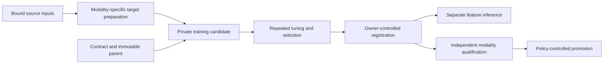

# Autoencoder inference and training handbook

Use this handbook to choose a supported execution path, prepare its inputs,
run or resume it, and interpret the evidence. Its core API baseline is dataset
commit `3666ebad19422b8345ebe5432a1c02f26d2eba4c` (2026-09-29), with the
[UI DOM/IDL training additions](ui_datasets_and_bindings.md) dated 2026-09-30.
Examples and defaults
belong to their named backend; they are not interchangeable across backends.

## Choose a task

| I need to… | Start here |
| --- | --- |
| Select a version across Legal, Security, Intent and UI/UX | [Versioned runtime interface](versioned_runtime_interface.md) |
| Recover historical 8D training optimizations | [Legacy speed history and selective ports](legacy_speed_history.md) |
| Try native UI/UX learning from real compiler output | [Runnable native quickstart](native_feature_quickstart.md) |
| Train UI DOM/IDL bindings, resume, and choose HF datasets | [UI training, datasets and bindings](ui_datasets_and_bindings.md) |
| Implement React action, handler, state and typed-call capture | [React capture specification and implementation plan](react_capture_spec.md) |
| Train or resume the legal autoencoder, including feature mode | [Legal training](legal_training.md) |
| Compare legacy and current legal architectures and quality evidence | [Legal architecture comparison](legal_architecture_comparison.md) |
| Score a checkpoint without training, or understand qualification | [Inference and qualification](inference_and_qualification.md) |
| Add UI/UX, Security, Intent, or another IR | [Modality adapters and validation](modalities.md) |
| Know which files, vectors, manifests, and checkpoints are required | [Artifacts and inputs](artifacts_and_inputs.md) |
| Coordinate workers, weights, Quack, DuckLake, and Hugging Face | [Control plane and synchronization](control_plane_and_sync.md) |
| Diagnose stalled epochs, source drift, storage admission, or rejected candidates | [Operations and troubleshooting](operations_and_troubleshooting.md) |
| Find the exact callable or script for a task | [API and command map](api_map.md) |

See [legal autoencoder lineages](legal_autoencoder_lineages.md) to preserve the full legacy teacher separately from current students.

## Choose an execution path first

| Path | Input and representation | Output | Current scope |
| --- | --- | --- | --- |
| Legal qualified training | Legal `SampleRecord` rows, supported modal checkpoint, legal targets and disjoint validation | Candidate plus qualification evidence | Existing legal runners; success depends on all required gates |
| Legal feature pretraining | Verified local semantic embedding rows, provenance manifest, legal target supervision | Selected feature checkpoint; qualification flags false | Existing legal feature-mode parallel and exchange infrastructure |
| Legal inference | Immutable legal checkpoint and inference input/validation rows | Scores and evidence; no optimizer update | Separate execution route and state directory |
| Native IR structural training | UI/UX, Security, or Intent compiler envelopes, training-only basis, fixed tuning panel | Numerical state, Adam moments, isolated DuckDB candidate | Bounded local API; nonlegal fleet/HF/Arrow state integration remains separate |
| Native IR feature inference | Same native contract, basis, saved state, compatible targets | Latent vectors and reconstructed feature blocks | Read-only numerical inference; no executable formula decoding |

The registry and contracts are reusable. The legal worker frontend, target
cache, checkpoint codec, and Hub exchange do not become modality-neutral by
changing a domain string. Check [format compatibility](artifacts_and_inputs.md).

## Environment and source preflight

Run examples from the canonical dataset checkout in a fresh Python process:

```bash
cd /home/barberb/lift_coding/external/ipfs_datasets
export PYTHONPATH="$PWD"
export PYTHONDONTWRITEBYTECODE=1
```

This workspace has another editable package installation in HACC. An imported
package stays in `sys.modules`; changing `PYTHONPATH` inside that process is
insufficient. Restart with the pinned path. Do not edit HACC or
`hallucinate_app` to synchronize them with this checkout.

Run this preflight before loading models:

```python
from importlib.util import find_spec
from pathlib import Path
import ipfs_datasets_py
from ipfs_datasets_py.logic.autoformal.tree_pin import require_workspace_logic_tree

expected = Path("/home/barberb/lift_coding/external/ipfs_datasets").resolve()
assert expected in Path(ipfs_datasets_py.__file__).resolve().parents
print(require_workspace_logic_tree())
for name in ("torch", "duckdb", "pyarrow", "huggingface_hub"):
    print(name, "available" if find_spec(name) else "not installed")
```

The guard checks compiler, decompiler, and parser location. It is not a complete
frozen dependency manifest. Distributed jobs also need their
[source snapshot and producer bindings](operations_and_troubleshooting.md).

| Dependency | Needed for |
| --- | --- |
| Python supported by this checkout (current packaging: 3.12+) | All examples |
| `torch` | Native structural numerical backend; optional numerical paths elsewhere |
| `duckdb` | Registry and owner control process |
| `pyarrow` | Explicit Arrow input, target, or weight paths; not native JSON quickstart |
| `huggingface_hub` and suitable credentials | Configured Hub transfers; not local quickstarts |
| Lean/Lake and source-locked legal project | Legal Lean admission through qualification |
| Verified already-local embedding model and production evidence | Semantic legal feature runs; mock vectors are not a substitute |

The handbook does not install dependencies, fetch weights, alter the context
window, or configure a service automatically. Temperature stays zero. The native
quickstart uses compiler structures and no pretrained model.

## Common lifecycle



This describes responsibilities, not a universal launcher. The legal
distributed path has owner/worker transport. The native API currently implements
local preparation, training, registration, and inference; its full qualification
and remote transport remain separate work.

## Reading success correctly

- `ready_for_training` means the required target structure exists.
- `improved` means the specified selection objective improved under that path's
  regression constraints. Read per-projection metrics and attempted versus
  selected epochs too.
- Resume preserves the parent, representation, runtime, optimizer, and validation
  bindings required by its backend.
- A tuning score repeatedly used for selection is not a held-out canary.
- Feature inference may inspect an unqualified model; it grants no proof,
  deployment, or execution authority.
- Legal admission requires the actual source-locked `lake build <Lib>` path.
  Compiler output, roundtrip text, loss, targets, NCA cells, and database rows
  do not count. No Constitution span becomes formalized through feature work.

See [qualification](inference_and_qualification.md) for statuses and
[operations](operations_and_troubleshooting.md) for performance telemetry.

## Maintaining the handbook

Prefer these task guides over dated reports for commands. Reports remain
evidence for their measured run and commit. The
[modality report](../implementation/reports/AUTOENCODER_MODALITY_REUSE_20260929.md)
records the initial 189-test validation and three-domain structural smoke.

When APIs change, update the guide, argument table, and runnable example. Check
links and Python/shell syntax, and execute only relevant bounded examples.
Documentation validation must not become an unattended corpus run, checkpoint
overwrite, Hub upload, or model download.
