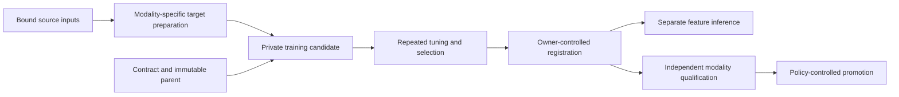

# Autoencoder inference and training handbook

**Current LegalIR handoff:** [autoformalization guide](../../ipfs_datasets_py/logic/autoformal/README.md) and [current state](../../ipfs_datasets_py/logic/autoformal/docs/HANDOFF.md). Source, review, graph, Lean and LegalIR model guides are maintained beside the autoformal module; this document retains its existing model guidance and dated research history.

Use this handbook to choose a supported execution path, prepare its inputs,
run or resume it, and interpret the evidence. Its core API baseline is dataset
commit `3666ebad19422b8345ebe5432a1c02f26d2eba4c` (2026-09-29), with the
[UI DOM/IDL training additions](ui_datasets_and_bindings.md) dated 2026-09-30.
Examples and defaults
belong to their named backend; they are not interchangeable across backends.

## Choose a task

| I need to… | Start here |
| --- | --- |
| Compare typed predicate arguments, lexical binders and modal scope before richer decoder evaluation | [Typed relational reconstruction diagnostics](legal_relational_reconstruction_v1.md) |
| Keep missing, duplicate, invalid and abstained typed outputs in the selected population | [Typed relational batch output diagnostics](legal_relational_batch_evaluation_v1.md) |
| Record unsigned source/primary anchors with complete populations and unresolved evidence | [Sampled source / primary association](legal_sampled_primary_association_v2.md) |
| Prepare a fresh definition-review subject that binds the primary association and its witnesses | [Association-bound definition review](legal_sampled_primary_definition_review_v2.md) |
| Improve LegalIR on US Code spans and aggregate scoped semantic graphs into a shared Lean 4 corpus | [Current source, decoder, graph and Lean improvement plan](legal_ir_uscode_corpus_improvement_plan_20261015.md) |
| Hand LegalIR work to the ipfs_accelerate_py agent supervisor | [Goals, subgoals, bounded tasks and supervisor handoff](legal_ir_supervisor_plan/README.md) |
| Recover retained LegalIR checkpoints, native-conditioning assets and exact registration identities before another fit | [Asset and registration reconciliation](legal_ir_asset_reconciliation_20261016.md) |
| Preserve richer typed norm hypotheses and original source scope before semantic training | [Typed semantic integration](legal_typed_semantic_integration_20261016.md) |
| Replay selected normative Legal384/768 states on their original or separately bound retained native caches | [Original cached replay](normative_legal_ir_runtime.md), [retained native caches](normative_cached_legal_ir_runtime.md) |
| Replay both retained and balanced normative wording banks in one private trainer | [Dual-bank training adapter](dual_bank_wording_training_adapter.md) |
| Reconcile other agents' branches, findings and decoder progress | [Shared progress and formalization priorities](progress_integration.md) |
| Select a version across Legal, Security, Intent and UI/UX | [Versioned runtime interface](versioned_runtime_interface.md) |
| Inspect required logic families, decoder losses and Lake coverage | [Logic output requirements and inventory](logic_output_requirements.md) |
| Validate Legal conditions/exceptions or request/token UI confirmations before training | [Legal/UI qualifier coverage and v7/v5 entry points](legal_ui_qualifier_coverage.md) |
| Check Intent preconditions, updates and effects against a finite state model | [Guarded Intent projections and training](native_guarded_intent_training.md) |
| Obtain formal ASTs or reconstruct native expressions from model scores | [Formal logic decoders](formal_logic_decoders.md) |
| Train native categorical decoders and check actual outputs with Lake | [Native formula training](native_formula_training.md) |
| Train a source-only learned formula decoder | [Learned legal formula training](learned_legal_formula_training.md) |
| Prepare complete official statutory source units and open context | [Whole-source sampling](legal_source_sampling.md) |
| Record source findings and meaning proposals against the complete source population | [Sampled-source review intake](legal_source_sampling_review.md) |
| Compile explicit V2 definition declarations into candidate graphs | [V2 source definitions](legal_source_definition_v2.md) |
| Bind explicit V2 definition candidates to exact source-review subjects | [Sampled-source definition binding](legal_source_sampling_definition_binding_v2.md) |
| Join exact sampled-source bindings to existing V2 review subjects while preserving all open populations | [Unsigned source/review correspondence integration](legal_source_definition_review_correspondence_integration_20261015.md) |
| Replay the retained 560-subject §101 population into inspectable unsigned review correspondence | [Retained actual-source replay](legal_retained_source_correspondence_20261015.md) |
| Preserve and independently replay every selected original primary graph occurrence | [Export API and profiles](legal_primary_graph_export.md), [297,825-occurrence candidate and qualification](legal_primary_corpus_export_20261015.md) |
| Prepare and authenticate exact V2 definition review evidence | [V2 definition context and review](corpus_definition_review_v2.md) |
| Bind the full joint definition-use interpretation to its distinct review subject | [Combined V2 definition-use review](corpus_definition_use_review_v2.md) |
| Inspect native combined-review qualification and the executed §101 source-binding replay | [Combined review and sampled-source integration](legal_definition_use_review_v2_integration_20261015.md) |
| Prepare a conditional V2 definition-use Lean project with original review blockers retained | [V2 conditional native preparation](legal_corpus_definition_use_lake_v2.md) |
| Track native project-exchange, lazy-import evidence and closeout status | [V2 native-preparation integration](legal_definition_use_native_preparation_integration_20261015.md) |
| Preserve public reasoning exports and caller overrides across lazy owner imports | [Parallel public V2 handoffs](legal_corpus_v2_public_handoffs.md) |
| Execute a bounded conditional V2 engineering build with explicit toolchain and original review inputs | [V2 engineering-build API](legal_corpus_definition_use_build_v2.md), [adoption and evidence limits](legal_source_definition_review_correspondence_integration_20261015.md#bounded-engineering-execution-already-exists) |
| Select between the separately versioned V2 build and native-executor receipt profiles | [Native executor](legal_corpus_definition_use_native_v2.md), [profile reconciliation](legal_source_definition_review_correspondence_integration_20261015.md#concurrent-native-execution-profiles) |
| Preserve and train the old 8D linguistic/IR feature decoder | [Legacy linguistic training](legacy_linguistic_training.md) |
| Reproduce the September 17 teacher and prepare screened distillation targets | [Historical teacher fidelity, fixes and performance](legacy_teacher_fidelity.md) |
| Transfer screened teacher evidence into separately embedded 384D formula training | [Teacher-to-student preparation and smoke](teacher_student_transfer.md) |
| Detect actor shortcuts and compare balanced formula training data | [Actor composition and free-running evaluation](actor_composition_evaluation.md) |
| Improve 8D feature updates and compare 384D reconstruction profiles | [Separate reconstruction-training paths](reconstruction_training.md) |
| Compare LegalIR view logits under a fixed optimizer-lane vocabulary while preserving official acceptance | [Fixed view diagnostic](legal_ir_fixed_view_vocabulary_20261015.md) |
| Keep 8D and 384D running while developing 768D multilingual GTE | [Parallel logic IR paths and transfer plan](gte_multilingual_migration_plan.md) |
| Dispatch independent 8D, 384D and 768D workers together | [Parallel lane execution](parallel_lineage_execution.md) |
| Run pinned local 8D and 384D models in private CPU workers | [Parallel model inference workers](gte_parallel_model_workers.md) |
| Prepare source-only 768D tasks and inspect pinned multilingual assets | [Multilingual embedding preparation](gte_multilingual_preparation.md) |
| Reuse existing model assets and vectors before generating missing embeddings | [Existing assets and embedding cache reuse](gte_embedding_reuse.md) |
| Prepare 768→384 pairs and verify frozen-teacher adapter gradients | [Affine bridge preparation](gte_affine_bridge_preparation.md) |
| Initialize the 768D decoder from learned 8D and 384D heads before fitting | [Decoder reuse and distillation sequence](gte_decoder_reuse.md) |
| Verify inherited decoder knowledge and export original-input teacher distributions | [Decoder knowledge transfer and replay](gte_decoder_knowledge_transfer.md) |
| Join original decoder targets to cached native inputs and check reference gradients | [Native decoder inputs and reference objective](gte_decoder_native_inputs.md) |
| Fit only the new input connections with both learned decoder bodies frozen | [Bounded decoder interface training](gte_decoder_interface_training.md) |
| Continue reference training from the authenticated fitted input boundary | [Aligned-start interface training](gte_aligned_interface_training.md) |
| Compare original donors and saved 768D generations without reference prefixes | [Source-only decoder evaluation](gte_decoder_source_evaluation.md) |
| Prepare or fit the new input connection from same-source vector pairs | [Train-only affine alignment](gte_affine_alignment.md) |
| Load a completed fit into the inherited 768D student without changing donors | [Aligned decoder handoff and private reload](gte_aligned_decoder.md) |
| Inventory pinned checkpoints and audit transfer corpus partitions | [GTE migration preparation tools and first audit](gte_migration_preparation.md) |
| Train the current latent projection and formula decoder together | [Joint formula training](modal_joint_formula_training.md) |
| Recover historical 8D training optimizations | [Legacy speed history and selective ports](legacy_speed_history.md) |
| Try native UI/UX learning from real compiler output | [Runnable native quickstart](native_feature_quickstart.md) |
| Train UI DOM/IDL bindings, resume, and choose HF datasets | [UI training, datasets and bindings](ui_datasets_and_bindings.md) |
| Implement React action, handler, state and typed-call capture | [React capture specification and implementation plan](react_capture_spec.md) |
| Train or resume the legal autoencoder, including feature mode | [Legal training](legal_training.md) |
| Compare legacy and current legal architectures and quality evidence | [Legal architecture comparison](legal_architecture_comparison.md) |
| Score a checkpoint without training, or understand qualification | [Inference and qualification](inference_and_qualification.md) |
| Add UI/UX, Security, Intent, or another IR | [Modality adapters and validation](modalities.md) |
| Know which files, vectors, manifests, and checkpoints are required | [Artifacts and inputs](artifacts_and_inputs.md) |
| Coordinate workers, weights, Quack, DuckLake, and Hugging Face | [Control plane and synchronization](control_plane_and_sync.md) |
| Diagnose stalled epochs, source drift, storage admission, or rejected candidates | [Operations and troubleshooting](operations_and_troubleshooting.md) |
| Find the exact callable or script for a task | [API and command map](api_map.md) |

See [legal autoencoder lineages](legal_autoencoder_lineages.md) to preserve the full legacy teacher separately from current students.

## Choose an execution path first

| Path | Input and representation | Output | Current scope |
| --- | --- | --- | --- |
| Legal qualified training | Legal `SampleRecord` rows, supported modal checkpoint, legal targets and disjoint validation | Candidate plus qualification evidence | Existing legal runners; success depends on all required gates |
| Legal feature pretraining | Verified local semantic embedding rows, provenance manifest, legal target supervision | Selected feature checkpoint; qualification flags false | Existing legal feature-mode parallel and exchange infrastructure |
| Legal inference | Immutable legal checkpoint and inference input/validation rows | Scores and evidence; no optimizer update | Separate execution route and state directory |
| Learned legal formula reconstruction | Authored source/rule pairs for `source_conditioned_formula_v1` | Source-only generated canonical rules, resumable Adam checkpoint | Bounded single-rule deontic vocabulary; no semantic qualification or fleet integration |
| Native categorical formula training | Fixed-shape native envelopes, immutable training/tuning vocabulary | Learned native records, decoder CE, exact Adam resume and actual-output Lake checks | Separate `native_formula_v1`; local bounded diagnostics, incomplete semantic coverage |
| Native IR structural training | UI/UX, Security, or Intent compiler envelopes, training-only basis, fixed tuning panel | Numerical state, Adam moments, isolated DuckDB candidate | Bounded local API; nonlegal fleet/HF/Arrow state integration remains separate |
| Native IR feature inference | Same native contract, basis, saved state, compatible targets | Latent vectors and reconstructed feature blocks | Read-only numerical inference; explicit formal readout also requires a version-bound structural head |

The registry and contracts are reusable. The legal worker frontend, target
cache, checkpoint codec, and Hub exchange do not become modality-neutral by
changing a domain string. Check [format compatibility](artifacts_and_inputs.md).

## Environment and source preflight

Run examples from the canonical dataset checkout in a fresh Python process:

```bash
cd /home/barberb/lift_coding/external/ipfs_datasets
export PYTHONPATH="$PWD"
export PYTHONDONTWRITEBYTECODE=1
```

This workspace has another editable package installation in HACC. An imported
package stays in `sys.modules`; changing `PYTHONPATH` inside that process is
insufficient. Restart with the pinned path. Do not edit HACC or
`hallucinate_app` to synchronize them with this checkout.

Run this preflight before loading models:

```python
from importlib.util import find_spec
from pathlib import Path
import ipfs_datasets_py
from ipfs_datasets_py.logic.autoformal.tree_pin import require_workspace_logic_tree

expected = Path("/home/barberb/lift_coding/external/ipfs_datasets").resolve()
assert expected in Path(ipfs_datasets_py.__file__).resolve().parents
print(require_workspace_logic_tree())
for name in ("torch", "duckdb", "pyarrow", "huggingface_hub"):
    print(name, "available" if find_spec(name) else "not installed")
```

The guard checks compiler, decompiler, and parser location. It is not a complete
frozen dependency manifest. Distributed jobs also need their
[source snapshot and producer bindings](operations_and_troubleshooting.md).

| Dependency | Needed for |
| --- | --- |
| Python supported by this checkout (current packaging: 3.12+) | All examples |
| `torch` | Native structural numerical backend; optional numerical paths elsewhere |
| `duckdb` | Registry and owner control process |
| `pyarrow` | Explicit Arrow input, target, or weight paths; not native JSON quickstart |
| `huggingface_hub` and suitable credentials | Configured Hub transfers; not local quickstarts |
| Lean/Lake and source-locked legal project | Legal Lean admission through qualification |
| Verified already-local embedding model and production evidence | Semantic legal feature runs; mock vectors are not a substitute |

The handbook does not install dependencies, fetch weights, alter the context
window, or configure a service automatically. Temperature stays zero. The native
quickstart uses compiler structures and no pretrained model.

## Common lifecycle


```mermaid
flowchart LR
    S[Bound source inputs] --> A[Modality-specific target preparation]
    A --> T[Private training candidate]
    C[Contract and immutable parent] --> T
    T --> E[Repeated tuning and selection]
    E --> R[Owner-controlled registration]
    R --> I[Separate feature inference]
    R --> Q[Independent modality qualification]
    Q --> P[Policy-controlled promotion]
```

This describes responsibilities, not a universal launcher. The legal
distributed path has owner/worker transport. The native API currently implements
local preparation, training, registration, and inference; its full qualification
and remote transport remain separate work.

## Reading success correctly

- `ready_for_training` means the required target structure exists.
- `improved` means the specified selection objective improved under that path's
  regression constraints. Read per-projection metrics and attempted versus
  selected epochs too.
- Resume preserves the parent, representation, runtime, optimizer, and validation
  bindings required by its backend.
- A tuning score repeatedly used for selection is not a held-out canary.
- Feature inference may inspect an unqualified model; it grants no proof,
  deployment, or execution authority.
- Legal admission requires the actual source-locked `lake build <Lib>` path.
  Compiler output, roundtrip text, loss, targets, NCA cells, and database rows
  do not count. No Constitution span becomes formalized through feature work.

See [qualification](inference_and_qualification.md) for statuses and
[operations](operations_and_troubleshooting.md) for performance telemetry.

## Maintaining the handbook

Prefer these task guides over dated reports for commands. Reports remain
evidence for their measured run and commit. The
[modality report](../implementation/reports/AUTOENCODER_MODALITY_REUSE_20260929.md)
records the initial 189-test validation and three-domain structural smoke.

When APIs change, update the guide, argument table, and runnable example. Check
links and Python/shell syntax, and execute only relevant bounded examples.
Documentation validation must not become an unattended corpus run, checkpoint
overwrite, Hub upload, or model download.
