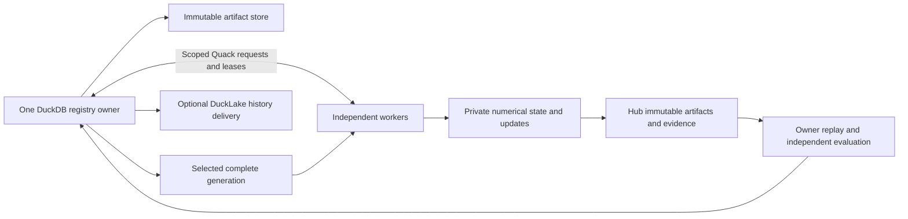

# Control plane, storage, and synchronization

This page describes the published implementation at
`3666ebad19422b8345ebe5432a1c02f26d2eba4c`. The numerical worker, database owner,
artifact store, and publication transport have separate responsibilities.
See [modality contracts](modalities.md), [artifact inputs](artifacts_and_inputs.md),
and [operations](operations_and_troubleshooting.md) before provisioning a run.

## Supported paths

| Path | Numerical state | Coordination and persistence | Publication status |
| --- | --- | --- | --- |
| Legal distributed `feature_pretraining` | Private modal checkpoint per worker; shared prepared legal targets | One `AutoencoderRegistry` owner, scoped Quack span assignments, exact sparse replay and generation selection | Implemented feature checkpoint/report exchange with `justicedao/uscode-autoformal-span-cache` |
| Legal distributed `formalization` | Compatible modal checkpoint with the formalization qualification policy | Same campaign ownership; separate owner verification and qualification | Existing qualified span/update transport; qualification gates remain required |
| Native UI, Security, and Intent structural features | `native-projection-feature-state/v1`, including Adam moments and fixed tuning identity | `register_feature_candidate()` stores isolated versions in the existing registry | Registration does **not** enqueue Hub publication or select a distributed generation; the legal sparse codec is incompatible |
| DuckLake history | Immutable event references, not tensors read during gradient computation | Explicit owner delivery to an isolated local DuckLake sink | Production DuckLake activation is not enabled by these APIs |

The registry can hold multiple model variants, languages, and modalities. That
does not make their numerical layouts, target projections, optimizer states,
or acceptance policies interchangeable. Native modality contracts bind those
identities explicitly; see the [native feature quickstart](native_feature_quickstart.md).

## One database owner, private worker weights



[`AutoencoderRegistry`](../../ipfs_datasets_py/duckdb_control/autoencoder_registry.py)
holds the durable DuckDB file open in one owner process and serializes short
transactions. The advisory owner lock also rejects a second owner in the same
process. A restarted owner advances the persisted generation used to fence
old leases. Workers must not open that database concurrently through a shared
filesystem or copy a live database file to manufacture another owner.

[`RegistryQuackGateway` and `RegistryTransportClient`](../../ipfs_datasets_py/duckdb_control/autoencoder_quack.py)
carry bounded, authenticated commands. Worker scopes, durable operation IDs,
lease attempts and fencing tokens constrain which run can change. The Quack
transport explicitly checks the installed DuckDB version and local `quack`
and `httpfs` extension hashes. It does not install extensions from the network.

There are two related ownership adapters:

- [`SharedWeightRegistry`](../../ipfs_datasets_py/duckdb_control/autoencoder_shared_weight_control.py)
  is an explicit `enable_prototype=True` facade around an already-open registry
  for `run_training_jobs`. The owner prepares successful mutation requests only
  after its existing verification. This facade alone does not provide remote
  artifact transfer.
- [`AutoencoderSpanCampaign`](../../ipfs_datasets_py/duckdb_control/autoencoder_span_campaign.py)
  and its worker-specific Quack gateways add resumable span claims and selected
  generation acknowledgments. The legal distributed CLI joins this control
  path to the established Hub exchange.

Numerical loops work on local memory and immutable local artifacts. DuckDB
records variants, runs, versions, leases, receipts, and publication work; it is
not queried or updated for each weight scalar during a gradient step.

## Exact generations rather than merging optimizer states

The legal feature campaign follows this sequence:

1. The owner binds the source generation, compatible full seed checkpoint,
   known worker identities, verified embedding inputs, tuning panel, and shared
   target snapshot to a persisted campaign policy.
2. A worker reads the selected generation, downloads or replays its complete
   checkpoint, verifies the full hash and byte count, and acknowledges that
   exact generation before claiming a span.
3. A claim binds its source revision, parent version, policy, worker, lease,
   and fencing token. The worker trains with private weights and retains its
   attempt artifacts.
4. The worker publishes an immutable feature report and, when an update was
   accepted, the sparse candidate closure. The owner verifies source and
   assignment bindings, replays the candidate, and independently checks the
   raw decoder objective and legal-IR regression guards on its tuning inputs.
5. Selection uses compare-and-swap against the previous generation. Completed
   candidates based on a stale parent are retained and requeued against the
   new parent. Workers poll for the selected generation and acknowledge only
   after verifying its full materialization.

The implementation is in
[`autoencoder_distributed_training.py`](../../ipfs_datasets_py/optimizers/logic_theorem_optimizer/autoencoder_distributed_training.py)
and
[`autoencoder_distributed_features.py`](../../ipfs_datasets_py/optimizers/logic_theorem_optimizer/autoencoder_distributed_features.py).
`install_generation()` writes a per-generation `installed.json` and updates
`weights/current.json` only after complete verification. An existing matching
installation is rehashed and reused with zero additional downloads.

Sparse patches are ordered postimages for an exact parent. Do not add together
independently trained patches, average Adam moments, or apply a child to a
different parent. The current native structural trainer resumes its own Adam
state and fixed tuning panel; it supplies no distributed Adam aggregation.

Workers can temporarily hold different generations while training, transferring,
or disconnected. `acknowledged_current_workers` in the owner's `status.json`
identifies workers that have verified the complete selected weights. A TCP
connection, successful upload, or completed optimizer call is not that acknowledgment.

## Legal multi-host startup and resume

The executable is
[`scripts/ops/legal_ir/run_distributed_autoencoders.py`](../../scripts/ops/legal_ir/run_distributed_autoencoders.py).
The bounded owner and worker templates below start the existing legal feature
campaign. See [legal training](legal_training.md) for target preparation and
qualification details. Inspect the actual options without starting a campaign:

```bash
cd /home/barberb/lift_coding/external/ipfs_datasets
export PYTHONPATH="$PWD"
export PYTHONDONTWRITEBYTECODE=1
python3 -B scripts/ops/legal_ir/run_distributed_autoencoders.py owner --help
python3 -B scripts/ops/legal_ir/run_distributed_autoencoders.py worker --help
```

Before starting, provision the same source and dependency generation on every
host, including the bound JevOps source. The current shared-target provenance
also binds Python, platform/kernel, and installed-distribution fingerprints;
arbitrarily different hosts are not interchangeable. Each training host needs
the verified local embedding manifest and its referenced provenance artifacts,
the exact training/tuning JSONL files, and the prepared target bundle. File
paths may differ between hosts; verified content identities must match.

For `feature_pretraining`, the owner requires `--input-jsonl`,
`--validation-jsonl`, `--feature-input-manifest`, `--shared-targets`, and
`--target-snapshot-id`, plus a compatible `--checkpoint`. The training worker
uses the corresponding `--feature-training-jsonl` and
`--feature-validation-jsonl`. Use a distinct worker identity and durable
`--state-directory` for each concurrent worker, including workers on one host.
The owner must declare those identities with repeated `--worker-id` options.
Both roles need admitted local resource budgets and existing Hub credentials.
Starting the owner can publish its seed; training workers can publish results.

### Start one owner

Replace `/LOCAL` and `/CHARGED` with provisioned local paths, and replace the
snapshot placeholder with the exact ID emitted by target preparation. The
three corpus files below mean the verified input manifest, training JSONL, and
disjoint tuning JSONL; retain any artifacts referenced by the manifest. The
chosen checkpoint must match those inputs and the modal checkpoint codec.
The state directory must lie under the resource ledger's named roots.

**This command starts serving and can upload the seed and feature evidence.**
It is not a dry run. The example serves for 900 seconds, limits each feature
job to one requested epoch with two line-search attempts, and declares two
worker identities before either worker connects:

```bash
python3 -B scripts/ops/legal_ir/run_distributed_autoencoders.py owner \
  --training-purpose feature_pretraining \
  --campaign-id uscode-features-smoke-v1 \
  --worker-id machine-a --worker-id machine-b \
  --checkpoint /LOCAL/compatible-feature-parent.state.json \
  --input-jsonl /LOCAL/training.jsonl \
  --validation-jsonl /LOCAL/tuning.jsonl \
  --feature-input-manifest /LOCAL/feature-inputs.json \
  --shared-targets /LOCAL/targets.bundle \
  --target-snapshot-id sha256:EXACT_PREPARED_TARGET_SNAPSHOT \
  --target-shard-max-bytes 268435456 \
  --target-timeout-seconds 60 \
  --state-directory /CHARGED/owner \
  --resource-ledger /LOCAL/disk-reservations.json \
  --storage-bytes 250000000 --worker-storage-bytes 250000000 \
  --epochs 1 --line-search-attempts 2 --max-training-rounds 1 \
  --max-seconds 60 --cycle-timeout 240 \
  --projection-optimizer-mode productive_adaptive \
  --projection-momentum 0.25 \
  --projection-candidate-update-order decoded_embedding_structural \
  --serve-seconds 900 --sync-interval 30
```

`--storage-bytes` reserves the owner's allowance; `--worker-storage-bytes`
binds the nested training-job allowance in the campaign policy. They are
separate from each outer worker process's own `--storage-bytes`. These small
example budgets need a successful local census; they are not suitable defaults
for every checkpoint or corpus. Keep the owner running while workers train and
the owner verifies reports.

The 256 MiB shard limit (`268435456` bytes) matches the target-preparation
template in [legal training](legal_training.md). Match the prepared snapshot's
shard and target-timeout settings on the owner and every training worker;
the CLI's default shard bound is only 64 MiB. Adaptive momentum in this template
requires at least two line-search attempts. Setting the attempt count to one
while retaining momentum `0.25` is rejected by `TrainingConfig`.

### Connect a training worker

The owner writes each worker's connection JSON and mode-`0600` token under
`owner/connections/`. Transfer only that worker's connection information through
the existing private channel. Remote access uses an explicit authenticated SSH
forward, with the actual port from the worker's connection JSON:

```text
ssh -N -L 127.0.0.1:LOCAL_PORT:127.0.0.1:OWNER_PORT OWNER_HOST
```

The worker's endpoint override is `--endpoint quack:127.0.0.1:LOCAL_PORT`.
The gateway is not a public network service. Keep tokens out of commands that
print their contents, committed files, reports, and dataset uploads.

After the owner has written the connection files, run the following on
machine-a from its provisioned canonical source tree with the same Python
environment setup shown above. `/PRIVATE/machine-a.json` and its token are that
worker's owner-issued files; `LOCAL_PORT` is the local end of its SSH forward.
For a same-host worker, omit `--endpoint` to use the endpoint in the connection
file. Training paths may differ from the owner's paths, but must contain the
same verified corpus and target bytes.

**This command downloads/replays weights, trains, and can upload results.**
It handles at most one job during six polls, continuing synchronization after
the job limit. Each job is also bounded by the owner's policy:

```bash
python3 -B scripts/ops/legal_ir/run_distributed_autoencoders.py worker \
  --training-purpose feature_pretraining \
  --connection-file /PRIVATE/machine-a.json \
  --token-file /PRIVATE/machine-a.token \
  --endpoint quack:127.0.0.1:LOCAL_PORT \
  --feature-training-jsonl /LOCAL/training.jsonl \
  --feature-validation-jsonl /LOCAL/tuning.jsonl \
  --feature-input-manifest /LOCAL/feature-inputs.json \
  --shared-targets /LOCAL/targets.bundle \
  --target-snapshot-id sha256:EXACT_PREPARED_TARGET_SNAPSHOT \
  --target-shard-max-bytes 268435456 \
  --target-timeout-seconds 60 \
  --state-directory /CHARGED/machine-a \
  --resource-ledger /LOCAL/disk-reservations.json \
  --storage-bytes 400000000 \
  --polls 6 --max-jobs 1 --lease-seconds 300 --sync-interval 30
```

Start machine-b separately with its own connection JSON, token, tunnel,
state directory, and local ledger. Do not reuse machine-a's identity or state
directory. A poll limit does not include the duration of training or transfer
inside a poll. If a worker exits before the owner finishes selecting a
generation, use the synchronization-only recipe below and check the owner's
current-generation acknowledgments.

### Synchronize without training

This synchronization-only recipe downloads/replays selected weights and
acknowledges them, but does not train. Replace the paths and endpoint with the
worker's provisioned values; this is an active network operation:

```bash
python3 -B scripts/ops/legal_ir/run_distributed_autoencoders.py worker \
  --training-purpose feature_pretraining \
  --connection-file /PRIVATE/machine-a.json \
  --token-file /PRIVATE/machine-a.token \
  --endpoint quack:127.0.0.1:LOCAL_PORT \
  --state-directory /CHARGED/machine-a \
  --resource-ledger /LOCAL/disk-reservations.json \
  --storage-bytes 400000000 \
  --sync-only --polls 3 --sync-interval 30
```

The 400 MB example is the bounded retry allocation, not a capacity guarantee
for a larger checkpoint or retained history. See [storage accounting](operations_and_troubleshooting.md#storage-accounting).

Restart with the same campaign policy and state directories. Refresh worker
connection files and SSH forwards after owner restart because its transient
endpoints are recreated. `pending.json`, `control-journal`, and retained job
results allow ambiguous replies and interrupted attempts to reconcile using
their original operation identities. Do not erase them to force another claim.

The feature campaign's corpus is immutable. Polling pulls weight and result
updates; it does not make arbitrary new Hub span rows eligible for training.
New corpus rows need verified local embeddings and targets in a newly verified
campaign. Native structural feature training separately supports incremental
batches against its frozen basis and fixed tuning panel; that API is not yet
wired into this legal campaign CLI.

## Hub and DuckLake contracts

[`autoencoder_feature_exchange.py`](../../ipfs_datasets_py/optimizers/logic_theorem_optimizer/autoencoder_feature_exchange.py)
uses `autoformal/uscode/feature-pretraining/` in the authorized span-cache
dataset. It exposes `stage_feature_update`, `publish_feature_update`,
`download_feature_update`, `publish_feature_checkpoint`,
`publish_feature_report`, and `download_feature_report`.

Publication binds immutable commit references, content hashes, sizes, parent
identity, native worker evidence, and owner replay. Publication helpers default
to `upload=False`; the distributed CLI explicitly requests uploads.
Downloads verify and reuse existing local materializations. Full unqualified
anchors and periodic compaction bound sparse ancestry; the feature reference
limit is seven, distinct from the local sparse resolver's default depth eight.
Sparse transfer is not necessarily smaller: the documented retry's patches
were larger than its complete checkpoint. Measure transferred bytes and reuse
before claiming bandwidth savings.

For history, [`deliver_ducklake_history()`](../../ipfs_datasets_py/duckdb_control/autoencoder_ducklake.py)
requires the actual owner registry and
[`IsolatedNativeDuckLakeHistory`](../../ipfs_datasets_py/ducklake/autoencoder_history.py).
It freezes up to ten outbox events in a durable journal, appends outside the
owner's database transaction, verifies the sink commit, and acknowledges the
exact events. Reusing the output directory resumes that batch; the next batch
requires a fresh directory. Its result retains `production_activated=false`.
No DuckLake path in this workflow establishes Lean admission. The implementation
is DuckLake; there is no `quacklake` service to configure.

## Arrow and sparse boundaries

| Component | Existing API | Actual boundary |
| --- | --- | --- |
| Modal feature weight mapping | `build_feature_embedding_weights_ipc`, `load_feature_embedding_weights_ipc` in [Arrow weights](../../ipfs_datasets_py/optimizers/logic_theorem_optimizer/modal_autoencoder_arrow_weights.py) | Only legacy `feature_embedding_weights`; untouched float64 numeric buffers are mapped read-only, while touched rows become private tracked Python overlays |
| Verified embedding input mapping | `write_embedding_inputs_ipc`, `load_embedding_inputs_ipc` in [Arrow inputs](../../ipfs_datasets_py/optimizers/logic_theorem_optimizer/autoencoder_arrow_inputs.py) | Exact producer-bound float32 inputs, 384 dimensions, at most 256 records in this codec |
| Modal sparse persistence | `encode_manifest`, `resolve_checkpoint`, `materialize_checkpoint` in [sparse checkpoints](../../ipfs_datasets_py/optimizers/logic_theorem_optimizer/modal_autoencoder_sparse_checkpoint.py) | Bounded ordered patches and trusted local artifact resolver; complete JSON serialization and hashing still occur |
| Native structural state | [projection feature trainer](../../ipfs_datasets_py/optimizers/logic_theorem_optimizer/autoencoder_projection_features.py) | Its own tensors and Adam codec; neither the legal Arrow-weight codec nor legal sparse Hub payloads can be substituted |

Arrow is a local numerical optimization. Files remain immutable while mapped,
and mappings require exact source/artifact identities. JSON parsing, metadata
decoding, hashing, checkpoint serialization, and Python overlay access are not
zero-copy. `readonly_row_array(..., zero_copy_only=True)` rejects a modified
overlay row that would require materialization. Keep mappings alive until their
consumers finish, then verify and close them according to the owning API.

The [retry report](../implementation/reports/AUTOENCODER_DISTRIBUTED_FEATURES_RETRY_20260929.md)
documents two local workers, exact live Hub replays, and clean resume. It used
one physical host; it does not establish a two-physical-machine deployment or
qualify any native modality model.
