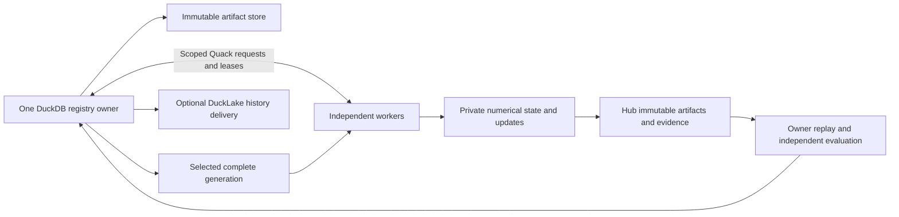

# Control plane, storage, and synchronization

The existing distributed campaign was published at
`3666ebad19422b8345ebe5432a1c02f26d2eba4c`. The additive federated APIs described
below are separate from that campaign. The numerical worker, database owner,
artifact store, and publication transport have separate responsibilities.
See [modality contracts](modalities.md), [artifact inputs](artifacts_and_inputs.md),
and [operations](operations_and_troubleshooting.md) before provisioning a run.

## Supported paths

| Path | Numerical state | Coordination and persistence | Publication status |
| --- | --- | --- | --- |
| Legal distributed `feature_pretraining` | Private modal checkpoint per worker; shared prepared legal targets | One `AutoencoderRegistry` owner, scoped Quack span assignments, exact sparse replay and generation selection | Implemented feature checkpoint/report exchange with `justicedao/uscode-autoformal-span-cache` |
| Legal distributed `formalization` | Compatible modal checkpoint with the formalization qualification policy | Same campaign ownership; separate owner verification and qualification | Existing qualified span/update transport; qualification gates remain required |
| Shared-model federated rounds, 8D or 384D | Same-base local parameter deltas; owner-approved layout and local data per client | Additive numerical reducer and existing registry runs/leases/versions | Provisional aggregate registration; model checkpoint materialization and owner qualification remain required |
| Native UI, Security, and Intent structural features | `native-projection-feature-state/v1`, including Adam moments and fixed tuning identity | `register_feature_candidate()` stores isolated versions in the existing registry | Registration does **not** enqueue Hub publication or select a distributed generation; the legal sparse codec is incompatible |
| DuckLake history | Immutable event references, not tensors read during gradient computation | Explicit owner delivery to an isolated local DuckLake sink | Production DuckLake activation is not enabled by these APIs |

The registry can hold multiple model variants, languages, and modalities. That
does not make their numerical layouts, target projections, optimizer states,
or acceptance policies interchangeable. Native modality contracts bind those
identities explicitly; see the [native feature quickstart](native_feature_quickstart.md).

## One database owner, private worker weights



[`AutoencoderRegistry`](../../ipfs_datasets_py/duckdb_control/autoencoder_registry.py)
holds the durable DuckDB file open in one owner process and serializes short
transactions. The advisory owner lock also rejects a second owner in the same
process. A restarted owner advances the persisted generation used to fence
old leases. Workers must not open that database concurrently through a shared
filesystem or copy a live database file to manufacture another owner.

[`RegistryQuackGateway` and `RegistryTransportClient`](../../ipfs_datasets_py/duckdb_control/autoencoder_quack.py)
carry bounded, authenticated commands. Worker scopes, durable operation IDs,
lease attempts and fencing tokens constrain which run can change. The Quack
transport explicitly checks the installed DuckDB version and local `quack`
and `httpfs` extension hashes. It does not install extensions from the network.

There are two related ownership adapters:

- [`SharedWeightRegistry`](../../ipfs_datasets_py/duckdb_control/autoencoder_shared_weight_control.py)
  is an explicit `enable_prototype=True` facade around an already-open registry
  for `run_training_jobs`. The owner prepares successful mutation requests only
  after its existing verification. This facade alone does not provide remote
  artifact transfer.
- [`AutoencoderSpanCampaign`](../../ipfs_datasets_py/duckdb_control/autoencoder_span_campaign.py)
  and its worker-specific Quack gateways add resumable span claims and selected
  generation acknowledgments. The legal distributed CLI joins this control
  path to the established Hub exchange.

Numerical loops work on local memory and immutable local artifacts. DuckDB
records variants, runs, versions, leases, receipts, and publication work; it is
not queried or updated for each weight scalar during a gradient step.

## Exact generations rather than merging optimizer states

The legal feature campaign follows this sequence:

1. The owner binds the source generation, compatible full seed checkpoint,
   known worker identities, verified embedding inputs, tuning panel, and shared
   target snapshot to a persisted campaign policy.
2. A worker reads the selected generation, downloads or replays its complete
   checkpoint, verifies the full hash and byte count, and acknowledges that
   exact generation before claiming a span.
3. A claim binds its source revision, parent version, policy, worker, lease,
   and fencing token. The worker trains with private weights and retains its
   attempt artifacts.
4. The worker publishes an immutable feature report and, when an update was
   accepted, the sparse candidate closure. The owner verifies source and
   assignment bindings, replays the candidate, and independently checks the
   raw decoder objective and legal-IR regression guards on its tuning inputs.
5. Selection uses compare-and-swap against the previous generation. Completed
   candidates based on a stale parent are retained and requeued against the
   new parent. Workers poll for the selected generation and acknowledge only
   after verifying its full materialization.

The implementation is in
[`autoencoder_distributed_training.py`](../../ipfs_datasets_py/optimizers/logic_theorem_optimizer/autoencoder_distributed_training.py)
and
[`autoencoder_distributed_features.py`](../../ipfs_datasets_py/optimizers/logic_theorem_optimizer/autoencoder_distributed_features.py).
`install_generation()` writes a per-generation `installed.json` and updates
`weights/current.json` only after complete verification. An existing matching
installation is rehashed and reused with zero additional downloads.

Sparse patches are ordered postimages for an exact parent. Do not add together
independently trained patches, average Adam moments, or apply a child to a
different parent. The current native structural trainer resumes its own Adam
state and fixed tuning panel; it supplies no distributed Adam aggregation.

Workers can temporarily hold different generations while training, transferring,
or disconnected. `acknowledged_current_workers` in the owner's `status.json`
identifies workers that have verified the complete selected weights. A TCP
connection, successful upload, or completed optimizer call is not that acknowledgment.

## Shared-model federated rounds

[`autoencoder_federated.py`](../../ipfs_datasets_py/optimizers/logic_theorem_optimizer/autoencoder_federated.py)
provides sample-weighted FedAvg for declared numeric parameters. Each lineage
has its own round, complete base checkpoint, parameter layout, embedding producer,
and runtime profile. Keep 8D and 384D in separate rounds even when workers use
the same machines. Dimension alone does not establish model compatibility.

The owner approves each client's local-data digest and sample count. Clients
can train different local datasets; each starts from the same verified base and
returns a parameter delta. This differs from the existing Legal feature CLI,
which binds all workers to the same prepared corpus and selects one child.
The new APIs do not change that CLI or launch remote trainers.

The reducer computes `base + sum(n_client * delta_client) / sum(n_client)`.
Every approved client must submit exactly once. An empty update is valid;
omitted parameters and coordinates contribute zero change, with all approved
sample counts still in the denominator. Incomplete rounds and duplicate or
stale updates fail. Reordering clients does not change the result.

Parameter declarations bind names, shapes, and float32/float64 dtypes. Sparse
semantic row identities and ordering must also be committed by the declared
layout. A small layout can name each row; a large table needs a compact tensor
declaration with a verified row-index digest bound into its parameter name or
architecture profile. The owner and worker extractors must verify that index;
the numerical reducer does not load an external row index. New keys require a
new layout and round. The reducer rejects nonfinite values, undeclared coordinates,
and a supplied base whose numeric commitment differs. Numeric commitments
preserve signed zero and dtype. The owner must extract that commitment from
the verified checkpoint; a matching file hash alone does not authenticate an
arbitrary caller-supplied parameter dictionary.

Parameter and update commitments stream domain-separated SHA256 over small,
length-prefixed metadata and binary little-endian IEEE values. Numerical weights
and deltas do not pass through JSON during hashing or aggregation. These numeric
commitments are separate from the checkpoint artifact's byte digest and its
transport CIDv1; they do not change a codec, CID recipe, or checkpoint bytes.

This synthetic example exercises the numerical API without files or services:

```python
from ipfs_datasets_py.optimizers.logic_theorem_optimizer.autoencoder_federated import (
    ClientSpec, FederatedRound, ParameterSpec, aggregate_round,
    make_client_update, parameter_digest,
)

layout = (ParameterSpec("projection.weight", (8,), "float64"),)
base = {"projection.weight": [0.0] * 8}
round_spec = FederatedRound(
    round_id="round-1", model_id="legal-8d", lineage_id="legacy-8d",
    dimension=8, architecture="example-projection", runtime_profile="float64/v1",
    base_sha256="0" * 64,  # Synthetic; production uses the complete checkpoint hash.
    base_parameters_sha256=parameter_digest(layout, base),
    embedding_producer_sha256="e" * 64, parameters=layout,
    clients=(ClientSpec("a", 10, "a" * 64), ClientSpec("b", 30, "b" * 64)),
)
updates = [
    make_client_update(round_spec, "a", {"projection.weight": {0: 4.0}},
                       local_steps=1, local_data_sha256="a" * 64),
    make_client_update(round_spec, "b", {},
                       local_steps=1, local_data_sha256="b" * 64),
]
candidate = aggregate_round(round_spec, base, updates)
assert candidate.parameters["projection.weight"][0] == 1.0
assert candidate.provenance["qualified"] is False
```

The result owns its parameter snapshot and records the complete round and
per-client commitments. It does not average optimizer moments, counters,
sample memories, proof metadata, or corpus provenance. Legacy sparse checkpoint
patches contain ordered postimages and cannot be used as these deltas.

[`duckdb_control.autoencoder_federated`](../../ipfs_datasets_py/duckdb_control/autoencoder_federated.py)
connects an owner-approved round to existing registry records:

1. `create_federated_run(registry, operation_id, run_id, base_version_id, round_spec)`
   verifies the registered base and persists the round. `model_id` must equal
   the registry variant ID. Claim its existing registry lease separately.
2. Materialize `candidate.parameters` into a complete checkpoint using the
   model's codec and an explicit optimizer/head policy.
3. `complete_federated_run(registry, operation_id, lease, round_spec,
   base_parameters, updates, checkpoint_path, verify_checkpoint=owner_verifier)`
   recomputes the aggregate and verifies the staged immutable checkpoint.
   The trusted verifier receives `(round_spec, candidate, staged_path)` and
   must check the numeric values and complete checkpoint closure, returning
   exactly `True`. Registration retains `qualified=False`, `admitted=False`,
   and leaves the selected head unchanged.
4. Independently evaluate the materialized model under the owner's policy and
   use the existing `promote_head()` compare-and-swap to select it.

Registry JSON payloads are bounded to 1 MiB. The embedded round and result must
fit that existing limit; hundreds of thousands of individually named sparse
rows will not fit. Compact tensor declarations require the authenticated index
described above. External layout-manifest loading is not implemented by these APIs.

Core changes invalidate a formula head bound to the old core. The checkpoint
materializer must explicitly handle that binding and local optimizer state;
the reducer does not make a historical formula-head resume profile compatible
with different local datasets. Tests cover numerical rounds, registry ownership,
real local core training, and real formula-head warm starts on authored fixtures.
They do not establish a live multi-host campaign or Legal quality of averaged weights.

DuckDB and scoped Quack remain the control plane for assignments, identities,
leases and results. Keep weight data in immutable binary artifacts and private
worker arrays. Parquet can archive sparse tables; a shared database is not the
per-step numerical weight store. Federation itself does not change existing
checkpoint codecs or upload artifacts to Hugging Face.

## Legal modal core checkpoints and local workers

[`autoencoder_federated_modal.py`](../../ipfs_datasets_py/optimizers/logic_theorem_optimizer/autoencoder_federated_modal.py)
implements verified parameter extraction and full checkpoint materialization for
raw modal states. Select `legacy_v1` for the frozen 8D lineage or `current_v2`
for the current 384D modal core. The released 384D inference package uses a
learned formula head; its separate federation path is described below.

`load_modal_checkpoint(path, expected_sha256=..., runtime_version=...)` accepts
complete raw JSON or existing `LIRMAECP` binary checkpoints. It checks the physical
bytes before loading and binds the selected source/runtime, schema, numeric
precision, semantic row keys/order and inherited excluded state. Missing fields
and established architecture defaults in old JSON are recorded explicitly;
unknown roots, lossy present-field reloads, package envelopes and attached formula
heads fail. Binary indexes are checked before decoding so duplicate semantic
rows, overlapping paths and unconsumed numeric payload cannot be hidden by a
valid checksum. Both lineages use their own training-state class.

The adapter declares one flattened tensor per nonempty reusable numeric
component. Its semantic index is hashed into the runtime profile, so large
sparse row sets fit the existing bounded registry metadata without one parameter
declaration per row. The frozen inherited sample/proof metadata stays exactly
bound to the base; client changes to it are rejected. Inherited proof metadata
does not become new evidence for the aggregate.

[`train_modal_client`](../../ipfs_datasets_py/optimizers/logic_theorem_optimizer/autoencoder_federated_worker.py)
executes the actual selected lineage's projection trainer in a fresh private
model. Its input is one owner-approved JSON file with this closed envelope:

```json
{
  "schema": "legal-federated-client-data/v1",
  "embedding_producer_sha256": "OWNER_APPROVED_64_HEX_DIGEST",
  "training": [{"title": "5", "section": "1", "text": "The agency must give notice.", "embedding_model": "OWNER_APPROVED_MODEL", "embedding_vector": [0.1]}],
  "validation": [{"title": "5", "section": "2", "text": "The agency must publish notice.", "embedding_model": "OWNER_APPROVED_MODEL", "embedding_vector": [0.2]}]
}
```

The shortened vectors above illustrate fields; actual vectors must contain
exactly 8 or 384 finite numeric values. `citation` is the only optional row key.
The owner-approved client digest covers the complete file bytes, including
tuning data. Training count must equal the declared weighting count. Duplicate
JSON keys, wrong producer/width, and overlapping train/tuning identities or
normalized text fail before model creation.

Current core training uses `raw_decoder`; frozen 8D training retains its
historical objective. Both reset job-local optimizer state, disable sample
memory and external prover calls, and report attempted and accepted epochs
separately. The update's `local_steps` counts attempted projection epochs.
An attempted epoch with no accepted change produces an honest zero update.
Local tuning selects updates; it is not an independent owner holdout.

The existing projection trainer can create sparse keys. The owner must preseed
the semantic-key union before a fixed-layout round. A post-training new key,
deleted key, changed width or excluded-state mutation fails; extracting an
allowed subset and silently dropping other changes is unsupported.

[`execute_local_modal_round`](../../ipfs_datasets_py/optimizers/logic_theorem_optimizer/autoencoder_federated_round.py)
is a sequential local reference runner using those private clients. With
approved inputs and a fresh output directory:

```python
from ipfs_datasets_py.optimizers.logic_theorem_optimizer.autoencoder_federated_modal import load_modal_checkpoint
from ipfs_datasets_py.optimizers.logic_theorem_optimizer.autoencoder_federated_round import execute_local_modal_round

adapter = load_modal_checkpoint(base_path, expected_sha256=base_sha256,
                                runtime_version="legacy_v1")
round_spec = adapter.make_round("round-1", approved_clients,
    model_id="legal-8d", embedding_producer_sha256=producer_sha256, max_local_steps=1)
result = execute_local_modal_round(adapter, round_spec, client_data_paths,
    fresh_output_directory, epochs=1, max_seconds=60, compute_device="cpu")
updates = result.load_updates(round_spec)
# After creating and claiming the bound registry run:
receipt = complete_federated_run(registry, operation_id, lease, round_spec,
    adapter.parameters, updates, result.checkpoint_path,
    verify_checkpoint=adapter.verify_materialization)
```

The runner writes `round.json`, one immutable binary update per client,
`aggregate.checkpoint.bin` and `result.json`. Each training time limit applies
to a client call, with soft numerical boundaries. Failures preserve completed
client artifacts and emit no completed round. Materialization reuses the existing
binary codec, resets operational revision to zero, writes explicit owner metadata
and verifies the complete decoded state. It does not attach a formula head or
promote a registry head. Model qualification remains a separate owner policy.

[`autoencoder_federated_update_codec.py`](../../ipfs_datasets_py/optimizers/logic_theorem_optimizer/autoencoder_federated_update_codec.py)
lets independent workers exchange those updates without serializing weights
to JSON. `write_client_update()` returns SHA256, byte count, update commitment
and a CIDv1 using **raw / sha2-256 / base32**. The file's SHA256 equals its update
commitment. `read_client_update()` verifies byte/round/layout/dtype identities,
bounded lengths, sorted unique coordinates and optional matching CIDv1. This
explicit CID addresses one whole artifact; it does not alter existing UnixFS
chunking or supply incremental verification of mutable trainer state. Worker
authentication and owner approval remain responsibilities of the transport.

## Released 384D formula-head federation

The released Legal 384D package has empty reusable core tables; its learned
weights reside in 13 formula-head tensors. Averaging a raw 384D modal core does
not update that inference model.

[`autoencoder_federated_formula.py`](../../ipfs_datasets_py/optimizers/logic_theorem_optimizer/autoencoder_federated_formula.py)
provides a separate profile for those tensors. `load_legal384_formula_base()`
verifies the complete package, producer, core binding and retained inference
fixture. `load_formula_base()` accepts a separately pinned trained current384D
head. Rounds bind the same core, configuration, target codec, source generation,
tensor names/shapes/dtypes and embedding producer; new target vocabulary requires
a separately prepared round/model.

For a package base, `prepare_legal384_formula_rows(base, rows,
expected_embedding_producer_sha256=...)` accepts closed
`id/source_text/embedding/canonical_ir` rows and computes their actual latents
through the verified unchanged core. Its output can be committed with
`formula_local_data_digest(training_rows, tuning_rows)` and approved in a
`ClientSpec`. The caller still authenticates embedding provenance and target
supervision. Standalone head callers must independently verify their supplied
latent rows against the core.

`train_formula_client()` starts from the exact parent tensors with fresh Adam,
zero local cursor/step count, and the approved client's new corpus manifests.
It records an explicit warm-start branch and runs actual CPU optimizer steps
through the existing pinned trainer. It retains the parent's fixed codec and
never claims to resume its historical corpus or average its Adam moments.
`aggregate_formula_round()` creates one shared provisional head with averaged
weights, full round evidence, and **no optimizer state or fabricated progress**.
Binary update artifacts use the same exchange codec as modal clients.

The existing formula decoder treats zero-step checkpoints as untrained, and the
existing package rejects them. `finalize_with_owner_training()` therefore starts
a fresh owner branch from the aggregate on a separately committed owner corpus
and requires at least one real optimizer step. Its receipt binds the aggregate's
initial parameters and the owner's actual updates; the final child differs from
pure FedAvg after that step. The resulting valid v1 head can be attached to the
unchanged core and passed to the existing package builder for inference replay.
This restores format compatibility, not model qualification; independent owner
holdouts and the registry's evaluation/CAS policy still govern selection.

Register the final complete package with the existing `register_version()` and
its exact parent version. Retain the aggregate round evidence and owner
finalization receipt in its metadata/provenance. The generic
`complete_federated_run()` materialization check applies to the direct aggregate;
the formula owner's subsequent training produces a separate child with different
parameters. It must not be recorded as an unchanged pure-FedAvg materialization.

Provisional formula candidate artifacts use a new schema. Existing formula
and package checkpoints retain their JSON format and source pins. No old
checkpoint, package fixture, optimizer cursor, or formula implementation is edited.

## Future gradient synchronization

[`autoencoder_training_sync.py`](../../ipfs_datasets_py/optimizers/logic_theorem_optimizer/autoencoder_training_sync.py)
defines a separate backend boundary. `TrainingSyncController()` defaults to
`TrainingMode.FEDERATED` and advertises only that mode. Gradient synchronization
requires explicit `TrainingMode.GRADIENT_SYNCHRONIZED`, an injected
`GradientSynchronizer`, and an independent owner `verify_backend` callback
returning exactly `True`. No collective backend is bundled.

The protocol exposes capabilities, join, reduce gradients, barrier, abort, and
close. Bindings include run/round, base and layout hashes, optimizer profile,
membership epoch and participant identities. Requests add step, tensor bucket,
shape/dtype, reduction, scaling, deadline and operation ID. The adapter validates
the active binding and tensor metadata and forwards the tensor unchanged. The
backend must resolve the layout to its bucket manifest, enforce peer agreement,
complete membership, stale-step rejection and deduplication including gradient
content. Failed sessions abort and require a new controller.

The future `ipfs_accelerate_py` adapter should use its canonical
`mcp_server.tools.p2p.native_p2p_tools` task routes and MCP++ capability contracts
for small control messages and immutable artifact references. Binary gradient
transport and actual collectives belong to the qualified backend. Current MCP++
task transport alone does not synchronize gradients; configuring federation
does not advertise or emulate that capability.

## Legal multi-host startup and resume

The executable is
[`scripts/ops/legal_ir/run_distributed_autoencoders.py`](../../scripts/ops/legal_ir/run_distributed_autoencoders.py).
The bounded owner and worker templates below start the existing legal feature
campaign. See [legal training](legal_training.md) for target preparation and
qualification details. Inspect the actual options without starting a campaign:

```bash
cd /home/barberb/lift_coding/external/ipfs_datasets
export PYTHONPATH="$PWD"
export PYTHONDONTWRITEBYTECODE=1
python3 -B scripts/ops/legal_ir/run_distributed_autoencoders.py owner --help
python3 -B scripts/ops/legal_ir/run_distributed_autoencoders.py worker --help
```

Before starting, provision the same source and dependency generation on every
host, including the bound JevOps source. The current shared-target provenance
also binds Python, platform/kernel, and installed-distribution fingerprints;
arbitrarily different hosts are not interchangeable. Each training host needs
the verified local embedding manifest and its referenced provenance artifacts,
the exact training/tuning JSONL files, and the prepared target bundle. File
paths may differ between hosts; verified content identities must match.

For `feature_pretraining`, the owner requires `--input-jsonl`,
`--validation-jsonl`, `--feature-input-manifest`, `--shared-targets`, and
`--target-snapshot-id`, plus a compatible `--checkpoint`. The training worker
uses the corresponding `--feature-training-jsonl` and
`--feature-validation-jsonl`. Use a distinct worker identity and durable
`--state-directory` for each concurrent worker, including workers on one host.
The owner must declare those identities with repeated `--worker-id` options.
Both roles need admitted local resource budgets and existing Hub credentials.
Starting the owner can publish its seed; training workers can publish results.

### Start one owner

Replace `/LOCAL` and `/CHARGED` with provisioned local paths, and replace the
snapshot placeholder with the exact ID emitted by target preparation. The
three corpus files below mean the verified input manifest, training JSONL, and
disjoint tuning JSONL; retain any artifacts referenced by the manifest. The
chosen checkpoint must match those inputs and the modal checkpoint codec.
The state directory must lie under the resource ledger's named roots.

**This command starts serving and can upload the seed and feature evidence.**
It is not a dry run. The example serves for 900 seconds, limits each feature
job to one requested epoch with two line-search attempts, and declares two
worker identities before either worker connects:

```bash
python3 -B scripts/ops/legal_ir/run_distributed_autoencoders.py owner \
  --training-purpose feature_pretraining \
  --campaign-id uscode-features-smoke-v1 \
  --worker-id machine-a --worker-id machine-b \
  --checkpoint /LOCAL/compatible-feature-parent.state.json \
  --input-jsonl /LOCAL/training.jsonl \
  --validation-jsonl /LOCAL/tuning.jsonl \
  --feature-input-manifest /LOCAL/feature-inputs.json \
  --shared-targets /LOCAL/targets.bundle \
  --target-snapshot-id sha256:EXACT_PREPARED_TARGET_SNAPSHOT \
  --target-shard-max-bytes 268435456 \
  --target-timeout-seconds 60 \
  --state-directory /CHARGED/owner \
  --resource-ledger /LOCAL/disk-reservations.json \
  --storage-bytes 250000000 --worker-storage-bytes 250000000 \
  --epochs 1 --line-search-attempts 2 --max-training-rounds 1 \
  --max-seconds 60 --cycle-timeout 240 \
  --projection-optimizer-mode productive_adaptive \
  --projection-momentum 0.25 \
  --projection-candidate-update-order decoded_embedding_structural \
  --serve-seconds 900 --sync-interval 30
```

`--storage-bytes` reserves the owner's allowance; `--worker-storage-bytes`
binds the nested training-job allowance in the campaign policy. They are
separate from each outer worker process's own `--storage-bytes`. These small
example budgets need a successful local census; they are not suitable defaults
for every checkpoint or corpus. Keep the owner running while workers train and
the owner verifies reports.

The 256 MiB shard limit (`268435456` bytes) matches the target-preparation
template in [legal training](legal_training.md). Match the prepared snapshot's
shard and target-timeout settings on the owner and every training worker;
the CLI's default shard bound is only 64 MiB. Adaptive momentum in this template
requires at least two line-search attempts. Setting the attempt count to one
while retaining momentum `0.25` is rejected by `TrainingConfig`.

### Connect a training worker

The owner writes each worker's connection JSON and mode-`0600` token under
`owner/connections/`. Transfer only that worker's connection information through
the existing private channel. Remote access uses an explicit authenticated SSH
forward, with the actual port from the worker's connection JSON:

```text
ssh -N -L 127.0.0.1:LOCAL_PORT:127.0.0.1:OWNER_PORT OWNER_HOST
```

The worker's endpoint override is `--endpoint quack:127.0.0.1:LOCAL_PORT`.
The gateway is not a public network service. Keep tokens out of commands that
print their contents, committed files, reports, and dataset uploads.

After the owner has written the connection files, run the following on
machine-a from its provisioned canonical source tree with the same Python
environment setup shown above. `/PRIVATE/machine-a.json` and its token are that
worker's owner-issued files; `LOCAL_PORT` is the local end of its SSH forward.
For a same-host worker, omit `--endpoint` to use the endpoint in the connection
file. Training paths may differ from the owner's paths, but must contain the
same verified corpus and target bytes.

**This command downloads/replays weights, trains, and can upload results.**
It handles at most one job during six polls, continuing synchronization after
the job limit. Each job is also bounded by the owner's policy:

```bash
python3 -B scripts/ops/legal_ir/run_distributed_autoencoders.py worker \
  --training-purpose feature_pretraining \
  --connection-file /PRIVATE/machine-a.json \
  --token-file /PRIVATE/machine-a.token \
  --endpoint quack:127.0.0.1:LOCAL_PORT \
  --feature-training-jsonl /LOCAL/training.jsonl \
  --feature-validation-jsonl /LOCAL/tuning.jsonl \
  --feature-input-manifest /LOCAL/feature-inputs.json \
  --shared-targets /LOCAL/targets.bundle \
  --target-snapshot-id sha256:EXACT_PREPARED_TARGET_SNAPSHOT \
  --target-shard-max-bytes 268435456 \
  --target-timeout-seconds 60 \
  --state-directory /CHARGED/machine-a \
  --resource-ledger /LOCAL/disk-reservations.json \
  --storage-bytes 400000000 \
  --polls 6 --max-jobs 1 --lease-seconds 300 --sync-interval 30
```

Start machine-b separately with its own connection JSON, token, tunnel,
state directory, and local ledger. Do not reuse machine-a's identity or state
directory. A poll limit does not include the duration of training or transfer
inside a poll. If a worker exits before the owner finishes selecting a
generation, use the synchronization-only recipe below and check the owner's
current-generation acknowledgments.

### Synchronize without training

This synchronization-only recipe downloads/replays selected weights and
acknowledges them, but does not train. Replace the paths and endpoint with the
worker's provisioned values; this is an active network operation:

```bash
python3 -B scripts/ops/legal_ir/run_distributed_autoencoders.py worker \
  --training-purpose feature_pretraining \
  --connection-file /PRIVATE/machine-a.json \
  --token-file /PRIVATE/machine-a.token \
  --endpoint quack:127.0.0.1:LOCAL_PORT \
  --state-directory /CHARGED/machine-a \
  --resource-ledger /LOCAL/disk-reservations.json \
  --storage-bytes 400000000 \
  --sync-only --polls 3 --sync-interval 30
```

The 400 MB example is the bounded retry allocation, not a capacity guarantee
for a larger checkpoint or retained history. See [storage accounting](operations_and_troubleshooting.md#storage-accounting).

Restart with the same campaign policy and state directories. Refresh worker
connection files and SSH forwards after owner restart because its transient
endpoints are recreated. `pending.json`, `control-journal`, and retained job
results allow ambiguous replies and interrupted attempts to reconcile using
their original operation identities. Do not erase them to force another claim.

The feature campaign's corpus is immutable. Polling pulls weight and result
updates; it does not make arbitrary new Hub span rows eligible for training.
New corpus rows need verified local embeddings and targets in a newly verified
campaign. Native structural feature training separately supports incremental
batches against its frozen basis and fixed tuning panel; that API is not yet
wired into this legal campaign CLI.

## Hub and DuckLake contracts

[`autoencoder_feature_exchange.py`](../../ipfs_datasets_py/optimizers/logic_theorem_optimizer/autoencoder_feature_exchange.py)
uses `autoformal/uscode/feature-pretraining/` in the authorized span-cache
dataset. It exposes `stage_feature_update`, `publish_feature_update`,
`download_feature_update`, `publish_feature_checkpoint`,
`publish_feature_report`, and `download_feature_report`.

Publication binds immutable commit references, content hashes, sizes, parent
identity, native worker evidence, and owner replay. Publication helpers default
to `upload=False`; the distributed CLI explicitly requests uploads.
Downloads verify and reuse existing local materializations. Full unqualified
anchors and periodic compaction bound sparse ancestry; the feature reference
limit is seven, distinct from the local sparse resolver's default depth eight.
Sparse transfer is not necessarily smaller: the documented retry's patches
were larger than its complete checkpoint. Measure transferred bytes and reuse
before claiming bandwidth savings.

For history, [`deliver_ducklake_history()`](../../ipfs_datasets_py/duckdb_control/autoencoder_ducklake.py)
requires the actual owner registry and
[`IsolatedNativeDuckLakeHistory`](../../ipfs_datasets_py/ducklake/autoencoder_history.py).
It freezes up to ten outbox events in a durable journal, appends outside the
owner's database transaction, verifies the sink commit, and acknowledges the
exact events. Reusing the output directory resumes that batch; the next batch
requires a fresh directory. Its result retains `production_activated=false`.
No DuckLake path in this workflow establishes Lean admission. The implementation
is DuckLake; there is no `quacklake` service to configure.

## Arrow and sparse boundaries

| Component | Existing API | Actual boundary |
| --- | --- | --- |
| Modal feature weight mapping | `build_feature_embedding_weights_ipc`, `load_feature_embedding_weights_ipc` in [Arrow weights](../../ipfs_datasets_py/optimizers/logic_theorem_optimizer/modal_autoencoder_arrow_weights.py) | Only legacy `feature_embedding_weights`; untouched float64 numeric buffers are mapped read-only, while touched rows become private tracked Python overlays |
| Verified embedding input mapping | `write_embedding_inputs_ipc`, `load_embedding_inputs_ipc` in [Arrow inputs](../../ipfs_datasets_py/optimizers/logic_theorem_optimizer/autoencoder_arrow_inputs.py) | Exact producer-bound float32 inputs, 384 dimensions, at most 256 records in this codec |
| Modal sparse persistence | `encode_manifest`, `resolve_checkpoint`, `materialize_checkpoint` in [sparse checkpoints](../../ipfs_datasets_py/optimizers/logic_theorem_optimizer/modal_autoencoder_sparse_checkpoint.py) | Bounded ordered patches and trusted local artifact resolver; complete JSON serialization and hashing still occur |
| Native structural state | [projection feature trainer](../../ipfs_datasets_py/optimizers/logic_theorem_optimizer/autoencoder_projection_features.py) | Its own tensors and Adam codec; neither the legal Arrow-weight codec nor legal sparse Hub payloads can be substituted |

Arrow is a local numerical optimization. Files remain immutable while mapped,
and mappings require exact source/artifact identities. JSON parsing, metadata
decoding, hashing, checkpoint serialization, and Python overlay access are not
zero-copy. `readonly_row_array(..., zero_copy_only=True)` rejects a modified
overlay row that would require materialization. Keep mappings alive until their
consumers finish, then verify and close them according to the owning API.

The [retry report](../implementation/reports/AUTOENCODER_DISTRIBUTED_FEATURES_RETRY_20260929.md)
documents two local workers, exact live Hub replays, and clean resume. It used
one physical host; it does not establish a two-physical-machine deployment or
qualify any native modality model.
