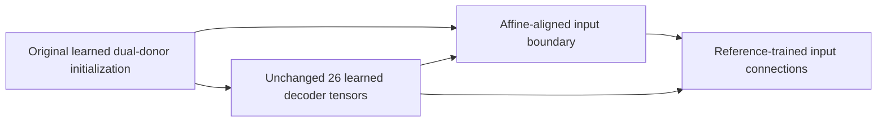

# Continue interface training from the fitted boundary

The aligned-start trainer reuses the learned 8D and 384D decoder bodies and the
primary input boundary selected by the train-only affine fit. It carries that
fitted state into reference training instead of constructing the seeded input
connection again. Original assets, donor embeddings, targets, codecs and source
identities stay bound to their existing generations. Independent 8D and 384D
paths remain available while the 768D branch develops.

## Three preserved generations

The original initialization retains both learned decoder bodies and its seeded
connections. The [aligned handoff](gte_aligned_decoder.md) has its own identity
and changes only the primary input adapter's weight and bias using the fitted
bridge. The new trained checkpoint records both ancestors and has a third
identity beginning `gte-768-aligned-reference-interfaces:sha256:`. None of these
generations replaces or rewrites its parent.

The [trainer](../../ipfs_datasets_py/logic/formalization/autoencoder/gte_aligned_interface_training.py)
loads a private copy of the authenticated aligned generation. It records the
actual fitted starting model and interface hashes, computes the starting
reference objective on that model and creates a fresh four-tensor AdamW
optimizer. It imports no donor moments and supports no optimizer resume.

Only `primary.input_adapter.weight`, `primary.input_adapter.bias`,
`auxiliary_connector.weight` and `auxiliary_connector.bias` can change. All 26
learned decoder tensors remain frozen, with absent gradients and bitwise equal
values checked after each update. Auxiliary grammar loss teaches the shared
primary input boundary as well as its connector. Each head normalizes reference
cross-entropy by its own eligible next-token count before combining positively
weighted scalar losses. The two vocabularies remain independent.

The numerical profile remains CPU float32, one thread and evaluation mode with
gradients enabled. Updates require finite nonzero interface gradients, global
norm clipping and finite resulting tensors. Reports contain per-step losses,
gradient diagnostics and before/after state hashes. They report measured loss
changes without treating a bounded training run as semantic qualification.

## Authenticate the alignment and native inputs together

The [command](../../scripts/ops/autoencoder/run_gte_aligned_interface_training.py)
admits two completed parents: the [native preparation](gte_decoder_native_inputs.md)
and the aligned-student preparation. The
[aligned parent reader](../../scripts/ops/autoencoder/gte_aligned_interface_parent.py)
authenticates the original configuration, affine parent, all source and
implementation files, and every status-dependent output. It reconstructs the
original preparation inputs, replays the source-bound teacher admission and
train/validation plan, and protects the original source roots from output writes.

For a constructed aligned parent, the command derives its four alignment file
pins from independently admitted file bytes: original initialization, fitted
bridge, alignment plan and fit report. It checks the saved aligned checkpoint
against those external objects and reconstructs its handoff and inspection.
The native and aligned parents must bind the same original initialization and
donor-pin files. Their native input profile and encoder asset manifest must
also agree. Historical synthetic probe receipts are authenticated metadata;
they do not establish native encoder execution or semantic fidelity.

All selected native training rows must be ready, and a real admitted aligned
checkpoint must exist, before the command loads Torch or creates an optimizer.
A missing fit blocks training even if native rows are ready. Missing selected
native inputs block training even if the aligned checkpoint exists. Preparation
mode loads no numerical model regardless of readiness.

The native plan keeps its original 242-source audit and fixed 16 primary plus
two original authored synthetic auxiliary training rows. Validation remains
outside the reference objective. Selected-batch readiness remains separate from
complete cohort receipt coverage. Original cached donor vectors are not
relabeled as native 768D inputs.

## Save and verify the actual trained state

The [checkpoint contract](../../ipfs_datasets_py/logic/formalization/autoencoder/gte_aligned_interface_checkpoint.py)
stores only the four trained interface tensors and binds the unchanged learned
weights through the original initialization. It additionally binds the aligned
checkpoint content, starting representation and full starting state, external
alignment file pins, handoff, native plan, codecs and current implementation.
The report's before hashes describe the fitted start.

Training records actual post-optimizer output hashes for every selected
native/reference forward, including both heads, shared condition and auxiliary
latent. It compares a private reload with the live trained model. Publication
then authenticates the saved checkpoint and separate report, requires exact
report agreement and numerically checks the recorded trained outputs from two
private saved reloads. All 30 tensors and selected outputs must match, with
disjoint model storage and zero verifier optimizer steps.

Inspectors check content consistency using the standard library before tensor
libraries load. Numerical replay verifies recorded state and outputs; these
receipts leave KD, donor qualification, native producer authentication, source
fidelity and proof authority disabled.

## Preparation command and current dependencies

The [configuration](../../configs/autoencoders/gte_aligned_interface_training_v1.json)
pins the existing native and aligned preparation manifests, original learned
initialization, donor pins, cached batch and detached replay. It uses `prepare`,
eight planned steps, learning rate 0.001, gradient norm bound 1 and equal head
weights. From the repository root, use a fresh output directory:

~~~bash
python scripts/ops/autoencoder/run_gte_aligned_interface_training.py \
  --config configs/autoencoders/gte_aligned_interface_training_v1.json \
  --expected-config-sha256 ca694b19d09b42531de30713f98c830a9ae4415de1c30dfc9ad4453a5c048b0d \
  --output-directory /home/barberb/lift_coding/artifacts/gte-aligned-interface-training-preparation-20261002/reproduction-01
~~~

Preparation saves native inspection, aligned-start inspection, summary and
completion manifest. Training adds resources, trained interfaces, training
report, checkpoint inspection and saved reload verification. A completion
manifest appears only after all saved outputs and source bytes are rechecked.
Exit code 0 denotes prepared or trained/unqualified, 1 denotes completed
preparation with missing dependencies and 2 denotes invalid input or execution
failure.

The existing production parents have zero selected native inputs ready and no
executed affine fit. This preparation therefore has no aligned starting
checkpoint, 18 missing selected native inputs, zero optimizer steps and zero
trained checkpoints. No encoder, numerical model or download executes. The
[execution receipt](../../../../artifacts/gte-aligned-interface-training-preparation-20261002/execution.json)
and [completed manifest](../../../../artifacts/gte-aligned-interface-training-preparation-20261002/run-01/manifest.json)
record the actual command and status.

For November, reuse compatible cached native receipts first and encode only
missing original sources with the pinned assets. Fit the primary boundary on
training pairs and select it on validation, publish the completed aligned
handoff, and publish a ready native preparation using the same original donor
generation. Bind both new manifests in a new configuration and use `train`.
This preserves the work already learned in both decoders and the fitted boundary.
Measure held-out free-running reconstruction before adding scoped per-head KD,
selective unfreezing, vocabulary changes, direct 768D conditioner promotion or
longer context. The [migration plan](gte_multilingual_migration_plan.md) retains
the separate quality and resource gates for those steps.

Validation passed **125 checks in one combined run**, taking 623.14 seconds:
48 aligned checkpoint checks, 18 numerical training checks, 34 command and
parent-admission checks, and 25 retained original-start command checks. Tests
use real analytic fits and optimizer updates with explicitly synthetic native
receipts. They verify that starting weights and losses come from the fitted
generation, preserve all 26 inherited tensors, compare saved reloads with live
trained outputs and reject altered parent/report/output bindings. Missing
dependencies and valid generations using different encoder assets are rejected
before numerical loading. Original-start command behavior remains compatible.

The [test receipt](../../../../artifacts/gte-aligned-interface-training-preparation-20261002/tests-01/result.json)
binds the successful command, test sources and logs. The
[verification receipt](../../../../artifacts/gte-aligned-interface-training-preparation-20261002/verification.json)
preserves the original assets, implementation and document generations and
records the actual zero-update production preparation.

## Source-only saved-generation evaluation

The [source-only comparison](gte_decoder_source_evaluation.md) now consumes
completed aligned-training manifests and independently loads the original
384D and 8D raw donors. It admits saved trained interfaces and their fitted
start before tensor imports, uses exact cached native inputs for available
student rows, and repeats the saved generated-token and logit traces from
fresh private models. Current native evaluation coverage is 0 of 62 sources,
so the actual baseline evaluates only the original donors with zero updates.
The 60 exposed validation sources and two authored training diagnostics do
not qualify the teacher or student. Evaluation receipt readiness remains
independent of the 18-row training requirement.
