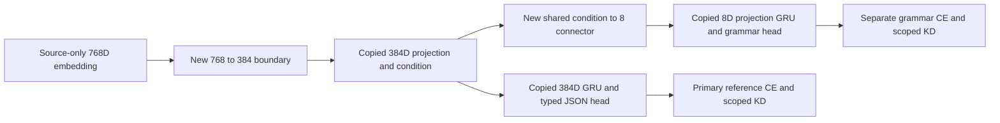
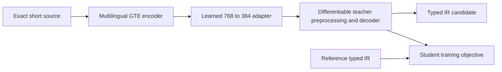

# Parallel 8D 384D and 768D logic IR paths

This plan keeps the 8D, 384D, and 768D paths available as independent lineages. The 8D path continues its own supported training and inference, the GTE-small 384D path keeps improving, and the multilingual 768D path develops alongside them. Qualifying a 384D teacher controls when its distillation labels are used; it does not stop either donor path or block independent 768D producer and reference-supervised work. November 2026 is the proposed transfer month.

Status: preparation tools, parallel dispatch, existing-lane CPU inference workers, a pinned offline 768D producer/corpus handoff, private decoder initialization from learned 8D and 384D donors, a train-only affine fitter, an authenticated aligned-student loader and bounded reference trainers from both the original and fitted initialization are implemented. The first 768D decoder inherits both learned heads; its new connections still need real-data alignment. Real multilingual assets, source-vector pairs, production student fitting and teacher qualification remain pending. This document and its [work items](gte_multilingual_migration_work_items.json) specify the remaining work. See [decoder reuse](gte_decoder_reuse.md), [interface training](gte_decoder_interface_training.md), [aligned decoder handoff](gte_aligned_decoder.md), [preparation tools and the first audit](gte_migration_preparation.md), [model workers](gte_parallel_model_workers.md), and [multilingual preparation](gte_multilingual_preparation.md). The [review record](gte_multilingual_migration_review.json) records the initial source review. Current artifacts additionally bind exact source bytes because this checkout has concurrent edits.

Asset and embedding reuse is required. The [reuse audit and cache admission](gte_embedding_reuse.md) verify all 2640 migration vectors against their original V3 archives and all nine existing GTE-small asset files against both prior generations. Keep those vectors, source identities, references, groups and splits unchanged; do not regenerate old 384D embeddings. Preserve the earlier V2 donor's separate 1320-vector cohort and backend-specific 8D caches. Reuse compatible native 768D receipts before obtaining only missing vectors from the same source text. Old 8D/384D coordinates remain teacher inputs or targets under their original identities; they are not native multilingual 768D vectors.

## Three parallel execution lanes

Coexistence is a user requirement. Each lane has its own representation, runtime selection, model instance, checkpoint ancestry, optimizer/session state, caches, training/inference workers, and output namespace. A new 768D result does not replace the 8D or 384D path. See the [parallel execution contract](parallel_lineage_execution.md) and [three-lane configuration](../../configs/autoencoders/gte_parallel_lineages_v1.json).

| Lane | Current capability | Parallel work |
| --- | --- | --- |
| 8D legacy | Explicit preserved Legal numerical runtime; separate linguistic spaCy feature-hash profiles | Continue on private training branches and keep the complete historical checkpoint immutable |
| 384D GTE-small | Existing source/sparse runtimes and local development checkpoints | Improve teacher fidelity, produce frozen generations, and keep serving its supported inference |
| 768D multilingual GTE | Offline producer, source-task contracts and dual-donor decoder initialization implemented; real assets and fitting pending | Align new interfaces with inherited heads frozen; train from references and add scoped KD when donor gates pass |

Fan out the same source identities into separately prepared representations. The original 8D encoder provenance and token ceiling are unrecorded; an 8D feature vector is not a truncated GTE embedding. Keep shared split/group identities and canonical target evidence, with vectors stored under their full representation IDs.

Use separate spawned processes for concurrent model work. Current backends change process-global Torch/BLAS settings and hold mutable state, so separate Python objects in one threaded worker do not supply sufficient isolation. Bound CPU/GPU/memory resources before launching; three process slots alone do not reserve enough memory. Registry publication still goes through one owner. Each training lane has one writer per mutable model/checkpoint generation.

Distillation reads an immutable, hash-bound donor generation while donor training advances another private generation. Cross-lane labels retain their origin, scope, and mask. No implicit dimension conversion, optimizer merge, checkpoint relabeling, or cross-lane loss averaging is allowed. An unavailable 768D backend returns an explicit unavailable outcome while the installed paths continue.

## Target model and representation contracts

The target has **768 dimensions**, rather than 786, and supports **8,192 input tokens**. It is a 305M parameter multilingual embedding encoder, not a text generator. Its encoder capacity and context length do not define our IR decoder capacity or output limit. These specifications come from the [official model card](https://huggingface.co/Alibaba-NLP/gte-multilingual-base).

| Property | Current source producer | Proposed target producer |
| --- | --- | --- |
| Model | `thenlper/gte-small` | `Alibaba-NLP/gte-multilingual-base` |
| Dense width | 384 | 768 |
| Maximum input | 512 tokens including special tokens | 8,192 tokens including special tokens |
| Pooling | Mean | CLS |
| Vector normalization | L2 | L2 |
| Reference precision | CPU float32 receipts; separate CUDA inference path | Float32 reference; reduced precision is a separately measured profile |
| Overlength input | Explicit rejection in source inference | Explicit rejection or a named source segmentation policy |
| Model revision | `17e1f347d17fe144873b1201da91788898c639cd` | Pinned first profile `9bbca17d9273fd0d03d5725c7a4b0f6b45142062` |
| External model code | Existing ordinary GTE-small loader | Separate `Alibaba-NLP/new-impl` code revision |

The target's [pooling configuration](https://huggingface.co/Alibaba-NLP/gte-multilingual-base/blob/9bbca17d9273fd0d03d5725c7a4b0f6b45142062/1_Pooling/config.json) specifies CLS pooling. Its [model configuration](https://huggingface.co/Alibaba-NLP/gte-multilingual-base/blob/9bbca17d9273fd0d03d5725c7a4b0f6b45142062/config.json) resolves implementation classes through `Alibaba-NLP/new-impl`. The first offline profile pins that code to `40ced75c3017eb27626c9d4ea981bde21a2662f4` and enforces published byte hashes and sizes for its code, tokenizer, configuration and weights. No local target model has been loaded or numerically qualified here.

The target permits shortened dense outputs, but its 384D output is a different vector space from GTE-small. Neither that prefix nor padded GTE-small vectors establishes interoperability. Native semantic IR schemas can remain shared even when their source vector spaces differ.

## Existing work and what its evidence establishes

Four existing training paths must remain separately identified:

| Path | Actual objective and input | Migration use |
| --- | --- | --- |
| GTE source decoder | Source embedding to generated typed IR or structured scalar fields | Primary 384D teacher and 768D student path |
| Legal sparse core and formula head | Parser-derived sample features and source embedding through a sparse numerical core, then latent-conditioned formula generation | Replay the full teacher and export supervision; head reuse requires its exact latent convention |
| Native family reconstruction | Compiler-derived compositional feature vectors to reconstructed features | Reuse typed target preparation, family inventory, and feature evaluation; this loss does not qualify a source decoder |
| Paired text and copy decoder | Custom lexical tokens to generated sequences, with recurrent and pointer attention heads | Reuse copy objectives, vocabulary transfer, and alignment diagnostics in a later decoder design |

[Complete training](../../ipfs_datasets_py/logic/formalization/autoencoder/complete_training.py) exposes distinct entry points for these roles. The native family bottleneck and paired-copy lexical widths are independent of the GTE source embedding dimension. The current paired-copy input ceiling is 192 lexical tokens; changing the embedding encoder will not lift it.

The [reconstruction experiments](reconstruction_training.md) report one Legal diagnostic with 24/24 exact training rules, token CE 0.004605, and only 2/6 exact tuning rules. That exposed panel is useful for regression, not an independent launch test. The [multidomain report](multidomain_reconstruction_training.md) separately records published native source decoders with 0/2 exact semantic held-out reconstructions in each of Intent, Security, and UI/UX, despite valid structure. Later complete-family feature results do not supersede those source-decoder results. A structured source decoder has stronger results on a narrow supported Security grammar, including remaining wording failures; its teacher scope must name that grammar explicitly.

The source corpus and retrieval windows are useful raw material. Their existence does not establish paired gold IRs or completed embedding coverage. For example, the [US Code delivery report](../implementation/reports/source_corpus_delivery.md) retained 62,931 physical rows but only 51 embedded rows, 13 token-limit failures, and 62,867 unattempted rows in that qualification. Begin with a current measured inventory of usable source, target, and embedding joins. Preserve authored diagnostic results as exposed development evidence. Directory labels containing `20261002` identify existing artifacts; this plan does not use those labels to infer an execution date.

## Preserve the reusable assets

| Asset | Required handling |
| --- | --- |
| Original documents and source units | Preserve exact bytes, document identity, character and UTF-8 byte selectors, source namespace, language, and parent relationships |
| Typed Legal, Intent, Security, and UI/UX targets | Retain canonical targets, family/profile identity, sidecars, target origin, and independent evidence |
| Source grouping and partitions | Preserve existing grouping; extend it to all related documents, variants, and translations before generating student data |
| Native schemas, codecs, validators, and consumers | Reuse under their existing interpretation and run targeted regressions |
| 384D vectors and receipts | Preserve as teacher inputs and paired alignment targets; generate new vectors from original text for the student |
| Trained compatible tensors | Copy with tensor inventory, exact parent hash, token identity mapping, and declared new-row initialization |
| Loss, training, and evaluation infrastructure | Reuse where its input assumptions remain valid; give changed objectives a new version |
| Runtime registry, checkpoint packaging, and publication contracts | Add explicit 768D versions and retain existing 8D and 384D selections and defaults |

The source corpus is an integrity and provenance resource. Compiler weak labels, teacher predictions, native shape checks, source comparison, and actual proof-tool executions are different evidence types and remain distinct fields.

## October teacher qualification

WP01 captures the exact source and runtime contracts. WP02 qualifies a chosen teacher per domain and output profile. Legal is the default first transfer experiment, subject to the user's domain preference. The same infrastructure supports the other domains once they have a usable teacher or a supervised baseline.

Before candidate selection, register the supported input/output scope, tuning panel, independent evaluation groups, and acceptance criteria. The qualification report must include:

- Teacher-forced loss, free-running exact IR reconstruction, and per-field fidelity.
- Attempted sources, supported sources, abstentions, unsupported sources, and incorrect predictions as separate counts.
- Native syntax validity, source agreement, and actual tool execution as separate outcomes.
- Negation, deontic modality, exceptions, ordered operands, actor identity, temporal scope, and cross-reference errors.
- Results on new compositions, new wording, and source domains, alongside exposed regression panels.

Proposed pilot launch targets are at least 95% exact IR reconstruction on independently grouped examples within a declared narrow scope, at least 90% coverage of that scope, and no observed critical polarity, exception, or ordered-operand flips in the challenge set. These are planning targets, not measured results or a guarantee. Use at least 50 independent source/composition groups per initial scope, report uncertainty by group, and add a larger natural-source panel before adoption. Freeze the criteria before selecting candidates. A teacher with a narrower qualified scope can supervise that scope while the rest uses reference targets only.

Select checkpoints with tuning evidence. Freeze the selected model, transformations, vocabulary, and implementation before independent evaluation. If those evaluation examples later guide repairs, record them as exposed and create a fresh evaluation cohort for the next final decision. The student final cohort must remain sealed during teacher repairs and student selection. Canaries that share semantic groups with a test panel do not increase the count of independent groups.

Persist exact optimizer state only where the selected backend supports it. The joint formula trainer has resume contracts; the shared source trainer and structured classifier do not provide the same optimizer-resume capability. A new student starts a new optimizer and records that boundary.

## Transfer corpus and artifact contracts

WP03 creates a canonical source and reference dataset independently of teacher readiness. WP05 adds outputs from the frozen teacher only after its scope is established. Use content-addressed blobs and a manifest for large arrays and logits rather than duplicating them in every row.

| Record block | Required fields |
| --- | --- |
| Identity | Sample ID, domain, document ID, group ID, split, canonical source digest, language and source namespace |
| Source | Original artifact digest, exact selectors, source-unit type, parent ID, explicit context selectors, assembled-input digest and assembly policy |
| Reference | Canonical IR digest, target codec/profile, target origin, sidecars, evidence references, validation status |
| Teacher | Exact checkpoint and implementation digests, pipeline identifier, input transform, 384D input receipt, generated output, abstention reason and supervision mask |
| Student input | 768D vector reference, new producer receipt, model and code revisions, token-input digest, token count, vector-space ID |
| Distillation | Logit or field-probability reference, token identity mapping, temperature, conditioning-state reference, teacher disagreement and quality flags |

Suggested vector-space identity is `model@revision:code@revision:d768:pool=cls:norm=l2:input_policy=<policy>:precision=<profile>`. It is a proposed identifier format. Production schemas also need explicit closed fields; an opaque string alone does not validate a profile.

Before fitting, enforce unique identities, finite vectors, exact width/profile agreement, source and target joins, and absence of contradictory labels for identical numerical inputs. Exclude document IDs, groups, exact and normalized source hashes, and duplicate vectors across fitting and evaluation. Extend the existing grouped audit to connected families of related inputs: paraphrases, polarity variants, function-name variants, translations, repository versions, and CVE fix pairs. Quarantine related components discovered across established splits; do not silently move them or rewrite frozen membership. Similar target templates may occur across splits; source/template group policy must be stated rather than silently treating equal targets as independent evidence.

Teacher output is an additional label with a named origin. Never overwrite the reference target. Mask unsupported, unqualified, or contradictory teacher supervision; retain the excluded rows and reasons in coverage accounting. Confidence alone does not establish correctness. Restrict supervision exports and caches used for fitting or selection to train/tuning partitions. Score sealed evaluation only after candidate freeze; it never joins the fitting export. Export teacher probabilities on an explicitly named prefix policy with padding masks. Reference-prefix logits are target-conditioned training evidence; generated inference must run without those targets or prefixes. The embedding tokenizer and IR output vocabulary are different contracts.

Reuse the screening pattern in [legacy teacher preparation](../../ipfs_datasets_py/optimizers/logic_theorem_optimizer/legacy_teacher_distillation.py), but implement a new 384D teacher to 768D student contract. The legacy module currently binds an 8D compiler teacher to 384D students and is not a ready-made dimensional migration.

## Versioned embedding producer

WP04 creates a new producer; it can proceed while 384D quality improves. Use a float32 reference and compare the selected production profile against it. Record device, attention implementation, precision, padding, tokenizer, and batch policy. Cross-device inference is tested with tolerances; exact checkpoint replay uses a fixed execution profile.

The first offline CPU float32 producer is implemented with model/code content pins, eager attention, CLS/L2 and explicit 8192-token rejection including special tokens. The tokenizer's advertised 32768 limit does not widen this profile. The [prepared handoff](gte_multilingual_preparation.md) retains 1920 train/validation tasks and excludes 720 quarantined rows. No real target model or tokenizer has been loaded; synthetic boundary checks and unavailable-asset receipts do not complete G2. This embedding producer is separate from the proposed IR runtime and does not install a 768D decoder selection.

Preflight actual token counts with special tokens and no truncation. The public target examples permit truncation, so our wrapper must explicitly detect overlength before encoding. Validate one-at-a-time versus batched output, padding invariance, normalization, finite outputs, dimensions, and offline loading of pinned model and external code assets. Correct dimensional slicing is `hidden[:, 0, :dimension]` when using the documented CLS representation; validate the wrapper against the upstream implementation rather than copying example indexing unchecked.

Review source text character/byte limits independently from token limits. Existing inference and row contracts cap text at different character lengths. A valid 8,192-token Unicode document can exceed one of those limits. Bound bytes, array sizes, runtime, and total tokens explicitly in the new schema.

The current receipt-set and USCode join contracts also pin GTE-small. New 768D data needs versioned receipt/join handling through the full corpus-to-worker path, not just a replacement embedding function.

## Initialize from both learned decoders first

The production branch starts from learned 8D and 384D decoder weights. Weight copying requires authenticated donor files, complete compatible tensors, exact codecs and input conventions. It can proceed before semantic teacher qualification. Using a donor's predictions as training labels additionally requires its qualified scope and screened masks. A randomly initialized decoder is an optional ablation; it is not the default or a prerequisite for beginning transfer.

The [implemented dual-donor initializer](gte_decoder_reuse.md) copies all 13 tensors of the selected 384D source decoder and all 13 tensors of an experimental learned 8D formula head. The primary decoder retains its projection, condition, GRU, embeddings, output layer, vocabulary and normalization. A new 768-to-384 boundary supplies its adapted coordinates. A new shared-condition-to-8 connector attaches the copied 8D head to the same student. Its loss can therefore teach the shared student boundary even while both inherited bodies are frozen.



The experimental learned 8D head belongs to a fresh 8D core and two authored synthetic training rows. Its vocabulary has 18 entries and its head has 1,918 parameters. The full historical 8D checkpoint contains learned sparse feature/family tables and no formula GRU; it is a separate future supervision source. Neither target-aware legacy reconstruction nor low diagnostic training loss qualifies either donor. Retain the 8D head's declared parser-feature provenance and keep its grammar loss separate from the typed-JSON head's 32-entry vocabulary. Do not average their logits or recurrent weights.

Proceed in this order: snapshot donors and copy weights; verify copied behavior and export separate teacher distributions on the original cached inputs; reuse native embedding receipts and obtain only missing paired inputs; align the new interfaces with inherited weights frozen; train reference loss and screened per-head KD; selectively unfreeze copied weights at a smaller learning rate; promote the learned conditioner to a direct 768D input while preserving behavior; then expand context and languages. Preserve the independent 8D and 384D lanes throughout. The guide specifies artifacts, loss accounting, exact promotion algebra and acceptance checks.

The [decoder knowledge replay](gte_decoder_knowledge_transfer.md) now prepares a bounded original-input transfer bank. All 180 V2 Legal training references fit the selected 384D codec; none of the 360 Legal V3 training or 120 validation references does. Begin same-codec transfer with the original V2 cache and retain V3 vector alignment separately until vocabulary migration. For the 8D head, reconstructed raw latents from its two saved synthetic inputs match both recorded latent hashes and the full original training manifest. Neither unrelated linguistic cache values nor reference-conditioned replay count as source-only native 768D behavior. Exact copied-head equality preserves learned knowledge but supplies no gradient for the new interfaces.

## Short context knowledge transfer

The [native decoder input preparation](gte_decoder_native_inputs.md) connects
the original compatible V2/8D target bank to cached multilingual inputs. It
audits all 242 original sources before selecting training rows and exports only
missing original source tasks. Its reference objective keeps the learned heads
frozen and sends auxiliary loss through the shared primary adapter; selected
training readiness remains distinct from full training/validation cache
coverage. A gradient probe performs zero optimizer steps.

The [bounded interface trainer](gte_decoder_interface_training.md) now supports
a separate reference pilot from the original inherited initialization. Only
four input-connection tensors enter a fresh optimizer; all 26 learned tensors
remain frozen. Its new checkpoint binds the live post-training outputs and
requires exact saved reload. Actual preparation has zero ready native rows,
zero optimizer steps and zero trained checkpoints. The separate
[aligned-start trainer](gte_aligned_interface_training.md) now admits the
authenticated affine-aligned handoff and binds the fitted before-state, original
initialization and actual post-training outputs. It preserves the original-start
runner. Current parents contain no fitted boundary or ready native rows, so
aligned-start preparation also performs zero updates. Neither path completes KD
or short-source fidelity qualification.

The [source-only comparison](gte_decoder_source_evaluation.md) now reuses all
60 original V2 validation vectors and both original synthetic 8D training
latents. It independently loads the raw donors and generates from source
coordinates and self-generated prefixes, then scores the original targets.
Available original, aligned and trained 768D generations use exact cached
native receipts for those same sources. Evaluation coverage is independent of
the 18-row training selection: current native evaluation coverage is 0 of 62,
so the completed run evaluates donors only. The original 384D baseline has
0/60 exact matches despite 60 valid, terminating outputs; the 8D diagnostic
has 2/2 exact matches on its authored training rows. Neither cohort is an
independent holdout. Exact saved numerical replay preserves this regression
baseline while all KD and quality gates remain disabled.

After donor initialization, WP06 fits a bridge on identical sources that fit both tokenizers. The initial differentiable pilot uses the privately copied raw-embedding sequence decoder from `source_training_v2`, a frozen multilingual encoder, and a learned 768 to 384 adapter. Reference-supervised fitting can start before a donor qualifies for KD:



Start with a regularized affine adapter as a reproducible baseline; compare a small nonlinear adapter only after the baseline works. Fit adapter preprocessing on training data only. First freeze the inherited teacher tensors while retaining gradients with respect to adapter output, then allow selected downstream tensors to learn in a separate experiment. Verify nonzero finite gradients into the adapter through training logits. Keep the original teacher checkpoint immutable.

The [train-only affine fitter](gte_affine_alignment.md) now prepares the fully audited pair plan and solves a centered float64 ridge boundary with an unregularized intercept. It evaluates exported float32 weights, selects regularization on validation without refitting, and saves a standalone fitted bridge/report without changing inherited tensors or the original initialization. The current zero-pair corpus yields unavailable with zero fits. The separate shared-condition-to-8 connector still needs its own declared alignment or grammar supervision.

The [aligned student loader](gte_aligned_decoder.md) now authenticates that fit and replaces only the two input-adapter tensors in a separate private dual-head checkpoint. It preserves all 26 learned donor tensors, both codecs and the original auxiliary connector, records the current aligned identity separately from historical initialization, and verifies synthetic gradients plus exact saved reload. A ready plan without an executed fit produces zero aligned checkpoints. Its current production preparation remains unavailable; primary boundary fitting does not mark the auxiliary connector fitted or complete KD. All three original lane namespaces remain independent.

The [affine bridge preparation](gte_affine_bridge_preparation.md) now implements private adapter state, exact-source paired-vector contracts and frozen Torch decoder composition. A bounded diagnostic loaded the selected real 384D checkpoint and verified nonzero finite adapter gradients on synthetic 768D input with BOS only, unchanged weights and exact private adapter reload. That checkpoint uses identity input normalization and has an archived tuning result of 0/60 exact targets; it remains unqualified for KD. No adapter fitting ran, and zero usable corpus pairs exist until real 768D receipts arrive. Pair preparation also audits new 768D vector collisions while preserving the original splits and quarantines.

The adapter must reproduce the selected teacher's real input convention. The sequence source trainer centers and RMS-scales raw embeddings before projection; the structured source trainer projects first and normalizes projected features afterward. The published Legal runtime also has a sparse numerical core and parser-derived sample features. Replay that complete path when exporting its supervision, and report those extra inputs. A claim of source-embedding-only student behavior requires an input audit that excludes reference-derived features.

The sparse core performs Python/list and scalar conversions, and the structured runtime uses NumPy. Freezing their parameters does not make either pipeline differentiable. For these teachers, first fit an adapter to declared exported embedding/latent targets and measure downstream replay, or train a separate differentiable student from exported outputs. A differentiable replacement for their numerical path is a separate implementation with forward-replay fixtures and gradient checks. Do not attach a sparse-core-bound head directly to raw adapter vectors or imply that gradients cross the original core.

An adapted 384D vector is not a genuine GTE-small producer output. The new wrapper must validate and record its learned bridge, original 768D producer, teacher transform, and adapted vector space, and prohibit serialization that labels those outputs as genuine GTE-small embeddings. Existing numerical inference accepts caller-supplied finite 384D vectors without authenticating producer receipts; dimension checks alone do not establish provenance. The new package loader must enforce the wrapper's distinct contract.

WP07 promotes the learned factorized conditioner to a native 768D-input architecture using an exact algebraic composition where available, preserving the learned recurrent/output tensors. Verify logits and gradients with fixed-profile numerical tolerances and check free-running output stability before any new fitting; algebraic equality does not guarantee identical float32 bits. Later capacity expansion uses declared function-preserving initialization or teacher-assisted fitting. A fresh decoder remains an optional ablation. Dimension-dependent tensors must have an explicit mapping; the first factorized branch does not establish use of additional decoder capacity.

| Tensor | Transfer when widths and vocabularies remain compatible |
| --- | --- |
| Projection down weight | New mapping required for a native 768D input |
| Projection down bias | Copy with unchanged projection width |
| Projection up weight and bias | New mapping required for a native 768D residual output |
| Conditioning weight | New mapping required for a native 768D input |
| Conditioning bias | Copy with unchanged hidden width |
| GRU recurrent weights and biases | Copy with unchanged token and hidden widths |
| Token embeddings and output weight/bias | Map rows by exact token identity; record initialization for new rows |
| Structured scalar classifier coefficients | Refit or transfer through the exact adapter/transform; do not silently pad coefficients |

The existing [domain transfer implementation](../../ipfs_datasets_py/optimizers/logic_theorem_optimizer/domain_384_autoencoder.py) supplies an auditable lexical mapping pattern. It currently enforces 384D. The [Security checkpoint migration helper](../../ipfs_datasets_py/logic/formalization/autoencoder/security/checkpoint_migration.py) rebinds compatible implementation identities; it does not change dimensions or embedding models.

## Training objectives and experiment matrix

For matched output vocabularies, the proposed sequence objective is:

```text
L = L_reference
  + lambda_KD * mean_valid_tokens(T^2 * KL(p_teacher(T) || p_student(T)))
  + lambda_state * L_matching_conditioning_states
  + lambda_relation * L_pairwise_similarity
  + lambda_reconstruction * L_declared_reconstruction
```

Use reference-prefix teacher-forced logits for the initial sequence KL experiment and evaluate free-running generation separately. Teacher and student must receive the same canonical reference prefix under the same output codec and token identities. Export prefix token IDs/digests, codec identity, padding/supervision masks, and whether probabilities are raw or grammar-masked. Mask rows with prefixes outside the teacher vocabulary. The Legal grammar codec and shared typed-JSON codec do not have interchangeable timesteps; token-row mapping alone cannot align different output tokenizations. Use hard typed outputs or separately aligned fields across those boundaries.

Start with `T=2` as a proposed candidate; compare `T=1` and retain the existing decoder's deterministic inference policy. Average over valid supervised tokens and account for the teacher mask. Structured classifiers use aligned field probabilities instead of sequence logits. If a teacher exposes only generated hard targets, label that experiment pseudo-label training, not soft-logit distillation.

Do not compute coordinate MSE between unrelated 384D and 768D vectors. Match adapter outputs to the teacher's declared coordinates, matching-width conditioning states, or pairwise relations. For normalized embedding reconstruction, report squared L2 error per vector and cosine error alongside the historical mean-coordinate MSE: raw MSE can fall mechanically as width increases. Preserve or version scale inversion in the current source trainer. Compare magnitudes and gradient contributions before fixing loss weights.

Tune a small, declared grid on tuning data; do not inherit the old gain or reconstruction multiplier blindly. Begin with reference loss plus adapter alignment, add KD, then evaluate optional state and relational terms one at a time. Reduce the KD weight after stabilization so validated references and new capacity can improve beyond teacher mistakes.

| Arm | Encoder and decoder | Question |
| --- | --- | --- |
| A | Frozen selected 384D teacher | What behavior and cost are being transferred? |
| B, optional | Frozen 768D encoder with supervised fresh head | What is gained without learned decoder initialization? |
| C, first branch | Frozen 768D encoder, new interfaces, both inherited frozen heads | How much behavior can be preserved with reference-supervised alignment? |
| D | Inherited branch with selected downstream tuning and separately scoped 8D/384D KD | Does each donor improve the shared student over C? |
| E | Direct 768D conditioner promoted from the learned branch, with and without KD | Does further capacity expansion improve fidelity after exact promotion? |
| F | Best student with limited encoder fine-tuning | Is encoder tuning justified by a remaining measured gap? |

The encoder stays frozen through B to E. Compare C/D with 384D-only initialization, dual-donor initialization without 8D KD, and dual-donor initialization with admitted 8D KD to separate weight reuse from teacher-label benefit. Encoder fine-tuning, adapters inside it, or contrastive training create a new producer/checkpoint identity and invalidate previous embedding caches. Use a separately sized experiment rather than an automatic next step.

Use at least three declared seeds for the main comparison, identical split and target manifests, and equal declared optimizer-update budgets within comparable decoder arms. Record unique examples, token presentations, wall time, and hardware separately; a frozen encoder and a tuned encoder have different compute budgets. Select on tuning data and evaluate frozen finalists once on the independent cohort.

## Long context and multilingual extension

WP08 introduces context in stages: 512, 1,024, 2,048, 4,096, and 8,192 tokens under the target tokenizer. Keep a short-source regression panel throughout. Test each stage against a baseline that processes the same source as bounded GTE-small units with explicit IR assembly. Bind the same document target, source/context access, and a declared assembly policy for both treatments; when the architecture requires different assembly, report that as a separate factor. Count all overlap, context, boundary-scoring, assembly, and generation work and retain every failure. Equal document identities alone do not establish equal access to definitions or scope. Improved coverage from accepting more text is separate from improved semantic accuracy.

Reuse [coherent spans](../../ipfs_datasets_py/logic/formalization/coherent_spans.py), [token windows](../../ipfs_datasets_py/logic/formalization/token_windows.py), and [source document routing](../../ipfs_datasets_py/logic/formalization/autoencoder/source_document.py). Existing context selectors are provenance and often stay outside the embedded payload. Build a named input-assembly policy that actually includes required headings, definitions, code context, or linked clauses and binds the resulting bytes. Recount tokens after assembly. Retrieval windows remain slices, not automatically complete modeling inputs or gold IR units.

Compare two representations: a whole-document CLS vector and hierarchical ordered clause/chunk vectors with source spans and a document decoder. The second is an architectural proposal. A single dense vector may omit identifiers or cross-clause scope needed for exact reconstruction. Retain the whole-document arm so the value of hierarchy is measured.

Long-context training requires independently supported document-level targets for definitions, later exceptions, entity reuse, cross-references, multiple rules, and ordered execution or temporal dependencies. Local 384D teacher outputs supervise only supported local units. Their concatenation does not establish a correct document target. Keep uncertain or unresolved references explicit.

Input length, IR output length, and IR structure have independent limits. The current sequence source decoder defaults to 512 output tokens with a 1,024-token configuration ceiling; the structured decoder requires a fixed tree, fixed array lengths, and training-derived scalar classes. Add a versioned variable-structure decoder or explicit typed-unit assembly for larger documents. Reuse pointer-copy, alignment, and coverage ideas for new literals, with a new token-state adapter and explicit source-copy evidence. Record assembly failures and truncated generations rather than scoring only surviving units.

The first English transfer does not qualify other languages. Current sentence chunking uses `pysbd.Segmenter(language="en")`, and weak Intent extraction and source-agreement grammars use English/ASCII lexical profiles. WP08 needs versioned language-specific segmentation, supported grammar/scope checks, and reviewed source/IR targets before claiming multilingual IR fidelity. Group translations with their originals. Track language, code versus prose, Unicode selectors, token budgets, mixed language, and names separately. Compare a supervised multilingual student with and without English-teacher supervision; preserve the pretrained multilingual representation if English specialization harms other languages. Sparse retrieval is an optional future comparison, separate from the first dense IR migration.

## Evaluation and resource gates

WP09 uses independently grouped source cohorts and preserves failures in every denominator. Publish exact IR accuracy and coverage per domain, logic family/profile, source type, language, and token-length band. Include uncertainty by group, unknown-class/atom rates, malformed IR, unresolved references, unsupported inputs, and generation overruns.

| Gate | Required evidence |
| --- | --- |
| G0 Source and data | Pinned implementation, original source joins, target origin, complete group exclusion, and reference profile |
| G1 Teacher | Declared supported scope and coverage, independent free-running fidelity, challenge outcomes, frozen checkpoint |
| G2 Producer | Correct revisions, CLS/normalization/width, no silent truncation, offline loading, reference numerical checks |
| G3 Short transfer | No more than a proposed 1 percentage point exact-accuracy regression against the qualified teacher on matched supported inputs; no increased critical scope error count; all failures retained |
| G4 Context expansion | Per-length document targets, no unintended short-source regression, measured gain over same-source chunked baseline, verified source assembly |
| G5 Adoption | New package loads and rejects incompatible profiles, existing 8D and 384D regression fixtures pass, concurrent workers preserve identities/state, measured memory/latency fit the declared deployment budget |

G3 is a suggested pilot tolerance, to be frozen before student selection. Use paired group analysis; a tiny panel cannot establish noninferiority. Absolute source fidelity remains necessary even when teacher parity passes. A reference-supervised fallback without a qualified teacher needs a separately preregistered absolute source-fidelity and coverage threshold on reference targets; it cannot claim teacher noninferiority. Context expansion waits for the appropriate short-source fidelity gate in either branch. Gates apply independently to each output profile. Unsupported logic families remain explicit gaps.

Benchmark encoder loading, tokenization, embedding, decoder, qualification, and tool execution separately. Measure batch one and token-budgeted batches across length bands, padding waste, peak resident/accelerator memory, documents per second, tokens per second, and checkpoint/storage sizes. The local device reports NVIDIA GB10; capacity, free memory, kernels, and concurrency must be measured before selecting production profiles. Do not assume device-reported VRAM describes unified-memory capacity.

For one million vectors, float32 storage alone grows from 1.536 GB at 384D to 3.072 GB at 768D, excluding indexes and metadata. FP16/BF16 vectors use half that amount but require a measured precision profile. Maximum input length grows sixteenfold; attention compute and memory do not have a universal sixteenfold multiplier. Use efficient attention/unpadding only after compatibility tests. Cache frozen embeddings; invalidate them if the encoder or input policy changes.

## Implementation work packages

All names for future 768D modules below are proposed; current callable APIs are linked separately. Each package has an explicit dependency and completion criterion in the [work-item list](gte_multilingual_migration_work_items.json).

| Work package | Concrete implementation scope | Completion evidence |
| --- | --- | --- |
| WP01 Baseline inventory | Freeze source/checkpoint/producer identities and per-domain capability matrix | Reproducible teacher replay and complete input/tensor inventory |
| WP02 Teacher readiness | Improve selected 384D source models and evaluate fresh grouped cohorts | G1 report per supported profile |
| WP03 Canonical transfer corpus | Version grouped source/target/context manifests and exclusions | G0 audit with rejected joins and coverage counts |
| WP04 768D producer | New producer/runtime and receipt profiles, receipt sets, corpus joins | G2 reference fixtures and resource measurements |
| WP05 Teacher export | Frozen outputs/logits/fields and supervision masks | Replayed digests, explicit label origins and output mapping |
| WP06 Decoder reuse and adapter transfer | Copy both donors, shared auxiliary branch, new interface alignment and scoped KD | C first, D after supervision gates; B optional |
| WP07 Native 768D branch | Exact conditioner promotion, compatible capacity expansion, fresh optimizer | Arm E, function preservation and optional fresh-weight comparison |
| WP08 Context and language | Explicit context assembly, ordered IR composition, staged cohorts | G4 reports and optional separate multilingual results |
| WP09 Evaluation and profiling | Paired grouped reports, source checks, actual consumer runs, resource budgets | Frozen finalist comparison, applicable G3/G4 outcomes, and resource evidence for G5 |
| WP10 Runtime and package | Explicit 768D dispatch, closed package schemas, offline loading, adoption documentation | Old/new compatibility tests and local package replay |
| WP11 Parallel lane coordination | Independent process dispatch, explicit identities, private writable namespaces, immutable donor exchange | Concurrent diagnostic dispatch and failure/isolation tests; real model workers validate their own pins and budgets |

WP06's donor-weight initialization needs WP01's pinned tensor/codec inventory. Its reference-supervised fitting needs WP03 and WP04; teacher-label/KD fitting additionally needs WP02 and WP05 for each donor scope. These gates do not block copying learned parameters. WP08 expands a student only after its applicable short-source fidelity gate passes. WP09 produces fidelity and resource evidence. WP10 consumes that evidence and completes G5 by producing and testing the local package.

Place the new embedding producer and transfer contracts under the existing autoencoder/optimizer ownership boundaries. Add source-facing lazy entry points alongside `complete_training.py` and explicit versions in `autoencoder_runtime_registry.py`. Reuse native target contracts. Extend corpus and registry transport only after local artifact contracts work; changing a modality string does not make current fleet/HF/Arrow transport compatible.

Meaningful checks include producer profile rejection, wrong-width rejection, boundary token counts with specials, Unicode selector correctness, training-only normalization, teacher transform replay, vocabulary alignment, masked KD, unchanged teacher hashes, group leakage rejection, variable-output limits, and exact local reload. Check optimizer resume only where the new package claims that capability. Actual Lean/SMT/model-checker results remain separate from generated IR fidelity.

## October and November delivery sequence

| Period | Work and decision |
| --- | --- |
| October preparation | WP01, WP03, and WP11; continue 8D and 384D independently; improve WP02; implement WP04 independently of teacher readiness |
| November 1 to 7 | Keep donor lanes running; refresh inherited decoder snapshots; complete producer/corpus joins; fit new interfaces; add qualified WP05 supervision |
| November 8 to 14 | Compare inherited arms C/D and donor ablations; begin exact WP07 promotion after the learned path is reproducible |
| November 15 to 21 | Compare E; extend the best suitable student through WP08; develop necessary variable-output contracts |
| November 22 to 30 | Freeze finalists, complete WP09, and prepare/replay WP10 local packages |

These are target dates and dependency milestones, not a promise that long-context quality will be established in one month. If G1 fails, continue reference-supervised 768D experiments and teacher repairs while keeping KD disabled for the unqualified scope. If G3 fails, diagnose representation and decoder transfer before expanding context. If G4 fails, retain the qualified short-context student and the explicit chunked baseline rather than adopting an unmeasured document path.

Publication and deployment are separate downstream actions. This plan ends at a concrete local package and adoption report; it does not schedule a job, alter a default model, or upload artifacts.

## Evidence and reproducibility

The companion [review record](gte_multilingual_migration_review.json) contains the inspected file hashes, repository commit, upstream metadata observations, and the limits of this planning review. Existing diagnostic results are linked through [reconstruction training](reconstruction_training.md), [multidomain reconstruction](multidomain_reconstruction_training.md), and the [source corpus delivery report](../implementation/reports/source_corpus_delivery.md). Re-run the inventory from a frozen implementation before executing the experiments because this workspace is actively changing.
