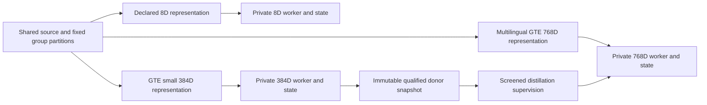

# Running the 8D 384D and 768D paths in parallel

The three paths are independent lineages that can train or infer concurrently. Each keeps its own representation, runtime selection, checkpoint ancestry, optimizer/session state, cache, and outputs. The existing 8D and 384D backends remain available while the 768D producer and decoder are developed. Teacher quality gates control distillation, not whether the other lanes may run.

The [lineage configuration](../../configs/autoencoders/gte_parallel_lineages_v1.json) records concrete local 8D/384D checkpoints and the proposed 768D profile. Its relative checkpoint/artifact paths resolve against its declared workspace root, `/home/barberb/lift_coding`. It is a coexistence plan, not a launch configuration. Its representation declarations do not authenticate historical vector producers. The [transfer plan](gte_multilingual_migration_plan.md) supplies the qualification and long-context work.

## Existing backends and the planned lane

| Lane | Explicit backend | Current scope |
| --- | --- | --- |
| `legacy_8d` | `autoencoder_runtime_registry.open_runtime("legal_ir", "legacy_v1", ...)` | Existing historical sparse feature model; requires explicitly bound 8D inputs. Base inference reconstructs features/vectors, with separate formal readout requirements. |
| `source_384d` | `complete_training.load_source_decoder_384_v2(...)` | Existing source sequence checkpoints for four domains. This module API is distinct from the published Legal sparse runtime. Each job selects one actual domain/checkpoint. |
| `multilingual_768d` | Proposed versioned multilingual producer and decoder | Not implemented yet. Use an unavailable outcome until a genuine checkpoint and verified worker exist. The upstream 8192-token encoder ceiling does not establish document-decoder capability. |

`legal_ir:source_training_v2` and `legal_ir:gte_multilingual_768_v1` in the plan identify selected or proposed pipelines; they are not newly registered runtime versions. Runtime selection never follows from dimensionality alone. A native structural model with latent width 8 is also distinct from an external 8D embedding path.

The pinned full historical checkpoint remains read-only. Create a separately named branch before any 8D training. Deterministic spaCy feature hashing has its own representation and checkpoint identity; it must not silently replace an unknown historical embedding producer. The [CPU model-worker guide](gte_parallel_model_workers.md) covers the implemented inference entry point for existing backends and the separately identified linguistic 8D profile.

## Shared sources and independent workers



Source identities, typed reference targets, and leakage-group memberships may be shared. Vectors, preprocessing statistics, optimizer moments, checkpoints, and caches belong to their lane and profile. Cache keys bind exact source/context, producer revision, tokenizer, pooling, precision, and normalization. Sharing a source does not justify padding vectors, treating a 384D prefix as GTE-small, or loading another lane's optimizer state.

Use separate processes because existing numerical paths alter process-global Torch thread settings, BLAS limits, random state, and embedder caches. Configure device visibility, thread limits, and CPU/GPU/memory budgets in the worker entry point before runtime initialization. The process-count cap alone does not reserve accelerator memory. Long-context jobs must meet measured budgets, or run on separate devices or admitted schedules.

Each training session has one writer and publishes fresh immutable checkpoint generations. Distillation pins one generation's hash while donor training continues on its own branch. Retain parent ancestry and supervision provenance. Use the existing single owner for shared DuckDB registry publication; workers must not compete to write one registry.

## Local process coordinator

[gte_parallel_paths.py](../../ipfs_datasets_py/logic/formalization/autoencoder/gte_parallel_paths.py) provides the dependency-free API:

```python
run_parallel_paths(jobs, *, max_parallel=3, timeout_seconds=None)
```

Call runnable dispatch from the main thread so launch and Ctrl-C handling have one owner. The coordinator validates the complete job list before launching trusted argv with `shell=False`. It starts up to three independent workers, propagates lane identities, captures separate log files, and preserves other lanes when a worker fails. Timeouts apply from each worker's launch. POSIX completion, timeout, and interruption cleanup terminates remaining members of the worker process group. Workers must manage descendants that detach from that group. The coordinator imports no model runtime and does not verify model numerics or child checkpoint receipts.

Each job has exactly these fields:

| Field | Required meaning |
| --- | --- |
| `lane_id` | Exactly `legacy_8d`, `source_384d`, or `multilingual_768d`, once per dispatch |
| `dimension` | Exactly 8, 384, or 768 for the selected lane |
| `runtime_id` | Explicit backend/domain/pipeline identity, not inferred from width |
| `representation_id` | Explicit producer and transform profile |
| `checkpoint_sha256` | Full pinned checkpoint hash for a runnable job; may be `null` when unavailable |
| `state_directory` | Private writable training/session namespace; may already exist for explicit resume |
| `output_directory` | Fresh private run directory for logs and outputs |
| `command` | Trusted nonempty argv list, or `null` for an unavailable worker |

All lanes' declared state/output paths must be disjoint without cross-lane nesting, including resolved symlink aliases. These checks protect declared namespaces; subprocesses are trusted and are not filesystem sandboxes. Workers must honor the declarations and avoid writing original checkpoints.

Workers receive `GTE_PATH_LANE`, `GTE_PATH_DIMENSION`, `GTE_PATH_RUNTIME`, `GTE_PATH_REPRESENTATION`, `GTE_PATH_CHECKPOINT_SHA256`, `GTE_PATH_STATE_DIRECTORY`, and `GTE_PATH_OUTPUT_DIRECTORY`. A worker must check its actual checkpoint bytes, dimension, representation, runtime/codec, and resume profile before use. Environment labels alone establish none of those checks.

## JSON launch interface

[run_gte_parallel_paths.py](../../scripts/ops/autoencoder/run_gte_parallel_paths.py) reads a closed JSON object with `schema: "gte-parallel-path-jobs/v1"` and a `jobs` list using the fields above. Relative state/output paths resolve against the jobs file's parent directory. Commands remain exact caller-owned argv; no model command is invented by the launcher.

Use the supplied [CPU model worker](gte_parallel_model_workers.md) or another verified worker entry point, then launch from the workspace with a fresh report file:

```bash
python3 external/ipfs_datasets/scripts/ops/autoencoder/run_gte_parallel_paths.py \
  --jobs-file /path/to/verified-worker-jobs.json \
  --report-file artifacts/gte-parallel-paths/run-report.json \
  --max-parallel 3 \
  --timeout-seconds 600
```

The report file is reserved before launch and must be outside the declared lane directories. Duplicate JSON keys, invalid numerical literals, wrong schemas, and namespace conflicts fail before workers start. Completed reports retain job identities, exit status, elapsed time, log paths, and a digest of the declarations. Full logs stay in their lane directory; returned excerpts are bounded. A partial/failed dispatch returns a nonzero CLI status while preserving the per-lane report. Interruption or an unexpected coordinator exception may leave an empty/incomplete reserved report; the CLI reports failure and emits no successful summary.

A missing 768D worker uses `command: null` and `checkpoint_sha256: null`; its status is `unavailable`, with no launch or output directory creation. Installed lanes still run. This is distinct from numerical success, and no 384D fallback is substituted.

## Evidence and remaining implementation

The focused suites passed **56 tests** using short synthetic subprocesses: 38 coordinator tests and 18 CLI tests. A three-worker barrier checks that all lanes can launch together; identity, private paths, independent failure, timeout/descendant cleanup, launch-time SIGINT, interruption, log limits, and invalid declarations are exercised. This is process-coordination evidence, not model inference, training, or representation compatibility evidence.

WP11's dispatcher and existing-lane CPU inference worker are implemented. The worker checks checkpoint/profile bindings and applies process budgets. Concurrent training, aggregate resource admission, broader numerical regressions, and the 768D backend remain outstanding. WP04 adds the real 768D producer; WP06/WP07 add its decoder branches. WP10 must preserve both existing 8D and 384D selections when packaging the new lane. Compare typed output fidelity and cost on matched sources; keep native losses separate because the three paths optimize different objectives.
