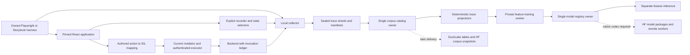

# React interaction capture and UI IR specification

Status: proposed implementation specification, 2026-09-30. This document defines
the next implementation; it does not announce a running recorder, importer,
broker or distributed UI trainer. The existing implementation baseline is
dataset commit `3ea970167c58fa28dc964caa52e43fe2ad95c8d6`.

Build a source-controlled React capture environment that records browser actions,
actual handler invocations, explicitly exposed application state, and correlated
typed backend calls. Preserve those observations as immutable evidence, derive
UI_UX_IR projections, and train features with the existing native autoencoder.
The initial deliverable is a small reproducible local pipeline. Multi-machine
collection/training and HF exchange follow after its evidence and resume
contracts pass their tests.

Use this document for architecture and interfaces, the
[trace contract](react_trace_contract.md) for record semantics, and the
[implementation plan](react_capture_implementation.md) for work packages,
dependencies, tests, resource limits and release gates. The
[machine-readable backlog](react_capture_work_items.json) mirrors the work
packages; it is a planning artifact, not an executable supervisor goal database.

## Required outcomes

1. Reproduce a UI interaction from pinned source and declared initial state,
   with an action/handler/update/commit trace and explicit missing observations.
2. Join a component action to an IDL method only through an authored,
   source-bound mapping. Validate arguments and results against that exact
   descriptor and retain dispatch and backend evidence separately.
3. Prepare deterministic targets once per immutable trace/adapter/profile,
   then reuse them across bounded training attempts and parameter comparisons.
4. Train and resume private native candidates with fixed vocabulary, tuning
   identity, optimizer state and exact ancestry; infer without optimization.
5. Preserve capture failures, rejected calls and unknown outcomes. Never convert
   a declared update, successful test, low loss or database row into proof.
6. Export a verifiable data/model package with explicit missing capabilities,
   then extend owner-controlled transport without sharing a live DuckDB file.

The default collection profile is a controlled local fixture with synthetic
data. Automatic capture of arbitrary production sessions is outside v1. No
pretrained weights, larger context window or nonzero generation temperature are
needed. These changes do not modify the legal success definition: only the
actual source-locked `lake build <Lib>` path admits legal output. UI trace
checks, family syntax checks and reconstruction do not formalize Constitution
spans.

## Existing implementation and planned additions

| Responsibility | Existing code | Addition required |
| --- | --- | --- |
| Closed DOM and explicit IDL rows | [ui_training_inputs.py](../../ipfs_datasets_py/logic/formalization/autoencoder/ui_training_inputs.py), `ui-bound-training-row/v1` | Separate trace envelope/adapter; keep v1 accepted fields and meaning unchanged |
| Native UI target views | [ui_targets.py](../../ipfs_datasets_py/logic/formalization/autoencoder/ui_targets.py), [domain_targets.py](../../ipfs_datasets_py/logic/formalization/autoencoder/domain_targets.py) | Source-bound observation views for handlers, commits and typed-call evidence |
| Structural feature training | [ui_feature_training.py](../../ipfs_datasets_py/optimizers/logic_theorem_optimizer/ui_feature_training.py), [numerical backend](../../ipfs_datasets_py/optimizers/logic_theorem_optimizer/autoencoder_projection_features.py) | Explicit trace-profile dispatch, immutable split manifest and prepared-target input |
| Owned local worker | [UI CLI](../../scripts/ops/ui_ux_ir/run_ui_feature_training.py) | Capture/import/evaluation entry points using the same admission and watchdog pattern |
| Policy mediation and typed projections | [mediator.py](../../ipfs_datasets_py/logic/ui_ux_ir/runtime/mediator.py), [idl_projection.py](../../ipfs_datasets_py/logic/ui_ux_ir/runtime/idl_projection.py) | Authenticated executor, durable invocation ledger and response-to-state adapter |
| Version-fenced UI state model | [state_machine.py](../../ipfs_datasets_py/logic/ui_ux_ir/runtime/state_machine.py) | Explicit mapping from observed application state and responses; require the version fence at the new boundary |
| Model registry | [AutoencoderRegistry](../../ipfs_datasets_py/duckdb_control/autoencoder_registry.py) | Reuse model/artifact ownership; add a separately versioned UI corpus catalog |
| Quack, DuckLake and HF | [control-plane guide](control_plane_and_sync.md) | UI-specific commands, tables, codecs and transport tests; production remote service remains new work |

Existing UI training produces structural features and no executable formula
decoder. Its five default views include declared behavior/norms and an explicit
interface-binding frame view. The new observation profile must not silently
substitute recorded events for those declarations or call the old five-view CLI
with empty/fabricated descriptors.

## Corpus selection

Use ComponentBench as the first reproducible component environment. Its release
combines a runnable React/Next.js application, Ant Design/MUI/Mantine components,
human browser-action trajectories and programmatic task checks. Its trace schema
documents browser actions, not a complete React handler/state trace; our recorder
must supply that extra layer. The HF release uses file assets rather than a
ready default dataset loader. Sources: [dataset card](https://huggingface.co/datasets/TianchenGuan/ComponentBench),
[application](https://github.com/TianchenGuan/ComponentBench),
[trace schema](https://raw.githubusercontent.com/TianchenGuan/ComponentBench/main/schema/trace.schema.json).

Keep official benchmark tasks/reference trajectories in a frozen evaluation
partition. Author separate training scenarios and initial states in our own
fixture. Treat task/template relatives and source-equivalent variants as one
exclusion cluster. Similar components in the same upstream library are not a
claim of unseen-library generalization; record that overlap explicitly. Pin the
application and HF commits independently and record the exact files used.

WebLINX and Mind2Web add broader browser workflows. They can populate browser
action/DOM observations while React handler and IDL fields remain absent.
Their traces are imports, not new locally authenticated executions. The
[dataset guide](ui_datasets_and_bindings.md) retains source-specific terms and
split caveats. Do not train on a frozen benchmark or expose hidden success
predicates, goal-state values or evaluator-only DOM nodes as model inputs.

## Architecture and ownership

The browser emits evidence, not SQL or model updates. The collector owns the
append-only local spool. A corpus owner commits sealed manifests and dataset
snapshots. The existing model registry owner registers candidate artifacts.
Training workers read immutable targets and keep numerical state in private
memory. A backend executor owns invocation authorization and effect recovery.

Start with local process boundaries. The browser-to-collector channel is a
Playwright binding in the owned browser context, relayed through a bounded Node
process pipe to the collector. Do not expose an unauthenticated network listener.
Bind each stream to its registered page/frame and collection session; data from
an unregistered frame is rejected. This attribution identifies the capture
channel, not an independently proven browser statement. Remote collectors later
use authenticated transport and the same immutable shard format.

## Recorder API and React semantics

Create a private package at proposed `typescript/ui-react-trace/`, with `core`,
`react` and `playwright` exports. React and the browser driver are explicit peer
or development dependencies; importing core must not launch a browser or load a
model. Pin the tested toolchain in its lockfile and capture manifest. Existing
TypeScript runtime-monitor code provides repository conventions, not a React
recorder.

The proposed API surface is:

| API | Contract |
| --- | --- |
| `createRecorder(config, sink)` | Bind session, build/source manifests, redaction policy and bounded sink; return a disposable recorder. Disabled mode is a no-op. |
| `registerComponent(definition, instance)` | Join a stable definition/source ID to an instance, registration lifetime and owned DOM root; emit registration at a commit/application boundary and return an unregister function. |
| `wrapHandler(binding, original)` | Observe synchronous entry/return/throw while preserving call behavior and the exact returned/thrown object. |
| `currentInvocation()` | Obtain an opaque context only during the synchronous wrapped call; absent elsewhere. Copy it explicitly for later operations. |
| `withContext(context, callback)` | Restore an explicitly supplied context only for the synchronous callback extent, with `finally` cleanup; never retain global context across an `await`. |
| `beginOperation(context, declaration)` / `endOperation(handle, outcome)` | Observe an application-owned asynchronous boundary and its explicitly observed completion; never subscribe to or replace the application's Promise. |
| `declareUpdate(context, update)` | Record application-declared intent and a state-domain/update ID. It neither calls a setter nor claims a commit. |
| `useTraceCommittedState(binding, selectedState, updateIds)` | Observe allowlisted state in a React layout effect; record its boundary kind, application version and explicit update references. External-store commits use a separately named adapter. |
| `recordRequest(context, retainedRequest)` | Observe an already prepared IDL request from the trusted application adapter; does not dispatch it. |
| `recordResult(context, receipt)` | Retain response observations and verifier references without granting authentication itself. |
| `flush()` / `close()` | Flush asynchronously; return durable collector acknowledgement or an incomplete-capture receipt. Never block a React handler on transport. |

Handlers keep `this`, argument order, return identity, synchronous thrown
identity and render-specific closures. Implement wrappers as normal functions
using `Reflect.apply` and restore synchronous context in `finally`. Do not
silently replace a callback with a stable wrapper reading the latest callback
from a ref. Recorder serialization failures must not swallow application errors
or call the handler twice. Never enumerate arbitrary event objects or getters.

Do not emit records from render, functional state updaters or reducers. Those
executions may be replayed or abandoned. Allocate declared update IDs at explicit
event/operation boundaries and carry attribution through application-owned
state. Pure wrapper construction may happen during render; emissions begin only
when the callback actually runs. A retained old callback keeps its old closure;
any state reference must say whether it identifies that captured render or only
the latest independently observed state before invocation.

Do not make the wrapper `async`, or attach `.then`/`.finally` observers to a
returned Promise by default. Those can change Promise identity, rejection
handling or custom-thenable behavior. A handler return records synchronous
return only. Applications explicitly record later operation completion where
they already handle it. Timers, promises, concurrent requests and transitions
carry an explicit context; a global current-action value held across `await`
cannot identify causal relationships.

React handlers read the state snapshot for their render; setting state schedules
work rather than providing an immediate committed after-state. Capture before
and after values through registered state selectors and application versions,
not a read immediately after calling a setter. Source: [React state snapshots](https://react.dev/learn/state-as-a-snapshot).
Observe React-committed state with a narrowly scoped layout-effect hook.
An application store subscription records a separate `external_store_commit`
boundary; it cannot claim that React rendered that value. Do not
inspect Fiber, patch React hooks, serialize the entire component tree's props or
claim an effect callback is a global React commit identifier.

Record development/production and StrictMode settings. Development checks can
repeat render/effect setup; they do not justify deleting repeated event-handler
observations. Mount lifetimes, observations and semantic application versions
have different IDs. Suppress duplicate transmission by record identity only;
retain repeated observations and label their relation. Source:
[React StrictMode](https://react.dev/reference/react/StrictMode).

The driver records an attempted click/fill/select separately from the DOM event
and handler it observes. Keyboard activation, prevented defaults, propagation,
nested targets, portals, hydration, disabled controls and no-op actions need
explicit fixtures. A temporal overlap with a driver action is an association,
not a verified trigger. See the [causal contract](react_trace_contract.md#causal-and-state-rules).

## Harness and first application

The first fixture contains a controlled input, checkbox, select, counter, dialog,
validated form, debounced search and a small records list/detail view. Use
synthetic public values. Add out-of-order search results, validation rejection,
confirmation-required mutation, timeout and unmount scenarios after the local
event/commit path works. Start backend integration with `list_records` and
`get_record`; mutation tests use a disposable fixture backend.

Storybook interaction tests drive component stories and verify callback calls;
Playwright drives full application flows and retains DOM/network traces. These
are complementary capture channels, not evidence that every React callback or
business effect has been observed. Sources: [Storybook interaction tests](https://storybook.js.org/docs/writing-tests/interaction-testing),
[Playwright trace viewer](https://playwright.dev/docs/trace-viewer).

Use exactly one driver per episode. A Playwright-owned episode disables Storybook
autoplay; a Storybook play function owns its own interaction sequence. Install
one ordered recorder initialization bundle before navigation/application code,
including registered frames. A post-navigation hook is too late for initial
mount events. Await the driver's own actions and assertions, then use the
scenario's bounded completion policy rather than assuming network idleness.

Application exports stable `component_definition_id`, `handler_id`, source file
digest/export name and declared state schemas. Instance IDs distinguish repeated
list items and remounts without exposing raw user keys. Store a digest of the
authored binding manifest, not a guessed mapping from button text. Avoid relying
on React-generated IDs or upstream test attributes as permanent source identity.
Record retained DOM IDs separately. AST-assisted binding discovery may later
propose mappings; it cannot mark them observed or approved automatically.

Benchmark evaluators run in a separate process/channel. Strip hidden evaluator
nodes and answer metadata from model-visible DOM/action/feature inputs; keep
their results in a dedicated evaluation artifact. A source revision used to
train code features must also undergo this exclusion. Raw upstream files remain
immutable and separately referenced, so sanitization and excluded content are
auditable.

## Typed broker execution

Introduce an application-specific executor adapter around the existing trusted
mediator. The recorder stays outside the execution decision. For each call:

1. Resolve and verify the pinned IDL preimage and authored component/method
   mapping. Validate form-derived arguments against the exact inline schema.
2. Authenticate the principal; obtain current policy, consent/delegation and
   state context. Produce a fresh local mediator decision.
3. Call `project_idl_request` with expectations from the current owner ledger.
   Bind authorization to its full digest, actor, backend/tenant, method, policy
   version, expiry and replay nonce. Its request ID alone omits arguments.
4. Persist the prepared invocation and idempotency key before dispatch. The
   executor independently authenticates the backend and rechecks dispatch-time
   authorization. Browser metadata and a Python ALLOW object are not credentials.
5. Correlate the returned result to the locally retained request, then call
   `project_idl_result` for its success schema. Store authentication and backend
   effect evidence in a separate verified receipt; preserve that function's
   `backend_authenticated=false` observation boundary.
6. Apply an explicit result-to-application transition only at the expected state
   version. The new adapter must supply `expected_state_version`; preserve late
   results without applying them to a newer UI state automatically.

The durable lifecycle is `prepared → dispatched → succeeded | failed |
cancelled | outcome_unknown`. Keep attempts and acknowledgement records rather
than overwriting a status. After dispatch, timeout or cancellation may leave a
real backend effect; they do not prove rollback. Exactly-once effects require
backend-supported transactional idempotency and durable result lookup. Otherwise
an ambiguous outcome needs method-specific reconciliation before retry.

Bind the durable backend operation to its backend/tenant/method scope, stable
logical-operation payload digest, idempotency key and backend retention deadline.
That versioned payload includes descriptor CID, method, canonical arguments,
principal scope and effect preconditions such as the expected state version.
It excludes per-attempt decision ID, expiry and nonce. Each retry has a new trace
operation ID and fresh authorization bound to its own full request digest, which
may change when `decision_id` changes. The backend operation remains the same
only if the logical payload is identical; altered arguments/preconditions under
the same operation ID conflict. Keep both digest profiles and preimages explicit.
Expired or replayed authorization cannot initiate another effect; authenticated
lookup of the original operation remains allowed under current read policy.
After backend deduplication expires, automatic retry cannot claim idempotence:
retain `outcome_unknown` until explicit reconciliation establishes a safe path.

v1 integrates successful nonstreaming unary calls and separately typed failure
observations. The existing success projector must never receive error objects
as pretend results. Streaming chunks, partial results and progress protocols
are later contracts. No observed backend call bypasses the mediator because an
autoencoder reconstructed a likely action.

## Projection and training contracts

Use `ui-react-trace/v1` as a separate capture contract. A new
`prepare_ui_trace_targets` produces `DomainTargetEnvelope` outputs. Existing
`ui-bound-training-row/v1` stays available for explicit declarations. Project
compatible observations into its fields only when their exact semantics match;
keep the richer trace beside it.

| New profile or view | Input evidence | Meaning and missing evidence |
| --- | --- | --- |
| `ui_ux_ir:observed_structure` | Sanitized DOM/ARIA and registered component instances | Observed structure/accessibility state; family descriptor `frame_logic` is a structural profile, not syntax proof |
| `ui_ux_ir:handler_invocations` | Instrumented DOM-event/handler joins | Observed invocation graph; unmatched imported actions remain unmatched |
| `ui_ux_ir:committed_state` | Declared updates and independently recorded application commits | Finite observed transitions; not universal event-calculus causality |
| `ui_ux_ir:typed_call_observations` | Exact descriptor, retained request and correlated result/error receipts | Typed call and dispatch evidence with explicit missing authentication/effect checks |
| Existing declared temporal/deontic views | Authored behavior/norm contracts | Obligations/deadlines come from declarations; timestamps alone cannot create them |
| Optional attributed communication view | Explicit identified messages and actors | Observed communication only; no inferred beliefs, knowledge or intent |

Concrete projection descriptors and supported logic-family mappings are frozen
in work package R01 before training. The existing numerical `ProjectionSpec`
requires a canonical family: M2 selects only descriptors with an implemented,
truthful structural encoding for that family. Family-free observations retain
their native view role in evidence and are excluded from that numerical profile.
If a required view lacks that encoding, report the profile unsupported or add a
separately versioned backend contract before training it. Do not invent a formula
string merely to attach a family label. Separate observation and declaration
namespaces, with exact source evidence references for every atom. R01's catalog
must enumerate selected IDs, required evidence, encoder, family and unsupported
cases; R07 and R08 cannot silently change that list.

Start with reconstruction of completed, bounded trace windows using the existing
numerical objective and selection policy. This is feature learning, not next
action prediction. A future predictive profile must enforce an observation
cutoff and exclude future commits/results/answers from inputs. It requires a new
objective/backend contract and evaluation plan.

Use a versioned feature normalization profile: per-window local symbols, typed
roles, explicit order and supported relative durations. Preserve exact global
IDs, values, source hashes and clocks in evidence. Do not feed random UUIDs,
request hashes or absolute timestamps into the current path/value atom
vocabulary. Retain semantic quantities or report feature exclusions; normalization
never changes the underlying IR. Masks/absent optional views need an explicit
contract; the current backend requires every selected view populated in each row.

Freeze deterministic window boundaries and required reference closure in the
profile: prior owner state, explicit ancestors and retained request/result
references that cross a boundary. Context records count against input bounds.
Missing closure rejects the profile or creates an explicitly narrower one; it
does not silently erase a causal edge or select only easy successful windows.

Split before windowing by application lineage, component implementation and
scenario/template family. Hold all retries, windows, derived variants and
equivalent-content imports in the same exclusion cluster. Freeze tuning and
test independently. Content identity excludes cosmetic split/group metadata,
closing the relabeling loophole that declared IDs alone cannot detect.

Prepare targets under a key containing source/window digest, app/source
manifest, schema, adapter/producer, projection profile, normalization, privacy
policy and observation cutoff. Workers reuse verified immutable bundles; SQL
is not in the gradient loop. Resume keeps the exact parent, feature basis,
ordered tuning digest, optimizer/architecture and producer identity. Vocabulary,
profile or learning-policy changes need a new variant or explicit migration.

Do not claim a global loss minimum or invent quality thresholds. Report the
existing objective, per-view reconstruction and cosine loss, known/unknown atom
coverage, attempted/selected work and independently frozen task results. Future
adaptive optimizer studies must compare equal data/compute budgets and retain
the best independently measured policy without tuning on the final benchmark.

## Acceptance and evidence

Capture validity, target readiness, numerical candidate selection, family syntax,
declared-contract checks, observed effect verification and model qualification
are separate statuses. A trace can be useful for feature training while semantic
qualification remains unsupported. A missing required projection blocks that
profile, not all possible narrower observation profiles.

Feature envelopes and checkpoints always keep `qualified`, `admitted`,
`formalized` and promotion authority false. Separately versioned qualification
receipts may record scoped outcomes; they do not mutate feature evidence into
authority or bypass the current envelope/backend validators.

The implementation plan defines acceptance IDs and failure cases for each
boundary. Completion of this specification means the design and backlog are
reviewable; completion of implementation requires those tests and owned smoke
receipts. Existing 175-test UI validation is a baseline, not evidence that the
new recorder or distributed protocol already works.
