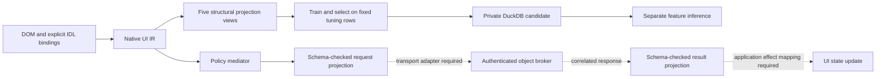

# UI datasets, typed bindings, and an ingestion plan

For React actions and actual handler/state observations, start with the
[React capture specification](react_capture_spec.md): controlled authored
fixtures, then a pinned ComponentBench environment. For broader browser
workflows, use bounded HTML/action samples from Multimodal-Mind2Web or WebLINX.
Add backend schema examples as a separate source.
Join the two only when an application supplies an explicit, versioned binding
between a UI component/action and a backend method. A screenshot, successful
navigation trace, or matching method name does not establish that binding.

These recommendations target this repository's UI/UX structural feature schema.
They are not a ranking of general-purpose GUI models or datasets. Dataset cards
and original project documentation were reviewed on **2026-09-30**; repository
revisions, access conditions, and source terms must be pinned at ingestion.
This guide neither downloads data or weights nor starts training or publication.

Read [modality contracts](modalities.md), [artifacts and inputs](artifacts_and_inputs.md),
and [inference and qualification](inference_and_qualification.md) before interpreting
a training result. The [native quickstart](native_feature_quickstart.md) explains
the structural numerical backend; it does not train a pixel encoder or produce
executable UI code from latent vectors.

## Recommended sources

The descriptions below distinguish an author's release from a community mirror.
Use the named split and revision, not a similarly named repackaging with different
labels, licenses, or coordinate conventions.

| Role | Dataset and evidence | Splits and access | Adapter implications |
| --- | --- | --- | --- |
| React environment and frozen evaluation | [TianchenGuan/ComponentBench](https://huggingface.co/datasets/TianchenGuan/ComponentBench), with the [runnable application and trace schema](https://github.com/TianchenGuan/ComponentBench): React component tasks, browser actions and programmatic checks. | Pin application and data revisions independently; inspect selected files and source terms before collection. Keep official tasks/reference trajectories frozen for evaluation. | Existing traces do not provide complete React handler, committed-state or backend-call evidence. Add explicit instrumentation, author separate training scenarios, and exclude hidden evaluator data. Follow the [trace contract](react_trace_contract.md). |
| Starter: web components and actions | [osunlp/Multimodal-Mind2Web](https://huggingface.co/datasets/osunlp/Multimodal-Mind2Web): aligned screenshots, raw/cleaned HTML, task/action IDs, operations, DOM candidates, and action sequences. | Train: 7,775 actions/1,009 tasks; `test_task`: 1,339/177; `test_website`: 1,019/142; `test_domain`: 4,060/694. Card declares OpenRAIL and a research-purpose disclaimer. Total release: 13.6 GB. | Prefer raw HTML when cleaning removes a labeled target. Training images can have rendering defects. `backend_node_id` identifies a browser DOM node; it is not a backend API identifier. Preserve original operation labels as well as normalized labels. |
| Starter: dialogue and event sequences | [McGill-NLP/WebLINX-full](https://huggingface.co/datasets/McGill-NLP/WebLINX-full), with a [formatted companion](https://huggingface.co/datasets/McGill-NLP/WebLINX): raw HTML, screenshots, dialogue/action replay and element bounding boxes. | Full-data splits: `train`, `valid`, `test_iid`, `test_vis`, `test_cat`, `test_geo`, `test_web`. CC-BY-NC-SA-4.0 plus third-party-content terms. | The authors support [retrieval of selected demonstrations](https://mcgill-nlp.github.io/weblinx/docs/), avoiding a bulk download. Preserve episode order and dialogue speaker. Keep original WebLINX and the BrowserGym-derived 1.1 release as different dataset versions. |
| Separate backend-schema training | [Salesforce/xlam-function-calling-60k](https://huggingface.co/datasets/Salesforce/xlam-function-calling-60k): 60,000 synthetic examples with a query, tool descriptions/typed parameters, and named calls with arguments. | CC-BY-4.0; access currently requires acknowledgment of license/citation conditions. Create a documented training/tuning partition by tool/schema identity rather than assuming an author-supplied evaluation split. | Useful for learning typed call structure. There are no paired UI observations. The [published answer schema](https://huggingface.co/datasets/Salesforce/xlam-function-calling-60k/blob/main/README.md?code=true) contains calls, not evidence of deployed execution or committed effects. Do not relabel tool parameters as verified application IDL. |
| Held-out visual grounding | [rootsautomation/ScreenSpot](https://huggingface.co/datasets/rootsautomation/ScreenSpot): over 1,200 instructions with screenshots, target boxes, element classes and platform labels. This is a packaging of the [SeeClick authors' benchmark](https://github.com/njucckevin/SeeClick). | Test-only benchmark; HF packaging declares Apache-2.0. Keep it out of training and repeated tuning. | No DOM, transition sequence or backend contract. The [packaging changes](https://huggingface.co/datasets/rootsautomation/ScreenSpot/commit/0be08781e2e188582f6131625ae1598d443b4d5d) convert `xywh` to `xyxy`; the current filename field is `file_name` and the platform field is spelled `data_souce`. Validate coordinate conventions before scoring. |
| Held-out typed calls | [gorilla-llm/Berkeley-Function-Calling-Leaderboard](https://huggingface.co/datasets/gorilla-llm/Berkeley-Function-Calling-Leaderboard): question/function-documentation pairs, including AST, executable, REST, parallel-call and multi-turn categories. | Apache-2.0. Category files are evaluation cases, not a training/validation split. The [inspected HF card](https://huggingface.co/datasets/gorilla-llm/Berkeley-Function-Calling-Leaderboard/blob/main/README.md?code=true) describes V3; pin dataset and matching evaluator versions rather than inferring them from the live leaderboard. | Useful for call-shape, argument and missing-parameter tests. AST agreement is not execution evidence. Use executable checks only with their matching implementation and state. No paired UI evidence. |
| Optional mobile actions | [leosltl/Android-Control](https://huggingface.co/datasets/leosltl/Android-Control) is a community mirror of Google Research data: 15,283 demonstrations across 833 apps, PNG screenshots, serialized accessibility trees, goals, step instructions and JSON actions. | Mirror declares Apache-2.0. The [official release](https://github.com/google-research/google-research/blob/master/android_control/README.md) supplies episode split definitions. Verify the mirror against that source and retain its split manifest. | TFRecord/protobuf conversion adds work. Public raw actions differ from the paper's merged click/type preprocessing; the [authors explain that distinction](https://github.com/google-research/google-research/issues/2150). Preserve the processing version and do not interpret an Android action as a server-side effect. |
| Optional mobile structure; licensing unresolved | [creative-graphic-design/Rico](https://huggingface.co/datasets/creative-graphic-design/Rico) packages screenshots, view hierarchies, semantic labels, bounds, clickability, children and trace metadata. | 66,261 unique screens. Each hierarchy config has train 56,322, validation 3,314 and test 6,625. Card marks the license unknown and requests verification of upstream terms. | Hold redistribution until source terms are resolved. Its 198,783 rows across configurations are not 198,783 unique screens. Useful for hierarchy features; this packaging does not establish API contracts or backend transition effects. |

[VisualWebArena's official repository](https://github.com/web-arena-x/visualwebarena)
is a useful additional **instrumented evaluation environment**. It provides 910
tasks, agent trajectories, and 233 human Playwright traces with reproducible
applications and execution-based evaluation. The official release points to
GitHub/Drive; this review did not verify an official HF dataset repository.
Repository code is MIT, which does not by itself settle the rights to all website
content. Its value here is the opportunity to capture request/result bindings
against a controlled application revision, not to treat an existing screenshot
trace as an API contract.

The inspected [WebLINX-full page](https://huggingface.co/datasets/McGill-NLP/WebLINX-full)
reported a viewer configuration failure involving a missing `chat/test_iid.csv`.
Use the authors' explicit raw demonstration paths and split manifest; do not
assume the raw repository can be loaded through the default dataset viewer or
the formatted companion's configuration. This is an ingestion compatibility
issue, not evidence that the raw demonstrations are absent.

## What each source can supervise

The following are proposed adapter mappings. The external datasets do not ship
these native formalization targets or prove the resulting statements.

| Native view | Acceptable evidence | Evidence that must remain missing or separately checked |
| --- | --- | --- |
| Frame logic | DOM/accessibility containment, component classes, source attributes, explicitly observed affordances | Inferred hidden controls, service interfaces, permissions or arbitrary attributes derived only from appearance |
| Event calculus | Identified actions and ordered observations; explicitly declared behavior contracts with their provenance | Universal causal effects, server commits, or successful completion inferred from a single UI transition |
| TDFOL | Observed ordering/timestamps and separately authored temporal requirements | Deadlines, obligations, liveness or guarantees invented from typical interaction patterns |
| DCEC | Attributed requests, instructions, utterances and explicitly declared cognitive/deontic statements | User belief, knowledge, authorization or intent inferred from a screenshot or predicted label |
| `interface_bindings` structural frame view | Verified local descriptor identity plus explicit component-to-method mapping and schema-bound values | API selection guessed from button text, a DOM node ID, or a similar operation in another dataset |

Missing evidence should remain an unsupported/missing projection or a separate
qualification observation. Do not manufacture backend bindings to make a row
eligible for a five-view training contract. A UI-only research branch can request
only the views its evidence supplies; report that narrower scope explicitly.

## Local route and current boundaries



Solid edges describe the local integration; dashed edges still need an
application-specific executor, authentication and effect mapping. Numerical
inference never grants a mediator decision or a backend capability.

The UI corpus integration uses
[`ui_training_inputs.py`](../../ipfs_datasets_py/logic/formalization/autoencoder/ui_training_inputs.py)
for bounded closed DOM input, verified MCP/IDL descriptor data, explicit
component/method mappings, declared behavior and supplied events. It builds native
targets rather than asking a model to invent a join. The additional
`ui_ux_ir:interface_bindings` target has family `frame_logic`; it is a fifth view,
not a new logic family.

[`ui_feature_training.py`](../../ipfs_datasets_py/optimizers/logic_theorem_optimizer/ui_feature_training.py)
provides local preparation, training, resume, DuckDB candidate registration and
separate inference. Its bounded JSONL loader accepts at most 128 rows and 8 MiB
per input file. Training rows use `train`; tuning rows use `validation`, `valid`
or `tuning`. Test/canary rows are excluded from those paths. Group checks protect
the tuning panel from current and historical training groups and source-record
identities. These checks trust the supplied group/source labels; they do not
perform near-duplicate detection. Resume keeps the
feature basis, tuning panel, producer identity and optimizer state.

| Callable | Responsibility |
| --- | --- |
| `ui_training_inputs.prepare_ui_training_row(row)` | Check the closed row, descriptor identity and explicit component/method join; prepare actual native targets. Supplied events are not independently attested here. |
| `ui_feature_training.load_ui_training_jsonl(path)` | Read bounded local JSONL; reject duplicate JSON keys, symlinks and excessive file/row counts. |
| `ui_feature_training.prepare_ui_rows(rows, role=...)` | Prepare rows and apply role/split and duplicate-identity checks. |
| `ui_feature_training.train_ui_feature_batch(registry, training_rows, tuning_rows, directory, ...)` | Train/select/register a feature candidate; resume from an explicit parent when supplied. The caller owns resource admission and the registry. |
| `ui_feature_training.infer_ui_feature_batch(registry, version_id, rows, directory)` | Read a saved compatible model and write inference output without an optimizer update or candidate registration. |

The current strict input schema is `ui-bound-training-row/v1`. Its required
top-level fields are:

| Field | Current input contract |
| --- | --- |
| `schema_version` | Exactly `ui-bound-training-row/v1`. |
| `provenance` | Exactly `dataset`, `revision`, `split`, `row_id`, `group_id`. Moving revision names `main`, `master`, `latest` are rejected; the importer must verify that its identifier refers to immutable source bytes. |
| `dom_aria` | Closed native DOM/ARIA snapshot with `document_id`, `title`, `root`; node IDs and roles are explicit. At most 256 nodes. Raw HTML needs a separate normalization step. |
| `interface` | `descriptor` and `claimed_interface_cid`. Identity is recomputed from the supplied descriptor. Methods require input/output schemas; inputs are objects and schemas are inline, with remote/local references rejected. Never substitute an illustrative CID for a verified descriptor identity. |
| `bindings` | Nonempty explicit component/action/method joins with binding/action IDs and declared risk, confirmation and idempotency classes. Unknown components/methods, absent DOM affordances and ambiguous joins are rejected. |
| `behavior` | A declared bounded state/transition model, or `null`. It does not establish a real execution trace. |
| `events` | A bounded list of canonical events with explicit target, timestamp, provenance, capability and consent fields. Values remain source declarations; this adapter does not attest their real-world authenticity. |

Each row is limited to 1 MiB and a bounded nesting depth. Unknown fields are
rejected. Retain original benchmark splits such as `test_website` in the ingestion
sidecar, and explicitly map their runtime role to `test` when preparing inference
rows; the strict row schema accepts only `train`, `validation`, `valid`, `tuning`,
`test`, `canary`. Do not relabel benchmark tests as tuning data.

The command entry point is
[`run_ui_feature_training.py`](../../scripts/ops/ui_ux_ir/run_ui_feature_training.py).
Use its checked-in help and the
[authored JSONL fixtures](../../examples/ui_ux_ir/training/README.md) for the
argument and row schema. The dataset preparation recipes below are **an ingestion plan**;
they are not an implemented HF bulk importer or an instruction to download the
listed repositories.

## Bounded local commands

These templates use the checked-in authored structural fixtures; substitute
schema-valid local JSONL to train on your own corpus. `UI_STATE` must be beneath a root
already listed in `UI_LEDGER`; the CLI checks this before execution. Use a private
state root and one owner process per `control.duckdb`. The CLI pins this bounded
backend to CPU and one numerical thread; it supervises one isolated worker
instead of launching a worker pool.

```bash
cd /home/barberb/lift_coding/external/ipfs_datasets
export PYTHONPATH="$PWD"
export PYTHONDONTWRITEBYTECODE=1
UI_INPUTS="$PWD/examples/ui_ux_ir/training"
UI_STATE="$PWD/workspace/test-logs/ui-feature-corpus-example"
UI_LEDGER="$PWD/workspace/test-logs/federal-corpus-audits/owned-daemon-resource-control/disk-reservations.json"

python3 scripts/ops/ui_ux_ir/run_ui_feature_training.py train \
  --input-jsonl "$UI_INPUTS/train-001.jsonl" \
  --tuning-jsonl "$UI_INPUTS/tuning.jsonl" \
  --state-directory "$UI_STATE" --attempt-id ui-smoke-001 \
  --epochs 2 --latent-width 4 --learning-rate 0.02 --max-seconds 60 \
  --resource-ledger "$UI_LEDGER" --storage-bytes 128000000 --memory-mb 4096 \
  --plan
```

`--plan` performs bounded JSON parsing and reports configuration. It does **not**
compile targets, validate the complete native row, reserve resources, open the
registry or train. A successful plan therefore is not a readiness gate. After
reviewing the plan, this is the corresponding bounded training invocation:

```bash
python3 scripts/ops/ui_ux_ir/run_ui_feature_training.py train \
  --input-jsonl "$UI_INPUTS/train-001.jsonl" \
  --tuning-jsonl "$UI_INPUTS/tuning.jsonl" \
  --state-directory "$UI_STATE" --attempt-id ui-smoke-001 \
  --epochs 2 --latent-width 4 --learning-rate 0.02 --max-seconds 60 \
  --resource-ledger "$UI_LEDGER" --storage-bytes 128000000 --memory-mb 4096
```

The default requested views are `ui_ux_ir:flogic`, `ui_ux_ir:event_calculus`,
`ui_ux_ir:tdfol`, `ui_ux_ir:dcec`, `ui_ux_ir:interface_bindings`. Repeated
`--projection` options explicitly choose a subset, which changes the contract and
measurement. Removing the fifth view does not bypass the strict joined input
schema. Required views must actually be populated.

Use the registered version from the training receipt as the resume parent, with
a fresh attempt ID, new training rows and the **same** tuning rows:

```bash
UI_PARENT=$(python3 - "$UI_STATE/attempts/ui-smoke-001/report.json" <<'PY'
import json
import sys
with open(sys.argv[1], encoding="utf-8") as stream:
    print(json.load(stream)["registration"]["version_id"])
PY
)
python3 scripts/ops/ui_ux_ir/run_ui_feature_training.py train \
  --input-jsonl "$UI_INPUTS/train-002.jsonl" \
  --tuning-jsonl "$UI_INPUTS/tuning.jsonl" \
  --state-directory "$UI_STATE" --attempt-id ui-resume-002 \
  --parent-version-id "$UI_PARENT" \
  --epochs 2 --latent-width 4 --learning-rate 0.02 --max-seconds 60 \
  --resource-ledger "$UI_LEDGER" --storage-bytes 128000000 --memory-mb 4096
```

The next command infers from the original `UI_PARENT`. To inspect the resumed
candidate instead, read its version from `ui-resume-002/report.json` first.
Inference accepts no optimizer, tuning or projection-change flags. It opens the
local registry as an exclusive owner, so run it after the training process exits:

```bash
python3 scripts/ops/ui_ux_ir/run_ui_feature_training.py infer \
  --input-jsonl "$UI_INPUTS/inference.jsonl" \
  --state-directory "$UI_STATE" --attempt-id ui-infer-003 \
  --parent-version-id "$UI_PARENT" \
  --resource-ledger "$UI_LEDGER" --storage-bytes 128000000 --memory-mb 4096
```

`--max-seconds` bounds numerical training work. The owner also enforces a worker
deadline of that budget plus 120 seconds for startup/preparation/registration.
An independent watchdog samples group RSS and the deadline every 50 ms, including
while the owner inventories storage. This is sampled cooperative enforcement,
not a kernel quota or a guarantee of observing every short memory excursion.
`worker.json` records the sample count, observed peak and worker wall time.
The storage reservation conservatively accounts for
the complete local state, including retained parents, so a later run may require
more than this example budget. Do not overwrite an attempt directory to resume.
Inspect `report.json`, `targets.json`, the candidate artifact, `inputs.json` and
`resources.json`; inference writes `inference.json` plus its input/resource
receipts. Neither invocation transfers data or weights to Hugging Face.

[`runtime/idl_projection.py`](../../ipfs_datasets_py/logic/ui_ux_ir/runtime/idl_projection.py)
provides `project_idl_request(...)` and `project_idl_result(...)` for schema-checked
request/result declarations using a trusted local `UIMediationDecision`. The
decision object itself is not an authentication credential. This module does not
dispatch a live object-broker request. Local
mediation, a well-typed payload, numerical reconstruction, and candidate
registration do not grant execution or qualification authority.

The existing [control plane and synchronization guide](control_plane_and_sync.md)
describes shared ownership and legal transport. Do not assume that legal sparse
updates, Arrow weight files or HF exchange can ingest this native UI checkpoint
codec. The native route remains local until a transport explicitly validates its
contract, feature basis, parent, producer and optimizer compatibility.

## Phased ingestion and opportunity cost

Suggested pilot counts below are planning limits, not measured throughput or
storage admission. Admit each job against the current resource ledger and actual
artifact sizes; see [operations](operations_and_troubleshooting.md).

| Phase | Bounded work and output | Cost and expansion criterion |
| --- | --- | --- |
| 0. Inventory | Fetch only cards, repository metadata, split manifests and file metadata. Record immutable revisions, source terms and access status. | Low transfer cost; avoids discovering a license or split incompatibility after processing images. Do not bypass gated access with a mirror. |
| 1. UI-only preparation | Select one web source. Propose 100 training actions and 20 tuning actions from distinct task groups, with official test groups reserved. Retain raw assets and prepare closed, bounded structural inputs. | HTML normalization and provenance review dominate initial engineering. Stream or select files instead of fetching all screenshots. Missing required structure remains a rejected row with a reason. |
| 2. Local feature smoke | Prepare native targets once; train a small bounded batch, resume with new training groups, then run separate inference from the selected candidate. | Measure preparation separately from optimizer time. Verify split isolation, nonzero requested-view coverage, fixed tuning identity and exact resume compatibility before adding rows. Structural training does not claim learned visual features. |
| 3. Separate contract corpus | Normalize a small permitted typed-call subset to a separately declared schema-training task. Keep tool/schema identities disjoint across training and tuning. | Useful parameter/type diversity at modest text-storage cost. There is still no UI join; this phase cannot create `interface_bindings` for unrelated UI records. |
| 4. Explicit joined corpus | Instrument a controlled application or fixture with its verified local MCP/IDL descriptor. Capture UI action, mediation decision, correlated request/result and observed effect. | Higher engineering cost, but supplies the missing supervision. Start with a few operations and positive/negative schema cases. Record declarations, observations and independent validations separately. |
| 5. Held-out assessment | Run frozen site/task/app splits, ScreenSpot grounding where a visual model exists, and compatible typed-call tests. Add controlled interaction replay and effect checks for joined cases. | Prevent repeated tuning on benchmarks. A structural feature loss is not a ScreenSpot score, an executable-call result, or proof of UI/API semantics. |
| 6. Incremental distribution | Package revision-pinned normalized rows and native artifacts only after native codec, resource and transfer support is implemented and checked. | Avoid legal-codec conversion by relabeling. Use an owner for database mutations, immutable worker inputs and sparse changes only where their codec supports them. Never average Adam moments from independent workers. |

WebLINX's selected-demo mechanism is particularly useful for phase 1. With
Mind2Web, select Parquet shards/row groups before processing and enforce a transfer
budget; a small row request does not necessarily mean a small network transfer.
Keep image assets outside the bounded structural JSONL and reference them in the
provenance sidecar. The current structural numerical trainer does not consume
pixels merely because screenshots accompany the source record.

Defer AndroidControl until mobile accessibility/protobuf parsing and its split
manifest are covered. Defer Rico publication while licensing is unresolved.
Neither is necessary to demonstrate an initial web DOM-to-target feature run.
These sequencing choices reduce conversion and storage work before the missing
backend binding is solved.

## Proposed provenance and row recipes

Preserve the original source row and a normalization receipt. The following is a
**proposed ingestion manifest/sidecar**, not a claim that every field is accepted
by the current bounded JSONL schema. Keep optional image, network and license
metadata outside the runtime row unless the native input API explicitly accepts
it.

| Field group | Record |
| --- | --- |
| Source identity | Dataset repository, immutable commit, configuration, original split, source record ID, task/episode ID, step ID/order, site/app and capture revision where supplied |
| Split identity | Group key and policy version; source group membership; train/tuning/test role; duplicate and near-duplicate checks; any remapping from an upstream split |
| Rights and access | Card/terms URL and digest, source license declaration, upstream content restrictions, mirror provenance, access acknowledgment where applicable, redistribution decision |
| Raw observations | Content digests and references for HTML, accessibility tree, screenshot and action/dialogue trace; coordinate system; capture dimensions; timestamps and their units when available |
| Normalization | Adapter/version/source digest, original and normalized action labels, retained DOM IDs, closed-schema conversion decisions, omitted fields and rejection reasons |
| UI/backend binding | Descriptor digest/version and local verification receipt, component/action key, fully identified interface/method, explicit mapping source, request/result schema references |
| Execution observations | Correlation ID, actual request/response evidence, schema-validation result, relevant before/after state evidence and application revision; absence remains explicit |
| Training lineage | Prepared target digest, selected projection IDs and family/profile, producer identity, feature-space/contract IDs, parent candidate, fixed tuning identity and selection report |
| Authority | Separate declaration, observation and validation statuses; feature work retains `qualified=false`, `admitted=false`, `formalized=false` and no runtime authority |

A **UI-only row** starts with a source action and its corresponding document or
accessibility snapshot. Normalize only observed component structure, action data
and attributed dialogue. Retain the native task/episode grouping. Leave backend
descriptor and method mapping absent. Such a row cannot enter the strict joined
JSONL route merely by disabling a projection. Prepare native inputs for the
lower-level [`prepare_ui_targets`](../../ipfs_datasets_py/logic/formalization/autoencoder/ui_targets.py)
adapter and a compatible narrower feature contract, or record why the full
contract rejects it. A source-specific HF-to-native importer remains future work.

A **joined row** starts with a controlled application revision and its locally
verified descriptor. Supply an explicit component/action-to-method mapping and
declared behavior, then attach actual UI events and separately observed request/
result evidence. For effect validation, retain the correlated state observation;
a schema-valid request only shows that the request fits the schema. Generated
fixtures and real captured executions need different provenance labels.

An **unmatched backend row** from a tool-call corpus belongs to its own schema
task. Do not pair it with a UI action through lexical similarity and label the
pair observed. A future learned matcher can propose candidate joins, but a
proposal remains unverified until source evidence or an independent check binds
the exact application, interface and action.

## Next object-broker integration

The existing [mediator](../../ipfs_datasets_py/logic/ui_ux_ir/runtime/mediator.py)
offers `InvocationExecutor` and `execute_if_allowed`, but that executor interface
receives an invocation identity, without this new typed argument/result protocol.
An application adapter must carry the schema-checked projection through its
authenticated transport. Do not attach an arbitrary backend URL to a predicted
button label. Bind execution to the exact verified descriptor and current local
runtime context.

| Boundary to implement | Required inputs and acceptance check |
| --- | --- |
| Descriptor resolution | Resolve the pinned interface CID through the existing IDL registry; verify the complete descriptor preimage before method selection. Test a changed schema under an old CID and a missing method. |
| Form/event argument mapping | Declare which component values populate each method argument. Preserve value types; validate required fields before constructing the request. Test invalid, omitted and additional arguments. A feature reconstruction cannot supply an authorization decision. |
| Governed dispatch | Obtain a fresh local mediator decision, project its typed request, and send through an authenticated executor. Bind correlation to the request digest, which includes arguments, plus the current declaration/projection/state version. Test deny, stale state and altered arguments. |
| Response handling | Authenticate the sender and correlate the response to the outstanding request before schema projection. Test replay, wrong interface/method/request digest and an invalid result. The current result projection validates shape/correlation; it does not authenticate the sender. |
| UI effect mapping | Define how a validated response becomes an application event or state transition, then use the version fence in [UIStateRuntime](../../ipfs_datasets_py/logic/ui_ux_ir/runtime/state_machine.py). Preserve pre/post state observations. A declared `deleted=true` is not independently verified deletion. |
| Capture and replay | Store raw evidence, mediation lineage, request/result digests and observed effects with the application revision. Redact credentials and sensitive user data before training/export. Keep failures and unverified effects instead of converting them into successful labels. |

Start with a local list/detail operation in an instrumented application. Add
mutation, confirmation, error and retry behavior only with explicit contracts.
The present result API covers one successful unary response; streaming, typed
errors and retries require additional protocol definitions. Existing
[web projection](../../ipfs_datasets_py/logic/ui_ux_ir/projection/web.py) creates a
data-only accessible model; a live DOM host and event bridge are separate pieces.

## Measurement and qualification boundaries

Report source rows inspected, retained and rejected; requested/populated/missing
views; preparation wall time per row; cache conditions; actual backend/thread
configuration; optimizer wall time and attempted/selected epochs; per-projection
loss/cosine; tuning out-of-vocabulary coverage; source and split digests; and
resume/inference outcomes. Keep tuning metrics separate from a frozen held-out
assessment. Changing the available views changes the measurement.

The native feature backend learns structural features of compiler output. Good
reconstruction is useful for later distillation, but does not certify rendered
accessibility, temporal behavior, mental-state attribution, API effects or live
authorization. Those require the modality-specific checks described in
[inference and qualification](inference_and_qualification.md). Legal work retains
its separate source-locked `lake build <Lib>` admission path; UI data and feature
training confer no legal admission and do not formalize Constitution spans.
