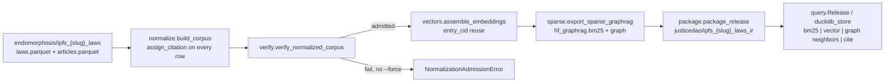
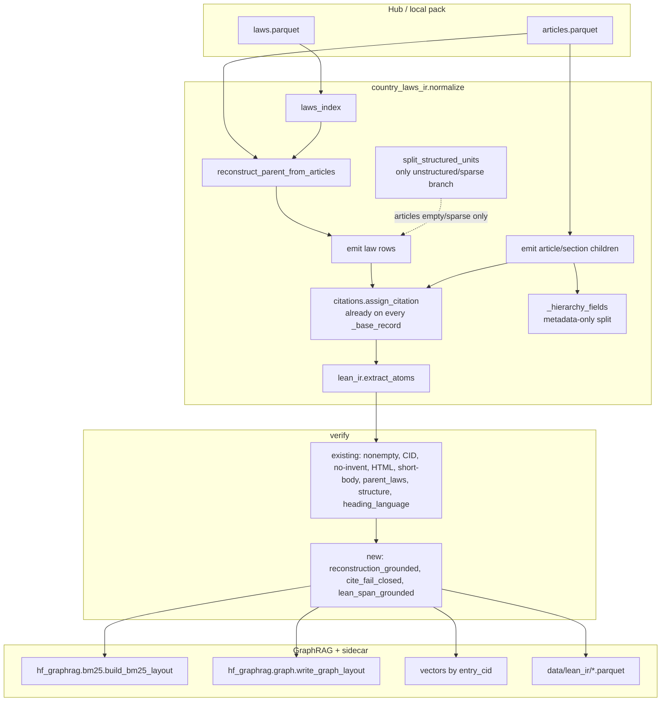
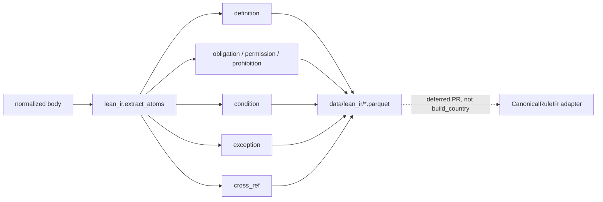

# Reconstructing Parent Acts, Oregon-Style Structure, Lean-Ready IR, and Bluebook Query for Country-Laws GraphRAG

| Field | Value |
| --- | --- |
| **Title** | Reconstructing Parent Acts, Oregon-Style Structure, Lean-Ready IR, and Bluebook Query |
| **Author** | Grok (design; implementation TBD) |
| **Date** | 2026-09-22 |
| **Status** | Draft (revised after review) |
| **Codebase** | `/home/barberb/lift_coding/external/ipfs_datasets` |
| **Primary package** | `ipfs_datasets_py/processors/legal_scrapers/country_laws_ir/` |
| **Schema today** | `country-laws-ir-graphrag/v1` (`SCHEMA_VERSION` in `__init__.py`) |
| **Proposed schema** | `country-laws-ir-graphrag/v1.1` (additive; fail-closed on invented text/cites) |
| **Layout family** | `skillcenter-huggingface-release/v3` |
| **Pipeline** | `endomorphosis/ipfs_{slug}_laws` → `justicedao/ipfs_{slug}_laws_ir` |
| **Citation API (landed)** | `citations.py` + `duckdb_store.cite_search` + `query cite --format` — **extend, do not fork** |

---

## Overview

Country-law GraphRAG already normalizes Hub parquet (`laws.parquet` + optional `articles.parquet`) into a CID-keyed corpus, admits it through `verify.py`, and exports BM25 + graph shards via `ipfs_datasets_py.retrieval.hf_graphrag`. Citation lookup is **already landed**: `normalize._base_record` calls `citations.assign_citation` / `citation_fields` on every row (`official_citation`, `bluebook_citation`, `cite_key`, `citation_status`, `pinpoint`); `duckdb_store.cite_search` queries those **corpus** columns; `query.py` already has `cite` with `--format any|bluebook|official`. Tests `test_assign_citation_bluebook_when_known_else_official_only` and `test_corpus_rows_include_citation_fields` lock those names.

Three defects remain in the *legal* shape of that corpus:

1. **Empty parents.** Non-empty parent instruments are already kept when articles exist (`test_normalize_keeps_parent_law_when_articles_exist`). `_append_law_row` still returns on empty `body`. When *every* `laws.text` is empty, GraphRAG reports `n_laws=0` and `check_parent_laws` fails. Reconstruction from article fragments is **not** in the tree.
2. **Structure** is a best-effort heading split on a single body (`structure.split_structured_units`), not an Oregon-style exclusive-span tree. `StructureUnit` has no `char_start`/`char_end`.
3. **Lean-ready IR** is absent (`lean_ir.py` does not exist). `CanonicalRuleIR` lives under `benchmarks/semantic_roundtrip/`; ITP hammer fixtures under `tests/fixtures/logic/hammers/lean/`.

This design adds four additive stages in front of GraphRAG, without auto-formalizing statutes in Lean, and **without forking the citation API**:

1. **Reconstruct parent acts from article fragments** — group by `law_id`, natural-sort by `article_number`, concatenate *source* text only, under an RSS/concat budget.
2. **Oregon-style hierarchy** — exclusive-span *internal* segmentation (preamble + title/chapter/part + article/section); retrieval projection stays article/section. Never invent headings; no Latin TITLE/ARTICLE split for `NO_LATIN_SPLIT_LANGS`.
3. **Lean-ready intermediate** — deterministic extraction of definitions, obligations, conditions, exceptions, and cross-refs, grounded as substrings of `body`, stored as parquet. v1 does **not** call Leanstral, does **not** run the Lean kernel, and does **not** claim a proof. The `CanonicalRuleIR` adapter is **deferred**.
4. **Tighten citation policy on the existing columns** — keep `citations.py` / `cite_search` / `--format`. Move `_BLUEBOOK_STATUTE` into a sealed JSON table. Gazette nicknames (`Laws of Malta`, `J.O.`, `P.R.C.`, `O.J.`) become `citation_status=official_only`. Real T2/T1 forms stay Bluebook. Query remains DuckDB over **corpus** columns; no parallel `cite.py` and no required `data/cite/` sidecar.

Identity, incremental rebuild, and Hub publication stay as they are: `entry_cid` is the durable key, BM25/graph rebuild from the current corpus, embeddings reuse unchanged CIDs, and `python -m country_laws_ir reindex --upload --force` remains the operator path. `plan_rebuild` must also refuse `UNCHANGED` when packager `SCHEMA_VERSION` or a normalize-algorithm version differs from the prior **manifest**.

---

## Background & Motivation

### Current pipeline



Source of truth is collector parquet validated by `schema.validate_laws` / `validate_articles` (`REQUIRED_LAW_COLUMNS = (id, title, text)`, `REQUIRED_ARTICLE_COLUMNS = (id, law_id, title, text)`). Identifiers are never invented. `build_corpus` currently:

- Always walks `laws_index` and emits one `record_type=law` row **if** `parent["body"]` is non-empty (`_append_law_row`). Empty bodies increment `drops.empty_body` and produce **no law row** for that instrument. Non-empty parents are kept even when articles exist.
- If article coverage ≥ 10% of laws, also emits `record_type=article` children. Orphans (`law_id` not in `laws.id`) increment `drops.missing_instrument` and are dropped.
- If articles are empty or sparse (`coverage < 0.10`, e.g. Estonia 2 vs 3484), it additionally calls `split_structured_units` on the law body and may set `unit=structured` / `law+structured`. `_hierarchy_fields` already calls `split_structured_units` on every article `title+body` for **metadata only** (no extra corpus rows).
- `assign_citation` fills `official_citation` / `bluebook_citation` / `cite_key` / `citation_status` / `pinpoint` on every row. `_BLUEBOOK_STATUTE` currently emits Bluebook-shaped strings for `malta`, `france`, `china`, `eu`, and others — gazette nicknames, not T2 statute forms.
- Reports `n_law_rows`, `n_child_rows`, `n_instruments`. `verify.check_parent_laws` **fails** if `n_laws_in > 0` and `n_law_rows == 0` (the all-empty-parents case). One non-empty parent plus 99 dropped empty parents still **passes**.
- Corpus `entries.sort` is `(instrument_id, article_number, source_id)` as **strings**.

The keep-parent patch closed “articles exist ⇒ drop laws.” Reconstruction is the remaining hole: empty/truncated `laws.text` with article children.

### Pain points

| Pain | Evidence in code / ops |
| --- | --- |
| Empty/truncated `laws.text` still dropped | `_append_law_row` returns on `if not body`; `check_parent_laws` fails only if **all** parents vanish |
| Articles are a bag, not an ordered act | Sort key is string `article_number` (`"10"` before `"2"`) |
| Hierarchy is regex-on-one-body, not exclusive spans | `structure.StructureUnit` has no `char_start`/`char_end`; Oregon `StructuralUnit` does |
| Latin heading split can carve Arabic/Chinese | Mitigated by `profiles.NO_LATIN_SPLIT_LANGS` + `split_script_units` (条 / مادة); still no exclusive-span invariant |
| Citation lookup exists; T2 policy is loose | `citations._BLUEBOOK_STATUTE` emits `Laws of Malta` / `J.O.` / `P.R.C.` / `O.J.` as Bluebook; `cite_search` is corpus-column DuckDB; README/skill still omit `cite` |
| Lean is a research loop, not a country-laws artifact | `CanonicalRuleIR` + Leanstral under `benchmarks/semantic_roundtrip/`; no `lean_ir.py` |
| `plan_rebuild` skip key ignores packager schema | `source_fingerprint` is `revision\|laws_sha256\|articles_sha256` only; v1.1 code + unchanged Hub SHA → `UNCHANGED` |
| France/EU/Denmark RSS_ABORT | `mem.py` `IR_RSS_ABORT_GIB` default 12G; `build.py` checkpoint `after_normalize` |

### Constraints that do not move

- **Never invent legal text.** Concatenation of source article bodies is allowed; synthesized “Article N” labels in a language the source did not use are not. Glue is `\n\n` plus the article’s own `title` or stored `article_number`.
- **Fail-closed identifiers.** `schema.py` already refuses null/empty `id` / `law_id`. Reconstruction must not mint a parent `instrument_id` that is not in `laws.id`.
- **Per-country language.** Latin TITLE/CHAPTER/ARTICLE/SECTION is skipped for `ar, zh, zh-cn, zh-tw, ja, ko, fa, he, th, hi, bn, am` (`profiles.latin_split_allowed`). Chinese uses `第…条`; Arabic `المادة` / `مادة`; Japanese `第…条`. Korean has no script splitter today (non-goal for v1.1 beyond “do not Latin-split”).
- **CID identity.** `LAW_IDENTITY_SCHEMA` hashes `{source_dataset, instrument_id, instrument_title, jurisdiction, language}` — **not** body. `ENTRY_IDENTITY_SCHEMA` hashes `{record_type, source_dataset, instrument_id, article_number, article_title, body_sha256, language, jurisdiction, source_url}`. Reconstructing a previously empty law body **will** change that law row’s `entry_cid` and force a delta re-embed. `law_cid` stays stable. Cite columns are **not** in the identity payload.
- **Query engine is DuckDB over ZSTD parquet.** No SQLite for sealed indexes (`sparse.py`, `duckdb_store.py`). Incremental rebuild is CID-keyed (`incremental.plan_rebuild`).
- **Citation module is `citations.py`.** Column names `official_citation`, `bluebook_citation`, `cite_key`, `citation_status`, `pinpoint` are locked by tests. Do not introduce `cite.py`, `official_cite`, `cite_status`, or `official_cite_key`.

---

## Goals & Non-Goals

### Goals (v1.1)

1. When `laws.id` exists and `laws.text` is empty or truncated **and** that `law_id` has ≥1 non-empty article body, **always emit a parent law row** (never drop eligible empty parents). Body is full glue concat, a streamed prefix, or a capped title/number stub — see §1 decision table. Always emit the joined article rows as corpus children (even on the sparse path). Default reconstruct **on**; RSS_ABORT slugs and a process-level extra-bytes cap force stubs, not drops.
2. Align country-law structure with Oregon `state_laws_chunker.segment_structural_units` **invariants**: exclusive spans on an *internal* segmentation covering the full normalized string (no `MIN_UNIT_CHARS` skip, preamble included, script path included); running cursor; subsections on the parent unit. Retrieval projection may drop preamble/title/chapter **and** short units. Title/chapter-only heading sets keep the whole instrument. Split only when the gazette text actually contains those markers.
3. Emit a Lean-ready IR table (`data/lean_ir/*.parquet`) of grounded atoms: `definition`, `obligation`, `permission`, `prohibition`, `condition`, `exception`, `cross_ref`. Every `atom_text` is a Python-`str` slice of the source `body`. Compatible *later* with `CanonicalRule` fields; **no adapter in v1.1 production**. No kernel, no `sorry`-as-proof.
4. Tighten Bluebook emission on the **existing** citation columns: T1/T2/T10/T13 only when the sealed table says `emit=bluebook` **and** the form is complete. Gazette nicknames currently in `_BLUEBOOK_STATUTE` migrate to `official_only`. Query stays `cite_search` over corpus columns. CLI stays `--format any|bluebook|official`.
5. Keep GraphRAG counts honest: every eligible empty parent becomes a law row (full, prefix, or stub). `empty_parents_with_articles` fails on silent drops, not on capped stubs.
6. CID-keyed incremental: new/changed `entry_cid`s encode; unchanged reuse; BM25, graph, and lean_ir rebuild from current corpus. Skip key includes packager `SCHEMA_VERSION` and a normalize-algorithm version (reconstruct/cite/lean flags).

### Non-goals (v1.1)

- Full auto-formalization into Lean theorems that the kernel accepts.
- Calling Leanstral, symai, spaCy, or `typed_deontic.construct()` on the production normalize path. Cue regexes may be copied; the constructor may not be imported.
- A parallel `cite.py` module, renamed corpus columns, or a required `data/cite/` sidecar that would break `cite_search` on existing v1 packs.
- Inventing Bluebook T2 forms (`Fr. C. civ. art. 1240`) or keeping gazette nicknames labeled Bluebook.
- Reconstructing a parent instrument whose `id` is absent from `laws.parquet` (orphan articles stay dropped).
- Forcing title/chapter/section onto gazettes that are a single proclamation body (Malta-style empty `articles.parquet` with no headings stays whole-instrument; `check_structure` remains warn-only).
- Replacing collector HTML extraction; `structure.strip_html` remains a residual-chrome cleaner (`HTML residual ≤ 2%` still fails admission).
- Changing embedding model (`thenlper/gte-small` 384-d) or BM25 constants (`k1=1.2`, `b=0.75`, title weight 5.0).
- Korean / Thai / Hebrew script-specific article splitters (keep no-Latin-split; collectors may already emit article rows).
- Re-parsing municipal `bluebook_cid` into country-laws (`american_municipal_law` is excluded).
- Emitting `CanonicalRuleIR` in Hub packs, or graph nodes per Lean atom.

---

## Proposed Design

### Architecture



New modules live next to the existing package, not in `hub_dataset_scripts/` copies:

| Module | Responsibility |
| --- | --- |
| `country_laws_ir/reconstruct.py` | Group, natural-sort, concatenate; coverage flags; concat budget |
| `country_laws_ir/structure.py` | Extend `StructureUnit` with exclusive spans; keep language gates |
| `country_laws_ir/citations.py` | **Existing.** Move `_BLUEBOOK_STATUTE` to sealed JSON; fail-closed incomplete forms; keep `assign_citation` / `citation_fields` / `normalize_cite_key` |
| `country_laws_ir/lean_ir.py` | Deterministic atom extraction; sentence-span grounding |
| `country_laws_ir/query.py` | Already has `cite --format`. Document it; optional stderr warning; README/skill |
| `country_laws_ir/duckdb_store.py` | Existing `cite_search` on corpus columns. View for `lean_ir` only |
| `country_laws_ir/verify.py` | Three new checks; reconstruction audit from report/articles |
| `country_laws_ir/graph.py` | `ARTICLE_OF` for `article` **and** `section`; `REFERS_TO` / `CITE_OF` with fail-closed resolution |

`state_laws_chunker.py` is **reference**, not a runtime dependency. Country gazettes are multilingual; ORS is English title/chapter/section. Copy the *invariants* (exclusive spans, cursor, subsections-on-parent, exact reconstruction of the internal list) and keep `profiles.py` as the language gate.

### 1. Reconstruct parent acts from article fragments

#### Eligibility (whether a parent needs a reconstructed body)

Eligible iff **all** of:

1. `laws.id` is present (never mint a parent).
2. `COUNTRY_LAWS_RECONSTRUCT=1` (default on).
3. That `law_id` has **≥1** non-empty article body.
4. Parent `laws.text` is **empty**, **or** `len(laws.text) < 40` (`verify._MIN_BODY_CHARS`), **or** `len(laws.text) < 0.10 * sum(len(article.text) for non-empty articles of that law_id)`.

Budget is **not** part of eligibility. Eligible empty parents are **never** dropped as `empty_body`. There is no silent `reconstruct_budget` drop. A 50-character enacting formula plus **one** long article is eligible via the 0.10 ratio. A 30-character parent plus one article is eligible via `< 40`. There is no ≥2-articles special case.

If the parent is **not** eligible because `laws.text` is already longer than the would-be concat, **keep** `laws.text` and do not mix texts.

#### Outcome table (mutually exclusive, evaluated in this order)

Every eligible instrument emits **one law row**. Children used in the join are **always** emitted as corpus article rows (even when `sparse_fallback` / `use_articles` would have been false). Do not `split_structured_units` those parents into extra children.

| # | When | Law `body` | Flags |
| --- | --- | --- | --- |
| 1 | Not eligible: `laws.text` non-truncated | original `laws.text` | `reconstructed_from_articles=false` |
| 2 | Eligible **and** slug ∈ `RSS_ABORT_SKIP_FULL_CONCAT` (`france`, `eu`, `denmark`) **and** `COUNTRY_LAWS_RECONSTRUCT_FULL` unset | **stub**: instrument title + child `title`/`article_number` from source columns only, joined by `\n`, clipped to `RECONSTRUCT_STUB_MAX_CHARS` (8192). No article *bodies*. | `reconstructed_from_articles=true`, `reconstruction_truncated=false`, `gap_note=rss_abort_slug` |
| 3 | Eligible **and** running extra reconstruct bytes already ≥ `RECONSTRUCT_PROCESS_BUDGET_BYTES` (512 MiB) | same stub as row 2, clip 8192 | `gap_note=reconstruct_budget` (stub, **not** a drop) |
| 4 | Eligible **and** streaming glue would exceed `RECONSTRUCT_MAX_PARENT_CHARS` (2_000_000) | **prefix**: accumulate glue pieces until the cap, then **stop** (do not build the full concat string and slice) | `reconstructed_from_articles=true`, `reconstruction_truncated=true`, `gap_note=""` |
| 5 | Eligible otherwise | full glue concat | `reconstructed_from_articles=true`, `reconstruction_truncated=false`, `gap_note=""` |

`COUNTRY_LAWS_RECONSTRUCT_FULL=1` disables row 2 only (France/EU/Denmark then follow 3–5). Row 3 still applies.

Constants:

| Constant | Default | Role |
| --- | --- | --- |
| `RECONSTRUCT_MAX_PARENT_CHARS` | 2_000_000 | Per-parent streamed prefix cap |
| `RECONSTRUCT_STUB_MAX_CHARS` | 8_192 | Stub cap (titles/numbers only) |
| `RECONSTRUCT_PROCESS_BUDGET_BYTES` | 512 * 1024 * 1024 | Extra parent-body bytes this process may hold beyond children; further eligible parents become stubs |
| `RECONSTRUCT_BM25_PARENT_CHARS` | 200_000 | Existing BM25 projection cap |
| `RSS_ABORT_SKIP_FULL_CONCAT` | `{france, eu, denmark}` | Pre-filter to stub; **not** the only RSS control |

Running extra bytes = sum of emitted reconstructed parent `len(body)` (full or prefix, not stubs) in this `build_corpus` call. The three-slug set is a pre-filter; Argentina-scale packs (thousands of empty parents) hit row 3 before `n * 2MB` blows `after_normalize`.

Do **not** claim “no extra copies.” PR1 RSS fixture: **many** empty parents (not one large concat), assert extra reconstructed bytes ≤ `RECONSTRUCT_PROCESS_BUDGET_BYTES` and that overflow rows are stubs.

#### Ordering

Replace string sort with a natural key that folds Unicode digits **before** `int()`:

```python
_DIGIT_FOLD = str.maketrans({
    "٠": "0", "١": "1", "٢": "2", "٣": "3", "٤": "4",
    "٥": "5", "٦": "6", "٧": "7", "٨": "8", "٩": "9",  # Arabic-Indic
    "۰": "0", "۱": "1", "۲": "2", "۳": "3", "۴": "4",
    "۵": "5", "۶": "6", "۷": "7", "۸": "8", "۹": "9",  # Eastern Arabic / Persian
    "〇": "0", "零": "0",  # CJK zero; full 一二三… mapping is a sealed table, not int()
})

def fold_digits(s: str) -> str:
    return unicodedata.normalize("NFKC", s).translate(_DIGIT_FOLD)

def article_sort_key(article_number: str, source_id: str) -> tuple:
    # Split folded string into (is_numeric, int_or_0, remainder) runs.
    # Unparseable numbers sort after parseable, then by source_id.
```

NFKC does **not** turn `١٢` into `12`; `int("١٢")` raises. CJK 十二 is **not** converted to 12 in v1.1 (would invent a numeric order the source did not write in ASCII). Unparseable keys sort after parseable, stable by `source_id`.

Apply the **same** key to corpus child order (`entries.sort`), not only concat. Legal order and GraphRAG row order match.

#### Concatenation contract (never invent legal text)

Glue pieces are the **same strings** that become child corpus fields. `build_corpus` already maps source columns through `_row_get` → `_s` → `normalize_legal_text` (NFKC, HTML strip, whitespace, and after PR1 `\x00` strip). `reconstruct_parent_from_articles` **must** run on those normalized values (call it after the same `_s` as `_base_record` for children), not on raw parquet `.strip()`.

For each article in order, with `title`, `article_number`, and `text` already passed through `normalize_legal_text` / `_s`:

```
chunk = title if title else article_number
if chunk and not text.lstrip().startswith(chunk):
    piece = f"{chunk}\n{text}"
else:
    piece = text
```

Join pieces with `\n\n`. If `title` and `article_number` are both empty, use the body alone. Do not insert English “Article”, French “Article”, or Chinese “第…条” that was not in the source columns.

Prefix outcome 4 streams **those same normalized pieces** and stops at the cap. `check_reconstruction_grounded` recomputes this exact join from corpus child `title` / `article_number` / `body` (the `_s` results). A parent glued from raw parquet `.strip()` while children store `normalize_legal_text` **must fail** the check.

Strip `\x00` in `normalize_legal_text` for **all** text fields (PR1), not only concat. Cayman “label must not contain NUL” is an hf_graphrag **graph label** check (`title` / `instrument_title`). `corpus_to_bm25_rows` already strips NULs; `graph.build_graph` does not. Residual HTML strip stays as today.

PR1 test: `articles.text` containing `<p>…</p>` and `\xa0` still grounds (parent `body` equals glue of child `body`s).

#### Coverage, CID, witnesses

New fields on the **law** row only:

| Field | Type | Meaning |
| --- | --- | --- |
| `reconstructed_from_articles` | bool | Parent body came from children |
| `reconstruction_article_count` | int | How many article bodies were joined |
| `reconstruction_article_ids` | list[str] | Source article `id`s in concat order (witness) |
| `reconstruction_article_sha256` | list[str] | `sha256_hex` of each article body used (witness) |
| `reconstruction_truncated` | bool | Body is a streamed prefix (outcome 4) |
| `reconstruction_gap_note` | str | `rss_abort_slug` \| `reconstruct_budget` \| `article_numbers_unparsed=N` \| `""`. Never invented numbers |

`coverage` string appends `; reconstructed_from_articles` so existing report greps keep working.

`law_cid` unchanged (identity excludes body). Law-row `entry_cid` **changes** when a previously empty body becomes a concatenation or stub. Article `entry_cid`s are unchanged if their bodies are unchanged.

#### Interaction with article children and structured split

- **Always emit** the article rows listed in `reconstruction_article_ids` as corpus children, **including on the sparse path** (`article_law_coverage < 0.10`). Today `build_corpus` only appends articles inside `if use_articles`; reconstruction must bypass that so verify can recompute glue from child `body` values.
- If reconstruction ran **or** `use_articles` is true, **do not** also `split_structured_units` on the parent body as extra corpus children. `_hierarchy_fields` may still run on each child for metadata (CPU, not extra rows).
- Structured split remains the fallback when `articles.parquet` is empty **and** the parent body has ≥2 headings (no article fragments to join).
- Eligible empty parents always have a law row (full / prefix / stub), so `check_parent_laws` passes whenever `n_laws_in > 0` and at least one parent is eligible or originally non-empty. `empty_parents_with_articles` fails only on a **missing law row**, not on a stub.

#### Orphans

Articles whose `law_id` is not in `laws.id` stay dropped (`missing_instrument`). Report samples already cap at 20.

### 2. Oregon-style structure where the gazette has that shape

Oregon reference: `ipfs_datasets_py/processors/legal_data/state_laws_chunker.py`.

| Oregon (`state_laws_chunker`) | Country-laws today (`structure.py`) | v1.1 |
| --- | --- | --- |
| `UnitKind`: code, title, chapter, part, article, section, subsection, paragraph, … | `kind` in title/chapter/part/article/section | Keep country-laws kinds; add `char_start`/`char_end` |
| `segment_structural_units` exclusive spans covering the **full** string; preamble unit `0 → first marker` | Splits only heading→next heading; `.strip()`s chunks; preamble discarded; returns `[]` if `< 2` retrieval units | **Internal** list covers the full normalized string (preamble + title/chapter/part + article/section), **no strip of the span**. Retrieval projection drops non-article/section |
| `find_parenthetical_markers` `(a)` `(1)` with context guards | `_SUBSECTION_RE` anywhere in the chunk | Adopt Oregon left/right context guards (`SECTION 552(a)` stays a section) |
| Exact reconstruction: concat of exclusive spans == source | Not enforced | Fail admission on **internal** list overlap/gap. Retrieval subset is allowed to omit preamble/title |
| English `TITLE`/`CHAPTER`/`SECTION`/`§` | Multilingual `_HEADING_RE` + script regexes | Keep multilingual + script path; **do not** import Oregon’s English-only `_HIERARCHY_HEADING_RE` |

Two lists, one splitter. The **internal** list never skips a span for length or missing display text:

```python
internal = segment_exclusive(text, language=language)
# every [start, next_start) including preamble 0→first marker
# body == text[start:end]; no .strip(); no MIN_UNIT_CHARS continue
retrieval = [
    u for u in internal
    if u.kind in {"article", "section"} and len(u.body) >= MIN_UNIT_CHARS
]
# emit retrieval as corpus children; hierarchy_* from the cursor
# preamble/title/chapter/part and short "Article N. Repealed." spans stay
# on the internal list (and parent law row) only
```

`MIN_UNIT_CHARS` (40; 16 on the script path) applies **only to retrieval**. A kept “Article 5. Repealed.” is an internal unit so exclusive cover has no hole; it is omitted from corpus children if under the char floor.

`segment_exclusive` uses the same language gate as `split_structured_units`: Latin `_HEADING_RE` when `latin_split_allowed`; else script regexes (zh 条, ar مادة, ja 条) **plus a preamble unit** `0 → first marker`.

**Do not copy landed `split_script_units`’s `prepared` rewrite.** That helper does `prepared = re.sub(..., r"\n\1", text)` and then finds 条/مادة on a **longer** string than `text`. Offsets into `prepared` cannot satisfy `body == text[char_start:char_end]` or exclusive cover on the stored corpus body. Find script markers **in the stored normalized string** (lookbehind already allows `(?:(?<=\n)|^)`). Preamble is `text[0:first_match.start()]`. `assert_exclusive_cover` uses that same `text`. If a one-time newline normalize is required, it must be the corpus `body` (via `normalize_legal_text`), not a splitter-private copy. PR2 must rewrite or wrap `split_script_units` so it no longer mutates a second copy.

`StructureUnit.body` is `text[char_start:char_end]`. The `heading` field may be a trimmed first line for display; it is not the span. `.strip()` on the chunk before recording spans is **forbidden**.

Admission:

- Fail if internal units overlap or leave a gap on the normalized body (`check_exclusive_cover`).
- Fail is **skipped** when `internal == []` (keep whole instrument) — `legal_structure` warn-only.
- Exact-reconstruction against residual HTML is on the *normalized* body (after `strip_html`).

**Behavior change (explicit):** today if `len(retrieval) < 2` but `len(units) >= 2`, title/chapter units are returned as corpus rows (`record_type` coerced to `article`). v1.1 retrieval-only projection **keeps the whole instrument** as the parent law row and does **not** promote title/chapter-only heading sets to children. Document and test this (`test_normalize_splits_unstructured_law_body_when_headings_exist` plus a title/chapter-only fixture).

Fixtures that must pass:

- Existing Oregon-style: internal includes TITLE + CHAPTER + two SECTIONs covering the full string; retrieval is the two sections; `assert_exclusive_cover(internal)` passes.
- `"Article 5. Repealed.\nArticle 6. The court shall sit in public. …"` (second article ≥ `MIN_UNIT_CHARS`): exclusive cover passes; retrieval may omit Article 5 if short.
- Chinese/Arabic: preamble + ≥2 条/مادة; exclusive cover on internal including preamble.

### 3. Lean-ready intermediate (not auto-formalization)

v1 is a **grounded projection**, not a prover.



#### Atom schema

`LEAN_IR_SCHEMA = "country-laws-lean-ir/v1"`

| Field | Notes |
| --- | --- |
| `atom_cid` | CIDv1 of `{schema, entry_cid, kind, span_start, span_end, text_sha256}` |
| `entry_cid` | Parent retrieval unit |
| `law_cid` / `instrument_id` / `article_number` | Copied, never invented |
| `kind` | `definition` \| `obligation` \| `permission` \| `prohibition` \| `condition` \| `exception` \| `cross_ref` |
| `atom_text` | Exact `body[span_start:span_end]` using **Python `str` / Unicode code-point indices**, not UTF-8 byte offsets |
| `span_start`, `span_end` | Exclusive end; code points on the normalized Python string |
| `modality` | `O` / `P` / `F` / `""` (empty for definition/cross_ref). Empty modality is **not** a `CanonicalRule` |
| `cue` | Surface cue that fired |
| `language` | From parent row |
| `confidence` | `1.0` for regex hits; no model scores in v1 |
| `target_cite_key` | For `cross_ref` only; empty if unresolved or ambiguous |
| `schema_version` | `country-laws-lean-ir/v1` |

Grounding invariant (fail-closed): `body[span_start:span_end] == atom_text` and `atom_text` is non-empty, evaluated in Python (same as the extractor). Packaged parquet stores `span_start`/`span_end` as int64 code-point offsets plus `atom_text`; other-language readers must not treat them as UTF-8 bytes. `verify.check_lean_span_grounded` uses the stored `atom_text` against `corpus.body` (string containment + slice check in Python). If an extractor cannot ground, it emits nothing.

#### Span policy

- Span = the **sentence** containing the cue, capped at 400 characters, clipped to the unit body.
- Sentence boundaries: `[.!?。．؟]` plus newline; if none, the clause from the previous `;:` or start of body.
- Cue-only spans (`shall` alone) are **rejected** (too short / not a sentence).
- Overlapping atoms of **different** kinds on the same sentence are allowed (a sentence can be both obligation and exception). One atom per `(kind, span_start, span_end)` — duplicates dropped.
- No paraphrase. `atom_text` is a slice, never a rewrite.

#### Extractors (deterministic, language-aware)

Copy cue **regexes** from `benchmarks/semantic_roundtrip/constructors/typed_deontic.py` (`must|shall|required`, exception framing `without|except|unless|provided that`) **for Latin-script languages only**. Production code must **not** `from …typed_deontic import construct` (or any function that maps into the closed atom vocabulary). Allowlist = the regex constants, vendored into `lean_ir.py`.

For `NO_LATIN_SPLIT_LANGS`, a sealed cue table in `lean_ir.py`:

- zh: `应当`, `必须`, `不得`, `是指`, `但` — only when those exact characters appear.
- ar: `يجب`, `يحظر`, `يعني`, `إلا`
- ja: `しなければならない`, `してはならない`, `とは`

If the cue table has no row for the language, extract **cross-refs only**. That is fail-closed, not “English shall on Arabic text”.

Cross-refs:

- Internal: heading-number regexes (`Article 3`, `§ 1.010`, `第12条`, `المادة 5`) inside the body, excluding the unit’s own heading line.
- External US: `CitationExtractor` patterns (`42 U.S.C. § 1983`, CFR, FR, Pub. L.).
- External EU: `eu_legal_citation_bridge` CELEX / ELI / ECLI / BWB.
- Unresolved or **ambiguous** refs stay `target_cite_key=""` with `atom_text` still grounded.

Definitions: Latin `X means Y` / `For the purposes of this Act,` / `"X" means`; CJK `是指` / `とは` only via the sealed cue table.

#### CanonicalRuleIR adapter (deferred)

`CanonicalRule.modality` must be one of `O|P|F` (`contracts.py` `MODALITIES`). Empty modality for definition/cross_ref cannot be a `CanonicalRule`. Actor/action/object are required fields; regex cues are not a parse. v1.1 **does not ship** `atoms_to_canonical_rules` on the production path. A later PR may emit `CanonicalRule` only when actor/action/object can be filled as **substrings of `atom_text`** (no invented vocabulary). Until then, `lean_ir` parquet is the artifact.

#### Optional Lean stub generator (offline)

`python -m country_laws_ir lean-stub --local-dir … --entry-cid bafkrei…` writes a `.lean` file headed `NOT A PROOF`. Not an admission artifact; not uploaded to Hub by default (`COUNTRY_LAWS_LEAN_STUB_IN_PACK=0`).

### 4. Citation: extend `citations.py` + `cite_search` (do not fork)

#### Landed API (keep)

| Piece | Path | Behavior |
| --- | --- | --- |
| `Citation` | `citations.py` | `official_citation`, `bluebook_citation`, `cite_key`, `citation_status` (`bluebook` \| `official_only` \| `unknown`), `pinpoint` |
| `assign_citation` / `citation_fields` | `citations.py` | Called from `normalize._base_record` on every corpus row |
| `normalize_cite_key` | `citations.py` | NFKC, `§`→` s `, art/sec folding |
| `cite_search` | `duckdb_store.py` | Parameterized `lower(bluebook_citation)=lower(?) OR lower(official_citation)=lower(?) OR cite_key=?` on **corpus** |
| CLI | `query.py` | `cite CITATION --format {any,bluebook,official} --limit 25` |
| Tests | `test_country_laws_ir_incremental.py` | Malta currently expects `citation_status == "bluebook"` and `"art. 3" in bluebook_citation`; Eritrea `official_only` |

v1 Hub packs that already ran current `build_corpus` have these columns. `cite_search` works without `data/cite/`. **Missing `data/cite` must not raise.**

Do not add `cite.py`, `official_cite`, `official_cite_key`, `cite_status`, `cite_aliases`, or a required sidecar.

#### Dual-key policy (stricter than the incumbent table)

Bluebook 21st ed.:

- **T1 / T3** — US federal (`U.S.C.`).
- **T10** — US state abbreviations (`Or.`, `Cal.`, …) in `bluebook_citation_validator/constants.py`.
- **T13** — US statutory services. `citation_extraction.STATE_STATUTE_PATTERNS` (`Or. Rev. Stat. § …`, `ORS 1.010`).
- **T2** — foreign jurisdictions. Most catalog slugs have no T2 row. Inventing `Fr. C. civ. art. 1240` is a citation error.

`assign_citation` today keys the **unit** cite off `slug` / `country` / `jurisdiction` via `_BLUEBOOK_STATUTE`. That product stays (unit cite, not only in-body cross-refs). The **table contents** change.

Move `_BLUEBOOK_STATUTE` to in-repo `country_laws_ir/data/bluebook_t2.json` (`schema: country-laws-bluebook-t2/v1`). Every current key is listed (nothing silently omitted). `emit` is `bluebook` or `official_only`. Incomplete templates do not emit Bluebook.

| Current key | Incumbent abbrev | v1.1 `emit` | Required fields to emit Bluebook | Reason |
| --- | --- | --- | --- | --- |
| `usa` / `united states` | `U.S.C.` | `bluebook` | title number **and** section | T1 |
| `uk` / `united kingdom` | `U.K.` | `bluebook` | official_identifier **or** (instrument_title **and** year) | T2 UK |
| `canada` | `S.C.` | `bluebook` | year **and** chapter (statute chapter) | T2 Canada; bare `S.C. art. 3` is incomplete |
| `australia` | `Cth` | `bluebook` | instrument_title **and** year | T2 Australia; bare `Cth` is incomplete |
| `newzealand` / `new zealand` | `N.Z.` | `bluebook` | instrument_title **and** year | T2 NZ |
| `ireland` | `Ir.` | `bluebook` | instrument_title **and** year | T2 Ireland; `Ir. art. 3` is incomplete |
| `southafrica` / `south africa` | `S. Afr.` | `bluebook` | instrument_title **and** year | T2 South Africa |
| `india` | `India` | `bluebook` | instrument_title **and** (year **or** official_identifier) | T2 India; country name + `art. 3` is incomplete |
| `japan` | `Japan` | `bluebook` | instrument_title **and** (year **or** official_identifier) | T2 Japan; `Japan art. 3 (2023)` without an act title is incomplete |
| **`malta`** | `Laws of Malta` | **`official_only`** | — | Gazette nickname |
| **`france`** | `J.O.` | **`official_only`** | — | Not `C. civ.` / T2 France |
| **`china`** | `P.R.C.` | **`official_only`** | — | Country abbrev, no complete T2 form |
| **`eu`** | `O.J.` | **`official_only`** | — | Use ELI/CELEX as `official_citation` |
| `germany` / `austria` | `BGBl.` | `official_only` | — | Gazette, not BGB/GG |
| `netherlands` | `Stb.` | `official_only` | — | Staatsblad nickname |
| `switzerland` | `AS` | `official_only` | — | Amtliche Sammlung nickname |
| `sweden` | `SFS` | `official_only` | — | Gazette id |
| `norway` | `Norsk Lovtidend` | `official_only` | — | Gazette name |
| `denmark` | `Lovtidende` | `official_only` | — | Gazette name |
| `finland` | `Finlex` | `official_only` | — | Portal name |

JSON rows carry `required: ["instrument_title", "year"]` (etc.). `assign_citation` after migration:

- `official_citation` unchanged (ELI else official_identifier else identifier else instrument_title, plus pinpoint).
- `bluebook_citation` non-empty **only if** `emit=bluebook` **and every required field is non-empty**. Missing any required field → `official_only`, empty `bluebook_citation`. `slug=japan` with only `article_number` does **not** emit Bluebook.
- `citation_status` = `bluebook` \| `official_only` \| `unknown` as today.
- `cite_key` = `normalize_cite_key(bluebook_citation or official_citation)` as today.

**Test migration (same PR as the table):** `test_assign_citation_bluebook_when_known_else_official_only` changes Malta from `citation_status == "bluebook"` to `official_only` and `bluebook_citation == ""`; `official_citation` still contains `Cap. 9` / `art. 3`. Add a positive Bluebook case (`slug="usa"` with title+section, or `slug="uk"` with official_identifier). Add `slug=japan` + article number only → `official_only`. `test_corpus_rows_include_citation_fields` already allows `{bluebook, official_only}` — Malta fixture will land on `official_only`. In-flight Hub packs that stored nickname Bluebook are **stale** until `--force` reindex. `cite_search --format any` still hits `official_citation` / `cite_key`.

EU: `official_citation` prefers ELI/CELEX when present; do not mint a Bluebook EU form.

T10/T13 still apply to **in-body** US cites via Lean `cross_ref` extractors (`CitationExtractor`). They are not the unit’s own `bluebook_citation` unless the pack slug is `usa`.

#### Query path (keep `cite_search`)

```text
python -m country_laws_ir query --local-dir ~/.ipfs_datasets/country-laws-ir/releases/ipfs_malta_laws_ir \
  cite "Cap. 9, art. 3" --format any
python -m country_laws_ir query --local-dir … cite "Or. Rev. Stat. § 1.010" --format bluebook
```

`Release.cite` / `cite_search` continue to return `list[dict]`. `_print` stays `json.dumps(rows)`. On miss: `[]` (already the landed behavior). Do **not** mix a warning object into that list (would break tests that treat the return as rows). Optional: print a one-line hint on **stderr** when `--format bluebook` and `citation_status` for the slug would be `official_only` (CLI-only; `cite_search` library API stays a pure list).

`42 U.S.C. § 1983` on a non-US pack returns `[]`, not an error (same as today). `normalize_cite_key` already collides `Or. Rev. Stat. § 1.010` with `or rev stat s 1 010`.

No `data/cite/` sidecar in v1.1. If a later PR needs 1:N aliases, grain is one row per `(cite_key, entry_cid)` and `WHERE cite_key = ?` after `normalize_cite_key` — never `list_contains(aliases)` on a table that has no `aliases` column. `cite_cid` would be `cid_of_json({schema, cite_key, entry_cid})` at that grain. Not in this design’s packaging.

`ipfs-datasets docket --citation-source-audit` remains the docket pipeline. Country-laws v1.1 does not hook docket; it already reuses `CitationExtractor` / EU bridge as libraries for lean cross-refs.

#### README / skill

`package._write_readme` and `_write_skill` currently document bm25/vector/graph neighbors only. v1.1 must add:

```
python -m country_laws_ir query --local-dir . cite "Cap. 9, art. 3" --format official
```

Disclaimer sentences: *Not a Bluebook-certified citation; T2 omitted / nickname jurisdictions emit official_citation only. Lean IR is unproved.*

### GraphRAG integration

`graph.build_graph` already emits facets, `IDENTIFIED_BY_ELI` / `IDENTIFIED_BY`, `ARTICLE_OF` for `record_type == "article"` only (~line 160), and `BM25_NEIGHBOR_OF`.

v1.1:

| Edge | Source | Target | When |
| --- | --- | --- | --- |
| `ARTICLE_OF` | `record_type in {"article","section"}` | parent law **entry_cid** (or `law_cid` if no law entry) | extend today’s article-only test |
| `CITE_OF` | entry | facet_cite from `cite_key` | `cite_key` non-empty; optional, default **off** if it explodes node count |
| `REFERS_TO` | entry | target `entry_cid` | `cross_ref` atom with resolved `target_cite_key` |

**`REFERS_TO` resolution (fail-closed):**

1. Normalize the cited number the same way as `article_sort_key` / `normalize_cite_key`.
2. Prefer unique hit on `(law_cid, normalized article/section number)` inside the **same instrument**.
3. Else unique pack-global key: ELI, CELEX, or a `cite_key` that matches exactly one row.
4. If several hits remain → leave `target_cite_key=""` (no edge). Shared `art. 3` across instruments must not pick the first row.
5. Skip low-specificity keys: normalized number in `{1, 1.1, i, a}` **and** no instrument qualifier → no edge.
6. Cap out-degree per source node (e.g. 32 `REFERS_TO`); overflow recorded in the report, not silently truncated without a count.

Do not add one graph node per Lean atom. Atoms live in `data/lean_ir`.

`sparse.export_sparse_graphrag` still uses `corpus_to_bm25_rows` (NUL strip, title ≤ 8192, body ≤ 200_000). Parent reconstructed bodies can exceed 200k; BM25 truncates; **corpus** parquet holds the (possibly prefix-capped) parent body. Lean atoms are extracted from the corpus body **before** BM25 truncation. Report `bm25_body_truncated_n`.

### Incremental rebuild

`incremental.source_fingerprint` is `revision|laws_sha256|articles_sha256`. Matching Hub SHA skips normalize unless `--force`. A v1.1 code change with unchanged source parquet would `UNCHANGED` and never reconstruct or retighten cites.

`plan_rebuild` gains, **before** the fingerprint-equal `UNCHANGED` branch:

1. If prior **manifest** `schema_version` ≠ packager `SCHEMA_VERSION` → `FULL_REBUILD`, reason `schema_bump` (compare manifest to `__init__.SCHEMA_VERSION`, not the source fingerprint).
2. If prior manifest `normalize_algorithm` ≠ current `NORMALIZE_ALGORITHM` (`"country-laws-normalize/v1.1"` including reconstruct/cite-table/lean extract versions) → `FULL_REBUILD`, reason `normalize_algorithm`.

Feature-flag flips (reconstruct on/off, lean on/off) are part of `NORMALIZE_ALGORITHM` or an explicit `manifest.normalization.flags` tuple included in the skip key. Changing flags without `--force` must not `UNCHANGED`. Test: v1 fingerprint + v1.1 `SCHEMA_VERSION` is not `UNCHANGED`.

Identity schemas stay `/v1`. Reconstructed bodies change `entry_cid` via `body_sha256` even without a schema bump; operators still need one `--force` (or the schema-bump branch) to re-normalize existing packs.

Delta vs full: schema/algorithm mismatch is `FULL_REBUILD` (no embedding reuse of a corpus that will be rewritten). Subsequent runs with matching schema+algorithm+fingerprint `UNCHANGED`.

### Packaging

`package._write_dataset_configs` gains `lean_ir` only:

```json
"country-laws-ir-graphrag/v1.1": {
  "data_files": {
    "corpus": "data/corpus/*.parquet",
    "bm25_documents": "data/bm25/documents/*.parquet",
    "bm25_postings": "data/bm25/postings/*.parquet",
    "graph_nodes": "data/graph/nodes/*.parquet",
    "graph_edges": "data/graph/edges/*.parquet",
    "graph_adjacency_out": "data/graph/adjacency/out/*.parquet",
    "graph_adjacency_in": "data/graph/adjacency/in/*.parquet",
    "vectors": "data/vectors/*.parquet",
    "lean_ir": "data/lean_ir/*.parquet"
  }
}
```

No `cite_index` glob. `duckdb_store.VIEWS` appends `("lean_ir", "data/lean_ir/*.parquet")`. Missing globs → no view.

Manifest `canonical_fields` already should list the landed citation columns if missing; append `reconstructed_from_articles`. Disclaimer: *Research snapshot. Not legal advice. The official gazette / authentic source prevails. Not a Bluebook-certified citation; nickname / omitted T2 jurisdictions emit official_citation only. Lean IR is unproved.*

---

## API / Interface Changes

### `normalize.build_corpus` (signature unchanged; behavior additive)

New report keys:

```python
report["n_reconstructed_parents"] = int          # outcomes 2–5
report["n_reconstructed_truncated"] = int        # outcome 4
report["n_reconstructed_stubs"] = int            # outcomes 2–3
report["n_empty_parents_with_articles_not_reconstructed"] = int  # must be 0 when flag on
report["reconstruction_extra_bytes"] = int
report["reconstruction_samples"] = [instrument_id, ...]  # cap 20
report["citation_status_breakdown"] = {"bluebook": n, "official_only": n, "unknown": n}
report["lean_ir"] = {"n_atoms": n, "by_kind": {...}, "languages_without_cues": [...]}
report["normalize_algorithm"] = "country-laws-normalize/v1.1"
report["reconstruction_audit"] = [
    {"instrument_id", "article_ids", "article_sha256", "parent_body_sha256",
     "truncated", "gap_note"},
]
```

### New: `reconstruct.reconstruct_parent_from_articles`

```python
@dataclass(frozen=True)
class ReconstructedParent:
    instrument_id: str
    body: str  # full glue, streamed prefix, or ≤8192 stub
    article_count: int
    used_article_ids: tuple[str, ...]
    used_article_sha256: tuple[str, ...]
    truncated: bool
    gap_note: str  # "" | rss_abort_slug | reconstruct_budget | article_numbers_unparsed=N
    emit_children: bool  # always True for outcomes 2–5

def reconstruct_parent_from_articles(
    parent: dict[str, Any],
    article_rows: list[pd.Series],
    *,
    min_body_chars: int = 40,
    truncate_ratio: float = 0.10,
    max_parent_chars: int = RECONSTRUCT_MAX_PARENT_CHARS,
    stub_max_chars: int = RECONSTRUCT_STUB_MAX_CHARS,
    process_budget_remaining: int = RECONSTRUCT_PROCESS_BUDGET_BYTES,
    rss_abort_slug: bool = False,
) -> ReconstructedParent | None:
    """Return outcome 2–5, or None to keep original laws.text (outcome 1).

    Never invents instrument_id or legal prose. Never drops an eligible parent.
    Glue is source title/number + '\\n\\n'. Prefix path must stop accumulating at cap.
    """
```

### Extended: `structure.StructureUnit`

```python
@dataclass
class StructureUnit:
    kind: str
    number: str
    heading: str
    body: str                 # text[char_start:char_end], not stripped
    char_start: int = 0
    char_end: int = 0         # exclusive, Python str indices
    title_number: str = ""
    chapter_number: str = ""
    part_number: str = ""
    article_number: str = ""
    section_number: str = ""
    subsections: tuple[str, ...] = ()
    hierarchy_path: str = ""
```

`split_structured_units` still returns the **retrieval** list (article/section) for `build_corpus` compatibility. New `segment_exclusive(text) -> list[StructureUnit]` returns the internal cover. Empty retrieval still means “keep the whole instrument.”

### Existing: `citations.py` (extend, do not replace)

```python
def assign_citation(...) -> Citation:  # signature unchanged
def citation_fields(cite: Citation) -> dict[str, Any]:  # same keys
def normalize_cite_key(value: str) -> str:  # unchanged
def load_bluebook_table() -> dict:  # new: JSON sidecar, replaces _BLUEBOOK_STATUTE
```

`verify.check_cite_fail_closed`: `bluebook_citation` non-empty only if slug/`country` has `emit=bluebook` in the sealed table **and** the string matches the template (no `Laws of Malta` / `J.O.` / `P.R.C.` / `O.J.`).

### New: `lean_ir.py`

```python
def extract_atoms(row: dict[str, Any]) -> list[dict[str, Any]]:
    """Grounded atoms or empty list. Never paraphrases. Sentence spans, max 400 chars."""
```

No `atoms_to_canonical_rules` in this PR series (deferred).

### CLI (`query.py`) — already landed

```text
python -m country_laws_ir query --local-dir DIR cite CITATION [--format any|bluebook|official] [--limit 25]
python -m country_laws_ir lean-stub --local-dir DIR --entry-cid CID [--out FILE]
```

Do not add `--official`. Library `cite_search` / `Release.cite` stay `list[dict]`.

### Graph

`graph.build_graph(corpus, neighbors, *, lean_atoms=None)` — extra kwarg default None so existing tests keep passing. `ARTICLE_OF` for `record_type in {"article","section"}`.

### Verify

```python
def verify_normalized_corpus(
    corpus: pd.DataFrame,
    report: dict[str, Any],
    *,
    slug: str = "",
    articles: pd.DataFrame | None = None,  # optional; prefer report["reconstruction_audit"]
) -> dict[str, Any]:
```

`check_reconstruction_grounded` (fail-closed glue, not hash-of-hashes):

1. If any corpus row has `reconstructed_from_articles` and audit is missing → fail.
2. For each reconstructed parent with `gap_note` not in `{rss_abort_slug, reconstruct_budget}`: load corpus children whose `source_id` / `article_id` is in `reconstruction_article_ids` (always emitted). Recompute glue from those child `title`/`article_number`/`body` values. Compare to parent `body` (or its prefix if `reconstruction_truncated`). Also check each child `body_sha256` equals the witness list (tamper detect). Hash-only comparison of `sha256(glue)` vs `sha256(a)+sha256(b)` is **not** sufficient and is not the check.
3. Stubs (`gap_note` in `{rss_abort_slug, reconstruct_budget}`): **exempt from glue**. Pass iff every non-whitespace token in stub `body` is a substring of the instrument title or of a witnessed child title/article_number (source titles/numbers only; no article bodies). Stub length ≤ `RECONSTRUCT_STUB_MAX_CHARS`.
4. Optional `articles=` remains a cross-check against source parquet, not the primary path.

`empty_parents_with_articles`: when reconstruct is on, every eligible empty parent has a **law row** (full, prefix, or stub). `reconstruct_budget` / `rss_abort_slug` are stubs that **pass** this check. Fail only on a missing law row (silent `empty_body` drop of an eligible parent).

---

## Data Model Changes

### Corpus columns (additive on `data/corpus/*.parquet`)

Existing identity/content **and citation** columns unchanged (`entry_cid`, `law_cid`, `record_type`, `body`, `hierarchy_*`, `official_citation`, `bluebook_citation`, `cite_key`, `citation_status`, `pinpoint`). Add:

| Column | Type | Default |
| --- | --- | --- |
| `reconstructed_from_articles` | bool | false |
| `reconstruction_article_count` | int32 | 0 |
| `reconstruction_article_ids` | list[str] | `[]` |
| `reconstruction_article_sha256` | list[str] | `[]` |
| `reconstruction_truncated` | bool | false |
| `reconstruction_gap_note` | str | `""` |

`ENTRY_IDENTITY_SCHEMA` stays `country-laws-entry/v1`. Cite/reconstruction flags are **not** in the identity payload. Reconstructed **body** changes `body_sha256` → new `entry_cid` for that law row only.

### New tables

**`data/lean_ir/*.parquet`** — atom schema above; shard by `entry_cid` with `write_sharded` (`MAX_ROWS_PER_FILE=4096`).

No `data/cite/` in v1.1.

### Migration

- v1 Hub packs remain readable: `cite_search` uses corpus columns; missing `data/lean_ir` means `lean-stub` errors clearly, cite does not.
- Republish is `--force` reindex **or** schema-bump `FULL_REBUILD`. No in-place parquet rewrite of Hub LFS.
- Malta/France/China/EU packs that stored nickname Bluebook strings need `--force` so `citation_status` becomes `official_only`.
- Catalog `COUNTRIES` / `EXCLUDED_SLUGS` unchanged (`belgium`, `portugal`, `lithuania`, `ghana`).

### Schema versioning

Bump packager `SCHEMA_VERSION` to `country-laws-ir-graphrag/v1.1`. `LAYOUT_FAMILY` stays `skillcenter-huggingface-release/v3`. `ENTRY_IDENTITY_SCHEMA` / `LAW_IDENTITY_SCHEMA` stay `/v1`. `verify.SCHEMA_VERSION` becomes `country-laws-normalize-verify/v1.1`. `NORMALIZE_ALGORITHM = "country-laws-normalize/v1.1"`.

---

## Alternatives Considered

### A. Reconstruct parents only in the graph, not in the corpus

Keep empty-bodied laws out of `data/corpus` and add a `law` **facet node** (already exists as `law_cid` identity nodes in `build_graph`). Retrieval would stay article-only; `n_law_rows` would remain 0.

- **Pro:** No large concatenated bodies; BM25 stays article-granular; no `entry_cid` churn on parents.
- **Con:** Repeats the original GraphRAG count bug (`n_laws=0`); `check_parent_laws` would have to be weakened; a user asking “give me the Courts Act” cannot BM25 the act. Rejected: parent instruments must be retrieval units, with a concat cap so RSS_ABORT slugs do not store multi-megabyte duplicates unbounded.

### B. Always split with the Oregon English chunker

Call `state_laws_chunker.segment_structural_units` on every gazette body.

- **Pro:** Exclusive spans and exact reconstruction already implemented and fixture-sealed (`state_laws_chunk_boundaries.json`, ORS `163.005`).
- **Con:** English `TITLE|CHAPTER|SECTION` on Arabic/Chinese/French bodies. Directly violates `NO_LATIN_SPLIT_LANGS` and `check_heading_language`. Oregon packing also requires `model_token_limit`. Rejected as a drop-in; **invariants** are adopted, not the regex.

### C. Full Leanstral auto-formalization in `build_country`

Run `benchmarks/semantic_roundtrip/constructors/leanstral.py` per article, store `CanonicalRuleIR`, optionally hammer.

- **Pro:** One-hop to ITP; reuses EVAL-004 rejection taxonomy.
- **Con:** Leanstral is a pinned research service, not a batch encoder for 200 gazettes. `typed_deontic.construct` paraphrases into a closed atom vocabulary — that **is** inventing legal text. Hammer `verified_good.lean` is `sorry`. Rejected for v1 production.

### D. Parallel `cite.py` + `official_cite` + `data/cite/cite_index.parquet`

The first draft of this document.

- **Pro:** Clean dual-key index; 1:N aliases.
- **Con:** Forks a live API (`citations.py`, corpus columns, `cite_search`, `--format`, Malta tests). v1 packs would miss after a rename. Rejected. Extend `citations.py`; keep corpus-column query; sidecar only if a later PR proves 1:N need.

### E. SQLite FTS for citation lookup

- **Pro:** Simple `MATCH`.
- **Con:** Sealed country-laws indexes are parquet/DuckDB by policy (`sparse.py`: “No SQLite”). Rejected.

### F. Default-off reconstruct everywhere

- **Pro:** Zero RSS risk.
- **Con:** The remaining `parent_laws` hole stays until operators remember a flag. Rejected in favor of default-on + per-parent cap + RSS_ABORT slug skip of *full* concat.

---

## Security & Privacy Considerations

| Threat | Severity | Mitigation |
| --- | --- | --- |
| Invented statutory text presented as official | **High** | Concatenation-only reconstruction; span-grounded lean atoms; `never_invented_legal_text` remains a fail check; no Leanstral / `typed_deontic.construct` in production |
| Invented Bluebook citation relied on in court | **High** | Sealed JSON table; nickname forms → `official_only`; incomplete templates do not emit; README disclaimer |
| Lean stub mistaken for a kernel-checked proof | **High** | File header `NOT A PROOF`; no `verified` status; do not write stubs into Hub packs by default |
| Prompt injection via gazette HTML/JS left in bodies | Medium | Existing `strip_html` + `check_html_residual` (fail if >2% tagged); lean extractors run on stripped text |
| Token leakage on Hub write | Medium | Unchanged: public reads `token=False`; upload gated on `HF_TOKEN` mode 0600 |
| NUL in graph labels (Cayman) | Medium | Strip `\x00` in `normalize_legal_text` for all text fields (PR1), not only BM25 / concat |
| RSS_ABORT on reconstructed parents (France/EU/Denmark **and** Argentina-scale) | **High** | Extra copy is real. Per-parent streamed 2M cap; 512 MiB **process** extra-bytes budget then stubs; three-slug pre-filter to 8k stubs; never concat-then-slice; PR1 many-parent fixture |
| Wrong `REFERS_TO` (many `art. 3` in one pack) | Medium | Resolve `(law_cid, number)` first; ambiguous → no edge; skip low-specificity keys; cap out-degree |
| Cross-jurisdiction cite collision | Medium | Cite lookup is **per release / slug** (`--local-dir`). No global cite table in v1 |

Threat model is “research IR, official gazette prevails.” No PII beyond what gazettes already publish. Authz for justicedao upload is unchanged.

---

## Observability

### Logs

`build._log` already flushes UTC timestamps. Add structured events to `progress.jsonl`:

```json
{"ts": "...", "slug": "france", "event": "reconstruct", "n_reconstructed_parents": 12, "n_truncated": 4, "n_budget_skip": 3}
{"ts": "...", "slug": "france", "event": "cite", "bluebook": 0, "official_only": 18420, "unknown": 11}
{"ts": "...", "slug": "france", "event": "lean_ir", "n_atoms": 90211, "by_kind": {"obligation": 40100, "definition": 1200}}
```

Normalization report path remains `~/.ipfs_datasets/country-laws-ir/reports/{slug}_normalization.json`.

### Metrics (report + manifest.counts)

| Metric | Source |
| --- | --- |
| `n_law_rows` / `n_child_rows` / `n_instruments` | existing |
| `n_reconstructed_parents` / `n_reconstructed_truncated` / `n_empty_parents_with_articles_not_reconstructed` | new |
| `citation_status_breakdown` | new (landed columns) |
| `lean_ir.n_atoms` / `by_kind` | new |
| `verification.failed_ids` | existing + new check ids |
| GraphRAG `counts.n_laws` | `package_release` |

### Alerting / canaries

- Admission: any new fail check blocks GraphRAG unless `--force`.
- `scripts/ops/ducklake_canary.py` legal domain already uses `42 U.S.C. § 1983`. Add `scripts/ops/legal_data/country_laws_cite_canary.py` against a **fixture** pack (no live Hub): (1) `cite` lookup of a fixture `official_citation` returns the seeded `entry_cid`; (2) Bluebook query for `Or. Rev. Stat. § 1.010` on a non-US fixture returns `[]`; (3) `n_law_rows >= 1` after reconstructing an empty parent.
- Heading-language fail remains the Latin-split tripwire for ar/zh.
- RSS: PR1 fixture with **many** empty parents; fail if extra reconstructed bytes exceed `RECONSTRUCT_PROCESS_BUDGET_BYTES` without remaining rows becoming stubs.

### Verification checks (admission)

Existing fail: `nonempty_corpus`, `entry_cid_unique`, `never_invented_legal_text`, `html_residual`, `short_bodies`, `parent_laws`, `heading_language` (conditional).

Add:

| id | severity | Pass condition |
| --- | --- | --- |
| `reconstruction_grounded` | fail | Glue parents: recomputed glue from corpus children equals parent `body` (or prefix). Stubs: body tokens ⊆ source titles/numbers, length ≤ 8192. Witness sha256s match child bodies |
| `empty_parents_with_articles` | fail if reconstruct on | Every eligible empty parent has a law row (full / prefix / stub). Silent `empty_body` drops fail; stubs pass |
| `cite_fail_closed` | fail | `bluebook_citation` non-empty only if sealed table `emit=bluebook` |
| `lean_span_grounded` | fail | Every atom `body[span_start:span_end] == atom_text` in Python |
| `exclusive_cover` | fail | When internal segmentation is non-empty, no overlap/gap on the normalized body. Internal list includes short headings and preamble; `MIN_UNIT_CHARS` is retrieval-only |

`legal_structure` stays **warn**.

---

## Rollout Plan

### Feature flags

| Flag | Default | Effect |
| --- | --- | --- |
| `COUNTRY_LAWS_RECONSTRUCT=1` | 1 | Reconstruct empty/truncated parents (still size-capped) |
| `COUNTRY_LAWS_RECONSTRUCT_FULL=0` | 0 | Override RSS_ABORT slug skip of full concat |
| `COUNTRY_LAWS_LEAN_IR=1` | 1 | Write `data/lean_ir` |
| `COUNTRY_LAWS_LEAN_STUB_IN_PACK=0` | 0 | Do not upload `.lean` stubs to justicedao |

Citation tightening is **not** a flag — it is the sealed table. `--force` remains the admission override, not a flag for these stages. Flag values are recorded in `NORMALIZE_ALGORITHM` / manifest so skip logic sees them.

### Staged rollout

1. **Unit tests + Malta-like fixture.** Reconstruct + citation-table migration + lean_ir on synthetic laws/articles (extend `test_country_laws_ir_incremental.py`). Update Malta Bluebook assertions in the **same** PR as the table.
2. **Local normalize** of Malta, Germany (column-drift), China (条), Egypt (مادة), Japan (条). France is memory-watch only (`verify`, not full concat). `python -m country_laws_ir verify --source <slug>`.
3. **One-country GraphRAG** `build --source malta --mode full --skip-vectors` then with CUDA vectors. Confirm `counts.n_laws > 0` and `query cite --format official` on Cap./ELI.
4. **Schema-bump reindex** of Andorra, Argentina, Cayman, Croatia plus Malta/Germany. Cayman NUL stripping in `normalize_legal_text` before graph labels.
5. **Catalog reindex** `--workers 2 --device cuda --upload --force` after admission is green on the pilot set. France/EU/Denmark stay on the RSS_ABORT skip-full-concat path until measured.

### Rollback

- Packager writes `schema_version` in `manifest.json`. Clients that only read v1 columns ignore new fields. `cite_search` on old packs still works.
- If v1.1 admission is too strict, `--force` publishes with `verification.admitted=false` recorded. Do not silently skip `cite_fail_closed`.
- Hub rollback = previous justicedao revision. Local: `cache/hub-ir/{slug}` priors.
- Reconstruct flag allows shipping cite-table tightening without concat on a hot slug.

---

## Open Questions

1. **Truncation ratio 0.10** — same constant as sparse-article fallback. Unified predicate uses ≥1 article. Is a parent that is a short enacting formula plus “see articles below” (common in gazettes) something we should always reconstruct even when `len(laws.text) > 0.10 * articles`? v1.1 keeps the heuristic; v1.2 may add an `article_extraction_status` collector flag if present in `metadata_json`.
2. **Korean (ko) article markers** (`제…조`) — currently no-Latin-split and no script splitter. Collectors may already emit rows. Follow-up PR; leave as whole-instrument in v1.1.
3. **ELI vs Bluebook for EU** — T2.25 exists for EU materials, but CELEX/ELI is authentic. v1.1: `official_only` with `official_citation=eli` even if we could mint a Bluebook EU form.
4. **Should reconstructed parents be BM25-indexed?** Yes, with the existing 200k cap. Children remain the precise retrieval unit. Corpus RAM is separately capped at `RECONSTRUCT_MAX_PARENT_CHARS`.
5. **Global cite resolver** across slugs — out of scope. v1 query is `--local-dir` one pack.
6. **T2 table ownership** — treat as fail-closed data; `official_only` is the default. Additions are their own PR with a Bluebook edition cite in the commit message. Nickname→`official_only` for Malta is an intentional test change, not an accident.
7. **Lean atom language cues** — 10-line zh/ar/ja cue table, exact character match only; `languages_without_cues` in the report for review.
8. **CJK numeral sort** — v1.1 does not map 十二 → 12. Acceptable?

---

## References

- Country-laws IR: `ipfs_datasets_py/processors/legal_scrapers/country_laws_ir/{normalize,structure,profiles,verify,sparse,catalog,graph,query,duckdb_store,incremental,package,schema,build,citations,mem}.py`
- Landed citation: `citations.assign_citation`, `citation_fields`, `normalize_cite_key`, `_BLUEBOOK_STATUTE`; `duckdb_store.cite_search`; `query.py` `cite --format`
- Tests: `tests/unit/legal_scrapers/test_country_laws_ir_incremental.py` (`test_assign_citation_bluebook_when_known_else_official_only`, `test_corpus_rows_include_citation_fields`, `test_normalize_keeps_parent_law_when_articles_exist`, `test_structure_strips_html_and_splits_oregon_style_headings`)
- Oregon structure: `ipfs_datasets_py/processors/legal_data/state_laws_chunker.py` (`find_hierarchy_headings`, `segment_structural_units`, `UnitKind`)
- Shared GraphRAG: `ipfs_datasets_py/retrieval/hf_graphrag/bm25.py` (`build_bm25_layout`); `graph.py` (`write_graph_layout`)
- Bluebook municipal fields: `docs/archived_stubs/legal_scrapers/municipal_law_database_scrapers/_utils/mysql_to_parquet_stubs.md`; `municipal_law_database_scrapers/hub/parquet_writer.py`
- Bluebook T10: `legal_scrapers/bluebook_citation_validator/constants.py`; T13-ish: `legal_data/citation_extraction.py`
- Citation audit: `ipfs-datasets docket --citation-source-audit`; `legal_data/bluebook_citation_linker.py`
- DuckLake canary: `scripts/ops/ducklake_canary.py` (`42 U.S.C. § 1983`)
- EU identifiers: `legal_data/eu_legal_citation_bridge.py`
- Semantic roundtrip / Leanstral: `benchmarks/semantic_roundtrip/contracts.py` (`CanonicalRule`, `MODALITIES`); `constructors/leanstral.py`; `constructors/typed_deontic.py` (cue regexes only)
- ITP hammer: `benchmarks/bench_itp_hammer.py`; `tests/fixtures/logic/hammers/lean/`
- Deontic graph: `ipfs_datasets_py/logic/deontic/graph.py`
- Ops: `python -m country_laws_ir` with `PYTHONPATH=.:ipfs_datasets_py/processors/legal_scrapers`; root `/home/barberb/lift_coding/external/ipfs_datasets`

---

## Key Decisions

1. **Eligible empty parents always emit a law row; orphans stay dropped.** Eligibility is id + flag + ≥1 article + empty/truncated text — **not** budget. Outcomes are mutually exclusive: keep original → RSS_ABORT stub (≤8k titles/numbers) → process-budget stub (512 MiB extra) → streamed prefix at 2M chars (never build-then-slice) → full glue. No silent `empty_body` / `reconstruct_budget` drop. Joined article rows are always corpus children (including sparse). Glue runs on `_s` / `normalize_legal_text` strings (the same as child `title`/`body`), not raw parquet `.strip()`. Verify recomputes that join from child bodies; stubs are exempt and checked as titles/numbers only.

2. **`law_cid` stays body-agnostic; reconstructed law rows get a new `entry_cid`.** Identity schemas are not bumped. Incremental encode follows the new parent CID; article CIDs are stable. Schema pack version bumps to `country-laws-ir-graphrag/v1.1` and forces `FULL_REBUILD` vs v1 priors by comparing **prior manifest** `schema_version` (and `NORMALIZE_ALGORITHM` / flags), not only the source parquet fingerprint.

3. **Oregon is an invariant source, not a regex source.** Exclusive cover applies to an **internal** list that **never skips** a span for `MIN_UNIT_CHARS` or missing number display (`body == text[start:end]`, preamble included, script path included). `MIN_UNIT_CHARS` filters **retrieval only**. Title/chapter-only heading sets no longer become corpus children (whole instrument kept). Script markers are found **in the stored normalized string**; do not insert newlines into a splitter-private `prepared` copy (`split_script_units` must be rewritten). English ORS heading regex is not applied to gazettes.

4. **Lean v1 is a grounded atom table, not a theorem prover.** Span = sentence containing the cue, max 400 chars, Python `str` indices (Unicode code points, not UTF-8 bytes). Overlapping different kinds allowed; cue-only spans rejected. No Leanstral, no `typed_deontic.construct`, no kernel, no Hub `.lean` by default. `CanonicalRuleIR` adapter is **deferred** (empty modality / missing actor would raise `ContractError`).

5. **Citation is an extension of landed `citations.py` + `cite_search`, not a fork.** Keep existing columns and `cite --format`. Every `emit=bluebook` JSON row lists **required fields**; `Japan art. 3` / `India art. 3` / bare `Cth` / bare `S.C.` do not emit. Nicknames (`Laws of Malta`, `J.O.`, `P.R.C.`, `O.J.`, …) are `official_only` in the same PR as tests. No `cite.py`, no required sidecar, no `--official`.

6. **Do not structure-split a reconstructed parent into extra corpus children, but do emit the article rows that were joined** — including when `use_articles` would have been false (sparse). `_hierarchy_fields` remains metadata-only.

7. **Admission grows reconstruction (glue-from-children, not hash-of-hashes), cite, lean-span, exclusive-cover, and empty-parents-with-articles checks.** Stubs pass empty-parents (they have a law row) and fail glue-grounded unless they are title/number-only. `check_parent_laws` alone is insufficient.

8. **Graph stays parquet/DuckDB.** Extend `ARTICLE_OF` to `section`. `REFERS_TO` resolves `(law_cid, number)` then unique ELI/CELEX/`cite_key`; ambiguous or low-specificity → no edge. Lean atoms are not graph nodes in v1.

9. **Language cues for lean_ir are sealed and skip-if-absent.** Latin deontic cues do not run on `NO_LATIN_SPLIT_LANGS`. zh/ar/ja get a tiny exact-match table; other languages emit cross-refs only.

10. **Operator path does not change**, except schema-bump auto-rebuilds when the prior manifest is v1. RSS_ABORT slugs and the 512 MiB process budget emit stubs, not drops. `COUNTRY_LAWS_RECONSTRUCT_FULL=1` disables only the three-slug pre-filter.

11. **NUL stripping belongs in `normalize_legal_text`**, so graph labels and titles cannot carry `\x00` (Cayman), not only BM25 rows or reconstruct concat.

12. **Natural sort with Unicode digit folding** is used for both concat order and corpus child order. `int("١٢")` is never called on unfolded digits. CJK spelled numerals are not mapped to ASCII in v1.1.

---

## PR Plan

Independently reviewable incremental PRs. Each has its own tests and can merge without later PRs. No Hub republish until PR7+. **Do not land a parallel `cite.py`.** The full sequence is **PR1–PR9** (graph `ARTICLE_OF`/`REFERS_TO` is PR6; schema-bump skip key is PR7; they are not optional later work).

| PR | Lands |
| --- | --- |
| 1 | Reconstruct parents + glue from `_s` children + process RSS budget |
| 2 | Exclusive spans; script markers on stored `text` (no `prepared` copy) |
| 3 | Tighten `citations.py` T2 table |
| 4 | Document landed `cite --format` |
| 5 | `lean_ir` atoms |
| 6 | Graph: `ARTICLE_OF` for section; fail-closed `REFERS_TO` |
| 7 | Schema `v1.1` + `NORMALIZE_ALGORITHM` skip key + `lean_ir` glob |
| 8 | Fixture canary |
| 9 | Pilot reindex (Malta/Germany/China/Egypt) |

### PR1 — Reconstruct parent acts from article fragments

**Scope:** `reconstruct.py` implementing the §1 outcome table; `normalize.build_corpus` never `empty_body`-drops an eligible parent; always emit joined article rows (even `sparse_fallback`); streamed prefix (stop at cap, do not concat-then-slice); RSS_ABORT + process 512 MiB budget → 8k title/number stubs; glue-from-children `check_reconstruction_grounded`; stub exemption; `empty_parents_with_articles` fails only on missing law rows; `\x00` strip in `normalize_legal_text`; natural sort (digit fold) for concat **and** `entries.sort`.

**Tests:** empty `laws.text` + 3 articles → 1 law row + 3 children even if coverage < 0.10; glue verify recomputes from child bodies (a no-title concat must fail); HTML/`\xa0` in `articles.text` still grounds (parent equals glue of `_s` child bodies, not raw `.strip()`); `2` before `10`; `١٢` folds; orphan dropped; non-empty parent kept; over-cap parent is a prefix **and** the implementation never holds a longer string; RSS_ABORT slug → stub ≤8192 with only titles/numbers; 100 empty parents × 1MB articles trip process budget and remaining rows are stubs (not drops); one eligible parent silently dropped fails `empty_parents_with_articles`; graph label has no NUL.

**Out of scope:** cite table migration, lean, structure span fields, Hub upload.

**Review focus:** four/five mutually exclusive outcomes; no silent drop; glue from child text not hashes; process budget + many-parent fixture.

### PR2 — Oregon-style exclusive spans in `structure.py`

**Scope:** `char_start`/`char_end`; `segment_exclusive` internal cover; retrieval projection; Oregon-style parenthetical guards; language-gated `split_structured_units` still returns retrieval list; skip extra corpus split when articles already used; `check_exclusive_cover` on **internal** list.

**Tests:** Oregon-style TITLE/CHAPTER/SECTION exclusive cover on **internal** including preamble; `body == text[start:end]`; `"Article 5. Repealed."` short span stays internal, retrieval may omit it, cover still passes; title/chapter-only headings do **not** become corpus children (whole instrument kept); Chinese/Arabic preamble + 条/مادة exclusive cover; `SECTION 552(a)` is one section; Latin split of Arabic still fails `check_heading_language`.

**Out of scope:** token-limit packing, Korean splitter.

**Review focus:** internal list never `continue`s on `MIN_UNIT_CHARS`; script path has preamble; **no `prepared` newline copy** — offsets into the stored normalized `text`; explicit title/chapter-only behavior change.

### PR3 — Tighten `citations.py` (no new module)

**Scope:** Move `_BLUEBOOK_STATUTE` to `country_laws_ir/data/bluebook_t2.json` with `emit` per key (table in §4). Incomplete / nickname forms → `official_only`. `assign_citation` signature and `citation_fields` keys **unchanged**. `verify.check_cite_fail_closed`. **Update** `test_assign_citation_bluebook_when_known_else_official_only` (Malta → `official_only`; add uk/usa complete-form Bluebook case).

**Tests:** slug not in table → empty `bluebook_citation`; ELI passthrough; `france`/`china`/`eu`/`malta` do not emit Bluebook; incomplete `usa` without section does not emit; `slug=japan` with only `article_number` does not emit Bluebook; `Cth`/`S.C.` without year/chapter/title do not emit; complete `usa` title+section does emit; `cite_search` still hits `official_citation` on a Malta fixture.

**Out of scope:** new CLI flags, `data/cite/` sidecar, column renames.

**Review focus:** table is data; tests and table change together; in-flight Hub nickname Bluebook is acknowledged as stale until reindex.

### PR4 — Document and polish landed `cite` query

**Scope:** README + skill `cite --format` examples and T2/Lean caveats; optional stderr hint when `--format bluebook` on an `official_only` slug; canary script against a fixture; **no** `cite_index` parquet; **no** `--official`; `cite_search` remains corpus-column DuckDB; missing `data/cite` must not raise.

**Tests:** round-trip fixture pack; `42 U.S.C. § 1983` vs `42 USC 1983` via `normalize_cite_key` (already); miss returns `[]` not an error; return type is `list[dict]` (no warning object in the list).

**Depends on:** PR3 columns (already in tree; table tightening from PR3).

**Review focus:** no breaking CLI; no fork of `cite_search`.

### PR5 — Lean-ready atom extraction

**Scope:** `lean_ir.py`; extract in `build_corpus`; `data/lean_ir` shards; `verify.check_lean_span_grounded`; sentence-span policy; vendored cue regexes (not `typed_deontic.construct`); CLI `lean-stub` optional. **No** `atoms_to_canonical_rules`.

**Tests:** English `shall` / `means` / `except` grounded as sentences; cue-only rejected; Arabic body with no Latin cues emits 0 deontic atoms; overlapping obligation+exception allowed; stub file contains `NOT A PROOF`; spans are Python `str` indices.

**Out of scope:** Leanstral, hammer, graph nodes per atom, CanonicalRuleIR.

**Review focus:** substring invariant; language gate; no production network calls; no constructor import.

### PR6 — Graph edges `ARTICLE_OF` for sections, `REFERS_TO` fail-closed

**Scope:** `graph.build_graph` `record_type in {"article","section"}`; resolve intra-instrument `(law_cid, number)` then unique ELI/CELEX/`cite_key`; ambiguous / low-specificity → no edge; out-degree cap; `sparse.export_sparse_graphrag` passes lean atoms optionally.

**Tests:** section `ARTICLE_OF` points at reconstructed parent **entry_cid**; two instruments both with art. 3 → no pack-global `REFERS_TO`; same-instrument art. 3 unique hit → edge; unresolved cross-ref does not create a dangling node.

**Depends on:** PR1 (parent entry exists), PR5 (atoms). Can mock those tables.

**Review focus:** cardinality; no atom facet nodes; no first-hit resolution.

### PR7 — Incremental schema bump + packaging

**Scope:** `SCHEMA_VERSION = country-laws-ir-graphrag/v1.1`; `NORMALIZE_ALGORITHM`; `plan_rebuild` full rebuild on prior **manifest** schema or algorithm mismatch **before** fingerprint `UNCHANGED`; manifest flags; `dataset_configs.json` `lean_ir`; counts include reconstruct metrics; identity schemas unbumped.

**Tests:** prior v1 fingerprint + new schema ⇒ not `UNCHANGED`; v1.1 → v1.1 unchanged SHA still skips; flag flip recorded so skip does not ignore reconstruct-off→on; package writes lean_ir glob without wiping hf_graphrag shards (`skip_bm25_graph=True` path still works).

**Review focus:** skip key is manifest schema + algorithm, not only source SHA; no accidental `equivalent_to_full` on delta.

### PR8 — Pilot verify + canary

**Scope:** `scripts/ops/legal_data/country_laws_cite_canary.py`; fixture pack under `tests/fixtures/legal_scrapers/country_laws_ir/`; canary on fixture, not live Hub.

**Tests:** canary self-check; `verify_normalized_corpus` on reconstructed fixture admits; HTML residual still fails; cite miss is `[]`.

**Review focus:** no network in unit tests; canary is deterministic.

### PR9 — Operator reindex of pilot slugs (ops PR, optional code)

**Scope:** Reindex Malta, Germany, China, Egypt with `--force --upload` after PR1–8. Changelog: v1.1 packs have parent rows when reconstruct applied; Malta `citation_status` is `official_only`. France/EU/Denmark **not** in this PR (RSS_ABORT; skip-full-concat unless measured).

**Acceptance:** Hub `counts.n_laws > 0` where reconstruct ran; local `query cite --format official` against an identifier; normalization report reconstruct metrics recorded; Cayman NUL-safe if included.

**Rollback:** previous justicedao revision.

---

*End of design. Official gazette / authentic source prevails. Not legal advice. Not a Bluebook certification. Lean IR is unproved.*

---

## Revision Summary

Revised 2026-09-22 against tree review (`grok-design-review-fa6f0995.md`). Citation sections now **extend** landed `citations.py` / `cite_search` / `query cite --format` (columns `official_citation`, `bluebook_citation`, `cite_key`, `citation_status`, `pinpoint`). Parallel `cite.py`, `official_cite*`, `--official`, and required `data/cite/` sidecar are removed. `_BLUEBOOK_STATUTE` migrates to sealed JSON with an explicit nickname→`official_only` list (Malta, France, China, EU, BGBl., …) and same-PR test updates. Exclusive-cover admission is on the **internal** segmentation, not the retrieval subset; `StructureUnit.body = text[start:end]`. Reconstruction is an extra RAM copy: concat cap, RSS_ABORT slug skip, witnesses for verify, unified ≥1-article predicate, Unicode digit fold, NUL strip in `normalize_legal_text`. `plan_rebuild` skip key includes prior **manifest** `schema_version` + `NORMALIZE_ALGORITHM`. Lean spans are Python `str` indices; sentence policy; `CanonicalRuleIR` adapter deferred; no `typed_deontic.construct`. `REFERS_TO` is fail-closed on `(law_cid, number)` then unique keys; `ARTICLE_OF` extended to `section`. README/skill gain `cite`. PR plan still nine independently reviewable PRs; PR3–PR4 no longer fork the citation API.

### Revision 2 (same date; second review)

Closed four implementation-blocking holes plus incomplete T2 templates:

1. **Reconstruct outcomes** are a five-row mutually exclusive table. Eligibility does not include budget. Eligible empty parents are never dropped. RSS_ABORT → 8k title/number stub; process 512 MiB extra → stub (`reconstruct_budget` is a stub, not a drop); over per-parent cap → streamed prefix (stop accumulating); else full glue.
2. **Glue verify** recomputes from always-emitted child `body`s (including sparse). Hash-of-hashes is not the check. Stubs are exempt from glue and checked as source titles/numbers only.
3. **Internal exclusive cover** never skips short/unnumbered spans; `MIN_UNIT_CHARS` is retrieval-only; script path includes preamble; title/chapter-only sets keep the whole instrument.
4. **Process RSS budget** (512 MiB extra reconstructed parent bytes) plus many-parent PR1 fixture; three-slug skip is a pre-filter, not the only control.
5. **Every `emit=bluebook` row lists required fields**; `Japan art. 3` / bare `Cth` / bare `S.C.` / `India art. 3` do not emit. PR3 tests `slug=japan` + article only.

### Revision 3 (same date; third review)

1. **Glue = `_s` / `normalize_legal_text`**, the same strings as child corpus `title` / `article_number` / `body`. Reconstruct is called after that normalize, not on raw parquet `.strip()`. Prefix streaming uses those pieces. PR1 tests HTML/`\xa0` still grounds.
2. **Script exclusive cover** finds 条/مادة in the stored normalized `text`. Landed `split_script_units` `prepared = re.sub(..., r"\n\1", text)` is forbidden for spanning; preamble is `text[0:first_match.start()]`. PR2 rewrites that helper.
3. **PR plan is PR1–PR9.** Graph (`ARTICLE_OF` for section, fail-closed `REFERS_TO`) is PR6; schema-bump skip key + `lean_ir` glob is PR7. An index table sits at the top of the PR Plan so those PRs cannot be read as dropped.
