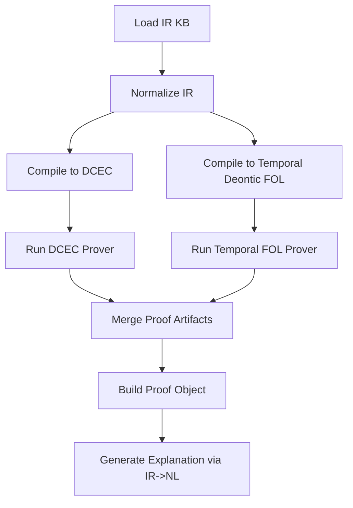

# Hybrid Legal Knowledge Representation Comprehensive Improvement Plan

## 1. Purpose and Outcomes

This plan defines how to integrate optimizers, knowledge graphs, and theorem provers into a hybrid legal reasoning stack that is centered on:

1. Typed frame-based intermediate representation (IR),
2. Controlled natural language (CNL) mapping,
3. Dual compilers (IR -> DCEC and IR -> Temporal Deontic FOL),
4. Proof-producing reasoner APIs.

Primary architecture constraints:

- Frames are first-class objects with named slots.
- Deontic operators (`O`, `P`, `F`) wrap frame references, not raw predicates.
- Temporal constraints are external attachable constructs.
- Canonical IDs are required for entities, frames, norms, temporal constraints, and sources.
- Proof objects must trace to IR IDs and original sentence provenance.

Execution mapping:
- `HYBRID_LEGAL_EXECUTION_WORKSTREAMS.md` (file/function-level workstreams and DoD gates)

## 2. Integration Plan: Optimizers, KG, Provers

### 2.1 Integration Principles

- Semantic stability first: optimizer and KG enrichments are additive or equivalent-preserving.
- Compilers are deterministic over normalized IR.
- Prover backends are pluggable and produce standardized proof artifacts.
- Every transformation must preserve `source_ref` links.

### 2.2 Hook Map

1. Parse stage hooks:
- Optimizer: CNL template candidate ranking and parse disambiguation.
- KG: entity linking (`text span -> canonical entity`).

2. Normalize stage hooks:
- Optimizer: role canonicalization and equivalent-frame dedup strategy.
- KG: type enrichment (`Person`, `Agency`, `Controller`, `CourtOrder`).

3. Compile stage hooks:
- Optimizer: formula simplification and quantifier normalization.
- Prover-prep: backend-specific axiom pack selection.

4. Query/reason stage hooks:
- Prover: compliance, violations, exceptions, contradiction checks.
- KG: conflict diagnostics and ontology overlap hints.

### 2.3 Required Reports per Hook

- Optimizer report:
  - `semantic_equivalence`: bool
  - `drift_score`: float
  - `changes`: list[str]

- KG report:
  - `linked_entities`: list[str]
  - `enriched_slots`: list[str]
  - `confidence`: float

- Prover report:
  - `backend`: str
  - `assumptions`: list[str]
  - `status`: `proved|refuted|unknown`
  - `proof_id`: str

## 3. IR Schema and Grammar

## 3.1 Near-EBNF IR Grammar

```ebnf
IRDocument       = "IR" "{" Meta Entities Frames Temporals Norms Rules Provenance "}" ;
Meta             = "meta" ":" "{" "ir_version" ":" String ","
                   "cnl_version" ":" String ","
                   "jurisdiction" ":" String ","
                   "clock" ":" String "}" ;

Entities         = "entities" ":" "[" { Entity } "]" ;
Frames           = "frames" ":" "[" { Frame } "]" ;
Temporals        = "temporals" ":" "[" { TemporalConstraint } "]" ;
Norms            = "norms" ":" "[" { Norm } "]" ;
Rules            = "rules" ":" "[" { Rule } "]" ;
Provenance       = "provenance" ":" "[" { SourceRef } "]" ;

Entity           = "{" "id" ":" CanonicalId ","
                   "type" ":" TypeName ","
                   "attrs" ":" Object "}" ;

Frame            = ActionFrame | EventFrame | StateFrame ;
ActionFrame      = "{" "id" ":" CanonicalId ","
                   "kind" ":" "action" ","
                   "predicate" ":" Symbol ","
                   "roles" ":" Roles ","
                   "attrs" ":" Object "}" ;
EventFrame       = "{" "id" ":" CanonicalId ","
                   "kind" ":" "event" ","
                   "predicate" ":" Symbol ","
                   "roles" ":" Roles ","
                   "attrs" ":" Object "}" ;
StateFrame       = "{" "id" ":" CanonicalId ","
                   "kind" ":" "state" ","
                   "predicate" ":" Symbol ","
                   "roles" ":" Roles ","
                   "attrs" ":" Object "}" ;
Roles            = "{" { RoleName ":" Ref } "}" ;

TemporalConstraint = "{" "id" ":" CanonicalId ","
                     "relation" ":" TemporalRel ","
                     "expr" ":" TemporalExpr ","
                     "anchor_ref" ":" RefOrNull "}" ;
TemporalExpr       = "{" "kind" ":" ("point"|"interval"|"deadline"|"window")
                     ["," "start" ":" Time]
                     ["," "end" ":" Time]
                     ["," "duration" ":" Duration] "}" ;

Norm             = "{" "id" ":" CanonicalId ","
                   "op" ":" ("O"|"P"|"F") ","
                   "target_frame_ref" ":" Ref ","
                   "activation" ":" Condition ","
                   "exceptions" ":" "[" { Condition } "]" ","
                   "temporal_ref" ":" RefOrNull ","
                   "priority" ":" Integer ","
                   "source_ref" ":" Ref "}" ;

Rule             = "{" "id" ":" CanonicalId ","
                   "mode" ":" ("strict"|"defeasible"|"definition") ","
                   "antecedent" ":" Condition ","
                   "consequent" ":" Atom "}" ;

Condition        = Atom | And | Or | Not | Exists | Forall ;
Atom             = "{" "op" ":" "atom" ","
                   "pred" ":" Symbol ","
                   "args" ":" "[" { Term } "]" "}" ;
And              = "{" "op" ":" "and" "," "children" ":" "[" { Condition } "]" "}" ;
Or               = "{" "op" ":" "or" "," "children" ":" "[" { Condition } "]" "}" ;
Not              = "{" "op" ":" "not" "," "child" ":" Condition "}" ;
Exists           = "{" "op" ":" "exists" "," "var" ":" Symbol ","
                   "var_type" ":" TypeName "," "child" ":" Condition "}" ;
Forall           = "{" "op" ":" "forall" "," "var" ":" Symbol ","
                   "var_type" ":" TypeName "," "child" ":" Condition "}" ;
```

## 3.2 Python Dataclass Model

```python
from dataclasses import dataclass, field
from enum import Enum
from typing import Any, Dict, List, Optional

class DeonticOp(str, Enum):
    O = "O"
    P = "P"
    F = "F"

class FrameKind(str, Enum):
    ACTION = "action"
    EVENT = "event"
    STATE = "state"

class TemporalRel(str, Enum):
    BEFORE = "before"
    AFTER = "after"
    WITHIN = "within"
    BY = "by"
    DURING = "during"

@dataclass(frozen=True)
class CanonicalId:
    namespace: str
    value: str

    def ref(self) -> str:
        return f"{self.namespace}:{self.value}"

@dataclass
class SourceRef:
    id: CanonicalId
    sentence_text: str
    span: Optional[str] = None

@dataclass
class Entity:
    id: CanonicalId
    type_name: str
    attrs: Dict[str, Any] = field(default_factory=dict)

@dataclass
class Frame:
    id: CanonicalId
    kind: FrameKind
    predicate: str
    roles: Dict[str, str] = field(default_factory=dict)
    attrs: Dict[str, Any] = field(default_factory=dict)

@dataclass
class TemporalExpr:
    kind: str
    start: Optional[str] = None
    end: Optional[str] = None
    duration: Optional[str] = None

@dataclass
class TemporalConstraint:
    id: CanonicalId
    relation: TemporalRel
    expr: TemporalExpr
    anchor_ref: Optional[str] = None

@dataclass
class Atom:
    pred: str
    args: List[str] = field(default_factory=list)

@dataclass
class ConditionNode:
    op: str
    atom: Optional[Atom] = None
    children: List["ConditionNode"] = field(default_factory=list)
    var: Optional[str] = None
    var_type: Optional[str] = None

@dataclass
class Norm:
    id: CanonicalId
    op: DeonticOp
    target_frame_ref: str
    activation: ConditionNode
    exceptions: List[ConditionNode] = field(default_factory=list)
    temporal_ref: Optional[str] = None
    priority: int = 0
    source_ref: Optional[str] = None

@dataclass
class Rule:
    id: CanonicalId
    mode: str
    antecedent: ConditionNode
    consequent: Atom

@dataclass
class LegalIR:
    ir_version: str
    cnl_version: str
    jurisdiction: str
    entities: Dict[str, Entity] = field(default_factory=dict)
    frames: Dict[str, Frame] = field(default_factory=dict)
    temporals: Dict[str, TemporalConstraint] = field(default_factory=dict)
    norms: Dict[str, Norm] = field(default_factory=dict)
    rules: Dict[str, Rule] = field(default_factory=dict)
    provenance: Dict[str, SourceRef] = field(default_factory=dict)
```

## 4. Parser, Normalizer, and Compilers

## 4.1 Parser Sketch: NL/CNL -> IR

```text
parse_nl_to_ir(sentence, jurisdiction):
  tokens = lex(sentence)
  template = match_cnl_template(tokens)
  if not template:
    return parse_ambiguity_error

  entities = extract_entities(tokens)
  frame = build_frame(template.predicate, template.roles, entities)
  temporal = extract_temporal(tokens)
  modality = extract_modality(tokens)   # O/P/F
  activation = extract_activation(tokens)
  exceptions = extract_exceptions(tokens)

  source = make_source_ref(sentence)
  assign_canonical_ids(entities, frame, temporal, source, jurisdiction)

  norm = make_norm(op=modality, target_frame_ref=frame.id.ref(),
                   activation=activation, exceptions=exceptions,
                   temporal_ref=temporal.id.ref() if temporal else None,
                   source_ref=source.id.ref())

  return LegalIR(...)
```

## 4.2 Normalizer Sketch: Canonicalization and Composition

```text
normalize_ir(ir):
  normalize_role_names(ir.frames)            # subject->agent, object->patient
  normalize_predicate_lemmas(ir.frames)      # reported->report
  normalize_temporal_units(ir.temporals)     # 24 hours -> PT24H
  merge_equivalent_entities(ir.entities)     # deterministic by key attrs
  dedupe_equivalent_frames(ir.frames)        # semantic key hash
  ensure_stable_ids(ir)                      # deterministic IDs from normalized content
  return ir, normalization_report
```

## 4.3 Compiler 1 Sketch: IR -> DCEC

```text
compile_ir_to_dcec(ir):
  formulas = []

  for frame in ir.frames:
    event_term = frame_to_event_term(frame)          # e.g., Report(controller, breach)

  for norm in ir.norms:
    act_cond = condition_to_dcec(norm.activation)
    exc_cond = conjunction_not(norm.exceptions)
    target = frame_ref_to_event(ir, norm.target_frame_ref)

    if norm.temporal_ref:
      temporal_guard = temporal_to_dcec(ir.temporals[norm.temporal_ref])
    else:
      temporal_guard = TRUE

    if norm.op == O:
      formulas += [
        f"forall t (({act_cond}(t) & {exc_cond}(t) & {temporal_guard}(t)) -> O(Happens({target}, t)))"
      ]
    if norm.op == P:
      formulas += [
        f"forall t (({act_cond}(t) & {exc_cond}(t) & {temporal_guard}(t)) -> P(Happens({target}, t)))"
      ]
    if norm.op == F:
      formulas += [
        f"forall t (({act_cond}(t) & {exc_cond}(t) & {temporal_guard}(t)) -> O(not Happens({target}, t)))"
      ]

  return formulas
```

## 4.4 Compiler 2 Sketch: IR -> Temporal Deontic FOL

```text
compile_ir_to_tdfol(ir):
  formulas = []

  for norm in ir.norms:
    phi = frame_ref_to_atom(ir, norm.target_frame_ref)  # ActionPredicate(args, t)
    gamma = condition_to_tdfol(norm.activation)
    ex = conjunction_not(norm.exceptions)
    tau = temporal_to_tdfol(ir.temporals.get(norm.temporal_ref))

    wrapper = {O: "O", P: "P", F: "F"}[norm.op]
    formulas += [
      f"forall t (({gamma}(t) & {ex}(t) & {tau}(t)) -> {wrapper}({phi}(t)))"
    ]

  return formulas
```

## 4.5 IR -> CNL/NL Round-Trip Generator

```text
generate_cnl(ir_norm, frame, temporal):
  actor = role_text(frame.roles["agent"])
  verb = lexicalize(frame.predicate)
  obj = role_text(frame.roles.get("patient") or frame.roles.get("object"))
  modal = {O: "shall", P: "may", F: "shall not"}[ir_norm.op]

  base = f"{actor} {modal} {verb} {obj}".strip()
  if temporal:
    base += f" {temporal_to_cnl_phrase(temporal)}"
  return base + "."
```

## 5. CNL Design

## 5.1 CNL Syntax Templates

### Normative templates

1. `<Actor> shall <Action> <Object> [TemporalClause] [ConditionClause] [ExceptionClause].`
2. `<Actor> may <Action> <Object> [TemporalClause] [ConditionClause].`
3. `<Actor> shall not <Action> <Object> [TemporalClause] [ConditionClause] [ExceptionClause].`

### Definition templates

4. `<Term> means <DefinitionBody>.`
5. `<Term> includes <ItemList>.`

### Temporal templates

6. `within <Duration>`
7. `by <TimestampOrDeadline>`
8. `before <EventOrTime>`
9. `after <EventOrTime>`
10. `during <Interval>`

### Conditional templates

11. `if <ConditionExpr>`
12. `unless <ConditionExpr>`

## 5.2 Semantic Conversion Table

| CNL template | IR mapping | DCEC mapping | Temporal Deontic FOL mapping |
|---|---|---|---|
| `A shall V O` | `Norm(op=O, target=Frame(V,roles))` | `O(Happens(V(...), t))` under activation | `O(V(..., t))` under activation |
| `A may V O` | `Norm(op=P, target=Frame(...))` | `P(Happens(V(...), t))` | `P(V(..., t))` |
| `A shall not V O` | `Norm(op=F, target=Frame(...))` | `O(not Happens(V(...), t))` | `F(V(..., t))` |
| `within D` | `TemporalConstraint(relation=WITHIN,duration=D)` | temporal guard over `t`/deadline | temporal guard over `t` |
| `by T` | `TemporalConstraint(relation=BY,end=T)` | `t <= T` guard | `t <= T` guard |
| `if C` | `activation=Condition(C)` | antecedent in implication | antecedent in implication |
| `unless E` | `exceptions += E` | `not E` conjunct in antecedent | `not E` conjunct in antecedent |
| `Term means Def` | `Rule(mode=definition)` | definitional axiom | definitional axiom |

## 5.3 Example Lexicon

### Frame types

- `report_action`, `disclose_action`, `notify_action`, `delete_action`, `inspect_action`
- `breach_event`, `consent_event`, `court_order_event`, `retention_end_event`

### Roles

- `agent`, `recipient`, `patient`, `object`, `instrument`, `jurisdiction`, `source`

### Modal qualifiers

- `shall` -> `O`
- `may` -> `P`
- `shall not` -> `F`

### Temporal qualifiers

- `within <duration>` -> `WITHIN`
- `by <time>` -> `BY`
- `before` -> `BEFORE`
- `after` -> `AFTER`
- `during` -> `DURING`

## 5.4 Round-Trip NL Regeneration Rules

1. Determine modal verb from deontic operator (`O`/`P`/`F`).
2. Realize frame predicate and roles into canonical sentence order:
- `agent + modal + predicate + patient/object + recipient`.
3. Append temporal phrase from temporal constraint if present.
4. Append activation phrase (`if ...`) and exceptions (`unless ...`).
5. Preserve legal drafting style by deterministic lexical choices.
6. Support paraphrasing via synonym classes without changing IR IDs.

## 6. Five Sample Legal Sentences with Full Transformations

### Example 1

Original:
`Controller shall report breach within 24 hours.`

IR:
```json
{
  "frame": {"id": "frm:report_breach", "kind": "action", "predicate": "report", "roles": {"agent": "ent:controller", "patient": "ent:breach"}},
  "temporal": {"id": "tmp:24h", "relation": "within", "expr": {"kind": "deadline", "duration": "PT24H"}},
  "norm": {"id": "norm:1", "op": "O", "target_frame_ref": "frm:report_breach", "temporal_ref": "tmp:24h"}
}
```

DCEC:
```text
forall t ((BreachDetected(t) & Within(t, PT24H)) -> O(Happens(Report(controller, breach), t)))
```

Temporal Deontic FOL:
```text
forall t ((BreachDetected(t) & Within(t, PT24H)) -> O(report(controller, breach, t)))
```

Round-trip NL:
`Controller shall report breach within 24 hours.`

### Example 2

Original:
`Agency may inspect records if complaint is filed.`

IR:
```json
{
  "frame": {"id": "frm:inspect_records", "kind": "action", "predicate": "inspect", "roles": {"agent": "ent:agency", "patient": "ent:records"}},
  "norm": {"id": "norm:2", "op": "P", "target_frame_ref": "frm:inspect_records", "activation": {"op": "atom", "pred": "ComplaintFiled", "args": ["ent:complaint"]}}
}
```

DCEC:
```text
forall t (ComplaintFiled(complaint, t) -> P(Happens(Inspect(agency, records), t)))
```

Temporal Deontic FOL:
```text
forall t (ComplaintFiled(complaint, t) -> P(inspect(agency, records, t)))
```

Round-trip NL:
`Agency may inspect records if complaint is filed.`

### Example 3

Original:
`Vendor shall not disclose personal data unless consent is recorded.`

IR:
```json
{
  "frame": {"id": "frm:disclose_data", "kind": "action", "predicate": "disclose", "roles": {"agent": "ent:vendor", "patient": "ent:personal_data"}},
  "norm": {
    "id": "norm:3",
    "op": "F",
    "target_frame_ref": "frm:disclose_data",
    "exceptions": [{"op": "atom", "pred": "ConsentRecorded", "args": ["ent:consent"]}]
  }
}
```

DCEC:
```text
forall t ((not ConsentRecorded(consent, t)) -> O(not Happens(Disclose(vendor, personal_data), t)))
```

Temporal Deontic FOL:
```text
forall t ((not ConsentRecorded(consent, t)) -> F(disclose(vendor, personal_data, t)))
```

Round-trip NL:
`Vendor shall not disclose personal data unless consent is recorded.`

### Example 4

Original:
`Processor shall delete retained identifiers by retention end date.`

IR:
```json
{
  "frame": {"id": "frm:delete_identifiers", "kind": "action", "predicate": "delete", "roles": {"agent": "ent:processor", "patient": "ent:identifiers"}},
  "temporal": {"id": "tmp:retention_end", "relation": "by", "expr": {"kind": "deadline", "end": "evt:retention_end"}},
  "norm": {"id": "norm:4", "op": "O", "target_frame_ref": "frm:delete_identifiers", "temporal_ref": "tmp:retention_end"}
}
```

DCEC:
```text
forall t ((t <= RetentionEndDate) -> O(Happens(Delete(processor, identifiers), t)))
```

Temporal Deontic FOL:
```text
forall t ((t <= retention_end_date) -> O(delete(processor, identifiers, t)))
```

Round-trip NL:
`Processor shall delete retained identifiers by retention end date.`

### Example 5

Original:
`Regulator shall notify entity before imposing sanction.`

IR:
```json
{
  "frame": {"id": "frm:notify_entity", "kind": "action", "predicate": "notify", "roles": {"agent": "ent:regulator", "recipient": "ent:entity"}},
  "temporal": {"id": "tmp:before_sanction", "relation": "before", "expr": {"kind": "point", "end": "evt:impose_sanction"}},
  "norm": {"id": "norm:5", "op": "O", "target_frame_ref": "frm:notify_entity", "temporal_ref": "tmp:before_sanction"}
}
```

DCEC:
```text
forall t ((Before(t, ImposeSanctionTime) -> O(Happens(Notify(regulator, entity), t))))
```

Temporal Deontic FOL:
```text
forall t ((t < impose_sanction_time) -> O(notify(regulator, entity, t)))
```

Round-trip NL:
`Regulator shall notify entity before imposing sanction.`

## 7. Ten CNL Transformation Chains

Each chain is CNL -> IR -> DCEC -> back-to-NL.

1. CNL: `Controller shall report breach within 24 hours.`
- IR: `Norm(O, frame=report(controller, breach), within PT24H)`
- DCEC: `O(Happens(Report(controller, breach), t))` with `Within(t,PT24H)`
- NL: `Controller shall report breach within 24 hours.`

2. CNL: `Agency may inspect records if complaint is filed.`
- IR: `Norm(P, frame=inspect(agency, records), if ComplaintFiled)`
- DCEC: `ComplaintFiled(t) -> P(Happens(Inspect(agency, records), t))`
- NL: `Agency may inspect records if complaint is filed.`

3. CNL: `Vendor shall not disclose personal data unless consent is recorded.`
- IR: `Norm(F, frame=disclose(vendor, data), unless ConsentRecorded)`
- DCEC: `not ConsentRecorded(t) -> O(not Happens(Disclose(vendor, data), t))`
- NL: `Vendor shall not disclose personal data unless consent is recorded.`

4. CNL: `Processor shall delete identifiers by retention end date.`
- IR: `Norm(O, frame=delete(processor, identifiers), by retention_end)`
- DCEC: `t <= retention_end -> O(Happens(Delete(processor, identifiers), t))`
- NL: `Processor shall delete identifiers by retention end date.`

5. CNL: `Regulator shall notify entity before imposing sanction.`
- IR: `Norm(O, frame=notify(regulator, entity), before impose_sanction)`
- DCEC: `Before(t, impose_sanction) -> O(Happens(Notify(regulator, entity), t))`
- NL: `Regulator shall notify entity before imposing sanction.`

6. CNL: `Controller may transfer data after approval is issued.`
- IR: `Norm(P, frame=transfer(controller, data), after approval_issued)`
- DCEC: `After(t, approval_issued) -> P(Happens(Transfer(controller, data), t))`
- NL: `Controller may transfer data after approval is issued.`

7. CNL: `Operator shall log access during maintenance window.`
- IR: `Norm(O, frame=log(operator, access), during maintenance_window)`
- DCEC: `During(t, maintenance_window) -> O(Happens(Log(operator, access), t))`
- NL: `Operator shall log access during maintenance window.`

8. CNL: `Officer shall not publish dossier before redaction.`
- IR: `Norm(F, frame=publish(officer, dossier), before redaction_complete)`
- DCEC: `Before(t, redaction_complete) -> O(not Happens(Publish(officer, dossier), t))`
- NL: `Officer shall not publish dossier before redaction.`

9. CNL: `Data custodian shall encrypt archive within 7 days.`
- IR: `Norm(O, frame=encrypt(custodian, archive), within P7D)`
- DCEC: `Within(t,P7D) -> O(Happens(Encrypt(custodian, archive), t))`
- NL: `Data custodian shall encrypt archive within 7 days.`

10. CNL: `Auditor may request evidence if anomaly is detected.`
- IR: `Norm(P, frame=request(auditor, evidence), if AnomalyDetected)`
- DCEC: `AnomalyDetected(t) -> P(Happens(Request(auditor, evidence), t))`
- NL: `Auditor may request evidence if anomaly is detected.`

## 8. Reasoner Architecture

## 8.1 Workflow Diagram



## 8.2 Query Handling Pseudocode

```text
handle_query(query, time_context):
  ir = load_ir_kb()
  ir_norm, norm_report = normalize_ir(ir)

  dcec_formulas = compile_ir_to_dcec(ir_norm)
  tdfol_formulas = compile_ir_to_tdfol(ir_norm)

  if query.type == "compliance":
    result_dcec = dcec_prover.check_compliance(dcec_formulas, query, time_context)
    result_tdfol = tdfol_prover.check_deadlines(tdfol_formulas, query, time_context)
    proof = merge_proofs(result_dcec, result_tdfol)
    return compliance_response(proof)

  if query.type == "violations":
    violations = detect_violations(dcec_formulas, tdfol_formulas, query.state, query.time_range)
    return violations_response(violations)

  if query.type == "explain":
    proof = proof_store.get(query.proof_id)
    return explain_via_ir_nl(proof)
```

## 8.3 API Signatures

```python
def check_compliance(query: dict, time_context: dict) -> dict:
    """Return compliance status and proof reference."""

def find_violations(state: dict, time_range: tuple[str, str]) -> list[dict]:
    """Return violation records with IR/source links."""

def explain_proof(proof_id: str, format: str = "nl") -> dict:
    """Return proof explanation in NL/JSON/trace format."""
```

## 8.4 Proof Object Schema

```json
{
  "proof_id": "proof:2026-0001",
  "status": "proved",
  "query_type": "check_compliance",
  "backend_results": [
    {"backend": "dcec", "status": "proved"},
    {"backend": "tdfol", "status": "proved"}
  ],
  "ir_refs": ["norm:norm:1", "frame:frm:report_breach", "tmp:tmp:24h"],
  "source_refs": ["src:sentence:001"],
  "steps": [
    "Activation condition satisfied at t0",
    "Deadline constraint active within PT24H",
    "Required event observed before deadline"
  ]
}
```

## 9. Eight Query Test Set with Example Proof Outcomes

1. Query: `check_compliance(report_breach, t=2026-03-01T12:00Z)`
- Expected: compliant
- Proof key steps: breach detected, report happened within PT24H

2. Query: `check_compliance(disclose_personal_data, t=2026-03-02T09:00Z)`
- Expected: non_compliant unless consent present
- Proof key steps: prohibition active, disclosure event observed, no exception

3. Query: `check_compliance(delete_identifiers, t=retention_end+1d)`
- Expected: violation
- Proof key steps: obligation deadline exceeded, event missing

4. Query: `find_violations(state=default, range=[T0,T1])`
- Expected: list includes missed deadline violations
- Proof key steps: temporal guard true, required event absent

5. Query: `find_violations(state=with_consent, range=[T0,T1])`
- Expected: disclosure violation absent if consent recorded
- Proof key steps: exception predicate true

6. Query: `check_compliance(notify_before_sanction, t=sanction_time-1h)`
- Expected: compliant if notification happened prior
- Proof key steps: before relation satisfied

7. Query: `check_compliance(conflict_case, t=T)`
- Expected: conflict detected if same frame under O and F
- Proof key steps: modal contradiction witness

8. Query: `explain_proof(proof:2026-0001, format=nl)`
- Expected: NL explanation reconstructing chain from IR IDs and source sentence

## 10. Phased Delivery Plan

Phase A: IR and CNL hardening
- Finalize grammar and dataclass schema.
- Freeze ID policy and provenance fields.

Phase B: Parser/Normalizer
- Deterministic CNL parser and canonicalizer.
- Parse ambiguity reporting and confidence scoring.

Phase C: Dual compilers
- IR -> DCEC
- IR -> Temporal Deontic FOL
- Cross-compiler parity checks.

Phase D: Hooks and backends
- Optimizer hook contracts and drift gates.
- KG enrichment adapters.
- Prover registry and backend abstraction.

Phase E: Reasoner APIs and proofs
- Implement `check_compliance`, `find_violations`, `explain_proof`.
- Store normalized proof objects with full traceability.

Phase F: Validation and rollout
- Execute 5 sample sentence regression set.
- Execute 10 CNL chain tests and 8 query tests.
- Publish runbook and CI parity command updates.

## 11. Acceptance Criteria

- IR grammar and dataclass model implemented and versioned.
- All normative CNL templates map unambiguously into IR.
- Dual compilers generate stable formulas from the same IR.
- Reasoner returns proof objects with IR/source references.
- Round-trip CNL/NL generation reconstructs normative sentences deterministically.
- Hooking optimizer/KG/prover does not mutate normative semantics beyond configured drift policy.

## 12. Post-WS11 Comprehensive Improvement Plan (WS12)

WS11 closure baseline:
- Resolution PR merged: `https://github.com/endomorphosis/ipfs_datasets_py/pull/1178`.
- WS11 issue set `1164`-`1176` is closed.

WS12 objective:
- Convert WS11 feature completion into production-grade operational maturity with stronger contracts for policy packs, cross-jurisdiction replay, benchmark governance, and regression triage automation.

### 12.1 WS12 Workstreams

1. **Policy-pack contract and deterministic selection**
- Define explicit policy-pack schema (`jurisdiction`, `effective_date`, `priority_policy`, `exception_policy`, `temporal_policy`).
- Require deterministic policy-pack resolution for every query path.

2. **Cross-jurisdiction replay suite**
- Add replay corpus covering at least Federal + two State policy profiles.
- Validate deterministic outputs (`status`, `proof_id`, `reason_code`) for each profile.

3. **Proof conflict triage automation**
- Emit machine-readable conflict diagnostics (`modal_conflict`, `temporal_conflict`, `exception_precedence_conflict`).
- Add triage report generator with remediation hints.

4. **Latency/quality budget gates**
- Introduce fixed budget gates for parse, compile, prover, and explanation phases.
- Fail release gate when percentile thresholds regress beyond configured tolerance.

5. **Evidence-pack unification**
- Consolidate WS10/WS11 evidence generation into one canonical release command.
- Emit manifest with contract/hash snapshots for traceability.

### 12.2 WS12 Execution Tickets (proposed)

1. `HL-WS12-01` Policy Pack Schema + Validator
- Acceptance: invalid/missing policy-pack fields fail with stable error codes.
- Gate: policy-pack schema tests green.

2. `HL-WS12-02` Deterministic Policy Resolver
- Acceptance: same `(jurisdiction, date, query)` selects same policy-pack ID across replay.
- Gate: replay determinism tests green.

3. `HL-WS12-03` Multi-Jurisdiction Replay Matrix
- Acceptance: Federal + 2 State profiles pass replay matrix with stable proof IDs.
- Gate: query matrix + replay suite green.

4. `HL-WS12-04` Proof Conflict Taxonomy + Codes
- Acceptance: every conflict path emits one of the registered conflict reason codes.
- Gate: conflict regression tests green.

5. `HL-WS12-05` Triage Report Builder (JSON + Markdown)
- Acceptance: conflict summaries produce deterministic JSON and markdown artifacts.
- Gate: triage artifact contract tests green.

6. `HL-WS12-06` Performance Budget Sentinel
- Acceptance: parse/compile/prover/explain p95 budgets enforced in CI gate.
- Gate: benchmark sentinel script + threshold tests green.

7. `HL-WS12-07` Unified Release Evidence Pack v2
- Acceptance: single command emits manifest, test gate logs, backend matrix, replay matrix, triage outputs.
- Gate: evidence-pack smoke green.

8. `HL-WS12-08` Runbook + TODO Operational Closure
- Acceptance: runbook and TODO updated with WS12 commands, artifacts, and promotion/rollback checks.
- Gate: docs link-check + command smoke green.

### 12.3 Dependency Order

Recommended sequence:
1. `HL-WS12-01` -> `HL-WS12-02`
2. `HL-WS12-03` and `HL-WS12-04`
3. `HL-WS12-05`
4. `HL-WS12-06` and `HL-WS12-07`
5. `HL-WS12-08`

Parallel-safe lanes:
- `HL-WS12-03` and `HL-WS12-04` after resolver lock (`WS12-02`).
- `HL-WS12-06` can run in parallel with `HL-WS12-05` once replay matrix is stable.

### 12.4 WS12 Exit Criteria

- Deterministic policy-pack resolution verified across all supported jurisdictions.
- Conflict reason-code taxonomy fully covered by tests.
- Unified evidence-pack command produces complete release artifact set.
- CI gates enforce both quality and latency budgets.
- Runbook/TODO fully reflect WS12 operational procedures.

### 12.5 Execution Mapping

Detailed ticket breakdown:
- `HYBRID_LEGAL_WS12_POST_WS11_IMPLEMENTATION_TICKETS.md`
