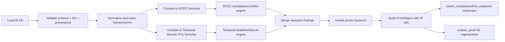

# Hybrid Legal IR-CNL-Reasoner Integration Improvement Plan

Status: Draft v1 (2026-03-02)
Scope: Optimizer, KG, and theorem prover integration into IR, CNL, compiler, and reasoner architecture.

## 1) Objectives

This plan defines a scalable hybrid legal representation and reasoning architecture that combines:
- Frame Logic style typed frames
- First-Order Logic conditions and definitions
- Deontic operators `O`, `P`, `F`
- Temporal deontic FOL
- DCEC/Event Calculus dynamics (`Happens`, `Initiates`, `Terminates`, `HoldsAt`)

Core design constraints:
- Frames are first-class objects with named slots.
- Deontic operators wrap frames, not predicate arguments.
- Temporal constraints are external wrappers attached to norms/frames.
- Canonical IDs are deterministic and stable.
- One IR compiles to both DCEC and temporal deontic FOL.
- CNL is reversible with deterministic round-trip regeneration.

## 2) Hooking Strategy (Optimizer + KG + Prover)

### 2.1 Pipeline insertion points

`NL/CNL -> Parser -> IR Builder -> Normalizer -> [Optimizer Hook] -> [KG Hook] -> Compiler(DCEC/TDFOL) -> [Prover Hook] -> Proof Store -> Explanation API`

### 2.2 Hook contracts

Optimizer hook input:
- canonical `LegalIR`
- optional optimization policy

Optimizer hook output:
- candidate normalized IR
- report: `accepted`, `drift_score`, `reason_codes`, `decision_id`

KG hook input:
- canonical IR entities/roles/frames

KG hook output:
- additive enrichment patch only
- report: `entity_link_count`, `relation_candidate_count`, `entity_write_count`, `relation_write_count`

Prover hook input:
- selected target formulas (`dcec`, `tdfol`)
- assumptions and query theorem

Prover hook output:
- normalized certificate envelope
- backend-specific payload keys
- proof trace refs to IR IDs and source sentence IDs

### 2.3 Safety rules

- Optimizer may not mutate modality operator (`O/P/F`) or target frame IDs.
- KG enrichments must be reversible and confidence-scored.
- Prover certificate must include backend ID, format version, and theorem hash hint.
- Every proof step must include at least one `ir_ref` and one provenance entry.

## 3) IR Grammar (Near-EBNF)

```ebnf
LegalIR          ::= "IR" "{" Header Entities Frames Norms Definitions Constraints Sources "}"
Header           ::= "header" ":" "{" "ir_version" ":" Version "," "cnl_version" ":" Version "," "jurisdiction" ":" JurRef "}"
Entities         ::= "entities" ":" "[" { Entity } "]"
Frames           ::= "frames" ":" "[" { Frame } "]"
Norms            ::= "norms" ":" "[" { Norm } "]"
Definitions      ::= "definitions" ":" "[" { DefinitionRule } "]"
Constraints      ::= "constraints" ":" "[" { TemporalConstraint | LogicalConstraint } "]"
Sources          ::= "sources" ":" "[" { SourceRef } "]"

Entity           ::= "{" "id" ":" EntId "," "type" ":" EntType "," "label" ":" String ["," "attrs" ":" Map] "}"
Frame            ::= "{" "id" ":" FrmId "," "frame_type" ":" FrameType "," "predicate" ":" Symbol "," "slots" ":" SlotMap ["," "context" ":" Context] "}"
SlotMap          ::= "{" { RoleName ":" TermRef } "}"
Context          ::= "{" ["jurisdiction" ":" JurRef] ["," "modality_context" ":" Symbol] ["," "time_anchor" ":" TimeRef] "}"

Norm             ::= "{" "id" ":" NormId "," "operator" ":" ("O" | "P" | "F") "," "target_frame" ":" FrmId
                     ["," "conditions" ":" "[" { ConditionRef } "]"]
                     ["," "exceptions" ":" "[" { ConditionRef } "]"]
                     ["," "temporal" ":" "[" { TempRef } "]"]
                     ["," "priority" ":" Integer]
                     ["," "source_ref" ":" SourceId]
                   "}"

DefinitionRule   ::= "{" "id" ":" DefId "," "kind" ":" ("means" | "includes")
                     "," "lhs_frame" ":" FrmId "," "rhs_formula" ":" FormulaExpr "}"

TemporalConstraint ::= "{" "id" ":" TmpId "," "relation" ":" ("before"|"after"|"by"|"within"|"during")
                        "," "subject" ":" Ref "," "object" ":" RefOrTime "," "unit" ":" TimeUnit ["," "value" ":" Number] "}"

LogicalConstraint ::= "{" "id" ":" CId "," "kind" ":" ("conflict"|"dependency"|"mutex") "," "refs" ":" "[" { Ref } "]" "}"

SourceRef        ::= "{" "id" ":" SourceId "," "text" ":" String "," "uri" ":" String ["," "span" ":" Span] "}"
```

## 4) Python Dataclass IR Model

```python
from __future__ import annotations
from dataclasses import dataclass, field
from typing import Any, Literal

DeonticOp = Literal["O", "P", "F"]
TemporalRel = Literal["before", "after", "by", "within", "during"]

@dataclass(frozen=True)
class SourceRef:
    id: str
    text: str
    uri: str | None = None
    span: tuple[int, int] | None = None

@dataclass(frozen=True)
class Entity:
    id: str
    type: str
    label: str
    attrs: dict[str, Any] = field(default_factory=dict)

@dataclass(frozen=True)
class FrameContext:
    jurisdiction: str | None = None
    modality_context: str | None = None
    time_anchor: str | None = None

@dataclass(frozen=True)
class Frame:
    id: str
    frame_type: str
    predicate: str
    slots: dict[str, str]
    context: FrameContext = field(default_factory=FrameContext)

@dataclass(frozen=True)
class TemporalConstraint:
    id: str
    relation: TemporalRel
    subject_ref: str
    object_ref: str | None = None
    value: int | None = None
    unit: str | None = None

@dataclass(frozen=True)
class DefinitionRule:
    id: str
    kind: Literal["means", "includes"]
    lhs_frame_ref: str
    rhs_formula: str

@dataclass(frozen=True)
class Norm:
    id: str
    operator: DeonticOp
    target_frame_ref: str
    condition_frame_refs: tuple[str, ...] = ()
    exception_frame_refs: tuple[str, ...] = ()
    temporal_constraint_refs: tuple[str, ...] = ()
    priority: int = 0
    source_ref: str | None = None

@dataclass(frozen=True)
class LegalIR:
    ir_version: str
    cnl_version: str
    jurisdiction: str
    entities: tuple[Entity, ...]
    frames: tuple[Frame, ...]
    norms: tuple[Norm, ...]
    definitions: tuple[DefinitionRule, ...] = ()
    temporal_constraints: tuple[TemporalConstraint, ...] = ()
    sources: tuple[SourceRef, ...] = ()
```

Canonical ID policy:
- `ent:<sha12(type|canonical_label)>`
- `frm:<sha12(frame_type|predicate|sorted(slots)|jurisdiction)>`
- `nrm:<sha12(operator|target_frame_ref|conditions|exceptions|temporal)>`
- `tmp:<sha12(relation|subject|object|value|unit)>`

## 5) CNL Syntax and Mapping Templates

### 5.1 Norm templates

1. `OBLIGATION`: `Party <A> shall <ACTION_FRAME> [TEMPORAL_CLAUSE].`
2. `PROHIBITION`: `Party <A> shall not <ACTION_FRAME> [TEMPORAL_CLAUSE].`
3. `PERMISSION`: `Party <A> may <ACTION_FRAME> [TEMPORAL_CLAUSE].`
4. `CONDITIONAL`: `If <COND_FRAME>, Party <A> shall <ACTION_FRAME> [TEMPORAL_CLAUSE].`
5. `EXCEPTION`: `Party <A> shall <ACTION_FRAME> unless <EXC_FRAME>.`

### 5.2 Definition templates

1. `MEANS`: `<TERM_FRAME> means <FORMULA>.`
2. `INCLUDES`: `<TERM_FRAME> includes <FORMULA>.`

### 5.3 Temporal templates

1. `BY`: `... by <DATE_OR_DURATION_ANCHOR>.`
2. `WITHIN`: `... within <N> <UNIT> [of <EVENT_OR_TIME>].`
3. `BEFORE`: `... before <TIME_OR_EVENT>.`
4. `AFTER`: `... after <TIME_OR_EVENT>.`
5. `DURING`: `... during <START> to <END>.`

## 6) Semantic Conversion Table

| CNL template | IR mapping | DCEC mapping | Temporal Deontic FOL mapping |
|---|---|---|---|
| `A shall ACT` | `Norm(op=O, target=Frame(ACT))` | `O(Happens(ACT(A), t))` | `O(Exists t. ACT(A,t))` |
| `A shall not ACT` | `Norm(op=F, target=Frame(ACT))` | `F(Happens(ACT(A), t))` | `F(Exists t. ACT(A,t))` |
| `A may ACT` | `Norm(op=P, target=Frame(ACT))` | `P(Happens(ACT(A), t))` | `P(Exists t. ACT(A,t))` |
| `If C, A shall ACT` | `conditions=[Frame(C)]` | `HoldsAt(C,t) -> O(Happens(ACT(A),t2))` | `Forall t. C(t) -> O(Exists t2. ACT(A,t2))` |
| `A shall ACT by D` | `Temporal(by, target, D)` | `O(Exists t<=D. Happens(ACT(A),t))` | `O(Exists t. t<=D and ACT(A,t))` |
| `A shall ACT within N days` | `Temporal(within,N,days)` | `O(Exists t. within(t,anchor,Nd) and Happens(...,t))` | `O(Exists t. Within(t,anchor,Nd) and ACT(A,t))` |
| `A shall ACT unless E` | `exceptions=[Frame(E)]` | `not HoldsAt(E,t) -> O(Happens(ACT(A),t2))` | `Forall t. not E(t) -> O(Exists t2. ACT(A,t2))` |
| `X means Y` | `Definition(kind=means)` | `Forall x. X(x) <-> Y(x)` | `Forall x. X(x) <-> Y(x)` |

## 7) Example Lexicon

Frame types:
- `report_event`
- `disclosure_event`
- `consent_record`
- `payment_event`
- `notice_event`
- `breach_event`

Roles:
- `agent`
- `recipient`
- `object`
- `beneficiary`
- `authority`
- `jurisdiction`

Modal qualifiers:
- `shall -> O`
- `shall not -> F`
- `may -> P`

Temporal qualifiers:
- `by`
- `within`
- `before`
- `after`
- `during`

## 8) Parser/Normalizer/Compilers (Implementation Sketch)

### 8.1 Parser: NL/CNL -> IR

```python
def parse_cnl_to_ir(sentence: str, lexicon: Lexicon, jurisdiction: str) -> PartialIR:
    tokens = tokenize(sentence)
    ast = match_cnl_templates(tokens)  # obligation/prohibition/permission/definition
    if ast.is_ambiguous:
        raise ParseError(code="CNL_AMBIGUOUS_TEMPLATE", details=ast.candidates)

    entities = extract_entities(ast, lexicon)
    frame = build_frame_from_ast(ast, entities, lexicon)
    temporal = extract_temporal_constraints(ast, frame.id)
    norm = build_norm(ast, frame.id, temporal)
    source = SourceRef(id=source_id(sentence), text=sentence)

    return PartialIR(
        entities=[*entities],
        frames=[frame],
        norms=[norm],
        temporal_constraints=temporal,
        sources=[source],
    )
```

### 8.2 Normalizer: canonicalization

```python
def normalize_ir(partial_ir: PartialIR, policy: CanonicalPolicy) -> LegalIR:
    ents = canonicalize_entities(partial_ir.entities, policy)
    frames = canonicalize_frames(partial_ir.frames, ents, policy)
    temps = canonicalize_temporal(partial_ir.temporal_constraints, frames, policy)
    norms = canonicalize_norms(partial_ir.norms, frames, temps, policy)

    validate_contract(ents, frames, norms, temps)

    return LegalIR(
        ir_version="1.0",
        cnl_version="1.0",
        jurisdiction=policy.jurisdiction,
        entities=tuple(ents),
        frames=tuple(frames),
        norms=tuple(norms),
        temporal_constraints=tuple(temps),
        sources=tuple(partial_ir.sources),
    )
```

### 8.3 Compiler1: IR -> DCEC

```python
def compile_ir_to_dcec(ir: LegalIR) -> list[str]:
    formulas = []
    for n in ir.norms:
        tgt = deref_frame(ir, n.target_frame_ref)
        dcec_event = to_happens_term(tgt)  # Happens(ActionFrame, t)
        wrapped = wrap_deontic(n.operator, dcec_event)

        with_conds = apply_conditions_dcec(ir, n.condition_frame_refs, wrapped)
        with_excs = apply_exceptions_dcec(ir, n.exception_frame_refs, with_conds)
        with_time = apply_temporal_dcec(ir, n.temporal_constraint_refs, with_excs)

        formulas.append(with_time)

    formulas.extend(compile_definitions_to_fol(ir.definitions))
    formulas.extend(compile_event_dynamics(ir.frames))  # Initiates/Terminates/HoldsAt links
    return formulas
```

### 8.4 Compiler2: IR -> Temporal Deontic FOL

```python
def compile_ir_to_temporal_deontic_fol(ir: LegalIR) -> list[str]:
    formulas = []
    for n in ir.norms:
        atom = frame_to_fol_atom(ir, n.target_frame_ref)  # ACT(agent, object, t)
        modal = wrap_deontic_fol(n.operator, atom)

        conditioned = add_condition_implications(ir, n.condition_frame_refs, modal)
        excepted = add_exception_guards(ir, n.exception_frame_refs, conditioned)
        timed = add_temporal_guards_fol(ir, n.temporal_constraint_refs, excepted)

        formulas.append(quantify_free_vars(timed))

    formulas.extend(compile_definition_equivalences(ir.definitions))
    return formulas
```

## 9) Round-Trip NL Regeneration Rules

1. Select canonical template by `Norm.operator` and presence of condition/exception/temporal refs.
2. Realize target frame using lexicon role ordering and named-slot labels.
3. Render temporal clause from normalized temporal constraints in fixed precedence:
   - `during` > `within` > `by` > `before` > `after`
4. Apply deterministic paraphrase style profile (`compact` or `formal`) without changing semantics.
5. Include source note only in explanatory mode.

Template rendering examples:
- `O + no condition + by`: `Party A shall <action> by <deadline>.`
- `F + condition`: `If <condition>, Party A shall not <action>.`
- `P + exception`: `Party A may <action> unless <exception>.`

## 10) Five Detailed End-to-End Examples

### Example 1
Original:
`Controller shall report a breach within 24 hours.`

IR (compact):
```json
{
  "norm": {"operator": "O", "target_frame": "frm:report_breach", "temporal": ["tmp:within24h"]},
  "frame": {"predicate": "report", "slots": {"agent": "ent:controller", "object": "ent:breach"}},
  "temporal": {"relation": "within", "value": 24, "unit": "hour", "subject": "frm:report_breach"}
}
```

DCEC:
`O(Exists t. Within(t, t_breach, 24h) and Happens(Report(controller, breach), t))`

Temporal Deontic FOL:
`O(Exists t. Within(t, t_breach, 24h) and Report(controller, breach, t))`

Round-trip NL:
`Controller shall report breach within 24 hours.`

### Example 2
Original:
`Processor shall not disclose personal data unless consent is recorded.`

IR (compact):
```json
{
  "norm": {"operator": "F", "target_frame": "frm:disclose_data", "exceptions": ["frm:consent_recorded"]}
}
```

DCEC:
`not HoldsAt(ConsentRecorded(data_subject), t) -> F(Happens(Disclose(processor, personal_data), t))`

Temporal Deontic FOL:
`Forall t. not ConsentRecorded(data_subject, t) -> F(Disclose(processor, personal_data, t))`

Round-trip NL:
`Processor shall not disclose personal data unless consent is recorded.`

### Example 3
Original:
`If wages are due, employer shall pay wages by the fifth day.`

IR (compact):
```json
{
  "norm": {"operator": "O", "target_frame": "frm:pay_wages", "conditions": ["frm:wages_due"], "temporal": ["tmp:by_day5"]}
}
```

DCEC:
`HoldsAt(WagesDue(employer, employee), t0) -> O(Exists t. t<=day5 and Happens(Pay(employer, wages), t))`

Temporal Deontic FOL:
`Forall t0. WagesDue(employer, employee, t0) -> O(Exists t. t<=day5 and Pay(employer, wages, t))`

Round-trip NL:
`If wages are due, employer shall pay wages by day 5.`

### Example 4
Original:
`Agency may issue a temporary permit after review is complete.`

IR (compact):
```json
{
  "norm": {"operator": "P", "target_frame": "frm:issue_permit", "temporal": ["tmp:after_review"]}
}
```

DCEC:
`HoldsAt(ReviewComplete(permit_case), t0) -> P(Exists t. t>t0 and Happens(IssuePermit(agency, permit_case), t))`

Temporal Deontic FOL:
`Forall t0. ReviewComplete(permit_case, t0) -> P(Exists t. t>t0 and IssuePermit(agency, permit_case, t))`

Round-trip NL:
`Agency may issue a temporary permit after review completion.`

### Example 5
Original:
`During 2026-01-01 to 2026-12-31, vendor shall maintain audit logs.`

IR (compact):
```json
{
  "norm": {"operator": "O", "target_frame": "frm:maintain_logs", "temporal": ["tmp:during_2026"]}
}
```

DCEC:
`O(Forall t. InInterval(t, 2026-01-01, 2026-12-31) -> HoldsAt(Maintain(vendor, audit_logs), t))`

Temporal Deontic FOL:
`O(Forall t. During(t, 2026-01-01, 2026-12-31) -> Maintain(vendor, audit_logs, t))`

Round-trip NL:
`Vendor shall maintain audit logs during 2026-01-01 to 2026-12-31.`

## 11) Ten CNL Transformation Chains

| # | CNL sentence | IR core | DCEC head | Back to NL |
|---|---|---|---|---|
| 1 | `Controller shall report breach within 24 hours.` | `O(frm:report_breach)+within24h` | `O(Within -> Happens(Report))` | `Controller shall report breach within 24 hours.` |
| 2 | `Processor shall not disclose personal data unless consent is recorded.` | `F(frm:disclose)+exc(consent)` | `not Consent -> F(Happens(Disclose))` | same |
| 3 | `Employer shall pay wages by day 5.` | `O(frm:pay_wages)+by(day5)` | `O(Exists t<=day5 Happens(Pay))` | same |
| 4 | `Agency may issue permit after review.` | `P(frm:issue_permit)+after(review)` | `Review -> P(Happens(IssuePermit))` | `Agency may issue permit after review completion.` |
| 5 | `Vendor shall maintain logs during 2026.` | `O(frm:maintain_logs)+during(interval)` | `O(Forall t in interval HoldsAt(Maintain))` | same |
| 6 | `If incident occurs, operator shall notify authority within 2 hours.` | `cond(incident)+O(notify)+within2h` | `Incident -> O(Within -> Happens(Notify))` | same |
| 7 | `Bank may freeze account before settlement.` | `P(freeze)+before(settlement)` | `P(Exists t<t_settle Happens(Freeze))` | same |
| 8 | `Carrier shall not transport hazardous goods without permit.` | `F(transport)+exc(permit_present)` | `not Permit -> F(Happens(Transport))` | `Carrier shall not transport hazardous goods unless permit is present.` |
| 9 | `Critical outage means service unavailable for 30 minutes.` | `Def(means, outage, unavailable_30m)` | `Outage <-> Unavailable30m` | `Critical outage means service unavailable for 30 minutes.` |
| 10 | `Personal data includes biometric identifiers.` | `Def(includes, personal_data, biometric)` | `Biometric(x) -> PersonalData(x)` | same |

## 12) Reasoner Architecture

### 12.1 Workflow diagram



### 12.2 Query handling pseudocode

```python
def check_compliance(query: dict, time_context: dict) -> dict:
    ir = load_ir_kb(query["jurisdiction"])
    ir = normalize_ir(ir, canonical_policy(query))
    dcec = compile_ir_to_dcec(ir)
    tdfol = compile_ir_to_temporal_deontic_fol(ir)

    compliance = dcec_engine_check(dcec, query, time_context)
    temporal = tdfol_engine_check(tdfol, query, time_context)
    merged = merge_findings(compliance, temporal)

    cert = prover_hook_prove(merged.goal_formula, merged.assumptions)
    proof = build_proof_object(ir, query, merged, cert)
    store_proof(proof)

    return make_compliance_payload(merged, proof.proof_id)


def find_violations(state: dict, time_range: tuple[str, str]) -> dict:
    ir = normalize_ir(load_ir_kb(state["jurisdiction"]), canonical_policy(state))
    dcec, tdfol = compile_ir_to_dcec(ir), compile_ir_to_temporal_deontic_fol(ir)

    violations = detect_violations(dcec, state, time_range)
    deadlines = detect_temporal_breaches(tdfol, state, time_range)
    conflicts = detect_conflicts(ir, state)

    merged = merge_violation_sets(violations, deadlines, conflicts)
    proof = build_and_store_proof(ir, state, merged)
    return make_violation_payload(merged, proof.proof_id)


def explain_proof(proof_id: str, format: str = "nl") -> dict:
    proof = load_proof(proof_id)
    ir = resolve_ir_refs(proof)

    if format == "json":
        return serialize_proof(proof)
    if format == "graph":
        return render_proof_graph(proof)

    explanation = regenerate_nl_from_proof_and_ir(proof, ir)
    return {
        "proof_id": proof_id,
        "format": "nl",
        "status": proof.status,
        "root_conclusion": proof.root_conclusion,
        "steps": explanation["steps"],
        "reconstructed_nl": explanation["reconstructed_nl"],
    }
```

### 12.3 API signatures

```python
def check_compliance(query: dict, time_context: dict) -> dict: ...
def find_violations(state: dict, time_range: tuple[str, str]) -> dict: ...
def explain_proof(proof_id: str, format: str = "nl") -> dict: ...
```

## 13) Proof Obligations

For each query result, the proof object must satisfy:
- Deterministic `proof_id` and `proof_hash`
- Non-empty `steps`
- Every step has `ir_refs` and provenance source IDs
- Deontic operator in conclusion equals IR norm operator
- Temporal guards in proof must correspond to IR temporal constraints
- Certificate payload matches backend compatibility matrix

## 14) Test Set: 8 Queries + Example Proof Outcomes

| Query ID | Query | Expected status | Example proof root conclusion |
|---|---|---|---|
| Q1 | wages paid on day 3 when due | compliant | `Obligation pay_wages satisfied before day5` |
| Q2 | wages unpaid by day 5 | non_compliant | `Violation: missed payment deadline` |
| Q3 | disclosure without consent | non_compliant | `Violation: prohibited disclosure event` |
| Q4 | disclosure with valid consent | compliant | `Exception applied: consent recorded` |
| Q5 | breach reported at 30h | non_compliant | `Violation: report_breach exceeds within24h` |
| Q6 | breach reported at 10h | compliant | `Obligation report_breach satisfied within24h` |
| Q7 | simultaneous O and F on same frame | inconclusive/conflict | `Conflict: obligation/prohibition overlap` |
| Q8 | explain proof for Q2 | proved | `Proof reconstruction available in NL` |

## 15) Improvement Roadmap

Phase 1 (Schema + CNL hardening):
- Freeze grammar and template IDs
- Enforce parser ambiguity error codes
- Add schema lock snapshots and checksum guards

Phase 2 (Compiler parity):
- Strengthen parity tests between DCEC and TDFOL
- Add differential reporter for deontic/temporal mismatches

Phase 3 (Hook governance):
- Tight optimizer rejection taxonomy
- KG enrichment cap + rollback verification
- Prover payload compatibility tests for all registered backends

Phase 4 (Reasoner + proof reliability):
- Expand 8-query matrix into jurisdiction packs
- Add replay validation gates for imported proofs
- Add NL explanation quality checks with deterministic fixtures

Phase 5 (Operations + release):
- CI matrix for mock and concrete prover backends
- Release checklist artifact automation
- Canary and rollback drills with artifact links

## 16) Success Metrics

- Parse determinism: >= 99.5% stable normalized IR over replay corpus
- Compiler parity: 0 critical deontic target mismatches
- Optimizer safety: 0 accepted proposals violating semantic floor
- KG drift: relation growth bounded by configured caps
- Proof completeness: 100% steps with IR refs and provenance
- API stability: schema version and required fields unchanged across patch releases

## 17) Practical Next Steps

1. Use this file as the design baseline for the next implementation sprint.
2. Convert sections 3-8 into executable test fixtures and contract validators.
3. Tie section 14 query matrix directly to CI and release checklist artifacts.
