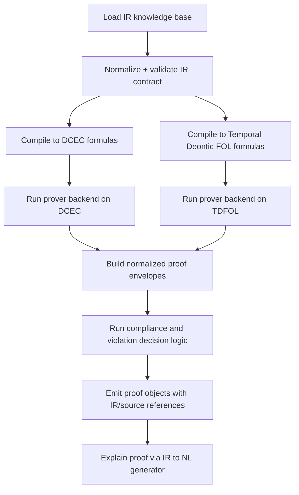

# Hybrid Legal Master Integration Plan

## 1. Goal

Build a hybrid legal knowledge representation and reasoning stack that integrates:

1. Frame Logic style compositional frames.
2. First-Order Logic (FOL) conditions and definitions.
3. Deontic operators (`O`, `P`, `F`).
4. Temporal Deontic FOL.
5. DCEC/Event Calculus dynamics (`Happens`, `Initiates`, `Terminates`, `HoldsAt`).

The architecture is centered on a typed IR that compiles to both DCEC and Temporal Deontic FOL, and supports reversible CNL/NL generation.

## 2. Integration Design: Optimizers, KG, Provers

### 2.1 Hook points

1. Parse stage:
- Optimizer: parse candidate ranking and ambiguity scoring.
- KG: entity linking for actor/object/recipient mentions.

2. Normalize stage:
- Optimizer: role canonicalization and frame dedup planning.
- KG: type and relation enrichment for linked entities.

3. Compile stage:
- Optimizer: formula simplification and quantifier normalization.
- Prover prep: backend-specific theorem packaging.

4. Reasoning stage:
- Prover: compliance, violations, exception activation, conflict checks.
- KG: evidence augmentation (additive only).

### 2.2 Safety contracts

1. Optimizer contract:
- Must provide drift and semantic-equivalence signals.
- Must emit machine-readable rejection reasons when not accepted.

2. KG contract:
- Must preserve canonical IDs.
- Must pass drift checks (`relation_growth_factor`, `relations_per_frame`) before apply.

3. Prover contract:
- Must return normalized proof envelope with deterministic `certificate_id` and hash.

4. IR contract error-code registry (stable machine-readable codes):
- `V2_CONTRACT_UNSUPPORTED_IR_VERSION`
- `V2_CONTRACT_UNSUPPORTED_CNL_VERSION`
- `V2_CONTRACT_PROVENANCE_KEY_MISMATCH`
- `V2_CONTRACT_FRAME_ID_KEY_MISMATCH`
- `V2_CONTRACT_NORM_ID_KEY_MISMATCH`
- `V2_CONTRACT_RULE_ID_KEY_MISMATCH`
- `V2_CONTRACT_UNKNOWN_TARGET_FRAME_REF`
- `V2_CONTRACT_UNKNOWN_TEMPORAL_REF`
- `V2_CONTRACT_MISSING_SOURCE_REF`
- `V2_CONTRACT_UNKNOWN_SOURCE_REF`

## 3. IR Schema (Near-EBNF)

```ebnf
IRDocument       = "IR" "{" Meta Entities Frames Temporals Norms Rules Provenance "}" ;
Meta             = "meta" ":" "{" "ir_version" ":" String ","
                   "cnl_version" ":" String ","
                   "jurisdiction" ":" String "}" ;

Entities         = "entities" ":" "[" { Entity } "]" ;
Frames           = "frames" ":" "[" { Frame } "]" ;
Temporals        = "temporals" ":" "[" { TemporalConstraint } "]" ;
Norms            = "norms" ":" "[" { Norm } "]" ;
Rules            = "rules" ":" "[" { Rule } "]" ;
Provenance       = "provenance" ":" "[" { SourceRef } "]" ;

Entity           = "{" "id" ":" CanonicalId "," "type" ":" String "," "attrs" ":" Object "}" ;
Frame            = "{" "id" ":" CanonicalId "," "kind" ":" ("action"|"event"|"state") ","
                   "predicate" ":" String "," "roles" ":" Roles "," "attrs" ":" Object "}" ;
Roles            = "{" { RoleName ":" Ref } "}" ;
TemporalConstraint = "{" "id" ":" CanonicalId "," "relation" ":" TemporalRel ","
                     "expr" ":" TemporalExpr "," "anchor_ref" ":" RefOrNull "}" ;
TemporalExpr     = "{" "kind" ":" String ["," "start" ":" String] ["," "end" ":" String] ["," "duration" ":" String] "}" ;

Norm             = "{" "id" ":" CanonicalId "," "op" ":" ("O"|"P"|"F") ","
                   "target_frame_ref" ":" Ref ","
                   "activation" ":" Condition ","
                   "exceptions" ":" "[" { Condition } "]" ","
                   "temporal_ref" ":" RefOrNull ","
                   "priority" ":" Integer ","
                   "source_ref" ":" Ref "}" ;

Rule             = "{" "id" ":" CanonicalId "," "mode" ":" ("strict"|"definition") ","
                   "antecedent" ":" Condition "," "consequent" ":" Atom "," "source_ref" ":" Ref "}" ;

Condition        = Atom | And | Or | Not ;
Atom             = "{" "op" ":" "atom" "," "pred" ":" String "," "args" ":" "[" { Term } "]" "}" ;
```

## 4. Python Dataclass Model (Sketch)

```python
from dataclasses import dataclass, field
from typing import Any, Dict, List, Optional

@dataclass(frozen=True)
class CanonicalId:
    namespace: str
    value: str
    def ref(self) -> str:
        return f"{self.namespace}:{self.value}"

@dataclass
class SourceRef:
    source_id: str
    sentence_text: str
    sentence_span: Optional[str] = None

@dataclass
class Entity:
    id: CanonicalId
    type_name: str
    attrs: Dict[str, Any] = field(default_factory=dict)

@dataclass
class Frame:
    id: CanonicalId
    kind: str
    predicate: str
    roles: Dict[str, str] = field(default_factory=dict)
    attrs: Dict[str, Any] = field(default_factory=dict)

@dataclass
class TemporalExpr:
    kind: str
    start: Optional[str] = None
    end: Optional[str] = None
    duration: Optional[str] = None

@dataclass
class TemporalConstraint:
    id: CanonicalId
    relation: str
    expr: TemporalExpr
    anchor_ref: Optional[str] = None

@dataclass
class Atom:
    pred: str
    args: List[str] = field(default_factory=list)

@dataclass
class ConditionNode:
    op: str
    atom: Optional[Atom] = None
    children: List["ConditionNode"] = field(default_factory=list)

@dataclass
class Norm:
    id: CanonicalId
    op: str
    target_frame_ref: str
    activation: ConditionNode
    exceptions: List[ConditionNode] = field(default_factory=list)
    temporal_ref: Optional[str] = None
    priority: int = 0
    source_ref: Optional[str] = None

@dataclass
class Rule:
    id: CanonicalId
    antecedent: ConditionNode
    consequent: Atom
    mode: str = "strict"
    source_ref: Optional[str] = None

@dataclass
class LegalIR:
    ir_version: str = "2.0"
    cnl_version: str = "2.0"
    jurisdiction: str = "default"
    entities: Dict[str, Entity] = field(default_factory=dict)
    frames: Dict[str, Frame] = field(default_factory=dict)
    temporals: Dict[str, TemporalConstraint] = field(default_factory=dict)
    norms: Dict[str, Norm] = field(default_factory=dict)
    rules: Dict[str, Rule] = field(default_factory=dict)
    provenance: Dict[str, SourceRef] = field(default_factory=dict)
```

## 5. CNL Syntax and Mapping

### 5.1 Norm templates

1. `<Actor> shall <VerbPhrase> [TemporalClause] [if/when <Condition>] [unless/except <Condition>].`
2. `<Actor> may <VerbPhrase> [TemporalClause] [if/when <Condition>] [unless/except <Condition>].`
3. `<Actor> shall not <VerbPhrase> [TemporalClause] [if/when <Condition>] [unless/except <Condition>].`

### 5.2 Definition templates

1. `<Term> means <Definition>.`
2. `<Term> includes <Item1>, <Item2>, and <Item3>.`

### 5.3 Temporal templates

1. `within <Duration>`
2. `by <YYYY-MM-DD>`
3. `before <EventOrPoint>`
4. `after <EventOrPoint>`
5. `during <IntervalLabel>`

### 5.4 Semantic conversion table

| CNL template | IR mapping | DCEC mapping | Temporal Deontic FOL mapping |
|---|---|---|---|
| `A shall V O` | `Norm(op=O,target=FrameRef)` | `forall t (... -> O(FrameRef))` | `forall t (... -> O(FrameRef,t))` |
| `A may V O` | `Norm(op=P,target=FrameRef)` | `forall t (... -> P(FrameRef))` | `forall t (... -> P(FrameRef,t))` |
| `A shall not V O` | `Norm(op=F,target=FrameRef)` | `forall t (... -> F(FrameRef))` | `forall t (... -> F(FrameRef,t))` |
| `within D` | `TemporalConstraint(WITHIN,D)` | `Within(t,D)` | `Within(t,D)` |
| `by T` | `TemporalConstraint(BY,T)` | `By(t,T)` | `By(t,T)` |
| `if C` | `activation=C` | antecedent conjunct | antecedent conjunct |
| `unless E` | `exceptions=[E]` | `not(E)` conjunct | `not(E)` conjunct |
| `X means Y` | `Rule(mode=definition)` | definitional implication | definitional implication |

### 5.5 Example lexicon

1. Frame types: `report_action`, `disclose_action`, `inspect_action`, `pay_action`, `notify_action`.
2. Roles: `agent`, `patient`, `recipient`, `jurisdiction`.
3. Modal qualifiers: `shall -> O`, `may -> P`, `shall not -> F`.
4. Temporal qualifiers: `within`, `by`, `before`, `after`, `during`.

### 5.6 Round-trip NL rules

1. Modal is generated from `Norm.op` (`O/P/F`).
2. Base phrase: `agent + modal + frame predicate + patient + recipient`.
3. Temporal phrase is appended from `TemporalConstraint`.
4. Activation and exception clauses are appended as `if` and `unless`.
5. Canonical lexicalization is deterministic to preserve reproducibility.

## 6. Parser/Normalizer/Compilers (Pseudocode)

### 6.1 Parser: NL/CNL -> IR

```text
parse(sentence, jurisdiction):
  clean = normalize_ws(sentence)
  if definition_template(clean):
    return build_definition_ir(clean)

  actor, modal, body = split_modal(clean)
  temporal = parse_temporal(body)
  activation = parse_activation(body)
  exceptions = parse_exceptions(body)

  entities = build_entities(actor, object, recipient)
  frame = build_frame(predicate, roles)
  source_ref = build_source_ref(clean)
  norm = build_norm(modal, frame, activation, exceptions, temporal, source_ref)

  return LegalIR(...)
```

### 6.2 Normalizer: Canonicalization

```text
normalize(ir):
  canonicalize_role_aliases(subject->agent, object->patient)
  normalize_predicate_lemmas()
  normalize_duration_units(3 days->P3D, 48 hours->PT48H)
  ensure_deterministic_ids()
  validate_ir_contract()
  return ir
```

### 6.3 Compiler1: IR -> DCEC / Dynamic Deontic

```text
compile_dcec(ir):
  formulas = []
  for norm in ir.norms:
    act = render_condition(norm.activation)
    exc = render_not_exceptions(norm.exceptions)
    tau = render_temporal_guard(norm.temporal_ref)
    formulas += ["forall t (act and tau and exc -> OP(FrameRef))"]
  for rule in ir.rules:
    formulas += ["forall x (antecedent -> consequent)"]
  return formulas
```

### 6.4 Compiler2: IR -> Temporal Deontic FOL

```text
compile_tdfol(ir):
  formulas = []
  for norm in ir.norms:
    act = render_condition(norm.activation)
    exc = render_not_exceptions(norm.exceptions)
    tau = render_temporal_guard(norm.temporal_ref)
    formulas += ["forall t (act and tau and exc -> OP(FrameRef,t))"]
  for rule in ir.rules:
    formulas += ["forall x (antecedent -> consequent)"]
  return formulas
```

## 7. Five Full Sentence Transformations

### 7.1 Sentence A

- Original: `Controller shall report breach within 24 hours.`
- IR: `Norm(O, frame=report(controller, breach), temporal=Within(PT24H))`
- DCEC: `forall t (true and Within(t,PT24H) and not(false) -> O(frm:report_breach))`
- Temporal Deontic FOL: `forall t (true and Within(t,PT24H) and not(false) -> O(frm:report_breach,t))`
- Round-trip NL: `Controller shall report breach within PT24H.`

### 7.2 Sentence B

- Original: `Agency may inspect records if complaint filed.`
- IR: `Norm(P, frame=inspect(agency, records), activation=if_complaint_filed)`
- DCEC: `forall t (if_complaint_filed and true and not(false) -> P(frm:inspect_records))`
- Temporal Deontic FOL: `forall t (if_complaint_filed and true and not(false) -> P(frm:inspect_records,t))`
- Round-trip NL: `Agency may inspect records if if_complaint_filed.`

### 7.3 Sentence C

- Original: `Vendor shall not disclose personal data unless consent recorded.`
- IR: `Norm(F, frame=disclose(vendor, personal_data), exceptions=[unless_consent_recorded])`
- DCEC: `forall t (true and true and not(unless_consent_recorded) -> F(frm:disclose_data))`
- Temporal Deontic FOL: `forall t (true and true and not(unless_consent_recorded) -> F(frm:disclose_data,t))`
- Round-trip NL: `Vendor shall not disclose personal data unless unless_consent_recorded.`

### 7.4 Sentence D

- Original: `Employer shall pay wages by 2026-12-31.`
- IR: `Norm(O, frame=pay(employer, wages), temporal=By(2026-12-31))`
- DCEC: `forall t (true and By(t,2026-12-31) and not(false) -> O(frm:pay_wages))`
- Temporal Deontic FOL: `forall t (true and By(t,2026-12-31) and not(false) -> O(frm:pay_wages,t))`
- Round-trip NL: `Employer shall pay wages by 2026-12-31.`

### 7.5 Sentence E

- Original: `Regulator shall notify entity before sanction.`
- IR: `Norm(O, frame=notify(regulator, entity), temporal=Before(sanction))`
- DCEC: `forall t (true and Before(t,sanction) and not(false) -> O(frm:notify_entity))`
- Temporal Deontic FOL: `forall t (true and Before(t,sanction) and not(false) -> O(frm:notify_entity,t))`
- Round-trip NL: `Regulator shall notify entity before sanction.`

## 8. Ten CNL Transformation Chains

1. `Controller shall report breach within 24 hours.` -> `O(frm:report_breach)` -> DCEC/TDFOL -> NL.
2. `Agency may inspect records if complaint filed.` -> `P(frm:inspect_records)` -> DCEC/TDFOL -> NL.
3. `Vendor shall not disclose personal data unless consent recorded.` -> `F(frm:disclose_data)` -> DCEC/TDFOL -> NL.
4. `Processor shall delete identifiers by 2026-12-31.` -> `O(frm:delete_identifiers)` -> DCEC/TDFOL -> NL.
5. `Regulator shall notify entity before sanction.` -> `O(frm:notify_entity)` -> DCEC/TDFOL -> NL.
6. `Controller may transfer data after authorization.` -> `P(frm:transfer_data)` -> DCEC/TDFOL -> NL.
7. `Operator shall log access during maintenance window.` -> `O(frm:log_access)` -> DCEC/TDFOL -> NL.
8. `Officer shall not publish dossier before redaction.` -> `F(frm:publish_dossier)` -> DCEC/TDFOL -> NL.
9. `Custodian shall encrypt archive within 7 days.` -> `O(frm:encrypt_archive)` -> DCEC/TDFOL -> NL.
10. `Auditor may request evidence if anomaly detected.` -> `P(frm:request_evidence)` -> DCEC/TDFOL -> NL.

## 9. Reasoner Architecture

### 9.1 Workflow diagram



### 9.2 Query handling pseudocode

```text
handle_query(api, payload):
  ir = payload.ir
  validate_ir_contract(ir)

  if api == check_compliance:
    dcec = compile_dcec(ir)
    tdfol = compile_tdfol(ir)
    proof_env = run_provers(dcec, tdfol)
    decision = evaluate_norms(payload.events, payload.facts)
    store_proof(decision, proof_env)
    return compliance_response

  if api == find_violations:
    comp = check_compliance({ir, events, facts}, {range})
    return violation_response(comp)

  if api == explain_proof:
    proof = load_proof(payload.proof_id)
    return render_explanation(proof, format=payload.format)
```

### 9.3 API signatures

```python
def check_compliance(query: dict, time_context: dict) -> dict: ...
def find_violations(state: dict, time_range: tuple[str, str]) -> dict: ...
def explain_proof(proof_id: str, format: str = "nl") -> dict: ...
```

## 10. Eight Query Test Set with Example Proof Outcomes

1. `check_compliance(report_breach, event_present)` -> `status=compliant`, `violation_count=0`.
2. `check_compliance(report_breach, event_missing)` -> `status=non_compliant`, omission proof step.
3. `check_compliance(disclose_data, event_present, no_exception)` -> forbidden action violation.
4. `check_compliance(disclose_data, event_present, exception_active)` -> compliant due to exception.
5. `check_compliance(permission_norm, activation_true)` -> compliant (no obligation/prohibition breach).
6. `find_violations(pay_wages, empty_events, full_year_range)` -> omission listed.
7. `explain_proof(proof_id, nl)` -> human-readable chain with rule IDs.
8. `explain_proof(proof_id, json)` -> machine-readable steps with `ir_refs` and `source_refs`.

Each proof object must include:

1. `proof_id`.
2. `steps` with `ir_refs`.
3. `source_refs` linking to original sentence provenance.
4. Backend envelopes (`dcec`, `tdfol`) with deterministic certificate IDs/hashes.

## 11. Scalability and Arity Control

1. Keep predicate arity low by using frame references as the deontic targets.
2. Store argument structure in frame slots (`roles`) rather than positional predicates.
3. Keep temporal semantics external (`temporal_ref` + separate temporal objects).
4. Ensure deterministic IDs for composability and caching.
5. Require strict contract validation before reasoning and proof generation.

## 12. Delivery Mapping

This master document integrates and supersedes design details scattered across:

- `HYBRID_LEGAL_COMPREHENSIVE_IMPROVEMENT_PLAN.md`
- `HYBRID_LEGAL_IR_SPEC.md`
- `HYBRID_LEGAL_REASONER_API_AND_PROOF_SCHEMA.md`
- `HYBRID_LEGAL_EXECUTION_WORKSTREAMS.md`
- `HYBRID_LEGAL_WS8_IMPLEMENTATION_TICKETS.md`
- `templates/HYBRID_LEGAL_WS8_ISSUE_BODIES_01_05.md`
- `templates/HYBRID_LEGAL_WS8_ISSUE_BODIES_06_15.md`
