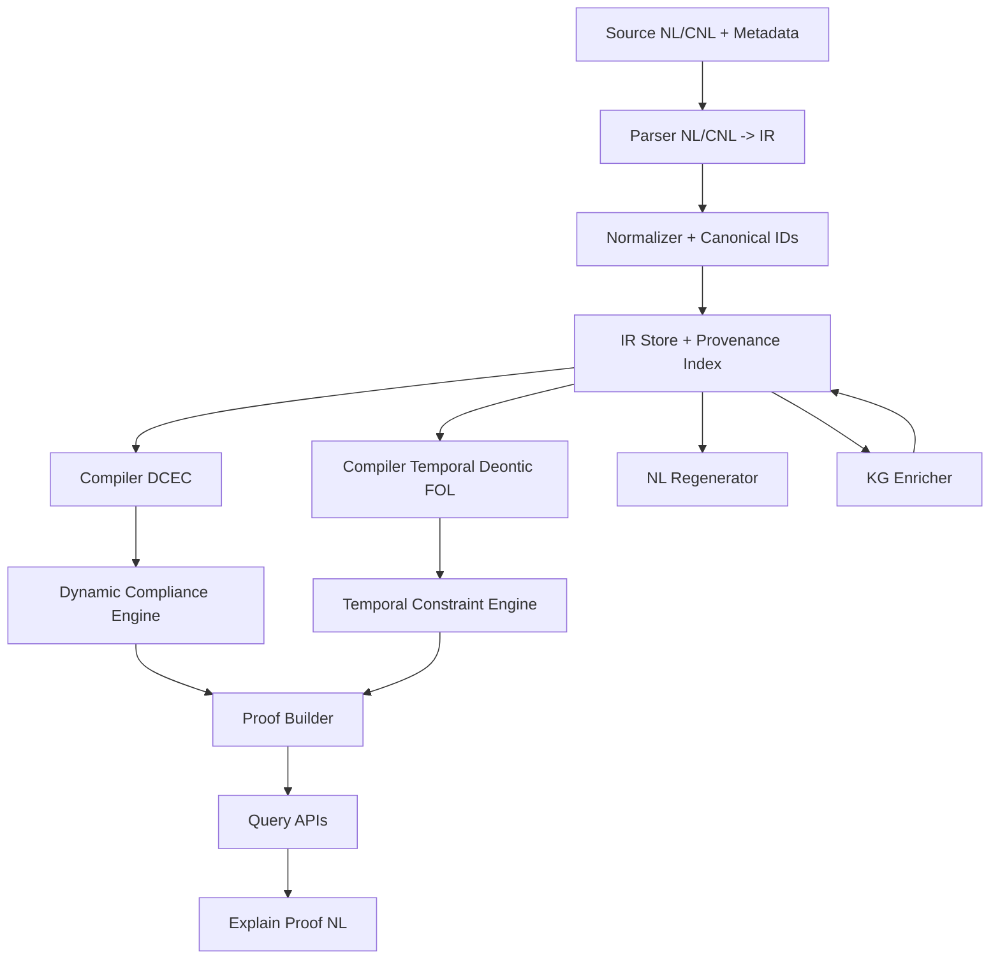

# Hybrid Legal Reasoning Improvement Plan

## 1) Goal and Scope

This plan defines how to integrate:
- IR schema (typed frames with canonical IDs),
- CNL parsing and regeneration,
- Optimizers (quality, semantic, retry),
- Knowledge graph enrichment,
- Theorem provers,
- Hybrid reasoner APIs and proof tracing.

Target outcomes:
- Stable, composable IR for legal norms and events,
- Deterministic NL -> IR -> logic compilers,
- Verifiable compliance and violation reasoning,
- Proof objects that map to IR IDs and source provenance,
- Round-trip CNL/NL reconstruction with bounded semantic drift.

---

## 2) Design Principles

1. Frames are first-class terms with named slots (`agent`, `patient`, `recipient`, `instrument`, `time`, `jurisdiction`).
2. Deontic operators wrap frame references, not raw predicate argument positions.
3. Temporal constraints are separate attachable objects.
4. Canonical IDs are deterministic and stable across pipelines.
5. Compilers are modular (`IR -> DCEC`, `IR -> Temporal Deontic FOL`, `IR -> NL`).
6. Proof traces are IR-native and source-linked.
7. Optimizers never mutate source provenance; they only propose scored IR/logic improvements.

---

## 3) Improvement Roadmap

## Phase 0: Contract Stabilization
- Freeze IR schema version `ir_version=1.0`.
- Freeze CNL template set `cnl_version=1.0`.
- Add compatibility tests for legacy JSONL and hybrid IR outputs.

Exit criteria:
- Backward-compatible load for existing `logic.hybrid.jsonld` artifacts.

## Phase 1: NL/CNL Front-End Hardening
- Add strict CNL parser mode with deterministic parse trees.
- Add ambiguity detector with ranked alternatives.
- Add parser confidence field per norm/frame.

Exit criteria:
- >= 95% deterministic parse for CNL corpus.

## Phase 2: Normalization and Canonicalization
- Canonical role mapping (`subject -> agent`, `object -> patient`).
- Canonical predicate naming policy (`Act_<hash>` option).
- Temporal normalization (`within 30 days`, `by 2026-05-01`, `after event`).

Exit criteria:
- Stable canonical IDs across repeated parse runs.

## Phase 3: Compiler and Proof Layer
- Compiler A: IR -> DCEC/Event Calculus formulas.
- Compiler B: IR -> Temporal Deontic FOL formulas.
- Add bidirectional provenance maps (`formula_id -> ir_id[] -> source_span`).

Exit criteria:
- Each compiled formula references at least one IR object ID.

## Phase 4: Optimizers and KG Integration
- Plug in optimizer pipeline:
  - focused retry optimizer,
  - encoder quality retry,
  - fragment merge optimizer,
  - semantic drift guard.
- Plug in KG enricher:
  - entity linking,
  - ontology type completion,
  - relation candidate enrichment.

Exit criteria:
- Quality gain without semantic floor regressions.

## Phase 5: Theorem Prover Integration
- Add theorem prover adapter interface (`ProverBackend`).
- Support at least two backends (example: Z3 + first-order prover).
- Store proof certificates in normalized proof object format.

Exit criteria:
- Reproducible proof replay on fixed snapshots.

## Phase 6: Production Query APIs
- Compliance, violation, exception, deadline, and conflict services.
- Explainable proof API with NL reconstruction.

Exit criteria:
- Query SLAs and deterministic proof IDs on replay.

---

## 4) Hybrid IR Grammar (Near-EBNF)

```ebnf
IRDocument       = "IR" "{" MetaBlock EntityBlock FrameBlock TemporalBlock NormBlock RuleBlock QueryBlock "}" ;
MetaBlock        = "meta" ":" "{" "ir_version" ":" String "," "jurisdiction" ":" String "," "clock" ":" String "}" ;
EntityBlock      = "entities" ":" "[" { Entity } "]" ;
FrameBlock       = "frames" ":" "[" { Frame } "]" ;
TemporalBlock    = "temporals" ":" "[" { TemporalConstraint } "]" ;
NormBlock        = "norms" ":" "[" { Norm } "]" ;
RuleBlock        = "rules" ":" "[" { Rule } "]" ;
QueryBlock       = "queries" ":" "[" { Query } "]" ;

Entity           = "{" "id" ":" CanonicalId "," "type" ":" TypeName "," "attrs" ":" Object "}" ;
Frame            = ActionFrame | EventFrame | StateFrame ;
ActionFrame      = "{" "id" ":" CanonicalId "," "kind" ":" "action" "," "verb" ":" String "," "roles" ":" Roles "," "attrs" ":" Object "}" ;
EventFrame       = "{" "id" ":" CanonicalId "," "kind" ":" "event" "," "event_type" ":" String "," "roles" ":" Roles "," "attrs" ":" Object "}" ;
StateFrame       = "{" "id" ":" CanonicalId "," "kind" ":" "state" "," "state_type" ":" String "," "roles" ":" Roles "," "attrs" ":" Object "}" ;
Roles            = "{" { RoleName ":" EntityRef } "}" ;

TemporalConstraint = "{" "id" ":" CanonicalId "," "relation" ":" TemporalRel "," "expr" ":" TemporalExpr "," "anchor" ":" RefOrNull "}" ;
TemporalExpr     = "{" "kind" ":" ("point"|"interval"|"deadline"|"window") ["," "start" ":" Time] ["," "end" ":" Time] ["," "duration" ":" Duration] "}" ;

Norm             = "{" "id" ":" CanonicalId "," "op" ":" ("O"|"P"|"F") "," "target_frame" ":" FrameRef "," "activation" ":" Condition "," "exceptions" ":" "[" { Condition } "]" "," "temporal_ref" ":" RefOrNull "}" ;
Rule             = "{" "id" ":" CanonicalId "," "antecedent" ":" Condition "," "consequent" ":" Atom "," "mode" ":" ("strict"|"defeasible") "}" ;
Query            = "{" "id" ":" CanonicalId "," "goal" ":" Condition "," "at" ":" RefOrNull "}" ;

Condition        = AtomCond | AndCond | OrCond | NotCond | ExistsCond | ForallCond ;
AtomCond         = "{" "op" ":" "atom" "," "pred" ":" PredName "," "args" ":" "[" { Term } "]" "}" ;
AndCond          = "{" "op" ":" "and" "," "children" ":" "[" { Condition } "]" "}" ;
OrCond           = "{" "op" ":" "or" "," "children" ":" "[" { Condition } "]" "}" ;
NotCond          = "{" "op" ":" "not" "," "child" ":" Condition "}" ;
ExistsCond       = "{" "op" ":" "exists" "," "var" ":" String "," "type" ":" TypeName "," "child" ":" Condition "}" ;
ForallCond       = "{" "op" ":" "forall" "," "var" ":" String "," "type" ":" TypeName "," "child" ":" Condition "}" ;
```

---

## 5) Python Dataclass Model

```python
from dataclasses import dataclass, field
from enum import Enum
from typing import Any, Dict, List, Optional

class DeonticOp(str, Enum):
    O = "O"  # obligation
    P = "P"  # permission
    F = "F"  # prohibition

class FrameKind(str, Enum):
    ACTION = "action"
    EVENT = "event"
    STATE = "state"

class TemporalRelation(str, Enum):
    BEFORE = "before"
    AFTER = "after"
    DURING = "during"
    WITHIN = "within"
    BY = "by"

@dataclass(frozen=True)
class CanonicalId:
    namespace: str
    value: str

    def ref(self) -> str:
        return f"{self.namespace}:{self.value}"

@dataclass
class Entity:
    id: CanonicalId
    type_name: str
    attrs: Dict[str, Any] = field(default_factory=dict)

@dataclass
class TemporalExpr:
    kind: str
    start: Optional[str] = None
    end: Optional[str] = None
    duration: Optional[str] = None

@dataclass
class TemporalConstraint:
    id: CanonicalId
    relation: TemporalRelation
    expr: TemporalExpr
    anchor_ref: Optional[str] = None
    attrs: Dict[str, Any] = field(default_factory=dict)

@dataclass
class BaseFrame:
    id: CanonicalId
    kind: FrameKind
    roles: Dict[str, str] = field(default_factory=dict)
    jurisdiction: Optional[str] = None
    source_span: Optional[str] = None
    attrs: Dict[str, Any] = field(default_factory=dict)

@dataclass
class ActionFrame(BaseFrame):
    verb: str = ""

@dataclass
class EventFrame(BaseFrame):
    event_type: str = ""

@dataclass
class StateFrame(BaseFrame):
    state_type: str = ""

@dataclass
class Atom:
    pred: str
    args: List[str] = field(default_factory=list)

@dataclass
class Condition:
    op: str
    atom: Optional[Atom] = None
    children: List["Condition"] = field(default_factory=list)
    var: Optional[str] = None
    var_type: Optional[str] = None

@dataclass
class Norm:
    id: CanonicalId
    op: DeonticOp
    target_frame_ref: str
    activation: Condition
    exceptions: List[Condition] = field(default_factory=list)
    temporal_ref: Optional[str] = None
    priority: int = 0
    jurisdiction: Optional[str] = None
    attrs: Dict[str, Any] = field(default_factory=dict)

@dataclass
class Rule:
    id: CanonicalId
    antecedent: Condition
    consequent: Atom
    mode: str = "strict"

@dataclass
class Query:
    id: CanonicalId
    goal: Condition
    at: Optional[str] = None

@dataclass
class LegalIR:
    ir_version: str = "1.0"
    jurisdiction: str = "default"
    clock: str = "discrete"
    entities: Dict[str, Entity] = field(default_factory=dict)
    frames: Dict[str, BaseFrame] = field(default_factory=dict)
    temporals: Dict[str, TemporalConstraint] = field(default_factory=dict)
    norms: Dict[str, Norm] = field(default_factory=dict)
    rules: Dict[str, Rule] = field(default_factory=dict)
    queries: Dict[str, Query] = field(default_factory=dict)
```

---

## 6) Controlled Natural Language (CNL)

## 6.1 Syntax Templates

### Norm templates
1. `Under <jurisdiction>, <agent> shall <action> [<object>] [<temporal>] [<activation>] [<exception>].`
2. `Under <jurisdiction>, <agent> may <action> [<object>] [<temporal>] [<activation>] [<exception>].`
3. `Under <jurisdiction>, <agent> shall not <action> [<object>] [<temporal>] [<activation>] [<exception>].`

### Definition templates
4. `Definition: <term> means <definition_body>.`
5. `Definition: <term> includes <item_list>.`

### Temporal templates
6. `within <n> <time_unit>`
7. `by <datetime_or_date>`
8. `before <event_ref>`
9. `after <event_ref>`

### Activation/exception templates
10. `if <condition_clause>`
11. `when <condition_clause>`
12. `unless <exception_clause>`
13. `except when <exception_clause>`

## 6.2 CNL Grammar (Near-EBNF)

```ebnf
NormSentence   = "Under" Jurisdiction "," Agent Modal VerbPhrase [Temporal] [Activation] [Exception] "." ;
Modal          = "shall" | "may" | "shall not" ;
VerbPhrase     = Verb [ObjectPhrase] [RecipientPhrase] ;
Temporal       = "within" Number TimeUnit | "by" TimePoint | "before" EventRef | "after" EventRef ;
Activation     = "if" Clause | "when" Clause ;
Exception      = "unless" Clause | "except when" Clause ;
DefinitionStmt = "Definition:" Term ("means" DefBody | "includes" ItemList) "." ;
```

---

## 7) Semantic Conversion Table

| CNL template | IR mapping | DCEC mapping | Temporal Deontic FOL mapping |
|---|---|---|---|
| `<A> shall <act>` | `Norm(op=O, target=ActionFrame(agent=A,...))` | `HoldsAt(Obligated(frame_ref), t) :- activation.` | `forall t. activation -> O_t(Act_frame(A,...,t)).` |
| `<A> may <act>` | `Norm(op=P, ...)` | `HoldsAt(Permitted(frame_ref), t) :- activation.` | `forall t. activation -> P_t(Act_frame(A,...,t)).` |
| `<A> shall not <act>` | `Norm(op=F, ...)` | `HoldsAt(Forbidden(frame_ref), t) :- activation.` | `forall t. activation -> F_t(Act_frame(A,...,t)).` |
| `within 30 days` | `TemporalConstraint(relation=WITHIN,duration=P30D)` linked from norm | `TemporalGuard(tmp_ref, t)` | `Within(t, anchor, P30D)` |
| `by 2026-06-01` | `TemporalConstraint(relation=BY, expr.deadline)` | `Deadline(tmp_ref, t)` | `t <= deadline` |
| `if clause` | `activation=Condition(atom=clause)` | antecedent in rule body | antecedent in implication |
| `unless clause` | `exceptions=[Condition(atom=clause)]` | `not(exception_clause)` in rule body | `and not exception_clause` |
| `Definition: X means Y` | `Rule(antecedent, consequent)` or type axiom frame | supporting axioms for theorem proving | `forall x. X(x) -> Y(x)` |

---

## 8) Example Lexicon

### Frame types
- `FilingAction`, `PaymentAction`, `NotificationAction`, `InspectionEvent`, `LicenseState`

### Roles
- `agent`, `patient`, `recipient`, `instrument`, `authority`, `beneficiary`

### Modal qualifiers
- `shall -> O`, `may -> P`, `shall not -> F`

### Temporal qualifiers
- `within`, `by`, `before`, `after`, `during`, `until`

### Jurisdictions
- `Federal`, `State:<code>`, `Agency:<name>`

---

## 9) Implementation Sketches

## 9.1 Parser: NL/CNL -> IR

```text
function parse_sentence_to_ir(sentence, jurisdiction):
  tokens = tokenize(sentence)
  parse = parse_with_cnl_grammar(tokens)
  if parse.ambiguous:
    rank alternatives by confidence
  modal = detect_modal(parse)
  frame = build_typed_frame(parse.verb_phrase, parse.roles)
  temporal = build_temporal_constraint(parse.temporal)
  activation = build_condition(parse.activation)
  exceptions = build_exception_list(parse.exception)
  assign deterministic IDs to entity/frame/norm/temporal
  return LegalIR with inserted objects
```

## 9.2 Normalizer: canonicalization

```text
function normalize_ir(ir):
  map role aliases: subject->agent, object->patient
  normalize verb lemmas and action labels
  normalize temporal units to ISO-8601 durations
  canonicalize jurisdiction labels
  recompute derived canonical predicate aliases (optional)
  validate references and type constraints
  return normalized ir
```

## 9.3 Compiler1: IR -> DCEC

```text
function compile_to_dcec(ir):
  formulas = []
  for norm in ir.norms:
    frame_ref = norm.target_frame_ref
    act = to_dcec_condition(norm.activation)
    exc = conjunction_not(norm.exceptions)
    tguard = temporal_guard(norm.temporal_ref)
    modal_term = map_modal(norm.op, frame_ref)
    formulas.append("HoldsAt(" + modal_term + ", t) :- " + act + ", " + exc + ", " + tguard + ".")
  for event/frame dynamics rules:
    emit Happens/Initiates/Terminates/HoldsAt formulas
  return formulas
```

## 9.4 Compiler2: IR -> Temporal Deontic FOL

```text
function compile_to_td_fol(ir):
  formulas = []
  for norm in ir.norms:
    pred = frame_to_symbol(norm.target_frame_ref)
    act = to_fol_condition(norm.activation)
    exc = to_fol_exceptions(norm.exceptions)
    tguard = to_fol_temporal(norm.temporal_ref)
    formulas.append("forall t. (" + act + " and " + tguard + " and not(" + exc + ")) -> " + norm.op + "_t(" + pred + ").")
  return formulas
```

---

## 10) Reasoner Architecture

## 10.1 Workflow Diagram



## 10.2 Query Handling Pseudocode

```text
function handle_query(query, time_context):
  ir_snapshot = load_ir_snapshot(query.kb_id)
  dcec_formulas = compile_to_dcec(ir_snapshot)
  tdfol_formulas = compile_to_td_fol(ir_snapshot)

  if query.type == "compliance":
    result = dcec_engine.check(query, dcec_formulas, time_context)
  elif query.type == "violations":
    result = dcec_engine.find_violations(query, dcec_formulas, time_context)
  elif query.type == "deadlines":
    result = temporal_engine.evaluate(query, tdfol_formulas, time_context)
  elif query.type == "conflicts":
    result = detect_modal_conflicts(ir_snapshot, query, time_context)
  else:
    result = generic_engine.answer(query)

  proof = build_proof_object(result, ir_snapshot)
  proof_id = persist_proof(proof)
  return attach_proof_id(result, proof_id)
```

## 10.3 API Signatures

```python
def check_compliance(query: dict, time_context: str) -> dict:
    """Returns status, triggered norms, exceptions, deadlines, conflicts, proof_id."""


def find_violations(state: dict, time_range: tuple[str, str]) -> dict:
    """Returns violation list, severity, norm refs, temporal windows, proof_id."""


def explain_proof(proof_id: str, format: str = "nl") -> dict:
    """Returns proof steps with IR refs, source provenance, and NL reconstruction."""
```

## 10.4 Proof Object Skeleton

```json
{
  "proof_id": "prf:6e1b9d4a",
  "query_type": "check_compliance",
  "result": "non_compliant",
  "steps": [
    {
      "rule": "norm_activation",
      "ir_refs": ["nrm:ab12", "frm:cd34", "tmp:ef56"],
      "formula_refs": ["dcec:f102", "tdfol:g77"],
      "provenance": {
        "source_path": "data/federal_laws/us_constitution.jsonld",
        "source_id": "root.article1.seg3",
        "source_span": "chars:1200-1304"
      }
    }
  ]
}
```

---

## 11) Five Detailed Example Transformations

## Example 1
- Original sentence:
  `Under Federal, Employer shall pay wages within 30 days.`
- IR (compact):
  `Norm(O, target=frm:pay_wages, temporal=tmp:within_30d)`
- DCEC:
  `HoldsAt(Obligated(frm:pay_wages), t) :- true, TemporalGuard(tmp:within_30d, t).`
- Temporal Deontic FOL:
  `forall t. Within(t, T0, P30D) -> O_t(Act_pay_wages(ent:employer, ent:wages, t)).`
- Round-trip NL:
  `Under Federal, Employer shall pay wages within 30 days.`

## Example 2
- Original sentence:
  `Under Federal, Employer shall not disclose medical data unless court order exists.`
- IR:
  `Norm(F, target=frm:disclose_medical_data, exceptions=[court_order_exists])`
- DCEC:
  `HoldsAt(Forbidden(frm:disclose_medical_data), t) :- true, not(court_order_exists).`
- Temporal Deontic FOL:
  `forall t. (true and not(court_order_exists)) -> F_t(Act_disclose_medical_data(ent:employer, ent:medical_data, t)).`
- Round-trip NL:
  `Under Federal, Employer shall not disclose medical data unless court order exists.`

## Example 3
- Original sentence:
  `Under State:CA, Agency may suspend license after inspection_event.`
- IR:
  `Norm(P, target=frm:suspend_license, temporal=tmp:after_inspection_event)`
- DCEC:
  `HoldsAt(Permitted(frm:suspend_license), t) :- Happens(ev:inspection_event, t0), t > t0.`
- Temporal Deontic FOL:
  `forall t. After(t, ev:inspection_event) -> P_t(Act_suspend_license(ent:agency, ent:license, t)).`
- Round-trip NL:
  `Under State:CA, Agency may suspend license after inspection event.`

## Example 4
- Original sentence:
  `Under Federal, Contractor shall file report by 2026-06-01 if contract_active.`
- IR:
  `Norm(O, target=frm:file_report, activation=contract_active, temporal=tmp:deadline_2026_06_01)`
- DCEC:
  `HoldsAt(Obligated(frm:file_report), t) :- contract_active, Deadline(tmp:deadline_2026_06_01, t).`
- Temporal Deontic FOL:
  `forall t. (contract_active and t <= 2026-06-01) -> O_t(Act_file_report(ent:contractor, ent:report, t)).`
- Round-trip NL:
  `Under Federal, Contractor shall file report by 2026-06-01 if contract active.`

## Example 5
- Original sentence:
  `Under State:NY, Bank shall notify customer within 72 hours when breach_detected.`
- IR:
  `Norm(O, target=frm:notify_customer, activation=breach_detected, temporal=tmp:within_72h)`
- DCEC:
  `HoldsAt(Obligated(frm:notify_customer), t) :- breach_detected, TemporalGuard(tmp:within_72h, t).`
- Temporal Deontic FOL:
  `forall t. (breach_detected and Within(t, t_breach, PT72H)) -> O_t(Act_notify_customer(ent:bank, ent:customer, t)).`
- Round-trip NL:
  `Under State:NY, Bank shall notify customer within 72 hours when breach detected.`

---

## 12) Ten CNL -> IR -> DCEC -> NL Chains

1. CNL: `Under Federal, Employer shall pay wages within 30 days.`
   IR: `Norm(O, frm:pay_wages, tmp:within_30d)`
   DCEC: `HoldsAt(Obligated(frm:pay_wages), t) :- TemporalGuard(tmp:within_30d, t).`
   NL: `Employer shall pay wages within 30 days.`

2. CNL: `Under Federal, Employer shall not disclose medical data unless court order exists.`
   IR: `Norm(F, frm:disclose_medical_data, exc=[court_order_exists])`
   DCEC: `HoldsAt(Forbidden(frm:disclose_medical_data), t) :- not(court_order_exists).`
   NL: `Employer is forbidden to disclose medical data unless court order exists.`

3. CNL: `Under State:CA, Agency may suspend license after inspection_event.`
   IR: `Norm(P, frm:suspend_license, tmp:after_inspection_event)`
   DCEC: `HoldsAt(Permitted(frm:suspend_license), t) :- After(t, inspection_event).`
   NL: `Agency may suspend license after inspection event.`

4. CNL: `Under Federal, Contractor shall file report by 2026-06-01 if contract_active.`
   IR: `Norm(O, frm:file_report, act=contract_active, tmp:deadline_2026_06_01)`
   DCEC: `HoldsAt(Obligated(frm:file_report), t) :- contract_active, Deadline(tmp:deadline_2026_06_01, t).`
   NL: `Contractor shall file report by 2026-06-01 if contract active.`

5. CNL: `Under State:NY, Bank shall notify customer within 72 hours when breach_detected.`
   IR: `Norm(O, frm:notify_customer, act=breach_detected, tmp:within_72h)`
   DCEC: `HoldsAt(Obligated(frm:notify_customer), t) :- breach_detected, TemporalGuard(tmp:within_72h, t).`
   NL: `Bank shall notify customer within 72 hours when breach detected.`

6. CNL: `Under Federal, Importer shall retain records for 5 years.`
   IR: `Norm(O, frm:retain_records, tmp:duration_5y)`
   DCEC: `HoldsAt(Obligated(frm:retain_records), t) :- Duration(tmp:duration_5y, t).`
   NL: `Importer shall retain records for 5 years.`

7. CNL: `Under State:TX, Driver shall stop vehicle before school_zone.`
   IR: `Norm(O, frm:stop_vehicle, tmp:before_school_zone)`
   DCEC: `HoldsAt(Obligated(frm:stop_vehicle), t) :- Before(t, ev:school_zone).`
   NL: `Driver shall stop vehicle before school zone.`

8. CNL: `Under Federal, Provider may disclose data if consent_valid.`
   IR: `Norm(P, frm:disclose_data, act=consent_valid)`
   DCEC: `HoldsAt(Permitted(frm:disclose_data), t) :- consent_valid.`
   NL: `Provider may disclose data if consent is valid.`

9. CNL: `Under State:WA, Seller shall refund buyer within 14 days unless fraud_investigation.`
   IR: `Norm(O, frm:refund_buyer, tmp:within_14d, exc=[fraud_investigation])`
   DCEC: `HoldsAt(Obligated(frm:refund_buyer), t) :- TemporalGuard(tmp:within_14d, t), not(fraud_investigation).`
   NL: `Seller shall refund buyer within 14 days unless fraud investigation applies.`

10. CNL: `Under Agency:EPA, Facility shall not emit pollutant above limit when permit_active.`
    IR: `Norm(F, frm:emit_pollutant_above_limit, act=permit_active)`
    DCEC: `HoldsAt(Forbidden(frm:emit_pollutant_above_limit), t) :- permit_active.`
    NL: `Facility is forbidden from emissions above limit when permit is active.`

---

## 13) Round-Trip NL Regeneration Rules

1. Recover template from norm op (`O/P/F`) and frame kind.
2. Realize frame roles in canonical order: `agent`, `verb`, `patient`, `recipient`, optional adjuncts.
3. Render activation as `if` or `when` clause.
4. Render exception as `unless` clause.
5. Render temporal object with canonical formatter (`within PT72H`, `by 2026-06-01`, etc.).
6. Preserve jurisdiction prefix where required.
7. Apply paraphrase profile only after deterministic canonical rendering.

---

## 14) Reasoning APIs and Proof Obligations

Proof obligations per query:
1. Norm activation proof (`activation true at t`).
2. Temporal admissibility proof (`within/by/before/after satisfied`).
3. Exception discharge proof (`no exception` or `exception applies`).
4. Modal conflict proof (`O(frame)` and `F(frame)` overlap) when conflicts exist.
5. Provenance proof (all decisive steps map to `ir_refs` and source spans).

---

## 15) Test Set with 8 Queries and Example Proof Outcomes

1. `check_compliance` wages paid at day 20 -> expected `compliant`.
2. `check_compliance` wages unpaid at day 40 -> expected `violation`.
3. `check_compliance` medical disclosure with no court order -> expected `violation`.
4. `check_compliance` medical disclosure with court order -> expected `exception_applied`.
5. `find_violations` breach notification after 96h -> expected violation list includes `notify_customer`.
6. `find_violations` file report before deadline -> expected empty violation list.
7. `check_compliance` overlapping O/F on same frame/time -> expected `conflict_detected`.
8. `explain_proof` for prior violation -> expected NL explanation with IR and source references.

Example proof summary record:
- `proof_id=prf:viol_wages_40d`
- `steps=[activation_true, deadline_passed, event_missing, violation_asserted]`
- `ir_refs=[nrm:pay_wages, frm:pay_wages, tmp:within_30d]`
- `source_refs=[root.articleX.segY]`

---

## 16) Integration Hooks for Optimizers, KG, and Theorem Provers

## 16.1 Optimizer hooks
- `post_parse_optimizer(ir)`
- `post_compile_optimizer(formulas, ir)`
- `semantic_guard(candidate, baseline)`
- `accept_if(score_gain >= threshold and floor_pass)`

## 16.2 KG hooks
- `kg_link_entities(ir.entities)`
- `kg_enrich_relations(ir.frames)`
- `kg_emit_constraints(ir.rules)`

## 16.3 Theorem prover hooks
- `prove(formula_set, conjecture, backend="z3"|"fol")`
- `extract_certificate(proof)`
- `map_certificate_to_ir_refs(certificate, formula_index)`

---

## 17) Delivery Checklist

- [ ] Freeze IR + CNL versions.
- [ ] Add CNL parser ambiguity tests.
- [ ] Add canonicalization snapshot tests.
- [ ] Add DCEC and TDFOL compiler parity tests.
- [ ] Add KG enrichment validation tests.
- [ ] Add theorem prover replay tests.
- [ ] Add API contract tests for 8 query scenarios.
- [ ] Add proof-to-NL reconstruction tests.

This plan provides the implementation contract for hooking optimizers, knowledge graph modules, and theorem provers into IR, CNL, and the hybrid reasoner architecture while preserving traceability and composability.

Working tracker:
- `ipfs_datasets_py/docs/guides/legal_data/HYBRID_LEGAL_REASONING_TODO.md`

Document usage:
- This file defines architecture, milestones, quality gates, and rollout governance.
- The TODO file defines sprint-executable work items and current status.

---

## 18) Repository and Module Mapping

Use this mapping to implement the plan without creating duplicate logic paths.

Core package targets:
- `ipfs_datasets_py/ipfs_datasets_py/processors/legal_data/reasoner/`
  - IR dataclasses and serialization contracts,
  - parser/normalizer/compiler modules,
  - proof object model,
  - reasoner query orchestration.
- `ipfs_datasets_py/scripts/ops/legal_data/`
  - integration benchmarks,
  - optimizer toggles,
  - report generation and diagnostics.
- `ipfs_datasets_py/tests/`
  - parser determinism,
  - compiler parity,
  - proof replay,
  - query API contracts.

Compatibility surface (kept thin, no core logic):
- `scripts/ops/*.py` and `scripts/ops/*.sh` wrappers in workspace root.
- `docs/*.md` pointer stubs in workspace root.

Non-goal:
- Reintroducing legal-reasoner implementation in `src/municipal_scrape_workspace/reasoner`.

---

## 19) Milestones and Timeboxes

Assume two-week iterations.

M1 (Weeks 1-2): Contract Freeze
- Deliverables:
  - IR schema version lock,
  - CNL grammar lock,
  - migration and backward-compat fixtures.
- Exit gate:
  - 100% passing schema compatibility tests.

M2 (Weeks 3-4): Parser and Normalizer Hardening
- Deliverables:
  - strict CNL parse mode,
  - ambiguity ranking,
  - deterministic canonical ID behavior.
- Exit gate:
  - parser determinism >= 95% on curated CNL corpus.

M3 (Weeks 5-6): Compiler and Proof Trace
- Deliverables:
  - DCEC compiler + TDFOL compiler,
  - formula-to-IR and IR-to-source provenance links.
- Exit gate:
  - every compiled formula has traceable IR references.

M4 (Weeks 7-8): Optimizer + KG Integration
- Deliverables:
  - optimizer acceptance policy,
  - KG enrichment adapters,
  - semantic floor guard enforcement.
- Exit gate:
  - quality gains with zero floor regressions on benchmark set.

M5 (Weeks 9-10): Prover Backends + Query APIs
- Deliverables:
  - theorem backend adapter and at least two backends,
  - compliance/violation/explain endpoints,
  - proof replay and explainability tests.
- Exit gate:
  - deterministic proof IDs on replay for fixed snapshots.

---

## 20) Engineering Backlog (Issue-Ready)

EPIC A: IR and CNL Contracts
1. Add `ir_version` and `cnl_version` validators.
2. Add deterministic canonical ID utility shared across parser/compiler.
3. Add CNL parse tree serializer for reproducibility.

EPIC B: Compiler and Logic Output
4. Implement DCEC compiler with EC primitive emission policy.
5. Implement Temporal Deontic FOL compiler with quantifier normalization.
6. Add compiler parity tests with golden fixtures.

EPIC C: Proof and Explainability
7. Introduce `ProofObject` schema with provenance references.
8. Add proof replay endpoint and deterministic hash policy.
9. Add NL explanation renderer from proof + IR references.

EPIC D: Optimizers and KG
10. Add optimizer chain orchestration and acceptance policy.
11. Add KG enricher adapter with confidence annotations.
12. Add semantic drift guard and modality-specific floor checks.

EPIC E: Reasoner APIs
13. Implement `check_compliance` with conflict handling.
14. Implement `find_violations` with time-window filters.
15. Implement `explain_proof` with `nl` and `json` formats.

---

## 21) Acceptance Metrics and Quality Gates

Functional gates:
- CNL determinism: >= 95%.
- Canonical ID stability: 100% across repeated runs.
- Formula traceability: 100% of formulas reference IR IDs.
- Proof provenance completeness: 100% of proof steps include source references.

Reasoning quality gates:
- Compliance/violation API pass rate on gold test set: >= 98%.
- Conflict detection precision: >= 95%.
- Deadline reasoning accuracy: >= 97%.

Optimization safety gates:
- Semantic floor regression count: 0 on release candidates.
- Accepted optimizer proposals must improve configured objective or tie with lower complexity.

Operational gates:
- P95 query latency target (snapshot-local): <= 500 ms for medium-sized legal KB.
- Proof explain generation latency target: <= 800 ms for typical proofs.

---

## 22) Risks and Mitigations

Risk: CNL ambiguity causes non-deterministic parse trees.
- Mitigation: strict grammar mode, ranked alternatives, confidence thresholds, and fail-closed policy for low confidence.

Risk: Optimizers overfit lexical overlap and degrade legal semantics.
- Mitigation: modality-aware semantic floors, theorem consistency checks, and provenance-preserving acceptance policy.

Risk: KG enrichment introduces noisy entities/relations.
- Mitigation: confidence-scored insertion, reversible enrichment layer, and audit logs of injected triples.

Risk: Proof IDs drift after minor refactors.
- Mitigation: stable canonical hashing over normalized proof steps and versioned hash policy.

Risk: Divergence between DCEC and TDFOL compilers.
- Mitigation: parity fixtures, dual-compiler consistency checks, and differential test reports.

---

## 23) Detailed 8-Query Test Matrix

| Query ID | API | Scenario | Expected Status | Required Proof Steps |
|---|---|---|---|---|
| Q1 | `check_compliance` | wages paid day 20 within 30-day window | `compliant` | activation, temporal_guard_pass, event_observed |
| Q2 | `check_compliance` | wages unpaid day 40 | `violation` | activation, deadline_passed, required_event_missing |
| Q3 | `check_compliance` | medical disclosure without court order | `violation` | activation, exception_not_satisfied, forbidden_event_observed |
| Q4 | `check_compliance` | medical disclosure with court order | `exception_applied` | activation, exception_satisfied, prohibition_discharged |
| Q5 | `find_violations` | breach notified after 96h | `violation_found` | activation, within_window_failed, event_late |
| Q6 | `find_violations` | report filed before deadline | `no_violation` | activation, deadline_guard_pass, event_observed |
| Q7 | `check_compliance` | simultaneous O/F on same frame and interval | `conflict_detected` | obligation_active, prohibition_active, scope_overlap |
| Q8 | `explain_proof` | explain Q2 proof | `explanation_ready` | proof_load, provenance_expand, nl_regeneration |

Required output fields for all query responses:
- `status`
- `proof_id`
- `ir_refs`
- `source_refs`
- `time_context`
- `conflicts` (possibly empty)

---

## 24) Rollout and Governance

Rollout strategy:
1. Shadow mode: run hybrid reasoner in parallel with current pipeline and compare outputs.
2. Canary mode: route low-risk query classes to hybrid APIs.
3. General availability: expand to all supported legal query classes after gates pass.

Governance:
- Versioning: semantic versioning for IR and CNL specs.
- Change control: RFC required for grammar or proof schema changes.
- Auditability: immutable run manifests for benchmark and release candidates.

Definition of done for this program:
- All milestones completed,
- All quality gates green,
- Query API docs and proof schema published,
- On-call runbook updated for optimizer/KG/prover toggles.
