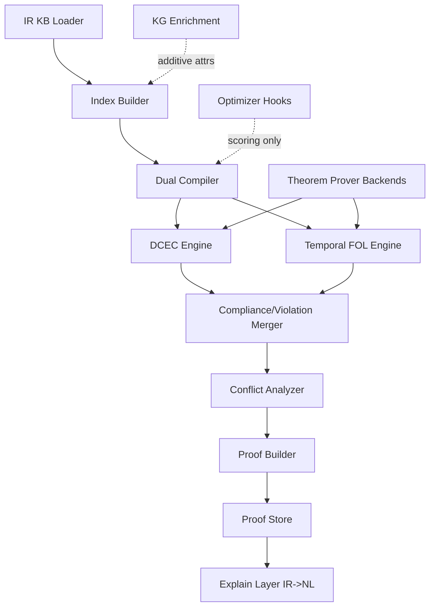

# Hybrid Legal V2 Optimizer/KG/Prover Integration Plan

## 1. Purpose

This plan defines a package-local implementation path for a hybrid legal representation system that combines:
- F-logic style typed frames,
- first-order conditions,
- deontic operators (`O`, `P`, `F`),
- temporal deontic logic,
- DCEC/Event Calculus dynamics,
- optimizer hooks,
- knowledge graph enrichment,
- theorem prover backends.

All implementation targets are inside `ipfs_datasets_py`.

## 2. Scope and Package Boundaries

Code paths:
- `ipfs_datasets_py/ipfs_datasets_py/processors/legal_data/reasoner/`
- `ipfs_datasets_py/ipfs_datasets_py/processors/legal_data/`

Docs paths:
- `ipfs_datasets_py/docs/guides/legal_data/`

Out of scope for this phase:
- root-level wrappers,
- root-level docs beyond compatibility pointers,
- moving any `data/state_laws/*` artifacts.

## 3. Integration Objectives

1. Keep frames as first-class typed objects with named slots.
2. Keep deontic wrappers external to predicate argument position.
3. Keep temporal constraints as attachable independent objects.
4. Preserve canonical IDs and source provenance through all transforms.
5. Support IR -> DCEC, IR -> Temporal Deontic FOL, and IR -> CNL/NL.
6. Add optimizer/KG/prover hooks without changing IR semantics.
7. Return proof objects traceable to IR IDs and source sentence IDs.

## 4. Hooking Strategy (Optimizers, KG, Provers)

### 4.1 Optimizer Hook Points

- `parse_cnl_to_ir`: optional parse candidate reranking.
- `normalize_ir`: slot canonicalization quality scoring and no-op gating.
- `compile_ir_to_dcec` and `compile_ir_to_tdfol`: expression simplification and quantifier normalization.
- `reasoner query path`: selective fast-path planning only (no semantic mutation).

Contract:
- Optimizer output must include `semantic_equivalence_assertion` and `drift_score`.
- Reject optimizer changes when `drift_score > configured_threshold`.

### 4.2 Knowledge Graph Hook Points

- Entity linking after parse (`entity_ref -> KG node`).
- Role enrichment in normalization (`agent`, `recipient`, `patient` typing).
- Conflict diagnostics in reasoner (`obligation target` and `prohibition target` ontology overlap).

Contract:
- KG enrichment writes additive metadata in frame/entity attrs.
- Never rewrites source frame IDs.

### 4.3 Theorem Prover Hook Points

- DCEC proof obligation checks.
- Temporal FOL satisfiability and contradiction checks.
- Cross-compiler parity checks (DCEC entailment implies TDFOL obligations under mapping assumptions).

Contract:
- Prover result must include solver name, theory fragment, assumptions, and proof object references.

## 5. IR Grammar (Near-EBNF)

```ebnf
IRDocument      = "IR" "{" Meta Entities Frames Temporals Norms Rules Provenance "}" ;
Meta            = "meta" ":" "{" "ir_version" ":" String "," "cnl_version" ":" String ","
                  "jurisdiction" ":" String "," "clock" ":" String "}" ;
Entities        = "entities" ":" "[" { Entity } "]" ;
Frames          = "frames" ":" "[" { Frame } "]" ;
Temporals       = "temporals" ":" "[" { TemporalConstraint } "]" ;
Norms           = "norms" ":" "[" { Norm } "]" ;
Rules           = "rules" ":" "[" { Rule } "]" ;
Provenance      = "provenance" ":" "[" { Source } "]" ;

Entity          = "{" "id" ":" CanonicalId "," "type" ":" TypeName "," "attrs" ":" Object "}" ;
Frame           = ActionFrame | EventFrame | StateFrame ;
ActionFrame     = "{" "id" ":" CanonicalId "," "kind" ":" "action" "," "verb" ":" Symbol ","
                  "roles" ":" Roles "," "constraints" ":" "[" { ConstraintRef } "]" "}" ;
EventFrame      = "{" "id" ":" CanonicalId "," "kind" ":" "event" "," "event_type" ":" Symbol ","
                  "roles" ":" Roles "}" ;
StateFrame      = "{" "id" ":" CanonicalId "," "kind" ":" "state" "," "state_type" ":" Symbol ","
                  "roles" ":" Roles "}" ;
Roles           = "{" { RoleName ":" Ref } "}" ;

TemporalConstraint = "{" "id" ":" CanonicalId "," "relation" ":" TemporalRel "," "expr" ":" TemporalExpr ","
                     "anchor" ":" RefOrNull "}" ;
TemporalExpr    = "{" "kind" ":" ("point"|"interval"|"deadline"|"window")
                  ["," "start" ":" Time] ["," "end" ":" Time]
                  ["," "duration" ":" Duration] "}" ;

Norm            = "{" "id" ":" CanonicalId "," "op" ":" ("O"|"P"|"F") ","
                  "target_frame" ":" Ref "," "activation" ":" Condition ","
                  "exceptions" ":" "[" { Condition } "]" "," "temporal_ref" ":" RefOrNull ","
                  "priority" ":" Integer "}" ;

Rule            = "{" "id" ":" CanonicalId "," "antecedent" ":" Condition ","
                  "consequent" ":" Atom "," "mode" ":" ("strict"|"defeasible"|"definition") "}" ;

Condition       = Atom | And | Or | Not | Exists | Forall ;
Atom            = "{" "op" ":" "atom" "," "pred" ":" Symbol "," "args" ":" "[" { Term } "]" "}" ;
And             = "{" "op" ":" "and" "," "children" ":" "[" { Condition } "]" "}" ;
Or              = "{" "op" ":" "or" "," "children" ":" "[" { Condition } "]" "}" ;
Not             = "{" "op" ":" "not" "," "child" ":" Condition "}" ;
Exists          = "{" "op" ":" "exists" "," "var" ":" Symbol "," "type" ":" TypeName ","
                  "child" ":" Condition "}" ;
Forall          = "{" "op" ":" "forall" "," "var" ":" Symbol "," "type" ":" TypeName ","
                  "child" ":" Condition "}" ;
```

## 6. Python Dataclass Model (Target)

```python
from dataclasses import dataclass, field
from enum import Enum
from typing import Any, Dict, List, Optional

class DeonticOp(str, Enum):
    O = "O"
    P = "P"
    F = "F"

class FrameKind(str, Enum):
    ACTION = "action"
    EVENT = "event"
    STATE = "state"

class TemporalRelation(str, Enum):
    BEFORE = "before"
    AFTER = "after"
    WITHIN = "within"
    BY = "by"
    DURING = "during"

@dataclass(frozen=True)
class CanonicalId:
    namespace: str
    value: str

    def ref(self) -> str:
        return f"{self.namespace}:{self.value}"

@dataclass
class SourceRef:
    source_id: str
    sentence_text: str
    sentence_span: Optional[str] = None

@dataclass
class Entity:
    id: CanonicalId
    type_name: str
    attrs: Dict[str, Any] = field(default_factory=dict)

@dataclass
class TemporalExpr:
    kind: str
    start: Optional[str] = None
    end: Optional[str] = None
    duration: Optional[str] = None

@dataclass
class TemporalConstraint:
    id: CanonicalId
    relation: TemporalRelation
    expr: TemporalExpr
    anchor_ref: Optional[str] = None

@dataclass
class Frame:
    id: CanonicalId
    kind: FrameKind
    predicate: str
    roles: Dict[str, str] = field(default_factory=dict)
    attrs: Dict[str, Any] = field(default_factory=dict)

@dataclass
class Atom:
    pred: str
    args: List[str] = field(default_factory=list)

@dataclass
class ConditionNode:
    op: str
    atom: Optional[Atom] = None
    children: List["ConditionNode"] = field(default_factory=list)
    var: Optional[str] = None
    var_type: Optional[str] = None

@dataclass
class Norm:
    id: CanonicalId
    op: DeonticOp
    target_frame_ref: str
    activation: ConditionNode
    exceptions: List[ConditionNode] = field(default_factory=list)
    temporal_ref: Optional[str] = None
    priority: int = 0

@dataclass
class LegalIR:
    ir_version: str
    cnl_version: str
    jurisdiction: str
    entities: Dict[str, Entity] = field(default_factory=dict)
    frames: Dict[str, Frame] = field(default_factory=dict)
    temporals: Dict[str, TemporalConstraint] = field(default_factory=dict)
    norms: Dict[str, Norm] = field(default_factory=dict)
    provenance: Dict[str, SourceRef] = field(default_factory=dict)
```

## 7. Compiler Architecture and Pseudocode

### 7.1 Parser: NL/CNL -> IR

```text
parse_nl_to_ir(sentence, jurisdiction):
  tokens = tokenize(sentence)
  template = match_cnl_template(tokens)
  if no template:
    return ranked_ambiguity_candidates

  entity_map = extract_entities(tokens)
  frame = build_typed_frame(template.action, entity_map)
  temporal = extract_temporal_constraint(tokens)
  modality = extract_modality(tokens)  # O/P/F
  activation = extract_activation_clause(tokens)
  exceptions = extract_exception_clause(tokens)

  norm = wrap_modality_over_frame(modality, frame.id, activation, exceptions, temporal)
  ids = canonicalize_ids([entity_map, frame, temporal, norm], jurisdiction)
  return LegalIR(...)
```

### 7.2 Normalizer: IR canonicalization

```text
normalize_ir(ir):
  normalize_roles(ir.frames)            # subject->agent, object->patient
  normalize_temporal(ir.temporals)      # within 30 days -> P30D
  normalize_lexemes(ir.frames)          # file->file, submit->submit
  assign_missing_ids_deterministically(ir)
  dedupe_equivalent_frames(ir)
  enforce_invariants(ir)
  return ir
```

### 7.3 Compiler1: IR -> DCEC / Dynamic Temporal Deontic

```text
compile_to_dcec(ir):
  formulas = []
  for norm in ir.norms:
    phi = FrameRef(norm.target_frame_ref)
    act = compile_condition_dcec(norm.activation)
    exc = compile_exceptions_dcec(norm.exceptions)
    tguard = compile_temporal_guard_dcec(norm.temporal_ref)

    # deontic wrapper stays outside predicate arguments
    core = f"{norm.op}({phi})"
    formulas += [f"Forall t: ({act} and {tguard} and not {exc}) -> {core}"]

  for event in ir.frames where kind in {action,event}:
    formulas += emit_ec_dynamics(event)  # Happens/Initiates/Terminates/HoldsAt
  return formulas
```

### 7.4 Compiler2: IR -> Temporal Deontic FOL

```text
compile_to_tdfol(ir):
  formulas = []
  for norm in ir.norms:
    phi = fol_frame_term(norm.target_frame_ref)
    act = compile_condition_fol(norm.activation)
    exc = compile_exceptions_fol(norm.exceptions)
    tguard = compile_temporal_guard_fol(norm.temporal_ref)

    formulas += [
      "forall t ( " + act + " and " + tguard + " and not(" + exc + ") -> " +
      norm.op + "(" + phi + ", t) )"
    ]
  return formulas
```

### 7.5 Optional Back-Translation: IR -> CNL

```text
generate_cnl(norm, ir):
  frame = ir.frames[norm.target_frame_ref]
  subject = role_text(frame.roles['agent'])
  verb_phrase = lexicalize(frame)
  modal = lexicalize_modal(norm.op)
  temporal = lexicalize_temporal(ir.temporals[norm.temporal_ref])
  exception = lexicalize_exceptions(norm.exceptions)
  return f"{subject} {modal} {verb_phrase} {temporal} {exception}."
```

## 8. CNL Syntax

### 8.1 Normative Templates

- Obligation: `<Agent> shall <ActionFrame> [TemporalClause] [ActivationClause] [ExceptionClause].`
- Permission: `<Agent> may <ActionFrame> [TemporalClause] [ActivationClause].`
- Prohibition: `<Agent> shall not <ActionFrame> [TemporalClause] [ActivationClause] [ExceptionClause].`

### 8.2 Definition Templates

- `"<Term> means <Definition>."`
- `"<Class> includes <MemberList>."`

### 8.3 Temporal Templates

- `within <Duration>`
- `by <DateOrTime>`
- `before <EventRef>`
- `after <EventRef>`
- `during <Interval>`

### 8.4 Mapping Rules

- Subject noun phrase -> frame role `agent`.
- Object noun phrase -> frame role `patient`.
- Indirect object -> frame role `recipient`.
- Modal tokens (`shall`, `may`, `shall not`) -> `Norm.op`.
- Temporal phrase -> `TemporalConstraint` + `Norm.temporal_ref`.
- `if/when` clause -> `Norm.activation`.
- `unless/except` clause -> `Norm.exceptions`.

## 9. Semantic Conversion Table

| CNL template | IR mapping | DCEC mapping | Temporal Deontic FOL mapping |
|---|---|---|---|
| `A shall V O within D` | `Norm(op=O,target=Frame(V,agent=A,patient=O), temporal=within(D))` | `forall t: Active(A,t) and Within(t,D) -> O(FrameRef)` | `forall t (Active(A,t) and Within(t,D) -> O(FrameRef,t))` |
| `A may V O` | `Norm(op=P,target=Frame(...))` | `forall t: Context(t) -> P(FrameRef)` | `forall t (Context(t) -> P(FrameRef,t))` |
| `A shall not V O` | `Norm(op=F,target=Frame(...))` | `forall t: Context(t) -> F(FrameRef)` | `forall t (Context(t) -> F(FrameRef,t))` |
| `A shall V O if C` | `activation = C` | `forall t: C(t) -> O(FrameRef)` | `forall t (C(t) -> O(FrameRef,t))` |
| `A shall V O unless E` | `exceptions = [E]` | `forall t: Context(t) and not E(t) -> O(FrameRef)` | `forall t (Context(t) and not E(t) -> O(FrameRef,t))` |
| `Term means Def` | `Rule(mode=definition)` | `Defined(Term) -> Def(Term)` | `forall x (Term(x) -> Def(x))` |
| `A V O before Ev` | `Temporal(before, anchor=Ev)` | `Before(EventTime(FrameRef), EventTime(Ev))` | `forall t (Before(t, EvT) -> Modal(FrameRef,t))` |

## 10. Example Lexicon

### 10.1 Frame Types

- `ReportFilingAction`
- `DisclosureAction`
- `DataTransferAction`
- `RecordRetentionState`
- `BreachNotificationEvent`

### 10.2 Roles

- `agent`
- `patient`
- `recipient`
- `authority`
- `instrument`
- `jurisdiction`

### 10.3 Modal Qualifiers

- `shall` -> `O`
- `may` -> `P`
- `shall not` -> `F`

### 10.4 Temporal Qualifiers

- `within 24 hours` -> `within(P1D)`
- `within 72 hours` -> `within(P3D)`
- `by 2026-12-31` -> `by(point(2026-12-31))`
- `after incident report` -> `after(anchor=incident_report_event)`

## 11. Round-Trip NL Regeneration Rules

1. Resolve frame by `Norm.target_frame_ref`.
2. Resolve roles in canonical order: `agent`, `verb`, `patient`, `recipient`.
3. Render modal from `Norm.op` token map.
4. Render temporal phrase from `Norm.temporal_ref`.
5. Render activation as `if ...` and exceptions as `unless ...`.
6. Prefer canonical lexical forms but allow paraphrase mode:
   - strict mode: deterministic wording,
   - readable mode: synonym substitution from lexicon.

## 12. Five Sample Legal Sentences (Full Chain)

### Example 1

- Original: `Data controller shall report a breach within 72 hours.`
- IR (summary):
  - `Frame: action(report, agent=data_controller, patient=breach_report)`
  - `Norm: O(frame_ref), temporal=within(P3D)`
- DCEC:
  - `forall t: BreachDetected(data_controller,t) and Within(t,P3D) -> O(Frame(report_breach))`
- Temporal Deontic FOL:
  - `forall t (BreachDetected(data_controller,t) and Within(t,P3D) -> O(Frame(report_breach),t))`
- Round-trip NL:
  - `Data controller shall report breach within 72 hours.`

### Example 2

- Original: `Processor may transfer data to regulator after authorization.`
- IR (summary):
  - `Frame: action(transfer, agent=processor, patient=data, recipient=regulator)`
  - `Norm: P(frame_ref), activation=Authorized(processor)`
- DCEC:
  - `forall t: Authorized(processor,t) -> P(Frame(transfer_data_to_regulator))`
- Temporal Deontic FOL:
  - `forall t (Authorized(processor,t) -> P(Frame(transfer_data_to_regulator),t))`
- Round-trip NL:
  - `Processor may transfer data to regulator after authorization.`

### Example 3

- Original: `Vendor shall not disclose personal data unless subject consent is recorded.`
- IR (summary):
  - `Frame: action(disclose, agent=vendor, patient=personal_data)`
  - `Norm: F(frame_ref), exceptions=[ConsentRecorded(subject)]`
- DCEC:
  - `forall t: Context(t) and not ConsentRecorded(subject,t) -> F(Frame(disclose_personal_data))`
- Temporal Deontic FOL:
  - `forall t (Context(t) and not ConsentRecorded(subject,t) -> F(Frame(disclose_personal_data),t))`
- Round-trip NL:
  - `Vendor shall not disclose personal data unless subject consent is recorded.`

### Example 4

- Original: `Employer shall pay wages by 2026-12-31.`
- IR (summary):
  - `Frame: action(pay, agent=employer, patient=wages)`
  - `Norm: O(frame_ref), temporal=by(2026-12-31)`
- DCEC:
  - `forall t: EmploymentActive(employer,t) and BeforeEq(t,2026-12-31) -> O(Frame(pay_wages))`
- Temporal Deontic FOL:
  - `forall t (EmploymentActive(employer,t) and BeforeEq(t,2026-12-31) -> O(Frame(pay_wages),t))`
- Round-trip NL:
  - `Employer shall pay wages by 2026-12-31.`

### Example 5

- Original: `Agency may inspect records if complaint is filed.`
- IR (summary):
  - `Frame: action(inspect, agent=agency, patient=records)`
  - `Norm: P(frame_ref), activation=ComplaintFiled()`
- DCEC:
  - `forall t: ComplaintFiled(t) -> P(Frame(inspect_records))`
- Temporal Deontic FOL:
  - `forall t (ComplaintFiled(t) -> P(Frame(inspect_records),t))`
- Round-trip NL:
  - `Agency may inspect records if complaint is filed.`

## 13. Ten CNL Examples (CNL -> IR -> DCEC -> NL)

1. `Controller shall encrypt personal data within 24 hours.`
2. `Controller shall not transfer personal data outside jurisdiction unless adequacy decision exists.`
3. `Processor may retain logs for 90 days.`
4. `Employer shall notify regulator of breach within 72 hours.`
5. `Employer shall provide payslip to employee by month-end.`
6. `Agency may request additional documents if submission is incomplete.`
7. `Licensee shall maintain audit trail during retention period.`
8. `Operator shall not delete evidence before investigation closes.`
9. `Insurer shall pay claim within 30 days unless fraud alert is active.`
10. `Hospital may disclose records to court after subpoena is verified.`

For each example, execution chain is:
- Parse into one `Frame`, one `Norm`, optional `TemporalConstraint`, optional `activation/exceptions`.
- Compile to DCEC using external deontic wrapper over frame reference.
- Regenerate strict CNL from IR for proof explanation.

## 14. Reasoner Architecture (Query/Proof Path)



## 15. Query Handling Pseudocode

```text
handle_query(query, time_context):
  slice = index.select_relevant(query)
  tdfol_result = temporal_engine.solve(slice.tdfol, query, time_context)
  dcec_result = dcec_engine.solve(slice.dcec, query, tdfol_result.facts, time_context)
  conflict_result = detect_conflicts(slice, dcec_result, tdfol_result)
  proof = build_proof_object(query, dcec_result, tdfol_result, conflict_result)
  proof_id = proof_store.put(proof)
  return summarize(query, dcec_result, tdfol_result, conflict_result, proof_id)
```

## 16. API Signatures

```python
def check_compliance(query: dict, time_context: dict) -> dict: ...

def find_violations(state: dict, time_range: tuple[str, str]) -> dict: ...

def explain_proof(proof_id: str, format: str = "nl") -> dict: ...
```

Required explanation fields:
- `proof_id`
- `root_conclusion`
- `steps[]` with `ir_refs[]`
- `source_refs[]`
- `nl_explanation` (when `format="nl"`)

## 17. Eight-Query Test Set with Example Proof Expectations

| Query ID | Query | Expected result | Required proof elements |
|---|---|---|---|
| Q1 | `check_compliance(report_breach, t=+48h)` | compliant | activation step, temporal window step, obligation satisfied step |
| Q2 | `check_compliance(report_breach, t=+96h)` | non_compliant | missed deadline step, violated obligation step |
| Q3 | `check_compliance(disclose_data, consent=false)` | non_compliant | prohibition active step, forbidden action matched |
| Q4 | `check_compliance(disclose_data, consent=true)` | compliant | exception applied step, prohibition defeated |
| Q5 | `find_violations(state, [t0,t1])` | list of omissions | per-norm temporal guard and omission evidence |
| Q6 | `find_violations(state, [t0,t1])` with `O(phi)` and `F(phi)` | conflict reported | conflict analyzer step with both norm IDs |
| Q7 | `explain_proof(proof_id, format="nl")` | natural language explanation | IR refs + source sentence references |
| Q8 | `check_compliance(transfer_data, authorization=false)` | non_compliant or not permitted | permission precondition failed step |

## 18. Implementation Plan (Inside `ipfs_datasets_py`)

### Phase A: Schema + CNL Contracts

- Add `hybrid_v2_blueprint.py` with typed model and compiler API contracts.
- Add CNL template table and strict parse constraints.

### Phase B: Hook Adapters

- Optimizer adapter contract and drift gate.
- KG enrich adapter contract.
- Prover backend registry extension.

### Phase C: Reasoner Orchestration

- Query planner with dual-lane solve.
- Conflict and exception handling.
- Proof object with IR/source references.

### Phase D: Conformance + Regression

- Golden fixtures for IR -> DCEC and IR -> TDFOL parity.
- Round-trip CNL tests.
- 8-query architecture test matrix.

## 19. Acceptance Criteria

1. Deontic wrappers only target frame IDs.
2. Temporal constraints remain separate from frame predicates.
3. All proof steps include IR references and source provenance.
4. CNL strict mode is deterministic for supported templates.
5. Optimizer changes are accepted only under semantic drift threshold.
6. KG enrichment remains additive and ID-preserving.
7. DCEC and TDFOL compilers pass parity/conformance fixtures.
