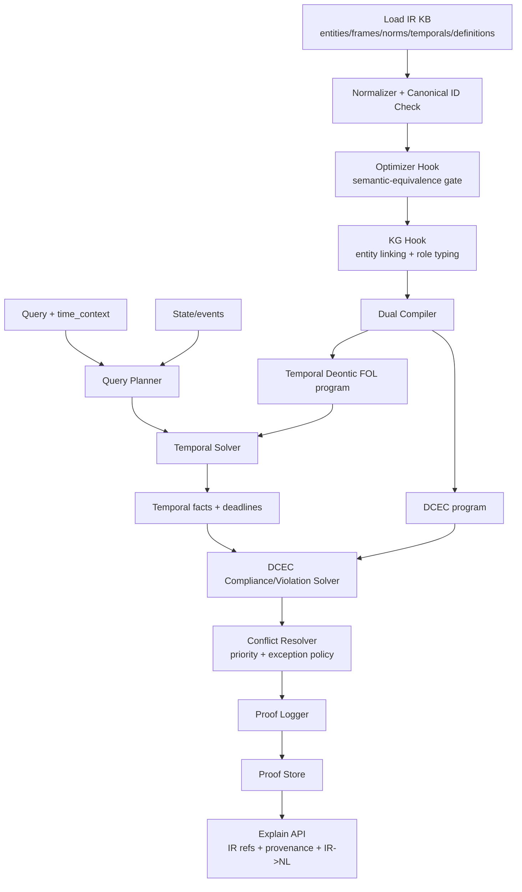

# Hybrid Legal V3: IR-CNL-Reasoner Integration Plan (Optimizers, KG, Theorem Provers)

Status: Draft v3 (2026-03-02)
Scope: End-to-end architecture for integrating optimizers, knowledge graphs, and theorem provers into a typed frame IR, CNL pipeline, and proof-producing reasoner.

## 1) Goals and Non-Negotiable Constraints

This plan delivers one compositional legal representation stack combining:
- Frame Logic style typed frames,
- First-Order Logic conditions and definitions,
- Deontic modal operators `O`, `P`, `F`,
- Temporal deontic FOL,
- DCEC/Event Calculus dynamics (`Happens`, `Initiates`, `Terminates`, `HoldsAt`).

Mandatory constraints:
- Frames are first-class terms with named slots (`agent`, `patient`, `recipient`, etc.).
- Deontic operators wrap frame references, never raw predicate argument positions.
- Temporal constraints are independent objects attachable to norms/frames.
- Canonical deterministic IDs are used for entities, frames, norms, temporal constraints, and sources.
- One IR compiles to both DCEC and Temporal Deontic FOL.
- IR remains reversible to controlled natural language.

## 2) System Integration Strategy (Optimizer + KG + Prover)

### 2.1 Hooking topology

`CNL -> Parser -> IR Builder -> Normalizer -> Optimizer Hook -> KG Hook -> Compiler(DCEC/TDFOL) -> Prover Hook -> Proof Store -> Explain( IR -> CNL )`

### 2.2 Hook contracts

Optimizer hook:
- Input: normalized `LegalIR` + optimization policy.
- Output: semantically equivalent IR candidate + report (`drift_score`, `equivalence_ok`, `changes`).
- Guardrail: reject when `equivalence_ok=false` or `drift_score > threshold`.

KG hook:
- Input: canonical entities/frames/roles.
- Output: additive enrichment patch only (typed links, aliases, ontology tags).
- Guardrail: no mutation of canonical IDs or deontic operators.

Prover hook:
- Input: compiled formulas + assumptions + query theorem.
- Output: certificate envelope + normalized proof graph with `ir_refs` and provenance.
- Guardrail: each proof step must include at least one IR reference and one provenance record.

### 2.3 Why this avoids predicate-arity explosion

- Actions/events/states are represented as frame terms (`frm:*`) instead of wide predicates.
- Roles are named slots inside frames, not extra positional predicate arguments.
- Modality and temporal constraints remain wrappers, preventing repeated predicate variants.

## 3) Canonical IR Schema

## 3.1 Near-EBNF grammar

```ebnf
IRDocument          ::= "IR" "{" Header Entities Frames Norms Definitions Temporals Sources "}"
Header              ::= "header" ":" "{" "ir_version" ":" Version ","
                        "cnl_version" ":" Version ","
                        "jurisdiction" ":" JurRef ","
                        "clock" ":" ClockRef "}"

Entities            ::= "entities" ":" "[" { Entity } "]"
Frames              ::= "frames" ":" "[" { Frame } "]"
Norms               ::= "norms" ":" "[" { Norm } "]"
Definitions         ::= "definitions" ":" "[" { DefinitionRule } "]"
Temporals           ::= "temporals" ":" "[" { TemporalConstraint } "]"
Sources             ::= "sources" ":" "[" { SourceRef } "]"

Entity              ::= "{" "id" ":" EntId "," "type" ":" TypeName ","
                        "label" ":" String ["," "attrs" ":" Map] "}"

Frame               ::= ActionFrame | EventFrame | StateFrame
ActionFrame         ::= "{" "id" ":" FrmId "," "kind" ":" "action" ","
                        "predicate" ":" Symbol "," "slots" ":" SlotMap ["," "context" ":" Context] "}"
EventFrame          ::= "{" "id" ":" FrmId "," "kind" ":" "event" ","
                        "predicate" ":" Symbol "," "slots" ":" SlotMap ["," "context" ":" Context] "}"
StateFrame          ::= "{" "id" ":" FrmId "," "kind" ":" "state" ","
                        "predicate" ":" Symbol "," "slots" ":" SlotMap ["," "context" ":" Context] "}"

SlotMap             ::= "{" { RoleName ":" TermRef } "}"
Context             ::= "{" ["jurisdiction" ":" JurRef]
                          ["," "modality_context" ":" Symbol]
                          ["," "time_anchor" ":" TimeRef] "}"

Norm                ::= "{" "id" ":" NormId "," "operator" ":" ("O"|"P"|"F") ","
                        "target_frame_ref" ":" FrmId
                        ["," "activation" ":" ConditionExpr]
                        ["," "exceptions" ":" "[" { ConditionExpr } "]"]
                        ["," "temporal_refs" ":" "[" { TmpId } "]"]
                        ["," "priority" ":" Integer]
                        ["," "source_ref" ":" SourceId]
                        "}"

DefinitionRule      ::= "{" "id" ":" DefId "," "kind" ":" ("means"|"includes") ","
                        "lhs_frame_ref" ":" FrmId "," "rhs_formula" ":" FormulaExpr "}"

TemporalConstraint  ::= "{" "id" ":" TmpId "," "relation" ":" ("before"|"after"|"by"|"within"|"during") ","
                        "subject_ref" ":" Ref "," "object_ref" ":" RefOrTime
                        ["," "value" ":" Number] ["," "unit" ":" TimeUnit] "}"

ConditionExpr       ::= Atom | And | Or | Not | Exists | Forall
Atom                ::= "{" "op" ":" "atom" "," "pred" ":" Symbol "," "args" ":" "[" { Term } "]" "}"
And                 ::= "{" "op" ":" "and" "," "children" ":" "[" { ConditionExpr } "]" "}"
Or                  ::= "{" "op" ":" "or" "," "children" ":" "[" { ConditionExpr } "]" "}"
Not                 ::= "{" "op" ":" "not" "," "child" ":" ConditionExpr "}"
Exists              ::= "{" "op" ":" "exists" "," "var" ":" Symbol "," "type" ":" TypeName "," "child" ":" ConditionExpr "}"
Forall              ::= "{" "op" ":" "forall" "," "var" ":" Symbol "," "type" ":" TypeName "," "child" ":" ConditionExpr "}"
```

## 3.2 Python dataclass model

```python
from __future__ import annotations
from dataclasses import dataclass, field
from enum import Enum
from typing import Any, Literal

DeonticOp = Literal["O", "P", "F"]
FrameKind = Literal["action", "event", "state"]
TemporalRel = Literal["before", "after", "by", "within", "during"]

class ProofStatus(str, Enum):
    PROVED = "proved"
    REFUTED = "refuted"
    UNKNOWN = "unknown"

@dataclass(frozen=True)
class SourceRef:
    id: str
    text: str
    uri: str | None = None
    span: tuple[int, int] | None = None

@dataclass(frozen=True)
class Entity:
    id: str
    type_name: str
    label: str
    attrs: dict[str, Any] = field(default_factory=dict)

@dataclass(frozen=True)
class FrameContext:
    jurisdiction: str | None = None
    modality_context: str | None = None
    time_anchor: str | None = None

@dataclass(frozen=True)
class Frame:
    id: str
    kind: FrameKind
    predicate: str
    slots: dict[str, str]
    context: FrameContext = field(default_factory=FrameContext)
    attrs: dict[str, Any] = field(default_factory=dict)

@dataclass(frozen=True)
class TemporalConstraint:
    id: str
    relation: TemporalRel
    subject_ref: str
    object_ref: str | None = None
    value: int | None = None
    unit: str | None = None

@dataclass(frozen=True)
class Atom:
    pred: str
    args: tuple[str, ...] = ()

@dataclass(frozen=True)
class ConditionNode:
    op: Literal["atom", "and", "or", "not", "exists", "forall"]
    atom: Atom | None = None
    children: tuple["ConditionNode", ...] = ()
    var: str | None = None
    var_type: str | None = None

@dataclass(frozen=True)
class DefinitionRule:
    id: str
    kind: Literal["means", "includes"]
    lhs_frame_ref: str
    rhs_formula: str

@dataclass(frozen=True)
class Norm:
    id: str
    operator: DeonticOp
    target_frame_ref: str
    activation: ConditionNode | None = None
    exceptions: tuple[ConditionNode, ...] = ()
    temporal_refs: tuple[str, ...] = ()
    priority: int = 0
    source_ref: str | None = None

@dataclass(frozen=True)
class LegalIR:
    ir_version: str
    cnl_version: str
    jurisdiction: str
    clock: str
    entities: tuple[Entity, ...]
    frames: tuple[Frame, ...]
    norms: tuple[Norm, ...]
    definitions: tuple[DefinitionRule, ...] = ()
    temporals: tuple[TemporalConstraint, ...] = ()
    sources: tuple[SourceRef, ...] = ()
```

Canonical ID policy:
- `ent:<sha12(type_name|canonical_label)>`
- `frm:<sha12(kind|predicate|sorted_slots|jurisdiction)>`
- `tmp:<sha12(relation|subject|object|value|unit)>`
- `nrm:<sha12(operator|target|activation|exceptions|temporals|priority)>`
- `src:<sha12(uri|span|text)>`

## 4) Controlled Natural Language (CNL) Design

## 4.1 CNL syntax templates

Normative templates:
1. `<Agent> shall <VerbPhrase> [TemporalClause].`
2. `<Agent> shall not <VerbPhrase> [TemporalClause].`
3. `<Agent> may <VerbPhrase> [TemporalClause].`
4. `If <ConditionClause>, <Agent> shall <VerbPhrase> [TemporalClause].`
5. `<Agent> shall <VerbPhrase> unless <ExceptionClause> [TemporalClause].`

Definition templates:
1. `<TermPhrase> means <DefinitionClause>.`
2. `<TermPhrase> includes <DefinitionClause>.`

Temporal templates:
1. `... by <TimePointOrAnchor>.`
2. `... within <N> <unit> [of <anchor>].`
3. `... before <time_or_event>.`
4. `... after <time_or_event>.`
5. `... during <interval>.`

## 4.2 CNL parsing grammar (near-EBNF)

```ebnf
Sentence        ::= NormSentence | DefinitionSentence
NormSentence    ::= [ConditionPrefix] Subject Modal VerbPhrase [ExceptionTail] [TemporalTail] "."
ConditionPrefix ::= ("If" | "When") ConditionClause ","
ExceptionTail   ::= ("unless" | "except when") ConditionClause
TemporalTail    ::= ByTail | WithinTail | BeforeTail | AfterTail | DuringTail

Modal           ::= "shall" | "shall not" | "may"
Subject         ::= NP
VerbPhrase      ::= Verb [Object] [Recipient] [PPhrases]
DefinitionSentence ::= TermPhrase ("means" | "includes") DefinitionClause "."
```

Disambiguation policy:
- One modal token per sentence.
- One principal action frame per sentence.
- Multiple temporal clauses normalized into a constraint set attached to the same norm.

## 4.3 Semantic conversion table

| CNL template | IR mapping | DCEC mapping | Temporal Deontic FOL mapping |
|---|---|---|---|
| `A shall V O` | `Norm(O, Frame(V, agent=A, patient=O))` | `O(Happens(FrameRef(V,A,O), t))` | `O(Exists t. V(A,O,t))` |
| `A shall not V O` | `Norm(F, Frame(...))` | `F(Happens(FrameRef(...), t))` | `F(Exists t. V(A,O,t))` |
| `A may V O` | `Norm(P, Frame(...))` | `P(Happens(FrameRef(...), t))` | `P(Exists t. V(A,O,t))` |
| `If C, A shall V O` | `activation=C` | `HoldsAt(C,t0) -> O(Happens(FrameRef,t))` | `Forall t0. C(t0) -> O(Exists t. V(A,O,t))` |
| `A shall V O unless E` | `exceptions=[E]` | `not HoldsAt(E,t0) -> O(Happens(FrameRef,t))` | `Forall t0. not E(t0) -> O(Exists t. V(A,O,t))` |
| `A shall V O by D` | `Temporal(by,target,D)` | `O(Exists t. t<=D and Happens(FrameRef,t))` | `O(Exists t. t<=D and V(A,O,t))` |
| `A shall V O within N days of X` | `Temporal(within,target,N,day,anchor=X)` | `O(Exists t. Within(t, X, Nd) and Happens(FrameRef,t))` | `O(Exists t. Within(t, X, Nd) and V(A,O,t))` |
| `Term means Def` | `Definition(kind=means)` | `Forall x. Term(x) <-> Def(x)` | `Forall x. Term(x) <-> Def(x)` |

## 4.4 Example lexicon

Frame types:
- `report_event`, `notify_event`, `payment_event`, `disclosure_event`, `retention_state`, `permit_issue_action`

Roles:
- `agent`, `patient`, `recipient`, `authority`, `beneficiary`, `jurisdiction`

Modal qualifiers:
- `shall -> O`
- `shall not -> F`
- `may -> P`

Temporal qualifiers:
- `by`, `within`, `before`, `after`, `during`

## 4.5 Round-trip NL regeneration rules

1. Select deterministic sentence template from `Norm.operator` + presence of activation/exception/temporal clauses.
2. Realize target frame using canonical role order: `agent -> predicate -> patient -> recipient`.
3. Render temporal constraints in deterministic priority: `during > within > by > before > after`.
4. Render exception as `unless` unless source style preference says `except when`.
5. For paraphrase mode, lexical substitutions are constrained by frame predicate synonym class and must preserve modality and temporal scope.

## 5) Parser, Normalizer, and Compiler Architecture

## 5.1 Parser pseudocode (NL/CNL -> IR)

```python
def parse_nl_to_ir(sentence: str, jurisdiction: str, lexicon: dict) -> LegalIR:
    tokens = tokenize(sentence)
    ast = match_templates(tokens)
    if ast.ambiguous:
        raise ValueError({"code": "CNL_AMBIGUOUS", "candidates": ast.candidates})

    entities = extract_entities(ast, lexicon)
    frame = build_frame(ast, entities, jurisdiction)
    activation = parse_activation(ast)
    exceptions = parse_exceptions(ast)
    temporals = parse_temporal_constraints(ast, subject_ref=frame.id)

    norm = Norm(
        id=temp_id("norm"),
        operator=modal_to_op(ast.modal),
        target_frame_ref=frame.id,
        activation=activation,
        exceptions=tuple(exceptions),
        temporal_refs=tuple(t.id for t in temporals),
    )

    src = SourceRef(id=temp_id("source"), text=sentence)
    return LegalIR(
        ir_version="3.0",
        cnl_version="1.0",
        jurisdiction=jurisdiction,
        clock="UTC",
        entities=tuple(entities),
        frames=(frame,),
        norms=(norm,),
        temporals=tuple(temporals),
        sources=(src,),
    )
```

## 5.2 Normalizer pseudocode (canonicalization)

```python
def normalize_ir(ir: LegalIR) -> LegalIR:
    entities = canonicalize_entities(ir.entities)
    frames = canonicalize_frame_slots(ir.frames, role_aliases={"subject": "agent", "object": "patient"})
    temporals = canonicalize_temporal_values(ir.temporals)  # e.g., 30 days -> P30D
    norms = canonicalize_norms(ir.norms)

    entities = assign_canonical_ids(entities, "ent")
    frames = assign_canonical_ids(frames, "frm")
    temporals = assign_canonical_ids(temporals, "tmp")
    norms = assign_canonical_ids(norms, "nrm")

    validate_ir_contract(entities, frames, norms, temporals)
    return ir.__class__(
        ir_version=ir.ir_version,
        cnl_version=ir.cnl_version,
        jurisdiction=ir.jurisdiction,
        clock=ir.clock,
        entities=tuple(entities),
        frames=tuple(frames),
        norms=tuple(norms),
        definitions=ir.definitions,
        temporals=tuple(temporals),
        sources=ir.sources,
    )
```

## 5.3 Compiler1 pseudocode (IR -> DCEC/Dynamic Temporal Deontic)

```python
def compile_to_dcec(ir: LegalIR) -> list[str]:
    formulas: list[str] = []

    for norm in ir.norms:
        frame = get_frame(ir, norm.target_frame_ref)
        frame_ref_term = f"FrameRef({frame.id})"
        base = f"{norm.operator}(Happens({frame_ref_term}, t))"

        guarded = apply_activation_dcec(base, norm.activation)
        guarded = apply_exceptions_dcec(guarded, norm.exceptions)
        guarded = apply_temporal_dcec(guarded, [get_temporal(ir, r) for r in norm.temporal_refs])
        formulas.append(guarded)

    formulas.extend(compile_ec_dynamics(ir.frames))
    formulas.extend(compile_definition_axioms(ir.definitions))
    return formulas
```

## 5.4 Compiler2 pseudocode (IR -> Temporal Deontic FOL)

```python
def compile_to_temporal_deontic_fol(ir: LegalIR) -> list[str]:
    formulas: list[str] = []

    for norm in ir.norms:
        frame = get_frame(ir, norm.target_frame_ref)
        atom = frame_to_fol_atom(frame, time_var="t")
        modal = f"{norm.operator}({atom})"

        guarded = add_activation_guard_fol(modal, norm.activation)
        guarded = add_exception_guard_fol(guarded, norm.exceptions)
        guarded = add_temporal_guard_fol(guarded, [get_temporal(ir, r) for r in norm.temporal_refs])

        formulas.append(f"Forall t. {guarded}")

    formulas.extend(compile_definition_equivalences(ir.definitions))
    return formulas
```

## 5.5 Optional back-translation pseudocode (IR -> NL/CNL)

```python
def generate_cnl(norm: Norm, ir: LegalIR, style: str = "strict") -> str:
    frame = get_frame(ir, norm.target_frame_ref)
    subject = lexicalize_role(frame, "agent")
    vp = lexicalize_frame(frame)

    modal = {"O": "shall", "P": "may", "F": "shall not"}[norm.operator]
    cond = lexicalize_activation(norm.activation, style)
    exc = lexicalize_exceptions(norm.exceptions, style)
    tmp = lexicalize_temporals([get_temporal(ir, r) for r in norm.temporal_refs], style)

    return realize_sentence(subject, modal, vp, cond, exc, tmp)
```

## 6) Reasoner Architecture and Proof Flow

## 6.1 Workflow diagram



## 6.2 Query handling pseudocode

```python
def handle_query(query: dict, time_context: dict, kb: LegalIR) -> dict:
    q = normalize_query(query, time_context)
    kb_slice = select_relevant_ir(kb, q)

    temporal_program = compile_to_temporal_deontic_fol(kb_slice)
    dcec_program = compile_to_dcec(kb_slice)

    temporal_result, temporal_proof = temporal_solver(temporal_program, q)
    deontic_result, dcec_proof = dcec_solver(dcec_program, q, temporal_result)
    merged = resolve_conflicts_and_exceptions(deontic_result, kb_slice)

    proof_obj = build_proof_object(q, merged, temporal_proof, dcec_proof)
    proof_id = proof_store_save(proof_obj)

    return {
        "status": merged.status,
        "answer": merged.answer,
        "violations": merged.violations,
        "conflicts": merged.conflicts,
        "proof_id": proof_id,
    }
```

## 6.3 Required reasoning APIs

```python
def check_compliance(query: dict, time_context: dict) -> dict: ...
def find_violations(state: dict, time_range: tuple[str, str]) -> dict: ...
def explain_proof(proof_id: str, format: str = "nl") -> dict: ...
```

## 6.4 Proof obligations

1. Type correctness: every frame slot reference resolves and respects declared type.
2. Modal discipline: deontic operators target frame refs only.
3. Temporal consistency: no unsatisfiable temporal set on one norm.
4. Exception precedence: exceptions defeat obligations/prohibitions where specified.
5. Conflict detection: detect concurrent `O(phi)` and `F(phi)` under same context.
6. Compilation parity: DCEC and TDFOL preserve equivalent activation semantics.
7. Provenance completeness: each proof step links to `source_ref` and at least one IR ID.

## 7) Ten CNL Transformation Examples

Notation:
- IR shown as compact JSON-like fragments.
- DCEC uses frame references (`FrameRef(frm:...)`) to preserve wrapper discipline.

### Example 1
CNL: `Controller shall report a breach within 72 hours.`

IR:
```json
{
  "frame": {"id": "frm:report_breach", "kind": "action", "predicate": "report", "slots": {"agent": "ent:controller", "patient": "ent:breach"}},
  "norm": {"id": "nrm:1", "operator": "O", "target_frame_ref": "frm:report_breach", "temporal_refs": ["tmp:within72h"]},
  "temporal": {"id": "tmp:within72h", "relation": "within", "subject_ref": "frm:report_breach", "object_ref": "evt:breach_detected", "value": 72, "unit": "hour"}
}
```
DCEC: `O(Exists t. Within(t, evt:breach_detected, 72h) and Happens(FrameRef(frm:report_breach), t))`
Temporal Deontic FOL: `O(Exists t. Within(t, evt:breach_detected, 72h) and Report(controller, breach, t))`
Round-trip NL: `Controller shall report a breach within 72 hours.`

### Example 2
CNL: `Processor shall not disclose personal data unless consent is recorded.`

IR:
```json
{
  "frame": {"id": "frm:disclose_data", "predicate": "disclose", "slots": {"agent": "ent:processor", "patient": "ent:personal_data"}},
  "norm": {"id": "nrm:2", "operator": "F", "target_frame_ref": "frm:disclose_data", "exceptions": [{"op": "atom", "pred": "ConsentRecorded", "args": ["ent:data_subject"]}]}
}
```
DCEC: `Forall t0. not HoldsAt(ConsentRecorded(data_subject), t0) -> F(Happens(FrameRef(frm:disclose_data), t0))`
Temporal Deontic FOL: `Forall t0. not ConsentRecorded(data_subject, t0) -> F(Disclose(processor, personal_data, t0))`
Round-trip NL: `Processor shall not disclose personal data unless consent is recorded.`

### Example 3
CNL: `If wages are due, employer shall pay wages by day 5.`

IR:
```json
{
  "frame": {"id": "frm:pay_wages", "predicate": "pay", "slots": {"agent": "ent:employer", "patient": "ent:wages"}},
  "norm": {"id": "nrm:3", "operator": "O", "target_frame_ref": "frm:pay_wages", "activation": {"op": "atom", "pred": "WagesDue", "args": ["ent:employer"]}, "temporal_refs": ["tmp:by_day5"]}
}
```
DCEC: `Forall t0. HoldsAt(WagesDue(employer), t0) -> O(Exists t. t <= day5 and Happens(FrameRef(frm:pay_wages), t))`
Temporal Deontic FOL: `Forall t0. WagesDue(employer, t0) -> O(Exists t. t <= day5 and Pay(employer, wages, t))`
Round-trip NL: `If wages are due, employer shall pay wages by day 5.`

### Example 4
CNL: `Agency may issue a temporary permit after review completion.`

IR:
```json
{
  "frame": {"id": "frm:issue_permit", "predicate": "issue", "slots": {"agent": "ent:agency", "patient": "ent:temporary_permit"}},
  "norm": {"id": "nrm:4", "operator": "P", "target_frame_ref": "frm:issue_permit", "temporal_refs": ["tmp:after_review"]}
}
```
DCEC: `P(Exists t. After(t, evt:review_complete) and Happens(FrameRef(frm:issue_permit), t))`
Temporal Deontic FOL: `P(Exists t. After(t, review_complete) and Issue(agency, temporary_permit, t))`
Round-trip NL: `Agency may issue a temporary permit after review completion.`

### Example 5
CNL: `Vendor shall retain invoices during the audit period.`

IR:
```json
{
  "frame": {"id": "frm:retain_invoices", "kind": "state", "predicate": "retain", "slots": {"agent": "ent:vendor", "patient": "ent:invoices"}},
  "norm": {"id": "nrm:5", "operator": "O", "target_frame_ref": "frm:retain_invoices", "temporal_refs": ["tmp:during_audit"]}
}
```
DCEC: `O(Forall t. During(t, int:audit_period) -> HoldsAt(FrameRef(frm:retain_invoices), t))`
Temporal Deontic FOL: `O(Forall t. During(t, audit_period) -> Retain(vendor, invoices, t))`
Round-trip NL: `Vendor shall retain invoices during the audit period.`

### Example 6
CNL: `Bank shall notify the regulator within 24 hours of incident detection.`
IR: `Norm(O, target=frm:notify_regulator, temporal=tmp:within24h_incident)`
DCEC: `O(Exists t. Within(t, evt:incident_detected, 24h) and Happens(FrameRef(frm:notify_regulator), t))`
Round-trip NL: `Bank shall notify the regulator within 24 hours of incident detection.`

### Example 7
CNL: `Operator shall not transfer records before court authorization.`
IR: `Norm(F, target=frm:transfer_records, temporal=tmp:before_court_auth)`
DCEC: `F(Exists t. Before(t, evt:court_authorized) and Happens(FrameRef(frm:transfer_records), t))`
Round-trip NL: `Operator shall not transfer records before court authorization.`

### Example 8
CNL: `If emergency is declared, hospital may share data with responders.`
IR: `Norm(P, target=frm:share_data, activation=EmergencyDeclared)`
DCEC: `Forall t0. HoldsAt(EmergencyDeclared, t0) -> P(Happens(FrameRef(frm:share_data), t0))`
Round-trip NL: `If emergency is declared, hospital may share data with responders.`

### Example 9
CNL: `Taxpayer shall file a return by April 15.`
IR: `Norm(O, target=frm:file_return, temporal=tmp:by_apr15)`
DCEC: `O(Exists t. t <= 2026-04-15 and Happens(FrameRef(frm:file_return), t))`
Round-trip NL: `Taxpayer shall file a return by April 15.`

### Example 10
CNL: `Licensee shall renew the license unless exempted by statute.`
IR: `Norm(O, target=frm:renew_license, exceptions=[StatutoryExemption])`
DCEC: `Forall t0. not HoldsAt(StatutoryExemption(licensee), t0) -> O(Happens(FrameRef(frm:renew_license), t0))`
Round-trip NL: `Licensee shall renew the license unless exempted by statute.`

## 8) Query APIs and 8-Query Proof Test Set

## 8.1 API envelopes

`check_compliance(query, time_context)` input example:
```json
{
  "query": {"actor_ref": "ent:controller", "frame_ref": "frm:report_breach", "facts": {"breach_detected": "2026-01-01T10:00:00Z"}, "events": []},
  "time_context": {"at_time": "2026-01-04T09:00:00Z"}
}
```

`find_violations(state, time_range)` input example:
```json
{
  "state": {"events": [{"frame_ref": "frm:disclose_data", "time": "2026-02-03T12:00:00Z"}], "facts": {"consent_recorded": false}},
  "time_range": ["2026-02-01T00:00:00Z", "2026-02-28T23:59:59Z"]
}
```

`explain_proof(proof_id, format="nl")` output skeleton:
```json
{
  "proof_id": "pf_9a17b3dce120",
  "format": "nl",
  "status": "proved",
  "root_conclusion": "non_compliant(frm:report_breach)",
  "steps": [
    {
      "step_id": "s1",
      "rule_id": "deadline_check",
      "premises": [],
      "conclusion": "missed_deadline(frm:report_breach)",
      "ir_refs": [{"kind": "norm", "id": "nrm:1"}, {"kind": "temporal", "id": "tmp:within72h"}],
      "provenance": [{"source_id": "src:001", "uri": "law://article/5"}]
    }
  ],
  "reconstructed_nl": "Controller failed to report a breach within 72 hours."
}
```

## 8.2 Eight query scenarios with expected proof outcomes

1. `Q1`: Was controller compliant with 72-hour breach reporting deadline?
- Expected: `non_compliant` if no report event in window.
- Proof highlights: `nrm:1`, `tmp:within72h`, source clause.

2. `Q2`: Did processor violate disclosure prohibition without consent?
- Expected: `violation` when disclosure event exists and consent fact false.
- Proof highlights: exception guard unsatisfied.

3. `Q3`: Is employer currently obligated to pay wages by day 5?
- Expected: `obligation_active` if `WagesDue` holds.
- Proof highlights: activation condition step + deadline step.

4. `Q4`: Is permit issuance permitted before review completion?
- Expected: `not_permitted_yet` before anchor event.
- Proof highlights: temporal-after constraint unsatisfied.

5. `Q5`: Are there conflicting norms on the same frame (`O(phi)` and `F(phi)`)?
- Expected: `conflict_detected` with priority/exceptions evaluation.
- Proof highlights: conflict rule + tie-break policy.

6. `Q6`: Is retention duty active during audit interval?
- Expected: `active_obligation` inside interval, inactive outside.
- Proof highlights: interval membership facts.

7. `Q7`: Does statutory exemption defeat renewal obligation?
- Expected: `no_violation` if exemption fact holds.
- Proof highlights: exception precedence rule.

8. `Q8`: Explain why taxpayer filing is late as natural language.
- Expected: `proved_late_filing` + deterministic NL explanation.
- Proof highlights: timestamp comparison + IR-to-NL reconstruction.

## 9) Implementation Workstreams and Milestones

WS1 IR hardening:
- finalize schema + validators + canonical ID generator.
- deliver JSON schema and golden fixtures.

WS2 CNL parser/renderer:
- implement deterministic template parser and reversible renderer.
- add ambiguity diagnostics and lexicon versioning.

WS3 Dual compiler:
- implement DCEC and TDFOL compilers from normalized IR.
- add parity checks over sampled IR fixtures.

WS4 Reasoner core:
- implement query planner, temporal solver bridge, DCEC solver bridge.
- implement proof graph + replay hash.

WS5 Hook integration:
- integrate optimizer/KG/prover adapters with gating.
- enforce semantic drift budget and additive KG policy.

WS6 Verification:
- run 10 transformation chains and 8 reasoner query tests.
- require proof completeness (`ir_refs` + provenance in every step).

## 10) Acceptance Criteria

1. CNL sentences parse to valid normalized IR with deterministic IDs.
2. IR compiles to both DCEC and TDFOL without schema violations.
3. At least 10 CNL examples successfully round-trip (CNL -> IR -> DCEC -> NL).
4. First 5 examples also compile to Temporal Deontic FOL.
5. API trio (`check_compliance`, `find_violations`, `explain_proof`) returns proof-linked results.
6. All 8 query scenarios produce proof objects traceable to source text.
7. Optimizer/KG/prover hooks run under strict guardrails without semantic drift.
