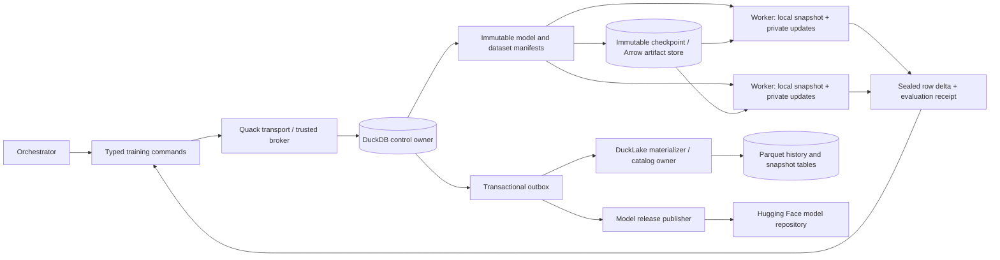

# Versioned autoencoder training with DuckDB, Quack, DuckLake, and Arrow

Status: original implementation plan, audited 2026-09-24–25, with scoped
implementation updates through 2026-09-27. The reports below distinguish
implemented slices from remaining deployment and qualification. Owner:
`external/ipfs_datasets` in the lift_coding
workspace. This extends the [U.S. Code plan](US_CODE_AUTOFORMALIZATION_PLAN.md).

Current implementation status (2026-09-26): the
[campaign owned-dispatch design](AUTOENCODER_CAMPAIGN_OWNED_DISPATCH_PLAN.md)
prioritizes owner-supervised execution of the existing v8 jobs. Those jobs
already bind shared targets, accepted sparse updates and optional Arrow weights.
Mapping their inputs to a separately configured daemon invocation does not
preserve the training contract or complete the original jobs. The design
specifies durable operation identities, bounded process supervision and recovery
and a separate Quack submission profile. The
[B1 request codec and owner preparation](../reports/autoencoder_campaign_owned_preparation.md)
passed 338 bounded offline tests on the captured source revision, with zero
failures, errors or skips. The user-authorized increase to a 60 GB campaign cap
preserved all historical ledger records and enabled the fresh 50 MB test attempt,
which released its reservation and lease. [B2 owned worker execution](../reports/autoencoder_campaign_owned_execution.md)
subsequently passed 486 guarded offline cases. [B3 campaign Quack control](../reports/autoencoder_campaign_quack_control.md)
passed 208 guarded offline cases, including the exact authorized 24-hour deadline
identity check. It submits
immutable request descriptors and leaves actual execution to an explicit owner
drain, retaining the existing shared-target, sparse-update and optional Arrow
path. No full-corpus, native or legal-IR speed qualification follows.

The next training-memory change is
[incremental target hydration](../reports/autoencoder_streamed_target_reduction.md)
under the existing default-off reduction option. It keeps numeric weights local
and changes neither the Quack protocol nor sparse replay. Two validated passes
avoid retaining the whole rich-target batch but add decoding, validation hashes
and collections. All 222 selected offline cases passed with stable provenance
guards. Native memory and complete-job throughput qualification remain deferred;
offline correctness alone does not justify more parallel workers.
The [complete declared U.S. Code source export](../reports/autoencoder_uscode_corpus_export.md)
now delivers 62,931 physical rows, aliases, partitions and embedding dispositions
as portable Parquet. All 392 selected tests and independent full-row readback
passed.

The [persistent source catalog](../reports/source_corpus_catalog.md) now owns the
complete source package and materializes all 62,931 rows in a separate DuckDB
catalog, with immutable dataset/language/version bindings, exact resume and
bounded reads. All 432 selected tests and full independent reopened readback
passed. Adding an upper ordinal bound reduced observed whole catalog work from
593.306 to 264.436 seconds; caches were uncontrolled,
so this is a source I/O observation. The database costs
986,460,160 bytes plus a
263,671,066-byte package per physical
release. Numeric weights and shared targets remain local to training workers.
The [source delivery adapter](../reports/source_corpus_delivery.md) now adds a
bounded, durable Quack submission profile, a shared package binding, an isolated
native DuckLake source table and an offline Hugging Face release plan. On
2026-09-27, all 783 selected tests passed and independent reopened readback
preserved all 62,931 rows and 33 fields. The native sink occupies 197,307,549 bytes;
the complete delivery check took 234.845 seconds with uncontrolled filesystem
caches. The plan includes all 103 package files, including its manifest. No Hub
upload or native Quack listener ran. Production delivery, official source
coverage, Constitution integration and actual Lake formalization remain separate
gates; native model and training qualification remains deferred.

The later [combined integration validation](../reports/autoencoder_campaign_integration_validation.md)
passed all 580 selected offline tests with stable source/dependency guards and
released its fresh reservation. It includes B1, semantic repairs, Constitution
observation boundaries and bounded ingest scheduling. The authorized deadline
extension is assessed per case against unchanged historical evidence; these
results predate B2/B3 and do not qualify full-corpus training. The later B2/B3
reports above describe their separate implementation and validation scope.

Historical capacity blocker: a read-only census at
2026-09-26 16:36:44 UTC found 40,003,977,864 observed bytes plus
10,030,000,000 outstanding bytes across 17 retained claims, exceeding the
then-existing 50,000,000,000-byte campaign limit by 33,977,864 bytes. This was a
non-atomic observation, not a reservation. At that stage no quota, retained claim
or archived artifact was changed and no runtime validation was launched.
The later B1 census at 17:02:06 UTC found 50,067,331,746 charged bytes,
67,331,746 above the same limit, with every retained claim unchanged. B1 code
and tests were authored outside the charged artifact roots; runtime tests were
not admitted until the subsequent explicit cap increase. The
[passed audit](../reports/evidence/autoencoder_control_plane_plan/campaign-owned-preparation-audit-20260926-r1.json)
binds that migration, the original ledger backup and the unchanged 17 retained
claims. Fresh work still needs its full reservation, expected growth and margin.
Native validation remains deferred; no listener, DuckLake activation or HF upload
was launched by this qualification.

Implementation progress: the [first durable-owner and independent-worker milestone](../reports/autoencoder_control_plane_phase1.md)
records code, real native capability checks and a pinned-checkpoint parallel
benchmark. The remaining phases below are still proposals unless that report
explicitly marks them implemented.

Next implementation sequence: the [federal-law end-to-end training plan](FEDERAL_LAW_END_TO_END_TRAINING_PLAN.md)
specifies full-fidelity shared targets, accepted sparse patch capture and
Arrow-backed weights, with current source-identity findings and corpus/release
gates. It preserves the historical evidence and admission boundaries here.

The [next implemented milestone](../reports/autoencoder_shared_targets_sparse_arrow.md)
qualifies shared complete targets, accepted sparse replay and an optional Arrow
feature table on the pinned checkpoint. It records both benefits and remaining
serialization/memory costs.

Further milestones qualify [target bundles](../reports/autoencoder_target_bundles.md),
[sparse checkpoint persistence](../reports/autoencoder_sparse_checkpoint_persistence.md)
and [verified source/sample/split batches](../reports/autoencoder_verified_corpus_batches.md).
The last also removes redundant reconstruction from input preparation. Production
DuckLake activation, full-corpus qualification and HF publication remain pending.

The [pinned-source and frozen-index milestone](../reports/autoencoder_uscode_source_index.md)
now verifies selected source/vector shards and freezes split membership for
explicit batch checks. Its 1,491 published vectors remain training-ineligible
without input/producer bindings. The [v5 durable-job integration](../reports/autoencoder_indexed_training_jobs.md)
now enforces the index through owner and worker, including restart consistency
and schema-downgrade rejection for bound variants. The [native embedding and v6 milestone](../reports/autoencoder_native_embedding_production.md)
now adds exact local producer sidecars to the same owner/worker contract. Its
64-row input audit produced 51 vectors and explicitly excluded 13 oversized
inputs; no new autoencoder training or publication occurred. At that milestone,
complete source inventory, broad source qualification and corpus-scale
performance remained pending. Published vectors are not retroactively qualified
by regeneration.

The subsequent [declared-release source inventory](../reports/autoencoder_uscode_source_inventory.md)
adds metadata-only accounting before embedding or split assignment and feeds
bounded selections back through the existing source extractor. Its final offline
scan verified all 62,931 rows in 16 pinned corpus shards and materialized three
inputs, with 275 checks and unchanged source/protected-artifact guards after
the mixed duplicate-wrapper accounting correction. That milestone left source
partition freezing and producer-receipt-set support for subsequent integration,
with no new training, publication or source-authority claim.

The [source-partition milestone](../reports/autoencoder_source_partitions.md)
now freezes the complete declared inventory before embedding exclusions,
preserving physical occurrences and input aliases. Its 362 offline checks and
full-source capture pass. Immutable partition references can use the existing
artifact/control-plane infrastructure. Explicit v8 owner/worker/daemon binding
is now implemented as described below; broader native qualification remains
deferred. No native validation, production activation or publication is
implied by source membership.

The [producer receipt-set codec](../reports/autoencoder_embedding_receipt_sets.md)
now binds successive bounded receipts to the complete frozen source population
and one exact producer profile. It retains unattempted inputs and physical
aliases, leaves vector provenance on the original receipt, and verifies only
requested leaves/sources for a bounded record selection. Its guarded offline
capture passed 440 tests and reconstructed the archived 64-input receipt against
the complete denominator: 51 embedded, 13 over-length and 62,775 unattempted.
The root is 9.6 MB; reopening took 3.12 seconds and a selected-record check 0.046
seconds in this source/artifact-only capture, without a model speed claim.
Control-plane integration must store immutable references, with
root sealing at explicit campaign boundaries; resealing after every batch would
rewrite the complete membership list. Whole-leaf retry selection is the current
limit. This codec does not change any existing training-job contract.

The [immutable produced-record projection](../reports/autoencoder_produced_record_projection.md)
now binds an exact batch manifest, ordered roles and original leaf provenance to
the shared campaign roots without rebuilding source groups. Its guarded capture
passes 590 checks and verifies a six-record archived batch with three frozen
training and three validation inputs. The projection is 9,566 bytes; metadata
reopen against loaded roots took 0.46 ms and fresh selected batch verification
114 ms. Full inventory/partition/root loading is additional setup, so these are
preparation measurements rather than a model speedup. The explicit v8 bindings
are now implemented in the following milestone. Registered campaign roots must remain immutable across batches;
adding receipts needs an explicit campaign revision, not a silent variant edit.
Multi-receipt Arrow input and transitive corpus publication support
also require explicit new contracts; merely registering references supplies
neither capability.

The [v8 campaign-job integration](../reports/autoencoder_campaign_training_jobs.md)
connects those immutable roots to worker, owner and offline daemon inputs without
a SQL migration. It preserves existing shared targets, sparse candidates and
optional Arrow feature weights; multi-receipt inputs remain Python lists. All
441 focused offline tests passed, and a separate archived-data probe verified
48 legacy job identities plus a six-record DuckDB handoff. These captures do
not form one qualified same-source run: external supervisor edits intervened,
and the artifact audit's final resource scan lost a concurrently removed pytest
directory. The status receipt explicitly remains unsuccessful for combined
qualification. No native training or production activation occurred.
The historical probe measured 7.63 s for input verification and 22.92 s for owner
export including verification; these are preparation timings, not bridge-on
evaluation results. The
[prepared-input follow-up](../reports/autoencoder_prepared_campaign_inputs.md)
now reuses a private one-use, full-job-bound context within one owner operation,
retaining fresh metadata and selected-byte guards. It adds no persistent cache
or wire-schema change. All 605 offline regressions passed in capture-r1, but a
concurrent `supervisor_loop.py` edit invalidated the subsequent artifact probe's
whole-package guard. Its logged timing comparison remains unqualified. Fresh
bounded capture-r2 now passes all 605 tests and the six-record artifact probe
on the same unchanged 7,759-source snapshot, with protected artifacts unchanged
and its resource claim released. A/B/B/A under current validators measured
median owner preparation of 15.518037 seconds with deliberate recomputation
versus 7.864813 seconds with reuse (1.973097×; two observations per path), with
exact returned bindings. This is preparation evidence, not training throughput.
The accompanying resource fix tolerates only
confirmed descendant deletion in nonstrict shared-root scans; strict attempts,
root identities, quotas and failed claims retain their guards. Select further
work from qualified phase and memory costs rather than assuming a broader cache
is needed. Native validation remains deferred.

Following the [campaign preparation profile](../reports/autoencoder_campaign_preflight_profile.md),
the [campaign workflow integration](../reports/autoencoder_campaign_workflow.md)
now connects verified v6 and v8 inline inputs to the training cycle and learned
feedback. A shared helper validates both roles, stages the complete selected
artifact closure and retains immutable campaign-root bindings. Feedback uses
exact ordered training record IDs, excludes validation records and rejects
cycle selections above 128 records before training. Owner and worker verification
remain authoritative; helper-source and compiler-source guards protect selection
and repair dispatch. Mapped v7 inputs remain outside this feedback path.

Fresh bounded capture-r3 passed 82 offline tests: 35 existing cases and 47 new
cases covering cycle inputs (18), feedback (18) and combined storage (11).
The archived six-record probe retained exact verification and ordered membership
for three training and three validation records. All closeout checks passed
on the same unchanged snapshot of 7,760 package sources and 901 dependency sources,
and the resource claim was released. Combined cases exercise actual shared-target
codecs, sparse candidate replay and optional Arrow feature weights across
independent branches and restart/resume. Their injected updates and immediate
executor establish no native optimizer improvement or parallel throughput.
Earlier failed attempts remain separate in the linked report. Arrow stays
optional, native validation remains deferred, and multi-receipt Arrow inputs
and complete transitive publication support still require separate contracts.

The [immutable campaign-plan milestone](../reports/autoencoder_campaign_plan.md)
now binds already registered v8 jobs to exact ordered batches, shared roots,
variant/configuration identities, parent policy and coverage denominators.
Durable completion lookup checks registry operation history; the inspector
additionally verifies current receipts, accepted-patch replay, sparse ancestry
and compaction. Bounded dispatch skips verified completed jobs and stops on
ambiguous attempts. All 375 offline tests and the archived six-record plan/restart
probe passed on the same 7,761-source revision, followed by 57 passing closeout
checks and resource release. The probe uses an explicit three-byte checkpoint
fixture; test updates are injected. No native training speedup is established.
Fresh per-job verification remains mandatory; the later root-reuse milestone
below amortizes decoding within one preparation call.
Bounded generation from sealed membership is implemented in the following
milestone; complete offline publication and restore remain outstanding. An
adapter from plans to owned Quack prepared handles is separate work; native handle preparation and
fresh checkpoint qualification remain deferred.

The [deterministic batch generator](../reports/autoencoder_campaign_batches.md)
now prepares and registers v8 jobs from those frozen roots. It deduplicates
source aliases, uses fixed training boundaries and validation membership, and
records every eligible input's status and disposition. Stable operation IDs
support partial-registration recovery and overlapping pages without resetting
prior runs. All 348 offline tests, the archived-source probe and 67 closeout
checks passed on one unchanged revision. The probe generated three queued jobs
with 16/16/8 training records and seven shared validation records, covering all
40 currently embedded training inputs while excluding four embedded holdout
inputs. Repeat and owner restart retained exact jobs, plan, queued runs and head.
These use a synthetic checkpoint fixture and establish no optimizer improvement.
Three-job preparation took 66.12 seconds and inspection 24.46 seconds; these
are control-plane observations, not training or bridge-on speed measurements.
The subsequent profile and root-reuse milestone below isolate and reduce
repeated metadata decoding while preserving fresh per-job checks. The
23.66 MB exhaustive generation manifest also has a per-page storage cost.
Qualify a complete offline campaign publication-and-restore closure in parallel;
shared-target runtime membership, native qualification and remote publication
remain separate requirements.

The [offline campaign publication design](../reports/autoencoder_campaign_publication_plan.md)
specifies a separate bounded package for one selected page, including the
template's dependencies. Original path-bound jobs remain unchanged evidence;
restoration does not create runnable jobs or registry authority. Full-source
payload closure and executable import require subsequent explicit contracts.
This is a design proposal, without package implementation or upload evidence.

The [qualified batch-preparation profile](../reports/autoencoder_campaign_batches_profile.md)
now measures that cost: three jobs took 67.29 seconds with direct instrumentation;
eight loads of each shared root consumed 60.44 seconds (89.82%). The guarded
capture and 33-check independent closeout passed with exact archived data
contracts. This historical profile establishes neither a speedup nor native
training qualification.

The [operation-local root reuse](../reports/autoencoder_campaign_root_reuse.md)
follow-up passed 682 offline tests and a guarded uninstrumented A/B/B/A
comparison using the same current validators. Repeated preparation of one
primed three-job page fell from a 66.324950-second median to 15.117741 seconds
(4.387226×, two observations per mode), preserving exact current artifacts,
archived data contracts and queued state. All per-job roles, selected-byte,
configuration and drift checks remain; public worker/owner verification and
every restarted call load fresh roots. No persistent or leaf cache was added.
All 47 [independent closeout checks](../reports/evidence/autoencoder_control_plane_plan/campaign-root-reuse-closeout-20260926-r2.json)
passed. This qualifies repeated preparation only, not first-registration
throughput, per-mode memory savings or native training.

The [produced-corpus Arrow milestone](../reports/autoencoder_produced_corpus_arrow_training.md)
adds opt-in v7 mapped input views and qualifies their owner/worker binding on
real source-bound rows. Shared targets reduced complete-job time substantially;
mapping inputs or feature weights remained slightly slower and stays optional.
Two independent mapped candidate jobs ran concurrently through the same owner,
with exact results and restart persistence. All proposed optimizer updates were
rejected under the existing validation guards; no model promotion occurred.

The [shared-target evaluation milestone](../reports/autoencoder_shared_target_evaluation.md)
now reduces repeated regex compilation and native target serialization. One
same-bundle diagnostic pair reduced worker execution from 26.11 to 18.59 seconds
and retained exact semantic outputs and rejection decisions. Eight native
owner-managed jobs passed. Additional generated bridge content increased target
hydration cost; Arrow remains optional. A later source edit invalidated the
replication's final worker, so the full diagnostic batch is reported failed.
Stable producer revisions and explicit adapter-failure telemetry are required
before scaling reuse; no compatibility or admission guard was relaxed.

The [target-failure telemetry update](../reports/autoencoder_target_failure_telemetry.md)
preserves exact adapter failures in separate preparation receipts while leaving
target artifacts and worker schemas unchanged. A measured hydration experiment
was reverted because its added complexity did not improve wall time. The next
[ontology reuse design](../reports/autoencoder_ontology_capture_reuse_design.md)
keeps any cache bounded to a worker and requires exact input identity and
failure visibility. These steps do not move numeric lookups into Quack or
activate a production DuckLake catalog.

The [capture-observation update](../reports/autoencoder_ontology_observation.md)
adds bounded diagnostics to complete worker receipts. A fresh target bundle and
one ordinary combined Arrow job now pass local-owner restart and artifact
durability under stable sources. Numeric state/head remain unchanged after the
optimizer rejection. Capture reuse stays disabled because direct observations
do not cover every transitive fallback; Quack and production DuckLake are not
claimed as exercised by this new local-owner run.

The [bounded hydration GC update](../reports/autoencoder_target_hydration_gc.md)
adds a default-off execution option for isolated native workers. Codec profiling
identified repeated cyclic-GC scans over retained targets; two exact-parity
pairs reduced hydration including cleanup from 7.24 to 2.59 seconds. This avoids
adding a new target-summary trust protocol or remote weight access. Native
owner qualification then passed four jobs and restart checks: median complete
job time fell 16.5%, from 23.64 to 19.73 seconds, with unchanged metrics, state
and rejection decisions. This is a local DuckDB measurement on three training
and three validation samples, with all five bridges retained. Post-run source
drift invalidates reuse of its targets with newer code; rollout limits and
fresh-preparation requirements are recorded in the linked report.

Use **DuckLake** as the product and interface name. Quack is DuckDB's remote
transport. Legacy files containing `quacklake` are compatibility/inventory
items, not a fourth storage system or a new service to build.

The [durable private-publication adapter](../reports/autoencoder_durable_private_publication.md)
now binds an explicit immutable version and language variant to a complete CAS
package and local HF outbox intent. Strong reopening preserves original package
bytes and allows restoration after owner restart without the original package
directory. It does not change a head, validate supplied evaluations, acknowledge
an upload, or establish remote private visibility. Release hashing and copies
remain outside training and short registry transactions. Remote Quack adaptation,
the guarded HF upload consumer and production DuckLake activation remain pending;
native training validation remains deferred at the user's request.
The source-stable historical recovery preserves the complete package and all
38 state components. A later combined execution passes 555 tests but fails the
full-source guard because four canonical logic files changed during the run;
it is not an aggregate qualification of the current tree.

The [private release metadata verifier](../reports/autoencoder_remote_metadata_verification.md)
adds a read-only check of a sealed package at a caller-supplied known Hub commit.
It observes actual private visibility and exact release inventory, comparing
LFS SHA-256 or explicitly labeled Git blob SHA-1 without downloading weights.
Missing digests remain pending; it does not infer a lost upload's outcome or
acknowledge the outbox. The durable HF delivery consumer, exact-plan approval,
repository-wide publication exclusion and promotion protocol remain separate.
This is a release-boundary storage slice, with no training speed or coverage claim.

The [invocation-local surface text change](../reports/autoencoder_surface_text_reuse.md)
removes duplicate fixed text-classification scans from modal target reconstruction.
It retains dynamic metadata/helper behavior, complete ordered outputs and all
bridges. The memo is bounded to one text per reconstruction call; it neither
changes target authority nor moves numeric work into DuckDB/Quack. Native
preparation and bridge-on speed qualification remain deferred, and old target
bundles still require matching producer provenance. This change is not fully
qualified: the retained current typed-deontic pilot scores 0.9116666666 forward
against the unchanged 0.915 requirement, despite passing the three requested
gates. The report records the concurrent parser exception-slot regression and
the remaining exact temporal-value test failure; neither is waived by local
modal output parity.

The [cold preparation profiles](../reports/autoencoder_cold_target_profile.md)
confirm that the remaining producer cost is dominated by modal text processing,
not database transport or document serialization. Two guarded six-sample
diagnostics retain every bridge and failure outcome. Continue sharing complete
targets and sending sparse updates to the owner; extending Arrow to more
parameter families will not remove this cold producer work. Producer GC changes
and bounded text-normalization changes remain separately measured candidates.

A narrow [native prefix-dispatch update](../reports/autoencoder_frame_prefix_dispatch.md)
now lowers cold preparation by 2.0% in two six-sample pairs, while retaining
every bridge and numeric target output. The existing two graph timestamps are
explicitly different across fresh runs; artifacts and producer identities stay
distinct. This does not add a storage protocol, change model versions, enable
production DuckLake, or qualify publication.

The [worker-private target-retention update](../reports/autoencoder_worker_target_reduction.md)
adds a default-off execution option after unchanged complete bundle validation.
Median pre-training RSS falls 53% and three-target bridge evaluation falls
16.4% in four native jobs. Complete owner time improves only 3.5% at the median,
with mixed pair direction after including preparation/release overhead. Exact
metrics, document hashes and rejected-update state are preserved. Initial
hydration still sets a much larger memory peak; these results do not justify
doubling parallelism or moving numeric accesses into Quack. No new target
artifact format, model-version schema or publication protocol is introduced.

The [source-bound entity v2 path](../reports/entity_source_bound_resume.md) now
commits exact input prefixes with queue updates, preserves claim tokens and
streams Arrow batches through DuckDB for resume validation. All 132 selected
offline cases passed with unchanged captured source/dependency bytes and a
released reservation; the preserved 24-hour deadline and exception gates remain
green. A separate read-only census measured 180,257 entities, 120,136
relationships and 360,516 legacy resume rows. V2 requires a fresh cache and its
own snapshot namespace. Full-source v2 throughput/reopen and actual Hub delivery
remain unqualified; this is not a training speedup or legal-admission result.
The proposed 750 MB full-source capture needs 1.505 GB of campaign headroom;
the successful audit's release observed only about 451 MB under the 60 GB cap.
Failed claims remain retained and native model validation remains deferred.

## 1. Decision

Use DuckDB behind Quack for the small, authoritative control records: model
versions, branch heads, jobs, leases, candidate decisions, and publication
intents. Use the existing DuckLake interfaces for immutable training datasets,
target snapshots, batched metrics, and parameter/delta history. Workers load
immutable local snapshots and train against private updates. They send bounded
update batches and artifact references to the owner; they do not query remote
weights for every operation or open the live owner database file.

Start with independent language/model runs and candidate branches. Add Arrow
memory-mapped parameter access only after an adapter proves exact compatibility
with the current checkpoint. Publish sealed, selected model versions to Hugging
Face asynchronously. HF availability must not determine whether training can
finish and retain a local candidate.



DuckDB control state is authoritative for job ownership and version promotion.
DuckLake has its own catalog/snapshot transactions. Artifact durability is
verified before a version becomes resumable. A lake snapshot, upload, database
row, model metric, or candidate promotion is never a Lean admit.

## 2. What already exists, and what still needs implementation

Paths in this table are relative to `ipfs_datasets_py/`.

| Existing foundation | Reuse | Verified limitation / required addition |
|---|---|---|
| `duckdb_control/connections.py` | Workload-separated pools, bounded writer sessions, endpoint/secret handling | Real local connections exist; parsed Quack configuration alone does not establish a live remote training service |
| `duckdb_control/contracts.py`, `query_registry.py`, `authority_transition.py` | Typed contracts, registered queries, authority/cutover vocabulary | Some defaults are memory-backed; implement and restart-test the durable training backend |
| `ducklake/catalog.py`, `catalog_service.py`, `quack_catalog.py`, `config.py` | Catalog ownership, typed operations, authentication, generation fences, configuration | Catalog service includes a hermetic runtime and process-local lease table; production activation is deliberately gated |
| `ducklake/registry.py`, `snapshots.py`, `ingest.py`, `execution.py` | Registries, snapshots, ingestion and execution contracts | Important default stores/catalogs are in-memory or simulated; class names do not establish durable storage |
| `ducklake/concurrency.py`, `recovery.py`, `maintenance.py`, `release.py` | Conflict/recovery protocols, retention and promotion checks | Qualify against actual installed DuckDB/Quack/DuckLake and a restarted owner, not only injected test engines |
| `optimizers/logic_theorem_optimizer/modal_autoencoder_state_transaction.py` | `ModalAutoencoderStatePatch`, touched-row copy-on-write, rollback and local revision checks | Patch `to_dict()` is diagnostic and omits parameter values; add a durable row-patch encoding and global base identity |
| `modal_autoencoder_state_version.py`, `modal_autoencoder_checkpoint.py` in that optimizer package | State/component identities, checksummed checkpoint containers, recovery and lifecycle contracts | Existing serialized deltas replace changed components and scan full endpoints; log append also scans the accumulated log |
| `modal_autoencoder_tensor_state.py`, `modal_autoencoder_state_migration.py` | Float64 arrays, stable typed IDs, masks, lengths and mapping adapters | Existing accessors can materialize lists/copies; restart12 currently fails typed migration on a source-like feature key |
| `huggingface/publication_profile.py`, `publisher.py`, `ir_publisher.py` | Model repository profiles, sealed plans, expected-parent commits, upload leases and verification | Add an autoencoder release profile, durable outbox integration and a verification mode compatible with the no-download constraint |

The datasets-native catalog service explicitly holds production mutation behind
DQK-088, DQK-094 and DQK-102 qualification. Reuse these boundaries; do not turn off
their checks just to launch workers. The existing source also contains
`MemoryRegistryStore`, `_HermeticDuckLakeCatalog`, and simulated snapshot
database backends. Phase 0 must inventory the selected concrete runtime at each
boundary and replace only the missing durable adapters.

Select a dedicated training-control catalog and owner in this submodule,
reusing those contracts. Production startup requires explicit durable paths
and rejects memory-backed adapters. Add a qualified native Quack adapter for
closed training commands; do not insert legal training state into a live
supervisor database or route it through the unqualified external-owner facade.
This is new runtime integration, not an already deployed training service.

The canonical shared accelerator implementation is `external/ipfs_accelerate`.
The nested `external/ipfs_datasets/ipfs_accelerate_py` tree is drifted; it must
not be selected accidentally. Its real `QuackStateServer` and transaction
protocols are useful integration references. Its generic external-owner
facade still reports an unqualified handler gate, so training must not assume
arbitrary new commands are already supported. Prefer datasets-native contracts
and an explicit, version-pinned transport adapter. Never mirror changes into
HACC or hallucinate_app.

The read-only environment inventory found DuckDB 1.5.5, PyArrow 23.0.1, NumPy
1.26.4, huggingface_hub 0.36.2 and safetensors 0.7.0. Installed extension IDs
were DuckLake `d8a1881e`, Quack `c154811`, and httpfs `827222f`; they were not
loaded by this audit. The [read-only audit receipt](../reports/evidence/autoencoder_control_plane_plan/planning-audit.json)
records package versions, extension metadata, checkpoint identity and hashes of
the inspected source files; it does not qualify a deployed service.
The local DuckLake policy requests DuckDB 1.5.5 and
DuckLake specification/catalog 1.0. Matching a version string is insufficient:
verify extension digests, platform, registered functions, transport round trips,
and catalog recovery before activation. Do not force-install or upgrade shared
extensions while owners run.

## 3. Preserve the optimization target

The [existing speed report](../reports/legal_autoformal_speed.md) provides the
baseline: three-target bridge evaluation 27.37 → 11.07 seconds after regex
reuse; one bounded epoch 27.93 → 11.49 seconds. In a separate phase profile,
initial target evaluation took 11.13 seconds and the Python sparse projection
update took 0.0673 seconds. Optimizing only that projection cannot materially
improve total time on this fixture. These numbers are not throughput estimates
for another corpus, model size, or language.

Highest-value initial work is therefore: avoid repeated target construction,
reuse resident workers, run independent workloads concurrently, and eliminate
whole-checkpoint traffic on small updates. A control plane provides safe
coordination; it does not itself make the mathematical training loop faster.

All experiments retain the exact three semantic gates, empty-vocabulary
abstention, the five-case pilot, and Lake as the sole Lean admission path.
Do not import Mathlib, change temperature from zero, raise context limits,
download weights, overwrite the pinned/archive checkpoint, or mark any
Constitution span `roundtrip_ok`. Compiler/parser/decompiler imports remain
workspace-pinned. Language/model releases do not imply formalized legal text.

Bridge comparisons retain all five names (`modal_frame_logic`, `deontic_norms`,
`fol_tdfol`, `cec_dcec`, `external_prover_router`), provers false, one bridge
worker, disk metric cache zero, and sample memory false unless the experiment
explicitly changes and labels one of these settings. A zero-target evaluation
is never a successful faster IR run. Record warm target reuse separately from
cold generation. Existing broader test failures are baseline debt, not grounds
to weaken gates.

## 4. Version and language model

Represent two different language axes: source natural language (for example,
`en` or `es`) and target formal language/profile (typed deontic IR, TDFOL, Lean
profile, etc.). Add jurisdiction/domain separately. A metadata label does not
make the English parser multilingual. New languages need a supported frontend,
their own vocabulary/normalization contracts and reviewed evaluation fixtures.
Unknown/unsupported combinations abstain or route to an explicitly configured
supported model; no silent English fallback or translation-based success.

Use immutable identities and mutable selections:

| Record | Required contents |
|---|---|
| `model_variants` | Architecture and parameter schema; source language set; target logic/profile; domain/jurisdiction; tokenizer, embedding and feature-registry identities; frontend compatibility contract |
| `model_versions` | Version ID; parent version(s); state identity; ordered checkpoint/delta manifest; exact artifact hashes/sizes; producer run; precision/layout; evidence references; lifecycle status |
| `model_heads` | Variant + branch/channel → selected version; monotonically increasing generation; compare-and-swap token |
| `training_runs` | Base version; immutable dataset/target/split snapshots; code/tree/environment hashes; seed; full recipe, limits and backend; worker assignment; terminal reason |
| `training_leases` | Run/shard, worker identity, attempt ID, owner generation, fencing token, expiry, heartbeat and reservation |
| `candidate_updates` | Unique operation ID; base identity; patch artifact; result identity; affected components; local acceptance result; independent evaluation references |
| `evaluation_protocols` / `evaluations` | Frozen sample membership, metrics and admission policy; exact model/target versions; bridge settings; denominators; timing and cache state |
| `artifact_registry` / `snapshot_pins` | Immutable blob IDs, locations, byte counts, encoding, availability; active-reader/run/release retention roots |
| `events` / `outbox` | Ordered audit events and idempotent DuckLake/HF materialization operations, retries, receipts and reconciliation state |

Implement these as namespaced schemas/migrations within existing registry and
query interfaces, not a second general-purpose database framework. Weights
belong in immutable artifacts or batched analytical tables; control rows hold
references and bounded summaries.

Outbox identity and acknowledgement are destination-specific: use
`(event_id, consumer_id)` with separate lease/fence, retry state, cursor and
receipt for DuckLake and HF. One consumer cannot acknowledge another's intent.
Pending destinations pin the required artifacts until successful delivery or an
explicit recorded cancellation.

Separate four transitions: an optimizer accepts a local step; a candidate
version becomes durable; a model passes a frozen evaluation protocol; a branch
head is promoted. HF publication is another state machine. None means proof
admission. Selecting a historical version is a new recorded head transition;
it never edits that version or overrides revocation.

A manifest includes full working-tree source hashes, not only a Git commit;
the current legal source has relevant uncommitted files. Keep model state
identity, artifact SHA-256/CID, dataset snapshot ID, DuckLake snapshot ID and HF
commit SHA as distinct fields. Timestamps and locations belong in envelopes,
not the semantic identity of weights. Existing bridge hashes containing graph
timestamps remain recorded; do not silently redefine their identity scheme.

## 5. Parallel training and ownership protocol

Initial parallelism is process-level independent jobs: different languages,
variants, seeds or explicitly budgeted candidate branches. Each job pins its
base version and gets a private working state. Shared immutable files may use
the OS page cache; workers never mutate one shared Python model object.

Common-parent parallel candidate searches preserve the existing serial
candidate ordering, tie-breaking and candidate population. First-to-finish is
not a selection rule. Deadlines or budgets that change evaluated coverage are
reported as a different experiment, not an equivalent speedup.

1. The scheduler reserves a run and its resource budget through the owner.
   The owner commits the lease and fencing token in a short transaction.
2. The worker verifies the manifest, tree pin, artifact digests and input
   snapshot. It opens local read-only artifacts and constructs private update
   state. No database transaction remains open while it trains or evaluates.
3. Existing copy-on-write state transactions collect changed rows. Rejected
   line-search trials are rolled back locally. Accepted candidate patches are
   sealed with their base/result identities and metric lineage.
4. The worker durably stages the patch outside the live control database and
   submits a bounded `SubmitCandidate` envelope. Small Arrow batches may be
   transmitted; larger payloads use a hash-verified artifact reference. Network
   staging is explicitly copyful and outside the owner transaction.
5. The owner validates lease generation, base identity, schema, operation ID,
   sizes and artifact availability. A bounded verifier reconstructs the candidate
   against its pinned base, checks before-row hashes and result/component hashes,
   and binds that receipt before promotion; a worker-supplied result hash alone
   is insufficient. Verification runs outside the control transaction, whose
   final CAS rechecks the generation/base. One transaction records the new immutable
   candidate/version and its outbox event. A repeated identical operation
   returns its receipt; the same operation ID with different content fails.
6. Evaluation binds the exact candidate and frozen protocol. Promotion uses
   `expected_head_version` and head generation in compare-and-swap. A stale
   worker may retain local/quarantined artifacts but cannot register a version
   or advance a moved head under an expired lease. A new authorized attempt
   can revalidate and register those artifacts.
7. DuckLake and HF consumers materialize the outbox independently and record
   exact snapshot/commit receipts. An unavailable consumer creates visible
   backlog and bounded backpressure, not a fabricated successful publication.

Proposed typed commands: `RegisterVariant`, `RegisterVersion`, `ClaimRun`,
`RenewLease`, `ResolveSnapshot`, `SubmitCandidate`, `RecordEvaluation`,
`PromoteHead`, `EnqueuePublication`, `AckOutbox`, and `ReleaseSnapshotPin`.
Use the existing template/authentication/budget contracts; these training
operations are additions requiring implementation and qualification.
Bind `AckOutbox` to its consumer identity. If the native command fabric with a
65,536-byte envelope limit is selected, enforce that limit and send only bounded
metadata/references; large Arrow patches travel through the artifact data path.

Do not merge concurrent final weights by last-writer-wins, blindly add deltas,
or average independently optimized heads. Nonlinear objectives, clipping,
feature selection and line-search acceptance make these different algorithms.
Even disjoint changed rows may interact in evaluation. A merge is an explicit
new candidate with all parents recorded and fresh validation.

Later, same-model synchronous training can distribute sufficient statistics or
gradients computed from the same base, reduce in a fixed declared order and
apply one coordinator-owned update followed by the current acceptance gate.
It requires a separate recipe and numerical-equivalence/generalization study.
Asynchronous stale-gradient training is out of the first rollout.

Cap workers, per-worker bridge parallelism, native numerical threads, memory,
temporary space and evaluator capacity together. Start at 1/2/4 workers, then
test 8 only with headroom. Avoid multiplying process workers by independent
bridge and BLAS thread pools. Schedule by version/language resources, with fair
queues; inference pins a released snapshot and is isolated from training writes.

For inference, resolve `(source language, target profile, variant, channel)`
once to an immutable version per request. Resident workers and inference caches
are keyed by that version plus frontend/configuration identity. Switch a channel
between requests, never midway through one. Keep old snapshot pins until all
in-flight requests finish, and measure inference p95 latency during training,
compaction and publication. There is no Quack query per parameter access.

## 6. DuckDB/Quack and DuckLake topology

Use one authoritative owner per mutable DuckDB file, on local/block storage.
Workers and consumers communicate with that owner through qualified Quack and
typed application operations. Multiple clients can make concurrent requests;
this is not multiple processes opening the same live database file. The
[DuckDB concurrency documentation](https://duckdb.org/docs/current/connect/concurrency)
distinguishes these models. Application leases, fencing and idempotency remain
our responsibility; Quack is not replication or model-update arbitration.

Keep low-latency control and analytical DuckLake work in separate bounded pools
and database instances. The selected DuckLake deployment has one catalog owner
per shard; all catalog access uses its authorized interface. Start with a
single training-history catalog. Add shards only after measured contention,
using explicit namespaces and ownership. Do not create a catalog per checkpoint.

Start with owner-executed registered DuckLake operations to keep schema and
commit policy centralized. The existing `ducklake/quack_catalog.py` defines an
allowlisted application operation contract; it is not a low-level remote
metadata SQL backend. A native remote metadata `ATTACH` arrangement is a separate
optional deployment spike requiring exact build/protocol qualification. Do not
assume every installed DuckLake build supports every remote-catalog syntax.
The [official catalog guidance](https://ducklake.select/docs/stable/duckdb/usage/choosing_a_catalog_database)
limits direct DuckDB-catalog access to a single client. Our server owner is that
client; workers must not bypass it. A PostgreSQL catalog is an alternative if
future requirements demand independent catalog writers, but adds a second DB
stack and is not this DuckDB/Quack-first plan. No SQLite fallback.

DuckLake tables hold source/sample membership, features, frozen bridge targets,
metrics/events and row-delta history. Store numeric values in columnar batches
with model/version/component IDs. Full checkpoint blobs may live alongside
these tables in the artifact store; DuckLake metadata does not make arbitrary
checkpoint or Arrow files DuckLake-managed Parquet data.

Use bounded append batches and periodic consolidation, rather than a new
Parquet file or lake transaction per scalar update/heartbeat. Initial benchmark
knobs might be one batch per accepted candidate or 1–5 seconds of metric events,
and 8–64 MiB analytical batches when volume permits; these are tuning inputs,
not asserted optimal sizes. Small critical control commits are not delayed to
fill an analytical batch. Preserve per-operation provenance inside batching.

The control transaction and a DuckLake snapshot commit are not one atomic
transaction. Use the existing outbox/recovery contracts: write a durable intent,
persist an operation ID with the lake materialization, then acknowledge the
snapshot. A crash after lake commit but before acknowledgement must discover
that operation and finish once, or quarantine ambiguity. Never infer completion
from a nearby timestamp. DuckLake's own
[conflict handling](https://ducklake.select/docs/stable/duckdb/advanced_features/conflict_resolution)
does not replace model-head compare-and-swap.

## 7. Arrow snapshots and sparse persistence

### Read path and copy boundaries

Prepare uncompressed Arrow IPC files for worker-local read access. Map them
with `pyarrow.memory_map`, read batches without Python row conversion, and expose
compatible primitive numeric buffers with `to_numpy(zero_copy_only=True)`.
Arrow supports zero-copy reads from suitable memory maps and buffer readers;
this is a local buffer property, not a guarantee about the entire pipeline.
[Arrow 23 IPC documentation](https://arrow.apache.org/docs/23.0/python/ipc.html)

| Boundary | Expected behavior |
|---|---|
| Uncompressed IPC mmap → compatible Arrow numeric buffer | Can share mapped bytes; retain reader/buffer lifetime |
| Primitive, null-free Arrow array → compatible NumPy view | Can share bytes; use explicit zero-copy checks |
| Mutable optimizer state | Private touched-row/block copy or overlay is required |
| Current dictionary/list state adapters | Often allocate; wrapping a dict in Arrow does not remove that |
| Parquet → Arrow | Decoding/decompression allocates; materialize reusable IPC once if worthwhile |
| Chunk combination, dtype cast, `.to_pylist()`, scalar boxing | May allocate or defeat sharing; keep out of the hot loop |
| Remote Quack/HTTP/object store → local artifact | Transport/serialization and staging cost; not end-to-end zero-copy |
| Host → CUDA | Transfer or a separately qualified device-sharing path; no automatic zero-copy claim |

Keep immutable base buffers and an overlay of inserted, changed and deleted
rows. Read overlay first, then base. Preserve explicit-zero versus absent-row
semantics, masks, ragged lengths, row order and float64 precision. Consolidation
creates a new artifact and manifest, never modifies a base file mapped by readers.
Track active snapshot pins before any retirement or storage cleanup.

The [optional daemon feature-weight implementation](../reports/autoencoder_daemon_mapped_weights.md)
now binds that existing private feature-table adapter through an immutable owner
v3 request. Same-object attachment preserves all 38 native fields and revision;
subsequent native mutations retain ordinary tracking and rollback semantics.
Pruning or a native state replacement can detach the map, recorded explicitly
without automatic reattachment. The caller closes the session after primary
users finish; asynchronous state/checkpoint handles contain detached bytes.
Per-boundary sidecar SHA checks are bounded work, not a measured speedup or RSS
bound. The combined capture passes 772 tests with all 7,737 package source files
unchanged and protected checkpoint/receipt hashes intact. Native validation is
deferred at the user's request, and full-checkpoint authority and
ordinary storage defaults remain unchanged.

### Current checkpoint compatibility gate

The pinned restart12 JSON is 25,895,338 bytes. A read-only inventory counted
740,212 numeric scalars (5,921,696 float64 value bytes), excluding key/index and
manifest overhead. Its Python JSON object graph was about 43.19 MB; that excludes
some runtime caches and is not measured whole-worker RSS. A single state load
took about 0.75 seconds after imports in one observation, with filesystem
warmth uncontrolled. This is not a cold-start benchmark. Nine of the scalar
values are sample-memory logits; generalizable numeric values alone occupy
5,921,624 float64 bytes. These numbers support measuring memory
and startup savings, not promising a 4.4× training speedup from smaller values.

The existing typed tensor migration raises
`UnsafeParameterKeyError: raw source prose cannot be a feature key` for this
checkpoint. That is a real rollout gate. Do not weaken the validator, hash away
the warning, discard rows, or rename feature keys and claim the model unchanged.

First register and retain the complete original checkpoint under a private
legacy profile, with the existing loader. For Arrow weight access, either prove
an explicit lossless legacy encoding/lookup adapter outside the typed-key
namespace, or build a reviewed typed migration with an exact correspondence
between original feature lookup and new IDs. Both need full-state, inference
and training-acceptance parity. If neither is qualified, keep JSON/compact
checkpoint loading and proceed with registry, target snapshots and parallel
independent training. An inference-only release and an exact resume checkpoint
must be separate artifact profiles.

### Write path

Encode captured `ModalAutoencoderStatePatch` rows directly, rather than diffing
two full serialized states. Extend the existing checkpoint lineage/checksum
contracts with a versioned sparse-row format. A patch contains base version and
state identity, local revision, owner/run/attempt/fence, schema/registry identity,
sorted component/key coordinates, operation (`set`/`delete`), before digest,
after values, changed scalar/metadata components, expected result component
digests, and metric/evaluator lineage. Finite values and bounded counts are
validated before allocation. Global content identity supplements process-local
revision numbers.

Worker-local rollback may retain full before values. Network persistence can
carry before hashes and after values where the base manifest provides the
original bytes. Existing delta logs replace entire changed components and
rescan history; do not reuse that implementation and call it sparse persistence.
Add independently sealed segment files plus a bounded manifest/index, reusing
checksums and recovery rules. Group small patches into immutable segments and
record each operation's membership.

Compact when measured replay cost exceeds a budget, when cumulative delta
bytes approach a chosen fraction of the base, or after a bounded chain depth.
An initial experiment can test 32 segments or 25% of base bytes, with a replay
time budget; final settings come from profiling. Record these as storage-policy
choices. Preserve protected originals and all active/released snapshot roots.

## 8. Reuse the expensive bridge targets first

Freeze sample and target snapshots using source text/span identities, parser
tree/content hashes, language/frontend identity, embedding/preprocessing model,
complete ordered bridge configuration, prover flag, timeout policy, target
schema, and relevant dependency versions. A target cache key must not depend
only on a sentence string or HF model name.

Generate targets once per compatible snapshot, capture successes and abstentions
with coverage denominators, and share read-only Arrow/Parquet batches among
workers. Keep timeouts/incomplete targets distinguishable and retryable under
the same recorded policy; never turn them into durable positive labels. A model
version that changes target-generation inputs gets a different snapshot.

Warm reuse must reproduce target distributions/losses and per-sample status
against fresh construction on a sampled parity set. Continue scheduled cold
benchmarks with disk cache zero. Record original target document hashes and a
separate versioned snapshot identity, including the existing timestamp-bearing
metadata; do not rewrite historical hash meanings to improve cache hits.

Train/dev/held-out membership is fixed by legal/source lineage, including
translated and paraphrased siblings. Repeatedly inspected canaries are
development data. The current three sentences remain an in-sample speed gate,
not evidence of multilingual generalization or source-fidelity admission.

The [daemon integration audit](../reports/autoencoder_daemon_shared_target_integration_audit.md)
separates implemented worker capabilities from remaining deployment work.
The [verified target handoff](../reports/autoencoder_daemon_shared_targets.md)
now adds opt-in sealed targets to the U.S. Code runner's native evaluation and
projection calls. It preserves bridge-off calls, truncated sample identities,
custom consumers and existing acceptance checks, and prevents failed provisional
cycles from becoming clean-shutdown checkpoints. Independent diagnostics remain
live. Sparse candidate authority remains on the separate worker path.
Verified v6 corpus/vector input and owner-controlled full-candidate completion
are now qualified for the bounded six-record scope in the
[owned invocation report](../reports/autoencoder_daemon_owned_invocation.md).
The [mapped daemon input implementation](../reports/autoencoder_daemon_mapped_inputs.md)
adds opt-in v7 artifact/session/provenance binding and detached asynchronous
sample copies, tested with synthetic producer declarations and optimizer
fixtures. A complete native owner v7 cycle remains unqualified. Production
corpus coverage, native changed-state evidence, sparse candidate authority and
measured mapped-daemon benefit remain open. A warm daemon needs its own
measurement, since fresh-worker preparation savings do not predict its gain.

The [first actual-daemon pair](../reports/autoencoder_daemon_shared_targets.md)
showed a 14.56% total slowdown and higher peak memory despite faster initial
evaluations. Independent diagnostics lost the multiview-cache warmth normally
created by live target generation. A separately versioned
[full-report handoff](../reports/autoencoder_daemon_shared_reports.md) is now
implemented: verified reports supply unchanged diagnostic aggregation and derive
the optimizer targets from the same document objects. It retains partial
failures, proof counts and graph sharing. Compact v3 artifacts and exact six-record
roundtrips now pass within the existing bounds, but another process changed
producer source during the cold daemon arm, invalidating native performance
qualification before shared execution. Rerun under a stable source window;
target-only artifacts cannot supply all report fields. Keep the handoff opt-in
and defer additional daemon concurrency until this duplicate work and resident
memory cost are measured again.

The [bounded exact size-accounting update](../reports/autoencoder_report_size_accounting.md)
now removes repeated framing/string serialization from report traversal checks.
On one identical historical report, two counterbalanced pairs reduce median
selection from 5.828 to 4.679 seconds and encoding from 4.623 to 3.498 seconds,
with exact identities, unchanged limits and 396 passing focused checks. The
renewed native attempt was invalidated in preparation by an external source
edit, before bundle publication or daemon execution. This improves a measured
codec cost; it does not qualify production Quack, DuckLake, HF or daemon speed.

The [verified daemon input slice](../reports/autoencoder_daemon_verified_inputs.md)
connects native sampling to owner-exported local v6 source/vector artifacts and
frozen training/validation roles. The offline reader keeps numeric reads out of
DuckDB and preserves ordinary list ownership for asynchronous snapshots. Input
registration adds a durable binding and outbox intent; complete cycle candidate
authority, sparse capture of every mutation, and destination consumers remain
separate integrations.

The input slice passes 384 focused/regression checks and a real offline startup
on their captured source revision. A later full native cycle passes on a fresh,
stable capture: three training and three validation records, all five bridges,
three targets in each optimizer evaluation, default async snapshot completion
and durable final persistence. Main plus shutdown takes 133.940 seconds. One
projection attempt is rejected, and independently decoded final state equals
the base. All 31 semantic gate/pilot checks also pass on that capture. These
results qualify input use, without establishing a speed improvement or granting
checkpoint ownership. The
[owned-invocation implementation plan](AUTOENCODER_DAEMON_OWNED_INVOCATION_PLAN.md)
binds the actual daemon settings, lease and final compact checkpoint before
adding sparse replay. Quack input issuance, DuckLake materialization and HF
publication remain separate integrations.

The [owner invocation implementation](../reports/autoencoder_daemon_owned_invocation.md)
now supplies that bounded adapter, with actual daemon configuration, a durable
operation journal, private leased attempt and independent full-checkpoint
verification. Its guarded combined suite passes 635 checks with unchanged
package sources. The retained first native attempt stopped at resource preflight
with no trainer CPU capacity; it did not
reach input export or actual main and was not retried under a weaker guard. The earlier
unleased input cycle is not ownership evidence. This does not enable sparse
candidate persistence, head promotion or publication.
The wrapper now uses the existing canonical-trainer `HAMMER_LEAN` mapping instead
of the unprovisioned `TRAINER` lane, without changing capacity or reservations.
The guarded follow-up passes 140 checks. Native r2 then qualified actual leased
main, independently loaded full candidate, durable completion and identical
restart replay for the exact six-record, zero-update slice. One candidate
version/event was retained with unchanged head and logical state; main plus
shutdown took 135.480 s and full qualification 191.251 s. The r1 preflight failure
remains preserved. Native changed-state learning, broad canary qualification and
speed improvement are not established.

The [offline sparse-shadow slice](../reports/autoencoder_daemon_sparse_shadow.md)
is now implemented as a complete endpoint net-difference diagnostic. Its
[receipt](../reports/evidence/autoencoder_control_plane_plan/daemon-sparse-shadow-20260925-r1.json)
passes all 38 raw native fields, exact revision and canonical identity checks:
the zero-update owner candidate yields a 1,459-byte patch in 12.33855 s and
reproduces its compact bytes exactly; the archived six-scalar change yields a
2,916-byte patch in 9.45630 s. Total wall time is 29.60585 s including guards.
The guarded combined suite passes 250 checks in 10.93 s pytest / 13.143 s
wrapper with unchanged sources. No training, evaluation or owner operation was
rerun. The historical accepted epoch used three in-sample gate sentences, with
legacy reload revision zero; it does not qualify a native changed-state owner transition or current
authority. There is no speed, admission or publication claim. Full checkpoints
remain authoritative; intermediate/live mutation capture, recovery and sparse
candidate authority are still required; full checkpoints remain authoritative.

The [owner-integrated optional shadow](../reports/autoencoder_daemon_owned_shadow.md)
is now implemented, with 515 guarded production checks and 25 harness checks
passing. `prepare_daemon_invocation(..., sparse_shadow=True)` opts into a closed
v2 request; default-off v1 behavior remains unchanged. The real independent
verifier nests the shadow result after ordinary full-candidate verification.
The owner stages `sparse_shadow_patch` and `sparse_shadow_receipt` as evidence,
retains the full candidate as authority and replays historical completion with
the same references. The
[bounded hybrid r2 qualification](../reports/evidence/autoencoder_control_plane_plan/owned-daemon-shadow-20260925-r2.json)
passed real describe/verify subprocesses, owner completion and exact restart
replay. Execution is explicitly synthetic: one directly assigned scalar, zero
accepted epochs and `evaluation_matches_final=False`, with no native
changed-learning claim. The
[failed r1](../reports/evidence/autoencoder_control_plane_plan/owned-daemon-shadow-20260925-r1.json)
is retained; the environment guard rejected an early fixture runner import
before checkpoint copying or mutation. Import order now matches the real worker
and a subprocess regression exercises the unchanged guard. The earlier offline
shadow report remains separate historical evidence.

## 9. Hugging Face publication

Use the datasets publisher and a dedicated autoencoder `repository_type="model"`
profile. Keep HF outside the training loop. Initial packaging retains the
original compatible checkpoint and a manifest; optional safetensors exports
follow only after the typed/legacy migration gate. Safetensors stores tensors;
sparse keys, masks and training metadata still require an explicit schema and
loader. Preserve float64 initially. [Safetensors NumPy API](https://huggingface.co/docs/safetensors/api/numpy)

```text
README.md                   # repository-root model card and license reference
releases/<variant>/<immutable-version>/
  manifest.json             # hashes, lineage, schema, required closure
  config.json               # architecture and declared inference behavior
  state.json                # compatible checkpoint, if approved for this profile
  model.safetensors         # later parity-verified tensor export
  registry.json             # typed IDs/layout, only after content review
  evaluations.json
  provenance.json
  README.md
```

Maintain distinct profiles for complete private resume state, distributable
inference weights, and the existing source-free advisory feature export. The
feature export is not a model checkpoint. Removing sample memory or unsafe keys
from an export can change behavior; prove equivalence for the declared
`use_sample_memory=False` inference mode and do not label it exact resume.

The publisher consumes a durable outbox record with manifest digest, repository,
visibility, expected parent commit, approved exact plan, lease/fence, operation
ID, byte bounds, retry/deadline, resulting commit SHA and verification receipt.
Use one repository publication lease and an explicit `create_commit` for the
current small sealed release. On ambiguous timeout, check exact release paths
and hashes before retrying; a conflicting head or payload is a conflict, not an
overwrite opportunity. [Installed-version HfApi source](https://github.com/huggingface/huggingface_hub/blob/v0.36.2/src/huggingface_hub/hf_api.py)

For larger sharded artifacts, upload to a private staging repository and publish
the final manifest only after all files are verified. A branch of a public
repository is not private staging. Upload APIs and retry behavior differ by SDK
version, so qualify against installed 0.36.2 rather than assuming current `main`
documentation behavior. Use bounded retries and deadlines even when a large-file
helper retries indefinitely. [Versioned upload guide](https://huggingface.co/docs/huggingface_hub/v0.34.4/guides/upload)

Record full Hub commit SHA and manifest digest, not mutable `main`, as release
identity. The model card declares actual supported languages, dataset/split
lineage, licenses, loader, limits and evaluation evidence; do not imply that
this custom autoencoder is a Transformers model. [Model-card metadata](https://huggingface.co/docs/hub/model-cards)

This task does not upload anything. The existing publisher's exact-plan approval
boundary applies to future remote publication after the local package is complete
and reviewable. The no-weight-download constraint also remains active: verify
remote commit/path/size/digest metadata when supported without downloading weights;
record any weaker verification level. The existing stronger pinned byte-readback
path requires an explicitly changed download constraint before use. No credentials
belong in model manifests or SQL events.

Keep explicit `remote_committed`, `metadata_verified`, `bytes_verified`, and
`verification_pending` states. The publication profile declares the required
level. Independent commit-pinned remote path/size/hash observations can support
metadata verification; byte verification requires independent byte readback.
If bytes are required while downloads remain prohibited, retain
`verification_pending` and do not promote the remote release pointer. Missing
remote hashes stay missing evidence; a Git object ID is not automatically a
file SHA-256.

Audit adapter provenance carefully: current `ir_publisher.py` contains fallback
paths that substitute local plan hashes or local payload bytes for omitted
remote observations. Those are useful injected fixtures, not independent remote
verification. The new production adapter must require actual remote evidence
and label fixtures simulated; it must not inherit those defaults as a release
check.

## 10. Opportunity cost and decision thresholds

| Option | Expected benefit | Opportunity cost / decision |
|---|---|---|
| Registry + independent workers using current checkpoints | Versions/languages can coexist; parallel work without shared mutable weights | First priority; durable owner/restart qualification is real engineering work |
| Long-lived workers + frozen target snapshots | Avoid repeated loading and the measured dominant target-generation cost | Highest speed opportunity; careful invalidation and cold/warm reporting required |
| Captured row patches + batched outbox | Lower transfer, WAL and serialization churn; recoverable updates | High priority before high worker counts; existing component-delta code is insufficient |
| Arrow IPC for training inputs/targets | Shared local pages and reduced Python conversion for repeated reads | Implement before rewriting weight representation; extra local materialization/storage |
| Arrow-backed weight overlays | Lower per-worker memory and startup copying | Conditional: legacy-key migration and hot-path mapping work; loading is only ~0.75 s on current small state |
| Per-operation remote weight reads/writes | Simple central ownership on paper | Reject for hot loop: latency, serialization and contention grow with operations |
| DuckLake scalar updates / one file per optimizer operation | Queryable every micro-update | Reject: small-file/catalog/snapshot churn; retain batched history instead |
| Independent language/domain models | Isolated experiments and evaluation | Duplicated parameters/evidence; shared-base artifacts can reduce physical storage |
| Shared multilingual trunk / synchronous multi-worker training | Potential statistical sharing or larger-model throughput | Later research recipe; language interference and merge/numeric semantics need separate validation |
| Frequent full HF uploads | Maximum externally visible checkpoints | Competes for CPU/network/storage; publish selected releases at a bounded cadence |
| PostgreSQL metadata catalog | Alternative independent catalog-client concurrency | Extra DB/backup/security stack; reconsider only if owner/shard benchmarks show DuckDB/Quack cannot meet requirements |

Use measured cost equations rather than assuming Arrow or Quack wins:

* Run time = target preparation + state load + train/evaluate + snapshot/update
  persistence + owner queue wait. Measure each independently.
* Reusing targets across `E` compatible runs changes target work from roughly
  `E*T_target` to `T_target + T_materialize + E*T_read`. Break-even is when
  `(E-1)*T_target > T_materialize + E*T_read`; this does not change cold scores.
* An `N`-worker layout costs shared base pages + `N*(private updates + Python
  indexes + runtime caches)`; measure PSS and private dirty memory, not just RSS.
* Control byte rate is workers × durable commits/second × delta-envelope size,
  not workers × optimizer steps × full checkpoint size.
* A 1,000-row update at width 8 has 64,000 raw float64 value bytes, before IDs,
  masks, hashes and framing; a 25.9 MB JSON checkpoint per update is a different
  cost class. Actual changed-row distributions determine the benefit.
* One thousand full copies of the pinned checkpoint are about 25.9 GB before
  indexes, WAL, scratch and target data. The master plan's 50,000,000,000-byte
  ceiling must include these; reserve space before jobs and retain protected
  evidence. Do not assume the whole ceiling is currently free.
* At an illustrative 100 Mbit/s, 25.9 MB takes at least 2.07 s to transfer,
  excluding API, hashing and contention. This is arithmetic, not a measured
  network speed, cloud price, or HF storage quota.

Do not start with a GPU/backend change: the existing profile gives it little
upside on the three-sample workload. Revisit when a new profile shows projection
or tensor compute dominating a representative workload.

## 11. Delivery plan and effort

Current adoption update: the [production daemon audit](../reports/autoencoder_daemon_production_adoption_audit.md)
separates implemented worker/control primitives from remaining daemon and
destination integration. Prioritize verified local inputs and partitioned
sampling, complete owner-bound cycle candidates, and full mutation coverage
before daemon sparse persistence. The
[bounded mapped-input path](../reports/autoencoder_daemon_mapped_inputs.md) now
binds exact v7 artifacts to the owner-exported session and checkpoint provenance.
Memo-aware detached lists preserve float values, signed zero and aliases across
asynchronous snapshot handoff; synthetic producer/optimizer fixtures cover
closure, in-flight shutdown and failure paths. No complete native owner v7 cycle
or speed comparison has run. Native validation is deferred at the user's request.
A future authorized comparison must use fresh native v6/v7 owner cycles with
the same checkpoint, inputs, splits and optimizer/snapshot settings, all five
bridges, provers false, metric disk cache zero, one bridge worker and explicit
per-pass sample-memory policy. V6/list defaults and ordinary parameter-storage
defaults remain unchanged. The separately
[implemented owner v3 feature-weight opt-in](../reports/autoencoder_daemon_mapped_weights.md)
passes its combined fixture regression and source guard; native qualification
remains deferred and defaults are unchanged. Historical mapped inputs and feature-table
comparisons were slightly slower overall, so existing numeric parity is not
a performance justification. The new
[isolated native DuckLake delivery and compact release slice](../reports/autoencoder_ducklake_delivery_and_compact_release.md)
implements a durable owner journal, exact-event claim/renew/ack recovery and a
real local DuckLake event/marker transaction with native snapshot reconciliation.
It uses a fresh catalog and managed DATA_PATH, at most ten events/1 MiB per batch,
and a default 256 MiB namespace cap; checkpoint and Arrow artifacts stay in CAS.
The compact private package profile preserves exact full float64 checkpoint
bytes, all 38 fields and revision, with legacy packages unchanged. Registry
checks pass 69 cases and focused HF checks pass 93; the existing zero-update
owner candidate packages twice identically without new training or upload.
Focused native sink/consumer checks pass 57/18 cases, including bounded process
kill/restart recovery. The bounded storage/packaging combined r2 passes 558 checks
across 14 test files in 167.97 s pytest / 170.354915 s wrapper, with all 7,739
package Python sources, selected tests and protected artifacts unchanged. The
failed r1 remains retained in the report; the HF fixture correction is test-only
and leaves the production publisher guard unchanged.
Production DQK activation, remote Quack adaptation and the HF publication
consumer remain pending. Native training validation is still deferred; isolated
native storage fixtures do not change that instruction. The estimates below
are the original plan, not a fresh estimate of remaining work.

The [daemon checkpoint-baseline implementation](../reports/autoencoder_daemon_checkpoint_baselines.md)
removes the retained full previous-state copy and repeated prior-endpoint
normalization from component-delta persistence. Tokens come from the already
serialized endpoint and advance after successful enqueue; existing byte formats,
replay/drain checks and full-candidate authority remain. The combined fixture
capture passes 651 checks across 20 files, with all 7,739 canonical Python
sources, selected tests and protected artifacts unchanged. Exact bytes are
compared against the saved pre-change serializer for both precisions and all
38 components; real writer/main fixtures cover multi-cycle and failure recovery.
This does not introduce row-sparse daemon checkpoints or establish an end-to-end
speed or concurrency improvement; native training validation remains deferred.

The [checkpoint packing and writer release change](../reports/autoencoder_checkpoint_numeric_packing.md)
batches up to 4,096 numeric values while preserving the existing encoded bytes
and scalar failure order. Idle writer threads now release completed payloads
and observers when their reservations are released. A bounded synthetic profile
observed full-snapshot medians of 0.766460 to 0.742861 seconds for float64 and
0.254016 to 0.224379 seconds for float32, with two observations per arm and
precision. Compression and current-endpoint normalization remain larger costs;
this does not establish an end-to-end training or bridge-evaluation speedup.
Native validation remains deferred. The linked report records the regression
results and the unchanged full-checkpoint and Lake authority boundaries.

The [checkpoint field-validation change](../reports/autoencoder_checkpoint_field_validation.md)
removes full weight-table copies used only to enumerate the native checkpoint's
40 field names. Worker and sparse resolver checks now share the fixed schema
contract; loader normalization, mapped-row reconciliation, sparse job-boundary
reloads and independent owner replay remain. In a synthetic 131,072-value mapped
fixture, this single check avoids reading all 2,048 rows and reduces its traced
peak allocation from 4,502,369 to 272 bytes. This local allocation result does
not qualify native throughput or alter Arrow/sparse defaults. The combined
regression passes 812 checks with all 7,743 canonical package sources, selected
tests and protected artifacts unchanged during capture. Native validation
remains deferred; the linked report records evidence and limitations.

The [single-serialization compaction change](../reports/autoencoder_sparse_compaction_serialization.md)
removes a second full-state serialization when the owner compacts a verified
sparse chain. The owner writes one private candidate, checks its byte identity
against the unchanged receipt/manifest conditions, and only then stages it.
The synthetic serialization-plus-fsync slice measured 58.554 to 31.996 ms with
identical bytes; replay, staging, completion and training are outside that
measurement. The combined regression passes 531 checks with all 7,743 canonical
package sources, selected tests and protected artifacts unchanged during capture.
Compaction policy, full-checkpoint authority and sparse/Arrow defaults remain
unchanged. Native validation remains deferred.

The [completion-liveness change](../reports/autoencoder_completion_liveness.md)
moves receipt verification, sparse replay and artifact staging to one serial
owner-side preparation thread while the calling owner renews every active run.
Finished workers retain their dispatch slots through finalization, and lost
leases quarantine only their own results. Database commands and final completion
checks stay on the owner thread. This prevents an avoidable parallel-training
lease stall without adding concurrent replay graphs or changing acceptance.
Final `CompleteRun` hashing remains synchronous; native throughput and transport
qualification remain deferred. The combined regression passes 541 checks with
all 7,743 package sources, selected tests and protected artifacts unchanged
during capture. The linked report distinguishes cooperative liveness from a
hard deadline guarantee and retains the earlier parser-drift failure.

The [sparse-shadow endpoint reuse change](../reports/autoencoder_shadow_endpoint_reuse.md)
lets the opted-in independent verifier consume its original loaded base and
candidate for diagnostic capture. It reduces full checkpoint hydration from
five loads to three while preserving the independent replay-base load, raw
38-component comparison and exact compact-candidate bytes. The private holder
rechecks descriptors, original revisions and metadata, and releases the base
before replay. Default/off behavior, public shadow loading and full-checkpoint
authority remain unchanged. A stable-source synthetic storage profile measured
1.656 to 1.409 seconds (14.9% lower), with exact patch/evidence parity and three
observations per path; this is not native throughput or an RSS-saving claim.
All 504 combined tests passed, but concurrent edits to three canonical logic
files invalidated that capture's whole-package provenance guard. The failed
receipt is retained; combined qualification remains pending. Earlier focused
tests and the profile retain their own stable-source scope. Native validation
remains deferred.

The [owned-invocation control profile](../reports/autoencoder_owned_quack_control.md)
now separates scoped Submit/Read/Resolve requests from the owner's explicit
executor. The existing operation table durably binds one immutable prepared
request per run using indexed records; its distinct wire/control/coordinator
identities preserve exact recovery. Generic Quack mutation commands now refuse
owner-verified request schemas and registered training job specifications.
The actual coordinator still owns resource admission, network-denied children,
independent candidate verification and completion. Interrupted starts without a
committed coordinator outcome require recovery and never silently relaunch.
This control fixture slice does not qualify a live Quack listener, native daemon
run or cross-host production deployment; those validations remain deferred.
Its parallel fixture also exposed shared-ledger lock contention before run claim.
The owner now allows five seconds for that bookkeeping lock while scheduler
admission remains zero-wait, preserving all quotas and retained reservations.
Two synthetic child executions overlap through the actual owner coordinator;
this establishes the concurrency path, not native speed or memory scaling.
The source-guarded combined fixture capture passes 360 tests and skips two live
listener tests; all 7,742 package source files and protected artifacts remain
unchanged. Native qualification remains outstanding.

For HF, first freeze a selected registry version, its actual variant and the
complete package/evaluation closure in owner CAS, then enqueue a bound envelope
that survives deletion of the temporary packaging directory. Reopen must use
that exact closure, not a newer head. Repository remains an explicit parameter.
The generic publisher's current exact-plan/CAS guards do not themselves enforce
the autoencoder profile's private-visibility metadata; a future live adapter must
verify private visibility and reconcile ambiguous commit outcomes. Its ordinary
inventory can download non-LFS files, so it also needs a qualified metadata-only
verification path under the unchanged no-weight-download constraint. None of
these remote steps was activated by checkpoint-baseline work.

Estimates are engineering effort for one experienced implementer, not delivery
promises or benchmarked costs. They assume the qualified native Quack adapter
can be reused; a blocked extension/owner qualification requires a separate
estimate after the initial spike. New-language corpus creation and legal review
are not included.

| Phase | Concrete work and integration points | Exit evidence | Estimated effort |
|---|---|---|---|
| P0: capability and compatibility spike | Inventory actual DuckDB/DuckLake backend bindings; tree/extension pins; native catalog transaction/restart probe in isolated scratch; audit restart12 key migration | Durable vs hermetic matrix; separately prove file-backed close/reopen/process-kill recovery and a native transport round trip; restore/CAS drill; migration diagnosis | 1–3 days |
| P1: model registry and run owner | Namespaced schemas/migrations in existing control interfaces; immutable checkpoint registration; typed training commands; leases/fences; independent worker adapter in optimizer package | Two variants coexist; two processes train isolated candidates; duplicate/stale submissions fail correctly; owner restart resumes records | 4–8 days |
| P2: target snapshots and row patches | Reuse legal_samples/bridge generation; Arrow target batches; captured-patch encoder; immutable segments; control outbox → existing DuckLake ingest adapter | Fresh/reused parity, all targets accounted for, patch replay exact, measured bytes/latency improvement at 1/2/4 workers | 3–6 days |
| P3: optional Arrow weight adapter | Lossless legacy profile or qualified typed migration; buffer views + COW overlays; bounded compaction | Full state/inference/accepted-update parity; lower measured PSS/load cost; no key-validator bypass | 5–10 days, only if justified |
| P4: HF release workflow | Autoencoder publication profile, deterministic local package, outbox consumer, bounded retry/conflict handling | Fake-Hub fault tests; complete local upload plan; eventual authorized remote commit and permitted verification | 2–4 days |
| P5: rollout and recovery qualification | Owner/candidate/lake/upload crash matrix, backpressure, quotas, observability, staged canary and rollback | No lost/duplicate accepted operations; pinned snapshots survive restore; throughput/latency and unchanged semantic gates | 3–5 days |

Core P0/P1/P2/P4/P5 is roughly 3–6 engineer-weeks under those assumptions; P3 is
an additional 1–2 weeks if measurements justify it. Some P4 work can proceed in
parallel after manifest contracts settle. Starting P3 first risks spending that
time on a format migration while the expensive target generation still repeats.

Keep legal training schemas, worker integration, publication profile and tests
in this submodule. Extend existing `duckdb_control/`, `ducklake/`, checkpoint
and publisher protocols. Add only focused optimizer adapters, for example
`autoencoder_registry.py`, `autoencoder_training_worker.py`,
`autoencoder_arrow_snapshot.py`, and a row-patch codec adjacent to the existing
checkpoint module; final names follow the existing package conventions. Adapt
`modal_todo_daemon.py` and `uscode_modal_daemon_runner.py` at their real run/
checkpoint boundaries. JevOps remains a verifier/benchmark client.

Legacy `quacklake` naming cleanup is a compatibility migration: inventory
imports/config keys, introduce the DuckLake name, retain versioned aliases and
deprecation notices where required, then remove aliases only after callers
migrate. No broad renames, database moves or checkout synchronization are part
of this planning change.

## 12. Qualification and observability

Benchmark the pinned 25.9 MB state first, then representative larger approved
states/synthetic layout scaling without substituting the unrelated 398 MB
checkpoint. Test 1/2/4 workers and later 8; separate cold target generation,
warm target reuse, local IPC mapping, remote staging, and upload overlap.
Measure accepted candidates/hour and fixed-workload completion time, not merely
iterations/second. Parallel trials have an explicit total compute/search budget.

| Area | Required evidence |
|---|---|
| Semantics | Three gates, empty-vocabulary abstention, exact pilot outputs; same bridge metrics/accepted step for storage-only changes; no new unexplained test failures |
| Versions/languages | Two variants/branches cannot overwrite each other; exact historical reload; unsupported frontend/language rejects; lineage split prevents translated-sibling leakage |
| Zero-copy claims | Buffer-address/ownership checks; `zero_copy_only=True`; PSS/private-dirty measurements; no `.to_pylist()`/full `.tolist()` in qualified hot path; private update isolation |
| Persistence | Kill/restart with no Python state; replay exact base+patch digests; duplicate, corrupt, missing, reordered and oversized segments rejected |
| Concurrency | Same operation twice; same ID/different payload; stale base; expired lease; owner-generation change; crash before/after durable staging and commit; no direct live-file access |
| Cross-system commits | Crash after DuckLake commit before outbox ack; after HF commit before local receipt; each reconciles once or remains explicitly in doubt |
| Capacity/churn | Delta bytes vs full state; files/snapshots per accepted candidate; WAL and compaction amplification; bounded replay depth; quota reservation includes scratch and mapped artifacts |
| Control performance | Queue depth, p50/p95/p99 commit/lease latency, retries/conflicts and lease expiry; keep analytical scans away from lease service |
| HF | Package closure, path/hash/size/parent checks, wrong repository/visibility rejection, bounded auth/network retries, no weights downloaded under current policy |

Set throughput/latency release thresholds after P0 baselines and before tuning
candidates. Initial objectives for the spike are persistence overhead below 5%
of representative training wall time and no unexplained worker file-lock
failures; these are proposed engineering gates, not achieved measurements.
Record Python/runtime and source hashes with every result. Feature flags permit
switching worker representation back to the legacy loader while retaining
immutable versions and the authoritative control ledger; no dual writable heads.

Operational dashboards expose owner generation, active leases, candidate/head
versions, target coverage, cold/warm provenance, delta queue bytes, snapshot lag,
publication lag and disk headroom. Failed or incomplete bridge runs remain
visible. Preserve all prior admission boundaries and keep Constitution coverage
separate from model throughput.

Backups bind a consistent control checkpoint/event watermark, DuckLake metadata
snapshot and complete immutable artifact closure. Use the live owner's supported
checkpoint/export procedure; do not copy or replace a live database file from a
worker. Derived Arrow IPC caches may be regenerated from pinned source artifacts,
but checkpoint/delta manifests and their referenced bytes must survive restore.
Drill restoration into a fresh owner with no warmed dictionaries, verify all
hashes and replay positions, and fence the previous generation before admitting
new commits. HF is a distribution destination, not the only backup. Preserve
the previous schema/loader for rollback and keep one writable head authority
through migration.

## 13. Decisions to settle at implementation time

The plan can proceed without remote credentials or a deployment change. P0
should settle the chosen existing owner backend and native transport binding,
initial worker count/host topology, exact artifact location and quota headroom,
first additional source/formal language, and the legacy-key migration strategy.
Publication additionally needs target HF owner/repository, visibility, licensing,
approved artifact profile and permitted verification level. These are
configuration/release decisions, not reasons to weaken current validation or
start an upload before a package exists.

The registry, independent worker branches, shared targets, accepted sparse-patch
storage and optional Arrow feature weights now have bounded implementations and
the qualifications described above. The current offline campaign plan seals
already registered jobs and reconciles completed candidates after restart.
Deterministic bounded batch generation and registration now has a passing
348-test capture and an exact archived-source restart probe. A guarded profile
and 33-check closeout attribute 89.82% of its instrumented preparation time to
repeated root loads. Operation-local root reuse now has a passed 682-test capture
and same-code A/B/B/A comparison: repeated preparation of one primed page fell
from a 66.324950-second median to 15.117741 seconds, with exact artifacts and
current-byte guards and 47 passing independent closeout checks. The selected-page
[offline package and restore implementation](../reports/autoencoder_campaign_packages.md)
is now written. Its recorded 150-test capture and archived 47-record package/
restore capture passed on the same source revision; all eight registry tables
remained unchanged and 66 blobs restored exactly. The independent closeout
passed 41 of 43 checks, with both current-source checks failing after external
edits following capture. Current-tree qualification therefore remains pending.
The package preserves original bytes and restores files without registering
runs or granting execution authority. The report retains every failed attempt
separately from the passing historical captures.
Profile remaining complete-call cost before further cache or backend changes.
The later [source-catalog package](../reports/autoencoder_uscode_corpus_export.md)
qualifies the declared U.S. Code physical-row closure; it does not retroactively
qualify the selected-page package's failed current-source closeout above.
The [B3 owned-Quack adapter](../reports/autoencoder_campaign_quack_control.md)
has separate offline qualification for immutable campaign requests. Native
preparation and new checkpoint qualification remain deferred. Arrow stays
optional until complete-job measurements justify changing that choice.
