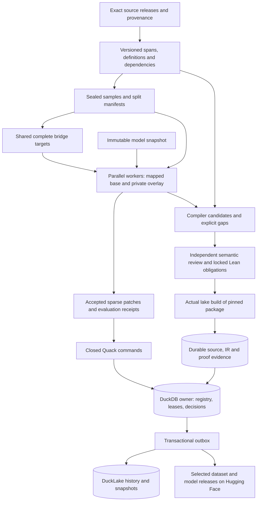

# Federal-law training and formalization: shared targets, sparse updates, Arrow weights

Status: original implementation sequence, audited 2026-09-25, with scoped
implementation updates through 2026-09-27 against the
`/home/barberb/lift_coding/external/ipfs_datasets` working tree. This document
extends the [U.S. Code master plan](US_CODE_AUTOFORMALIZATION_PLAN.md) and
[DuckDB/Quack + DuckLake training plan](AUTOENCODER_DUCKDB_DUCKLAKE_TRAINING_PLAN.md).
It incorporates the [implemented first control-plane milestone](../reports/autoencoder_control_plane_phase1.md).
The reports below identify implemented and measured slices; the complete plan
is not yet delivered. Historical measurements retain their original scope.

Current training priority (2026-09-26): qualify
[incremental target hydration](../reports/autoencoder_streamed_target_reduction.md)
behind the existing default-off reduction option. Historical reduction lowered
retained memory but still hydrated the entire rich-target batch first. The new
two-pass path preserves complete validation and all-or-none fallback while
retaining one rich target at a time. Extra decoding and GC work are explicit
costs. All 222 selected offline cases passed with stable provenance guards;
object-lifetime checks cannot authorize higher concurrency or a native speed
claim. Native comparison remains deferred.

The
[campaign owned-dispatch design](AUTOENCODER_CAMPAIGN_OWNED_DISPATCH_PLAN.md)
preserves exact v8 job settings through owner-supervised parallel execution.
Keep shared targets and Arrow buffers local, submit immutable artifact
descriptors through Quack, and retain independent sparse replay before version
registration. A daemon input handoff alone does not execute the sealed training
job. The design separates that optional provenance mapping from the
behavior-preserving worker path and gives implementation order, costs and
acceptance cases.

The [complete declared U.S. Code source export](../reports/autoencoder_uscode_corpus_export.md)
now preserves all 62,931 physical rows, aliases, frozen splits and embedding
dispositions in portable, DuckDB-queryable Parquet. Its fresh guarded capture
passed 392 tests and independently regenerated every exported row. Source export
took 35.194 seconds and readback 41.694 seconds; these are source I/O observations,
not training or legal-IR speed claims.

The [persistent source catalog](../reports/source_corpus_catalog.md) now owns the
complete source package and materializes all 62,931 rows in a separate DuckDB
catalog, with immutable dataset/language/version bindings, exact resume and
bounded reads. All 432 selected tests and full independent reopened readback
passed. Adding an upper ordinal bound reduced observed whole catalog work from
593.306 to 264.436 seconds; caches were uncontrolled,
so this is a source I/O observation. The database costs
986,460,160 bytes plus a
263,671,066-byte package per physical
release. Numeric weights and shared targets remain local to training workers.
The [source delivery adapter](../reports/source_corpus_delivery.md) now adds a
bounded, durable Quack submission profile, a shared package binding, an isolated
native DuckLake source table and an offline Hugging Face release plan. On
2026-09-27, all 783 selected tests passed and independent reopened readback
preserved all 62,931 rows and 33 fields. The native sink occupies 197,307,549 bytes;
the complete delivery check took 234.845 seconds with uncontrolled filesystem
caches. The plan includes all 103 package files, including its manifest. No Hub
upload or native Quack listener ran. Production delivery, official source
coverage, Constitution integration and actual Lake formalization remain separate
gates; native model and training qualification remains deferred.

The [B1 preparation code](../reports/autoencoder_campaign_owned_preparation.md)
now seals exact selected v8 jobs and atomically binds them without claiming or
executing runs. All 338 bounded offline regression tests passed on the captured
source revision, with no failures, errors or skips. These synthetic control tests
qualify preparation, journal and resource contracts, not full-corpus or native
training. [B2 owned worker supervision](../reports/autoencoder_campaign_owned_execution.md)
subsequently passed 486 guarded offline cases. [B3 campaign Quack control](../reports/autoencoder_campaign_quack_control.md)
passed 208 guarded offline cases, including the exact authorized 24-hour deadline
identity check. The profile accepts
only immutable request descriptors; an explicit owner drain performs the original
jobs through shared targets, accepted sparse updates and optional local Arrow
weights. Native training, listener qualification, production DuckLake delivery
and Hugging Face publication remain separate work.

The [final combined integration capture](../reports/autoencoder_campaign_integration_validation.md)
passed 580 selected offline tests, including those 338 B1 cases, with stable
source/dependency guards and a released reservation. It retains the original
per-case semantic baselines, restores prohibition exceptions and explicitly
qualifies the gold-supported 24-hour deadline addition. The typed codec observes
0.920 forward/end-to-end and 1.000 cycle; the separate canonical cycle limitation
and typed copy-risk flag remain disclosed. This is no full-corpus, native or
legal-admission result. It predates the B2/B3 implementation reports above.

The earlier runtime prerequisite was storage headroom: at 2026-09-26
16:36:44 UTC, observed named-root bytes plus retained reservations totaled
50,033,977,864 against the unchanged 50,000,000,000-byte limit. No reservation,
cleanup or runtime validation was attempted at that stage. Native validation
remains deferred. Continue source/split, semantic-family and offline release
design work without interpreting control-plane progress as legal coverage.
The Constitution remains unformalized; only `lake build <Lib>` is a Lean admit.
The later B1 capacity check at 17:02:06 UTC found 50,067,331,746 charged bytes,
67,331,746 above the then-unchanged limit. The user subsequently authorized a
60 GB campaign cap. Its explicit ledger migration preserved every historical
record and retained claim. The
[guarded B1 audit](../reports/evidence/autoencoder_control_plane_plan/campaign-owned-preparation-audit-20260926-r1.json)
then passed with unchanged package/dependency/protected-input guards, and released
its fresh 50 MB reservation and host lease. The request's per-worker 50 GB bound
stays unchanged. No model, training, bridge-speed, source-authority or legal
coverage claim follows from these offline tests.

Implementation update: the [shared-target, sparse-patch and Arrow feature-table milestone](../reports/autoencoder_shared_targets_sparse_arrow.md)
implements and measures the first bounded slice. It includes source-selector
and Constitution identity fixes, but does not complete the corpus manifest,
streaming, all-weight, production storage or publication phases below.

The next [target-bundle milestone](../reports/autoencoder_target_bundles.md)
adds lossless per-target compression, a shared manifest, bounded rich-target
preparation and requested-only hydration through the same staged-artifact path.
Corpus-wide source/split manifests and an index of bounded bundles remain
separate prerequisites.

The [sparse-persistence milestone](../reports/autoencoder_sparse_checkpoint_persistence.md)
adds opt-in v3 manifest versions, exact parent/patch reconstruction, resumed
jobs and owner-controlled full compaction. Full-state hashing and synchronous
owner replay remain explicit costs; this does not complete the corpus or
publication phases.

The [verified-batch milestone](../reports/autoencoder_verified_corpus_batches.md)
adds opt-in v4 source/sample/split manifests and removes weight reconstruction
from checkpoint dependency preparation. Worker and owner semantic replay remain
mandatory. These are bounded batch contracts; the campaign-wide source index,
global splits and source-aware Constitution training frontend remain pending.

The [pinned-source and frozen-index milestone](../reports/autoencoder_uscode_source_index.md)
adds strict release/wrapper readers, exact source/vector joins and immutable
split assignments across batches. A native audit verified one 1,491-row source
and vector shard and froze a 64-record diagnostic selection. All 1,491 vectors
lack exact input/producer bindings and remain ineligible for corpus training.
The subsequent [v5 durable-index milestone](../reports/autoencoder_indexed_training_jobs.md)
enforces that index in owner and worker, pins it in immutable variant metadata,
and requires explicit validation membership. Two native verifier processes
agree with the owner before and after restart; all 39 archived v1–v4 job
payloads retain their identities. The [native embedding and v6 milestone](../reports/autoencoder_native_embedding_production.md)
now binds exact local producer outputs through both owner and worker. On the
same 64 source rows, 51 produced vectors and 13 exceeded the unchanged token
limit. The retained 43 training, 3 validation and 5 holdout rows preserve their
original assignments; the original canary is excluded for length. This is
bounded input qualification, without new autoencoder training or a canary
claim. Full-inventory split freezing and official-source authentication remain
pending; all 1,491 published vectors remain unqualified.

The [declared-release source inventory](../reports/autoencoder_uscode_source_inventory.md)
now connects whole-release source accounting to the existing bounded input
extractor. Its final offline scan verified 16 pinned corpus shards and all
62,931 declared rows, then materialized three exact inputs; 275 checks and source
guards passed, including the mixed duplicate-wrapper accounting correction.
No embeddings or training were performed. That milestone left source partitions
and a bound set of producer receipts for subsequent integration; official-source
and full-federal coverage are not established.

The subsequent [source-partition milestone](../reports/autoencoder_source_partitions.md)
freezes all 62,931 physical rows into 59,511 connected groups before embedding
exclusions and preserves 62,839 unique input identities with their aliases.
It passes 362 offline checks and exact source materialization. The new codec
does not replace the embedding-bearing v1 index or qualify a native held-out
result. Explicit v8 owner/worker/daemon binding is now implemented as described
below; existing legacy contracts and the native-validation deferral remain
unchanged.

The [producer receipt-set codec](../reports/autoencoder_embedding_receipt_sets.md)
now supplies exhaustive campaign membership across bounded leaf receipts with
one exact producer profile, preserving unattempted inputs, excluded rows and
physical aliases. Selected record checks retain exact original leaf provenance
and source-partition authorization. Its 440 offline tests and archived-receipt
probe passed: all 62,839 unique inputs remain counted, with 51 embedded, 13
over-length and 62,775 unattempted. The 9.6 MB root is bookkeeping, not trained
weights; its 3.12-second reopen and 0.046-second selected-record check establish
no training speedup. It grants no training authority or formalization status.
Seal roots at campaign
boundaries and store exact references through DuckDB/Quack; root metadata is
not a payload to rewrite for every sparse weight update. Retry selection is
currently whole-leaf, and production DuckLake/HF delivery remains separate work.

The [produced-record projection milestone](../reports/autoencoder_produced_record_projection.md)
now binds bounded manifests to those campaign roots with exact ordered training
and validation roles and original producer provenance. Its 590-test offline
capture and immediate source/checkpoint guard pass. A six-record archived batch
produced a 9,566-byte projection: metadata reopen took 0.46 ms with roots already
loaded, and fresh selected batch verification took 114 ms. The full campaign
denominator remains unchanged. No training, native producer execution or new
formalization occurred. The separate v8 job/owner/daemon bindings are now
implemented below. A new multi-receipt Arrow input contract remains future work;
the existing single-receipt schemas are unchanged.

The [v8 campaign-job integration](../reports/autoencoder_campaign_training_jobs.md)
connects those immutable roots to worker, owner and offline daemon inputs without
a SQL migration. It preserves existing shared targets, sparse candidates and
optional Arrow feature weights; multi-receipt inputs remain Python lists. All
441 focused offline tests passed, and a separate archived-data probe verified
48 legacy job identities plus a six-record DuckDB handoff. These captures do
not form one qualified same-source run: external supervisor edits intervened,
and the artifact audit's final resource scan lost a concurrently removed pytest
directory. The status receipt explicitly remains unsuccessful for combined
qualification. No native training or production activation occurred.
The historical probe measured 7.63 s for input verification and 22.92 s for owner
export including verification; these are preparation timings, not bridge-on
evaluation results. The
[prepared-input follow-up](../reports/autoencoder_prepared_campaign_inputs.md)
now reuses a private one-use, full-job-bound context within one owner operation,
retaining fresh metadata and selected-byte guards. It adds no persistent cache
or wire-schema change. All 605 offline regressions passed in capture-r1, but a
concurrent `supervisor_loop.py` edit invalidated the subsequent artifact probe's
whole-package guard. Its logged timing comparison remains unqualified. Fresh
bounded capture-r2 now passes all 605 tests and the six-record artifact probe
on the same unchanged 7,759-source snapshot, with protected artifacts unchanged
and its resource claim released. A/B/B/A under current validators measured
median owner preparation of 15.518037 seconds with deliberate recomputation
versus 7.864813 seconds with reuse (1.973097×; two observations per path), with
exact returned bindings. This is preparation evidence, not training throughput.
The accompanying resource fix tolerates only
confirmed descendant deletion in nonstrict shared-root scans; strict attempts,
root identities, quotas and failed claims retain their guards. Select further
work from qualified phase and memory costs rather than assuming a broader cache
is needed. Native validation remains deferred.

Following the [campaign preparation profile](../reports/autoencoder_campaign_preflight_profile.md),
the [campaign workflow integration](../reports/autoencoder_campaign_workflow.md)
now connects verified v6 and v8 inline inputs to the training cycle and learned
feedback. A shared helper validates both roles, stages the complete selected
artifact closure and retains immutable campaign-root bindings. Feedback uses
exact ordered training record IDs, excludes validation records and rejects
cycle selections above 128 records before training. Owner and worker verification
remain authoritative; helper-source and compiler-source guards protect selection
and repair dispatch. Mapped v7 inputs remain outside this feedback path.

Fresh bounded capture-r3 passed 82 offline tests: 35 existing cases and 47 new
cases covering cycle inputs (18), feedback (18) and combined storage (11).
The archived six-record probe retained exact verification and ordered membership
for three training and three validation records. All closeout checks passed
on the same unchanged snapshot of 7,760 package sources and 901 dependency sources,
and the resource claim was released. Combined cases exercise actual shared-target
codecs, sparse candidate replay and optional Arrow feature weights across
independent branches and restart/resume. Their injected updates and immediate
executor establish no native optimizer improvement or parallel throughput.
Earlier failed attempts remain separate in the linked report. Arrow stays
optional, native validation remains deferred, and multi-receipt Arrow inputs
and complete transitive publication support still require separate contracts.

The [immutable campaign-plan milestone](../reports/autoencoder_campaign_plan.md)
now binds already registered v8 jobs to exact ordered batches, shared roots,
variant/configuration identities, parent policy and coverage denominators.
Durable completion lookup checks registry operation history; the inspector
additionally verifies current receipts, accepted-patch replay, sparse ancestry
and compaction. Bounded dispatch skips verified completed jobs and stops on
ambiguous attempts. All 375 offline tests and the archived six-record plan/restart
probe passed on the same 7,761-source revision, followed by 57 passing closeout
checks and resource release. The probe uses an explicit three-byte checkpoint
fixture; test updates are injected. No native training speedup is established.
Fresh per-job verification remains mandatory; the later root-reuse milestone
below amortizes decoding within one preparation call.
Bounded generation from sealed membership is implemented in the following
milestone; complete offline publication and restore remain outstanding. An
adapter from plans to owned Quack prepared handles is separate work; native handle preparation and
fresh checkpoint qualification remain deferred.

The [deterministic batch generator](../reports/autoencoder_campaign_batches.md)
now prepares and registers v8 jobs from those frozen roots. It deduplicates
source aliases, uses fixed training boundaries and validation membership, and
records every eligible input's status and disposition. Stable operation IDs
support partial-registration recovery and overlapping pages without resetting
prior runs. All 348 offline tests, the archived-source probe and 67 closeout
checks passed on one unchanged revision. The probe generated three queued jobs
with 16/16/8 training records and seven shared validation records, covering all
40 currently embedded training inputs while excluding four embedded holdout
inputs. Repeat and owner restart retained exact jobs, plan, queued runs and head.
These use a synthetic checkpoint fixture and establish no optimizer improvement.
Three-job preparation took 66.12 seconds and inspection 24.46 seconds; these
are control-plane observations, not training or bridge-on speed measurements.
The subsequent profile and root-reuse milestone below isolate and reduce
repeated metadata decoding while preserving fresh per-job checks. The
23.66 MB exhaustive generation manifest also has a per-page storage cost.
Qualify a complete offline campaign publication-and-restore closure in parallel;
shared-target runtime membership, native qualification and remote publication
remain separate requirements.

The [offline campaign publication design](../reports/autoencoder_campaign_publication_plan.md)
distinguishes a selected page's exact job closure from the full source campaign.
The proposed first package includes template-only dependencies and preserves
original job identities, while restore writes evidence files without creating
execution authority. Complete upstream payloads, portable executable import
and remote upload remain later work; none is claimed as implemented.

The [qualified batch-preparation profile](../reports/autoencoder_campaign_batches_profile.md)
now attributes 60.44 of 67.29 instrumented seconds (89.82%) to repeated root
loading: eight inventory, partition and receipt-set loads each. The exact
archived data contracts and all provenance guards passed, followed by 33
independent closeout checks. This historical profile is preparation attribution,
without a speedup, optimizer or formalization claim.

The [operation-local root reuse](../reports/autoencoder_campaign_root_reuse.md)
follow-up passed 682 offline tests and a guarded uninstrumented A/B/B/A
comparison using the same current validators. Repeated preparation of one
primed three-job page fell from a 66.324950-second median to 15.117741 seconds
(4.387226×, two observations per mode), preserving exact current artifacts,
archived data contracts and queued state. All per-job roles, selected-byte,
configuration and drift checks remain; public worker/owner verification and
every restarted call load fresh roots. No persistent or leaf cache was added.
All 47 [independent closeout checks](../reports/evidence/autoencoder_control_plane_plan/campaign-root-reuse-closeout-20260926-r2.json)
passed. This qualifies repeated preparation only, not first-registration
throughput, per-mode memory savings or native training.

The [produced-corpus Arrow milestone](../reports/autoencoder_produced_corpus_arrow_training.md)
now executes v6/v7 training on a fixed three-training/three-validation subset,
with shared complete targets, sparse candidate persistence and optional mapped
inputs/feature weights. Shared-target job time fell from 87.00 seconds to a
22.93-second median; mapped inputs did not improve complete-job time. Two
mapped candidates completed in 25.51 seconds concurrently. Every trial retained
the same optimizer rejection; this qualifies efficiency and exact behavior,
not a weight improvement or held-out canary. Expanded source coverage and
accepted corpus-training improvement remain outstanding.

The [shared-target evaluation milestone](../reports/autoencoder_shared_target_evaluation.md)
removes redundant native target serialization and repeated compilation of modal
regex programs. One controlled same-bundle pair reduced bridge-on evaluation
from 5.24 to 2.56 seconds for three targets, with exact triples, captures,
losses and optimizer decisions. The eight-job native owner benchmark passed;
all updates remained rejected. A later replication stopped on a concurrent
producer-source change and is explicitly not a passing batch. Regenerated
targets also contain additional bridge output and cost more to hydrate, so
historical complete-job comparisons are not exact target comparisons. Next
preserve adapter failure reasons, stabilize producer revisions, and profile
bounded hydration/ontology reuse before extending numeric mapping.

The [target-failure telemetry milestone](../reports/autoencoder_target_failure_telemetry.md)
now retains exact adapter failures and unknown outer-timeout dispositions in
preparation receipts, without changing target bytes or the meaning of `ready`.
A proposed hydration shortcut passed semantic parity checks but regressed
unprofiled throughput on two archived target sizes and was reverted. The
[ontology reuse design](../reports/autoencoder_ontology_capture_reuse_design.md)
requires explicit partial-failure handling, raw ordered IR identity and detached
results before reuse. The observed one-epoch schedule has nine captures across
six distinct samples, so at most three captures are reusable in that schedule;
this is an opportunity bound, not a speed measurement. Stable producer sources
and current semantic guards remain prerequisites for further qualification.

The [ontology-observation milestone](../reports/autoencoder_ontology_observation.md)
now records bounded capture stages, exceptions and converter-result failures in
worker receipts, without enabling result reuse. A stable editing window allowed
fresh six-target preparation and one normal combined Arrow job to pass owner
restart and receipt-durability checks: 23.76 seconds per job, or 7.92 seconds per
training span; initial three-target bridge evaluation took 4.03 seconds. All
262 focused checks pass, and nine captured records exactly match saved original
helpers. The optimizer still rejects the update. Measured repeated capture work
offers at most about 1.49 seconds before reuse-guard costs in this schedule;
target hydration remains larger. Transitive silent parser failures still need
explicit treatment before caching capture results.

The [bounded hydration GC update](../reports/autoencoder_target_hydration_gc.md)
adds an opt-in policy for isolated native bundle workers. Two counterbalanced
archived-codec pairs reduced six-target hydration including cleanup from a
7.24-second median to 2.59 seconds, with exact target parity and similar memory
use. Public loaders retain their ordinary policy, and full target validation
remains mandatory. Four native combined Arrow/sparse jobs then qualified the
option: median owner time fell from 23.64 to 19.73 seconds (7.88 to 6.58 seconds
per training span), with exact metrics/state parity and zero accepted updates.
Bridge evaluation remained about four seconds for three targets. The option
stays off by default. External edits after the passing qualification make that
sealed bundle stale for later sources; regenerate it before new training.

The [cold target profiles](../reports/autoencoder_cold_target_profile.md)
now separate first-use generation from shared-target training. On the same
six source-bound rows, modal-frame evaluation consumed 50.87 of 51.58 adapter
seconds; decompilation, F-logic processing and reconstructed-text encoding are
the main inner costs. Complete preparation took about 10.1 seconds per span.
Both diagnostic runs retained all five bridges and passed source guards.
Document serialization and repeated loss-vector calls were small. Prioritize
bounded text-processing work and target reuse before broader weight mapping;
these profiles do not establish a new native speedup or formalization.

The subsequent [native prefix-dispatch change](../reports/autoencoder_frame_prefix_dispatch.md)
reduces median six-span cold preparation from 61.13 to 59.90 seconds in two
counterbalanced pairs. All five bridges and 210 focused checks remain green.
Content comparison preserves the existing per-run graph timestamps and checks
every other ordered target value. This small producer improvement complements
shared-target reuse; it does not establish a new checkpoint-evaluation speed
or an accepted weight update. The [archived encoding GC experiment](../reports/autoencoder_target_encoding_gc_diagnostic.md)
remains diagnostic, with production writer policy unchanged.

The [invocation-local surface text change](../reports/autoencoder_surface_text_reuse.md)
addresses the next measured decompiler duplicate: two renderers repeatedly
classify the same text for each target family. It reuses only the fixed text
scan within one reconstruction call, preserving dynamic metadata/helpers and
complete ordered output. Synthetic parity and timing are separate from fresh
complete-target and bridge-on qualification, which remain deferred. Producer
provenance must still match before any historical target bundle is reused.
Qualification remains outstanding: the current typed-deontic pilot is
0.9116666666 forward, below its unchanged 0.915 requirement. The three requested
gates pass, but the concurrent parser's lost typed exception slots and the
existing exact temporal-value assertion must be resolved separately. Synthetic
modal parity does not waive either failure.

The [worker-private target-retention update](../reports/autoencoder_worker_target_reduction.md)
now releases fully validated native target graphs before training, retaining
immutable evaluator values and their exact document hashes. Four same-bundle
jobs preserve metrics, state and rejection decisions. Median memory before
training falls from 1,451 to 682 MiB and three-target bridge evaluation from
4.16 to 3.48 seconds. Complete owner time changes from 19.73 to 19.05 seconds,
with one pair slightly slower; keep the option off by default and treat its
largest established benefit as retained memory. All 460 distinct checks pass.
Full hydration still reaches roughly 1.5 GiB, so its peak remains a concurrency
constraint. Actual daemon artifact/owner integration and accepted corpus
improvement remain separate work.

The [source-bound entity v2 path](../reports/entity_source_bound_resume.md) now
commits exact input prefixes with queue updates, preserves claim tokens and
streams Arrow batches through DuckDB for resume validation. All 132 selected
offline cases passed with unchanged captured source/dependency bytes and a
released reservation; the preserved 24-hour deadline and exception gates remain
green. A separate read-only census measured 180,257 entities, 120,136
relationships and 360,516 legacy resume rows. V2 requires a fresh cache and its
own snapshot namespace. Full-source v2 throughput/reopen and actual Hub delivery
remain unqualified; this is not a training speedup or legal-admission result.
The proposed 750 MB full-source capture needs 1.505 GB of campaign headroom;
the successful audit's release observed only about 451 MB under the 60 GB cap.
Failed claims remain retained and native model validation remains deferred.

The user authorized a further campaign-cap increase to 62,000,000,000 bytes on
2026-09-27 for full-source entity validation. The explicit locked migration
preserved all 75 reservation records (29 retained, 46 released), every root
identity and the protected checkpoint. The per-worker 50 GB bound is unchanged.
The [cap qualification and full-source attempt](../reports/campaign_storage_cap_62gb.md)
passed all five cap/migration tests. The later 750 MB / 1 GiB / one-CPU full-source
attempt failed on child RSS and also exposed a CLI-output decoding error before
independent readback. Its artifacts and 750 MB claim remain retained; the run is
not a full-source validation or speed result. Bounded Parquet export and harness
repairs precede any fresh comparison. Native training and Hub uploads remain
deferred; the Constitution remains unformalized.

## 1. Decision and intended outcome

The latest [production-adoption audit](../reports/autoencoder_daemon_production_adoption_audit.md)
makes the next boundary concrete: verified local corpus inputs with frozen
sampling roles, then complete registry-bound daemon candidates, then sparse
persistence after every cycle mutation is covered. The current daemon still
uses mock vectors on its ordinary input path. Projection patches alone omit
later TODO/guidance/compaction mutations. The bounded opt-in mapped-input path
now detaches vectors at asynchronous snapshot-copy boundaries; a complete native
owner v7 cycle and cost comparison remain unqualified. The
[isolated native DuckLake consumer and compact package update](../reports/autoencoder_ducklake_delivery_and_compact_release.md)
now supplies bounded durable metadata delivery and exact offline full-checkpoint
packaging. Production DuckLake activation and the HF publication consumer remain
integration gates, not missing worker primitives.

The [verified daemon input slice](../reports/autoencoder_daemon_verified_inputs.md)
adds opt-in owner-exported local v6 inputs and frozen role sampling to that
sequence. The daemon verifies immutable artifacts offline and uses exact
native list vectors, preserving asynchronous copy behavior. Registration binds
inputs without granting checkpoint or promotion authority. Complete cycle
candidate adoption and sparse coverage of all later mutations remain next.
Its 384-check regression and actual offline startup pass on their captured
revision. A subsequent guarded native cycle now passes through actual sampling,
four three-target optimizer evaluations, both five-bridge diagnostic passes,
default asynchronous snapshot completion and durable final checkpoint writing.
Main plus shutdown takes 133.940 seconds for three training and three validation
records. The single projection attempt is rejected and complete decoded state
remains unchanged. All 31 mandatory gate/pilot checks pass again on that same
captured source revision. This establishes the input execution path, without a
speed, accepted improvement or admission claim. The
[owned-invocation plan](AUTOENCODER_DAEMON_OWNED_INVOCATION_PLAN.md)
specifies the owner lease and final-candidate boundary before sparse replay.
That [owner invocation slice is now implemented](../reports/autoencoder_daemon_owned_invocation.md),
with 635 passing guarded regression checks and unchanged package sources during
validation. It binds actual supported daemon settings, a durable operation
journal and independently loaded full final checkpoint; warm starts and unbound
external guidance are explicitly refused. The retained first native attempt
stopped at resource preflight with no trainer CPU capacity,
before input export or actual main, without retrying under a weaker guard.
The wrapper's incorrect `TRAINER` lane selection is corrected to the existing
canonical-trainer `HAMMER_LEAN` policy, with no capacity/reservation change.
A guarded 140-check follow-up passes. Native r2 then qualified the owner lifecycle
for the exact three-training/three-validation, zero-update slice: actual main,
independent staged full-checkpoint verification, one candidate version/event and
identical owner-restart replay, with unchanged head and logical state. Main plus
shutdown took 135.480 s; full qualification took 191.251 s. The r1 failure is
retained. This supplies no native changed-state, learning, general canary or
speed-improvement claim.
The earlier unleased, zero-update input cycle does not qualify this new boundary.

The [offline complete-state sparse shadow](../reports/autoencoder_daemon_sparse_shadow.md)
now passes exact replay of all 38 raw native fields, revisions and canonical
state identities for the historical zero-update owner candidate and an archived
six-scalar change. Their patches are 1,459 and 2,916 bytes; case wall times are
12.33855 and 9.45630 s, with 29.60585 s total including guards. The zero-update
compact bytes are reproduced exactly. The guarded combined suite passes 250
checks in 10.93 s pytest / 13.143 s wrapper with unchanged sources. No new
training or evaluation occurred, and these measurements establish no speedup.
The archived accepted epoch used three in-sample gate sentences and reloads at
legacy revision zero; native owner changed-state capture remains unproven. This net-difference
diagnostic grants no current owner authority, admission or publication. Live
mutation capture, recovery and sparse authority remain separate gates; the full
checkpoints remain authoritative.

The [owner-integrated shadow](../reports/autoencoder_daemon_owned_shadow.md) now
adds default-off `prepare_daemon_invocation(..., sparse_shadow=True)`. This seals
a closed v2 request while preserving ordinary v1. After ordinary full-candidate
verification, the real verifier returns nested shadow evidence; the owner stages
`sparse_shadow_patch` and `sparse_shadow_receipt` and retains their references in
historical completion replay. The full candidate remains authoritative. The
guarded production suite passes 515 checks and the harness passes 25 checks.
[Hybrid r2 qualification](../reports/evidence/autoencoder_control_plane_plan/owned-daemon-shadow-20260925-r2.json)
passed real describe/verify subprocesses, full-candidate owner completion and
exact restart replay around an explicitly synthetic execute boundary. Its one
direct scalar insertion has zero accepted epochs and
`evaluation_matches_final=False`. The
[failed r1](../reports/evidence/autoencoder_control_plane_plan/owned-daemon-shadow-20260925-r1.json)
remains preserved: the environment guard rejected an early fixture runner
import before checkpoint copying or mutation. Corrected import order and a
subprocess regression preserve that guard. The earlier offline shadow
measurements remain historical; this integration does not establish native
changed-state learning.

The [DuckLake delivery and compact release slice](../reports/autoencoder_ducklake_delivery_and_compact_release.md)
uses the installed pinned native engine in a fresh isolated catalog and
DATA_PATH, preserving event/marker atomicity within DuckLake and reconciling
owner acknowledgements through a durable journal. Batches are at most ten
events/1 MiB; the default namespace cap is 256 MiB. Full checkpoints and weights
remain in CAS. Registry/HF focused checks pass 69/93 cases and native sink/consumer
checks pass 57/18, including bounded process kill/restart recovery; combined
storage/packaging r2 passes 558 checks across 14 test files in 167.97 s pytest /
170.354915 s wrapper. All 7,739 package Python sources, selected tests and
protected artifacts remain unchanged. The failed r1 and test-only HF fixture
correction are retained in the report; the publisher guard is unchanged.
The existing 1,664,643-byte,
zero-update owner candidate packages twice identically, with all 38 fields,
revision and original compact bytes preserved. This is offline storage evidence,
not fresh training, evaluation, publication or formalization. Production DQK
gates and remote Quack adaptation remain pending; native training validation
remains deferred at the user's request.

The [daemon checkpoint-baseline implementation](../reports/autoencoder_daemon_checkpoint_baselines.md)
removes the retained full previous-state copy and repeated prior-endpoint
normalization from component-delta persistence. Tokens come from the already
serialized endpoint and advance after successful enqueue; existing byte formats,
replay/drain checks and full-candidate authority remain. The combined fixture
capture passes 651 checks across 20 files, with all 7,739 canonical Python
sources, selected tests and protected artifacts unchanged. Exact bytes are
compared against the saved pre-change serializer for both precisions and all
38 components; real writer/main fixtures cover multi-cycle and failure recovery.
This does not introduce row-sparse daemon checkpoints or establish an end-to-end
speed or concurrency improvement; native training validation remains deferred.

The [checkpoint packing and writer release change](../reports/autoencoder_checkpoint_numeric_packing.md)
batches up to 4,096 numeric values while preserving the existing encoded bytes
and scalar failure order. Idle writer threads now release completed payloads
and observers when their reservations are released. A bounded synthetic profile
observed full-snapshot medians of 0.766460 to 0.742861 seconds for float64 and
0.254016 to 0.224379 seconds for float32, with two observations per arm and
precision. Compression and current-endpoint normalization remain larger costs;
this does not establish an end-to-end training or bridge-evaluation speedup.
Native validation remains deferred. The linked report records the regression
results and the unchanged full-checkpoint and Lake authority boundaries.

The [checkpoint field-validation change](../reports/autoencoder_checkpoint_field_validation.md)
removes full weight-table copies used only to enumerate the native checkpoint's
40 field names. Worker and sparse resolver checks now share the fixed schema
contract; loader normalization, mapped-row reconciliation, sparse job-boundary
reloads and independent owner replay remain. In a synthetic 131,072-value mapped
fixture, this single check avoids reading all 2,048 rows and reduces its traced
peak allocation from 4,502,369 to 272 bytes. This local allocation result does
not qualify native throughput or alter Arrow/sparse defaults. The combined
regression passes 812 checks with all 7,743 canonical package sources, selected
tests and protected artifacts unchanged during capture. Native validation
remains deferred; the linked report records evidence and limitations.

The [single-serialization compaction change](../reports/autoencoder_sparse_compaction_serialization.md)
removes a second full-state serialization when the owner compacts a verified
sparse chain. The owner writes one private candidate, checks its byte identity
against the unchanged receipt/manifest conditions, and only then stages it.
The synthetic serialization-plus-fsync slice measured 58.554 to 31.996 ms with
identical bytes; replay, staging, completion and training are outside that
measurement. The combined regression passes 531 checks with all 7,743 canonical
package sources, selected tests and protected artifacts unchanged during capture.
Compaction policy, full-checkpoint authority and sparse/Arrow defaults remain
unchanged. Native validation remains deferred.

The [completion-liveness change](../reports/autoencoder_completion_liveness.md)
moves receipt verification, sparse replay and artifact staging to one serial
owner-side preparation thread while the calling owner renews every active run.
Finished workers retain their dispatch slots through finalization, and lost
leases quarantine only their own results. Database commands and final completion
checks stay on the owner thread. This prevents an avoidable parallel-training
lease stall without adding concurrent replay graphs or changing acceptance.
Final `CompleteRun` hashing remains synchronous; native throughput and transport
qualification remain deferred. The combined regression passes 541 checks with
all 7,743 package sources, selected tests and protected artifacts unchanged
during capture. The linked report distinguishes cooperative liveness from a
hard deadline guarantee and retains the earlier parser-drift failure.

The [sparse-shadow endpoint reuse change](../reports/autoencoder_shadow_endpoint_reuse.md)
lets the opted-in independent verifier consume its original loaded base and
candidate for diagnostic capture. It reduces full checkpoint hydration from
five loads to three while preserving the independent replay-base load, raw
38-component comparison and exact compact-candidate bytes. The private holder
rechecks descriptors, original revisions and metadata, and releases the base
before replay. Default/off behavior, public shadow loading and full-checkpoint
authority remain unchanged. A stable-source synthetic storage profile measured
1.656 to 1.409 seconds (14.9% lower), with exact patch/evidence parity and three
observations per path; this is not native throughput or an RSS-saving claim.
All 504 combined tests passed, but concurrent edits to three canonical logic
files invalidated that capture's whole-package provenance guard. The failed
receipt is retained; combined qualification remains pending. Earlier focused
tests and the profile retain their own stable-source scope. Native validation
remains deferred.

Implement **shared complete targets first, accepted sparse updates second,
Arrow-backed inputs and weights third**. Reuse the dedicated DuckDB owner,
closed Quack commands, immutable model registry, existing DuckLake contracts,
and Hugging Face publication machinery. Keep remote SQL out of the training
inner loop: workers read immutable local snapshots and write private overlays;
they submit sealed updates and receipts to the owner.

In parallel, build a source-complete federal-law inventory and expand reviewed
semantic support. The deliverable is a reproducible database and HF release
that accounts for every selected source unit, preserves each interpretation
and attempt, and exposes the exact subset supported by actual Lake evidence.
Entire-corpus formalization remains the objective; model training and storage
alone cannot deliver it. Unsupported semantics remain visible work, including
all Constitution gaps.

The initial release scope is one exact U.S. Code release plus an explicitly
versioned Constitution source set, including amendments and historical
relationships. The Code covers general and permanent federal laws; positive-law
status and edition/supplement distinctions matter. It is not by itself an
inventory of every federal legal authority. Preserve unresolved dependencies
on session laws, regulations and other authority, and expand those corpora
through separate source manifests. [GovInfo's U.S. Code guide](https://www.govinfo.gov/help/uscode)
and the [National Archives Constitution collection](https://www.archives.gov/founding-docs/constitution)
are source-policy references, not substitutes for acquired, checksummed inputs.

Non-negotiable constraints throughout this plan:

- **Only `lake build <Lib>` is a Lean admit.** A compile, decompiled sentence,
  autoencoder loss, bridge target, NCA cell, database row, source-corpus
  admission or model promotion is not an admit.
- No Mathlib, downloaded weights, larger context window, or temperature change
  from 0. Do not replace the bounded CPU backend without a supporting profile.
- Every process pins this workspace tree and calls
  `require_workspace_logic_tree()`. A process that imported HACC first must
  fail; no synchronized edits to HACC or `hallucinate_app`.
- Never mark a Constitution span `roundtrip_ok`. The Constitution remains
  `formalized=false`; candidate IR, gap analysis and research artifacts do not
  change that standing restriction.
- Preserve the restart12 checkpoint and its archival hardlink. Its size is
  25,895,338 bytes and SHA-256 is
  `1446cb1859ddf4ed40fb5576f6e320eece4cec268a008c5c07bffeaf959cd8dd`.
  Never substitute the unrelated 398 MB state or overwrite historical receipts.
- Retain the existing 50,000,000,000-byte ceiling, including scratch, WAL,
  materializations, caches and exports. Account for actual existing usage and
  reservations before choosing concurrency. Protected artifacts are not cleanup
  candidates.

## 2. What we can reuse, and what the evidence establishes

The current registry and coordinator already support independent versioned
jobs, durable operation receipts, leases, fences, artifact staging and an
outbox. Native Quack was tested as an isolated, worker-scoped prototype.
Native DuckLake Parquet write/reopen was demonstrated, but production catalog
activation and durable ingest adapters remain separate work. Current workers
support English, US jurisdiction and `typed_deontic_ir`; registering another
language does not qualify its parser or training frontend.

| Area | Current evidence | Consequence for this plan |
|---|---|---|
| Two independent training jobs | Sequential 30.366 s versus concurrent 15.449 s; six total training spans, 5.061 versus 2.575 s/span | Parallel candidate throughput is demonstrated on an in-sample fixture; individual evaluation is not 1.966 times faster |
| Initial bridge-on evaluation per job | 10.559–10.821 s for three samples, 3.520–3.607 s/span, three targets | Repeated target construction across jobs is the first opportunity |
| Earlier phase profile | Initial target evaluation 11.1298 s versus projection update 0.0673 s, three samples | Accelerating only the projection cannot remove most observed wall time |
| Restart12 representation | 740,212 numeric scalars including sample memory; 5,921,696 bytes of float64 values; estimated Python JSON graph about 43.19 MB | Shared numeric buffers may reduce private memory; these are not process RSS or speedup estimates |
| Constitution historical census | 231 spans: 62 nonoperative, 166 gaps, three inactive; zero compiled, zero `roundtrip_ok` | Preserve this receipt; fix measurement identity before establishing a new census |
| U.S. Code sealed source baseline | 60,077 rows, 60,068 canonical entries and nine recovery rows across 53 titles | Historical retrieval/source counts, not current-law span counts or Lean admits |

The two-job measurement used all five bridges, in this order:
`modal_frame_logic`, `deontic_norms`, `fol_tdfol`, `cec_dcec`,
`external_prover_router`; provers false, one bridge worker per process, metric
disk cache 0, initially empty process target caches, sample memory false,
`python_sparse_batch`, CUDA disabled and BLAS/OpenMP threads 1. Each job used
three identical train/validation samples, one epoch, one update family, one
line-search attempt and a 180-second cooperative limit. This is **in-sample**.
Fresh processes make target generation cold; OS file-cache warmth was not
controlled. Candidate bytes and numeric evaluations matched between serial
and parallel runs. [Benchmark receipt](../reports/evidence/autoencoder_control_plane_plan/parallel-training-20260925-r2.json).

The earlier phase profile used the same three-sentence/five-bridge CPU recipe;
profiling overhead affected some timeout behavior, so its phase split identifies
work to investigate, not a new wall-speed or semantic-equivalence result.
[Speed report](../reports/legal_autoformal_speed.md).

Do not use the six bridge-off June daemon receipts as legal-IR timings, the
different-sample integrated smoke as a speed baseline, or historical source
publication counts as proof counts. The original Constitution checkpoint run
has completed; retain its receipt rather than starting a duplicate historical
measurement. A corrected future run needs a new identity and receipt.
The historical three inactive Constitution spans reflect narrow repeal
recognition, including the Eighteenth Amendment; this is not a comprehensive
adjudication of constitutional applicability over time.

## 3. Architecture and authority boundaries



DuckDB owns small transactional control records and the durable legal evidence
catalog; exact source/IR/proof bytes must be retrievable after restart. DuckLake
holds queryable immutable history and snapshot membership in lifecycle-owned
Parquet. Immutable artifact storage retains large payloads. Arrow IPC is a
rebuildable local materialization, never a second authority. Hugging Face is a
versioned distribution destination; publication availability does not block
local training completion.

Use one owner for the DuckDB catalog and route writers through it. DuckLake's
catalog choice affects write concurrency; a DuckDB-backed catalog does not
license independent worker processes to write its file.
[DuckLake catalog guidance](https://ducklake.select/docs/stable/duckdb/usage/choosing_a_catalog_database).
Keep control transactions short. Hashing, patch replay, Parquet creation,
Arrow materialization and uploads happen outside them, followed by fenced
compare-and-swap registration.

Reuse production qualification boundaries DQK-088/094/102. The installed build
lacks the global `ducklake_auto_migration` setting assumed by an existing
contract; the probe used per-ATTACH `AUTOMATIC_MIGRATION false`. Reconcile that
adapter against the pinned extension bytes rather than bypassing checks or
upgrading extensions under running owners.

## 4. Prerequisite: correct source and sample identity

Fix these before sealing shared corpus targets. Retain an explicitly labeled
legacy benchmark lane where needed to compare old performance receipts.

| Audit finding | Implementation status and remaining acceptance check |
|---|---|
| The earlier Constitution runner reused one document ID and its first clause vocabulary | Source/version/span/ordinal identities and per-span vocabularies are now implemented and tested; retain the historical receipt unchanged |
| The earlier document aligner found normalized pieces with `text.find(part)` | Monotone raw-byte selectors and whitespace maps are now implemented and tested; carry these selectors into the selected corpus release and enumerate every compiler child |
| `compile_span` handles the first segmented clause | Corpus orchestration enumerates every child clause, records parent/child coverage and reconciles overlaps; no silently dropped remainder |
| `LegalSample` is US-Code-specific; Constitution uses a compatibility `US-CONST U.S.C.` citation | v4 manifests now supply explicit source-aware sidecars; the training adapter still needs replacement/qualification before Constitution corpus mode can run |
| Missing text can become a law name/citation; missing embeddings can become mock hashes | The strict pinned adapter now preserves exact text or a missing-text disposition, with no mock fallback; legacy loaders remain unqualified for corpus training |
| Embedding loader keeps the first vector per CID without validating chunk order | The strict adapter rejects ambiguous or missing joins; inspected published vectors remain training-ineligible. New local production binds actual tokens, exact output bits and source bytes; v6 requires that sidecar without retroactively relabeling published vectors |
| Existing HF corpus uses family/wrapper descriptors while a reader expects legacy columns | Direct-root descriptor, shard and wrapper validation now passes on one pinned 1,491-row source/vector pair; complete release closure and official-source provenance remain unverified |

Keep stable legal IDs distinct from content/version IDs. Reuse
`processors/legal_data/uscode_identity.py`; edition, appendix, note and granule
identity cannot be reduced to `(title, section)`. The all-title
`uscode_source_policy.py` contract already exists, but live acquisition and
materialization are not implemented by that contract. The Title-35-focused
connector remains a separate limitation.

Reconcile the historical source baseline, publisher receipts and the older
master plan's HF commit into one selected release manifest before training.
Record per-title expected/observed checksums, recovery dispositions and gaps.
Never merge different release points because they have the same citation.
Use official [OLRC downloads](https://uscode.house.gov/download/download.shtml)
and [USLM structure](https://github.com/usgpo/uslm/blob/main/USLM-User-Guide.md)
as acquisition contracts; discovery of a newer release is not verification of
its complete artifact closure.

Seal sample, split and code manifests with content hashes. Legacy worker
`dataset_snapshot_id` and `split_snapshot_id` remain caller labels; opt-in v4
corpus manifests now verify exact bounded-batch membership and source bytes
through the owner and worker. Extend this to the full source-release index,
using the implemented frozen index only within its explicitly verified
selection. Opt-in v5 jobs now bind that index in the durable owner/worker
contract and require the same pin across a registered variant's runs. It groups
document lineage, identical source artifacts and normalized content; it does
not establish semantic duplicate isolation or unseen checkpoint history.
Opt-in v6 adds an exact producer artifact to the job and immutable variant;
every supplied embedding must match a successful receipt row, including its
source and metadata. Owner and worker independently verify their batch's
source closure; the same receipt can serve several batches. The receipt
declares a native profile but does not cryptographically prove inference.
The dedicated offline audit separately records actual native production.
Bind full parser/compiler/
decompiler, grammar, bridge, sample-builder and relevant dependency contents,
including working-tree changes. Validate the tree at startup and detect source
changes in resident processes.

## 5. Shared targets: avoid repeating expensive preparation

### Implementation

The shared-target milestone added a full-fidelity `TargetSnapshot` codec/resolver near the training worker,
reusing `evaluate(..., legal_ir_targets=...)` and
`train_generalizable_projection(..., legal_ir_targets=...)` in
`modal_autoencoder.py`. Both accept target injection. The worker now supports
nonempty `target_snapshot_id` with verified staged artifacts; target bundles add
bounded complete-target shards. Extend this implemented path to the selected
source-release index and campaign-wide split manifests.

Preparation becomes a separately leased job:

1. Verify the source/sample manifest and construct parser/frame inputs once.
2. Build targets under the exact pinned bridge configuration.
3. Write bounded immutable shards outside database transactions, with one
   explicit result per requested sample and a complete failure inventory.
4. Seal ordered membership, payload hashes, target count, configuration and
   artifact closure; atomically mark the snapshot complete.
5. Workers load only their manifested slice and inject a mapping keyed by
   sample ID. Missing, duplicate, extra or mismatched records fail qualification
   or produce the declared failed-job disposition; no silent target skipping.

The mapping values must be hydrated compatible target objects, not arbitrary
decoded JSON dictionaries. `_legal_ir_target_payload` accesses losses,
distributions and document through attributes, while grammar helpers also
accept mappings. A dict-only decoder can preserve target count while silently
losing scoring inputs. Reconstruct `LegalIRTrainingTarget` or an explicitly
qualified richer interface, reject unsupported types, and test this failure
mode directly.

The durable identity binds original and normalized source, selectors, citation
and context dependencies, sample-builder profile, parser/frame settings, exact
embedding bytes/model/dimensions, ordered bridge names, prover flag/configuration/
timeouts, grammar and schema versions, and code/dependency content hashes.
Share across model versions only when target generation is state-independent.
If a future target producer uses model state, its version becomes part of the key.
Language and semantic-profile changes also require distinct compatible targets.

**The current metric cache is not this codec.**
`_legal_ir_target_cache_payload` and `LegalIRTrainingTarget.to_dict()` preserve
losses and document hashes but omit the complete document. The evaluator also
supports candidate IR, grammar validation/rejection paths, selected/masked
productions and structural/decompiler targets. Preserve every input consumed
by scoring and training, including richer target types, or reject unsupported
types explicitly. A summary payload must not silently become a weaker target.

Store raw captured document bytes and hashes, including timestamps, separately
from any versioned semantic identity. Existing fingerprints use file size/mtime,
process-cached code identity and rounded embedding values; none is sufficient
as authoritative training provenance. Fresh target captures can differ only in
graph timestamps: retain those raw differences and use an explicit, reviewed
allowlist when comparing semantic/numeric results. Never rewrite historical
hashes to make a comparison pass.

Cache unsupported/ambiguous outcomes with their semantic version. Record
timeouts and unavailable dependencies as retryable outcomes with budgets and
attempt history; do not freeze transient failure into permanent lack of support.
Use owner leases and one active producer per snapshot key to prevent duplicate
work. Shard completion is idempotent; interrupted builds resume verified shards
and expose incomplete status until their manifest closes.

Parquet stores durable target history; optional uncompressed IPC stores local
numeric columns. Full structured IR decoding can still allocate Python objects;
measure it and use bounded lazy decoding. Do not describe an entire target
pipeline as zero-copy merely because one numeric column is mapped.

### Preserve evaluation behavior

Only target construction is shared. Each candidate still recomputes its own
state-dependent predictions, losses, grammar decisions and acceptance checks.
Existing in-process caching already avoids some repeated work within a job;
measure savings across independent jobs and resumed processes rather than
multiplying target cost by every epoch without evidence.

Preserve base-before-bridge evaluation behavior in the supervisor. Inject
shared targets into the bridge phase without leaking warmed bridge state into
the base measurement. Keep existing daemon reuse preconditions for bounded
samples and custom evaluators. An empty bridge list still means zero targets,
empty IR losses and `bridge_off`; no fabricated second pass.

The [daemon call-path audit](../reports/autoencoder_daemon_shared_target_integration_audit.md)
identified the integration boundary. The subsequent
[verified daemon handoff](../reports/autoencoder_daemon_shared_targets.md)
adds opt-in complete targets to the existing native evaluation callback and
direct projection call, with exact source/vector coverage, producer checks and
failure-aware persistence. Bridge-off, custom consumers and bounded clones
retain their existing paths. Independent diagnostics and asynchronous snapshot
evaluation still build their own targets. Native daemon qualification is
recorded separately from worker qualification; do not assign worker savings to
an already-warm daemon.

The first actual-daemon pair was slower: 93.382 to 106.976 seconds including
shutdown. Initial bridge evaluation improved, but explicit targets bypassed the
native multiview report cache and moved compilation into later diagnostics.
The [full-report handoff](../reports/autoencoder_daemon_shared_reports.md) now
shares versioned native reports and their derived targets with evaluation,
projection and unchanged diagnostic aggregation. It preserves adapter failures,
proof counts, graph metadata and object sharing, with bounded artifacts and
source checks. Compact v3 framing brings the six-record inventory within the
existing bounds and passes exact report/target roundtrips. Native performance
qualification was invalidated when another process changed producer source
during the cold arm; the shared arm never ran. A fresh source-stable comparison
is required. Target losses alone cannot reconstruct those reports. Keep this
option off by default and preserve the negative target-only baseline.

The [historical report hydration profile](../reports/autoencoder_report_hydration_profile.md)
now identifies millions of scalar JSON-size calls in exact expanded-bound
validation as a candidate for bounded memoization. Normal training still rejects
that stale producer artifact. The diagnostic preserves all exact identities
and caps but supplies no native speed claim; test the arithmetic independently
before regenerating reports for a complete comparison.

The [exact size-accounting implementation](../reports/autoencoder_report_size_accounting.md)
now passes that arithmetic gate and 396 focused checks. Four source-stable
forensic processes preserve exact wire/target/native graph identities while
reducing median single-report selection by 19.72% and encoding by 24.34%.
The next fresh native attempt was invalidated during preparation by a concurrent
`repair_context.py` edit; it published no bundle and ran no daemon arm. Keep
the isolated codec result separate from still-unqualified daemon throughput.

Registry-owned sparse candidate authority remains on the separate worker path.
Verified v6 corpus/vector input and owner-controlled
full-candidate completion are now qualified for the bounded six-record scope
in the [owned invocation report](../reports/autoencoder_daemon_owned_invocation.md).
The [mapped daemon input implementation](../reports/autoencoder_daemon_mapped_inputs.md)
now binds opt-in v7 Arrow artifacts, session ownership and checkpoint provenance,
with detached asynchronous sample copies. Its tests use synthetic producer and
optimizer fixtures; a complete native owner v7 cycle remains unqualified.
Broader production inputs, native changed-state evidence, sparse candidate
authority and measured mapped-daemon benefit remain separate gates. The ordinary
daemon row loader still provides mock embeddings, and its training
reconstruction enables sample memory. The bounded opt-in qualification does
not change those defaults or establish corpus-scale production readiness.

### Acceptance gate

Fresh complete targets versus persisted/reopened targets must match numeric
evaluation outputs, grammar validation/rejections, bridge statuses, selected
updates and complete resulting model state. Include all three mandatory gates,
rich grammar fixtures, abstentions, timeouts, repeated text with different
source identity, changed embeddings and code/configuration invalidation.
Confirm across fresh processes and owner restart. Report preparation time
separately from reuse time and require positive, correctly reconciled target
counts before calling a run bridge-on.

## 6. Sparse updates: persist accepted mutations without full-state churn

### Capture at the existing commit point

Implementation status: the worker accepted-patch sink, exact portable codec,
owner replay and sparse versions are already implemented in the milestones
linked above. The design below remains the contract. Ordinary-daemon adoption
must first follow the [full-cycle authority sequence](../reports/autoencoder_daemon_production_adoption_audit.md);
adding a sink only to its direct projection call is insufficient.

Reuse `ModalAutoencoderStatePatch`, `TouchedRow` and `TouchedComponent` from
`modal_autoencoder_state_transaction.py`. Add an accepted-patch sink at the
nested `commit_projection_patch` in `train_generalizable_projection`. It is
used both for normal accepted epochs and for an already-selected candidate
retained when the time budget expires. Emit after successful state commit.
Speculative line-search changes and rolled-back attempts never enter the
committed patch chain.

Patch `to_dict()` is diagnostic and omits values; add a dedicated portable
codec. Do not wrap full-state clones or endpoint diffs and call that sparse
capture. Profile actual touched granularity: a nominal row containing an entire
nested table can still be large.

Each segment contains an immutable base version, base logical-state identity
and resulting logical-state identity,
ordered sequence/epoch, local before/result revisions, component and exact key,
before-exists flag and digest, exact after-value or tombstone, changed metadata,
shape/presence/length rules, codec/dtype, and job/attempt/fence provenance.
Preserve all resume-critical nonparameter state and sample-memory metadata even
when evaluation has sample memory disabled.

Use **postimages**, not floating-point deltas later added to a base. Replay must
preserve original arithmetic results, insertion/deletion and revision behavior.
The identity of a logical state and SHA-256 of a serialized checkpoint are
different fields. During qualification, materialize the complete result and
compare against the worker candidate. Production can use a versioned incremental
component/row digest structure only after every mutation path participates;
do not claim a full artifact hash without materializing its bytes. Full snapshot
hashing at compaction is acceptable; scanning all weights for every small update
defeats the purpose.

### Commit and recovery protocol

1. Worker writes and fsyncs a bounded, content-addressed patch segment; seals
   ordering, checksums, evaluation identity and artifact availability.
2. Owner verifies base identity, codec, before-row digests, metadata closure
   and replayed result identity outside its short transaction.
3. Owner rechecks run lease/fence and registers the immutable candidate,
   operation receipt and destination-specific outboxes atomically.
4. A lost reply is resolved using the same operation ID and payload digest.
   Duplicate delivery returns the committed receipt; changed payload is rejected.
5. DuckLake materialization is asynchronous and independently acknowledged.
   A failed materializer cannot turn a completed local run into a new training
   attempt or erase its candidate.

If the patch sink fails, prevent successful candidate registration. The worker
may already have an in-memory committed state; retain/quarantine its artifacts
for deterministic retry instead of claiming rollback or continuing with an
incomplete chain. Fix the coordinator's synchronous large-artifact staging so
lease renewal remains live. Add hard process supervision for hangs; current
`max_seconds` is cooperative, not a guaranteed kill deadline.

Different workers produce branches from the same base. Do not merge their
optimized patches merely because touched keys appear disjoint: their losses
and decisions were evaluated against different state histories. Initial
parallelism remains independent candidates, languages and semantic profiles.
Synchronized same-model training would require a separately designed optimizer
and convergence/parity study.

Compact only validated chains into new immutable snapshots, based on measured
read amplification, chain length and byte fraction. Pin every base/segment
referenced by live jobs, releases, readers, pending DuckLake/HF outbox consumers,
unresolved uploads and in-flight staging; never mutate an mmap file in place.
Reserve room for old and new snapshots simultaneously. Garbage
collection requires reference/lease closure and respects protected checkpoints.

### Acceptance gate

Test exact replay against full candidates, both acceptance paths, rejected
line-search trials, absent/empty/zero rows, new keys, deletion, metadata changes,
negative zero, revisions, truncation, corruption, stale base, reordered or
duplicate segments, reply loss, owner crash and worker death. Test bounded
memory and bytes written as chain length grows. Compare replay with the original
JSON path before removing full-candidate output from routine worker transport.

## 7. Arrow-backed inputs and weights

### Inputs first

Replace whole-table reads and `.to_pylist()` at dataset boundaries with bounded
record batches and manifested column selection. Reuse parsed samples, ranked
frames and immutable targets. Preserve exact embedding chunk order and vector
provenance. Start with 100/1,000/10,000 manifested samples to measure scaling;
these are proposed benchmark sizes, not claims about corpus representativeness.

Use compressed Parquet for durable history and uncompressed Arrow IPC for local
mapped numeric data. Arrow supports zero-copy IPC reads with compatible
memory-mapped inputs; conversion, decompression, string decoding and changed
layouts can allocate. [Arrow 23 IPC documentation](https://arrow.apache.org/docs/23.0/python/ipc.html).
Verify the actual buffers and hot access path instead of inferring zero-copy
training from file format alone.

The [bounded mapped-input implementation](../reports/autoencoder_daemon_mapped_inputs.md)
now binds the exact v7 Arrow artifact through the owner-exported input snapshot,
session and checkpoint provenance. Memo-aware `MappedEmbeddingVector.__deepcopy__`
detaches ordinary lists with exact float values, signed zero and aliases intact.
Synthetic producer declarations and optimizer fixtures exercise selected-vector
checks, snapshot use after closure, in-flight shutdown and failure cleanup. This
does not qualify a complete native owner v7 cycle or an end-to-end speed benefit.
Native validation is deferred at the user's request. A future authorized
comparison must use fresh native owner v6/v7 cycles with identical source records,
splits, pinned checkpoint and optimizer/snapshot settings: all five bridges,
provers false, metric disk cache zero, one bridge worker and explicit per-pass
sample-memory policy. V6/list defaults and parameter storage remain unchanged.
The historical [mapped-input comparison](../reports/autoencoder_produced_corpus_arrow_training.md)
was slightly slower overall (23.0663 s versus 22.9321 s median); the
[feature-table comparison](../reports/autoencoder_shared_targets_sparse_arrow.md)
was also slower (12.7500 s versus 12.1534 s). Numeric storage parity alone does
not establish a performance reason to change defaults.

### Weight compatibility before migration

The [optional daemon feature-weight implementation](../reports/autoencoder_daemon_mapped_weights.md)
now seals the exact sidecar and full base into an owner v3 request. It attaches
the existing private float64 feature map to the same native state without
advancing its revision; the other 37 fields remain untouched. Native pruning or
state replacement may detach to ordinary tracked storage, which is recorded
without automatic reattachment. The caller owns closure through daemon cleanup;
snapshot and checkpoint handoffs retain their detached-byte behavior. Immutable
file checks hash the sidecar at declared boundaries and add unmeasured cost.
The combined capture passes 772 tests with all 7,737 package source files
unchanged and protected checkpoint/receipt hashes intact. Native validation
remains deferred at the user's request,
with no speedup, memory-concurrency or default-change claim. Full checkpoints
remain authoritative.

Restart12 currently fails `.to_tensor_state()` with
`UnsafeParameterKeyError: raw source prose cannot be a feature key`.
Keep that validator intact. The private feature-weight codec preserves original
keys and explicit schema identity for this one component. Broader parameter
coverage still needs a **lossless legacy/private codec** or a
separately reviewed semantic migration with lookup parity. Do not drop, rename
or hash away keys to force them through typed-key validation. A legacy codec
does not become a public-export-safe typed model.

The initial Arrow layout should include component/key dictionaries, original
iteration order, float64 values, ragged offsets/lengths, presence masks and exact
metadata. Keep identity encoding separate from display strings. Build a bounded
key-to-row index once per worker; share read-only numeric buffers through the OS.
Preserve absent versus zero, empty rows, scalar shapes and all sample memory
needed for exact resume. Do not change precision or reduction order in this
phase.

Implement an immutable base with a private copy-on-write row overlay. Reads
resolve overlay first, then a read-only buffer view; the first mutation copies
only the relevant row. Accepted overlays feed the sparse patch sink. Rollback
discards trial overlays. New keys and metadata updates are explicit. Snapshot
files remain pinned until all mappings close.

### Change the actual hot accessors

`modal_autoencoder_tensor_state.py` currently materializes contiguous arrays,
mutates base tensors/presence/lengths, calls `.tolist()` in `row_values`, rebuilds
lists through `_VectorProxy`, traverses keys in containment checks, and expands
full legacy dictionaries for checkpoint serialization. Merely opening these
arrays through mmap leaves much of the overhead intact.

Add array-aware row/vector access used by the measured optimizer path and a
compatibility facade for infrequent mapping operations. Avoid introducing new
batch reductions initially: identical values with a different floating-point
summation order can change line-search acceptance. Instrument fallback list
materializations so regressions are visible. Preserve the JSON backend as a
qualified fallback until full state, metrics and decisions match.

### Acceptance and go/no-go

Require bit-preserving reconstruction and resume, original key iteration,
lookup semantics, copy-on-write isolation, transaction rollback, patch replay,
fresh/warm evaluations and selected-update parity. Confirm that mapped arrays
are read-only and intended views share buffers. Measure wall time, proportional
set size (PSS), private dirty pages, page faults, allocations, touched-row bytes,
and materialization counts with one, two and four workers. RSS alone double
counts shared pages.

If Arrow weights reduce neither candidate throughput cost nor memory-limited
concurrency materially, keep the simpler JSON weight path and retain Arrow
inputs/targets. The measured projection is already small; memory sharing and
checkpoint churn are the strongest initial reasons to do this work. No CUDA
switch follows automatically from completing Arrow support.

## 8. Durable database contracts and queries

Extend existing registries rather than introducing a second scheduler.
The following are logical table families; reuse established schemas/identity
types where compatible and version migrations explicitly.

| Family | Essential records and invariants |
|---|---|
| Sources | `source_releases`, `source_versions`, `source_spans`, `source_rights`: exact bytes, legal IDs, selectors, normalization maps, release/edition, authority, valid time and recorded time |
| Samples | `sample_sets`, `split_manifests`, `sample_members`: source/embedding/frame provenance, immutable ordered membership and label authority |
| Targets | `legal_ir_target_sets`, `legal_ir_targets`: full payload closure, producer/configuration identities, per-bridge attempted/status/evidence, grammar data, failures and counts |
| Models | Existing variants, versions, heads and runs plus `model_patch_segments`, `training_snapshot_manifests`, `arrow_materializations` |
| Meaning | `formalization_attempts`, `ir_artifacts`, `interpretation_branches`, `semantic_reviews`: source binding, profile, assumptions, supported features and unresolved gaps |
| Proof | `lean_obligations`, `lean_artifacts`, `lake_runs`, `admission_events`: locked complete package, proposition coverage and actual build evidence |
| Releases | `release_manifests`, `release_members`, `revocations`, `publication_outbox`, `availability_receipts`: immutable closure, expected parent and destination-specific state |

Keep status dimensions independent: source integrity, source authority,
operativity, compiler result, semantic review, temporal applicability,
renderability, Lake result, admission and publication. In cross-system views,
rename legacy source `admission_status` to `source_corpus_disposition`; it has
never meant Lean admission. Target `accepted` is optimizer metadata.

Expose views for source coverage, formalization backlog, training eligibility,
selected Lake-admitted artifacts, publication readiness and historical
`legal_as_of` queries. The latter binds source release, legal date, as-known-at
date and interpretation branch; it cannot mean latest timestamp wins.
Queries must retrieve exact source, IR and proof bytes after a fresh-process
restart, including revoked historical versions and their explanations.

Publish a selected release pointer only after its source/IR/proof blobs,
membership and required target/model dependency closure verify. Record the
DuckLake materialization watermark and availability independently: owner
completion can precede lake catch-up. Release queries must use the qualified
snapshot or report incomplete availability, never silently join whatever latest
projection rows happen to exist.

Current `ProofCorpusDuckDBRepository` defaults to process-local blob/index
state; optional SQL mirroring does not establish restart hydration.
`DuckDBProofStore` keeps an `OrderedDict` despite its DDL.
`store_lake_attestation()` accepts supplied strings and defaults to a new memory
repository: it is a storage helper, not an admission authority. Implement
durable blob/index adapters and a verifier-owned admission boundary before
calling the legal database complete.

Reuse `ducklake/ingest.py` schema, staging, reservation, ownership-transfer and
outbox contracts, replacing hermetic/default dictionary stores with qualified
durable adapters. Stage outside managed `DATA_PATH`, then create a lifecycle-owned
copy. Never register a protected checkpoint, archive hardlink or externally
retained CID artifact as a DuckLake-managed file. DuckDB control commit and
DuckLake snapshot commit are separate transactions: reconcile through the
outbox, not an assumed cross-system atomic transaction.

## 9. Training for semantic progress, not just cheaper metrics

`AdaptiveModalAutoencoder` is currently a diagnostic/advisory model. Improved
reconstruction or legal-IR loss does not extend the compiler grammar or supply
a demonstrated general text-to-Lean decoder. Use it to rank gaps, select
supported families and propose bounded repairs; separately implement and
validate any new structured-generation path.

Create independent training classes for reviewed gold interpretations,
compiler-generated provisional targets, unsupported examples and critical
negative/counterfactual examples. Preserve label authority in every sample and
evaluation. The same parser's reconstruction cannot independently certify its
own semantics. Fix scripts that coerce unknown operators to obligation before
using their artifacts as training labels.

Freeze train/dev/final-holdout membership before tuning. Group section lineage,
amendments, duplicated statutory formulas, paraphrases, translations and derived
IR/proof siblings together. Exact IDs and normalized-text checks are necessary
but insufficient. Use three tracks: grouped in-distribution development,
unseen titles/semantic families, and later-release amendment deltas. A canary
inspected to guide repairs becomes development data. The three public gates,
five-case pilot and repeatedly inspected Constitution spans are regression or
stress fixtures, never the final held-out set.

Version language-specific parsers, normalization, feature/embedding schemas and
evaluation sets alongside each model branch. Shared weights or targets require
an explicit compatibility contract; registry metadata alone is insufficient.
Translations retain links to the authoritative source and stay in the same
leakage group as their originals. Training on a translation does not establish
that it has independent legal authority. Qualify additional languages without
downloading new weights or changing the existing English benchmark.

Keep all source dispositions in denominators. Missing text, long provisions,
unsupported semantics, unresolved definitions, inactive law and nonoperative
text remain in the inventory; they are not silently removed to improve
coverage. Length caps create execution dispositions. Resolve definitions and
cross-references with bounded dependency retrieval under the existing context
limit; split work along source structure and preserve attachment/parent scope.

Develop semantic support by reviewed family:

1. Actor/action roles, recipients, obligations, prohibitions and permissions.
2. Conjunction, quantifiers, negation scope, conditions and exceptions.
3. Time events, units, minimum durations, deadlines and calendar distinctions.
4. Definitions, scoped terms, cross-references and incorporated provisions.
5. Eligibility, quantities, institutional powers and procedures.
6. Amendment/repeal relationships, priority and temporal applicability.
7. Domain-specific tax, benefits, crime/mental-state, administrative and
   constitutional interpretations, retaining branches where meaning is contested.

Constitutional constitutive rules and powers must not be forced into an
obligation/prohibition/permission profile. For each family, select representative
development examples, annotate source-grounded meaning, implement typed IR and
compiler/decompiler support, add scope-changing counterfactuals, evaluate
source-withheld reconstruction, obtain independent fidelity review, then test
untouched holdout. Broader syntax coverage without semantic fidelity is a
regression. Training infrastructure and this review work can proceed in parallel.

## 10. Lake, inference and incremental releases

Preserve the current narrow renderer: integer `minimum_duration` may render a
threshold; `within_duration` remains non-renderable. A numeric theorem about a
threshold does not certify every semantic feature of its source statute.
Record which source-grounded proposition was formalized, which features it
covers, assumptions, unsupported residue and interpretation branch.

The verifier must execute the pinned Lake path itself and bind source version/
span, IR, locked Lean bytes, helper definitions, imports, complete package,
toolchain, dependencies, command, exit result and logs. No caller-supplied success
flag or log string mints admission. Preserve the no-Mathlib/no-sorry/no-admit/
no-new-axiom policy. Do not prove a generated claim by assuming that same claim.
Only a real successful `lake build <Lib>` can yield the Lean admission event;
semantic fidelity and applicability are separately required for release policy.
An external prover resolution line or daemon prover-compilation `valid_count`
cannot substitute for this event.

Inference resolves an immutable model/source/profile snapshot once per request,
uses local materializations and returns evidence-linked supported results or
explicit abstentions. Do not rely on nearest embeddings as legal authority.
Cache source preparation and targets with the same identities as training;
cache Lake evidence only for the exact package/toolchain/policy closure.
Time vocabulary extraction and compiler parsing separately before changing
their duplicate parse path. Any shared parse must prove configuration and
output parity; empty vocabulary still abstains without compiler fallback.

Reuse source-map, temporal-authority, semantic-diff and incremental-compiler
interfaces for amendments. Connect their currently local coordination to durable
leases. A source, definition, profile, bridge, helper or toolchain change
invalidates the appropriate dependency closure; unaffected identities may be
reused. Cyclic references need explicit resolution state. Never rewrite old
release membership; append supersession/revocation and build a new candidate
snapshot with historical retrieval intact.

## 11. Hugging Face release path

Reuse `uscode_hf_release.py`, descriptor-bound manifests, the publication seal
checker, existing `PublicationProfile`/`PublicationPlan` and the owner outbox.
Stream bounded Parquet batches: current full-release builders can accumulate
whole tables and Python rows, and `ir_release.py` exports summary records rather
than the complete source/IR/Lean corpus.

Publish separate schema-homogeneous dataset configurations for source inventory,
candidate IR, reviewed interpretations, Lean artifacts/evidence, gaps and release
manifests. Use explicit file lists and split membership, following
[HF dataset configuration support](https://huggingface.co/docs/hub/datasets-manual-configuration).
The dataset card reports source coverage and formalization coverage separately.
A source-complete release can include every gap without claiming all sources
were formalized. Include legal date, release revision, interpretation policy,
full artifact descriptors and reproducible DuckDB query examples.

Keep models separate from legal datasets. The existing offline
`autoencoder_release.py` package is private exact-resume and preserves legacy
feature keys/sample memory. A public inference package needs its own qualified
profile, compatible loader and evaluation; do not silently strip or transform
state and still call it exact resume. Preserve language, target formal language,
jurisdiction, feature/embedding profile, base lineage, training/split/target
manifests and evaluations in model versions.

Before live publication, verify exact sealed-plan authority, expected parent,
artifact closure, destination and remote privacy. The generic publisher does
not enforce private intent simply because a manifest says private. Root model
card bootstrap/update needs a reviewed expected-parent operation; the existing
local proposal is not a completed remote card. Retain source-rights provenance
for government text, editorial additions, upstream dataset content and generated
artifacts; do not automatically reuse a policy scoped to other corpora.

Uploads are resumable outbox jobs after local completion. Record exact remote
commit and verification level. Respect the no-weight-download constraint:
do not claim independently re-downloaded byte verification when only remote
metadata was checked. This planning pass performs no upload or corpus download.

The existing `ir_publisher.py` can fall back to local plan/byte information when
constructing remote verification data. Such fallbacks must not authorize a
remote-success receipt. Obtain independent remote inventory/metadata at the
returned commit, or permitted byte evidence where required; otherwise retain
`verification_pending` with the missing evidence recorded.

## 12. Measurement and promotion gates

Report each stage separately: acquisition, source normalization, sample/frame
preparation, target construction, target loading, state-dependent evaluation,
projection, patch capture/replay, owner commit, compaction, Lake verification
and publication. Include total wall time and wall time per inventory span,
operative span where relevant, and complete bridge-on evaluate. Report p50/p95
by length/semantic family, throughput, peak memory and bytes read/written.

Every bridge result records ordered names, prover flag, disk-cache flag,
shared-target ID/hit rate, process-cache state, OS-cache qualification, training
and bridge worker counts, sample count, target count, sample-memory setting,
backend and update/search/time limits. A warm shared-target evaluation is useful
but must not be reported as cold target-generation speed. Target count zero is
not a faster legal-IR run. Include rejected and timeout work in elapsed totals.

Use alternating fresh-process baseline/candidate runs with repeated pairs;
report distributions and uncertainty, not a single best observation. Increase
workers 1 → 2 → 4 only with memory/storage headroom and fixed work; examine eight
workers only if the profile justifies it. Independent language/model branches
have separate heads and qualification sets. Never call two English variants
multilingual validation.

Measure actual family subsets. Existing snapshot family rows can copy aggregate
metrics and attach family labels; those are not family evaluations. Constitution
receipts can sum batch loss means; compute denominator-weighted aggregates and
preserve old receipts with their original interpretation. Report compiler
coverage, critical semantic errors, reviewed fidelity, abstentions, conditional
renderability, actual Lake results and unresolved gaps separately from model
losses. Use actual admitted artifacts/hour only when actual Lake runs occurred.

Reconcile every expected release/title/section/child span exactly once in source
coverage. Report inventory-wide, active-operative, family and proposition-level
denominators separately. Missing or unclassified applicability stays unresolved
and cannot improve the active denominator. A fully formalized span requires all
its required source-grounded features, obligations and dependency closure to be
covered under the declared profile; one successful subtheorem does not make
the entire span formalized. This rule does not relax the Constitution flags.

All implementation stages must preserve these exact regression gates on the
pinned tree with parser-supplied string atoms:

| Input / invariant | Required outcome |
|---|---|
| `Company A shall submit backup report within 10 days unless emergency.` | Obligation; decompiled text contains `10 days` and `emergency`; `within_duration`; `pattern_from_rule` returns `None` |
| `The agency shall not disclose records.` | Prohibition |
| `The officer shall retain the file for at least 20 days.` | `minimum_duration`, integer quantity 20; text contains `at least 20 days`, never `at least days` |
| Empty atom vocabulary | Compiler abstains; no compiler-side vocabulary fallback |
| No actor/action parser elements | `compile_span` returns `no_parser_elements` without a compiler call |
| Existing five-case typed pilot | Preserve its qualified forward 0.915 / cycle 1.000 baseline and semantic regression expectations; these scores are not admissions |
| Constitution ledger | No span receives `roundtrip_ok`; `formalized=false` |

Before an optimization becomes default, require exact semantic/state/decision
parity on deterministic fixtures and no critical semantic regression on the
frozen reviewed evaluation. If a separately proposed model/semantic change
intentionally changes behavior, version it and assess it separately from speed.
Head promotion remains an owner-side policy decision with compare-and-swap,
never a worker's `step.improved` flag.

## 13. Opportunity cost and capacity model

Use the following model with measured values for the selected corpus:

```text
total work = one-time source/sample/target preparation
           + candidate count × state-dependent evaluation/training
           + accepted-patch durability and selected snapshot compaction
           + semantic review, Lake verification and selected-release export

shared-target saving ≈ (reuses - 1) × target-build cost
                     - materialization cost - total target-load cost

resident budget = owner + shared mapped pages
                + workers × (private overlay + indexes + batch working set)
                + required operating-system headroom
```

The three-sentence target/profile split explains priority, not a federal-corpus
runtime forecast. Code rows are not spans; long provisions and unsupported
families have different costs. Measure target-set bytes and corrected span
counts before forecasting whole-corpus storage or wall time.

| Investment | Expected benefit | Cost / reason to defer alternatives |
|---|---|---|
| Correct identities and full targets | Valid evidence and amortized preparation across candidates | Incorrect shared labels amplify errors; summary-only caches are cheaper but insufficient |
| Accepted sparse patches | Lower serialization, transport and checkpoint churn | Codec, replay and crash recovery require care; full checkpoints remain useful anchors |
| Arrow samples/targets | Less repeated Python conversion and preparation | Structured IR still needs decoding; measure batch size and allocation |
| Arrow weight overlay | Shared numeric memory and fewer full-state copies | Legacy keys and list-producing accessors make this a real adapter project, not a format switch |
| More independent workers | Higher candidate throughput using existing isolation | CPU oversubscription, memory, target duplication and owner staging can erase gains |
| CUDA projection | Potential future compute gain | Current measured projection is tiny relative to target evaluation; no first-stage justification |
| Production DuckLake and HF integration | Durable queryable history and reproducible distribution | Does not improve compiler semantic coverage; run alongside the training improvements |
| Reviewed semantic profiles | Makes additional source meaning expressible and testable | Expert annotation and held-out validation are unmeasured and likely dominate complete-coverage uncertainty |

Budget target and Arrow caches explicitly. Bound segments/shards by bytes as
well as row counts; avoid tiny-file proliferation and whole-corpus rewrites.
Reserve WAL, temporary compaction, failed-job artifacts and export headroom.
Stop acquisition/materialization before exceeding quota; retain source manifests
and resumable dispositions. No automatic deletion of pinned data to make an
experiment fit. Compare cost per qualified candidate and per reviewed/Lake-backed
artifact, not only iterations per second.

## 14. Concrete delivery sequence

The [owned Quack control profile](../reports/autoencoder_owned_quack_control.md)
adds durable submission and bounded status/recovery for already prepared runs.
An explicit owner executor retains the existing candidate-verification path;
remote callers cannot supply a lease or assert completion. This supports the
control boundary for independent jobs while keeping shared targets and numeric
weight access local. It does not enable new native training, certify corpus
coverage or change model/Lean success rules. Live transport and native training
validation remain deferred.
The owner resource adapter now separates short disk-ledger lock waiting from
zero-wait scheduler admission, resolving the first real contention found in the
parallel fixture without changing capacity limits or retrying started work.
The combined fixture capture passes 360 tests, with two live-listener tests
explicitly skipped and all 7,742 package Python sources unchanged. This covers
the control/storage behavior and semantic regression gates at that revision.

An implemented R6 storage slice is described in the
[durable private-publication report](../reports/autoencoder_durable_private_publication.md):
selected-version packages now have complete CAS closure, immutable language and
evaluation-descriptor bindings, durable local enqueue recovery and offline
restore after owner restart. This is the private model-resume handoff, not the
full-row federal-law exporter or remote upload consumer. It creates no new
semantic, held-out or Lake evidence; native training validation remains deferred.
Historical-byte recovery passed on its recorded stable revision. The later
555-test execution passed, but concurrent edits to four logic files invalidated
the combined source-provenance guard; that qualification remains outstanding.

The next implemented R6 prerequisite is a
[known-commit metadata verifier](../reports/autoencoder_remote_metadata_verification.md)
for the exact private model package. It checks actual private visibility and
the complete planned release namespace without downloading weights, retaining
distinct LFS SHA-256 and Git blob SHA-1 evidence. Missing digests remain pending.
It neither reconciles an unknown upload outcome nor acknowledges an event;
the durable delivery consumer and full-row federal-law exporter remain pending.
No new training, semantic coverage or Lake evidence is supplied by this check.

Estimates below are engineering effort ranges for the described bounded slices,
not promises of full federal-law formalization. They exclude unmeasured legal
review, large acquisition and deployment qualification. Overlap independent
storage/semantic work; keep state-format changes behind parity gates.

| PR / milestone | Main implementation sites | Exit evidence | Planning effort |
|---|---|---|---|
| R0: authoritative source/sample identity | `logic/legal_document.py`, `logic/autoformal`, `legal_samples.py`, `uscode_dataset.py`, Constitution runner; owner manifest resolver | Repeated/normalized selectors replay, all child clauses accounted for, distinct span vocabulary, verified split/embedding membership; new corrected census receipt | 3–6 days |
| R1: full shared targets | New versioned target codec/resolver; `logic/bridge/multiview.py`, worker, existing evaluate/train injection | Fresh versus shared complete-target parity; rich grammar and failure cases; cold/build/reuse benchmarks with positive target counts | 3–6 days |
| R2: accepted sparse patches | `modal_autoencoder.py` commit sink, state transaction codec, worker/coordinator/registry | Exact full-candidate replay, accepted-deadline path, corruption/restart/reply-loss tests, measured bytes and lease liveness | 4–8 days |
| R3: Arrow samples and targets | `uscode_dataset.py`, target resolver, immutable materializer | Bounded batch reads; 100/1,000/10,000-sample scaling and no silent mock/chunk substitution | 2–4 days |
| R4: Arrow legacy weights | Separate legacy codec, tensor-state read API/overlay, sparse checkpoint materializer | Exact resume/state/decision parity, true hot buffer views, PSS and throughput comparison at 1/2/4 workers | 5–10 days |
| R5: durable corpus/proof and DuckLake adapter | Existing proof repositories, `ducklake/ingest.py`, owner outboxes, verifier integration | Native restart/kill recovery, complete byte retrieval, actual Lake evidence binding, snapshot reconciliation and retention | 1–2 weeks |
| R6: full-row HF exporter | Existing US Code/IR release modules, private model packager, publication seal and outbox | Deterministic offline packages with complete closure, separate configurations/counts, qualified remote protocol | 4–8 days |
| S1: semantic pilot and source census | Source contracts, profile compiler/decompiler, reviewed fixtures, gap ledger | Frozen representative dev/holdout manifests, corrected census, review records, explicit unsupported inventory | Runs alongside R0–R6; effort set after annotation pilot |

R1 can start on the three fixed gates while R0 fixes corpus identity; corpus
target sealing depends on R0. R2 can develop against the existing private JSON
worker while R1 completes. R3 depends on qualified sample/target contracts;
R4 depends on sparse replay and the legacy-key decision. R5 can proceed in
parallel, but production materialization remains gated. R6 can package offline
before publication activation. No new all-corpus training campaign is useful
until target/split provenance and failure accounting are reliable.

The first integrated slice should follow a reviewed supported U.S. Code example
from exact source through sample/target, trained candidate, reviewed IR, locked
Lean obligation, actual Lake build, restartable database and offline HF release.
Include a failing/unsupported example and a changed-source invalidation in the
same exercise. Constitution examples exercise the inventory and gap path with
protected flags. Then widen by semantic family and title using unchanged
acceptance rules, retaining failures and historical snapshots.

Source-only connected partitions, bounded producer receipt sets and immutable
produced-record projections are now implemented for the declared U.S. Code
release, and explicit v8 owner/worker/daemon verification is implemented. Its
offline component tests and archived handoff passed separately; combined source
and resource qualification remains incomplete for that historical capture.
Removing repeated top-level metadata parsing within one owner operation is now
implemented. Its initial 605-test capture lost qualification after a concurrent
source edit; a fresh 605-test combined capture now passed unchanged-source,
artifact and resource guards. Median owner preparation fell from 15.518037 to
7.864813 seconds against a deliberate recomputation control using current
validators, with exact bindings. This is a six-record offline preparation
comparison, not a native training result. The subsequent campaign workflow
capture now passes 82 offline tests and the archived six-record handoff under
unchanged source and resource guards, including the combined shared-target,
sparse-update and optional Arrow feature-weight paths. The subsequent immutable
campaign plan now supplies explicit coverage denominators, bounded dispatch,
restart inspection and parent-version policy for already registered v8 jobs.
Its 375-test offline capture and six-record plan/restart probe passed, followed
by all 57 closeout checks. Deterministic bounded generation and registration
now passes 348 tests, a three-job archived-source repeat/restart probe and 67
closeout checks. It accounts for all 62,839 eligible unique inputs while
preparing the 40 currently embedded training inputs and seven validation
inputs; it does not train or formalize those records. A guarded profile and
33-check closeout now attribute 89.82% of its instrumented preparation time to
repeated root loads. Operation-local root reuse now has a passed 682-test capture
and same-code A/B/B/A comparison: repeated preparation of one primed page fell
from a 66.324950-second median to 15.117741 seconds, with exact artifacts and
current-byte guards and 47 passing independent closeout checks. The selected-page
[offline package and restore implementation](../reports/autoencoder_campaign_packages.md)
is now written. Its recorded 150-test and archived 47-record package/restore
captures passed on the same source revision, with exact restoration of 66 blobs
and unchanged registry tables. Post-capture external edits caused both
current-source checks to fail in the independent closeout (41 of 43 passed);
current-tree qualification remains pending. Its exact template and generated-job
dependencies travel as immutable evidence; restoration does not register
executable jobs or supply training, source-authority or Lake evidence.
The report preserves all failed attempts separately. Profile remaining
complete-call cost before further cache or backend changes. Complete upstream
source payload closure remains a subsequent package scope.
Fenced recovery of interrupted attempts and future-parent realization
need explicit contracts; the existing owned Quack interface accepts prepared
invocation handles and still needs a plan adapter. Keep Arrow
optional; multi-receipt Arrow inputs still need their own contract, and fresh
native qualification remains deferred. Completing the entire
formalization requires measured semantic coverage and review progress; no
current timing or storage benchmark supports a date for 100% faithful federal
law formalization.
