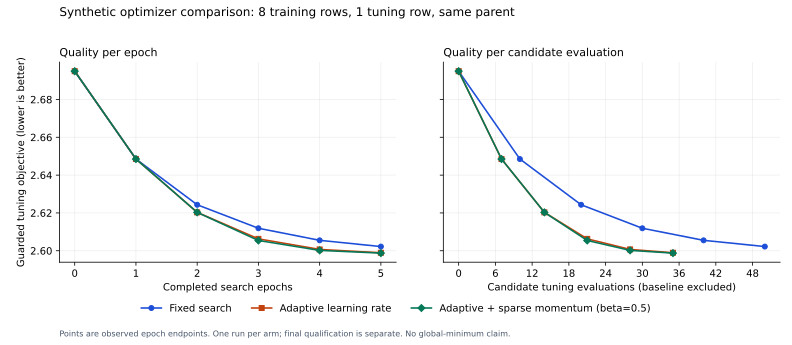

# More productive projection epochs

The incremental runner previously used one epoch at learning rate 0.35 and one
attempt per head. Projection restarted the same rate grid each epoch and had
no momentum history. Faster dispatch alone did not improve that search policy.
This change exposes bounded multi-epoch training and an optional guarded
adaptive optimizer, preserving the existing objective and qualification gates.

## Correctness before optimization

An ordinary candidate could appear improved when an IR loss became NaN:
`max(0.0, NaN)` in the objective projection converted it to zero, while ordinary
regression comparisons did not reject it. The controlled regression experiment
and tests retain this failure without treating it as a native admission.
Invalid baseline metrics now prevent training, and invalid candidate metrics
cannot be selected or committed. Candidate transactions still roll back.

The sparse update routines are head-specific nudges. Their historical
"gradient norm" diagnostics derive from parameter deltas divided by rate;
they are not gradients of the full guarded scalar objective. Accordingly,
the new momentum option combines accepted sparse parameter steps. It does not
claim to implement Adam or a gradient-based convergence theorem.

## Adaptive search and limits

Each update family carries its own actual learning rate across epochs. A fully
guarded positive trial grows that rate by 1.25 for its next search, capped at 1;
a failed trial halves it, with a bounded floor. Adaptive search stops at the
first guarded positive trial for that head. The existing objective selects
which head's candidate commits. A positive but unselected candidate can inform
its head's next rate, but never contributes momentum history.

Optional momentum uses only the last selected, committed sparse parameter
direction. It requires matching parameter postimages and a positively aligned
fresh direction. The carry norm is bounded by the requested momentum times the
fresh direction norm. Rejected momentum gets a plain trial at the same rate
within the existing attempt budget; ordinary failures back off. Stale, reversed
or flat directions reset history. Inserted rows, unknown initial coordinates,
whole-component replacements, sample memory and proof metadata are excluded.
History is limited to 8,192 existing numeric coordinates and one selected head.

The optimizer permits one backed-off recovery sweep after a plateau, then
reports `search_stalled` if no candidate improves. It does not rename this
bounded-search outcome convergence. Every epoch reports its before/after
objective, monotonic wall time and actual candidate-validation evaluation
count, alongside actual rates, finite-metric checks and parameter-step norms.

New controls in `run_incremental_autoencoders.py` are `--epochs` (1–32),
`--learning-rate` (positive, at most 1), `--line-search-attempts` (1–10),
`--projection-optimizer-mode fixed|guarded_adaptive`, and
`--projection-momentum` (0–0.9). Momentum requires adaptive mode and at least
two attempts. The existing total optimizer deadline still applies. Adaptive
jobs require disjoint tuning rows and zero L2; inference rejects nondefault
training settings. No context, temperature, compute backend or proof threshold
is changed.

Defaults preserve the existing fixed, one-epoch behavior and old serialized
job identities. New settings bind into immutable jobs and stream policies;
changing them requires a fresh stream. Adaptive history lives within one
training call and resets between jobs. Model checkpoints and sparse updates
do not silently acquire optimizer state. Existing resume granularity remains
the qualified attempt.

Persisting momentum across jobs needs an immutable optimizer artifact bound to
the exact weight identity, model/language variant, producer, training policy
and validation split. Its tip must advance transactionally with the weight tip,
including rejected-weight transitions. Attaching untracked history to mutable
model attributes would not satisfy that contract. This change does not claim
continuity of optimizer history across worker restarts.

An explicit bounded configuration is `--epochs 5 --learning-rate 0.35
--line-search-attempts 2 --projection-optimizer-mode guarded_adaptive
--projection-momentum 0.5`. These flags are an experimental treatment, not a
claim that 0.5 momentum is universally best. The fixed mode remains the default.

## What convergence means here

Success still uses the existing absolute reconstruction, semantic, syntax and
Lake gates. Only `lake build Legal` admits generated Lean. The current numeric
duration proof and six syntax projections do not prove the whole legal IR,
complete temporal/cognitive semantics or an autoencoder's global correctness.
The Constitution remains unformalized.

The measured model configuration disables several family-logit scales. Its
family cross-entropy therefore stays constant even when those parameter tables
change. Learning-rate adaptation cannot remove a loss component disconnected
from active prediction. The inherited reconstruction projection also uses the
supplied target and has discontinuous branches. Its zero loss is not evidence
of learned textual generalization. These limitations remain visible; the
comparison does not change model scales or redefine the objective to hide them.

We measure the best observed guarded objective, accepted and rejected epochs,
candidate evaluations, actual rates, step/momentum diagnostics, elapsed time
to an observed objective threshold, and untouched canary results. A stopped
bounded search is not a certificate of global optimality. General nonconvex
results can guarantee stationarity under assumptions; global rates require
additional structure, as illustrated by [Jin et al.](https://proceedings.mlr.press/v70/jin17a.html).
Adaptive step-size guarantees likewise depend on objective assumptions
([Malitsky and Mishchenko](https://proceedings.mlr.press/v119/malitsky20a.html)),
and momentum's benefit depends on the optimization regime
([Yuan et al.](https://www.jmlr.org/papers/v17/16-157.html)). Those theorems are
context, not proofs for this sparse mixed objective.

The next optimization decisions should follow evidence in this order:

1. Measure which active heads reduce the unchanged objective and which consume
   evaluations without response. Treat enabling a disabled prediction head as
   a separately versioned model-configuration experiment, not an invisible
   optimizer change.
2. Validate learned reconstruction independently of the supplied target, and
   test on federal-law sections separated by source/entity and withheld from
   tuning. Nearby synthetic durations only test this implementation.
3. Compare a small, predeclared portfolio of rates and momentum settings under
   equal evaluation budgets. Select with tuning evidence, then evaluate an
   untouched canary once. Do not select on repeated canary results.
4. Persist optimizer history only after the immutable state/tip contract above
   exists; otherwise job-local resets remain explicit. Share targets and
   Arrow-backed weights through the existing sparse-update control plane,
   without creating concurrent DuckDB writers or claiming that a stored row
   proves a theorem.

This ordering avoids spending hardware on inactive objectives or promoting a
configuration on synthetic loss alone. Any future differentiable optimizer
also needs verified gradients of the actual active objective before its norm
can be used as a stationarity diagnostic.

## Controlled native comparison

The successful retry lowered the unchanged tuning objective more efficiently.
All arms started at **2.694956319**, completed five epochs and committed one
selected candidate per epoch:

| Mode | Final tuning objective | Candidate tuning evaluations | Training wall time | Amortized seconds/train span | Epoch reaching fixed final objective | Time to that observation |
|---|---:|---:|---:|---:|---:|---:|
| Fixed rates | 2.602203490 | 50 | 51.486 s | 6.436 | 5 | 51.478 s |
| Adaptive rates | 2.598923744 | 35 | 39.848 s | 4.981 | 4 | 34.637 s |
| Adaptive rates + momentum 0.5 | 2.598746396 | 35 | 39.460 s | 4.933 | 4 | 34.308 s |

Momentum produced **3.73% more objective reduction over the same five epochs**
than fixed rates, using **30% fewer candidate evaluations**. It reached the
fixed arm's final objective one epoch earlier and at an observed training time
33.35% lower. The extra benefit over adaptive rates alone was small: a further
0.000177349 lower final objective. This single sequential experiment supports
those workload observations, not a universally best rate or momentum setting.
Training time includes setup and target preparation; per-span cost divides by
eight training rows and includes tuning work. It excludes checkpoint load and
final qualification. The threshold is descriptive, not a global lower bound
or time-to-qualification measurement.

The source and numeric evidence is in the [comparison](evidence/autoencoder-convergence-20260929/native-three-arm-retry/comparison.json),
[raw worker receipts](evidence/autoencoder-convergence-20260929/native-three-arm-retry/adaptive_momentum/worker/receipt.json)
and [independent audit](evidence/autoencoder-convergence-20260929/native-audit.json).
Candidate gains are not summed across heads: they share the same epoch baseline.
Only the selected committed gain contributes to the curve.

The bridge profiles preserve cold and warm costs:

| Mode | First process-cold bridge evaluate (1 sample/target) | Fresh training targets (8 samples/targets, modules already loaded) | Median warm bridge evaluate (1 sample/target) | Total bridge evaluations |
|---|---:|---:|---:|---:|
| Fixed rates | 4.305 s | 9.269 s (1.159 s/span) | 0.114 s | 52 |
| Adaptive rates | 4.870 s | 9.512 s (1.189 s/span) | 0.113 s | 37 |
| Adaptive + momentum | 4.253 s | 9.547 s (1.193 s/span) | 0.114 s | 37 |

Warm evaluations reuse in-process targets with disk caching still disabled.
Every listed evaluation has nonzero target counts; bridge names and flags are
identical below. OS caches were not controlled. These timings are not compared
to historical runs with different sample sets or producer sources.

**No candidate qualified.** All three failed reconstruction on the same five
training durations (22, 23, 24, 26 and 27 days), despite passing their semantic,
six-family syntax, Lake and tuning-split gates. Across the three arms the audit
verified 27 actual `lake build Legal` results and 162 syntax artifacts. They
cover the supported numeric duration statements and projected syntax, not full
legal/cognitive semantics. Five accepted optimizer epochs cannot bypass these
failures.

The momentum arm was selected on tuning evidence before either synthetic
canary was evaluated, for diagnostic evaluation only because no arm qualified.
Its two-canary objective was 4.238296815 versus fixed rates' 4.241767249, a
0.003470434 improvement. Both retained cosine 0.196116135 and reconstruction
MSE 0.435604014, failing the unchanged reconstruction thresholds. Their
LegalIR target count was two and inference left weights unchanged. This
improved IR loss without solving the reconstruction problem; neither a
checkpoint promotion nor a Hub upload followed.

The first attempt is retained as failed evidence: an external edit to
`logic/software_contracts/semantic_state/merkle.py` changed the full producer
during the momentum job. The pool refused to register that candidate. Its
earlier arm results are not combined with the fresh retry. The failed attempt's
storage claim remains retained; the provenance guard was not weakened.

The three arms use the same protected restart12 checkpoint and final producer,
one explicit multi-sample job per arm, training durations 20–27, tuning duration
30, and untouched synthetic canaries 31 and 32 evaluated after selection.
Different optimizer settings cannot change their parent weights through shard
placement. These synthetic fixtures use mock stable-hash embeddings and do not
constitute an independent federal-law canary.

Every arm uses five epochs, two attempts per head, all five update families,
zero composed refinement, initial rate 0.35, a 180-second optimizer budget and
the Python sparse batch backend. All five bridges remain enabled:
`modal_frame_logic`, `deontic_norms`, `fol_tdfol`, `cec_dcec`,
`external_prover_router`. Provers are false, metric disk cache is 0, bridge
workers are 1, and sample memory is false. Cold target costs and later
in-process reuse are reported separately. Source maps are captured at actual
native run boundaries. No failed provenance check is converted into a pass.

## Validation and publication

The 134 focused optimizer tests passed: 62 adaptive/finite-metric regressions,
42 composed-refinement tests, seven state-transaction tests and 23 patch-codec
tests. Worker/CLI checks passed (230 tests, plus 54 CLI checks after binding the
new helper). The three required semantic gates passed, including empty-vocabulary
abstention and the non-renderable deadline; the five-case pilot retained
0.920 forward and 1.000 cycle scores.

The retry's native audit passed 643 checks with the complete producer unchanged:
7,834 Python files, manifest
`16e552b4c54c78a7e3775a9db15b502075c94443f56c35356c63e90f86d37017`.
Sparse updates replayed successfully through the existing single-owner native
Quack prototype; workers did not open DuckDB. This does not qualify cross-host
execution. The audit helper's initial scalar-versus-map field assumption was
corrected against the existing receipt schema; that failed audit is retained
alongside the final result, without changing native evidence.

**978 exact prepared-main tests passed**, with zero failures, errors or skips,
across the 27 selected test files. The tested source tree was
`55d0d9f246a509db2ec7694d8f54fd5b329e1ee5`; final publication only adds or updates
documentation and evidence after that source test. The isolated import audit
kept dataset and accelerator imports inside the exact exported source layout.

The [source-scope audit](evidence/autoencoder-convergence-20260929/source-scope.json)
records 22 superproject Python differences between the captured workspace and
prepared main, plus 565 paths inside unexpanded gitlinks. Six explicitly bound
dependencies differ (autoencoder, compiler, decompiler, parser, deontic formula
builder and modal decompiler). The unrelated preexisting 24-line autoencoder
worker-budget change remains excluded. Native measurements therefore qualify
the captured canonical workspace only; source integration tests qualify the
exact prepared main tree. Neither is substituted for the other.
An additional edit to the same unrelated `merkle.py` occurred after the
successful native run; its difference is recorded in the publication mapping
and excluded from this commit. It does not alter the sealed run boundaries.

Read-only resource closeout preserved all 167 original ledger records and all
61 original retained claims. The failed run adds one retained claim; the
completed retry's owned claim is released, with no surviving owned children.
The protected checkpoint hash and size are unchanged.

Publication applies only the reviewed changes using a private Git index.
The shared working trees and indexes remain intact. Native receipts bind the
canonical workspace; exact prepared-main source tests are separate evidence.
Explicit source mappings retain any differences between those trees. Protected
weights, retained storage claims, the 80 GB campaign cap and 50 GB worker cap
remain unchanged. No checkpoint promotion or Hub upload is implied by a lower
training loss.
