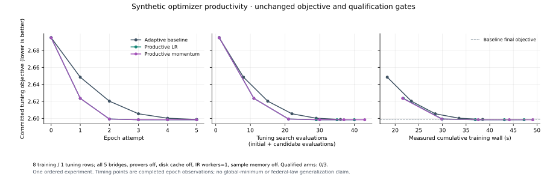

# More useful work inside each epoch

This change tests step selection within the declared search budget. It preserves
the objective, model scales, training/tuning split, bridge configuration and
qualification gates. `productive_adaptive` is opt-in; existing `fixed` and
`guarded_adaptive` behavior remain available.

## What the audit found

The previous adaptive search stopped at the first guarded positive trial. It
could leave the rest of its attempt budget unused even if a larger step would
make more progress. Flat outcomes also reduced the next learning rate, which
does not explore the other side of a discontinuous plateau.

Momentum retained at most 8,192 coordinates in the sparse patch's lexical order.
In the measured fixture, feature rows consumed that limit before the much
larger global-logit deltas were reached. A configured momentum coefficient did
not mean the dominant accepted direction survived in memory.

The reconstruction path has a separate limitation. Its safe projection can
return the supplied target embedding on one side of a sign test and a fixed
fallback on the other. The previous five failed training rows exactly matched
that fallback. A tuning row that already returns its target has zero
reconstruction loss, so ordinary candidate selection can improve LegalIR logits
while rejecting a training reconstruction update with zero tuning-objective gain.
This is a loss/selection issue, not evidence that the qualification thresholds
are too strict. Raw parameter-update norms are not gradients of this objective.

Zero family-classification scales are insufficient to prove a head inactive:
legacy LegalIR readers and codec feature selection also use the same tables'
keys and row presence. This change does not skip heads on that assumption or
silently enable disabled prediction outputs.

## Search policy

The productive mode uses the remaining declared attempts to test twice the
current rate after a guarded positive trial or an exactly unchanged, finite
guard-metric response. Actual rates remain at most 1. Regressions back off;
rejected momentum first gets a plain trial at the same rate. A carried step and
a plain step at the cap are distinct candidates and may both be tested, while
repeated plain trials at the same rate are skipped. The best accepted trial
survives a later regression, invalid result or timeout.

Successful unselected heads retain their best measured rate. Only a selected
committed head receives the additional 1.25 next-epoch growth. If every completed
trial for a head is exactly flat and finite, its next seed reuses the largest
measured flat rate; it does not repeat the same smaller pair indefinitely.
Mixed flat/regressing or invalid results do not enable that rule. The existing
attempt and total-time budgets still apply, and the new mode requires at least
two declared attempts.

If a fully evaluated plain search is flat across every trial, the productive
mode can continue another requested epoch while that measured seed has advanced
and a larger rate remains available. It resets momentum for this exploration.
Mixed regressions, invalid results, timeouts and a rate already at the cap do not
qualify. Exhausting the requested epochs during this search is reported as an
epoch-budget limit, not convergence. Existing modes retain their stopping rules.

Momentum now keeps the largest absolute accepted coordinate changes using a
deterministic bounded heap, within the same 8,192-coordinate cap. It scans only
the selected sparse patch, not the full weights. Inserted coordinates with
unknown initialization, sample memory and proof metadata remain excluded.
The coefficient is a configured ceiling: actual carry is bounded by the fresh
intersecting direction, and stale or conflicting directions reset history.
Telemetry reports retained direction norm and coordinate coverage. Those are
parameter-step measurements, not objective-gradient or optimality certificates.

All candidate changes remain transactional. A later failed probe cannot discard
an earlier guarded winner. Only the selected committed patch contributes to
momentum history. History is job-local and resets between jobs; its cap and the
model checkpoint schema remain unchanged. This is guarded parameter-step
search, not Adam or a differentiable optimizer of the full mixed objective.

## Controlled experiment

All arms started at objective **2.694956319** and accepted five epochs. The
source stayed unchanged across all three arms. The new search reached a common
loss level in fewer epochs, but spent more time over the full five-epoch budget.
It remains an opt-in policy, not a demonstrated universal speed improvement.

| Search | Final tuning objective | Candidate evaluations | Training wall | Wall per training span | Epoch reaching baseline final loss | Wall to that observed epoch |
| --- | ---: | ---: | ---: | ---: | ---: | ---: |
| Adaptive baseline, momentum 0.5 | 2.598746396 | 35 | 38.518 s | 4.815 s | 5 | 38.512 s |
| Productive LR, momentum 0 | 2.598387206 | 39 | 47.277 s | 5.910 s | 3 | 36.954 s |
| Productive LR, momentum 0.5 | 2.598387155 | 42 | 49.125 s | 6.141 s | 3 | 37.588 s |

The common-loss observations are 4.05% and 2.40% earlier in wall time. These are
single ordered measurements on a busy shared host, not replicated timing gains.
Total training time increased 22.74% and 27.54%. Objective reduction per bridge
call decreased from 0.0026003 to 0.0023553 and 0.0021948: the denominators are
37, 41 and 44 calls, including initial tuning and training prime. More progress
per epoch did not mean more progress per evaluation over this entire budget.

The two productive arms have identical first four committed objectives;
momentum's final advantage is about 5.05e-8. Productive momentum retained
99.9962% of eligible parameter-delta norm at its last history capture, including
all six global coordinates and 1,488 semantic-slot coordinates. Its memory
policy is improved, but this run does not justify enabling momentum by default.

All three still fail the same five training durations: 22, 23, 24, 26 and 27.
Their cosine is about 0.196116 and MSE ranges from 0.216009 to 0.377941.
The sealed tuning-selected candidate improves the two-canary objective by
0.000375075, but mean reconstruction cosine remains 0.598058 and MSE remains
0.224922, identical to baseline. IR improvement has not repaired reconstruction.
No candidate is promoted or uploaded as qualified.

The family-classification CE contribution stays at ln(9) = 2.197224577336 under
the unchanged disabled family scales. Every ordinary `decoded_embedding` and
`family_logits` candidate has exactly zero tuning-objective and family-CE
response: 20/35 baseline trials and 16/39 or 16/42 productive trials combined.
These measured flat responses do not establish that those heads are globally
irrelevant. Projection-update work alone takes 15.355 / 20.210 / 21.848 seconds,
while candidate evaluation takes 3.960 / 4.655 / 4.777 seconds. The next efficiency
priority is reducing unproductive proposals and addressing the reconstruction
selection gap, rather than enabling more acceleration indiscriminately.

For the same five bridges and one IR worker, measured bridge-on calls are:

| Search | First cold call, 1 span / 1 target | Training prime, 8 spans / 8 targets | Prime wall per span | Mean subsequent tuning call, 1 span / 1 target |
| --- | ---: | ---: | ---: | ---: |
| Baseline | 4.358 s | 9.394 s | 1.174 s | 0.113 s |
| Productive LR | 4.872 s | 9.572 s | 1.196 s | 0.119 s |
| Productive momentum | 4.460 s | 9.666 s | 1.208 s | 0.114 s |

The first call starts with an empty process target cache. The training prime
contains eight unseen targets with zero memory hits, although the tuning target
already exists in that process cache. Subsequent calls reuse in-process targets;
none uses the metric disk cache. Canary inference costs 5.398 seconds for two
cold targets versus 0.243 seconds with two cache hits for the selected candidate.
That pair is explicitly not a matched inference-speed comparison.

The prespecified comparison uses the same protected restart12 parent for three
arms: existing adaptive search with momentum 0.5, productive search without
momentum, and productive search with momentum 0.5. Each requests five epochs,
two attempts per head, all five heads, learning rate 0.35, 180 training seconds,
and zero composed-refinement attempts. Model scales are identical.

Training durations are 20–27, tuning is 30, and fresh synthetic canaries are
34 and 35. Those canaries are evaluated only after sealing the tuning-based
choice; exclusion from seed pretraining is unknown. These fixtures do not
establish federal-law generalization. A separately prespecified optional run
adds three composed-refinement attempts to test training reconstruction while
retaining the strict winner's validation gain. It does not re-evaluate canaries
or count as an isolated optimizer comparison.

The bridge list remains `modal_frame_logic`, `deontic_norms`, `fol_tdfol`,
`cec_dcec`, `external_prover_router`; provers are false, metric disk cache is 0,
IR workers are 1, and sample memory is false. Every worker starts with a cold
target cache; subsequent in-process reuse is reported separately. No weights
are downloaded and the protected checkpoint is not modified.

## Separate reconstruction-refinement integration

The prespecified refinement3 run used the same producer and protected parent.
Five epochs took 75.566 seconds (9.446 seconds per training span) and ended at
tuning objective 2.598387180. It is a separate integration experiment; its added
work is not attributed solely to the new search policy. Canaries were not read.

Of 15 refinement trials, six passed strict validation and three were selected
(epochs 1–3). Nine skipped validation after the bridge-off training reconstruction
screen found no positive MSE improvement: four regressed and five were flat.
The last two epochs retained IR-only winners.

Final bridge-on qualification improved from three to six passing training rows
out of eight: durations 22, 23, 26 and 27 recovered, 24 still failed, and 20
regressed. Training mean MSE was 0.068413873265 and cosine 0.799029033785.
The refinement's separate bridge-off aggregate was MSE 0.027658792844 and cosine
0.899514516892; it is a screening metric, not the bridge-on qualification result.
Aggregate progress can hide individual regressions, and even a bridge-off screen
is not interchangeable with the gated inference path. Qualification blocked this
candidate; no thresholds were relaxed.

Its first cold bridge call cost 4.442 seconds for one span/target. The eight unseen
training targets cost 9.488 seconds (1.186 seconds/span); the subsequent 49 warm
tuning calls averaged 0.117 seconds each. All five bridge names, provers=false,
metric disk cache=0, one IR worker and sample memory=false remained unchanged.

The evidence supports a next iteration that makes reconstruction refinement
aware of the exact bridge-on inference path and tracks individual row regressions,
while keeping the final gates intact. A wider, disjoint tuning set is necessary
before choosing a default rate/momentum policy. Repeated measurements should then
compare time and evaluations to a common qualified quality level, not just epoch
count. No arm in this experiment reached that level.

## Convergence and qualification

An accepted epoch establishes a measured guarded improvement on this tuning
set. A bounded stalled search does not establish stationarity or a global
minimum. General adaptive-step guarantees rely on assumptions that have not
been proved for this mixed, discontinuous objective
([Malitsky and Mishchenko](https://proceedings.mlr.press/v119/malitsky20a.html)).
The benefit of restart likewise depends on the method and regime
([O'Donoghue and Candes](https://arxiv.org/abs/1204.3982)); this implementation
does not inherit those papers' guarantees.

We compare objective reduction per epoch and completed evaluation, actual
step/carry magnitudes, observed time to a common loss level, training
reconstruction and untouched canary results. Candidates still need the existing
metric, semantic, family syntax, Lake and split gates. Only actual
`lake build Legal` results admit supported generated Lean. Numeric duration
lemmas and syntax projections do not prove complete legal/cognitive semantics.
The Constitution remains unformalized.

## Validation and publication

Focused source tests passed: 166 optimizer/composition/transaction/codec cases
and 249 worker/CLI cases. New tests cover larger probes, winner preservation after
regression/nonfinite/timeout, exact-flat evidence, bounded plateau continuation,
cap behavior, dominant-delta retention, stale history, worker identity and
inference rejection. These tests supplement the native evidence; they do not
establish convergence.

The required pinned-tree semantic clauses pass, including empty-vocabulary
abstention, non-renderable `within_duration`, and integer `minimum_duration`.
The five-case pilot remains at forward 0.92 and cycle 1.0. Separate vocabulary /
typed-compile wall times on the three clauses are 0.119613 / 0.019070 seconds,
0.005497 / 0.012423 seconds and 0.005574 / 0.013125 seconds. These are small
ordered smoke timings, not a Constitution speed baseline. Parser code is unchanged
by this task.

The main native audit passed 643 checks: 15 accepted epochs, 27 qualification
rows, 27 actual `lake build Legal` results and 162 bound syntax artifacts. The
separate integration passed 227 audit checks: five accepted epochs, nine Lake
builds and 54 syntax artifacts. All four arms use the same protected checkpoint
and the same full producer manifest (7,835 Python files,
`3a5445309b3816ee6a023eb91e97c95c1aa8b0974f38609fcfbd6942bd21d95f`).
Every arm remains unqualified. These audit passes mean evidence is internally
consistent, not that a model passed its qualification gates.

The native control path used a scoped Quack owner over DuckDB, sparse patch
commit/replay verification and Arrow-backed feature weights. Model candidates
remain separate versions; no shared live weight file is overwritten. Both bounded
resource leases closed with durable outputs and no surviving owned child group;
all 169 preexisting ledger records, including 62 retained claims, are preserved.
No weights, Arrow arrays, databases or Lake build binaries enter Git evidence.

The exact scoped main tree `62e4470d8f09df75f1ca0500913984c3cb18b5d9`, based
on `c16bcdf1c34d6e9e0f635a8dac31e21006fd5430`, passed **1,029 tests across
27 files** with no failures, errors or skips (pytest 61.92 seconds). Its isolated
import audit passed for 483 modules. Exported source/dependency hashes, published
workspace bytes, live HEAD and live index remained unchanged. Final publication
adds only documentation/evidence changes to that tested tree.

The scoped main tree deliberately excludes unrelated workspace changes. Its
source map has 22 different superproject Python blobs and one workspace-only
`law_package.py`; a further 565 paths belong to Git-linked source not expanded
by this superproject manifest. Six bound dependencies differ, including the
parser/compiler/decompiler and the preexisting modal worker-budget branch.
Therefore the native results above apply only to the captured workspace producer.
Exact prepared-main source tests are reported separately; this publication does
not retroactively transfer native evidence to different source bytes.

For a future training job with disjoint `--validation-jsonl`, the opt-in runner
settings are `--projection-optimizer-mode productive_adaptive --projection-momentum 0
--line-search-attempts 2 --epochs 5 --learning-rate 0.35`. These are a measured
starting configuration, not the proven fastest policy. Positive momentum and
composed refinement remain separate opt-ins; existing jobs and inference do not
silently adopt them. Resume identity includes the optimizer settings.

Native evidence binds the pinned workspace at actual run boundaries. Scoped
publication preserves unrelated concurrent edits; exact prepared-main source
tests are separate evidence. Resource admission stays within the 80 GB campaign
cap and 50 GB worker cap. Historical retained claims remain intact. Lower loss
does not trigger checkpoint promotion or Hub publication by itself.
