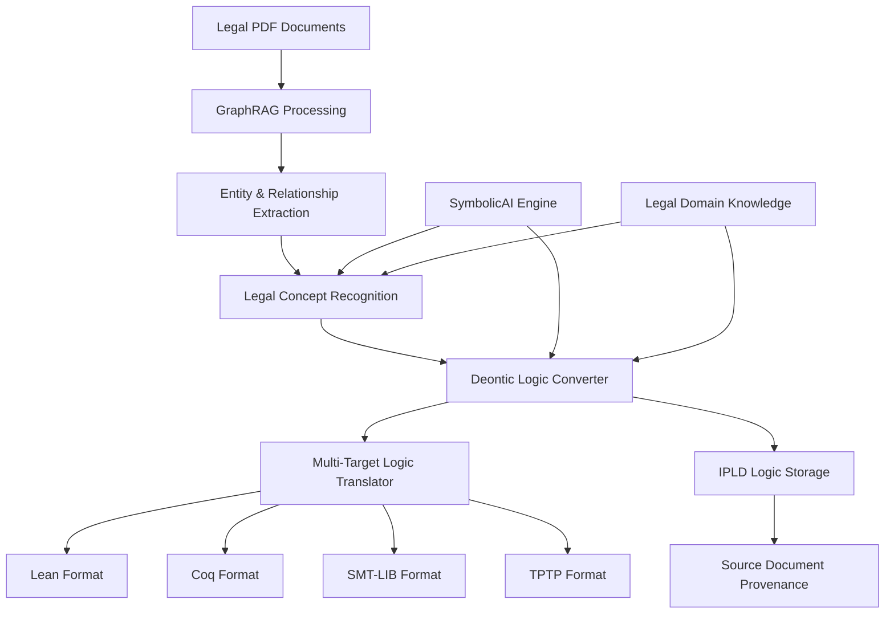

# Deontic First-Order Logic Implementation Plan for Legal GraphRAG

## Overview

This plan outlines the implementation of a comprehensive system to convert GraphRAG-processed legal documents into deontic first-order logic (deontic FOL) formulas, with multi-theorem prover support and IPLD storage integration.

## System Architecture



## Implementation Phases

### Phase 1: Core Deontic Logic Infrastructure (2-3 weeks)

#### 1.1 Deontic Logic Primitives
```python
# New module: ipfs_datasets_py/logic_integration/deontic_logic_core.py
class DeonticOperator(Enum):
    OBLIGATION = "O"      # O(φ) - it is obligatory that φ
    PERMISSION = "P"      # P(φ) - it is permitted that φ  
    PROHIBITION = "F"     # F(φ) - it is forbidden that φ
    SUPEREROGATION = "S"  # S(φ) - it is supererogatory that φ

class DeonticFormula:
    """Represents a deontic first-order logic formula"""
    def __init__(self, operator: DeonticOperator, formula: str, 
                 conditions: List[str] = None, agent: str = None)
    
class LegalConceptExtractor:
    """Extracts legal concepts from GraphRAG entities/relationships"""
    def extract_obligations(self, entities: List[Entity]) -> List[DeonticFormula]
    def extract_permissions(self, entities: List[Entity]) -> List[DeonticFormula]
    def extract_prohibitions(self, entities: List[Entity]) -> List[DeonticFormula]
```

#### 1.2 Legal Domain Knowledge Base
```python
# New module: ipfs_datasets_py/logic_integration/legal_domain_knowledge.py
class LegalDomainKnowledge:
    """Knowledge base of legal concepts and their logical representations"""
    
    OBLIGATION_KEYWORDS = [
        "shall", "must", "required", "obligated", "duty", "responsibility",
        "mandate", "compulsory", "binding", "liable"
    ]
    
    PERMISSION_KEYWORDS = [
        "may", "can", "allowed", "permitted", "authorized", "entitled",
        "right", "liberty", "freedom", "discretion"
    ]
    
    PROHIBITION_KEYWORDS = [
        "shall not", "must not", "prohibited", "forbidden", "banned",
        "unlawful", "illegal", "restricted", "barred"
    ]
    
    def classify_legal_statement(self, text: str) -> DeonticOperator
    def extract_agent(self, text: str) -> Optional[str]
    def extract_conditions(self, text: str) -> List[str]
```

### Phase 2: SymbolicAI Integration for Legal Analysis (2-3 weeks)

#### 2.1 Enhanced Legal Text Analysis
```python
# Extension to: ipfs_datasets_py/logic_integration/symbolic_fol_bridge.py
class LegalSymbolicAnalyzer:
    """SymbolicAI-powered legal text analysis"""
    
    def analyze_legal_document(self, text: str) -> LegalAnalysisResult:
        """Use SymbolicAI to understand legal structure and semantics"""
        
    def extract_deontic_propositions(self, text: str) -> List[DeonticProposition]:
        """Extract deontic propositions using SymbolicAI reasoning"""
        
    def identify_legal_entities(self, text: str) -> List[LegalEntity]:
        """Identify parties, roles, and legal entities"""
        
    def extract_temporal_conditions(self, text: str) -> List[TemporalCondition]:
        """Extract time-based conditions and constraints"""
```

#### 2.2 Legal Reasoning with SymbolicAI
```python
class LegalReasoningEngine:
    """Advanced legal reasoning using SymbolicAI"""
    
    def infer_implicit_obligations(self, explicit_rules: List[DeonticFormula]) -> List[DeonticFormula]:
        """Infer implicit legal obligations from explicit rules"""
        
    def check_legal_consistency(self, rules: List[DeonticFormula]) -> ConsistencyReport:
        """Check for logical inconsistencies in legal rules"""
        
    def analyze_legal_precedents(self, current_case: str, precedents: List[str]) -> PrecedentAnalysis:
        """Analyze how legal precedents apply to current case"""
```

### Phase 3: Multi-Theorem Prover Translation Engine (3-4 weeks)

#### 3.1 Abstract Logic Representation
```python
# New module: ipfs_datasets_py/logic_integration/logic_translation_core.py
class AbstractLogicFormula:
    """Platform-independent representation of logic formulas"""
    def __init__(self, formula: str, logic_type: str, variables: Dict[str, str])
    
class LogicTranslationTarget(Enum):
    LEAN = "lean"
    COQ = "coq"
    ISABELLE = "isabelle"
    SMT_LIB = "smt-lib"
    TPTP = "tptp"
    Z3 = "z3"
    VAMPIRE = "vampire"
    E_PROVER = "eprover"
```

#### 3.2 Target-Specific Translators
```python
class LeanTranslator:
    """Translates deontic logic to Lean theorem prover format"""
    
    def translate_deontic_formula(self, formula: DeonticFormula) -> str:
        """Convert to Lean 4 syntax with deontic operators"""
        
    def generate_lean_theory(self, formulas: List[DeonticFormula]) -> str:
        """Generate complete Lean theory file"""
        
    def create_proof_obligations(self, formulas: List[DeonticFormula]) -> List[str]:
        """Create proof obligations for verification"""

class CoqTranslator:
    """Translates deontic logic to Coq proof assistant format"""
    
    def translate_deontic_formula(self, formula: DeonticFormula) -> str:
        """Convert to Coq syntax with deontic operators"""
        
    def generate_coq_module(self, formulas: List[DeonticFormula]) -> str:
        """Generate complete Coq module"""

class SMTTranslator:
    """Translates to SMT-LIB format for SAT/SMT solvers"""
    
    def translate_to_smt_lib(self, formulas: List[DeonticFormula]) -> str:
        """Convert to SMT-LIB format for Z3, CVC4, etc."""
        
    def generate_satisfiability_query(self, formulas: List[DeonticFormula]) -> str:
        """Generate SAT/UNSAT queries for consistency checking"""
```

#### 3.3 Universal Logic Translation Engine
```python
class UniversalLogicTranslator:
    """Unified interface for translating to multiple theorem provers"""
    
    def __init__(self):
        self.translators = {
            LogicTranslationTarget.LEAN: LeanTranslator(),
            LogicTranslationTarget.COQ: CoqTranslator(),
            LogicTranslationTarget.SMT_LIB: SMTTranslator(),
            # ... other translators
        }
    
    def translate(self, formulas: List[DeonticFormula], 
                  target: LogicTranslationTarget) -> TranslationResult:
        """Translate formulas to specified target format"""
        
    def translate_all_targets(self, formulas: List[DeonticFormula]) -> Dict[str, TranslationResult]:
        """Translate to all supported formats"""
        
    def validate_translation(self, original: DeonticFormula, 
                           translated: str, target: LogicTranslationTarget) -> bool:
        """Validate that translation preserves semantics"""
```

### Phase 4: IPLD Integration for Logic Storage (2 weeks)

#### 4.1 Logic-Specific IPLD Schema
```python
# New module: ipfs_datasets_py/logic_integration/ipld_logic_storage.py
@dataclass
class LogicIPLDNode:
    """IPLD node for storing logic formulas with provenance"""
    formula_id: str
    deontic_formula: DeonticFormula
    source_document_cid: str
    source_text_excerpt: str
    extraction_metadata: Dict[str, Any]
    translations: Dict[str, str]  # target -> translated formula
    provenance_chain: List[str]
    creation_timestamp: str
    confidence_score: float

class LogicIPLDStorage:
    """IPLD storage manager for deontic logic formulas"""
    
    def store_logic_formula(self, formula: DeonticFormula, 
                          source_doc_cid: str, metadata: Dict) -> str:
        """Store logic formula in IPLD with source provenance"""
        
    def retrieve_formulas_by_document(self, doc_cid: str) -> List[LogicIPLDNode]:
        """Retrieve all logic formulas derived from a document"""
        
    def create_logic_collection(self, formulas: List[DeonticFormula]) -> str:
        """Create IPLD collection of related logic formulas"""
        
    def link_formulas_to_entities(self, formula_cids: List[str], 
                                 entity_cids: List[str]) -> str:
        """Create IPLD links between formulas and source entities"""
```

#### 4.2 Provenance and Lineage Tracking
```python
class LogicProvenanceTracker:
    """Track the lineage from source document to logic formula"""
    
    def create_provenance_chain(self, source_pdf: str, 
                               graphrag_entities: List[str],
                               logic_formulas: List[str]) -> ProvenanceChain:
        """Create complete provenance from PDF to logic formulas"""
        
    def verify_provenance(self, formula_cid: str) -> ProvenanceVerification:
        """Verify the complete lineage of a logic formula"""
        
    def find_related_formulas(self, formula_cid: str) -> List[str]:
        """Find formulas derived from same source or related entities"""
```

### Phase 5: GraphRAG-to-Logic Pipeline Integration (2-3 weeks)

#### 5.1 Enhanced GraphRAG Processor
```python
# Extension to: ipfs_datasets_py/graphrag_integration.py
class LegalGraphRAGProcessor:
    """Enhanced GraphRAG processor for legal documents"""
    
    def __init__(self, deontic_converter: DeonticLogicConverter):
        self.deontic_converter = deontic_converter
        self.legal_analyzer = LegalSymbolicAnalyzer()
        
    def process_legal_document(self, pdf_path: str) -> LegalProcessingResult:
        """Complete pipeline from PDF to deontic logic formulas"""
        
    def extract_legal_knowledge_graph(self, text: str) -> LegalKnowledgeGraph:
        """Extract legal-specific knowledge graph with deontic relationships"""
        
    def convert_to_deontic_logic(self, kg: LegalKnowledgeGraph) -> List[DeonticFormula]:
        """Convert legal knowledge graph to deontic logic formulas"""
```

#### 5.2 Deontic Logic Converter
```python
class DeonticLogicConverter:
    """Main converter from GraphRAG output to deontic logic"""
    
    def __init__(self, domain_knowledge: LegalDomainKnowledge,
                 symbolic_analyzer: LegalSymbolicAnalyzer):
        self.domain_knowledge = domain_knowledge
        self.symbolic_analyzer = symbolic_analyzer
        
    def convert_entities_to_logic(self, entities: List[Entity]) -> List[DeonticFormula]:
        """Convert GraphRAG entities to deontic logic formulas"""
        
    def convert_relationships_to_logic(self, relationships: List[Relationship]) -> List[DeonticFormula]:
        """Convert GraphRAG relationships to deontic logic formulas"""
        
    def synthesize_complex_rules(self, formulas: List[DeonticFormula]) -> List[DeonticFormula]:
        """Synthesize complex legal rules from simple formulas"""
        
    def validate_legal_consistency(self, formulas: List[DeonticFormula]) -> ValidationResult:
        """Validate logical consistency of extracted rules"""
```

### Phase 6: Query and Reasoning Interface (2 weeks)

#### 6.1 Deontic Logic Query Engine
```python
class DeonticQueryEngine:
    """Query engine for deontic logic formulas"""
    
    def query_obligations(self, agent: str, context: Dict) -> List[DeonticFormula]:
        """Find all obligations for a specific agent in given context"""
        
    def query_permissions(self, action: str, agent: str) -> List[DeonticFormula]:
        """Find permissions for specific actions by agent"""
        
    def check_compliance(self, proposed_action: str, 
                        context: Dict) -> ComplianceResult:
        """Check if proposed action complies with legal rules"""
        
    def find_conflicts(self, formulas: List[DeonticFormula]) -> List[LogicConflict]:
        """Find logical conflicts between deontic formulas"""
```

#### 6.2 Multi-Prover Verification Interface
```python
class MultiProverVerificationEngine:
    """Interface for verifying logic formulas across multiple theorem provers"""
    
    def verify_with_lean(self, formulas: List[DeonticFormula]) -> LeanVerificationResult:
        """Verify formulas using Lean theorem prover"""
        
    def verify_with_coq(self, formulas: List[DeonticFormula]) -> CoqVerificationResult:
        """Verify formulas using Coq proof assistant"""
        
    def check_sat_with_z3(self, formulas: List[DeonticFormula]) -> Z3Result:
        """Check satisfiability using Z3 SMT solver"""
        
    def cross_verify(self, formulas: List[DeonticFormula]) -> CrossVerificationResult:
        """Verify formulas across multiple provers for confidence"""
```

## Integration Points

### 1. GraphRAG Pipeline Integration
```python
# Enhanced pipeline in demonstrate_graphrag_pdf.py
def demonstrate_legal_graphrag_to_logic():
    """Demonstrate complete legal document to deontic logic pipeline"""
    
    # Step 1: Process legal PDF with GraphRAG
    graphrag_result = process_legal_pdf("contract.pdf")
    
    # Step 2: Convert to deontic logic
    converter = DeonticLogicConverter()
    logic_formulas = converter.convert_graphrag_to_logic(graphrag_result)
    
    # Step 3: Translate to multiple theorem prover formats
    translator = UniversalLogicTranslator()
    translations = translator.translate_all_targets(logic_formulas)
    
    # Step 4: Store in IPLD with provenance
    storage = LogicIPLDStorage()
    formula_cids = storage.store_logic_collection(logic_formulas, "contract.pdf")
    
    # Step 5: Verify with multiple provers
    verifier = MultiProverVerificationEngine()
    verification_results = verifier.cross_verify(logic_formulas)
    
    return {
        "logic_formulas": logic_formulas,
        "translations": translations,
        "ipld_cids": formula_cids,
        "verification": verification_results
    }
```

### 2. SymbolicAI Configuration
```python
# Configuration for SymbolicAI integration
SYMBOLICAI_CONFIG = {
    "model": "gpt-4",  # or other supported models
    "legal_domain_context": """
        You are analyzing legal documents. Focus on:
        - Identifying obligations, permissions, and prohibitions
        - Extracting legal entities and their roles
        - Understanding temporal and conditional aspects
        - Recognizing legal precedents and references
    """,
    "deontic_logic_prompt_templates": {
        "extract_obligations": "Extract all obligations from this legal text: {text}",
        "extract_permissions": "Extract all permissions from this legal text: {text}",
        "identify_agents": "Identify all legal parties and agents in: {text}"
    }
}
```

## File Structure

```
ipfs_datasets_py/logic_integration/
├── __init__.py                           # Enhanced with deontic exports
├── deontic_logic_core.py                 # Core deontic logic primitives
├── legal_domain_knowledge.py             # Legal domain knowledge base
├── legal_symbolic_analyzer.py            # SymbolicAI legal analysis
├── logic_translation_core.py             # Abstract logic representation
├── theorem_prover_translators/
│   ├── __init__.py
│   ├── lean_translator.py                # Lean 4 translation
│   ├── coq_translator.py                 # Coq translation
│   ├── smt_translator.py                 # SMT-LIB translation
│   ├── tptp_translator.py                # TPTP translation
│   └── universal_translator.py           # Unified interface
├── ipld_logic_storage.py                 # IPLD storage for logic
├── deontic_logic_converter.py            # Main conversion engine
├── deontic_query_engine.py               # Query interface
├── multi_prover_verification.py          # Multi-prover verification
└── legal_graphrag_processor.py           # Enhanced GraphRAG processor

tests/logic_integration/
├── test_deontic_logic_core.py
├── test_legal_domain_knowledge.py
├── test_symbolic_legal_analysis.py
├── test_theorem_prover_translations.py
├── test_ipld_logic_storage.py
├── test_graphrag_to_logic_pipeline.py
└── integration/
    ├── test_end_to_end_legal_pipeline.py
    └── test_multi_prover_verification.py
```

## Dependencies

### New Dependencies Required
```bash
# Theorem prover interfaces
pip install lean-client          # Lean 4 interface
pip install coq-client           # Coq interface  
pip install z3-solver            # Z3 SMT solver
pip install pysmt                # SMT solver interface

# Legal domain libraries
pip install spacy[legal]         # Legal NLP models
pip install legalese-parser      # Legal text parsing

# Enhanced SymbolicAI
pip install symbolicai>=0.13.1   # Core SymbolicAI library

# Logic libraries
pip install sympy               # Symbolic mathematics
pip install nltk               # Natural language toolkit
pip install networkx           # Graph algorithms
```

### System Dependencies
```bash
# Theorem provers (installed via package managers)
# Lean 4
curl https://raw.githubusercontent.com/leanprover/elan/master/elan-init.sh -sSf | sh

# Coq
sudo apt-get install coq        # Ubuntu/Debian
brew install coq               # macOS

# Z3
sudo apt-get install z3        # Ubuntu/Debian  
brew install z3                # macOS
```

## Testing Strategy

### Unit Tests
- Test each component in isolation
- Mock SymbolicAI responses for consistent testing
- Test theorem prover translation accuracy
- Test IPLD storage and retrieval

### Integration Tests
- Test complete pipeline from PDF to logic formulas
- Test cross-prover verification consistency
- Test IPLD provenance chain integrity
- Test query engine with real legal documents

### Performance Tests
- Test processing speed with large legal documents
- Test memory usage with complex logic formula collections
- Test IPLD storage efficiency

## Success Metrics

1. **Accuracy**: >90% accuracy in extracting correct deontic logic from legal texts
2. **Coverage**: Support for 5+ theorem prover formats (Lean, Coq, SMT-LIB, TPTP, Z3)
3. **Performance**: Process 100-page legal document in <5 minutes
4. **Consistency**: 95% consistency across different theorem prover translations
5. **Provenance**: 100% traceability from source document to logic formula

## Timeline

- **Weeks 1-3**: Phase 1 - Core deontic logic infrastructure
- **Weeks 4-6**: Phase 2 - SymbolicAI integration for legal analysis  
- **Weeks 7-10**: Phase 3 - Multi-theorem prover translation engine
- **Weeks 11-12**: Phase 4 - IPLD integration for logic storage
- **Weeks 13-15**: Phase 5 - GraphRAG-to-logic pipeline integration
- **Weeks 16-17**: Phase 6 - Query and reasoning interface
- **Weeks 18-20**: Testing, optimization, and documentation

**Total Estimated Time: 20 weeks (5 months)**

## Risk Mitigation

1. **SymbolicAI Dependency**: Implement comprehensive fallback systems for when SymbolicAI is unavailable
2. **Theorem Prover Complexity**: Start with simpler translations (SMT-LIB) before tackling complex ones (Lean/Coq)
3. **Legal Domain Complexity**: Begin with contract law and expand to other legal domains
4. **Performance**: Implement caching and incremental processing for large documents
5. **Accuracy**: Validate with legal experts and use established legal logic datasets

This implementation plan provides a comprehensive roadmap for creating a state-of-the-art system that bridges GraphRAG document processing with formal theorem proving for legal applications.