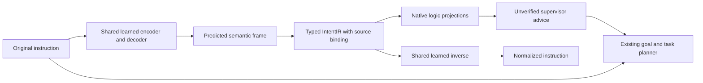

# Learned IntentIR round-trip development model

The paired model learns both instruction → semantic frame and semantic frame →
normalized instruction. The frame is materialized as native `intent-ir/v1`, then
compiled through the existing Intent formalization routes. It supports a bounded
single-clause language: actor, action, object, and intended/required/prohibited/
permitted/recommended modality. It does not model conditional programs, workflow
ordering, quantifiers, case-sensitive code identifiers, or cross-domain proofs.

For the additional DCEC, TDFOL, frame/rule, TLA+, Lean, and explicit refinement
views, see [IntentIR logic projections and qualification](intent_logic_projections.md).
That guide covers supported semantics, exact context inputs, native validation,
and the CLI for explicit Lake/SANY/TLC checks. These deterministic adapters use
the existing typed model output without retraining its checkpoint.



`autoencoder_paired_text.py` owns the domain-independent attention GRU, frozen
lexical branch, numerical loss, batching, inert checkpoint loader, and greedy
inference. The Intent adapter owns the four-slot codec and native compilation.
The inverse receives the typed frame only; it cannot read the original prompt
or retrieve a training example. No target tokens are supplied during evaluation.
IDs, provenance, punctuation, and native formula scaffolding are deterministic;
semantic slots and inverse text tokens are predicted by the trained weights.

The compatible LegalIR fork supplies 8-dimensional lexical rows for matching
training-vocabulary tokens. These rows are frozen. The sequence model and output
heads are newly initialized and trained; this is not transfer of a pretrained
LegalIR natural-language decoder. No LegalIR or SecurityIR checkpoint is edited.

## Corpus and reproducible run

The corpus builder verifies the previously exported, pinned Publicus SkillCenter
sources and preserves their source-family splits and licensing exclusions.
Conservative explicit clauses are weak labels. Authored semantic contrasts and
paraphrases supplement them; each contrast family stays in one split. The public
source export has no reviewed semantic pairs, so these are development results.

Run from the workspace root with the datasets package on `PYTHONPATH`. Use a fresh
output directory; the trainer refuses to overwrite a checkpoint.

```bash
CUDA_VISIBLE_DEVICES='' OMP_NUM_THREADS=1 MKL_NUM_THREADS=1 \
PYTHONPATH=external/ipfs_datasets \
python external/ipfs_datasets/scripts/training/train_intent_roundtrip.py \
  --corpus-descriptor artifacts/intent-ir-preplanning-20260929/skillcenter-corpus-descriptor-01.json \
  --lexical-initializer artifacts/terminal_bench_supervisor/symbolic-security-20260929/legal-fork-cve-public-01/security-code-initializer/initializer.json \
  --output /absolute/path/to/new-intent-run \
  --epochs 100 --max-seconds 300
```

Training vocabulary and gradients use only the training split. Validation is
reported after fitting; it does not select weights or stopping. Test examples
remain outside training. Evaluation measures each direction and their composition,
counts malformed predictions as failures, reports OOVs, and distinguishes raw
accuracy from eligibility for advisory deployment. A zero-output-head ablation
checks weight dependence. Cycle consistency does not establish source meaning.

The package consists of an outer `manifest.json` and one inert
`model/candidate.json`, selected by a `{schema, path, sha256}` descriptor. The
manifest pins the codec and native compiler implementation. Runtime loads cannot
train, download, import code from the checkpoint, or issue model-provider calls.

## Observed development results, 2026-09-29

Final artifact: `artifacts/intent-ir-roundtrip-20260929/training-03`.
The 730 examples contain 720 authored controls and 10 weak SkillCenter clauses:
532 train, 120 validation, 78 test. Training ran 100 epochs / 1,200 updates in
10.60 seconds on CPU. Vocabulary: 72 tokens; 18 matched the inherited lexical
rows. Train reconstruction was 532/532 and validation 120/120.

| Held-out group | Instruction → frame | IR → normalized text | Full semantic round trip |
|---|---:|---:|---:|
| Authored controls, 75 examples | 75/75 | 75/75 | 75/75 |
| Weak Publicus clauses, 3 examples | 0/3 | 0/3 | 0/3 |
| All examples with output head zeroed | 0/78 | 0/78 | 0/78 |

All three public holdouts contain unseen vocabulary. Their raw model outputs are
retained in evaluation files; runtime drops their optional advice and continues
with the original instruction. The combined 96.15% rate is dominated by authored
controls and should not be reported as general SkillCenter accuracy. Expanding
reviewed source coverage and open-vocabulary generation is still necessary before
claiming general instruction understanding or Terminal Bench improvements.

Actual supervisor inference with this final checkpoint reconstructed:

```
the developer is forbidden to validate the fixture.
→ {actor: developer, action: validate, object: fixture, modality: prohibited}
→ developer must not validate fixture.
```

The native IR marks the learned statements/actions as inferred, binds the exact
original instruction hash, and retains compiler assumptions. Its formal
projections are candidates, with no execution, completion, omission, or proof
authority. An inverse reconstruction check preserves modality in the candidate;
it does not independently validate the instruction's intended meaning.

## Supervisor selection

The Accelerate Terminal Bench preparation and container profile accept the new
descriptor through the existing option:

```text
--intent-checkpoint-descriptor /absolute/path/to/training-03/descriptor.json
```

`--disable-intent-autoencoder` removes the advisory stage for ablations. The
runtime archive transports only the two inert model artifacts and relocated
descriptor, with CPU inference dependencies. Original instructions and admission
checks remain in force. Generalized `Supervisor.run` interfaces are outside this
Terminal Bench integration. No public checkpoint upload or live benchmark score
was produced by this development run.
