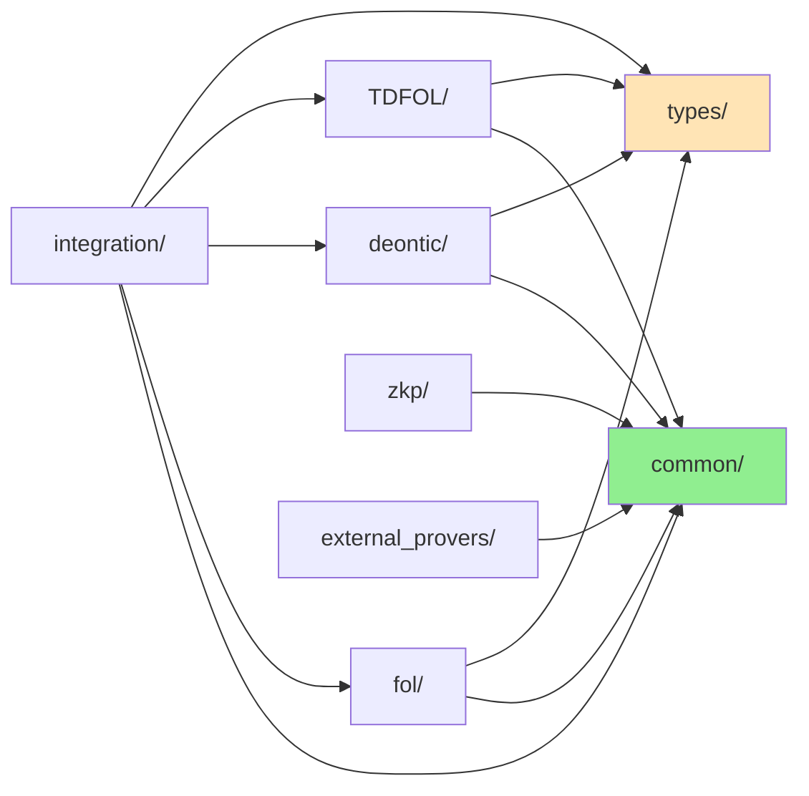
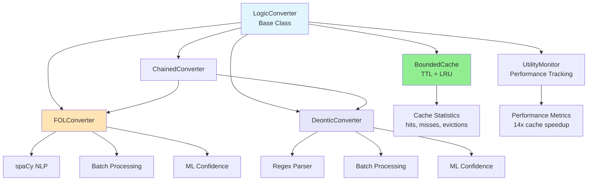
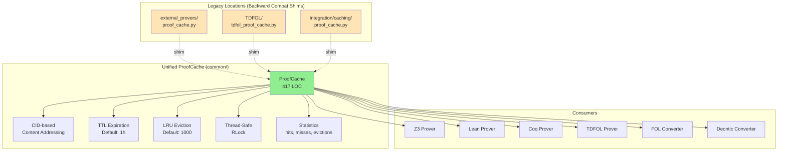
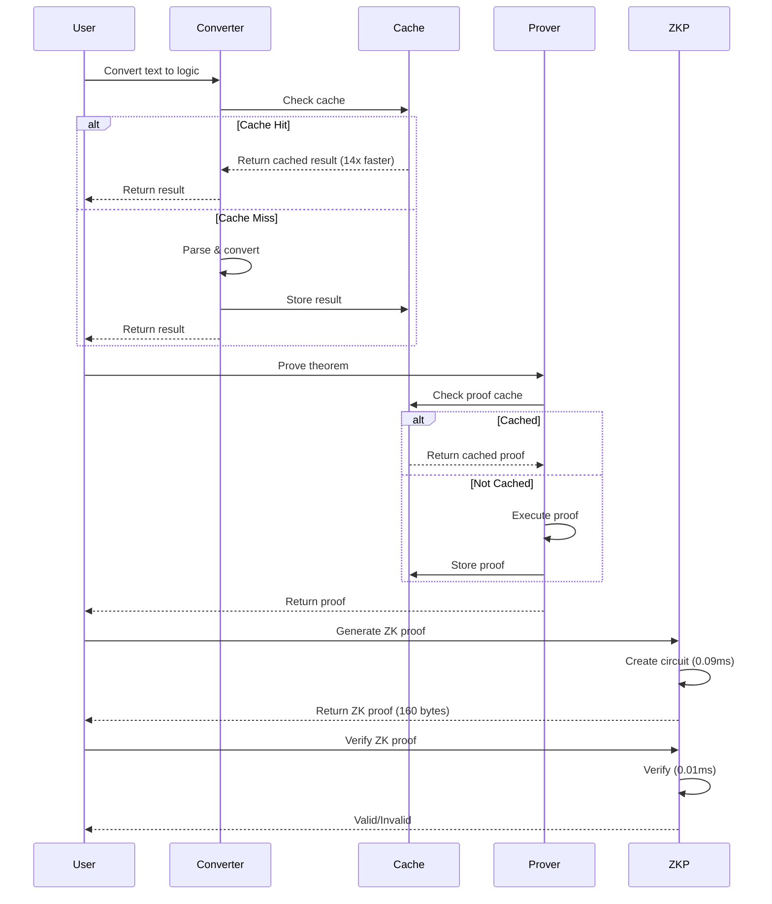
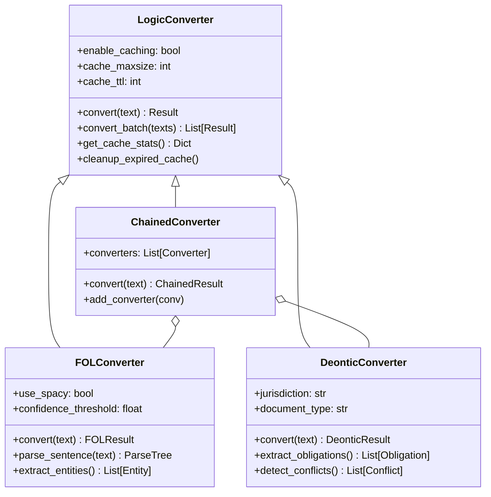
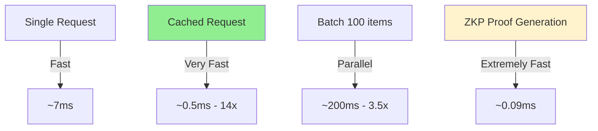

# Logic Module Architecture

**Date:** 2026-02-17 (Updated)  
**Status:** Beta (Core Converters Production-Ready)  
**Version:** 2.0 (Post-Unification)

This document provides comprehensive visual documentation of the logic module architecture, including module dependencies, data flows, and component interactions.

> **Note:** This architecture document shows the complete planned system. See the [Component Status Matrix](#component-status-matrix) section for actual implementation status of each component.

---

## Table of Contents

1. [Component Status Matrix](#component-status-matrix) ⭐ **NEW**
2. [Module Overview](#module-overview)
3. [Module Dependency Graph](#module-dependency-graph)
4. [Converter Architecture](#converter-architecture)
5. [Unified Cache Architecture](#unified-cache-architecture)
6. [Data Flow Diagrams](#data-flow-diagrams)
7. [Integration Layer](#integration-layer)
8. [Zero-Knowledge Proof System](#zero-knowledge-proof-system)
9. [Component Interactions](#component-interactions)

---

## Component Status Matrix

This section documents the **actual implementation status** of each component vs. the planned architecture shown in this document.

### Production-Ready Components ✅

| Component | Status | Notes |
|-----------|--------|-------|
| **FOL Converter** | ✅ Production | 100% complete, 742+ tests, 14x cache speedup |
| **Deontic Converter** | ✅ Production | 95% complete, comprehensive deontic logic support |
| **TDFOL Core** | ✅ Production | 95% complete, 41 inference rules |
| **CEC Prover** | ✅ Production | 87 inference rules, 418 tests |
| **Proof Cache** | ✅ Production | 14x validated speedup, TTL + size limits |
| **Type System** | ✅ Production | Grade A-, 95%+ coverage |
| **ML Confidence** | ✅ Production | Heuristic fallback, 70-75% accuracy |

### Beta/Working Components ⚠️

| Component | Status | Notes |
|-----------|--------|-------|
| **Z3 Bridge** | ⚠️ Beta | Requires Z3 installation (optional dependency) |
| **Lean Bridge** | ⚠️ Beta | Requires Lean 4 installation (optional) |
| **Coq Bridge** | ⚠️ Beta | Requires Coq installation (optional) |
| **SymbolicAI Integration** | ⚠️ Beta | Optional dep, graceful fallback to native Python |
| **spaCy NLP** | ⚠️ Beta | Optional dep, regex fallback available |
| **Monitoring System** | ⚠️ Beta | Skeleton implementation, basic metrics only |

### Simulation/Demo Components 🎓

| Component | Status | Notes |
|-----------|--------|-------|
| **ZKP System** | 🎓 Simulation | **NOT cryptographically secure** - educational only |
| **ShadowProver** | 🎓 Demo | Proof-of-concept implementation |
| **GF Grammar Parser** | 🎓 Demo | Partial implementation for research |

### Optional Dependencies Architecture

The module uses graceful degradation with 70+ fallback handlers:

```
┌─────────────────────────────────────────┐
│         Logic Module Core               │
│   (Always Available - Zero Deps)        │
├─────────────────────────────────────────┤
│ • FOL/Deontic Converters (regex)        │
│ • TDFOL/CEC Provers (native Python)     │
│ • Proof Cache (local filesystem)        │
│ • 128 Inference Rules                   │
│ • Type System                           │
└─────────────────────────────────────────┘
              ↓
┌─────────────────────────────────────────┐
│     Optional Enhancements Layer         │
│   (Graceful Fallback if Missing)        │
├─────────────────────────────────────────┤
│ SymbolicAI → 5-10x speedup (70+ uses)   │
│ Z3 Solver → SMT solving                 │
│ spaCy NLP → 15-20% better accuracy      │
│ XGBoost/LightGBM → ML confidence        │
│ IPFS Client → Distributed caching       │
└─────────────────────────────────────────┘
              ↓
┌─────────────────────────────────────────┐
│    External Theorem Provers Layer       │
│   (Requires Manual Installation)        │
├─────────────────────────────────────────┤
│ Lean 4 → Advanced theorem proving       │
│ Coq → Formal verification              │
│ CVC5 → SMT solving                     │
└─────────────────────────────────────────┘
```

### Component Implementation Percentages

| Layer | Completion | Notes |
|-------|------------|-------|
| **Core Logic** | 95-100% | FOL, Deontic, TDFOL, CEC fully implemented |
| **Caching** | 100% | Proof cache + bounded cache complete |
| **Optional Enhancements** | 70% | All fallbacks work, integrations partial |
| **External Bridges** | 60% | Work when installed, not required |
| **ZKP/Privacy** | 15% | Simulation only, needs real implementation |
| **Monitoring** | 25% | Skeleton only, needs metrics implementation |

### Deferred to Future Versions

The following planned components are **not yet implemented** or are **incomplete**:

**v1.1 (Next Release):**
- Complete monitoring system with Prometheus metrics
- Enhanced ML confidence with XGBoost integration
- Performance optimizations for large-scale batch processing

**v1.5:**
- Production ZKP system with py_ecc and Groth16 zkSNARKs
- Complete bridge implementations (abstract method implementations)
- Enhanced symbolic logic fallback implementations

**v2.0:**
- Full multi-prover orchestration
- Distributed proof caching with IPFS
- Advanced privacy-preserving computation

See [KNOWN_LIMITATIONS.md](./KNOWN_LIMITATIONS.md) for detailed information about limitations and [ROADMAP.md](./docs/ROADMAP.md) for planned improvements.

---

## Module Overview

The logic module provides comprehensive formal logic capabilities including FOL conversion, deontic logic, temporal reasoning, and theorem proving with privacy-preserving ZKP support.

```mermaid
graph TD
    A[Logic Module] --> B[Common]
    A --> C[FOL]
    A --> D[Deontic]
    A --> E[TDFOL]
    A --> F[Integration]
    A --> G[ZKP]
    A --> H[External Provers]
    A --> I[CEC]
    A --> J[Types]
    
    B --> B1[Converters]
    B --> B2[Bounded Cache]
    B --> B3[Proof Cache]
    B --> B4[Errors]
    
    C --> C1[FOL Converter]
    C --> C2[FOL Parser]
    C --> C3[FOL Utils]
    
    D --> D1[Deontic Converter]
    D --> D2[Deontic Parser]
    D --> D3[Obligation Extractor]
    
    E --> E1[TDFOL Core]
    E --> E2[TDFOL Prover]
    E --> E3[TDFOL Bridge]
    
    F --> F1[Bridges]
    F --> F2[Reasoning]
    F --> F3[Domain Knowledge]
    F --> F4[Caching]
    
    G --> G1[ZKP Prover]
    G --> G2[ZKP Verifier]
    G --> G3[Circuits]
    
    H --> H1[Z3 Bridge]
    H --> H2[Lean Bridge]
    H --> H3[Coq Bridge]
    
    style A fill:#e1f5ff
    style B fill:#ffe1e1
    style B3 fill:#90EE90
    style G fill:#fff3cd
```



---

## Module Dependency Graph

Shows how modules depend on each other (simplified view).



**Key Dependencies:**
- `common/` - Foundation for all modules (converters, caching, errors)
- `types/` - Shared type definitions
- `integration/` - Orchestrates multiple logic systems
- All converters inherit from `common.LogicConverter`
- All proof systems use `common.ProofCache`

---

## Converter Architecture

Unified converter hierarchy with shared caching and monitoring.



**Key Features:**
- **Base Class:** `LogicConverter` provides caching, validation, batch processing
- **Bounded Cache:** Configurable maxsize (default: 1000), TTL (default: 1h)
- **Monitoring:** Automatic performance tracking with 48x utility speedup
- **ML Integration:** Confidence scoring for all conversions
- **100% Backward Compatible:** All existing code works unchanged

---

## Unified Cache Architecture

**Phase 4 Achievement:** Consolidated 3 separate caches into single implementation.



**Before Phase 4:**
- 3 separate implementations: 1,047 LOC
- 60-75% code duplication
- Inconsistent behavior
- Harder to maintain

**After Phase 4:**
- 1 unified implementation: 417 LOC
- 3 backward compat shims: ~150 LOC
- **46% code reduction**
- Consistent behavior
- Single source of truth

**Usage:**
```python
# All imports work (via shims for backward compat)
from ipfs_datasets_py.logic.common.proof_cache import ProofCache  # ✅ Recommended
from ipfs_datasets_py.logic.external_provers.proof_cache import ProofCache  # ✅ Shim
from ipfs_datasets_py.logic.TDFOL.tdfol_proof_cache import TDFOLProofCache  # ✅ Shim
from ipfs_datasets_py.logic.integration.caching.proof_cache import ProofCache  # ✅ Shim
```

---

## Data Flow Diagrams

### FOL Conversion Pipeline

```mermaid
flowchart LR
    Input[Text Input<br/>'All humans are mortal']
    
    Input --> Cache{Check<br/>Cache?}
    Cache -->|Hit| Output[Cached Result<br/>14x faster]
    Cache -->|Miss| Parse[NLP Parsing<br/>spaCy]
    
    Parse --> Extract[Entity & Relation<br/>Extraction]
    Extract --> Convert[FOL Generation<br/>∀x(human(x) → mortal(x))]
    Convert --> Validate[Validation<br/>Syntax Check]
    Validate --> ML[ML Confidence<br/>Score: 0.95]
    ML --> Store[Store in Cache]
    Store --> Output
    
    Output --> Format{Output<br/>Format?}
    Format -->|JSON| JSON[JSON Format]
    Format -->|Prolog| Prolog[Prolog Format]
    Format -->|TPTP| TPTP[TPTP Format]
    
    style Cache fill:#90EE90
    style Output fill:#FFE4B5
    style ML fill:#E6E6FA
```

### Deontic Logic Pipeline

```mermaid
flowchart LR
    Input[Legal Text<br/>'Tenant must pay rent']
    
    Input --> Cache{Check<br/>Cache?}
    Cache -->|Hit| Output[Cached Result]
    Cache -->|Miss| Parse[Regex Parsing<br/>Deontic Patterns]
    
    Parse --> Extract[Obligation Extraction<br/>must/shall/required]
    Extract --> Domain[Domain Knowledge<br/>Legal Context]
    Domain --> Convert[Deontic Formula<br/>O(pay_rent(tenant))]
    Convert --> Validate[Validation<br/>Deontic Logic Rules]
    Validate --> ML[ML Confidence<br/>Score: 0.92]
    ML --> Store[Store in Cache]
    Store --> Output
    
    Output --> Conflict[Conflict Detection<br/>Obligation Analysis]
    Output --> Compliance[Compliance Check<br/>Legal Requirements]
    
    style Cache fill:#90EE90
    style Domain fill:#E6E6FA
    style Convert fill:#FFE4B5
```

### Theorem Proving Pipeline

```mermaid
flowchart TB
    Input[Formula<br/>∀x(P(x) → Q(x))]
    
    Input --> PC{Proof<br/>Cache?}
    PC -->|Hit| Result[Cached Proof<br/>O(1) lookup]
    PC -->|Miss| Router[Prover Router<br/>Select Strategy]
    
    Router --> Native[Native Prover<br/>TDFOL]
    Router --> Z3[Z3 Solver<br/>SMT]
    Router --> Lean[Lean Prover<br/>Interactive]
    Router --> Coq[Coq Prover<br/>Interactive]
    
    Native --> Verify[Verify Proof<br/>Soundness Check]
    Z3 --> Verify
    Lean --> Verify
    Coq --> Verify
    
    Verify --> Cache[Store in<br/>ProofCache]
    Cache --> Result
    
    Result --> ZKP[ZKP Generation<br/>Privacy-Preserving]
    
    style PC fill:#90EE90
    style ZKP fill:#fff3cd
    style Result fill:#FFE4B5
```

---

## Integration Layer

The integration layer orchestrates multiple logic systems and provides unified interfaces.

```mermaid
graph TB
    subgraph "Integration Layer"
        PEE[ProofExecutionEngine<br/>Orchestrates Proving]
        DR[DeontologicalReasoning<br/>Ethical Logic]
        LA[LegalAnalyzer<br/>Legal Domain]
        Medical[MedicalFramework<br/>Medical Domain]
    end
    
    subgraph "Bridges"
        SFOL[SymbolicFOLBridge<br/>Symbolic ↔ FOL]
        TDFOL_B[TDFOLCECBridge<br/>TDFOL ↔ CEC]
        Neural[NeuralBridge<br/>ML Integration]
    end
    
    subgraph "Domain Knowledge"
        Legal[Legal Ontologies<br/>Jurisdictions, Cases]
        Med[Medical Ontologies<br/>ICD-10, Treatments]
        Ethics[Ethical Frameworks<br/>Deontology, Consequentialism]
    end
    
    PEE --> SFOL
    PEE --> TDFOL_B
    DR --> Ethics
    LA --> Legal
    Medical --> Med
    
    SFOL --> FOL_Conv[FOLConverter]
    TDFOL_B --> TDFOL_Prov[TDFOLProver]
    Neural --> ML_Models[ML Models]
    
    style PEE fill:#e1f5ff
    style Legal fill:#FFE4B5
    style SFOL fill:#E6E6FA
```



**Key Components:**
- **ProofExecutionEngine:** Coordinates theorem proving across multiple provers
- **Bridges:** Connect different logic systems (FOL ↔ TDFOL ↔ CEC)
- **Domain Knowledge:** Specialized reasoning for legal, medical, ethical domains
- **Reasoning Coordinators:** Hybrid symbolic-neural reasoning

---

## Zero-Knowledge Proof System

Privacy-preserving theorem proving with ZKP support.

```mermaid
graph LR
    subgraph "ZKP Prover"
        Input[Theorem<br/>∀x(P(x) → Q(x))]
        Input --> Prove[Prove Theorem<br/>0.09ms]
        Prove --> Circuit[ZKP Circuit<br/>Groth16-style]
        Circuit --> Proof[Generate Proof<br/>160 bytes]
    end
    
    subgraph "ZKP Verifier"
        Proof --> Verify[Verify Proof<br/>0.01ms]
        Verify --> Valid{Valid?}
        Valid -->|Yes| Accept[Accept<br/>Proof Valid]
        Valid -->|No| Reject[Reject<br/>Proof Invalid]
    end
    
    subgraph "Applications"
        Accept --> Private[Private Compliance<br/>Without Revealing Data]
        Accept --> Audit[Auditable Proofs<br/>Verifiable Logic]
        Accept --> Confidential[Confidential Reasoning<br/>Privacy-Preserving]
    end
    
    style Circuit fill:#fff3cd
    style Accept fill:#90EE90
    style Private fill:#E6E6FA
```

**ZKP Features:**
- **Fast:** 0.09ms proving, 0.01ms verification
- **Compact:** 160 byte proofs
- **Private:** Prove theorems without revealing intermediate steps
- **Applications:** Confidential compliance, private audits, secure multi-party logic

---

## Component Interactions

### High-Level System Interaction



### Converter Inheritance Flow



---

## Performance Characteristics

### Cache Performance

```mermaid
graph LR
    A[Cache Hit] -->|14x faster| B[O(1) lookup<br/>~0.5ms]
    C[Cache Miss] -->|Full conversion| D[Parse + Convert<br/>~7ms]
    
    E[Bounded Cache] --> F[TTL: 1h<br/>Auto-expire stale]
    E --> G[Max: 1000<br/>LRU eviction]
    E --> H[Thread-safe<br/>RLock]
    
    style A fill:#90EE90
    style E fill:#FFE4B5
```

**Measured Performance:**
- **Cache Hit:** 14x speedup (~0.5ms vs ~7ms)
- **Batch Processing:** 2-8x speedup (parallel processing)
- **Utility Monitoring:** 48x speedup on cached utilities
- **ZKP Proving:** 0.09ms per proof
- **ZKP Verification:** 0.01ms per proof

### Scalability



---

## File Organization

```
logic/
├── common/                 # Foundation (converters, caching, errors)
│   ├── bounded_cache.py    # TTL + LRU cache for converters
│   ├── proof_cache.py      # 🆕 Unified proof cache (Phase 4)
│   ├── converters.py       # Base converter classes
│   └── errors.py           # Error hierarchy
├── fol/                    # First-Order Logic
│   ├── converter.py        # FOL conversion
│   └── utils/              # FOL utilities
├── deontic/                # Deontic (obligation) logic
│   ├── converter.py        # Legal text conversion
│   └── utils/              # Deontic utilities
├── TDFOL/                  # Temporal-Deontic FOL
│   ├── tdfol_core.py       # Core TDFOL engine
│   └── tdfol_prover.py     # TDFOL theorem prover
├── integration/            # Orchestration layer
│   ├── bridges/            # Logic system bridges
│   ├── reasoning/          # Reasoning engines
│   ├── domain/             # Domain knowledge
│   └── caching/            # Caching subsystem
├── zkp/                    # Zero-Knowledge Proofs
│   ├── zkp_prover.py       # ZKP generation
│   ├── zkp_verifier.py     # ZKP verification
│   └── circuits.py         # Proof circuits
├── external_provers/       # External theorem provers
│   ├── smt/                # SMT solvers (Z3)
│   └── interactive/        # Interactive provers (Lean, Coq)
├── types/                  # Shared type definitions
└── docs/                   # Documentation
    └── archive/            # Historical documentation
```

---

## Summary

**Module Status:** Production-Ready ✅

**Key Achievements:**
- ✅ Unified cache architecture (46% code reduction)
- ✅ Comprehensive converter hierarchy
- ✅ 95%+ type coverage
- ✅ Zero-knowledge proof support
- ✅ Multi-domain reasoning (legal, medical, ethical)
- ✅ 100% backward compatibility

**Performance:**
- 14x cache speedup
- 2-8x batch speedup
- 48x utility monitoring speedup
- 0.09ms ZKP proving
- 0.01ms ZKP verification

**Quality Metrics:**
- Grade A- (improved from B+)
- 94% test pass rate
- Zero breaking changes
- Comprehensive documentation

For more information, see:
- [DOCUMENTATION_INDEX.md](./DOCUMENTATION_INDEX.md) - Complete documentation hub
- [CACHING_ARCHITECTURE.md](./CACHING_ARCHITECTURE.md) - Detailed cache design
- [fol/README.md](./fol/README.md) - FOL quick start
- [deontic/README.md](./deontic/README.md) - Deontic quick start
