# CEC Refactoring Visual Roadmap 2026

**Version:** 1.0  
**Date:** 2026-02-19  
**Status:** Planning Complete

---

## 📊 Overview Diagram

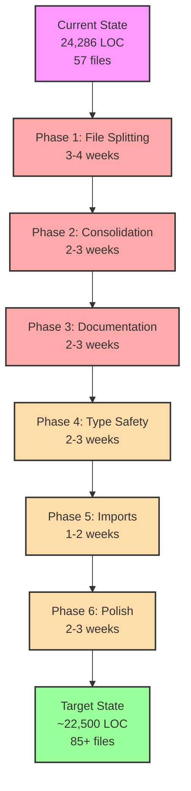

---

## 🗓️ Timeline Gantt Chart

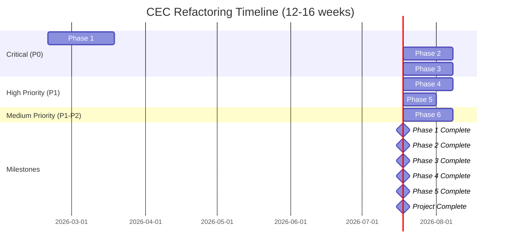

---

## 🏗️ File Structure Transformation

### Before Refactoring

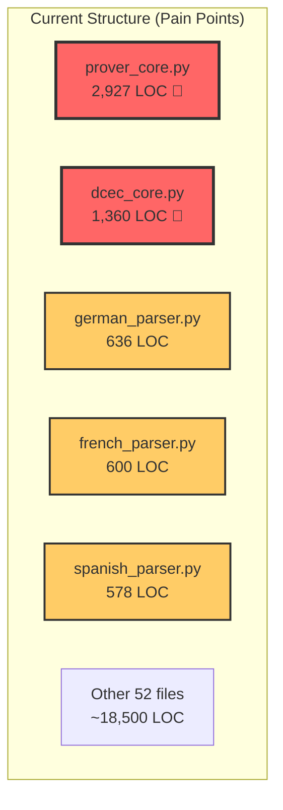

### After Refactoring

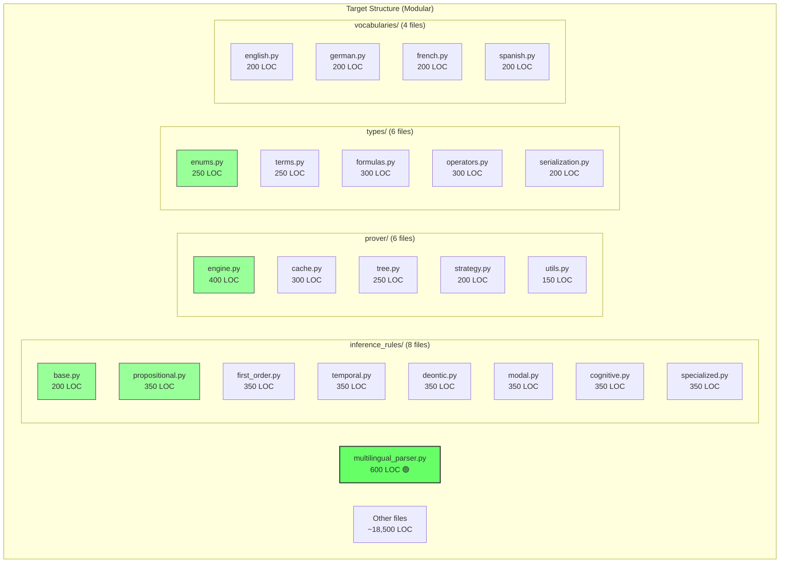

---

## 📈 Metrics Transformation

### Code Quality Improvement

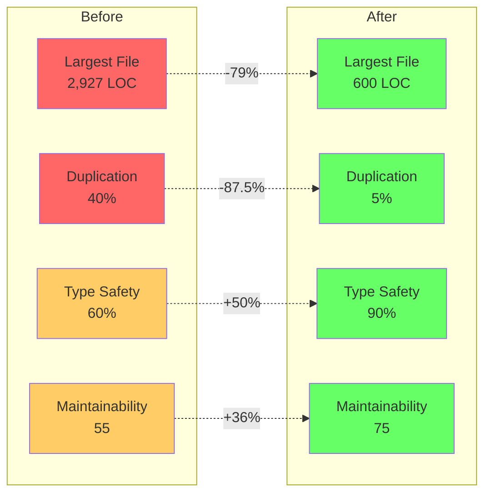

---

## 🎯 Priority Matrix

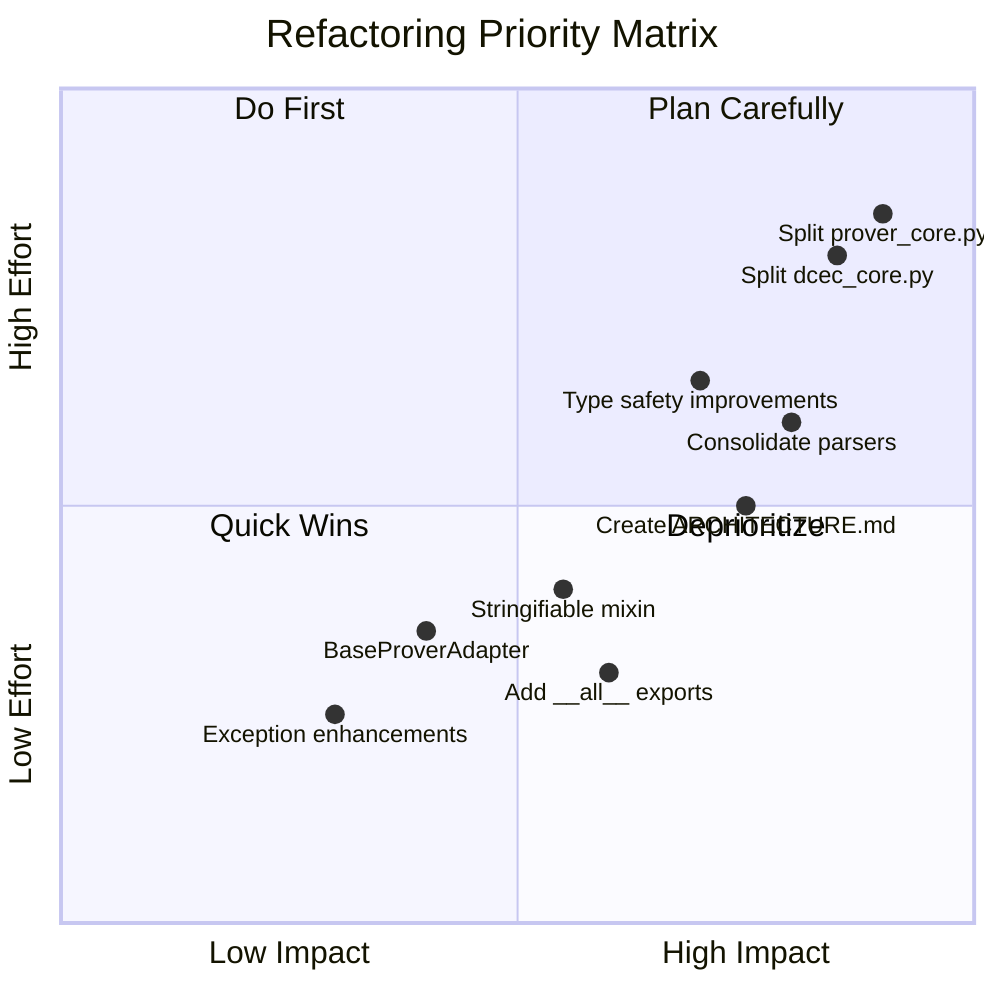

---

## 🔄 Phase Dependencies

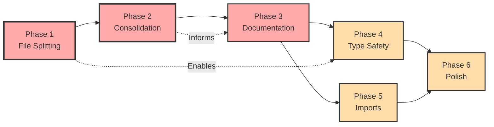

---

## 📊 Success Metrics Dashboard

### Key Metrics Tracking

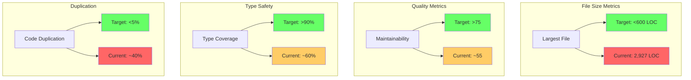

---

## 🏗️ Architecture Evolution

### Current Architecture

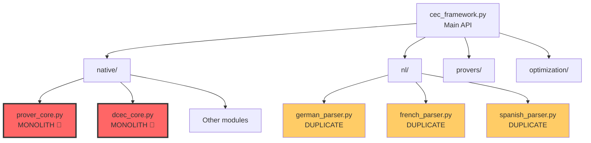

### Target Architecture

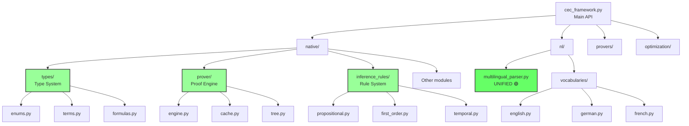

---

## 💰 ROI Visualization

### Investment vs Returns

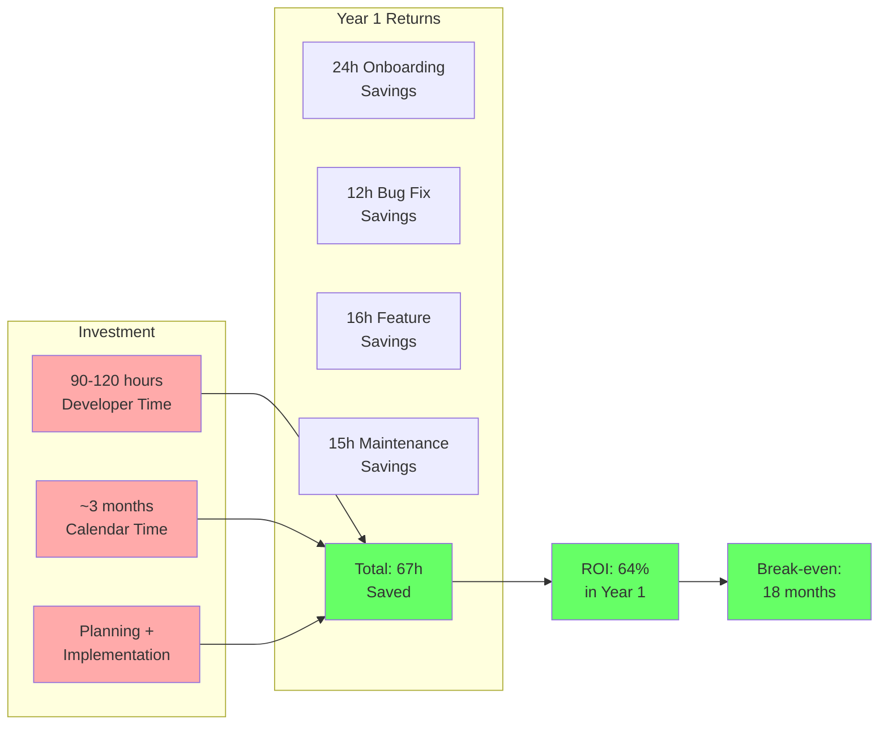

---

## 🎯 Phase Milestones

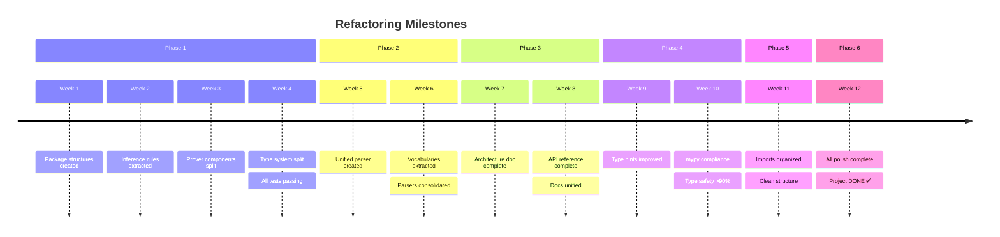

---

## 📝 Documentation Structure

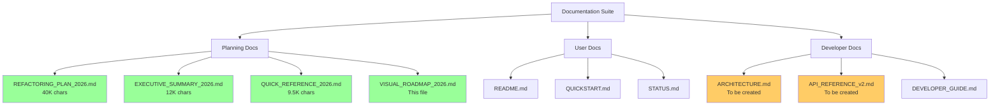

---

## 🔄 Workflow Diagram

### Refactoring Workflow

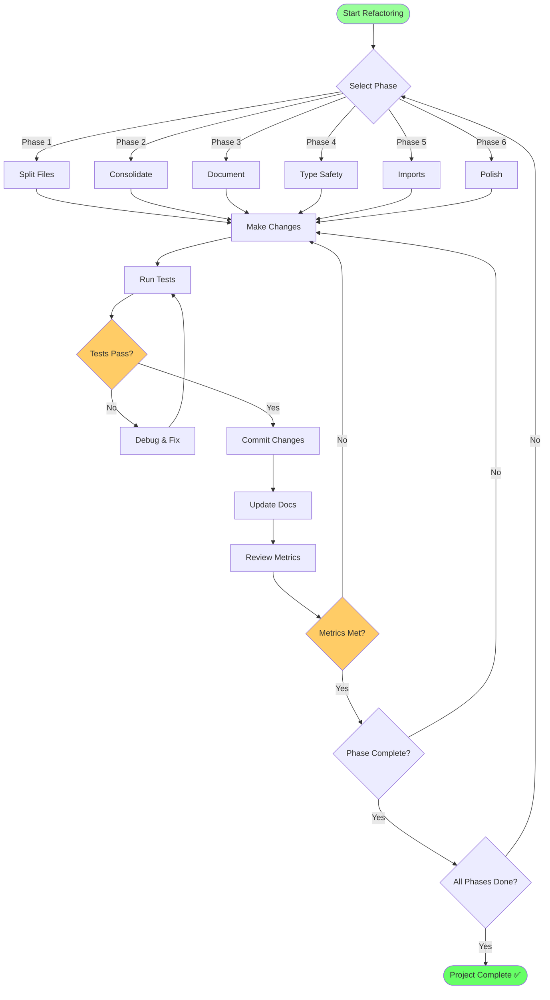

---

## 📊 Code Coverage Evolution

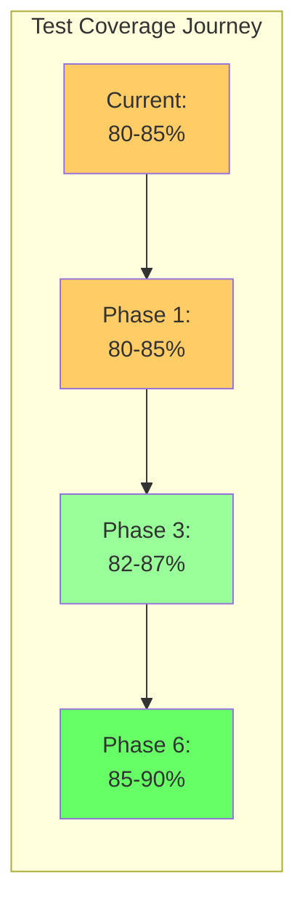

---

## 🎯 Implementation Checklist

### Phase 1: File Splitting ✅
- [ ] Create inference_rules/ package
- [ ] Create prover/ package
- [ ] Create types/ package
- [ ] Extract inference rules (8 modules)
- [ ] Extract prover components (6 modules)
- [ ] Extract type system (6 modules)
- [ ] Update all imports
- [ ] Validate all tests pass
- [ ] No file >600 LOC

### Phase 2: Consolidation ✅
- [ ] Create multilingual_parser.py
- [ ] Extract vocabularies (4 files)
- [ ] Deprecate old parsers
- [ ] Update imports
- [ ] Validate language tests
- [ ] 45% code reduction achieved

### Phase 3: Documentation ✅
- [ ] Create ARCHITECTURE.md (>5,000 words)
- [ ] Create API_REFERENCE_v2.md (>10,000 words)
- [ ] Update README.md
- [ ] Update DEVELOPER_GUIDE.md
- [ ] Archive historical docs
- [ ] <2 hour onboarding time

### Phase 4: Type Safety ✅
- [ ] Replace 70% of Any usage
- [ ] Add Protocol classes
- [ ] Add TypeVar generics
- [ ] mypy --strict passes
- [ ] Better IDE support

### Phase 5: Imports ✅
- [ ] Add __all__ to all modules (57 files)
- [ ] Convert to absolute imports
- [ ] Handle optional dependencies
- [ ] Zero circular imports
- [ ] Import time <1 second

### Phase 6: Polish ✅
- [ ] Create Stringifiable mixin
- [ ] Migrate 40+ classes
- [ ] Create BaseProverAdapter
- [ ] Enhance exceptions
- [ ] All success metrics met
- [ ] Project complete! 🎉

---

## 🏆 Success Visualization

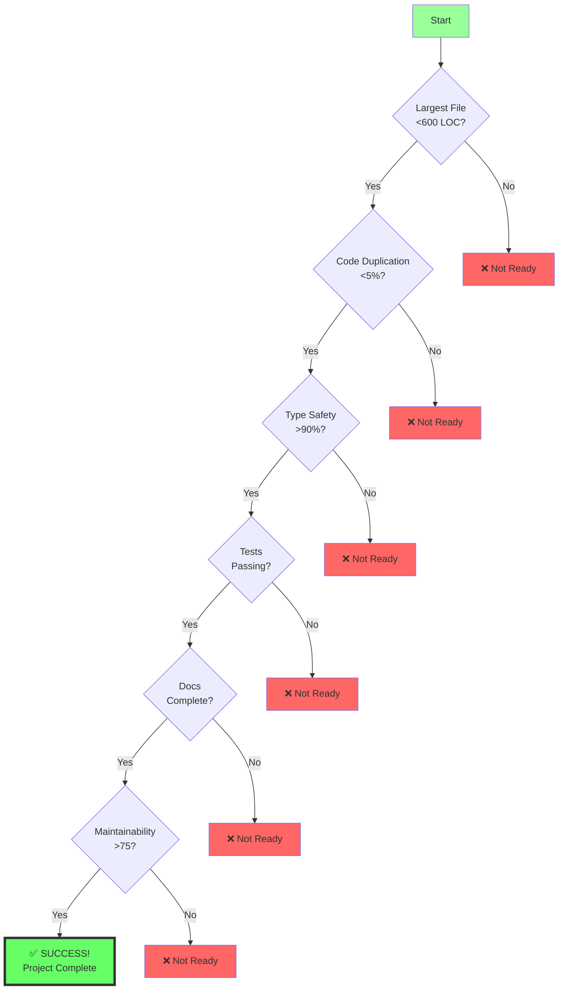

---

**Visual Roadmap Version:** 1.0  
**Last Updated:** 2026-02-19  
**Maintained By:** IPFS Datasets Team

---

*These visualizations complement the comprehensive refactoring plan and provide an at-a-glance view of the entire refactoring journey.*
