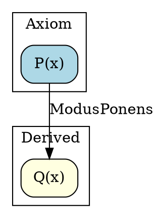

# TDFOL Formula Dependency Graph

## Overview

The Formula Dependency Graph module provides comprehensive dependency analysis and visualization for TDFOL formulas. It enables tracking, analyzing, and visualizing how formulas relate to each other through inference steps, making it easy to understand proof structure and identify optimization opportunities.

**Module:** `ipfs_datasets_py.logic.TDFOL.formula_dependency_graph`

**Phase 11 Task 11.2**

## Key Features

### 1. Dependency Extraction (4h)
- Extract formula dependencies from proof results
- Identify which formulas are used to derive others
- Build dependency relationships from proof steps
- Handle different proof types (forward, backward, tableaux)
- Support for axioms, theorems, and derived formulas

### 2. DAG Construction (3h)
- Build Directed Acyclic Graph from dependencies
- Nodes represent formulas
- Edges represent inference relationships
- Detect and handle circular dependencies
- Compute topological ordering
- Identify critical paths (shortest proof chains)

### 3. GraphViz Visualization (3h)
- Export to DOT format
- Node styling by formula type (axiom, theorem, derived)
- Edge labels showing inference rules used
- Highlight critical paths in different colors
- Cluster related formulas
- Support for large graphs with good layout

### 4. Analysis Features
- Find shortest proof paths between formulas
- Identify unused axioms
- Detect redundant formulas
- Export in multiple formats (DOT, JSON, adjacency matrix)
- Comprehensive graph statistics

## Installation

The module is part of the TDFOL package and requires no additional dependencies for core functionality. For GraphViz visualization support:

```bash
pip install graphviz
```

## Quick Start

### Basic Usage

```python
from ipfs_datasets_py.logic.TDFOL import (
    FormulaDependencyGraph,
    ProofResult,
    TDFOLKnowledgeBase
)

# From a proof result
graph = FormulaDependencyGraph(proof_result=result)

# From a knowledge base
graph = FormulaDependencyGraph(kb=knowledge_base)

# Build incrementally
graph = FormulaDependencyGraph()
graph.add_formula(conclusion, [premise1, premise2], "ModusPonens")
```

### Analyzing Dependencies

```python
# Get direct dependencies
deps = graph.get_dependencies(formula)

# Get all transitive dependencies
all_deps = graph.get_all_dependencies(formula)

# Find critical path
path = graph.find_critical_path(axiom, theorem)

# Get statistics
stats = graph.get_statistics()
```

### Export and Visualization

```python
# Export to DOT format
graph.export_dot("proof.dot", highlight_path=critical_path)

# Export to JSON
graph.export_json("proof.json")

# Export adjacency matrix
graph.export_adjacency_matrix("matrix.csv")
```

## Core Classes

### FormulaDependencyGraph

Main class for dependency analysis.

```python
class FormulaDependencyGraph:
    def __init__(
        self,
        proof_result: Optional[ProofResult] = None,
        kb: Optional[TDFOLKnowledgeBase] = None
    )
```

**Key Methods:**

- `add_proof(proof_result)` - Add dependencies from proof
- `add_formula(formula, depends_on, rule)` - Add formula manually
- `get_dependencies(formula)` - Get direct dependencies
- `get_dependents(formula)` - Get formulas that depend on this
- `find_critical_path(start, end)` - Find shortest path
- `topological_sort()` - Get topological ordering
- `detect_cycles()` - Detect circular dependencies
- `find_unused_axioms()` - Find unused axioms
- `find_redundant_formulas()` - Find redundant formulas
- `export_dot(path)` - Export to DOT format
- `export_json(path)` - Export to JSON
- `export_adjacency_matrix(path)` - Export as CSV matrix

### DependencyNode

Represents a formula in the graph.

```python
@dataclass
class DependencyNode:
    formula: Formula
    node_type: FormulaType
    name: Optional[str] = None
    metadata: Dict[str, Any] = field(default_factory=dict)
```

### DependencyEdge

Represents an inference step.

```python
@dataclass
class DependencyEdge:
    source: DependencyNode
    target: DependencyNode
    rule_name: Optional[str] = None
    justification: str = ""
    edge_type: DependencyType = DependencyType.DIRECT
```

## Enumerations

### FormulaType

Type of formula in the graph:

- `AXIOM` - Given axiom
- `THEOREM` - Proved theorem
- `DERIVED` - Derived formula
- `PREMISE` - Premise/assumption
- `GOAL` - Goal formula
- `LEMMA` - Intermediate lemma

### DependencyType

Type of dependency relationship:

- `DIRECT` - Direct inference
- `TRANSITIVE` - Transitive dependency
- `SUPPORT` - Supporting formula

## Usage Examples

### Example 1: Linear Proof Chain

```python
from ipfs_datasets_py.logic.TDFOL import *

# Create formulas
p = Predicate("Person", (Variable("x"),))
q = Predicate("Mortal", (Variable("x"),))
r = Predicate("Dies", (Variable("x"),))

# Create proof
proof = ProofResult(
    status=ProofStatus.PROVED,
    formula=r,
    proof_steps=[
        ProofStep(p, "Given axiom", "Axiom", []),
        ProofStep(q, "All persons are mortal", "ModusPonens", [p]),
        ProofStep(r, "All mortals die", "ModusPonens", [q])
    ]
)

# Build dependency graph
graph = FormulaDependencyGraph(proof_result=proof)

# Find critical path
path = graph.find_critical_path(p, r)
print(f"Critical path: {' → '.join(str(f) for f in path)}")

# Get statistics
stats = graph.get_statistics()
print(f"Nodes: {stats['num_nodes']}, Edges: {stats['num_edges']}")
```

### Example 2: Branching Proof

```python
# Create graph with multiple premises
graph = FormulaDependencyGraph()

# Add axioms
graph.add_formula(p, [], "Axiom", node_type=FormulaType.AXIOM)
graph.add_formula(r, [], "Axiom", node_type=FormulaType.AXIOM)

# Derive from single premise
graph.add_formula(q, [p], "ImplicationElim", "Rain makes ground wet")

# Derive from multiple premises
graph.add_formula(s, [q, r], "ConjunctionIntro", "Wet + Cold = Slippery")

# Topological sort
order = graph.topological_sort()
print("Proof order:", order)
```

### Example 3: Cycle Detection

```python
# Create graph with potential cycle
graph = FormulaDependencyGraph()
graph.add_formula(p, [], "Axiom")
graph.add_formula(q, [p], "Rule1")
graph.add_formula(p, [q], "Rule2")  # Creates cycle!

# Detect cycles
cycles = graph.detect_cycles()
if cycles:
    print(f"Circular dependency detected: {cycles[0]}")
    
# Topological sort will raise CircularDependencyError
try:
    order = graph.topological_sort()
except CircularDependencyError as e:
    print(f"Cannot sort: {e.message}")
```

### Example 4: Finding Unused Axioms

```python
# Create knowledge base
kb = TDFOLKnowledgeBase()
kb.add_axiom(axiom1, "axiom_1")
kb.add_axiom(axiom2, "axiom_2")
kb.add_axiom(axiom3, "axiom_3")

# Build graph
graph = FormulaDependencyGraph(kb=kb)

# Add proof using only axiom1 and axiom2
graph.add_proof(proof)

# Find unused axioms
unused = graph.find_unused_axioms()
print(f"Unused axioms: {unused}")  # Will contain axiom3
```

### Example 5: Export and Visualization

```python
from pathlib import Path

# Create graph
graph = FormulaDependencyGraph(proof_result=proof)

# Find critical path
critical = graph.find_critical_path(start, end)

# Export DOT with highlighted path
graph.export_dot(
    "dependencies.dot",
    highlight_path=critical,
    include_labels=True,
    cluster_by_type=True
)

# Export JSON
graph.export_json("dependencies.json")

# Export adjacency matrix
graph.export_adjacency_matrix("matrix.csv")

# Or use convenience function
from ipfs_datasets_py.logic.TDFOL import analyze_proof_dependencies

graph = analyze_proof_dependencies(proof, output_dir=Path("./output"))
```

## Convenience Functions

### analyze_proof_dependencies

Analyze proof and export all formats:

```python
def analyze_proof_dependencies(
    proof_result: ProofResult,
    output_dir: Optional[Path] = None
) -> FormulaDependencyGraph:
    """
    Analyze dependencies and export visualizations.
    
    Args:
        proof_result: Proof to analyze
        output_dir: Optional directory for exports
        
    Returns:
        FormulaDependencyGraph with analysis results
    """
```

### find_proof_chain

Find shortest path between formulas:

```python
def find_proof_chain(
    start: Formula,
    end: Formula,
    kb: TDFOLKnowledgeBase,
    proof_results: List[ProofResult]
) -> Optional[List[Formula]]:
    """
    Find shortest proof chain from start to end.
    
    Args:
        start: Starting formula
        end: Target formula
        kb: Knowledge base
        proof_results: Proofs to analyze
        
    Returns:
        Shortest proof chain or None
    """
```

## Output Formats

### DOT Format

GraphViz DOT format for visualization:



### JSON Format

Structured JSON for programmatic access:

```json
{
  "nodes": [
    {
      "id": "P(x)",
      "formula": "P(x)",
      "type": "axiom",
      "name": "axiom_p"
    },
    {
      "id": "Q(x)",
      "formula": "Q(x)",
      "type": "derived",
      "name": null
    }
  ],
  "edges": [
    {
      "source": "P(x)",
      "target": "Q(x)",
      "rule": "ModusPonens",
      "type": "direct"
    }
  ],
  "statistics": {
    "num_nodes": 2,
    "num_edges": 1,
    "has_cycles": false
  }
}
```

### Adjacency Matrix (CSV)

CSV format for matrix operations:

```csv
,"P(x)","Q(x)","R(x)"
"P(x)",0,1,0
"Q(x)",0,0,1
"R(x)",0,0,0
```

## Advanced Features

### Multiple Paths Analysis

```python
# Find all paths between formulas
all_paths = graph.find_all_paths(start, end, max_length=10)

print(f"Found {len(all_paths)} paths:")
for i, path in enumerate(all_paths):
    print(f"Path {i+1}: {' → '.join(str(f) for f in path)}")
```

### Transitive Dependencies

```python
# Get all formulas this depends on
all_deps = graph.get_all_dependencies(formula)

# Get all formulas depending on this
all_dependents = graph.get_all_dependents(formula)

# Analyze dependency depth
depth = len(graph.get_all_dependencies(formula))
print(f"Proof depth: {depth}")
```

### Redundancy Analysis

```python
# Find redundant formulas
redundant = graph.find_redundant_formulas()

for f1, f2 in redundant:
    print(f"{f1} is redundant (depends on {f2})")
```

## Performance Considerations

- **Graph Construction:** O(V + E) where V is formulas, E is dependencies
- **Topological Sort:** O(V + E)
- **Critical Path:** O(V + E) using BFS
- **Cycle Detection:** O(V + E) using DFS
- **All Paths:** Exponential in worst case (use max_length to limit)

## Error Handling

### CircularDependencyError

Raised when circular dependencies are detected:

```python
try:
    order = graph.topological_sort()
except CircularDependencyError as e:
    print(f"Cycle detected: {e.cycle}")
    print(f"Message: {e.message}")
```

## Integration with TDFOL

The dependency graph integrates seamlessly with other TDFOL components:

```python
# From proof tree visualizer
from ipfs_datasets_py.logic.TDFOL import visualize_proof

visualizer = visualize_proof(proof_result)
graph = FormulaDependencyGraph(proof_result=proof_result)

# From prover
from ipfs_datasets_py.logic.TDFOL import TDFOLProver

prover = TDFOLProver(kb)
result = prover.prove(formula)
graph = FormulaDependencyGraph(proof_result=result)

# With proof cache
from ipfs_datasets_py.logic.TDFOL import get_global_proof_cache

cache = get_global_proof_cache()
cached_result = cache.get(formula)
graph = FormulaDependencyGraph(proof_result=cached_result)
```

## Testing

Comprehensive test suite with 36 tests covering:

- Node and edge creation
- Graph construction
- Dependency queries
- Cycle detection
- Topological sorting
- Critical path finding
- Analysis features
- Export formats
- Integration scenarios

Run tests:

```bash
pytest tests/unit/logic/TDFOL/test_formula_dependency_graph.py -v
```

## Examples

Complete examples demonstrating all features:

```bash
python ipfs_datasets_py/logic/TDFOL/example_formula_dependency_graph.py
```

Examples include:
1. Simple linear proof chain
2. Branching proof with multiple premises
3. Knowledge base integration
4. Circular dependency detection
5. Multiple paths between formulas
6. Export formats
7. Convenience functions
8. Redundancy analysis

## See Also

- **Proof Tree Visualizer:** Complementary visualization tool
- **TDFOL Prover:** Generates proof results for analysis
- **TDFOL Parser:** Parses formulas from strings
- **Knowledge Base:** Manages axioms and theorems

## References

- Phase 11 Task 11.2: Formula Dependency Graph
- TDFOL Documentation: `ipfs_datasets_py/logic/TDFOL/README.md`
- GraphViz Documentation: https://graphviz.org/
