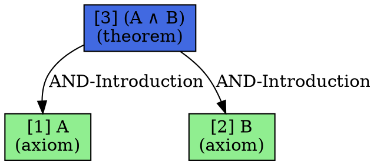

# TDFOL Proof Tree Visualizer

## Overview

The **Proof Tree Visualizer** is a comprehensive visualization module for TDFOL (Temporal Deontic First-Order Logic) proofs. It provides multiple output formats to help understand and communicate formal proofs.

## Features

### 1. ASCII Tree Rendering
- **Box-drawing characters** for clean tree structure (├─, └─, │, ─)
- **Multiple styles**: compact, expanded, detailed
- **Terminal colors** (via colorama) for node type highlighting
- **Step numbering** for easy reference
- **Inference rule annotations**
- **Collapsible sub-proofs** for detailed mode

### 2. GraphViz Visualization
- **DOT format export** for external tools
- **SVG rendering** (requires GraphViz)
- **PNG rendering** (requires GraphViz)
- **Node coloring by type**:
  - Green: Axioms
  - Blue: Theorems
  - Yellow: Inferred steps
  - Red: Contradictions
  - Cyan: Premises
  - Gray: Lemmas
- **Edge labels** showing inference rules
- **Automatic layout** for large trees

### 3. Interactive HTML
- **Embedded SVG** visualization
- **Proof metadata** display
- **Step-by-step proof** listing
- **Interactive features** (hover, click)
- **Responsive design**

### 4. JSON Export
- **Structured data** format
- **Full tree structure**
- **Step-by-step information**
- **Metadata included**
- **Programmatic access**

## Installation

### Core Dependencies
```bash
pip install ipfs_datasets_py  # Includes proof tree visualizer
```

### Optional Dependencies

For enhanced visualizations:
```bash
# Terminal colors (optional)
pip install colorama

# GraphViz Python library (optional, for SVG/PNG/HTML)
pip install graphviz

# GraphViz command-line tool (required for SVG/PNG/HTML)
# Ubuntu/Debian:
sudo apt-get install graphviz

# macOS:
brew install graphviz

# Windows: Download from https://graphviz.org/download/
```

## Usage

### Basic Usage

```python
from ipfs_datasets_py.logic.TDFOL.proof_tree_visualizer import ProofTreeVisualizer
from ipfs_datasets_py.logic.TDFOL.tdfol_prover import ProofResult

# Assuming you have a ProofResult from the prover
visualizer = ProofTreeVisualizer(proof_result)

# ASCII output (terminal-friendly)
print(visualizer.render_ascii(style='detailed', colors=True))

# Export to DOT file
visualizer.export_dot("proof.dot")

# Render to SVG (requires GraphViz)
visualizer.render_svg("proof.svg")

# Interactive HTML (requires GraphViz)
visualizer.render_html("proof.html", interactive=True)

# JSON export
visualizer.export_json("proof.json")
```

### Convenience Function

```python
from ipfs_datasets_py.logic.TDFOL.proof_tree_visualizer import visualize_proof

# Quick ASCII output
print(visualize_proof(proof_result, output_format='ascii', colors=True))

# Quick file export
visualize_proof(proof_result, output_format='svg', output_path='proof.svg')
visualize_proof(proof_result, output_format='html', output_path='proof.html')
visualize_proof(proof_result, output_format='json', output_path='proof.json')
```

### Advanced Usage

```python
from ipfs_datasets_py.logic.TDFOL.proof_tree_visualizer import (
    ProofTreeVisualizer,
    VerbosityLevel,
    TreeStyle
)

# Create visualizer with custom verbosity
visualizer = ProofTreeVisualizer(
    proof_result,
    verbosity=VerbosityLevel.DETAILED
)

# Render with specific style and width
ascii_output = visualizer.render_ascii(
    style='detailed',
    colors=True,
    max_width=120
)

# Get JSON for programmatic access
json_data = visualizer.to_json()
tree_structure = json_data['tree']
proof_steps = json_data['steps']
```

## Output Formats

### ASCII Tree

```
Proof Tree - forward_chaining
=============================

Status: proved
Time: 12.50 ms
Steps: 3

[3] (A ∧ B)  (AND-Introduction)
  ├─[1] A  (Axiom)
  └─[2] B  (Axiom)
```

With detailed style:
```
[3] (A ∧ B)  (AND-Introduction)
      └─ Conjunction introduction from A and B
  ├─[1] A  (Axiom)
  │     └─ Given axiom
  └─[2] B  (Axiom)
        └─ Given axiom
```

### GraphViz DOT



### JSON Structure

```json
{
    "status": "proved",
    "formula": "(A ∧ B)",
    "method": "forward_chaining",
    "time_ms": 12.5,
    "tree": {
        "formula": "(A ∧ B)",
        "node_type": "theorem",
        "step_number": 3,
        "rule_name": "AND-Introduction",
        "premises": [
            {
                "formula": "A",
                "node_type": "axiom",
                "step_number": 1,
                "premises": []
            },
            {
                "formula": "B",
                "node_type": "axiom",
                "step_number": 2,
                "premises": []
            }
        ]
    },
    "steps": [...]
}
```

## API Reference

### ProofTreeVisualizer

```python
class ProofTreeVisualizer:
    """Main visualization class."""
    
    def __init__(
        self,
        proof_result: ProofResult,
        verbosity: VerbosityLevel = VerbosityLevel.NORMAL
    )
    
    def render_ascii(
        self,
        style: str = 'tree',
        colors: bool = True,
        max_width: int = 100
    ) -> str
    
    def export_dot(self, output_path: str) -> None
    
    def render_svg(self, output_path: str) -> None
    
    def render_png(self, output_path: str) -> None
    
    def render_html(
        self,
        output_path: str,
        interactive: bool = True
    ) -> None
    
    def to_json(self) -> Dict[str, Any]
    
    def export_json(
        self,
        output_path: str,
        indent: int = 2
    ) -> None
```

### Enumerations

```python
class NodeType(Enum):
    """Type of node in proof tree."""
    AXIOM = "axiom"
    PREMISE = "premise"
    INFERRED = "inferred"
    THEOREM = "theorem"
    GOAL = "goal"
    CONTRADICTION = "contradiction"
    LEMMA = "lemma"

class TreeStyle(Enum):
    """Style for ASCII rendering."""
    COMPACT = "compact"
    EXPANDED = "expanded"
    DETAILED = "detailed"

class VerbosityLevel(Enum):
    """Verbosity level."""
    MINIMAL = "minimal"
    NORMAL = "normal"
    DETAILED = "detailed"
```

### Convenience Function

```python
def visualize_proof(
    proof_result: ProofResult,
    output_format: str = "ascii",
    output_path: Optional[str] = None,
    **kwargs
) -> Optional[str]
```

Supported formats:
- `"ascii"` - Returns ASCII string
- `"dot"` - Exports DOT file
- `"svg"` - Renders SVG (requires GraphViz)
- `"png"` - Renders PNG (requires GraphViz)
- `"html"` - Renders interactive HTML (requires GraphViz)
- `"json"` - Exports JSON file

## Examples

### Example 1: Simple Proof Visualization

```python
from ipfs_datasets_py.logic.TDFOL.tdfol_core import Predicate, BinaryFormula, LogicOperator
from ipfs_datasets_py.logic.TDFOL.tdfol_prover import ProofResult, ProofStatus, ProofStep
from ipfs_datasets_py.logic.TDFOL.proof_tree_visualizer import visualize_proof

# Create a simple proof: A, B ⊢ A ∧ B
step1 = ProofStep(
    formula=Predicate("A", []),
    justification="Axiom A",
    rule_name="Axiom"
)

step2 = ProofStep(
    formula=Predicate("B", []),
    justification="Axiom B",
    rule_name="Axiom"
)

step3 = ProofStep(
    formula=BinaryFormula(LogicOperator.AND, Predicate("A", []), Predicate("B", [])),
    justification="Conjunction of A and B",
    rule_name="AND-Introduction",
    premises=[step1.formula, step2.formula]
)

proof = ProofResult(
    status=ProofStatus.PROVED,
    formula=step3.formula,
    proof_steps=[step1, step2, step3],
    method="forward_chaining"
)

# Visualize
print(visualize_proof(proof, output_format='ascii', colors=True))
```

### Example 2: TDFOL Proof with Temporal-Deontic Operators

```python
from ipfs_datasets_py.logic.TDFOL.tdfol_core import (
    Predicate, Variable, DeonticFormula, DeonticOperator,
    TemporalFormula, TemporalOperator, BinaryFormula, LogicOperator
)
from ipfs_datasets_py.logic.TDFOL.proof_tree_visualizer import ProofTreeVisualizer

# Build proof: Agent(x) → O(□(Responsible(x)))
# ... (create proof steps)

visualizer = ProofTreeVisualizer(proof)

# Multiple outputs
print(visualizer.render_ascii(style='detailed', colors=True))
visualizer.export_dot("agent_proof.dot")
visualizer.render_html("agent_proof.html", interactive=True)
visualizer.export_json("agent_proof.json")
```

### Example 3: Programmatic Analysis

```python
from ipfs_datasets_py.logic.TDFOL.proof_tree_visualizer import ProofTreeVisualizer

visualizer = ProofTreeVisualizer(proof_result)
json_data = visualizer.to_json()

# Analyze proof structure
print(f"Proof status: {json_data['status']}")
print(f"Number of steps: {len(json_data['steps'])}")
print(f"Proof method: {json_data['method']}")
print(f"Time: {json_data['time_ms']:.2f} ms")

# Extract inference rules used
rules = [step['rule_name'] for step in json_data['steps']]
print(f"Rules used: {', '.join(rules)}")

# Analyze tree depth
def get_depth(node):
    if not node['premises']:
        return 1
    return 1 + max(get_depth(p) for p in node['premises'])

depth = get_depth(json_data['tree'])
print(f"Proof tree depth: {depth}")
```

## Demonstration Script

Run the included demonstration:

```bash
python scripts/demo/demonstrate_proof_tree_visualizer.py --output-dir ./proof_visualizations
```

This creates sample proofs and generates all visualization formats.

## Color Scheme

### Terminal Colors (ASCII)
- **Green**: Axioms and given facts
- **Cyan**: Premises and assumptions
- **Yellow**: Inferred intermediate steps
- **Blue**: Proved theorems
- **Magenta**: Goals to prove
- **Red**: Contradictions
- **White**: Lemmas

### GraphViz Colors
- **Light Green (#90EE90)**: Axioms
- **Sky Blue (#87CEEB)**: Premises
- **Light Yellow (#FFFFE0)**: Inferred steps
- **Royal Blue (#4169E1)**: Theorems
- **Plum (#DDA0DD)**: Goals
- **Light Red (#FF6B6B)**: Contradictions
- **Light Gray (#F0F0F0)**: Lemmas

## Testing

Run the comprehensive test suite:

```bash
# All tests
pytest tests/unit/logic/TDFOL/test_proof_tree_visualizer.py -v

# Skip slow GraphViz tests
pytest tests/unit/logic/TDFOL/test_proof_tree_visualizer.py -v -m "not slow"

# Integration tests only
pytest tests/unit/logic/TDFOL/test_proof_tree_visualizer.py -v -m integration
```

## Performance

- **ASCII rendering**: Fast, suitable for real-time display
- **DOT export**: Fast, small file size
- **SVG rendering**: Moderate (depends on GraphViz)
- **PNG rendering**: Moderate (depends on GraphViz)
- **HTML rendering**: Moderate (includes SVG generation)
- **JSON export**: Fast, structured data

For large proofs (100+ steps), consider:
- Using DOT export and external GraphViz tools
- JSON export for programmatic analysis
- Compact ASCII style for quick previews

## Troubleshooting

### GraphViz Not Available

If you see "GraphViz not available" warnings:

1. **Install GraphViz library**: `pip install graphviz`
2. **Install GraphViz tools**: 
   - Ubuntu: `sudo apt-get install graphviz`
   - macOS: `brew install graphviz`
   - Windows: Download from https://graphviz.org/download/
3. **Verify installation**: `dot -V`

### Colors Not Showing

If terminal colors are not working:

1. **Install colorama**: `pip install colorama`
2. **Check terminal support**: Ensure your terminal supports ANSI colors
3. **Force colors off**: Pass `colors=False` to rendering methods

### Large Proof Trees

For very large proofs:

1. Use **JSON export** for analysis
2. Use **DOT export** and render externally
3. Consider **compact style** for ASCII
4. Limit **max_width** for terminal display

## Contributing

This module is part of the IPFS Datasets Python project. See the main repository for contribution guidelines.

## License

See the main project LICENSE file.

## Related Modules

- **tdfol_prover.py**: TDFOL theorem prover
- **tdfol_core.py**: TDFOL syntax and data structures
- **proof_explainer.py**: Natural language proof explanations
- **countermodels.py**: Countermodel generation

## References

- TDFOL Documentation: `ipfs_datasets_py/logic/TDFOL/README.md`
- GraphViz Documentation: https://graphviz.org/documentation/
- Colorama Documentation: https://pypi.org/project/colorama/
