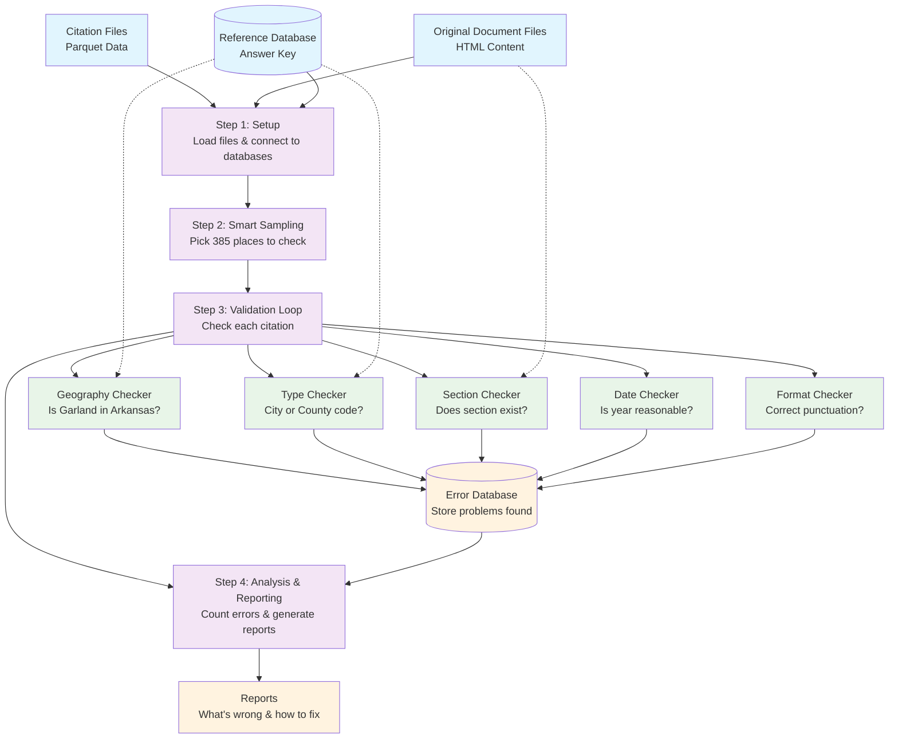

# Bluebook Citation Validator - Software Architecture Document (SAD)
## Explained Like You're a Smart Kid

> **⚠️ Legacy Location Notice**  
> The core Bluebook Citation Validator package has moved to:
> `ipfs_datasets_py/processors/legal_scrapers/bluebook_citation_validator/`  
> The MCP tool wrapper is at:
> `ipfs_datasets_py/mcp_server/tools/legal_dataset_tools/bluebook_citation_validator_tool.py`  
> This directory (`lizardperson_argparse_programs/`) contains the original argparse CLI program
> which is preserved for reference. New development should target the core package above.

## 1. What Are We Actually Building?

### The Simple Problem
Imagine you have a robot that reads legal documents and tries to write proper references (citations) to those documents. But sometimes the robot makes mistakes! We need to build a "citation checker" that can:

1. **Look at what the robot wrote** (the citation)
2. **Look at the original document** (the HTML)
3. **Check if the robot got it right** (validation)
4. **Tell us what's wrong** (error reporting)

### Real Example
- **Robot's citation**: "Garland, Ark., County Code, §14-75 (2007)"
- **Original document**: Contains a law about building definitions from Garland, Arkansas
- **Our checker asks**: 
  - Is Garland really in Arkansas? ✓
  - Is it really a county code (not a city code)? ✓
  - Is section 14-75 what the document actually talks about? ✓
  - Did this law really exist in 2007? ✓

## 2. Why Is This Hard?

### Scale Problem
- We have **1.5 million documents**
- Each document might have **2-3 citations**
- That's about **3-4 million citations to check**
- It's like having to grade 3 million homework assignments!

### Quality Problem
- Lawyers will use these citations in court
- If we say "This citation is correct" but it's wrong, someone could lose a case
- We need to be **99% accurate** (like getting 99 out of 100 test questions right)

### Variety Problem
- Different states write citations differently
- Some places are cities, some are counties
- Some documents are new, some are old
- It's like checking homework from 850 different schools with different rules

## 3. Our Solution Strategy

### Smart Sampling (Like Polling)
Instead of checking ALL 3 million citations (which would take forever), we'll check a smart sample:
- Pick 385 places across all states
- Check ALL citations from those places thoroughly
- Use statistics to predict how good the other citations probably are
- Like polling 1,000 people to predict how 300 million people will vote

### Break the Problem Into Pieces
Instead of one giant "citation checker," we'll build 5 smaller checkers:

1. **Geography Checker**: "Is Garland really in Arkansas?"
2. **Type Checker**: "Should this be 'County Code' or 'City Code'?"
3. **Section Checker**: "Does section 14-75 actually exist in this document?"
4. **Date Checker**: "Did this law really exist in 2007?"
5. **Format Checker**: "Is the punctuation and capitalization correct?"

## 4. How Each Piece Works

### Geography Checker - "Where Is This Place?"
```
1. Look at the citation: "Garland, Ark., County Code..."
2. Extract the place name: "Garland"
3. Extract the state: "Arkansas" (Ark.)
4. Look up "Garland" in our reference database
5. Check: Does our database say Garland is in Arkansas? ✓ or ✗
6. Record result: PASS or FAIL with explanation
```

### Type Checker - "City or County?"
```
1. Look up "Garland" in our database
2. Check its "class_code" (like a category label)
3. If class_code = H1 (county), expect "County Code"
4. If class_code = C1 (city), expect "Municipal Code"
5. Compare what we expect vs. what the citation says
6. Record result: PASS or FAIL with explanation
```

### Section Checker - "Does This Section Exist?"
```
1. Look at the original document's title: "Sec. 14-75. - Definitions"
2. Extract the section number: "14-75"
3. Look at the citation's section: "§14-75"
4. Check: Do they match? ✓ or ✗
5. Record result: PASS or FAIL with explanation
```

### Date Checker - "Is This Year Reasonable?"
```
1. Look at citation year: "(2007)"
2. Check: Is 2007 between 1776 and 2025? ✓
3. Check: Does the original document mention 2007? 
4. Record result: PASS or FAIL with explanation
```

### Format Checker - "Does This Look Right?"
```
1. Expected format: "GARLAND, ARK., COUNTY CODE §14-75 (2007)"
2. Actual citation: "Garland, Ark., County Code, §14-75 (2007)"
3. Check differences:
   - Missing capital letters ✗
   - Extra comma before section ✗
4. Record result: PASS or FAIL with explanation
```

## 5. How We Store and Report Problems

### Error Levels (Like Grades)
- **CRITICAL** (F): Wrong city or state - this could be legally dangerous
- **MAJOR** (D): Wrong type or section - confusing but not dangerous  
- **MINOR** (C): Wrong formatting - looks unprofessional
- **WARNING** (B): Might be wrong, need human to check

### Error Database (Like a Report Card System)
Instead of just printing errors to the screen, we save them in a database so we can:
- Count how many errors of each type we found
- Make charts showing which places have the most problems
- Generate reports for lawyers showing exactly what's wrong
- Track if we're getting better over time

## 6. The Whole Process Step-by-Step

### Step 1: Setup
1. Connect to our reference database (the "answer key")
2. Load the citation files we want to check
3. Load the original document files
4. Set up our error storage database

### Step 2: Smart Sampling
1. Count how many places we have in each state
2. Calculate how many to sample from each state
3. Randomly pick the exact places to check
4. Make a list: "Check these 385 places"

### Step 3: For Each Sampled Place
1. Load all citations from that place
2. Load all original documents from that place
3. Run all 5 checkers on every citation
4. Save any errors we find
5. Move to next place

### Step 4: Analysis and Reporting
1. Count up all the errors we found
2. Calculate: "X% of citations have problems"
3. Use statistics to estimate: "Probably Y% of ALL citations have problems"
4. Generate reports showing what kinds of errors are most common
5. Suggest fixes for the most common problems

## 7. Why This Design Works

### Modular = Fixable
Each checker is independent. If we discover the Date Checker has a bug, we can fix just that piece without breaking everything else.

### Statistical = Efficient  
By checking a smart sample instead of everything, we can finish in weeks instead of months, while still being confident about our results.

### Database-Driven = Reliable
By storing errors in a database instead of just printing them, we can analyze patterns, generate reports, and track progress over time.

### Priority-Focused = Practical
By focusing on factual errors first (geography, dates) and formatting last, we catch the problems that matter most to lawyers.

## 8. What Success Looks Like

### For the Sample (385 places):
- 99% of citations pass all checks (Sigma 2 quality)
- We can identify and explain every error we find
- We can suggest corrections for common problems
- Processing completes within reasonable time (days, not months)

### For the Full Dataset (850 places):
- Statistical confidence that 95%+ of all citations are correct
- Clear reports showing which types of errors are most common
- Actionable recommendations for improving the citation generation system
- Database of errors that can be analyzed and visualized

This design gives us a reliable, fast, and thorough way to check millions of legal citations without having to manually review each one!

## Simplified Design Diagram

