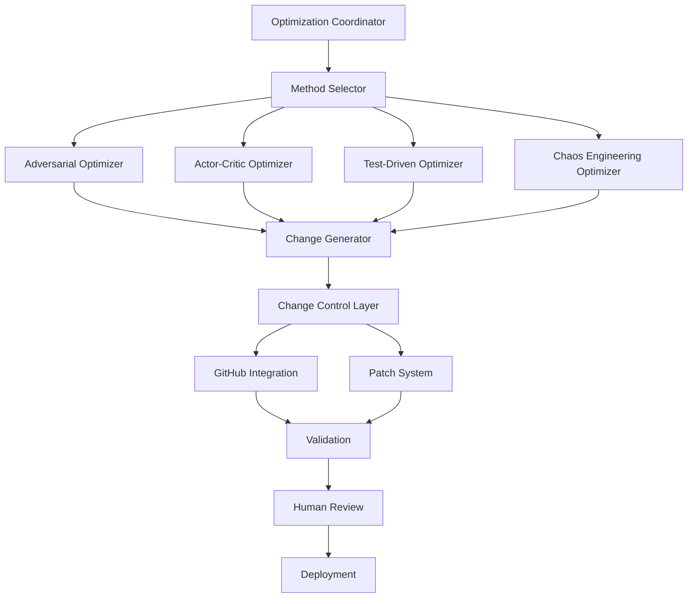

# Agentic Optimizer Architecture

## Overview

This document describes the architecture for an agentic system that enables Large Language Models (LLMs) to recursively self-improve the codebase through various optimization methodologies.

## Design Philosophy

### Core Principles
1. **Semi-Autonomous Operation**: Agents operate independently but require human approval for changes
2. **Multi-Method Optimization**: Support adversarial, actor-critic, test-driven, and chaos engineering approaches
3. **Robust Change Control**: Two-tier change management (GitHub-based + patch-based)
4. **Distributed Coordination**: Multiple agents working in parallel with conflict resolution
5. **Verifiable Improvements**: All changes must pass validation before acceptance

## Architecture Components

### 1. Core Agentic Framework



### 2. Optimization Methods

#### 2.1 Adversarial Optimization
- **Purpose**: Generates competing solutions and selects the best
- **Process**:
  1. Generate N alternative implementations
  2. Benchmark all alternatives
  3. Apply adversarial testing (edge cases, stress tests)
  4. Select winner based on multi-criteria scoring
  
#### 2.2 Actor-Critic Optimization
- **Purpose**: Learn optimal code patterns through reward-based learning
- **Process**:
  1. Actor proposes code changes
  2. Critic evaluates proposed changes (performance, correctness, style)
  3. Feedback loop improves future proposals
  4. Track policy evolution over time

#### 2.3 Test-Driven Optimization
- **Purpose**: Generate tests first, then optimize code to pass
- **Process**:
  1. Generate comprehensive test suites
  2. Identify failing or slow tests
  3. Generate optimized implementations
  4. Validate improvements with extended testing

#### 2.4 Chaos Engineering Optimization
- **Purpose**: Identify and fix resilience issues through controlled chaos
- **Process**:
  1. Inject faults (network failures, resource exhaustion, etc.)
  2. Monitor system behavior and failures
  3. Generate fixes for identified weaknesses
  4. Verify improved resilience

### 3. Change Control Systems

#### 3.1 Primary: GitHub Integration with API Caching

**Architecture**:
```python
class GitHubChangeControl:
    def __init__(self, cache_backend: CacheBackend):
        self.api_cache = GitHubAPICache(cache_backend)
        self.rate_limiter = AdaptiveRateLimiter()
        self.issue_manager = IssueManager(self.api_cache)
        self.pr_manager = DraftPRManager(self.api_cache)
```

**API Caching Strategy**:
- Cache GET requests for 5 minutes (configurable)
- Batch write operations to minimize API calls
- Use conditional requests (ETags) for cached data
- Track rate limit status in cache
- Fall back to patch system when limits approached

**Workflow**:
1. Agent generates optimization
2. System checks API rate limits
3. If available: Create GitHub issue with analysis
4. Create draft PR with changes
5. Request human review via GitHub notifications
6. Track approval status

#### 3.2 Backup: Patch-Based System with Worktrees and IPFS

**Architecture**:
```python
class PatchBasedChangeControl:
    def __init__(self, ipfs_client, llm_router):
        self.patch_manager = PatchManager()
        self.worktree_manager = WorktreeManager()
        self.ipfs_store = IPFSPatchStore(ipfs_client)
        self.llm_router = llm_router
```

**Patch Generation**:
- Generate unified diff patches
- Store patches in IPFS with CID
- Maintain patch metadata (author agent, timestamp, rationale)
- Create patch chains for related changes

**Worktree Strategy**:
- Each agent gets dedicated worktree: `worktrees/agent-{id}-{timestamp}`
- Base worktree on current main branch
- Apply patches incrementally
- Test in isolated worktree before promotion

**IPFS Integration**:
- Store patches as IPFS objects: `ipfs add patch.diff`
- Create IPLD links between related patches
- Replicate CIDs across agent worktrees
- Enable distributed patch sharing

**Workflow**:
1. Agent generates optimization in dedicated worktree
2. Create patch: `git diff > patch.diff`
3. Store in IPFS: `cid = ipfs.add(patch.diff)`
4. Broadcast CID to other agents via llm_router
5. Other agents can fetch and evaluate: `ipfs cat {cid}`
6. Apply approved patches to main worktree
7. Run validation tests
8. Merge to main if tests pass

### 4. Multi-Agent Coordination

**Coordination Protocol**:
```python
class AgentCoordinator:
    """Coordinates multiple optimization agents working in parallel."""
    
    def __init__(self):
        self.active_agents: Dict[str, AgentState] = {}
        self.conflict_resolver = ConflictResolver()
        self.ipfs_broadcast = IPFSBroadcast()
        
    def assign_work(self, agent_id: str, task: OptimizationTask) -> str:
        """Assign optimization task to agent with worktree."""
        worktree_path = self.worktree_manager.create(agent_id)
        self.active_agents[agent_id] = AgentState(
            worktree=worktree_path,
            task=task,
            status="working"
        )
        return worktree_path
        
    def submit_patch(self, agent_id: str, patch: Patch) -> str:
        """Submit patch for review and coordination."""
        # Store in IPFS
        cid = self.ipfs_broadcast.store_patch(patch)
        
        # Check for conflicts with other agents
        conflicts = self.conflict_resolver.check(patch, self.active_agents)
        
        if conflicts:
            # Negotiate conflict resolution
            resolved = self.conflict_resolver.resolve(patch, conflicts)
            cid = self.ipfs_broadcast.store_patch(resolved)
            
        # Broadcast to other agents
        self.ipfs_broadcast.notify_agents(cid, exclude=[agent_id])
        
        return cid
```

**Conflict Resolution**:
- Detect overlapping changes across agents
- Use three-way merge when possible
- Escalate complex conflicts to human review
- Maintain conflict history for learning

### 5. LLM Router Integration

**Purpose**: Route optimization requests to appropriate LLM providers

**Integration Points**:
```python
class OptimizerLLMRouter:
    """Routes optimization tasks to appropriate LLM providers."""
    
    def __init__(self, llm_router):
        self.router = llm_router
        self.provider_capabilities = {
            'adversarial': ['gpt-4', 'claude-3-opus'],
            'actor-critic': ['gpt-4', 'claude-3-sonnet'],
            'test-driven': ['gpt-4', 'codex'],
            'chaos': ['gpt-4', 'claude-3-opus']
        }
        
    def route_optimization(
        self, 
        method: str, 
        task: OptimizationTask
    ) -> OptimizationResult:
        """Route optimization task to appropriate provider."""
        providers = self.provider_capabilities.get(method, ['gpt-4'])
        
        # Try primary provider
        result = self.router.generate(
            prompt=self._build_prompt(method, task),
            provider=providers[0],
            fallback_providers=providers[1:]
        )
        
        return self._parse_result(result, method)
```

### 6. Validation and Testing

**Multi-Level Validation**:
1. **Syntax Validation**: Ensure code parses correctly
2. **Type Checking**: Run mypy on changed files
3. **Unit Tests**: Run affected unit tests
4. **Integration Tests**: Run integration test suite
5. **Performance Tests**: Benchmark critical paths
6. **Security Scanning**: Run codeql on changes
7. **Style Checking**: Verify code style compliance

**Test Infrastructure**:
```python
class OptimizationValidator:
    """Validates optimizations before acceptance."""
    
    async def validate(self, patch: Patch) -> ValidationResult:
        """Run comprehensive validation on patch."""
        results = await asyncio.gather(
            self._validate_syntax(patch),
            self._validate_types(patch),
            self._run_unit_tests(patch),
            self._run_integration_tests(patch),
            self._check_performance(patch),
            self._scan_security(patch),
            self._check_style(patch)
        )
        
        return ValidationResult(
            passed=all(r.passed for r in results),
            details=results
        )
```

### 7. Rollback Mechanism

**Patch History**:
- All patches stored with IPFS CIDs (content-addressed, immutable)
- Maintain ordered chain of applied patches
- Store reversal patches for quick rollback

**Rollback Process**:
```python
class PatchRollback:
    """Handles rollback of applied patches."""
    
    def rollback(self, patch_cid: str) -> bool:
        """Rollback specific patch and dependent patches."""
        # Find patch in history
        patch = self.ipfs_store.get_patch(patch_cid)
        
        # Find dependent patches
        dependents = self.find_dependents(patch_cid)
        
        # Generate rollback plan
        rollback_plan = self.generate_rollback_plan(patch, dependents)
        
        # Execute rollback
        for p in reversed(rollback_plan):
            reversal = self.ipfs_store.get_reversal(p.cid)
            self.apply_patch(reversal)
            
        return True
```

## Implementation Roadmap

### Phase 1: Core Infrastructure (Week 1-2)
- [ ] Base optimizer classes and interfaces
- [ ] Change control base implementations
- [ ] Git worktree manager
- [ ] IPFS patch storage
- [ ] Basic validation framework

### Phase 2: GitHub Integration (Week 2-3)
- [ ] GitHub API caching layer
- [ ] Rate limiting and fallback
- [ ] Issue auto-creation
- [ ] Draft PR management
- [ ] Webhook handlers

### Phase 3: Optimization Methods (Week 3-5)
- [ ] Adversarial optimizer
- [ ] Actor-critic optimizer
- [ ] Test-driven optimizer
- [ ] Chaos engineering optimizer

### Phase 4: Multi-Agent Coordination (Week 5-6)
- [ ] Agent coordinator
- [ ] Conflict resolution
- [ ] IPFS broadcast system
- [ ] LLM router integration

### Phase 5: Testing and Refinement (Week 6-8)
- [ ] Comprehensive test suite
- [ ] Performance optimization
- [ ] Documentation
- [ ] Deployment automation

## Configuration

### Environment Variables

```bash
# GitHub Integration
OPTIMIZER_GITHUB_TOKEN=ghp_xxx
OPTIMIZER_GITHUB_REPO=owner/repo
OPTIMIZER_GITHUB_CACHE_TTL=300  # 5 minutes
OPTIMIZER_GITHUB_RATE_LIMIT_THRESHOLD=100  # Switch to patch mode

# IPFS Configuration
OPTIMIZER_IPFS_API=/ip4/127.0.0.1/tcp/5001
OPTIMIZER_IPFS_GATEWAY=http://localhost:8080

# LLM Router
OPTIMIZER_LLM_PROVIDER=gpt-4
OPTIMIZER_LLM_FALLBACK=claude-3-opus

# Agent Configuration
OPTIMIZER_MAX_AGENTS=5
OPTIMIZER_WORKTREE_BASE=/tmp/optimizer-worktrees
OPTIMIZER_PATCH_HISTORY_LIMIT=1000

# Validation
OPTIMIZER_RUN_INTEGRATION_TESTS=true
OPTIMIZER_RUN_PERFORMANCE_TESTS=true
OPTIMIZER_MIN_TEST_COVERAGE=80
```

## Security Considerations

1. **Code Review Required**: All changes require human approval
2. **Sandboxed Execution**: Test in isolated environments
3. **Rollback Capability**: Quick rollback for problematic changes
4. **Audit Trail**: Complete history of all changes and decisions
5. **Access Control**: Limit agent capabilities via configuration

## Monitoring and Metrics

### Key Metrics
- Optimization success rate
- Time to approval
- Rollback frequency
- API calls consumed
- Test coverage changes
- Performance improvements
- Security issues found/fixed

### Dashboards
- Real-time agent activity
- Patch pipeline status
- GitHub API usage
- Validation results
- Performance trends

## Future Enhancements

1. **Reinforcement Learning**: Train agents on historical success/failure
2. **Ensemble Methods**: Combine multiple optimization strategies
3. **Automated A/B Testing**: Deploy competing optimizations simultaneously
4. **Cross-Repository Learning**: Share optimization patterns across projects
5. **Human Feedback Integration**: Learn from review comments and rejections
