# GraphRAG Optimizer Architecture

## Core Pipeline: Generate → Critique → Optimize → Validate

The GraphRAG optimizer implements a feedback-driven refinement loop that continuously improves knowledge graph ontologies.

```mermaid
graph TD
    Input["📄 Input Data<br/>(text, PDF, JSON, CSV)"] -->|extract| Generate["🏗️ Generate<br/>(OntologyGenerator)"]
    
    Generate -->|entities & relationships| Entities["📊 Entity Extraction<br/>- Rule-based extraction<br/>- Domain-specific patterns<br/>- Relationship inference"]
    
    Entities -->|ontology dict| Critique["🔍 Critique<br/>(OntologyCritic)"]
    
    Critique -->|evaluate dimensions| Evaluate["📈 Dimension Evaluation<br/>- Completeness (30%)<br/>- Connectivity (40%)<br/>- Consistency (30%)"]
    
    Evaluate -->|CriticScore| OptOrVal{Decision}
    
    OptOrVal -->|quality < threshold| Optimize["⚙️ Optimize<br/>(OntologyMediator)"]
    OptOrVal -->|quality >= threshold| Validate["✅ Validate<br/>(LogicValidator)"]
    
    Optimize -->|refinement actions| Refine["🔧 Refinement Actions<br/>- add_missing_relationships<br/>- split_entity<br/>- remove_orphaned_entities<br/>- merge_redundant_entities<br/>- update_properties"]
    
    Refine -->|improved ontology| Critique
    
    Validate -->|check logic| Logic["⚖️ Logic Validation<br/>- TDFOL conversion<br/>- Consistency checking<br/>- Contradiction detection<br/>- Fix suggestions"]
    
    Logic -->|valid| Output["🎯 Final Ontology"]
    Logic -->|invalid| Optimize
    
    style Input fill:#e1f5ff
    style Generate fill:#fff3e0
    style Critique fill:#f3e5f5
    style Optimize fill:#ffe0b2
    style Validate fill:#c8e6c9
    style Output fill:#a5d6a7
```



## Component Details

### 1. **Generation Phase** (OntologyGenerator)

Extracts entities and infers relationships from input data.

**Key Classes:**
- `OntologyGenerator`: Main orchestrator for entity extraction and ontology generation
- `EntityExtractionResult`: Structured result with entities, relationships, confidence scores
- `ExtractionConfig`: Configuration for extraction strategies and domain-specific rules

**Extraction Strategies:**
- **Rule-based**: Pattern matching for known entity types (Person, Organization, Date, Location)
- **Domain-specific**: Custom rules for legal, medical, financial, technical domains
- **Hybrid**: Combines rule-based with neural fallback (when available)

**Key Methods:**
- `extract_entities()`: Main extraction entry point
- `infer_relationships()`: Co-occurrence and verb-proximity based relationship inference
- `deduplicate_entities()`: Removes duplicate entities, preserves relationships
- `generate_synthetic_ontology()`: Creates sample ontologies for testing

**Output:**
```python
{
    "entities": [
        {"id": "e1", "type": "Person", "text": "Alice", 
         "properties": {...}, "confidence": 0.95, ...},
        ...
    ],
    "relationships": [
        {"id": "r1", "source_id": "e1", "target_id": "org1",
         "type": "works_at", "confidence": 0.88, ...},
        ...
    ]
}
```

### 2. **Critique Phase** (OntologyCritic)

Evaluates ontology quality across five dimensions.

**Key Classes:**
- `OntologyCritic`: Multi-dimensional quality evaluator
- `CriticScore`: Structured evaluation result with per-dimension scores
- `CriticResult`: Full critique with recommendations

**Five Evaluation Dimensions:**

| Dimension | Weight | Measures |
|-----------|--------|----------|
| **Completeness** | 30% | Entity diversity, property coverage, data saturation |
| **Connectivity** | 40% | Relationship density, component structure, graph cohesion |
| **Consistency** | 30% | Dangling reference detection, circular dependency detection |
| **Clarity** | - | Naming conventions, property completeness |
| **Granularity** | - | Average properties per entity, relationship specificity |

**Key Methods:**
- `evaluate_ontology()`: Full evaluation across all dimensions
- `evaluate_batch()`: Score multiple ontologies in parallel
- `compare_with_baseline()`: Delta scoring against reference ontology
- `calibrate_thresholds()`: Auto-adjust scoring thresholds from history

**Output:**
```python
CriticScore(
    completeness_score=0.75,   # 0.0-1.0
    connectivity_score=0.82,
    consistency_score=0.90,
    overall_quality=0.82,
    dimension_details={...},
    recommendations=[...],
    confidence=0.85
)
```

### 3. **Optimization Phase** (OntologyMediator)

Refines low-quality ontologies through iterative actions.

**Key Classes:**
- `OntologyMediator`: Manages refinement cycle orchestration
- `RefinementAction`: Atomic modification operation
- `OntologySession`: Tracks refinement history and convergence

**Refinement Actions:**

| Action | Purpose |
|--------|---------|
| `add_missing_relationships` | Link orphaned entities via co-occurrence |
| `split_entity` | Break overloaded entities into specialized types |
| `remove_orphaned_entities` | Eliminate isolated, low-confidence entities |
| `merge_redundant_entities` | Consolidate duplicate entities |
| `update_properties` | Enrich entity properties from relationships |
| `rename_entity` | Fix casing and standardize terminology |

**Key Methods:**
- `refine_ontology()`: Applies sequence of refinement actions
- `get_action_summary()`: Statistics on applied actions
- `get_recommendation_stats()`: Tracks recommendation effectiveness
- `preview_recommendations()`: Non-destructive evaluation of potential changes

**Refinement Loop:**
1. Generate refinement recommendations based on critic feedback
2. Apply highest-confidence actions
3. Re-critique the modified ontology
4. Iterate until convergence or max rounds reached

### 4. **Validation Phase** (LogicValidator)

Ensures logical consistency and suggests fixes for contradictions.

**Key Classes:**
- `LogicValidator`: Formal logic consistency checker
- `ValidationResult`: Structured validation outcome
- `ProverConfig`: Configuration for theorem provers (Z3, CVC5, etc.)

**Validation Process:**

1. **TDFOL Conversion**: Transform ontology to Typed First-Order Logic formulas
   ```
   entity("e1").
   type("e1", "Person").
   text("e1", "Alice").
   rel("works_at", "e1", "org1").
   ```

2. **Consistency Checking**:
   - Dangling reference detection (relationship targets non-existent entities)
   - Circular dependency detection (is_a or part_of cycles)
   - Type conflict resolution (entity has conflicting types)

3. **Contradiction Detection** (if TDFOL prover available)
   - Structural contradictions (impossible relationships)
   - Logical contradictions (rule violations)

4. **Fix Suggestions**: Automatic recommendations for each contradiction
   ```
   {
       "description": "Add missing entity or remove dangling reference",
       "type": "add_entity_or_remove_relationship",
       "target": "entity_id",
       "confidence": 0.75
   }
   ```

**Key Methods:**
- `check_consistency()`: Full validation with caching
- `find_contradictions()`: Identify logical issues
- `suggest_fixes()`: Generate fix recommendations
- `explain_entity()`: Detailed analysis of entity's validity

### 5. **Pipeline Integration** (OntologyPipeline)

Orchestrates the full generate → critique → optimize → validate cycle.

**Key Classes:**
- `OntologyPipeline`: High-level orchestration facade
- `OntologyHarness`: Batch processing and parallel execution

**Pipeline Methods:**
- `run()`: Synchronous single-ontology refinement
- `run_async()`: Asynchronous execution
- `run_with_metrics()`: Execution with performance tracking
- `run_concurrent()`: Parallel processing of multiple ontologies

**Pipeline Configuration:**
```python
pipeline = OntologyPipeline(
    domain="legal",
    max_rounds=10,
    quality_threshold=0.80,
    # ... other settings
)
ontology = pipeline.run(data)
```

## Data Flow

```
Input Data
    ↓
OntologyGenerator.extract_entities()
    ↓
EntityExtractionResult {entities, relationships, metadata}
    ↓
OntologyCritic.evaluate_ontology()
    ↓
CriticScore {overall_quality, recommendations}
    ↓
Quality >= Threshold?
    ├─ YES → LogicValidator.check_consistency()
    │           ↓
    │       Valid?
    │           ├─ YES → Final Ontology ✓
    │           └─ NO → OntologyMediator.refine_ontology()
    │
    └─ NO → OntologyMediator.refine_ontology()
                ↓
            Apply Refinement Actions
                ↓
            Return to Critic (next iteration)
```

## Quality Metrics & Analysis

### Statistics Module (ontology_stats.py)

Comprehensive analysis of ontology structure:

- **Entity Statistics**: Type distribution, property coverage, orphan detection
- **Relationship Statistics**: Density, type distribution, degree analysis
- **Quality Metrics**: Weighted completeness, connectivity, consistency scores
- **Bottleneck Analysis**: High-degree hubs, concentrated relationship types

**Key Methods:**
- `compute_entity_stats()`: Entity-level analytics
- `compute_quality_metrics()`: Dimension-based quality scoring
- `identify_bottlenecks()`: Performance hotspot detection
- `generate_stats_report()`: Human-readable analysis

### Provenance Tracking

The merge process tracks which entities/relationships came from which sources:

```python
# After merging ontologies from doc1 and doc2
report = generator.generate_merge_provenance_report(merged_ontology)
# Returns:
{
    "entity_counts_by_source": {"doc1": 15, "doc2": 12},
    "entities_by_source": {"doc1": ["e1", "e3", ...], ...},
    "integration_stats": {
        "merged_entities": 3,      # Appeared in multiple sources
        "new_entities": 24         # Only in one source
    }
}
```

## Performance Considerations

### Caching Strategy

- **TDFOL Formula Cache**: Ontology hash-keyed to avoid re-conversion
- **Validation Cache**: Split caches for TDFOL conversion and consistency checks
- **Critic Evaluation Cache**: Optional shared cache across evaluator instances

### Scalability

- **Entity Extraction**: O(n) where n = input text length
- **Relationship Inference**: O(n²) for co-occurrence window, O(m) for relationship resolution
- **Critic Evaluation**: O(m) where m = number of entities + relationships
- **Media Optimization**: Iterative improvement, bounded by max_rounds

### Parallelization

- `OntologyHarness.run_concurrent()`: Process multiple ontologies in parallel
- `OntologyCritic.evaluate_batch()`: Parallel scoring with  ThreadPoolExecutor
- `OntologyGenerator.batch_extract_with_spans()`: Parallel entity extraction from documents

## Error Handling & Recovery

The pipeline includes three layers of error handling:

1. **Structural Validation**: Check ontology dict format before processing
2. **Logical Validation**: Detect contradictions and suggest fixes
3. **Graceful Degradation**: Fallback from full TDFOL to string-based facts if TDFOL unavailable

Failures in any phase either:
- Suggest repairs (via `suggest_fixes()`) or
- Return partially valid results (with quality metrics) for manual review

## Testing & Quality Assurance

The module includes:
- **2742+ Integration & Unit Tests** (99.5% pass rate)
- **Golden Schema Tests**: Invariant validation (entities/relationships structure)
- **Property-Based Tests**: Random ontology generation with Hypothesis
- **Performance Tests**: Benchmarks for large ontologies (100k+ entities)
- **End-to-End Tests**: Full pipeline execution on real data

## Extension Points

The architecture supports custom extensions:

- **Custom Extraction Rules**: `ExtractionConfig.custom_rules`
- **Domain-Specific Vocabularies**: `CriticScore.domain_keywords`
- **Custom Refinement Actions**: Implement `RefinementAction` interface
- **Pluggable Provers**: `ProverConfig.provers` list
- **Logger Integration**: Optional logger parameter in all major classes

## Related Modules

- **ontology_diff.py**: Structural diff of two ontologies
- **ontology_comparison.py**: Similarity scoring and distribution analysis
- **ontology_search.py**: Entity/relationship query interface (BFS, regex, properties)
- **ontology_validation.py**: Structural validation and orphan detection
- **logic_validator.py**: TDFOL conversion and formal logic validation
- **ontology_learning_adapter.py**: Learning feedback from refinement history
- **query_optimizer.py**: Query optimization on valid ontologies
