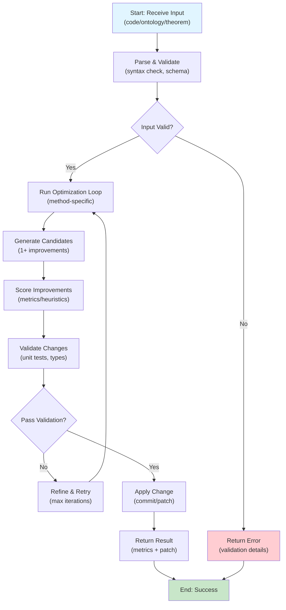
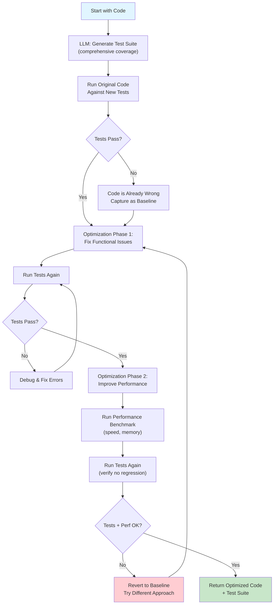
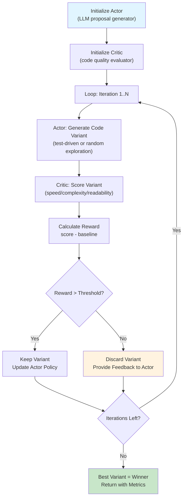
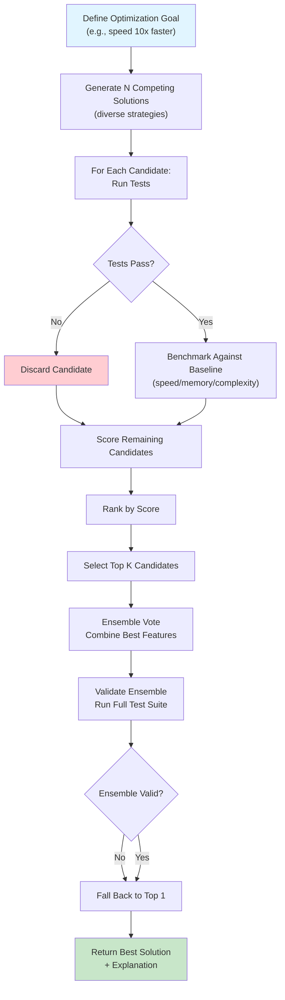
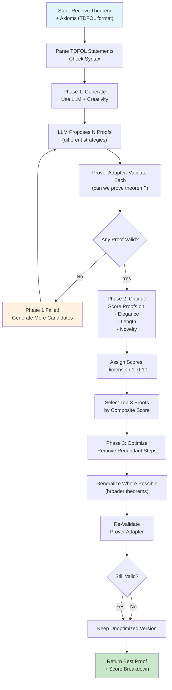
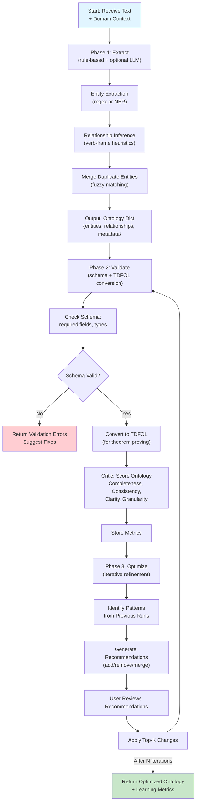
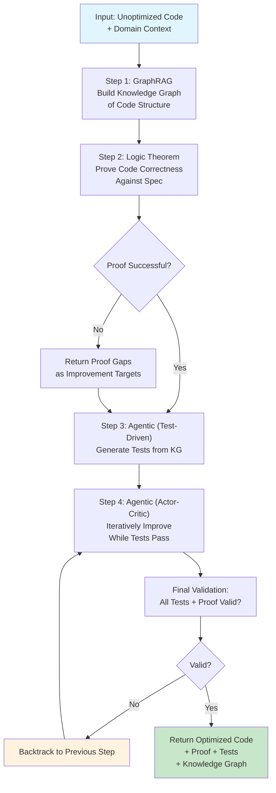
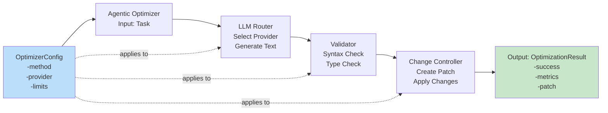
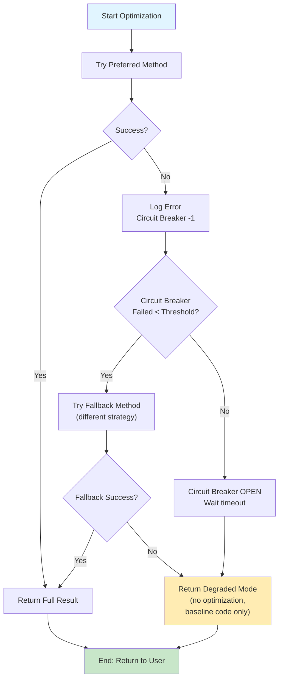
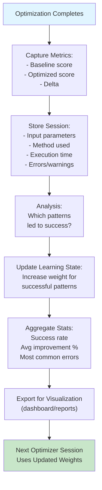

# Optimizer Architecture Diagrams

Visual lifecycle flows for each optimizer type in the `ipfs_datasets_py` optimizers module.

**Purpose**: Quick reference for understanding how each optimizer processes input, generates improvements, and validates results.

---

## 1. Universal Optimizer Lifecycle (All Types)

Every optimizer follows this high-level OODA loop (Observe → Orient → Decide → Act):

---

## 2. Agentic Optimizer: Test-Driven Method

Generate code improvements by writing tests first, then optimizing to pass tests:

---

## 3. Agentic Optimizer: Actor-Critic Method

Learn optimal improvements through reward-based feedback:

---

## 4. Agentic Optimizer: Adversarial Method

Generate competing solutions and select the best:

---

## 5. Logic Theorem Optimizer

Prove & improve mathematical theorems using formal logic:

---

## 6. GraphRAG Optimizer

Generate & improve knowledge graphs from unstructured text:

---

## 7. Integration: Multi-Optimizer Pipeline

How optimizers can be chained for compound improvements:

---

## 8. Configuration & Context Flow

How context objects flow through optimizer layers:

---

## 9. Error Handling & Fallback Flow

How optimizers gracefully degrade:

---

## 10. Learning & Metrics Collection

How optimizers capture improvement metrics:

---

## Key Takeaways

| Aspect | Details |
|--------|---------|
| **Input** | Code / Ontology / Theorem (TDFOL) |
| **Validation** | Syntax check + schema validation + type hints |
| **Methods** | Test-Driven, Actor-Critic, Adversarial, Chaos (agentic); Generate-Critique-Optimize (logic/graphrag) |
| **Output** | Optimized code/ontology/proof + metrics + patch |
| **Resilience** | Circuit breaker pattern + retry with exponential backoff |
| **Learning** | Track success patterns; adjust weights for future runs |
| **Integration** | Optimizers can be chained in pipelines |

---

## How to Use These Diagrams

- **For Users**: Start with diagrams 1 + 2/5/6 (depending on your optimizer type)
- **For Contributors**: Use diagrams 3-10 for understanding internal flow
- **For Integration**: See diagram 7 for multi-optimizer composition
- **For Debugging**: See diagrams 9-10 for error handling and observability

See [QUICK_START.md](./agentic/QUICK_START.md) / [QUICK_START.md](./logic_theorem_optimizer/QUICK_START.md) / [QUICK_START.md](./graphrag/QUICK_START.md) for detailed examples.
