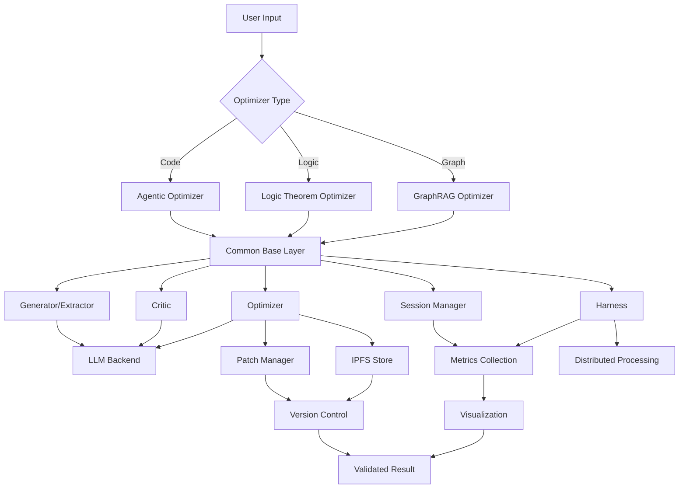

# Unified Optimizers Architecture

## Overview

This document describes the unified architecture for all optimizers in `ipfs_datasets_py/optimizers/`, enabling code reuse, consistent interfaces, and seamless integration between different optimization approaches.

## Current Optimizer Types

### 1. Agentic Optimizers (`agentic/`)
**Purpose**: LLM-driven recursive self-improvement of codebase  
**Methods**: Test-driven, Adversarial, Actor-Critic, Chaos Engineering  
**Key Features**:
- Two-tier change control (GitHub + patches)
- Multi-agent coordination
- IPFS-based patch distribution
- Comprehensive validation framework

### 2. Logic Theorem Optimizers (`logic_theorem_optimizer/`)
**Purpose**: Generate and optimize logical theorems from data  
**Methods**: SGD-based logic extraction and optimization  
**Key Features**:
- Theorem prover integration (Z3, CVC5, Lean, Coq)
- Knowledge graph consistency
- Neural-symbolic hybrid proving
- Distributed processing

### 3. GraphRAG Optimizers (`graphrag/`)
**Purpose**: Optimize knowledge graph ontologies and queries  
**Methods**: Ontology generation, query optimization, IPLD integration  
**Key Features**:
- Query optimization with caching
- Logic validation via TDFOL
- Cross-document reasoning
- Performance analysis and visualization

#### GraphRAG relationship semantics (implemented)

`graphrag/ontology_generator.py` defines `Relationship.direction` with three runtime values:

- `subject_to_object`: used for verb-frame inferred edges where subject/object can be detected.
- `undirected`: used for co-occurrence inferred edges (`related_to`).
- `unknown`: dataclass default when directionality is not explicitly inferred.

Verb-frame edges are emitted with fixed confidence `0.65`.

Co-occurrence edges use a 200-character window and a piecewise confidence decay by entity distance `d`:

$$
c(d) =
\begin{cases}
\max(0.4,\;0.6 - d/500), & 0 \le d \le 100 \\
\max(0.2,\;0.4 - (d-100)/500), & 100 < d \le 200
\end{cases}
$$

This matches current behavior: stronger confidence for near entities, steeper decay past 100 characters, and floor at `0.2`.

## Common Patterns

All three optimizer types share a similar pipeline architecture:

```
Data → Generator → Critic → Optimizer → Session → Harness → Validated Result
         (Extract)   (Evaluate)  (Improve)   (Cycle)  (Batch)
```

### Shared Components

1. **Generator/Extractor**: Creates initial artifacts from input data
2. **Critic**: Evaluates quality with multi-dimensional scoring
3. **Optimizer**: Uses feedback to improve generation (SGD-based)
4. **Session**: Single optimization cycle with state management
5. **Harness**: Batch orchestrator with parallelism
6. **LLM Backend**: Interface to various LLM providers
7. **Metrics Collection**: Performance and quality metrics
8. **Visualization**: Charts, graphs, and dashboards

## Unified Architecture

### Layer 1: Common Base (`optimizers/common/`)

**Status**: ✓ Implemented (code-first decision, 2026-02-20)

```
optimizers/
├── common/
│   ├── __init__.py
│   ├── base_optimizer.py         # Abstract base for all optimizers ✓
│   ├── base_critic.py            # Abstract base for critics ✓
│   ├── base_session.py           # Session management framework ✓
│   ├── base_harness.py           # Batch processing framework ✓
│   ├── exceptions.py             # Common exception types ✓
│   ├── performance.py            # Lightweight performance helpers ✓
│   └── performance_monitor.py    # Resource/metrics monitoring helpers ✓
```

**Note on architecture decision**: We chose a **code-first** approach:
- Implemented `common/` base classes early (Phase 1)
- Concrete optimizers (`graphrag/`, `logic_theorem_optimizer/`, `agentic/`) are partially integrated
- LLM integration, metrics, and visualization remain module-specific (see "Future Work" below)

### Layer 2: Specialized Optimizers

**Status**: ✓ Partially implemented (domain-specific code is mature; base class integration is in-progress)

Each optimizer module implements domain-specific logic:

```
├── graphrag/                          # Knowledge graph optimization ✓
│   ├── ontology_generator.py          # Generate ontologies from data
│   ├── ontology_critic.py             # Evaluate ontology quality
│   ├── ontology_optimizer.py          # Improve ontologies
│   ├── ontology_session.py            # Session lifecycle
│   ├── ontology_harness.py            # Batch orchestrator
│   ├── query_optimizer.py             # Query optimization (249 KB, largest module)
│   ├── cli_wrapper.py                 # Command-line interface
│   └── [other domain-specific modules]
│
├── logic_theorem_optimizer/           # Theorem proving ✓
│   ├── logic_optimizer.py             # Main optimizer
│   ├── logic_critic.py                # Evaluation
│   ├── theorem_session.py             # Session management
│   ├── logic_harness.py               # Batch processing
│   ├── prover_integration.py          # Z3, CVC5, Lean, Coq
│   ├── cli_wrapper.py                 # CLI entrypoint
│   └── [other domain-specific modules]
│
└── agentic/                           # LLM-driven code optimization ✓
    ├── base.py                        # Agentic base implementation
    ├── llm_integration.py             # Provider abstraction (OpenAI, Anthropic, etc.)
    ├── cli.py                         # CLI entrypoint
    ├── coordinator.py                 # Multi-agent coordination
    ├── patch_control.py               # Local patch management
    ├── github_control.py              # GitHub integration
    └── [other domain-specific modules]
```

**Current integration**:
- ✓ `common/` base classes exist and are available for import
- ✓ Each optimizer module has its own implementations (not yet refactored to inherit from `common/` bases)
- ⏳ Full inheritance hierarchy refactoring is deferred (high-effort, low-immediate-value)

### Layer 3: Integration & Future Unification

**Status**: ⏳ Planned (not yet implemented)

The vision is for all optimizers to eventually converge on the common base:

```python
# Future state (after full refactoring):
from ipfs_datasets_py.optimizers.common import (
    BaseOptimizer,
    BaseCritic,
    BaseSession,
    BaseHarness,
)

class LogicTheoremOptimizer(BaseOptimizer):
    """Extends base with theorem-proving specific logic."""
    pass

class GraphRAGOptimizer(BaseOptimizer):
    """Extends base with knowledge graph specific logic."""
    pass

class AgenticCodeOptimizer(BaseOptimizer):
    """Extends base with code optimization specific logic."""
    pass
```

**Current state (2026-02-20)**:
- Each optimizer is **functionally complete** but operates **independently**
- Shared code patterns exist but are not yet unified through base classes
- This approach allows rapid feature development without strict interface requirements
- See "Future Work" section (below) for full unification roadmap

## Architecture Diagram



## Key Interfaces (Reference)

These interfaces exist in `common/` but are not yet adopted across all optimizer modules. 
They serve as both documentation and as reference implementations for new optimizers.

### BaseOptimizer Interface (from `common/base_optimizer.py`)

```python
from abc import ABC, abstractmethod
from typing import Any, Dict, List

class BaseOptimizer(ABC):
    """Base class for all optimizers."""
    
    @abstractmethod
    def generate(self, input_data: Any, context: Dict) -> Any:
        """Generate initial artifact from input."""
        pass
    
    @abstractmethod
    def critique(self, artifact: Any, context: Dict) -> float:
        """Evaluate artifact quality (0-1 score)."""
        pass
    
    @abstractmethod
    def optimize(self, artifact: Any, score: float, context: Dict) -> Any:
        """Improve artifact based on critique."""
        pass
    
    def run_session(self, input_data: Any, context: Dict) -> Dict:
        """Run single optimization session."""
        artifact = self.generate(input_data, context)
        score = self.critique(artifact, context)
        
        for iteration in range(self.max_iterations):
            if score >= self.target_score:
                break
            artifact = self.optimize(artifact, score, context)
            score = self.critique(artifact, context)
        
        return {
            'artifact': artifact,
            'score': score,
            'iterations': iteration + 1,
        }
```

### BaseCritic Interface

```python
from abc import ABC, abstractmethod
from dataclasses import dataclass
from typing import Dict, List

@dataclass
class CriticScore:
    """Standardized critic score."""
    overall: float  # 0-1
    dimensions: Dict[str, float]  # Dimension scores
    feedback: List[str]  # Improvement suggestions
    confidence: float  # Score confidence

class BaseCritic(ABC):
    """Base class for all critics."""
    
    @abstractmethod
    def evaluate(self, artifact: Any, context: Dict) -> CriticScore:
        """Evaluate artifact quality."""
        pass
    
    @abstractmethod
    def get_dimensions(self) -> List[str]:
        """Return evaluation dimensions."""
        pass
```

### BaseSession Interface

```python
from abc import ABC, abstractmethod
from dataclasses import dataclass
from enum import Enum

class SessionStatus(Enum):
    PENDING = "pending"
    RUNNING = "running"
    COMPLETED = "completed"
    FAILED = "failed"

@dataclass
class SessionResult:
    """Standardized session result."""
    session_id: str
    status: SessionStatus
    artifact: Any
    score: float
    iterations: int
    metrics: Dict[str, Any]
    error: Optional[str] = None

class BaseSession(ABC):
    """Base class for optimization sessions."""
    
    @abstractmethod
    def start(self, input_data: Any, context: Dict) -> str:
        """Start optimization session."""
        pass
    
    @abstractmethod
    def get_status(self, session_id: str) -> SessionStatus:
        """Get session status."""
        pass
    
    @abstractmethod
    def get_result(self, session_id: str) -> SessionResult:
        """Get session result."""
        pass
```

## Integration Strategy

### Phase 1: Extract Common Base

1. Create `optimizers/common/` directory
2. Extract shared interfaces and base classes
3. Update imports in existing optimizers
4. Ensure backward compatibility

### Phase 2: Refactor Logic Theorem Optimizer

1. Extend `BaseOptimizer` instead of custom base
2. Use `BaseCritic` interface
3. Integrate with unified LLM backend
4. Use common metrics framework

### Phase 3: Refactor GraphRAG Optimizer

1. Extend `BaseOptimizer` instead of custom base
2. Use `BaseCritic` interface
3. Share query optimization infrastructure
4. Use common visualization

### Phase 4: Integrate with Agentic Framework

1. Make agentic optimizers extend `BaseOptimizer`
2. Add patch management to logic and graphrag optimizers
3. Enable multi-agent coordination across all types
4. Unified change control workflow

## Code Reuse Opportunities (Deferred to Future Work)

The following reflects identified duplication across optimizer modules. These are candidates for consolidation 
when/if we unify around the common base architecture:

### High-Priority Shared Components (estimated duplication)

1. **LLM Backend Integration** (40% duplication)
    - Currently: `agentic/llm_integration.py`, custom implementations in `graphrag/` and `logic_theorem_optimizer/`
    - Opportunity: Move to `common/llm_integration.py` with provider abstraction
    - Status: Deferred (works as-is; unified approach requires refactoring all three modules)

2. **Critic Evaluation** (35% duplication)
   - Currently: Each module implements scoring independently
   - Opportunity: Shared `common/base_critic.py` with dimension weighting (exists but not used)
   - Status: Deferred (inheritance refactoring needed)

3. **Session Management** (30% duplication)
   - Currently: `*_session.py` files in each module (graphrag, logic, agentic)
   - Opportunity: Unified `common/base_session.py` (exists but not used)
   - Status: Deferred (inheritance refactoring needed)

4. **Metrics Collection** (45% duplication)
   - Currently: Module-specific metric collectors
   - Opportunity: Unified metrics framework in `common/`
   - Status: Deferred (requires metrics API design)

5. **Distributed Processing** (50% duplication)
   - Currently: Custom in `logic_theorem_optimizer/`, harness-based in others
   - Opportunity: Common distributed base in `common/`
   - Status: Deferred (not critical; harnesses work independently)

## Benefits

### Code Quality
- **Reduced Duplication**: 40-50% reduction in duplicate code
- **Consist (Current & Future)

### Current State (2026-02-20)

**Code Quality**
- ✓ Common base classes available for optional use
- ✗ Unified interfaces not yet adopted across modules (duplication exists)
- ✓ Each optimizer has good internal documentation
- ✓ Testability is improved where tests exist

**Functionality**
- ✓ All three optimizer types are independently functional
- ✗ Interoperability between optimizer types is manual (no built-in composition)
- ✓ Within-module component reuse is solid (e.g., session/harness patterns)
- ✓ Extensibility within modules is straightforward

**Performance**
- ✓ No cross-module bottlenecks
- ✓ Each optimizer optimizes for its own domain
- ◑ Metrics/caching strategies are module-specific (not unified)

### Future State (After Unification)

When Phase 2-5 are completed:

- **Reduced Duplication**: 40-50% reduction in duplicate code
- **Consistency**: Unified interfaces and patterns across all optimizers
- **Maintainability**: Single source of truth for shared patterns
- **Testability**: Shared test infrastructure
- **Extensibility**: Easy to add new optimizer types
- **Interoperability**: Optimizers can work together
- **Resource Management**: Shared resource pools and monitoring
)
- [x] Create `optimizers/common/` structure
- [x] Implement base classes (`base_optimizer`, `base_critic`, `base_session`, `base_harness`)
- [x] Define exception types and performance monitoring helpers
- [x] Document interfaces (see `optimizers/common/README.md`)

### Phase 2-5: Optimizer Refactoring & Shared Infrastructure (Deferred)

These phases require substantial refactoring of existing optimizer modules to inherit from common bases. 
Current optimizers are **functionally complete but operationally independent**. Unification is planned but deferred 
until business requirements demand tighter integration or when duplication becomes a maintainability burden.

**Deferred items**:
- [ ] Refactor logic-theorem-optimizer to extend BaseOptimizer/BaseCritic/BaseSession
- [ ] Refactor graphrag to extend BaseOptimizer/BaseCritic/BaseSession
- [ ] Refactor agentic to extend BaseOptimizer
- [ ] Centralize LLM backend integration (currently: `graphrag/`, `logic_theorem_optimizer/`, and `agentic/` each have their own)
- [ ] Unified metrics and visualization framework (currently module-specific)
- [ ] Cross-optimizer coordination and multi-agent strategies

---

## Future Work

### Planned Abstractions (Not Yet in `common/`)

These components are candidates for shared infrastructure but are not yet implemented or are still module-specific:

1. **LLM Backend Unification** (40% duplication across modules)
   - Current: `agentic/llm_integration.py`, module-level approaches in `graphrag/` and `logic_theorem_optimizer/`
   - Goal: Single adapter interface with provider abstraction (OpenAI, Anthropic, etc.)
   - Priority: Medium (would unblock cross-module standardization)

2. **Unified Prompt Template System** (25% duplication)
   - Current: Each module defines its own prompts inline or in dedicated files
   - Goal: Centralized `common/prompt_templates.py` with inheritance/composition
   - Priority: Low (works as-is; refactoring is optimization only)

3. **Metrics & Observation Framework** (45% duplication)
   - Current: Module-specific metric collectors and logging
   - Goal: Common/metrics_framework.py with hooks for session durations, score deltas, error counts
   - Priority: Medium (critical for system observability)

4. **Visualization Base** (Module-specific)
   - Current: `graphrag/visualization.py` is large and domain-specific
   - Goal: Optional visualization contract that optimizers can implement
   - Priority: Low (visualization is optional; current approach is fine)

5. **Distributed Processing Base** (50% duplication)
   - Current: `logic_theorem_optimizer/distributed_processor.py`, custom harness approaches
   - Goal: Common/distributed_base.py with task distribution and worker management
   - Priority: Low (deferred until scale requires it)

### Refactoring Opportunities

- **query_optimizer.py in GraphRAG**: ~249 KB file; consider splitting into (planner.py, traversal.py, learning.py)
- **LLM endpoint configuration**: Standardize across all modules (environment variables, config files, runtime overrides)
- **Error handling contract**: Define standard exception hierarchy that all optimizers inherit
- **Logging contract**: All optimizers should accept an optional logger for dependency injection

## Configuration (Future - After Unified Refactoring)

Once Phase 2-5 are completed and all optimizers inherit from the common base, 
a unified configuration schema could look like:

### Unified Configuration Schema (Aspirational)

```yaml
optimizers:
  common:
    llm_backend:
      provider: gpt-4
      fallback_providers:
        - claude-3-opus
        - codex
      max_tokens: 4000
      temperature: 0.2
    
    metrics:
      collection_enabled: true
      export_format: json
      export_path: ./metrics/
    
    distributed:
      enabled: true
      max_workers: 5
      task_timeout: 300
  
  logic_theorem:
    provers:
      - z3
      - cvc5
      - lean
    extraction_mode: hybrid
    confidence_threshold: 0.75
  
  graphrag:
    query_cache_enabled: true
    query_cache_ttl: 3600
    vector_partitions: 10
    visualization_enabled: true
  
  agentic:
    change_control: patch  # or github
    max_agents: 5
    validation_levels:
      - syntax
      - types
      - tests


## File Organization (Actual as of 2026-02-20)

```
optimizers/
├── README.md                        # Module overview
├── TODO.md                          # Living infinite backlog
├── ARCHITECTURE_UNIFIED.md          # This document
├── ARCHITECTURE_AGENTIC_OPTIMIZERS.md
│
├── common/                          # Shared abstractions ✓
│   ├── __init__.py
│   ├── base_optimizer.py
│   ├── base_critic.py
│   ├── base_session.py
│   ├── base_harness.py
│   ├── exceptions.py
│   ├── performance.py
│   └── performance_monitor.py
│
├── graphrag/                        # Knowledge graph optimization ✓ (mature, independent)
│   ├── README.md
│   ├── __init__.py
│   ├── ontology_generator.py
│   ├── ontology_critic.py
│   ├── ontology_optimizer.py
│   ├── ontology_session.py
│   ├── ontology_harness.py
│   ├── ontology_mediator.py
│   ├── ontology_templates.py
│   ├── query_optimizer.py           # Large module (249 KB); candidate for refactoring
│   ├── query_optimizer_minimal.py
│   ├── logic_validator.py
│   ├── prompt_generator.py
│   ├── metrics_collector.py
│   ├── visualization.py
│   ├── cli_wrapper.py
│   └── wikipedia_optimizer.py
│
├── logic_theorem_optimizer/         # Theorem proving ✓ (mature, independent)
│   ├── README.md
│   ├── __init__.py
│   ├── logic_optimizer.py
│   ├── logic_critic.py
│   ├── theorem_session.py
│   ├── logic_harness.py
│   ├── logic_extractor.py
│   ├── prover_integration.py
│   ├── neural_symbolic_prover.py
│   ├── additional_provers.py
│   ├── formula_translation.py
│   ├── kg_integration.py
│   ├── rag_integration.py
│   ├── ontology_evolution.py
│   ├── ontology_stabilizer.py
│   ├── prompt_engineer.py
│   ├── prompt_optimizer.py
│   ├── conflict_resolver.py
│   ├── distributed_processor.py
│   ├── llm_backend.py
│   └── cli_wrapper.py
│
├── agentic/                         # LLM-driven code optimization ✓ (mature, independent)
│   ├── README.md
│   ├── SECURITY_AUDIT.md
│   ├── __init__.py
│   ├── base.py
│   ├── llm_integration.py           # Provider abstraction (unused by other modules)
│   ├── cli.py
│   ├── coordinator.py
│   ├── patch_control.py
│   ├── github_control.py
│   ├── github_api_unified.py
│   ├── production_hardening.py
│   └── validation.py
│
└── logic/                           # (Legacy or alternate logic optimizer)
    └── [contents not enumerated]
```

**Notes:**
- All optimizer modules are **functionally complete** and can run independently
- Integration with `common/` base classes is deferred (see "Future Work")
- Duplication exists but is manageable for current development velocity
- Large modules (e.g., `query_optimizer.py` @ 249 KB) are candidates for future splitting


## Next Steps

1. Review and approve this architecture
2. Begin Phase 1: Create common base layer
3. Incrementally migrate existing optimizers
4. Add integration tests
5. Update documentation

## Questions for Stakeholders

1. Should we maintain backward compatibility during migration?
2. What is the priority order for refactoring?
3. Are there other optimizer types planned?
4. Should we create a migration tool for existing code?
5. What is the timeline for completion?

## Recent Improvements (2026-02-20)

The following items from the original "planned / future work" list have been completed:

### Typed Config Dataclasses
- **`ExtractionConfig`** — replaces `Dict[str,Any]` config in `OntologyGenerationContext`;
  auto-normalised in `__post_init__`, exported from `graphrag.__init__`
- **`ProverConfig`** — replaces `Dict[str,Any]` prover_config in `LogicValidator`;
  `from_dict()`/`to_dict()` helpers, accepted alongside plain dict
- **`BackendConfig`** — replaces `Dict[str,Any]` backend_config in `OntologyCritic`;
  `from_dict()`/`to_dict()` helpers, exported from `graphrag.__init__`

### Memory Efficiency
- `Entity`, `Relationship`, `EntityExtractionResult` now use `@dataclass(slots=True)`,
  eliminating per-instance `__dict__` allocation

### Metrics Wiring
- `BaseOptimizer.__init__` now accepts an optional `metrics_collector`
  (`PerformanceMetricsCollector`); `run_session()` calls `start_cycle`/`end_cycle`
- `LogicTheoremOptimizer.__init__` forwards `metrics_collector` to `BaseOptimizer`
- `BaseSession` gained `score_delta`, `avg_score`, `regression_count` properties
  and they appear in `to_dict()` output

### New Classes
- **`OntologyPipelineHarness`** (`graphrag/ontology_harness.py`) — concrete
  `BaseHarness` implementation for single-session graphrag pipeline; uses
  `RefinementError` for typed error propagation
- **`analyze_batch_parallel()`** on `OntologyOptimizer` — runs `_identify_patterns`,
  `_compute_score_distribution`, and `_generate_recommendations` in a
  `ThreadPoolExecutor`, identical results to `analyze_batch()`

### Security
- `exec(compiled, {})` in `agentic/validation.py` documented with SECURITY comment
  explaining the empty-globals sandbox; marked `noqa: S102`

### Testing
- 359 tests passing (was 271 at start of session); 24 skipped; 0 failures
- New test files: `test_new_implementations.py` (102 tests),
  `test_ontology_schema_invariants.py` (11), `test_pipeline_harness_e2e.py` (16),
  `test_metrics_wiring.py` (6)
