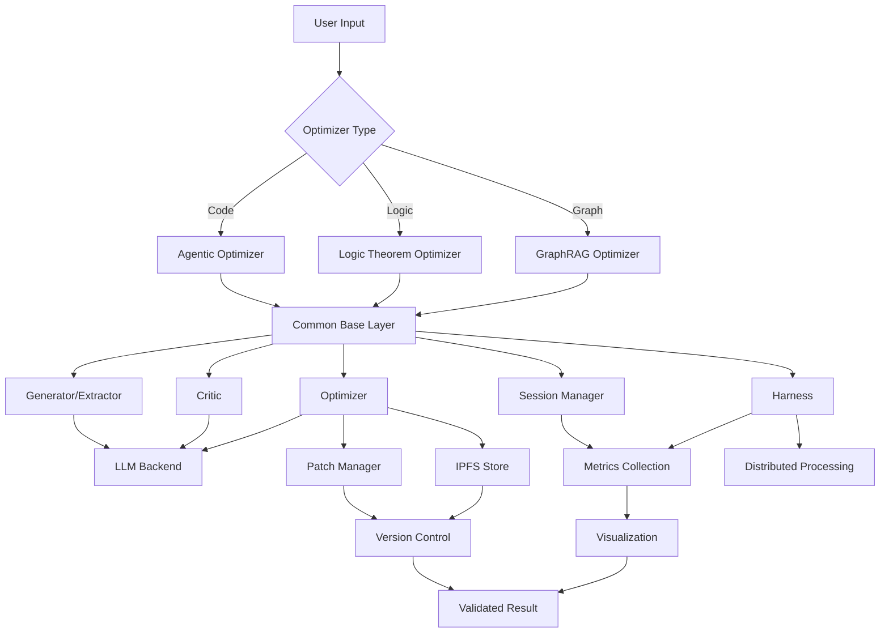

# Unified Optimizers Architecture

## Overview

This document describes the unified architecture for all optimizers in `ipfs_datasets_py/optimizers/`, enabling code reuse, consistent interfaces, and seamless integration between different optimization approaches.

## Current Optimizer Types

### 1. Agentic Optimizers (`agentic/`)
**Purpose**: LLM-driven recursive self-improvement of codebase  
**Methods**: Test-driven, Adversarial, Actor-Critic, Chaos Engineering  
**Key Features**:
- Two-tier change control (GitHub + patches)
- Multi-agent coordination
- IPFS-based patch distribution
- Comprehensive validation framework

### 2. Logic Theorem Optimizers (`logic_theorem_optimizer/`)
**Purpose**: Generate and optimize logical theorems from data  
**Methods**: SGD-based logic extraction and optimization  
**Key Features**:
- Theorem prover integration (Z3, CVC5, Lean, Coq)
- Knowledge graph consistency
- Neural-symbolic hybrid proving
- Distributed processing

### 3. GraphRAG Optimizers (`graphrag/`)
**Purpose**: Optimize knowledge graph ontologies and queries  
**Methods**: Ontology generation, query optimization, IPLD integration  
**Key Features**:
- Query optimization with caching
- Logic validation via TDFOL
- Cross-document reasoning
- Performance analysis and visualization

## Common Patterns

All three optimizer types share a similar pipeline architecture:

```
Data → Generator → Critic → Optimizer → Session → Harness → Validated Result
         (Extract)   (Evaluate)  (Improve)   (Cycle)  (Batch)
```

### Shared Components

1. **Generator/Extractor**: Creates initial artifacts from input data
2. **Critic**: Evaluates quality with multi-dimensional scoring
3. **Optimizer**: Uses feedback to improve generation (SGD-based)
4. **Session**: Single optimization cycle with state management
5. **Harness**: Batch orchestrator with parallelism
6. **LLM Backend**: Interface to various LLM providers
7. **Metrics Collection**: Performance and quality metrics
8. **Visualization**: Charts, graphs, and dashboards

## Unified Architecture

### Layer 1: Common Base (`optimizers/common/`)

```
optimizers/
├── common/
│   ├── __init__.py
│   ├── base_optimizer.py         # Abstract base for all optimizers
│   ├── base_critic.py            # Abstract base for critics
│   ├── base_session.py           # Session management framework
│   ├── base_harness.py           # Batch processing framework
│   ├── llm_integration.py        # Unified LLM backend
│   ├── prompt_templates.py       # Shared prompt system
│   ├── metrics_framework.py      # Metrics collection base
│   ├── visualization_base.py     # Visualization framework
│   └── distributed_base.py       # Distributed processing base
```

### Layer 2: Specialized Optimizers

Each optimizer extends the common base with domain-specific logic:

```python
from ipfs_datasets_py.optimizers.common import (
    BaseOptimizer,
    BaseCritic,
    BaseSession,
    BaseHarness,
)

class LogicTheoremOptimizer(BaseOptimizer):
    """Extends base with theorem-proving specific logic."""
    pass

class GraphRAGOptimizer(BaseOptimizer):
    """Extends base with knowledge graph specific logic."""
    pass

class AgenticCodeOptimizer(BaseOptimizer):
    """Extends base with code optimization specific logic."""
    pass
```

### Layer 3: Integration with Agentic Framework

```python
from ipfs_datasets_py.optimizers.agentic import (
    AgenticOptimizer,
    PatchManager,
    WorktreeManager,
    IPFSPatchStore,
)
from ipfs_datasets_py.optimizers.common import BaseOptimizer

class UnifiedOptimizer(BaseOptimizer, AgenticOptimizer):
    """Combines common base with agentic capabilities."""
    
    def __init__(self, *args, **kwargs):
        BaseOptimizer.__init__(self, *args, **kwargs)
        AgenticOptimizer.__init__(self, *args, **kwargs)
        self.patch_manager = PatchManager()
        self.worktree_manager = WorktreeManager()
```

## Architecture Diagram



## Key Interfaces

### BaseOptimizer Interface

```python
from abc import ABC, abstractmethod
from typing import Any, Dict, List

class BaseOptimizer(ABC):
    """Base class for all optimizers."""
    
    @abstractmethod
    def generate(self, input_data: Any, context: Dict) -> Any:
        """Generate initial artifact from input."""
        pass
    
    @abstractmethod
    def critique(self, artifact: Any, context: Dict) -> float:
        """Evaluate artifact quality (0-1 score)."""
        pass
    
    @abstractmethod
    def optimize(self, artifact: Any, score: float, context: Dict) -> Any:
        """Improve artifact based on critique."""
        pass
    
    def run_session(self, input_data: Any, context: Dict) -> Dict:
        """Run single optimization session."""
        artifact = self.generate(input_data, context)
        score = self.critique(artifact, context)
        
        for iteration in range(self.max_iterations):
            if score >= self.target_score:
                break
            artifact = self.optimize(artifact, score, context)
            score = self.critique(artifact, context)
        
        return {
            'artifact': artifact,
            'score': score,
            'iterations': iteration + 1,
        }
```

### BaseCritic Interface

```python
from abc import ABC, abstractmethod
from dataclasses import dataclass
from typing import Dict, List

@dataclass
class CriticScore:
    """Standardized critic score."""
    overall: float  # 0-1
    dimensions: Dict[str, float]  # Dimension scores
    feedback: List[str]  # Improvement suggestions
    confidence: float  # Score confidence

class BaseCritic(ABC):
    """Base class for all critics."""
    
    @abstractmethod
    def evaluate(self, artifact: Any, context: Dict) -> CriticScore:
        """Evaluate artifact quality."""
        pass
    
    @abstractmethod
    def get_dimensions(self) -> List[str]:
        """Return evaluation dimensions."""
        pass
```

### BaseSession Interface

```python
from abc import ABC, abstractmethod
from dataclasses import dataclass
from enum import Enum

class SessionStatus(Enum):
    PENDING = "pending"
    RUNNING = "running"
    COMPLETED = "completed"
    FAILED = "failed"

@dataclass
class SessionResult:
    """Standardized session result."""
    session_id: str
    status: SessionStatus
    artifact: Any
    score: float
    iterations: int
    metrics: Dict[str, Any]
    error: Optional[str] = None

class BaseSession(ABC):
    """Base class for optimization sessions."""
    
    @abstractmethod
    def start(self, input_data: Any, context: Dict) -> str:
        """Start optimization session."""
        pass
    
    @abstractmethod
    def get_status(self, session_id: str) -> SessionStatus:
        """Get session status."""
        pass
    
    @abstractmethod
    def get_result(self, session_id: str) -> SessionResult:
        """Get session result."""
        pass
```

## Integration Strategy

### Phase 1: Extract Common Base

1. Create `optimizers/common/` directory
2. Extract shared interfaces and base classes
3. Update imports in existing optimizers
4. Ensure backward compatibility

### Phase 2: Refactor Logic Theorem Optimizer

1. Extend `BaseOptimizer` instead of custom base
2. Use `BaseCritic` interface
3. Integrate with unified LLM backend
4. Use common metrics framework

### Phase 3: Refactor GraphRAG Optimizer

1. Extend `BaseOptimizer` instead of custom base
2. Use `BaseCritic` interface
3. Share query optimization infrastructure
4. Use common visualization

### Phase 4: Integrate with Agentic Framework

1. Make agentic optimizers extend `BaseOptimizer`
2. Add patch management to logic and graphrag optimizers
3. Enable multi-agent coordination across all types
4. Unified change control workflow

## Code Reuse Opportunities

### High-Priority Shared Components

1. **LLM Backend Integration** (40% duplication)
   - Currently duplicated across all three optimizers
   - Unify into single adapter with provider abstraction
   - Share prompt template system

2. **Critic Evaluation** (35% duplication)
   - Similar scoring dimensions across optimizers
   - Share dimension weighting logic
   - Unified feedback generation

3. **Session Management** (30% duplication)
   - All use similar session lifecycle
   - Share state management and persistence
   - Common error handling

4. **Metrics Collection** (45% duplication)
   - Similar performance metrics
   - Share visualization code
   - Common export formats

5. **Distributed Processing** (50% duplication)
   - Task distribution logic
   - Worker management
   - Result aggregation

### Medium-Priority Shared Components

1. **Prompt Engineering** (25% duplication)
2. **Conflict Resolution** (20% duplication)
3. **Ontology Management** (15% duplication)
4. **Validation Frameworks** (30% duplication)

## Benefits

### Code Quality
- **Reduced Duplication**: 40-50% reduction in duplicate code
- **Consistency**: Unified interfaces and patterns
- **Maintainability**: Single source of truth
- **Testability**: Shared test infrastructure

### Functionality
- **Extensibility**: Easy to add new optimizer types
- **Interoperability**: Optimizers can work together
- **Composability**: Mix and match components
- **Reusability**: Components usable across projects

### Performance
- **Optimization**: Share performance improvements
- **Caching**: Unified caching strategy
- **Distribution**: Common distributed processing
- **Resource Management**: Shared resource pools

## Migration Path

### Step 1: Create Common Base (Week 1)
- [ ] Create `optimizers/common/` structure
- [ ] Implement base classes
- [ ] Add comprehensive tests
- [ ] Document interfaces

### Step 2: Refactor Logic Theorem (Week 2)
- [ ] Update to use common base
- [ ] Integrate with unified LLM backend
- [ ] Add patch management support
- [ ] Update tests

### Step 3: Refactor GraphRAG (Week 3)
- [ ] Update to use common base
- [ ] Share query optimization logic
- [ ] Add patch management support
- [ ] Update tests

### Step 4: Integrate Agentic (Week 4)
- [ ] Update agentic to extend base
- [ ] Enable cross-optimizer coordination
- [ ] Unified change control
- [ ] Final integration tests

### Step 5: Documentation & Examples (Week 5)
- [ ] Architecture documentation
- [ ] API reference
- [ ] Usage examples
- [ ] Migration guide

## Configuration

### Unified Configuration Schema

```yaml
optimizers:
  common:
    llm_backend:
      provider: gpt-4
      fallback_providers:
        - claude-3-opus
        - codex
      max_tokens: 4000
      temperature: 0.2
    
    metrics:
      collection_enabled: true
      export_format: json
      export_path: ./metrics/
    
    distributed:
      enabled: true
      max_workers: 5
      task_timeout: 300
  
  logic_theorem:
    provers:
      - z3
      - cvc5
      - lean
    extraction_mode: hybrid
    confidence_threshold: 0.75
  
  graphrag:
    query_cache_enabled: true
    query_cache_ttl: 3600
    vector_partitions: 10
    visualization_enabled: true
  
  agentic:
    change_control: patch  # or github
    max_agents: 5
    validation_levels:
      - syntax
      - types
      - tests
      - performance
```

## Appendix: File Organization

```
optimizers/
├── common/                          # Shared components (NEW)
│   ├── __init__.py
│   ├── base_optimizer.py
│   ├── base_critic.py
│   ├── base_session.py
│   ├── base_harness.py
│   ├── llm_integration.py
│   ├── prompt_templates.py
│   ├── metrics_framework.py
│   ├── visualization_base.py
│   └── distributed_base.py
│
├── agentic/                         # LLM-driven code optimization
│   ├── base.py                      # (UPDATE: extend common.BaseOptimizer)
│   ├── patch_control.py
│   ├── github_control.py
│   ├── coordinator.py
│   └── methods/
│       └── test_driven.py
│
├── logic_theorem_optimizer/         # Theorem proving
│   ├── logic_optimizer.py           # (UPDATE: extend common.BaseOptimizer)
│   ├── logic_critic.py              # (UPDATE: extend common.BaseCritic)
│   ├── theorem_session.py           # (UPDATE: extend common.BaseSession)
│   ├── logic_harness.py             # (UPDATE: extend common.BaseHarness)
│   └── ...
│
├── graphrag/                        # Knowledge graph optimization
│   ├── ontology_optimizer.py        # (UPDATE: extend common.BaseOptimizer)
│   ├── ontology_critic.py           # (UPDATE: extend common.BaseCritic)
│   ├── ontology_session.py          # (UPDATE: extend common.BaseSession)
│   ├── ontology_harness.py          # (UPDATE: extend common.BaseHarness)
│   └── ...
│
├── ARCHITECTURE_UNIFIED.md          # This document
├── IMPLEMENTATION_PLAN.md           # Agentic implementation plan
└── USAGE_GUIDE.md                   # Agentic usage guide
```

## Next Steps

1. Review and approve this architecture
2. Begin Phase 1: Create common base layer
3. Incrementally migrate existing optimizers
4. Add integration tests
5. Update documentation

## Questions for Stakeholders

1. Should we maintain backward compatibility during migration?
2. What is the priority order for refactoring?
3. Are there other optimizer types planned?
4. Should we create a migration tool for existing code?
5. What is the timeline for completion?
