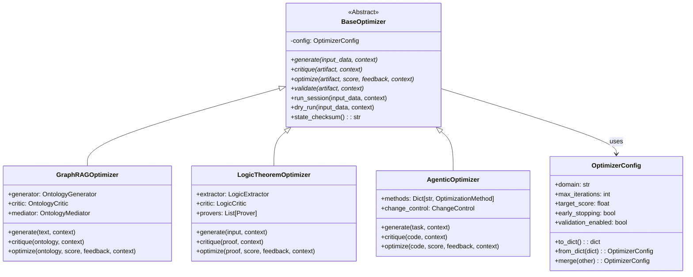

# Optimizers Module

A comprehensive framework for code optimization using multiple approaches including agentic AI-driven optimization, logic theorem optimization, and GraphRAG optimization.

## Overview

The optimizers module provides:

1. **Agentic Optimizers** - AI-powered code optimization with multiple methodologies
2. **Logic Theorem Optimizers** - Formal logic and theorem proving optimization
3. **GraphRAG Optimizers** - Knowledge graph-based optimization
4. **Common Infrastructure** - Shared base classes and utilities

## Directory Structure

```
optimizers/
├── agentic/                    # AI-powered agentic optimization
│   ├── base.py                 # Base classes and interfaces
│   ├── coordinator.py          # Multi-agent coordination
│   ├── github_control.py       # GitHub-based change control
│   ├── patch_control.py        # Patch-based change control
│   ├── validation.py           # Comprehensive validation framework
│   ├── cli.py                  # Command-line interface
│   ├── github_api_unified.py   # Unified GitHub API with caching
│   └── methods/                # Optimization methods
│       ├── test_driven.py      # Test-driven optimization
│       ├── adversarial.py      # Adversarial optimization
│       ├── actor_critic.py     # Actor-critic optimization
│       └── chaos.py            # Chaos engineering optimization
│
├── common/                     # Shared infrastructure
│   ├── base_optimizer.py       # BaseOptimizer abstract class
│   └── README.md               # Common infrastructure guide
│
├── logic_theorem_optimizer/    # Logic and theorem proving
│   ├── logic_optimizer.py      # Main logic optimizer
│   ├── logic_critic.py         # Logic critic
│   ├── theorem_session.py      # Theorem proving sessions
│   └── ...                     # Additional logic components
│
└── graphrag/                   # GraphRAG optimization
    ├── ontology_optimizer.py   # Ontology optimization
    ├── ontology_critic.py      # Ontology critic
    ├── query_optimizer.py      # Query optimization
    └── ...                     # Additional GraphRAG components
```

  ## Architecture Diagram

  ```mermaid
  flowchart LR
    subgraph Optimizers
      Agentic[Agentic Optimizers]
      Logic[Logic Theorem Optimizers]
      GraphRAG[GraphRAG Optimizers]
      Common[Common Infrastructure]
    end

    Common --> Agentic
    Common --> Logic
    Common --> GraphRAG

    Agentic -->|Change control| GitHub[GitHub/patch workflows]
    GraphRAG -->|Generate/Evaluate/Refine| Ontology[Ontology artifacts]
    Logic -->|Prove/Validate| Proofs[Theorem proofs]
  ```

## Class Hierarchy and Interfaces

The optimizers framework uses a common base class and protocols to ensure consistency:



## Quick Start

> **New!** For comprehensive guides, see:
> - [Performance Tuning Guide](../../docs/optimizers/PERFORMANCE_TUNING_GUIDE.md) - Optimize execution speed and resource usage
> - [Troubleshooting Guide](../../docs/optimizers/TROUBLESHOOTING_GUIDE.md) - Common issues and solutions
> - [Integration Examples](../../docs/optimizers/INTEGRATION_EXAMPLES.md) - Real-world use cases (FastAPI, Flask, CLI, batch processing)
> - [Sandboxed Prover Policy](../../docs/optimizers/SANDBOXED_PROVER_POLICY.md) - Security baseline for untrusted external prover subprocesses
> - [Troubleshooting Dashboards](../../docs/optimizers/TROUBLESHOOTING_DASHBOARDS.md) - Metrics/log panels for performance and quality drift triage

### Agentic Optimizer CLI

```bash
# Optimize code using test-driven development
python -m ipfs_datasets_py.optimizers.agentic.cli optimize \
  --method test_driven \
  --target ipfs_datasets_py/cache.py \
  --description "Optimize caching performance"

# Validate code
python -m ipfs_datasets_py.optimizers.agentic.cli validate \
  path/to/file.py \
  --level standard

# View optimization statistics
python -m ipfs_datasets_py.optimizers.agentic.cli stats

# Rollback changes
python -m ipfs_datasets_py.optimizers.agentic.cli rollback patch-id-123
```

### Programmatic Usage

```python
from ipfs_datasets_py.optimizers.agentic import (
    TestDrivenOptimizer,
    OptimizationTask,
    ChangeControlMethod,
)

# Create optimization task
task = OptimizationTask(
    task_id="task-001",
    description="Optimize data loading",
    target_files=[Path("ipfs_datasets_py/data_loader.py")],
    priority=75,
)

# Create optimizer (requires LLM router)
optimizer = TestDrivenOptimizer(
    agent_id="opt-001",
    llm_router=llm_router,
    change_control=ChangeControlMethod.PATCH,
)

# Run optimization
result = optimizer.optimize(task)
```

### GraphRAG Ontology Optimizer (Python API)

```python
from ipfs_datasets_py.optimizers.graphrag import (
    OntologyGenerator,
    OntologyCritic,
    OntologyMediator,
    OntologyGenerationContext,
    DataType,
    ExtractionStrategy,
)

# Create context
context = OntologyGenerationContext(
    data_source="my_document.txt",
    data_type=DataType.TEXT,
    domain="legal",
    extraction_strategy=ExtractionStrategy.RULE_BASED,
)

# Option 1: Direct generation + evaluation
generator = OntologyGenerator()
critic = OntologyCritic()
ontology = generator.generate_ontology(contract_text, context)
score = critic.evaluate_ontology(ontology, context, contract_text)
print(f"Quality: {score.overall:.2f} | Entities: {len(ontology['entities'])}")

# Option 2: Full refinement cycle (generator + critic + mediator)
mediator = OntologyMediator(
    generator=generator,
    critic=critic,
    max_rounds=5,
    convergence_threshold=0.85,
)
state = mediator.run_refinement_cycle(contract_text, context)
print(f"Final score: {state.critic_scores[-1].overall:.2f} | Rounds: {state.current_round}")
```

### GraphRAG CLI

```bash
# Generate ontology from a text file
python -m ipfs_datasets_py.optimizers.graphrag.cli_wrapper generate \
  --input document.txt \
  --domain legal \
  --strategy rule_based \
  --output ontology.json

# Health check
python -m ipfs_datasets_py.optimizers.graphrag.cli_wrapper health
```

### Logic Theorem Optimizer (Python API)

```python
from ipfs_datasets_py.optimizers.logic_theorem_optimizer import LogicTheoremOptimizer
from ipfs_datasets_py.optimizers.common import OptimizerConfig, OptimizationContext

optimizer = LogicTheoremOptimizer(
    config=OptimizerConfig(max_iterations=3, target_score=0.85),
    domain="legal",
)
context = OptimizationContext(
    session_id="session-001",
    input_data=contract_text,
    domain="legal",
)
result = optimizer.run_session(contract_text, context)
print(f"Score: {result['score']:.2f} | Valid: {result['valid']}")
```

### Logic Theorem Optimizer CLI

```bash
# Prove a theorem
python -m ipfs_datasets_py.optimizers.logic_theorem_optimizer.cli_wrapper prove \
  --theorem "All employees must complete training" \
  --premises "Alice is an employee" \
  --goal "Alice must complete training"

# Prove from a JSON file
python -m ipfs_datasets_py.optimizers.logic_theorem_optimizer.cli_wrapper prove \
  --from-file theorem.json

# Validate logical consistency
python -m ipfs_datasets_py.optimizers.logic_theorem_optimizer.cli_wrapper validate \
  --input statements.json
```

## Agentic Optimization Methods

### 1. Test-Driven (`test_driven`)
- Generates comprehensive tests first
- Optimizes code to pass tests
- Validates performance improvements
- **Use when**: Code needs test coverage improvements

### 2. Adversarial (`adversarial`)
- Generates N competing solutions (default: 5)
- Benchmarks all alternatives
- Selects best using multi-criteria scoring
- **Use when**: Exploring multiple approaches to optimization

### 3. Actor-Critic (`actor_critic`)
- Learns from feedback over time
- Stores successful patterns in policy
- Improves with each optimization
- **Use when**: Repeated optimizations on similar code

### 4. Chaos Engineering (`chaos`)
- Injects 10 types of faults
- Identifies resilience weaknesses
- Generates fixes automatically
- **Use when**: Improving error handling and robustness

## Validation Framework

### Validation Levels

- **BASIC**: Syntax checking only (fast)
- **STANDARD**: Syntax + types + unit tests (recommended)
- **STRICT**: Standard + performance validation (critical paths)
- **PARANOID**: All validators + security + style (sensitive code)

### Validators

1. **SyntaxValidator**: AST parsing and syntax verification
2. **TypeValidator**: mypy type checking
3. **TestValidator**: pytest test execution
4. **PerformanceValidator**: Benchmarking and improvement thresholds
5. **SecurityValidator**: Dangerous patterns and vulnerability detection
6. **StyleValidator**: PEP 8 compliance and code quality

### Usage

```python
from ipfs_datasets_py.optimizers.agentic.validation import (
    OptimizationValidator,
    ValidationLevel,
)

validator = OptimizationValidator(
    level=ValidationLevel.STANDARD,
    parallel=True,
)

result = validator.validate_sync(
    code=code_to_validate,
    target_files=[Path("file.py")],
    context={},
)

print(f"Passed: {result.passed}")
print(f"Errors: {len(result.errors)}")
```

## Change Control Methods

### Patch-Based Control (`ChangeControlMethod.PATCH`)

- Uses git worktrees for isolation
- Stores patches in IPFS with CIDs
- Supports easy rollback via reversal patches
- **Best for**: Compute-constrained environments, offline work

### GitHub-Based Control (`ChangeControlMethod.GITHUB`)

- Creates GitHub issues for tracking
- Draft PRs for code review
- API caching to minimize rate limits
- **Best for**: Team collaboration, API-enabled environments

## CLI Commands Reference

| Command | Description | Example |
|---------|-------------|---------|
| `optimize` | Start optimization task | `optimize --method adversarial --target *.py` |
| `agents list` | List all agents | `agents list` |
| `agents status` | Show agent details | `agents status agent-123` |
| `queue process` | Process task queue | `queue process` |
| `stats` | Show statistics | `stats` |
| `rollback` | Revert changes | `rollback patch-123 --force` |
| `config` | Manage configuration | `config set --key max_agents --value 10` |
| `validate` | Validate code | `validate file.py --level strict` |

## Configuration

Configuration is stored in `.optimizer-config.json`:

```json
{
  "change_control": "patch",
  "validation_level": "standard",
  "max_agents": 5,
  "ipfs_gateway": "http://127.0.0.1:5001",
  "github_repo": null,
  "github_token": null
}
```

## Examples

See `examples/agentic/` for practical examples:

- `simple_optimization.py` - Single-agent optimization
- `validation_example.py` - Validation at all levels
- `README.md` - Comprehensive examples guide

## GraphRAG Ontology Pipeline — Quick Start

The GraphRAG sub-package (`optimizers/graphrag/`) implements a **generate → critique → refine**
loop for knowledge-graph ontologies.  Below is the minimum code needed to produce a scored
ontology from raw text.

```python
from ipfs_datasets_py.optimizers.graphrag import (
    OntologyGenerator,
    OntologyCritic,
    OntologyMediator,
    OntologyPipeline,
    OntologyGenerationContext,
    DataType,
    ExtractionStrategy,
)

# ── 1. Create shared objects ─────────────────────────────────────────────────
generator = OntologyGenerator()
critic     = OntologyCritic()
mediator   = OntologyMediator(generator=generator, critic=critic)

# ── 2. Describe the task ─────────────────────────────────────────────────────
context = OntologyGenerationContext(
    data_source="employment_contract.txt",
    data_type=DataType.TEXT,
    domain="legal",
    extraction_strategy=ExtractionStrategy.RULE_BASED,
)

# ── 3. One-shot generation + scoring ─────────────────────────────────────────
text = "Alice is an employee of Acme Corp. She must complete annual training."
result = generator.generate_ontology(text, context)          # EntityExtractionResult
score  = critic.evaluate_ontology(result, context, text)     # CriticScore
print(f"entities={len(result.entities)}  score={score.overall:.2f}")

# ── 4. Iterative refinement via mediator (up to 5 rounds) ───────────────────
mediator.max_rounds = 5
refined_ontology = mediator.run_refinement_cycle(text, context)
final_score       = mediator.get_last_score()
print(f"Final overall={final_score.overall:.2f}  rounds={mediator.current_round}")

# ── 5. Pipeline for multi-run tracking ───────────────────────────────────────
pipeline = OntologyPipeline(generator=generator, critic=critic)
pipeline.run(text, context)
print(f"Best run: {pipeline.first_score():.2f} → {pipeline.run_score_mean():.2f} avg")
```

### Class Diagram (core GraphRAG classes)

```
OntologyGenerationContext
  │ data_source, data_type, domain, extraction_strategy
  │
  ▼
OntologyGenerator ──► EntityExtractionResult
  │  generate_ontology()        entities: [Entity]
  │  extract_entities()         relationships: [Relationship]
  │  filter_by_confidence()
  │
  ▼
OntologyCritic ──────► CriticScore
  │  evaluate_ontology()         completeness, consistency,
  │  evaluate_batch_parallel()   clarity, granularity,
  │  suggest_improvements()      relationship_coherence,
  │                               domain_alignment, overall
  ▼
OntologyMediator
  │  refine_ontology()  (single round)
  │  run_refinement_cycle()  (iterative)
  │  retry_last_round()
  │
  ▼
OntologyOptimizer ───► OptimizationReport
  │  optimize()                   average_score, history
  │  score_iqr(), score_ewma()
  │  history_rolling_std()
  │
  ▼
OntologyPipeline
     run()  (orchestrates all stages)
     best_score_improvement()
     rounds_without_improvement()
```

### Key Extraction Config fields

| Field | Default | Description |
|-------|---------|-------------|
| `confidence_threshold` | `0.5` | Minimum entity confidence to keep |
| `max_entities` | `100` | Maximum entities per extraction |
| `max_relationships` | `200` | Maximum relationships per extraction |
| `window_size` | `512` | Character window for sliding extraction |
| `llm_fallback_threshold` | `0.3` | Confidence below which LLM fallback activates |

## Architecture Documentation

- **ARCHITECTURE_UNIFIED.md** - Unified optimizer architecture
- **ARCHITECTURE_AGENTIC_OPTIMIZERS.md** - Agentic optimizer design
- **ARCHITECTURE_DIAGRAMS.md** - Visual diagrams (Mermaid) for all optimizer types
- **docs/OPTIMIZATION_LOOP_ARCHITECTURE.md** - ASCII architecture for generate -> critique -> optimize -> validate
- **IMPLEMENTATION_PLAN.md** - Implementation roadmap
- **USAGE_GUIDE.md** - Detailed usage guide
- **GITHUB_INTEGRATION.md** - GitHub integration guide
- **QUICK_START.md** - Fast setup for all optimizer types
- **CODE_EXAMPLES.md** - Comprehensive code examples for public methods
- **COMMON_PITFALLS.md** - Troubleshooting guide with solutions
- **docs/GLOSSARY.md** - Shared terminology for ontology, pipeline, and optimization concepts

## Quick Start Guides

### GraphRAG Optimizer
For detailed GraphRAG usage including entity extraction, ontology refinement, and LLM-based feedback agents, see:
- **[GRAPHRAG_QUICK_START.md](../../docs/optimizers/GRAPHRAG_QUICK_START.md)** - Complete GraphRAG quick start with examples, configuration, CLI usage, and troubleshooting

### Other Optimizers
- **Agentic Optimizer** - See "Quick Start" and "Agentic Optimization Methods" sections above
- **Logic Theorem Optimizer** - See "Logic Theorem Optimizer (Python API)" section above
- **Selection Guide** - See [SELECTION_GUIDE.md](../../docs/optimizers/SELECTION_GUIDE.md) to choose the right optimizer

## Task Guides

- **TASK_GUIDE_ENTITY_EXTRACTION.md** - Practical steps for improving entity extraction quality
- **[PERFORMANCE_TUNING_GUIDE.md](../../docs/optimizers/PERFORMANCE_TUNING_GUIDE.md)** - Performance optimization strategies and bottleneck analysis
- **[TROUBLESHOOTING_GUIDE.md](../../docs/optimizers/TROUBLESHOOTING_GUIDE.md)** - Solutions to common issues with GraphRAG optimizers
- **[INTEGRATION_EXAMPLES.md](../../docs/optimizers/INTEGRATION_EXAMPLES.md)** - Real-world integration examples (FastAPI, Flask, CLI, CI/CD, batch processing)

## Golden Fixtures

Golden fixtures lock in rule-based extraction outputs for small domain corpora
to catch regressions. To refresh the fixtures after intentional changes:

```bash
PYTHONPATH=ipfs_datasets_py python ipfs_datasets_py/optimizers/tests/fixtures/graphrag/generate_golden_fixtures.py
```

## REST API Metrics

Expose Prometheus-compatible metrics from the REST API by enabling collection:

```bash
export ENABLE_PROMETHEUS=true
curl http://localhost:8000/metrics
```

## Backlog

- See `TODO.md` for the living refactor/feature backlog and inline TODO inventory.

## Implementation Status

### Completed ✅
- Base infrastructure (Phase 1)
- All 4 optimization methods (Phase 2)
- Comprehensive validation framework (Phase 4)
- CLI interface with 8 commands (Phase 5)
- Practical examples (Phase 7 partial)

### In Progress 🚧
- Test suite (Phase 6)
- LLM router integration (Phase 3)
- Additional examples (Phase 7)

### Planned 📋
- Dashboard for monitoring
- GitHub Actions workflows (Phase 8)
- Production hardening (Phase 9)

## Requirements

- Python 3.12+
- Git (for patch-based control)
- IPFS daemon (optional, for IPFS storage)
- mypy (optional, for type validation)
- pytest (optional, for test validation)

## Contributing

When contributing to the optimizers module:

1. Follow the unified architecture in `common/`
2. Add comprehensive docstrings
3. Include type hints
4. Write tests for new functionality
5. Update relevant documentation
6. Use validation framework for code quality

## Support

For issues, questions, or contributions:
- See documentation in `docs/`
- Check examples in `examples/agentic/`
- Review architecture documents in this directory

## License

See repository LICENSE file for details.
