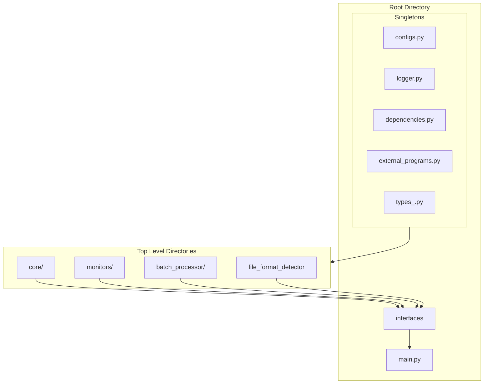
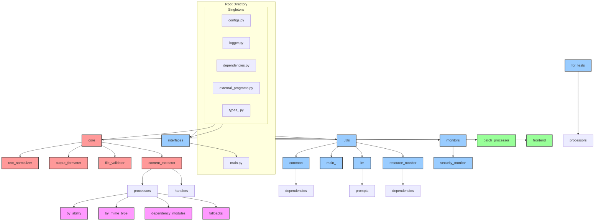
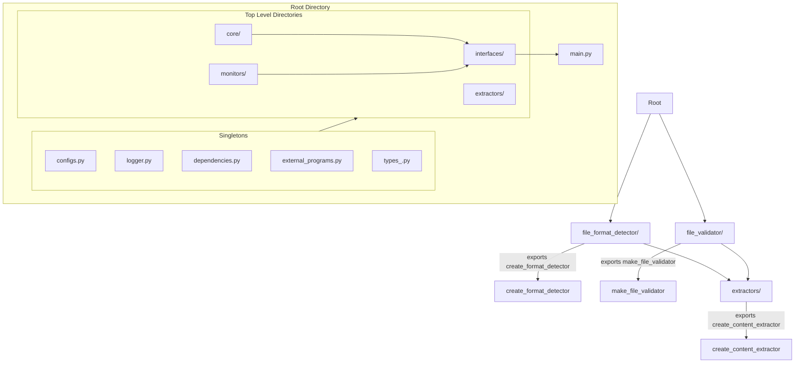

# Revised Architecture: Hierarchical Structure with Single Exports

## Overview
This document outlines a proposed refactoring of the Omni-Converter codebase to implement a clean hierarchical structure where:
- Each directory exports a single function. The function has no arguments, runs exactly once, and constructs a single object.
- Each object possesses a series of pre-specified characteristics that meet the functional requirements of the object it is injected into. This includes, but is not limited to:
  - A well-defined public interface with documented methods and return types
  - Error handling capabilities with consistent exception patterns
  - Resource management (proper cleanup of file handles, memory, etc.)
  - Configuration validation and sensible defaults
  - Logging integration for debugging and monitoring
  - Performance characteristics suitable for the expected workload
- The object must be able to be evaluated against a series of pre-specified evaluation metrics.
- Objects with sub-directories flow upward only (no cross-directory access)
- Directories are organized by 
- Tightly-coupled files are grouped together in their own directories

## Architecture Diagram Mk3




## Architecture Diagram Mk2




graph TD

    
    
    
    %% Layer 3: Processing pipeline
    Core[core/]
    Extractors --> Core
    
    Core --> |exports make_processing_pipeline| PP_Export[make_processing_pipeline]
    
    %% Layer 4: Resource management
    Monitors[monitors/]
    Core --> Monitors
    
    Monitors --> |exports create_monitor_suite| MS_Export[create_monitor_suite]
    
    %% Layer 5: User interfaces
    Interfaces[interfaces/]
    Core --> Interfaces
    Monitors --> Interfaces
    
    Interfaces --> |exports create_interface| IF_Export[create_interface]
    
    %% Top level entry point
    MainPy[main.py]
    Interfaces --> MainPy
    
    %% Internal structure examples
    subgraph "extractors/ internals"
        E_Handlers[handlers/]
        E_Processors[processors/]
        E_Factory[extractor_factory.py]
        E_Registry[format_registry.py]
        
        E_Processors --> E_Handlers
        E_Handlers --> E_Factory
        E_Registry --> E_Factory
    end
    
    subgraph "core/ internals"
        C_Pipeline[processing_pipeline.py]
        C_Extractor[content_extractor.py]
        C_Formatter[output_formatter.py]
        C_Factory[core_factory.py]
        
        C_Extractor --> C_Pipeline
        C_Formatter --> C_Pipeline
        C_Pipeline --> C_Factory
    end
    
    subgraph "interfaces/ internals"
        I_CLI[cli.py]
        I_GUI[gui.py] 
        I_API[python_api.py]
        I_Factory[interface_factory.py]
        
        I_CLI --> I_Factory
        I_GUI --> I_Factory
        I_API --> I_Factory
    end
    
    %% Testing structure (mirrors main structure)
    Tests[tests/]
    Tests -.-> |mirrors structure| Extractors
    Tests -.-> |mirrors structure| Core
    Tests -.-> |mirrors structure| Interfaces
    Tests -.-> |mirrors structure| Monitors
    
    %% Utilities that support multiple layers
    Utils[utils/]
    Utils --> |provides shared utilities| Extractors
    Utils --> |provides shared utilities| Core
    Utils --> |provides shared utilities| Monitors
    
    style Root fill:#e1f5fe
    style FD_Export fill:#c8e6c9
    style FV_Export fill:#c8e6c9
    style CE_Export fill:#c8e6c9
    style PP_Export fill:#c8e6c9
    style MS_Export fill:#c8e6c9
    style IF_Export fill:#c8e6c9
    style MainPy fill:#ffcdd2
```

## Layer Structure

### Root Level (Shared Dependencies)
Files that are referenced by multiple top-level directories:
- `configs.py` - Configuration management
- `logger.py` - Logging utilities  
- `dependencies.py` - Dependency management
- `external_programs.py` - External program detection
- `types_.py` - Shared type definitions

### Layer 1: Foundation Modules

#### `file_format_detector/`
**Single Export**: `create_format_detector()`
- Responsibility: File format detection and identification
- Internal files: `file_format_detector.py`, `supported_formats.py`, etc.
- Dependencies: Root level only

#### `file_validator/` 
**Single Export**: `make_file_validator()`
- Responsibility: File validation and security checks
- Internal files: `file_validator.py`, `validation_result.py`, etc.
- Dependencies: Root level only

### Layer 2: Content Extraction

#### `extractors/`
**Single Export**: `create_content_extractor()`
- Responsibility: Extract content from various file formats
- Internal structure:
  - `handlers/` - Format-specific handlers (text, image, video, etc.)
  - `processors/` - Low-level processing functions
  - `extractor_factory.py` - Factory for creating extractors
  - `format_registry.py` - Registry of supported formats
- Dependencies: Layer 1 + Root

### Layer 3: Processing Pipeline

#### `core/`
**Single Export**: `make_processing_pipeline()`
- Responsibility: Orchestrate the complete processing workflow
- Internal files:
  - `processing_pipeline.py` - Main pipeline orchestration
  - `content_extractor.py` - Content extraction coordination
  - `output_formatter.py` - Format output results
  - `core_factory.py` - Factory for creating pipeline
- Dependencies: Layer 2 + below

### Layer 4: Resource Management

#### `monitors/`
**Single Export**: `create_monitor_suite()`
- Responsibility: Resource monitoring, batch processing, error handling
- Internal files:
  - `batch_processor.py` - Batch processing coordination
  - `resource_monitor.py` - System resource monitoring
  - `error_monitor.py` - Error tracking and handling
  - `monitor_factory.py` - Factory for creating monitors
- Dependencies: Layer 3 + below

### Layer 5: User Interfaces

#### `interfaces/`
**Single Export**: `create_interface(type: str)`
- Responsibility: User-facing interfaces (CLI, GUI, API)
- Internal files:
  - `cli.py` - Command-line interface
  - `gui.py` - Graphical user interface
  - `python_api.py` - Programmatic API
  - `interface_factory.py` - Factory for creating interfaces
- Dependencies: Layer 4 + below

### Top Level

#### `main.py`
- Entry point for the application
- Uses `create_interface()` to initialize and run
- Dependencies: Layer 5

## Key Design Principles

### 1. Single Responsibility per Directory
Each directory has one clear responsibility and exports exactly one factory function that creates instances of that responsibility.

### 2. Upward Dependencies Only
- Dependencies flow upward through the layers
- No circular dependencies
- Lower layers never import from higher layers
- Shared utilities live at the root level

### 3. Factory Pattern for Everything
Every directory exports a factory function that:
- Takes configuration and dependencies as parameters
- Returns a fully configured instance
- Can be easily mocked for testing
- Makes dependency injection explicit

### 4. Tightly-Coupled Grouping
Files that are tightly coupled are grouped together in the same directory:
- All format handlers in `extractors/handlers/`
- All processors in `extractors/processors/`
- All monitoring components in `monitors/`

### 5. Mockability
- Each layer can be independently mocked by replacing its factory function
- Dependencies are injected rather than imported directly
- Clear interface boundaries make testing isolated components easy

### 6. Findability
- Single entry point per directory makes it obvious where functionality lives
- Hierarchical structure matches the logical flow of data
- Factory pattern makes object creation explicit and discoverable

## Special Considerations

### `utils/` Directory
Currently contains various shared utilities. Options:
1. **Keep as shared utilities**: Used by multiple layers, imported as needed
2. **Distribute to appropriate layers**: Move utilities to the layers that use them
3. **Hybrid approach**: Keep truly shared utilities, move layer-specific ones

### `tools/` Directory
Self-contained command-line tools. Options:
1. **Keep separate**: Tools are independent applications
2. **Integrate with interfaces**: Tools become part of the interface layer

### `tests/` Directory
Should mirror the main structure:
- `tests/file_format_detector/`
- `tests/extractors/`
- `tests/core/`
- `tests/monitors/`
- `tests/interfaces/`

### `frontend/` Directory
Web-based interface. Options:
1. **Part of interfaces**: Frontend becomes another interface type
2. **Separate layer**: Frontend gets its own layer above interfaces

## Migration Strategy

1. **Phase 1**: Reorganize existing code into the new directory structure
2. **Phase 2**: Create factory functions for each directory
3. **Phase 3**: Update imports to use factory functions
4. **Phase 4**: Update tests to mirror new structure
5. **Phase 5**: Verify no circular dependencies exist

## Benefits

1. **Easier Testing**: Each layer can be independently mocked
2. **Better Separation of Concerns**: Each directory has one clear responsibility
3. **Reduced Coupling**: Dependencies are explicit and unidirectional
4. **Improved Discoverability**: Single entry point per module
5. **Simplified Debugging**: Clear dependency chain makes issues easier to trace
6. **Better Maintainability**: Changes are localized to specific layers

## Questions for Review

1. Is this hierarchy viable for the current use case?
2. Should `utils/` be broken up and distributed to appropriate layers?
3. How should `tools/` and `frontend/` be integrated into this structure?
4. Are there any missing components or layers?
5. Does the dependency flow make sense for the application's needs?