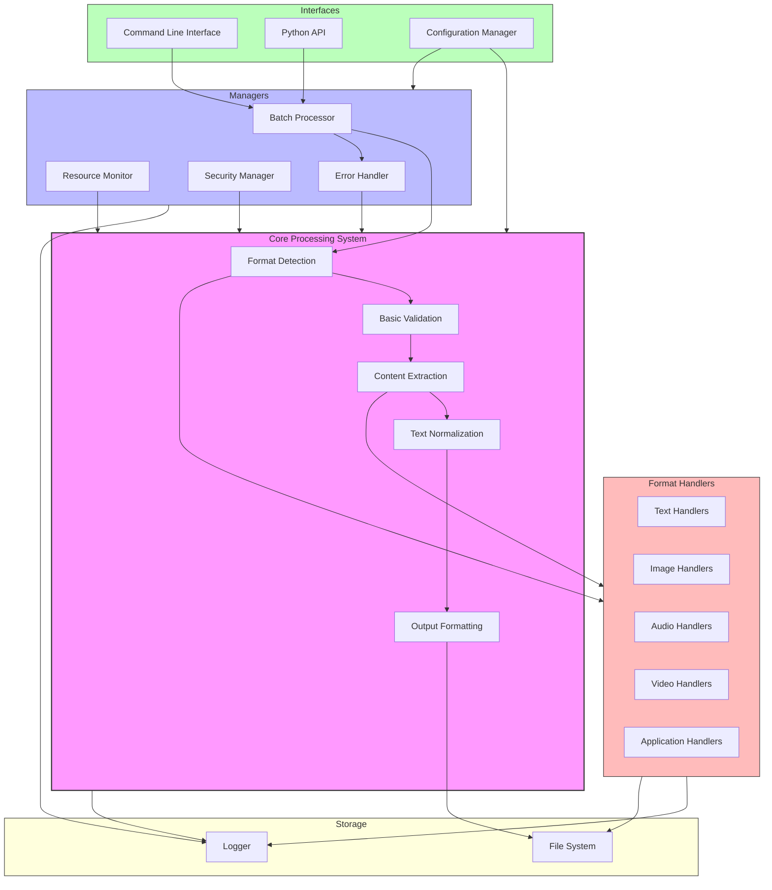
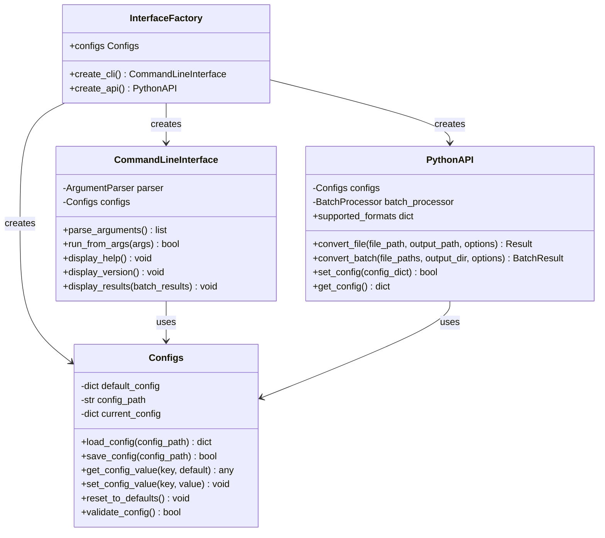
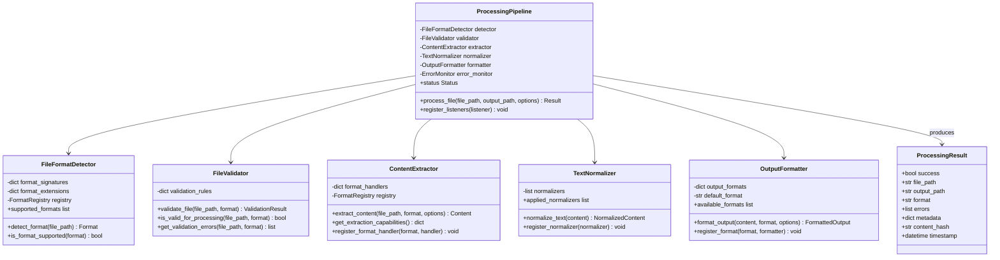
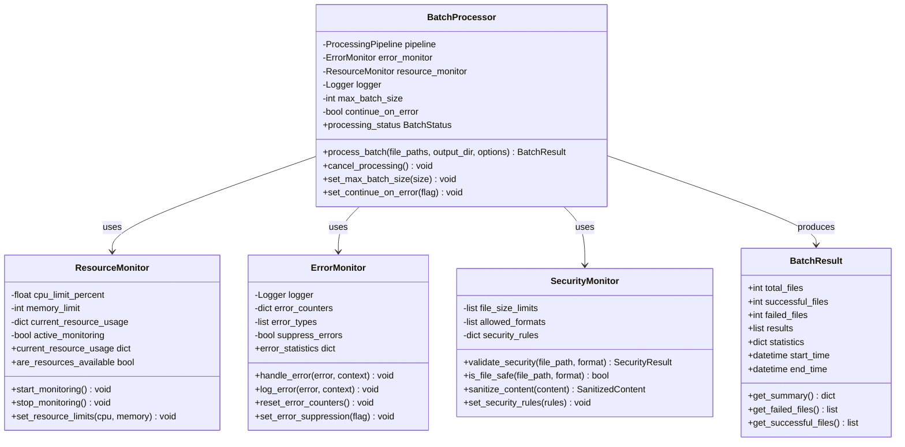
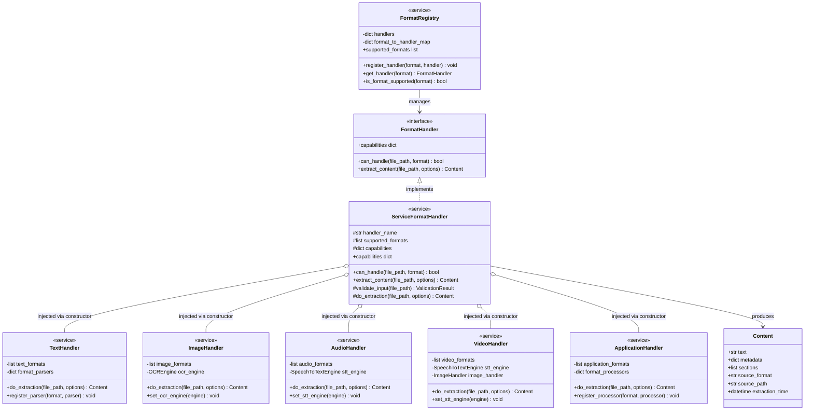
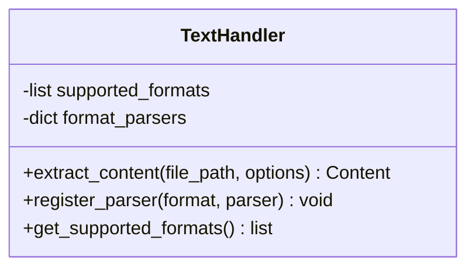
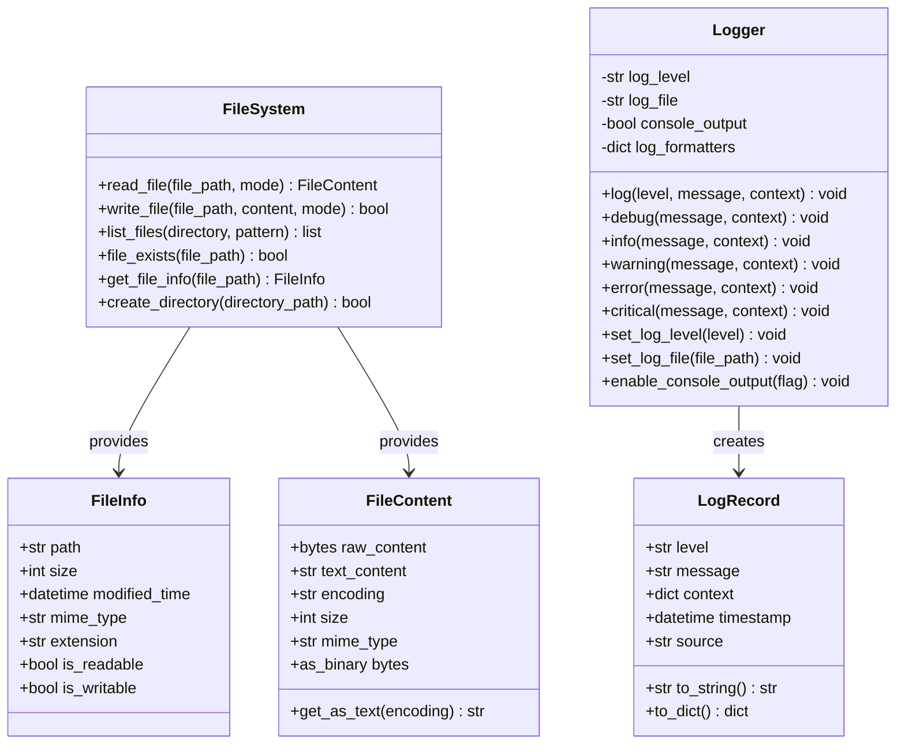

# Omni-Converter:  Core Architecture - Last Updated 5-27-2025

## 1. Format Detection and Handling System
- Simple file signature and extension-based detection
- Direct integration with established libraries for common formats
- Basic format capability registry to track supported formats
- Focus on top 5 formats in each category for initial implementation
- Simple adapter pattern for future extensibility

## 2. Processing Pipeline
- Sequential processing with clearly defined stages:
    - Format detection
    - Basic validation
    - Content extraction
    - Text normalization
    - Output formatting
- Clean separation between stages for maintainability
- Simple logging of processing errors

## 3. Basic Resource Management
- Configurable global limits for memory and CPU usage
- Simple timeout mechanism for long-running processes
- Batch size control to prevent resource exhaustion
- Optional throttling for particularly resource-intensive formats

## 4. Error Handling
- Graceful failure for individual files without crashing batch processing
- Structured error logging with format-specific details
- Basic validation of input files before processing
- Simple skip-and-continue approach for corrupted files

## 5. Security Measures
- Input validation using file signatures and basic content checks
- Reliance on established libraries' security features
- Sanitization of output content
- Configurable limits on file sizes and processing complexity

## 6. Batch Processing
- Simple sequential batch processing with error isolation
- Status tracking for batch jobs
- Summary reporting of successful and failed conversions
- Interruptible processing with progress indicators

## 7. API and Interfaces
- Command-line interface with basic options
- Python API for programmatic access
- Simple GUI interface for future extensibility
- Clean separation of core functionality from interfaces
- Configuration file support for persistent settings

## Future Extensibility Considerations
The architecture is designed to allow for future enhancements:
- Format Support: The format handling system uses a simple adapter pattern that can evolve into a full plugin architecture in the future.
- Resource Management: The basic resource limits can be expanded to a more sophisticated monitoring and throttling system as needed.
- Processing Pipeline: The sequential pipeline can be enhanced to support parallel processing when resource constraints are better understood.
- Error Handling: The simple error logging can evolve into more sophisticated recovery mechanisms based on observed failure patterns.
- Security: The basic security measures can be enhanced with more robust sandboxing as security requirements evolve.
- Quality Assessment: Simple content extraction can be enhanced with formal quality metrics when reference data becomes available.
- Interface: The clean separation of core functionality and interfaces allows for addition of a GUI or other interfaces.

## Architecture Diagram

## 1. Interfaces - Class Diagram

## 2. Core Processing System - Class Diagram

## 3. Managers - Class Diagram

## 4. Format Handlers - Class Diagram

## 5. Handler Example: Text Handler - Class Diagram

## 6. Storage - Class Diagram

