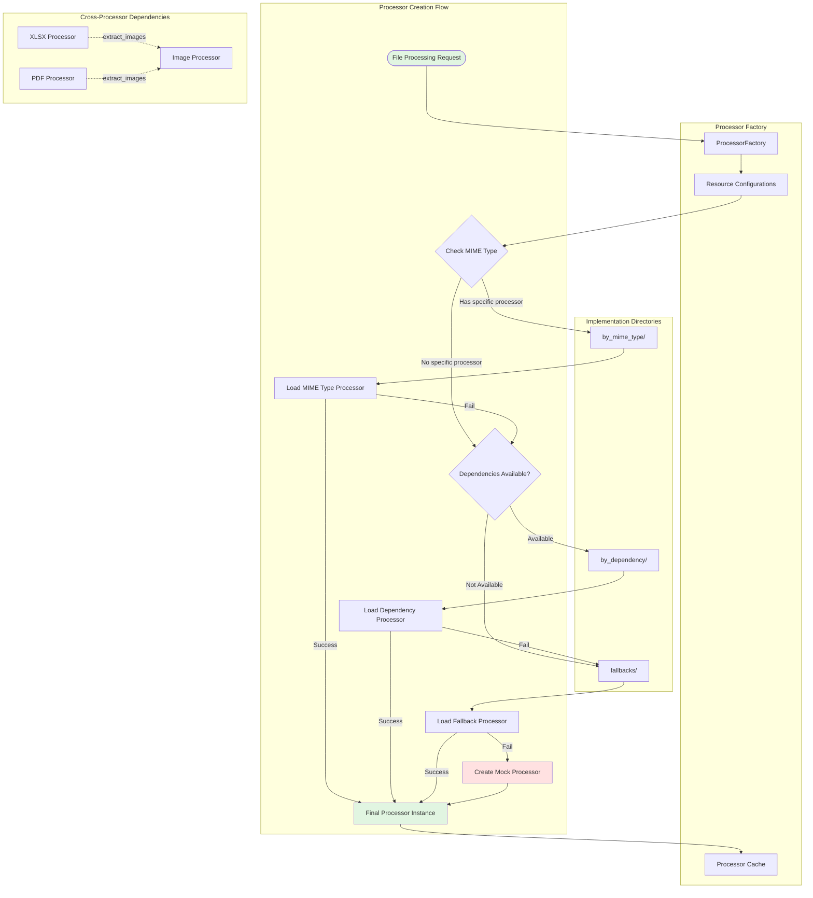
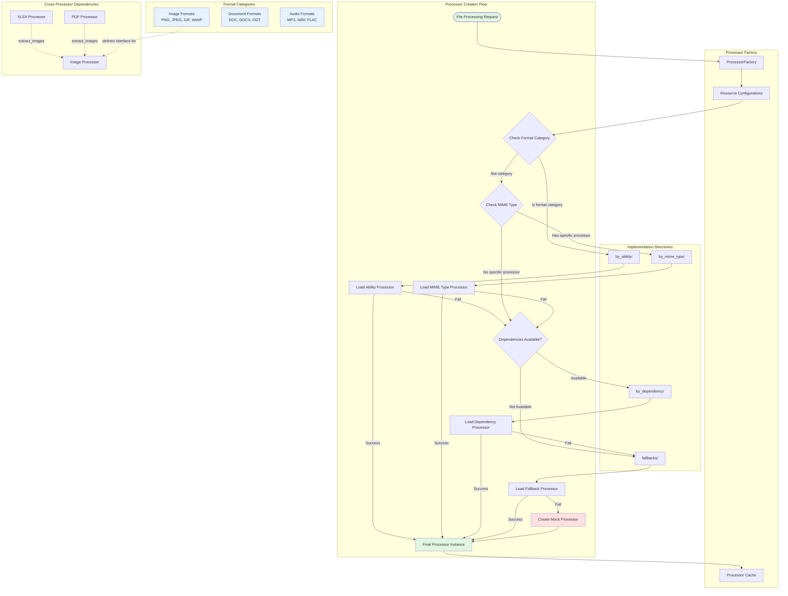

# Omni Converter Processor System Guide

## Overview

The Omni Converter processor system is a flexible, extensible framework for extracting content from various file formats. It uses a three-tier architecture with graceful fallbacks and dynamic dependency resolution.

## Architecture Overview

The processor system consists of three main components:

1. **Processor Factory** - Dynamically creates processors based on available dependencies
2. **Processor Implementations** - Actual code that extracts content from files
3. **Resource Configurations** - Defines what each processor needs and supports

## Processor Types

### 1. File-Type Processors (`by_mime_type/`)
These are specialized processors for specific file formats. They typically contain format-specific logic and may use multiple dependencies.

**Example**: `_xlsx_processor.py`
- Complex class-based implementation
- Handles Excel-specific features (sheets, formulas, named ranges)
- Can delegate to other processors (e.g., image extraction)
- Delegates to dependencies like `openpyxl` or `pandas` for actual data extraction

### 2. Dependency-Specific Processors (`by_dependency/`)
These processors wrap specific third-party libraries and implement the standard protocol.

**Example**: `_bs4_processor.py`
- Wraps BeautifulSoup for HTML parsing`
- Provides standard interface methods
- Handles dependency-specific operations
- Gets libraries through `dependencies` object to facilitate lazy loading and robustness to missing libraries.


### 3. Fallback Processors (`fallbacks/`)
Generic implementations that work without external dependencies. Used when specialized processors aren't available.

**Example**: `_generic_text_processor.py`
- Pure Python implementation
- Basic functionality without external libraries
- Ensures system always has minimal capabilities

## Integration Flow



## The Protocol

All processors must implement the `DependencyModuleProtocol`:

```python
class DependencyModuleProtocol(Protocol):
    def extract_text(data: str | bytes, options: Optional[dict[str, Any]]) -> str:
        """Extract plain text content from the file."""
        
    def extract_metadata(text: str, options: Optional[dict[str, Any]]) -> dict[str, Any]:
        """Extract metadata from the file."""
        
    def extract_structure(text: str, options: Optional[dict[str, Any]]) -> list[dict[str, Any]]:
        """Extract structural information from the file."""
        
    def process(data: bytes | str, options: Optional[dict[str, Any]]) -> tuple[str, dict[str, Any], list[dict[str, Any]]]:
        """Process the file and return comprehensive extraction results."""
```

## Processor Resolution Algorithm

1. **Check for MIME-Type Specific Processor**
   - Look in `by_mime_type/` for `_{format}_processor.py`
   - If found, attempt to load the processor class

2. **Check for Dependency-Based Implementation**
   - Look in `by_dependency/` for processors using available dependencies
   - Load functions that implement critical resources

3. **Fall Back to Generic Implementation**
   - Look in `fallbacks/` for generic implementations
   - These work without external dependencies

4. **Create Mock if All Else Fails**
   - Returns a MagicMock with expected interface
   - Prevents system failure when dependencies are missing

## Resource Configuration Structure

Each processor configuration includes:

```python
{
    "supported_formats": {"xlsx", "xlsm"},  # File extensions
    "processor_name": "xlsx_processor",      # Unique identifier
    "dependencies": {                        # Required packages
        "openpyxl": None,
        "pandas": None
    },
    "critical_resources": [                  # Must-have methods
        "extract_data",
        "extract_metadata"
    ],
    "optional_resources": [                  # Nice-to-have methods
        "extract_images",
        "analyze"
    ]
}
```

## Cross-Processor Dependencies

Some processors can enhance their functionality by using other processors:

```python
dependencies = [
    ("xlsx_processor", "extract_images", "image_processor", "process"),
    ("pdf_processor", "extract_images", "image_processor", "process"),
    ("docx_processor", "extract_images", "image_processor", "process"),
]
```

This means:
- XLSX processor's `extract_images` method will use image processor's `process` method
- Allows code reuse and specialization
- Processors can build on each other's capabilities

## Implementation Patterns

### 1. Simple Function-Based (Fallback Style)
```python
def extract_text(data: str | bytes, options: Optional[dict[str, Any]] = None) -> str:
    if isinstance(data, str):
        return data
    return data.decode('utf-8', errors='ignore')
```

### 2. Dependency-Wrapped Functions
```python
def extract_text(data: str | bytes, options: Optional[dict[str, Any]] = None) -> str:
    if isinstance(data, str):
        return data
    soup = dependencies.bs4.BeautifulSoup(html_content, 'html.parser')
    # Process with BeautifulSoup
    return text
```

### 3. Complex Class-Based (MIME-Type Specific)
```python
class XlsxProcessor:
    def __init__(self, 
                resources: dict[str, Callable] = None, 
                configs: Configs = None
                ) -> None:
        self.resources = resources
        self.configs = configs

        # This must raise an AttributeError if not the selected attribute available
        # Or a TypeError if resources and configs are not provided
        self.path = self.configs.path

        # Initialize dependencies.
        # These must raise key errors if not available
        self._extract_text = resources["extract_text"]
        self._extract_metadata = resources["extract_metadata"]
        self._extract_structure = resources.get("extract_structure", lambda x, y: [])

        # These don't raise any errors, but must return the type expected by the processor
        self._extract_images = resources.get("extract_images", lambda x, y: [])
        
    def extract_text(self, data: bytes, options: dict[str, Any]) -> str:
        try:
            return self._extract_text(data, options)
        except Exception as e:
            self._logger.error(f"Error extracting text: {e}")
    
    ...
```

## Processor Lifecycle

1. **Initialization**
   - Resource configurations are loaded
   - Dependencies are checked
   - Processors are created and cached
   - Fail-fast if critical configurations or injected methods are missing

2. **Request Processing**
   - File format is identified
   - Appropriate processor is retrieved from cache
   - Processor methods are called

3. **Result Generation**
   - Text content is extracted. Must be a string.
   - Metadata is gathered
   - Structure is analyzed
   - Results are returned as a tuple

## Best Practices for Writing Processors

### 1. Implement All Protocol Methods
Even if functionality is limited, provide all four methods:
- `extract_text()` - Return text content
- `extract_metadata()` - Return at least format info
- `extract_structure()` - Return minimal structure
- `process()` - Combine all extractions. Can be a simple wrapper function, or a more complex class method in a class-based processor.

```python

### 2. Handle Multiple Input Types
```python
def extract_text(data: str | bytes, options: dict[str, Any]) -> str:
    match data:
        case str():
            return data
        case bytes():
            return data.decode('utf-8', errors='ignore')
        case _:
            raise ValueError(f"Unsupported data type: {type(data)}")
```

### 3. Use Consistent Error Handling
```python
try:
    return self._extract_text(data, options)
except Exception as e:
    self._logger.error(f"Error extracting text: {e}")
    raise ValueError(f"Error extracting text: {e}") from e
```

### 4. Provide Meaningful Metadata
```python
def extract_metadata(text: str, options: dict[str, Any]) -> dict[str, Any]:
    return {
        'format': 'plain',
        'line_count': text.count('\n') + 1,
        'character_count': len(text),
        'word_count': len(text.split())
    }
```

### 5. Structure Output for Usability
```python
def extract_structure(text: str, options: dict[str, Any]) -> list[dict[str, Any]]:
    return [{
        'type': 'paragraph',
        'content': paragraph.strip(),
        'order': index
    } for index, paragraph in enumerate(text.split('\n\n'))]
```

## Adding a New Processor

1. **Add Configuration** to `_get_processor_resource_configs.py`:
```python
{
    "supported_formats": {"newformat"},
    "processor_name": "newformat_processor",
    "dependencies": {"somelibrary": None},
    "critical_resources": ["extract_text", "extract_metadata"],
    "optional_resources": ["analyze"]
}
```

2. **Create Implementation** in appropriate directory:
   - Complex format-specific → `by_mime_type/_newformat_processor.py`
   - Dependency wrapper → `by_dependency/_somelibrary_processor.py`
   - No dependencies → `fallbacks/_generic_newformat_processor.py`

3. **Implement Protocol Methods**:
```python
def extract_text(data: bytes, options: dict[str, Any]) -> str:
    # Your implementation
    pass

def extract_metadata(text: str, options: dict[str, Any]) -> dict[str, Any]:
    # Your implementation
    pass

def extract_structure(text: str, options: dict[str, Any]) -> list[dict[str, Any]]:
    # Your implementation
    pass

def process(data: bytes, options: dict[str, Any]) -> tuple[str, dict[str, Any], list[dict[str, Any]]]:
    text = extract_text(data, options)
    metadata = extract_metadata(text, options)
    structure = extract_structure(text, options)
    return text, metadata, structure
```

## Debugging Processors

The system includes extensive debugging capabilities:

1. **Enable Debug Logging**:
```python
if self._name == "text_processor":
    self._logger.setLevel(logging.DEBUG)
```

2. **Check Processor Info**:
```python
processor.processor_info
# Returns:
{
    "processor_name": "xlsx_processor",
    "capabilities": {
        "extract_text": {"available": True, "implementation": "native"},
        "extract_images": {"available": False, "implementation": "mock"}
    },
    "supported_formats": {"xlsx", "xlsm"},
    "implementation_used": "openpyxl",
    "dependencies": ["openpyxl", "pandas"]
}
```

3. **Verify Dependency Availability**:
```python
processor.dependency_info
# Returns paths to actual implementation files
```

## Common Issues and Solutions

### Issue: Processor Not Found
**Solution**: Check that:
- File naming follows convention: `_{format}_processor.py`
- File is in correct directory
- Protocol methods are implemented

### Issue: Dependencies Not Available
**Solution**: System will:
- Automatically fall back to generic implementation
- Create mock if no implementation exists
- Log warnings about missing dependencies

### Issue: Cross-Processor Dependencies Failing
**Solution**: Ensure:
- Target processor is properly initialized
- Method names match exactly
- Both processors are in the cache


# Omni Converter Processor System Guide

## Overview

The Omni Converter processor system is a flexible, extensible framework for extracting content from various file formats. It uses a four-tier architecture with graceful fallbacks and dynamic dependency resolution.

## Architecture Overview

The processor system consists of three main components:

1. **Processor Factory** - Dynamically creates processors based on available dependencies
2. **Processor Implementations** - Actual code that extracts content from files
3. **Resource Configurations** - Defines what each processor needs and supports

## Processor Categories

The system organizes processors into four categories, each serving a different purpose:

1. **Ability-Based Processors** - Handle categories of related formats
2. **File-Type Processors** - Specialized for specific formats
3. **Dependency-Specific Processors** - Wrap third-party libraries
4. **Fallback Processors** - Generic implementations without dependencies

## Processor Types

### 1. File-Type Processors (`by_mime_type/`)
These are specialized processors for specific file formats. They typically contain format-specific logic and may use multiple dependencies.

**Example**: `_xlsx_processor.py`
- Complex class-based implementation
- Handles Excel-specific features (sheets, formulas, named ranges)
- Can delegate to other processors (e.g., image extraction)

### 2. Dependency-Specific Processors (`by_dependency/`)
These processors wrap specific third-party libraries and implement the standard protocol.

**Example**: `_bs4_processor.py`
- Wraps BeautifulSoup for HTML parsing
- Provides standard interface methods
- Handles dependency-specific operations

### 3. Fallback Processors (`fallbacks/`)
Generic implementations that work without external dependencies. Used when specialized processors aren't available.

**Example**: `_generic_text_processor.py`
- Pure Python implementation
- Basic functionality without external libraries
- Ensures system always has minimal capabilities

### 4. Ability-Based Processors (`by_ability/`)
These processors handle categories of related formats that share common processing capabilities. They provide specialized interfaces for format groups.

**Example**: `_image_processor.py`
- Handles multiple image formats (PNG, JPEG, GIF, WebP, SVG)
- Provides image-specific methods (OCR, visual summaries)
- Composed from dependencies and fallbacks
- Defines common interface for all image formats

## Integration Flow



## The Protocol

All processors must implement the `DependencyModuleProtocol`:

```python
class DependencyModuleProtocol(Protocol):
    def extract_text(data: str | bytes, options: Optional[dict[str, Any]]) -> str:
        """Extract plain text content from the file."""
        
    def extract_metadata(text: str, options: Optional[dict[str, Any]]) -> dict[str, Any]:
        """Extract metadata from the file."""
        
    def extract_structure(text: str, options: Optional[dict[str, Any]]) -> list[dict[str, Any]]:
        """Extract structural information from the file."""
        
    def process(data: bytes | str, options: Optional[dict[str, Any]]) -> tuple[str, dict[str, Any], list[dict[str, Any]]]:
        """Process the file and return comprehensive extraction results."""
```

## Processor Resolution Algorithm

1. **Check for Ability-Based Processor**
   - Look in `by_ability/` for processors handling format categories
   - Example: Image processor for PNG, JPEG, GIF, etc.

2. **Check for MIME-Type Specific Processor**
   - Look in `by_mime_type/` for `_{format}_processor.py`
   - If found, attempt to load the processor class

3. **Check for Dependency-Based Implementation**
   - Look in `by_dependency/` for processors using available dependencies
   - Load functions that implement critical resources

4. **Fall Back to Generic Implementation**
   - Look in `fallbacks/` for generic implementations
   - These work without external dependencies

5. **Create Mock if All Else Fails**
   - Returns a MagicMock with expected interface
   - Prevents system failure when dependencies are missing

## Resource Configuration Structure

Each processor configuration includes:

```python
{
    "supported_formats": {"xlsx", "xlsm"},  # File extensions
    "processor_name": "xlsx_processor",      # Unique identifier
    "dependencies": {                        # Required packages
        "openpyxl": None,
        "pandas": None
    },
    "critical_resources": [                  # Must-have methods
        "extract_data",
        "extract_metadata"
    ],
    "optional_resources": [                  # Nice-to-have methods
        "extract_images",
        "analyze"
    ]
}
```

## Cross-Processor Dependencies

Some processors can enhance their functionality by using other processors:

```python
dependencies = [
    ("xlsx_processor", "extract_images", "image_processor", "process"),
    ("pdf_processor", "extract_images", "image_processor", "process"),
    ("docx_processor", "extract_images", "image_processor", "process"),
]
```

This means:
- XLSX processor's `extract_images` method will use image processor's `process` method
- Allows code reuse and specialization
- Processors can build on each other's capabilities

## Implementation Patterns

### 1. Simple Function-Based (Fallback Style)
```python
def extract_text(data: str | bytes, options: dict[str, Any]) -> str:
    if isinstance(data, str):
        return data
    return data.decode('utf-8', errors='ignore')
```

### 2. Dependency-Wrapped Functions
```python
def extract_text(html_content: str, options: Optional[dict[str, Any]] = None) -> str:
    soup = dependencies.bs4.BeautifulSoup(html_content, 'html.parser')
    # Process with BeautifulSoup
    return text
```

### 3. Complex Class-Based (MIME-Type Specific)
```python
class XlsxProcessor:
    def __init__(self, resources: dict[str, Callable], configs: Configs):
        self.resources = resources
        self._extract_text = resources["extract_text"]
        # ... other initialization
    
    def extract_text(self, data: bytes, options: dict[str, Any]) -> str:
        return self._extract_text(data, options)
```

### 4. Ability-Based Processors (Format Categories)
```python
class ImageProcessor:
    def __init__(self, resources: dict[str, Callable], configs=None):
        self._supported_formats = {"png", "jpeg", "gif", "webp", "svg"}
        self._extract_text = resources["extract_text"]  # OCR capability
        self._extract_summary = resources["extract_structure"]  # Visual analysis
        
    def process_image(self, data: bytes, options: dict[str, Any]) -> tuple:
        # Handles any supported image format
        text = self._extract_text(data, options)  # OCR
        metadata = self._extract_metadata(data, options)
        summary = self._extract_summary(data, options)  # Visual features
        return text, metadata, summary
```

## Processor Lifecycle

1. **Initialization**
   - Resource configurations are loaded
   - Dependencies are checked
   - Processors are created and cached

2. **Request Processing**
   - File format is identified
   - Appropriate processor is retrieved from cache
   - Processor methods are called

3. **Result Generation**
   - Text content is extracted
   - Metadata is gathered
   - Structure is analyzed
   - Results are returned as a tuple

## Best Practices for Writing Processors

### 1. Implement All Protocol Methods
Even if functionality is limited, provide all four methods:
- `extract_text()` - Return text content
- `extract_metadata()` - Return at least format info
- `extract_structure()` - Return minimal structure
- `process()` - Combine all extractions

### 2. Implement Unified Function Signature.
- All functions take two positional arguments: `data` and `options`.
- `data` can be either a string or bytes, and `options` is a dictionary for additional parameters.
- `extract_text` must return a string or a dependency-specific object (ex: Workbook object for ``).
- ``

```python
- Functions must be pure functions. Same inputs will always yield the same outputs.
- No side effects, no state changes.
- Fail-fast approach for function-based processors, meaning:
   - No error handling outside of the processor.
   - No verification of inputs and dependencies

def extract_text(data: str | bytes, options: dict[str, Any]) -> str | DependencySpecificObject:
    match data:
        case str():
            return data
        case bytes():
            return data.decode('utf-8', errors='ignore')
        case _:
            raise ValueError(f"Unsupported data type: {type(data)}")
```

### 3. Use Consistent Error Handling in Class-Based Processors
- Catch exceptions and log errors.
- Raise `ValueError` with a clear message if extraction fails.
```python
try:
    return self._extract_text(data, options)
except Exception as e:
    self._logger.error(f"Error extracting text: {e}")
    raise ValueError(f"Error extracting text: {e}") from e
```

### 4. Provide Meaningful Metadata
- Return a dictionary with relevant metadata about the content.
- 

```python
def extract_metadata(text: str, options: dict[str, Any]) -> dict[str, Any]:
    return {
        'format': 'plain',
        'line_count': text.count('\n') + 1,
        'character_count': len(text),
        'word_count': len(text.split())
    }
```

### 5. Structure Output for Usability
```python
def extract_structure(text: str, options: dict[str, Any]) -> list[dict[str, Any]]:
    return [{
        'type': 'paragraph',
        'content': paragraph.strip(),
        'order': index
    } for index, paragraph in enumerate(text.split('\n\n'))]
```

## Adding a New Processor

### Option 1: Adding a Format-Specific Processor

1. **Add Configuration** to `_get_processor_resource_configs.py`:
```python
{
    "supported_formats": {"newformat"},
    "processor_name": "newformat_processor",
    "dependencies": {"somelibrary": None},
    "critical_resources": ["extract_text", "extract_metadata"],
    "optional_resources": ["analyze"]
}
```

2. **Create Implementation** in appropriate directory:
   - Complex format-specific → `by_mime_type/_newformat_processor.py`
   - Dependency wrapper → `by_dependency/_somelibrary_processor.py`
   - No dependencies → `fallbacks/_generic_newformat_processor.py`

### Option 2: Adding an Ability-Based Processor

1. **Add Configuration** for the format category:
```python
{
    "supported_formats": {"format1", "format2", "format3"},  # Related formats
    "processor_name": "category_processor",
    "dependencies": {"lib1": None, "lib2": None},
    "critical_resources": ["extract_text", "process_category"],
    "optional_resources": ["analyze_features"]
}
```

2. **Create Ability Interface** in `by_ability/_category_processor.py`:
```python
class CategoryProcessor:
    def __init__(self, resources: dict[str, Callable], configs=None):
        self._supported_formats = resources["formats"]
        # Map resources to category-specific methods
        
    def process_category(self, data: bytes, options: dict[str, Any]) -> tuple:
        # Implement category-specific processing
        pass
```

3. **Implement Protocol Methods**:
```python
def extract_text(data: bytes, options: dict[str, Any]) -> str:
    # Your implementation
    pass

def extract_metadata(text: str, options: dict[str, Any]) -> dict[str, Any]:
    # Your implementation
    pass

def extract_structure(text: str, options: dict[str, Any]) -> list[dict[str, Any]]:
    # Your implementation
    pass

def process(data: bytes, options: dict[str, Any]) -> tuple[str, dict[str, Any], list[dict[str, Any]]]:
    text = extract_text(data, options)
    metadata = extract_metadata(text, options)
    structure = extract_structure(text, options)
    return text, metadata, structure
```

## Debugging Processors

The system includes extensive debugging capabilities:

1. **Enable Debug Logging**:
```python
if self._name == "text_processor":
    self._logger.setLevel(logging.DEBUG)
```

2. **Check Processor Info**:
```python
processor.processor_info
# Returns:
{
    "processor_name": "xlsx_processor",
    "capabilities": {
        "extract_text": {"available": True, "implementation": "native"},
        "extract_images": {"available": False, "implementation": "mock"}
    },
    "supported_formats": {"xlsx", "xlsm"},
    "implementation_used": "openpyxl",
    "dependencies": ["openpyxl", "pandas"]
}
```

3. **Verify Dependency Availability**:
```python
processor.dependency_info
# Returns paths to actual implementation files
```

## Ability Category Examples

### Image Formats
- **Handled by**: `ImageProcessor` in `by_ability/`
- **Formats**: PNG, JPEG, GIF, WebP, SVG, BMP, TIFF
- **Capabilities**: OCR, metadata extraction, visual analysis
- **Composed from**: PIL/Pillow, OpenCV, Tesseract dependencies

### Document Formats
- **Handled by**: `DocumentProcessor` in `by_ability/`
- **Formats**: DOC, DOCX, ODT, RTF
- **Capabilities**: Text extraction, style analysis, embedded media
- **Composed from**: python-docx, libreoffice dependencies

### Audio Formats
- **Handled by**: `AudioProcessor` in `by_ability/`
- **Formats**: MP3, WAV, FLAC, OGG, M4A
- **Capabilities**: Metadata extraction, transcription, waveform analysis
- **Composed from**: pydub, librosa dependencies

### Archive Formats
- **Handled by**: `ArchiveProcessor` in `by_ability/`
- **Formats**: ZIP, TAR, GZ, 7Z, RAR
- **Capabilities**: File listing, extraction, nested processing
- **Composed from**: zipfile, tarfile dependencies

