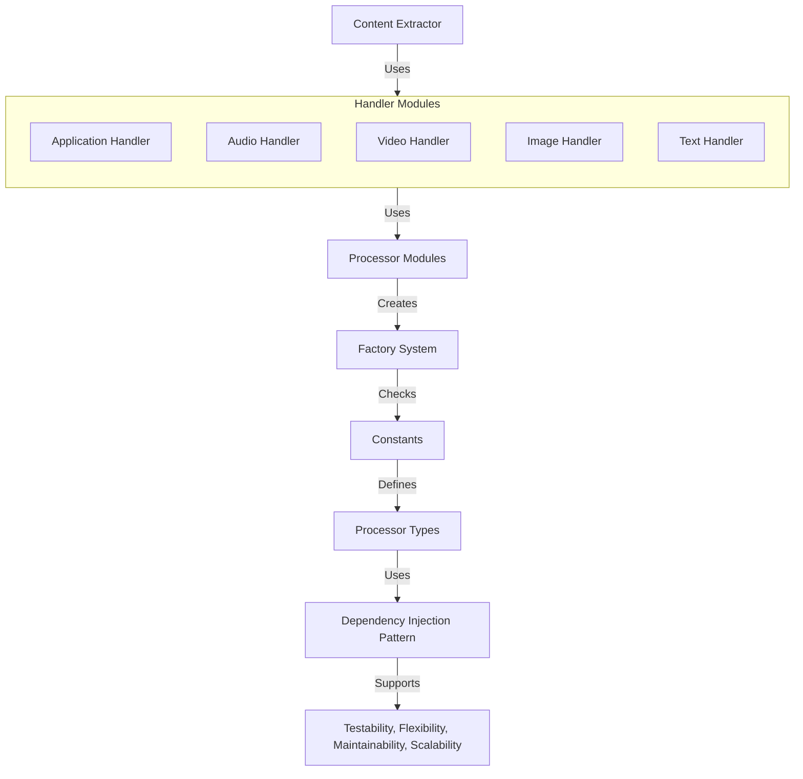

# Format Handlers Architecture

## Overview

The format handlers system uses an Inversion of Control (IoC) architecture with dependency injection to provide flexible, testable, and maintainable file processing capabilities. The system follows the principle that **types determine processors, not processors determine types**.

## Architecture Diagram




## Architecture Components

### 1. Dependency Modules (`dependency_modules/`)

Located in `format_handlers/dependency_modules/`, these modules contain raw functions that directly use third-party libraries:

- **Pattern**: `_<library_name>_processor.py` (e.g., `_openpyxl_processor.py`, `_pil_processor.py`)
- **Purpose**: Isolate third-party library dependencies
- **Contents**: Raw functions like `extract_text()`, `extract_metadata()`, `get_version()`
- **Example**: `_openpyxl_processor.py` contains functions that use openpyxl directly

Imports for these modules are handled dynamically in `dependencies.py`, allowing the system to check for library availability at runtime.
- **Example**: `dependencies.py` checks if `openpyxl` is available and imports `_openpyxl_processor.py` if it is.

```python

### 2. Framework Classes (`processors/`)

Located in `format_handlers/processors/`, these contain framework classes that accept dependencies via injection:

#### By Ability (`processors/by_ability/`)
- `image_processor.py` - General image processing capabilities
- `text_processor.py` - General text processing capabilities
- `video_processor.py` - General video processing capabilities
- `ocr_processor.py` - Optical Character Recognition capabilities

#### By MIME Type (`processors/by_mime_type/`)
- `xlsx_processor.py` - Excel spreadsheet processing
- `pdf_processor.py` - PDF document processing
- `html_processor.py` - HTML document processing
- `xml_processor.py` - XML document processing
- `csv_processor.py` - CSV file processing

### 3. Factory System (`factory.py`)

The central orchestration point that:
- Imports framework classes dynamically
- Imports dependency functions from modules
- Assembles resources dictionaries
- Creates processor instances with dependency injection
- Handles automatic mocking when dependencies are unavailable

### 4. Constants (`constants.py`)

Centralized availability checking and format definitions:
- `LIBRARY_AVAILABLE` properties (e.g., `PIL_AVAILABLE`, `OPENPYXL_AVAILABLE`)
- `PROCESSOR_AVAILABLE` properties (e.g., `IMAGE_PROCESSOR_AVAILABLE`)
- `SUPPORTED_FORMATS_SET` definitions

## Processor Types

### Ability Processors
General-purpose processors that provide broad capabilities:
- **Text Processor**: General text processing across multiple formats
- **Image Processor**: Image processing and frame handling (includes video frames)
- **Video Processor**: Video-specific operations and metadata extraction
- **OCR Processor**: Text extraction from images

### MIME-Type Specific Processors  
Format-specific processors for individual file types:
- **XLSX Processor**: Excel spreadsheet processing
- **PDF Processor**: PDF document processing
- **HTML Processor**: HTML document processing
- **CSV Processor**: Comma-separated value processing

### Processor Hierarchy

```
Specific Processors → Ability Processors → Dependency Modules
      ↓                      ↓                    ↓
   xlsx_processor  →  image_processor  →  _pil_processor.py
                           ↓
                   (video frames)
```

**Example**: XLSX files with embedded images:
1. `xlsx_processor` processes the spreadsheet structure
2. When images are found, calls `image_processor` 
3. `image_processor` determines image type and calls appropriate dependency module
4. Results are integrated back into XLSX processing

## Dependency Injection Pattern

### Standard Pattern

All processors follow this exact pattern in `factory.py`:

```python
# Processor Name
if Constants.PROCESSOR_NAME_AVAILABLE:
    processor_resources = {
        "supported_formats": Constants.SUPPORTED_FORMATS_SET,
        "processor_name": 'processor_name',
        "dependencies": {
            "library_name": Constants.LIBRARY_AVAILABLE,
            "fallback_lib": Constants.FALLBACK_AVAILABLE,
        },
        "critical_resources": [
            "extract_text", "extract_metadata", "get_version"
        ],
    }
    processors["processor_name"] = make_processor(
        processor=processor_resources["processor_name"],
        dependencies=processor_resources["dependencies"],
        supported_formats=processor_resources["supported_formats"],
        critical_resources=processor_resources["critical_resources"],
        configs=configs,
    )
```

### Multi-Dependency Fallback

Dependencies are checked in priority order. If the first dependency fails, the system tries the next:

```python
"dependencies": {
    "openpyxl": Constants.OPENPYXL_AVAILABLE,  # Try first
    "pandas": Constants.PANDAS_AVAILABLE,      # Fallback option
}
```

### Automatic Mocking

When no dependencies are available, the system automatically creates mock processors for:
- **Testing purposes**: Consistent interface for unit tests
- **Graceful degradation**: Application continues to function with limited capabilities

## Benefits

### 1. Testability
- Dependencies can be mocked or stubbed easily
- Each component has clear, injectable dependencies
- Unit tests can focus on business logic without external dependencies

### 2. Flexibility  
- Support multiple libraries for the same functionality
- Easy to add new processors without changing existing code
- Runtime dependency availability checking

### 3. Maintainability
- Clear separation between framework logic and library-specific code
- Consistent patterns across all processors
- Centralized dependency management

### 4. Scalability
- Easy to add support for new file formats
- Processor hierarchy allows code reuse
- One factory handles all processor creation

## Usage Example

```python
# Factory creates processors with proper dependencies
processors = make_processors()

# XLSX processor automatically uses available dependencies
xlsx_processor = processors["xlsx_processor"]

xlsx_has_images = xlsx_processor.has_images()

# If images are found, it delegates to image processor
if xlsx_has_images:
    image_results = processors["image_processor"].process_images(image_data)
```

## Extension Points

### Adding New Processors

1. **Create dependency module**: `dependency_modules/_new_library_processor.py`
2. **Create framework class**: `processors/by_mime_type/new_format_processor.py`  
3. **Add constants**: Update `constants.py` with availability checks
4. **Register in factory**: Add processor entry to `factory.py`

### Adding New Dependencies

1. **Update dependencies.py**: Add library availability check
2. **Create processor module**: Implement functions using the library
3. **Update constants.py**: Add availability property
4. **Update factory.py**: Add to dependencies dict for relevant processors

This architecture ensures the system remains flexible, testable, and maintainable while supporting a wide range of file formats and processing capabilities.